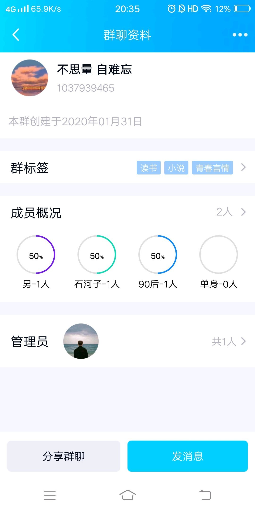
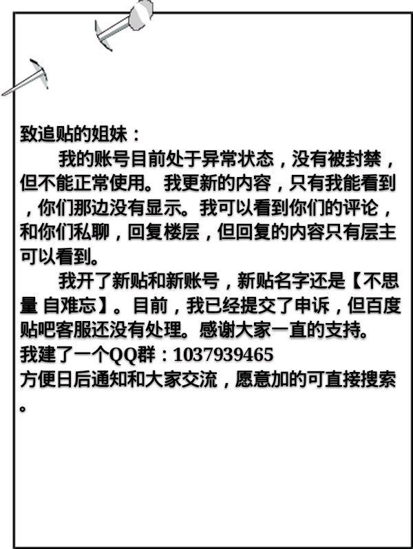
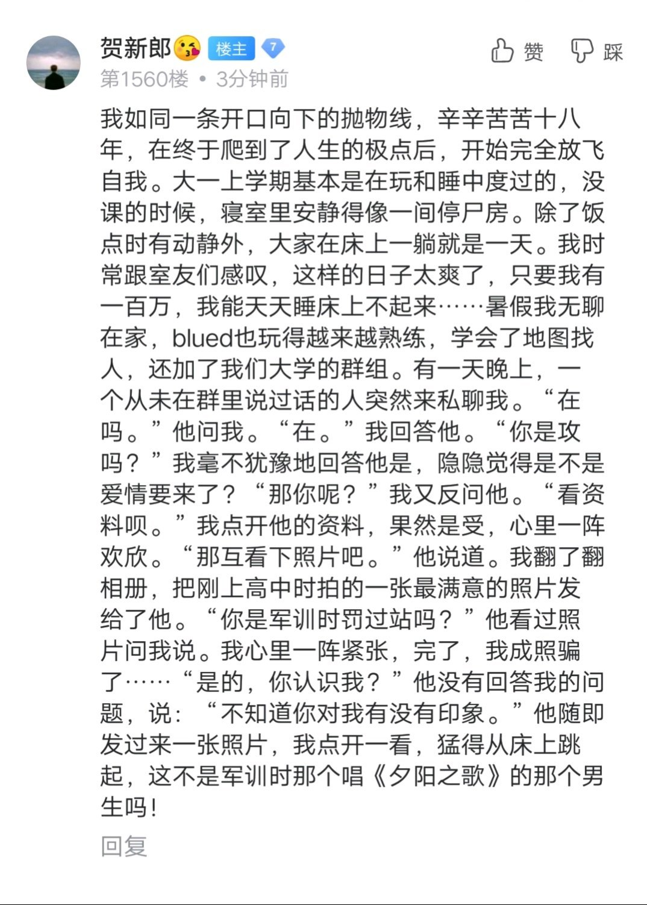

去年今日此门中，人面桃花相映红。  
人面不知何处去，桃花依旧笑春风。

            1楼 | 贺新郎😚 | 2019-12-22 09:57

谨以此贴献给自己和远隔万里的他。

            2楼 | 贺新郎😚 | 2019-12-22 09:58

我出生在河南最南边的一座城市，淮河从这里经过，所以它不属于南方，也不属于北方。我们这里没有什么工业，所以经济也不是那么发达。我的父母从我三岁起就外出打工了，我是跟着奶奶一起长大的，还有一个姐姐。我家住在收费站旁边，“距收费站500米”的牌子就立在我家门口。“距收费站1000米”的牌子立在的是明理家门口。

            3楼 | 贺新郎😚 | 2019-12-22 09:59

明理是我的小学同学、邻居也是我的亲戚，按辈分我应该叫他表叔，所以上小学时，他经常在班上喊我“大侄子”，这个时候都会被我追着一顿暴揍。其实我跟他是没有什么血缘的，只是因为这里是我奶奶的娘家，我奶奶家跟他爸爸家好像上八辈是一个祖宗的，所以算的上同姓远方表亲。记得有一次明理在我家叫我大侄子，我说了一句“\*\*八辈子祖宗的”，被我奶奶一顿暴打。

            4楼 | 贺新郎😚 | 2019-12-22 09:59

我从小就喜欢跟着明理一起鬼混。因为我和我姐姐只相差了三岁，两个人经常争电视、吵架，所以关系并不怎么好。我奶奶一到下午就准时出去打麻将了，家里又只有我姐姐，所以我不怎么愿意待在家里，一有空，就往明理家跑。从“距收费站500米”到从“距收费站1000米”，是我童年走过的最熟悉的路。

            5楼 | 贺新郎😚 | 2019-12-22 10:00

我家旁边有个倒闭了的冰棒厂，和我家就只有一墙之隔。冰棒厂大门是开着的，里面都是些破旧的厂房。小时候我跟明理经常一起去里面拉屎，因为我俩都嫌家里的茅坑太脏了。每次明理都会在我家门口挥着卫生纸示意我，然后我随便扯点纸就跑过去跟着他溜进冰棒厂了。

            6楼 | 贺新郎😚 | 2019-12-22 10:00

后来我们在冰棒厂发现很多废铜烂铁，于是就想着拿去废品站卖钱。就这样，我们连续清了一个月，每天都能卖一两块钱，然后拿来买冰棒和辣条吃。我喜欢吃大头雪糕，他每次都是买那种一个袋子里有两个的，自己吃一根，再分我一根。我问他为什么分给我，他嘿嘿地笑，说他妈不让多吃那么凉的。我就说你妈又不会知道，我不会告状的，他就又嘿嘿地笑，说：“你吃嘛，给你还不好，话多。”后来，我们就开始在路上捡废铜烂铁了，两个人一个人拿塑料袋，另外一个拖着系着吸铁石的绳子四处吸，每天也能收获满满。那时候的夏天真热啊，是那种像滴一滴油在水里泛起彩虹色腻的那种油腻、那种热。随着经验的丰富，我们开始用蛇皮袋子装，里面再装些沙和石头，这样就可以增加重量。后来还直接去废品站捡，废品站老板娘看到也不会怪我们，不过每次称重算钱的时候都会说：“你们厉害啊，从我这捡，还卖给我。”

            7楼 | 贺新郎😚 | 2019-12-22 10:01

虽然我和明理好的像穿一条裤子一样，但一件事使我们之间的友谊出现了巨大的裂痕。那是我六岁的时候，我妈过年从外地打工回来，开年就要走了。我当时很依恋我妈，因为一年相处的时间不到十天，对于当时年幼的我来说，每一次分别都是那么刻骨铭心。只要听说我妈要回来，我都会搬个凳子坐过道旁边等她，看到一辆大巴车停下，就赶紧跑过去看是不是她下车了。那一年，我知道我妈会像往年一样，差不多大年初五、初六就走了，所以我跟的格外的紧，身怕她偷偷跑了。大年初五那天，明理来我家拜年，明理说：“琪，你来我家摘葡萄吃吧，我们家葡萄熟了。”我知道明理家有根葡萄架，犹豫着要不要去，明理拖着我说：“走吧，可甜了。”于是，我就跟着他去了他家。我径直走进后院，想着摘了赶紧回去，因为我妈每次走都会找各种理由把我支开。我在后院寻了一圈也没看到，就问明理：“葡萄在哪啊？”明理指着枯着的葡萄架说：“那是葡萄架。”听他这么说，我的眼泪已经在眼眶里打转：“葡萄呢？”明理低声说：“还没熟……”“你骗我！”我嚎啕大哭，扭身往家跑，明理一把抱住我：“你妈要出去挣钱！”我使劲挣开他，哭着对他说：“你根本不知道我怎么把她等回来的！”说完，我就一口气跑回家了，我妈走了……从此，我决定和明理是路人。

            8楼 | 贺新郎😚 | 2019-12-22 10:01

和明理绝交的第一个月，明理每天都会在我家门口挥着卫生纸要我出来，我每次看到他都会扭过身去，他见我拒绝，时常都会站在原地，像一个风中的稻草人。每次奶奶总是看不过去，招呼他进来，明理就会站在马路上对着屋里喊：“不用了大姑，他不出来，我就走了！”于是，明理就一个人去了冰棒厂。我通常都会躲在后院的一个角落观察他，他没有上厕所，而是在冰棒厂偌大的院子里无聊地闲逛。我还好几次看到他偷偷抹泪，他无可奈何，又无所适从，如一只草原上战败的公鹿，呦呦的鹿鸣只能叫给自己听。

            9楼 | 贺新郎😚 | 2019-12-22 13:59

他的无助与可怜没有引起我的丝毫同情，甚至看到他难过的样子我的心里有一丝窃喜和快感。每当深夜想起我妈又一次不辞而别时，那种对明理的恨意就会多一分。我恨他作为我最好的朋友，合着我妈一起骗我。但我内心深处更恨的是他能有父母在身边。每次我去他家，都能看到他的父母，无论他的父母对他疼爱还是打骂，都是我所羡慕的，这是我苦苦哀求所不能得到的。他每天和他的父母生活在一起，而我见我的父母一面，却要等待一年的煎熬。他是明知我对父母的思念，又怎忍心来骗我？嫉妒和仇恶蒙蔽了我的双眼，我不想也不愿看清一切，我不愿原谅明理，因为我还在思念远方的亲人。

            11楼 | 贺新郎😚 | 2019-12-22 14:18

            12楼 | 贺新郎😚 | 2019-12-22 14:19

和明理绝交一个月后，明理不再来找我了，奶奶问我明理怎么不找我玩了，我沉默不语，不知如何开口。姐姐对奶奶说：“能有什么，小两口闹别扭了呗！”听了这话，我红煞了脸，赶紧跑开了。我跑到后院，坐在二楼的楼梯上，呆望着空荡荡的冰棒厂，明理已经好久没来过这里了。他来找我，是我弃绝了他，如今他不来了，倒像是我被弃绝了。内心的孤独感，让我发冷，我想我到底要不要去找明理和好，到底该不该原谅明理，明理是不是再也不会来找我了……想着想着，我在沉沉的余晖下昏沉沉地在楼梯上睡着了。等我醒来夜已深了，天上已是挂满了星星。我不知自己躺在楼梯上，睡了多久。四周黑漆漆的，令我害怕。深夜的凝露滴在了我的心上，我难过即使自己不见踪影，也无一人来找我，星星尚有一片热闹的天地闪烁，而这世界似乎只剩下我一个人……

            13楼 | 贺新郎😚 | 2019-12-22 14:45

又过了一个月，我在后院听到了隔壁冰棒厂有明理的声音，我赶紧跑上二楼楼梯看明理是不是在里面。明理确实是在冰棒厂，但他这次不是一个人。除了他，还有三五个同村的，他们在玩“跳格子”，明理笑的那么开心。我赶紧下了楼，冲出了后院，躲进了房间，偷偷哭了起来。明理有了新朋友，他再也不需要我了……

            16楼 | 贺新郎😚 | 2019-12-22 14:59

我没有像明理一样去找新的玩伴，因为我总怕出门会碰到他。百无聊赖，抢电视又抢不赢，我拿起姐姐二年级的书本看。上面的内容虽然看不懂，但我着实被吸引了。我想学会这些，我的内心告诉我。所以从此之后，姐姐写作业我都会在旁边看着，姐姐也很快教会了我简单的汉字，数100个数，加减法和拼音。这些东西使我充实，我不再那么在乎明理什么时候再来找我了。6月份，我打电话给父母，向他们提出了我想上学的想法，父母有些惊讶，因为我才6周岁，上一年级要7周岁才行。父母商议了一下，同意让我去上学，说让奶奶去学校问问。第二天，我跟着奶奶去了学校。奶奶在学校七听八问，找到了一个老师，那个男老师戴着金丝眼镜，肚腩微微凸起，皮鞋擦得锃亮，和这个镇上的农民迥然不同。奶奶向男老师说明了来意，看了一眼我，问我上过幼儿园吗？我不知道幼儿园是什么，随口说了句，上过。他又问我墙上的字是什么，我说：“好好学习，天天向上。”奶奶惊讶地看着我，男老师点了点头说：“9月份直接来报道就行。”就这样，我即将开始了我的小学生涯，而明理或许还要等到明年，我不想看到他。

            18楼 | 贺新郎😚 | 2019-12-22 15:38

姐妹们 上午参加学院里讲课比赛 等我忙完再更新哈

            24楼 | 贺新郎😚 | 2019-12-23 02:43

2004年9月1号，我正式成为了一名小学生。那一天，我早早起来换好新买的衣服和鞋子，装好头一天买好的作业本和铅笔。奶奶这天早上煮的六丁目方便面里给我加了两个鸡蛋。当背上书包，走出家门的那一刻，我如释重负。这段新的生活开始，我期待已久，当它真正来临的时候，我内心却有些惶恐。我在怕什么？我问自己。明理的身影在我的眼前晃来晃去……

            31楼 | 贺新郎😚 | 2019-12-23 09:23

我、姐姐还有奶奶，我们三人穿过拥挤的集市来到了镇上的小学。姐姐一个人去三年级教室了，我跟着奶奶去了一年级教室报到。当我推开一年级教室门的时候，我惊住了，明理就坐在座位上。我盯着他，他望着我，数秒后他起身跑到我身边，对奶奶说：“大姑，你们来了，让琪坐我旁边吧！”奶奶听后连连说好，把我往明理位置上推，我一动不动。明理见我不乐意，就拽着我说：“来吧，先坐下再说！”教室人多我不好发作，明理又一直拽着我不放，我只好提着书包，坐在他位置的旁边了。奶奶见一切都妥当就说先回家了。我和明理静静地坐在位置上，一动不动。随着时间的推移，来的人也越来越多了。教室里充满了哭声，父母的打骂声，很多孩子都哭着要回去，不想上学。尽管人声鼎沸，但我和明理之间的气氛已降到了冰点。突然，三五个家长朝我们围了过来，指着我们说：“这俩小孩儿真够听话的，一点也不哭闹。”明理听了这话，嘿嘿地朝他们笑了笑。我还是坐那不动，在心中策划着，什么时候换个位置。明理笑完后就把脸凑过来，拉着我说：“我们出去吧！这里好吵。”我望着他，犹豫了一下，再看向四周，已是十几个家长盯着我们俩，于是我跟着他出去了。

            33楼 | 贺新郎😚 | 2019-12-23 12:07

路上我们还是不说话，明理欲言又止，几度想开口，又把话咽了回去。我默默跟在他身后，像一个任人摆布的木偶。我们来到了学校的小树林，这里比学校其它地方凉快了不少，站在这里人也顿时觉得舒服很多。明理一下子噗通一声跪在我面前，我吓了一跳，赶紧叫他起来，明理说：“你不原谅我，我就不起！”我怕人看到，就说：“你快起来吧，等下让人看到了。”明理还是直挺挺地跪着，他眼里含着泪水，我心软了。我说：“你起来吧，我原谅你了。”明理哭了，他站起来，擦了擦眼泪，笑着跟我说：“不许反悔！”他接着说：“我知道我不该合着你妈骗你，但你妈总是要出去挣钱的，我要是知道你因为我骗你这么生气，打死我我也不会帮\*\*\*！”我说：“院里的葡萄熟了吗？”明理笑着说：“这回熟了！放学就去我家摘！”我哭了。

            34楼 | 贺新郎😚 | 2019-12-23 12:24

放学的路上，我问明理怎么也来上学了，明理说是听我奶奶说我要上学，所以他才上的。听了这话，我心里流淌着一股暖流，他还是在意我的。我又问，你的新朋友呢？明理问我什么新朋友，我说跟你一起跳格子的，明理嘿嘿地笑，说在冰棒厂跳格子是为了故意气我的，我狠狠打了他一下，明理又说：“再说，一起玩的，又不一定是朋友！”我释然了，笑着跟他说：“以后不许再合着我妈骗我！”明理激动地说一定，一定！就这样，我们和好了。

            36楼 | 贺新郎😚 | 2019-12-23 12:37

明理每天都会跟我一起上下学，他每天早上都会来我家家门口等我，然后我们一起去街上吃碗热干面或米线。街上那家米线真好吃，汤底是鸡汤弄的，配料有芝麻、花生米还有一些葱花和香菜等等，每次吃完，嘴巴里都有一股回香。但我总觉得，吃米线喝汤很没出息，而且总觉得自己喝碗里的汤时，有人盯着自己。这个想法我现在还有，所以吃桶装方便面的时候，人多的时候，我还是不喝汤的，总觉得吃的干干净净会被人瞧不起。明理看破了我的想法，他说：“我们比赛谁吃得干净好吧！”我笑着答应了。从此以后。这家早餐店早晨六点半的时候，都能准时看到两个舔碗少年。

            37楼 | 贺新郎😚 | 2019-12-23 13:05

我每天中午吃过饭，都会去找明理一起去上学。明理的妈妈每天中午都会让明理喝一瓢热开水，他喝完我们才能去上学。明理每次捧着湖蓝色的塑料瓢，都是一脸的不情愿，但他妈妈还是要求他每天都要喝，让他补充水分。每次看他喝水，其实我内心中也想尝尝那水啥味，因为那是他妈妈要求他喝的。我想如果我妈能要求我每天喝一瓢水，我肯定会喝的。有一次，明理剩了大半瓢水没喝，就拉着我准备去上学了。他妈妈看到后，把他拦住了说：“天天身在福中不知福，你问问琪每天在家他奶奶要求 他喝水不？”这句话一下子刺痛了我的自尊，我的脸涨红。明理看我脸色不对，赶紧喝了剩下的半瓢水，拉着我出门了。明里说：“我妈嘴直，你不要听她瞎说。”我笑了笑说：“没事啊，你妈说的是实话。”我撇过头，偷偷擦掉未滴落的眼泪。

            40楼 | 贺新郎😚 | 2019-12-23 15:09

一年级的学习内容，在未上学前我都已深谙在心，老师随意点拨，我就能倒背如流。我成了老师口中的天才，整个小学差不多都知道在一年级有一个智商超群的人。我隔三差五在早上被老师点起来在送孩子的家长面前表演数100个数、口算等等。这是我人生的高光时刻，在那些赞扬和惊叹的目光中，我的性格也开朗了不少。明理很佩服我，他时常对我说：“我们从小一起长大，为啥你比我聪明这么多！”每次我“表演”结束，明理比我还激动，对着那些家长们说：“厉害吧？厉害吧？今天还不算最厉害的！嘿嘿！”我每次都被他这滑稽的举动，窘得脸通红。

            43楼 | 贺新郎😚 | 2019-12-23 15:27

我的过分惹眼，使我遭来了班上部分同学对我的不满。他们对我的“不满”是出于人之长情的嫉妒，更重要的是我的“表演”给他们带来了深深的困扰。每次当他们的父母早上看到我的表现时，晚上回去都会要他们来一遍，他们通常是不会的，所以总是被打骂。他们迁怒于我，我的作业本经常被划破，书包经常被扔进垃圾桶，甚至有的同学以捉弄我为乐趣，在我不注意时偷偷踹我一脚，等我回头时，已经一溜烟跑了，再继续走路，背后又传来一阵讥笑。明理知道我被欺负，总是冲在前面替我收拾那帮人，于是，他就成了老师眼里调皮捣蛋的“刺头”。有一次，我的书包再次被扔进了垃圾桶，明理捡起我的书包嘭的一声扔在讲台上，他掏出了一把削铅笔的小刀，大声对着全班喊：“谁以后再敢欺负琪！我就捅死谁！我反正是不怕死的！”全班鸦雀无声，那些欺负过我的同学，显然被这阵势吓到了。那一刻，我望着讲台上的明理，他涨红的脸上，浸着汗珠，在日光投射下，闪闪发亮，他是我的盖世英雄。

            47楼 | 贺新郎😚 | 2019-12-23 16:11

明理讲台上的举动，显然震慑住了那帮欺负我的人，他们收敛了很多。这也让明白了对待有些人只能用以暴制暴的方法。我开始厌倦和排斥被老师点起来“表演”，但我无法抗拒，我以为“好学生”就是要听老师话的。某个早晨，我再次被老师叫起来倒背100个数，当我背到一半时，我的抵触情绪占据了我的全部心理，我停下了，站在座位上一动不动，围观的家长们也惊讶我怎么了，老师万般鼓励我还是一声不吭，像个木头桩子一样。一直僵到快上课了，家长们只好走了，这一次他们显得很扫兴，有好几个家长都说“什么天才啊，不过如此！”老师见我这幅表现，重重说了一句“坐下！”，夺门而出。从此之后，老师再也没过找我“表演”了，我再也不用当一只被围观的猴子，但自此，我被拉下了神坛。

            49楼 | 贺新郎😚 | 2019-12-23 16:36

淮河里沉积着很多泥沙，所以我家附近沙场林立。隔壁邻居胖老太儿家就是开沙场的。老太儿是我们这里的方言，一般爷爷奶奶的长一辈叫老太儿。胖老太儿很胖，差不多二百多斤，她一坐那时特别像一个巨大的磨盘。这个磨盘应是白色大理石锻造的，因为胖老太的皮肤白到反光。而她的丈夫瘦小黝黑，所以被我们叫做“瘦老太儿”。胖老太儿和瘦老太儿辈分特别高，明理叫他们老太儿是没错的，但我应该叫他们曾老太儿或老老太儿。但在我童年的时候，我对辈分分的不是很清楚，也没有人纠正过我，所以我也跟着明理叫他们老太儿。多年之后，我才从这“胖”、“瘦”二字中读出讥笑和嘲讽。

            54楼 | 贺新郎😚 | 2019-12-24 02:05

下午搬家 晚点更

            57楼 | 贺新郎😚 | 2019-12-24 07:37

有厦门的姐妹吗 想出去散散心 厦门有什么好玩好吃的吗

            59楼 | 贺新郎😚 | 2019-12-24 16:16

胖老太儿家的沙场在收费站旁边，也是我和明理的常去之处。沙堆成一座小山，我和明理经常拉着手从“山顶”滑下来，然后又吃力地深一脚浅一脚地爬回“山顶”，两个人乐此不疲。有时我们也会在沙场拉屎，一座座沙山形成了天然的屏障，完全不用担心有人会看到。肚子里未消化的种子会在这里生根发芽，沙场有许多拳头大的小西瓜。明理有一个梦想，他希望连绵的沙山上种满桃树，我们两个可以永远生活在这桃林之中，春季吃桃花、夏季吃桃子、秋季吃落叶、冬季吃凝霜。明理喜欢吃桃子，所以他才会有这样的梦想。他每次吃桃子都会把核留着，然后去我家叫我，一起去沙场栽培。但种下的桃核终究没有一个成活下来……

            60楼 | 贺新郎😚 | 2019-12-25 05:55

胖老太儿怕半夜有人偷沙，所以在沙场前支了一个棚子。棚里有一个凉床，我和明理经常躺在上面睡觉。有一天，我们俩躺在凉床上聊天，明理问我：“你喜欢和我玩吗？”我有点惊讶他如此直白地问我这样的问题，不过我还是毫不犹豫地说：“喜欢啊，怎么？”明理眼里露出了笑意，不过他随即又害羞起来，支支吾吾地说：“你可以答应我一件事吗？”我说：“你得先说什么事，我才能答应。”明理哀求着说：“你先答应吧。”我怕他使诈，就一定让他先说什么事。他拗不过我，就沉默了。他不停地扯着自己的衣襟，脸也通红，似乎很紧张的样子。我看他好像不大对劲，就问他怎么了。明理拉着我说：“我说完你不许生气。”我答应了他。他说：“我可以亲一下你吗？”

            61楼 | 贺新郎😚 | 2019-12-25 06:14

听了这话，我顿时被吓到，脑子里浮现的全是跟着姐姐一起看的琼瑶剧里的画面。每次看到电视里的接吻镜头，我都会害羞地把脸撇开，尤其是奶奶在的时候，我恨不得找个地缝钻进去。不过对于亲吻的期待，在我心灵的最深处或许是有的，但当明理这么直白地说出来时，我犹豫了。因为电视里接吻的不都是一男一女吗？两个男的还能接吻？而且这不是大人才能做的事情吗？我心里很乱，没有回应明理。明理很失落，他恳求着说自己是开玩笑的，要我不要生他的气。见他这副可怜样子，再加上我心里实在好奇，就小声对他说：“行，你亲吧。”明理听了我的话后，一下子朝我扑了过来，把我压倒在他的身下。他的唇重重地落在我的唇上，开始使劲地亲吻我。他如一头凶兽一般，在大快朵颐地享受着自己的猎物。而我浑身发烫，一个大气也不敢出。因为他的太用力，他的牙齿好几次硌到了我的嘴唇，我们四目相对时，他的眼里传来了些许的歉意。我第一次那么近距离观察他的眼睛。他的眼睛是双眼皮，睫毛是那么的修长，瞳孔周围微微泛着红血丝，眼里含着一汪清水，他的歉意传达出来时，我的心中不知哪里积蓄了一股力量，使我开始回吻他……

            63楼 | 贺新郎😚 | 2019-12-25 06:49

一个大大的请求：我本人是一个很粗心的人，而且极度不喜欢麻烦，我希望有姐妹在看贴子的时候，能帮我备份一下。这个贴子可能要更很久，我怕中途突然被删贴，到时我可能没有耐心再重头写一遍了。拜托了

            72楼 | 贺新郎😚 | 2019-12-25 08:39

一个小小的说明：一些姐妹私聊我，让我写一些略带颜色的精彩刺激的故事。我想说我在丫吧也喜欢看那些

            73楼 | 贺新郎😚 | 2019-12-25 08:51

明理后来想亲我，又求过我几次，但我实在觉得太羞耻，就拒绝了，明理也没再提过。这么多年来，我们始终都对那天的事闭口不谈，好似从来都没有发生过……

            77楼 | 贺新郎😚 | 2019-12-25 10:28

时光荏苒，一年级很快就结束了，迎来了我和明理期待已久的第一个暑假。那时候的夏天热的人无处躲藏，家里的电风扇吹的是热风，外面更是晒得炕人。我和明理傍晚总是会去胖老太儿家的沙场，因为“沙山”顶上凉快，傍晚也没什么蚊子。那一天，明理和我一起坐在沙山上聊天，他问我：“琪，你说有一天我们会不会分开？”我说：“怎么会呢？我们是同学啊！而且还住那么近。”明理又说：“住得近，也可能搬走的。”我笑着说：“反正我不会搬！嘿嘿！”明理也笑了。他从兜里掏出一串手链给我，手链是用贝壳串成的，中间是橡皮筋。他搂着我说：“送给你！洞我实在钻不动，让我大伯用小电钻钻的，不过贝壳可是我在沙场的沙堆里亲自捡的！”我接过手链，望到了他脖子上戴着一粒贝壳。我把手链戴在了手上，看着大小不均的贝壳说了句：“真丑！哈哈！”明理作势要打我。

            79楼 | 贺新郎😚 | 2019-12-25 11:25

当他起身的那一刻，我们同时注意到了铲斗就在我们头上，一铲沙即将朝我们落下。明理用力踢了我一脚，把我踹下了沙山，他匍匐在沙堆上，准备滑下去。但一切都来不及了，一铲斗的沙重重地压在明理身上，他被埋了……

            80楼 | 贺新郎😚 | 2019-12-25 11:40

我在沙山下吓得两腿发软，大哭起来。我一边哭喊着“明理！明理！”，一边往山顶上跑。我的哭声惊动了山那面的铲车司机，他呼叫着“好像埋了人了！埋了人了！”。铲车司机和我同时到达山顶，开始挖明理。我双手颤得像癫痫发作，铲车司机见我这般，嘴里吐着酒气说：“这铲沙只有半铲，不多，小朋友，他没事的。”我望着他醉醺醺的脸庞，只恨没有一把刀将他碎尸万段。胖老太儿听到了哭声，一路小跑，扭着肥大的身躯艰难地爬上了山顶。我们三个将明理刨了出来，他还活着！我瘫倒外地。

            81楼 | 贺新郎😚 | 2019-12-25 12:10

明理的腰不能动了，胖老太儿赶紧打了120，然后叫来了明理的父母。明理的父母来了之后，就跟铲车司机吵起来了。我在旁痛哭不已，明理拉着我的手说：“琪，我没事，这事不该你。”救护车很快就到了，明理想让我跟他一起去医院，我跟他说，我回去问问我奶奶，马上就来，然后飞奔回家了。奶奶开始不同意我去，奈何架不住我哭闹，就给我收拾了衣物，又给我了50块钱。我一手提着衣物，一手拿着五十块钱，再跑回沙场的时候，已经没有了一个人……漫天的余霞散成绮，把我整个人照得通红，我坐在滚烫的地上气喘吁吁，一股股的寒意直灌心底，我是不是要失去明理了？

            82楼 | 贺新郎😚 | 2019-12-25 12:30

明理不在的日子，我每天都会去他家看看，但大门都是紧锁的。一天接着一天，我的心里越来越紧张。明理为了救我才把自己伤成这样，万一他的父母知道，会不会不让他跟我玩了？我心如刀绞，为什么压在下面的不是我？因为如果是我，虽然自己受伤了，但起码这份友谊会保住。现在……他的父母一定很恨我。我偷偷一个人每天去冰棒厂的一个隐蔽的角落里为他祈祷，我把《西游记》里所有我记住的神仙的名字说一遍，希望他们保佑明理的平安。明理还是一直没有消息，奶奶不会认路，我也进不了城，只能望穿秋水，别无是好……

            90楼 | 贺新郎😚 | 2019-12-25 15:12

一天早上，我还在睡梦中，隐约听到有人在叫我。“琪，醒醒，我回来了！”我感觉有人在推我，我睁开眼睛，看见了明理。我不敢相信，随即坐了起来，揉了揉眼睛，却又发现明理不见了。我明明刚才看见他了，他还推了我，为何又不见了，但四下空荡荡的房间里确实只有我一个人。我听见大门外有奶奶的动静，我对着奶奶喊：“奶！明理刚来了没？”奶奶说没有，让我快点起床。我一下子哭了出来，他明明来了啊？难道他出事了，他的魂魄回来找我了？我越想越害怕……明理！你快回来吧，我想你了！

            91楼 | 贺新郎😚 | 2019-12-25 15:27

今天坐车去厦门，明后两天在厦门旅行，更新时间暂定，有空就会来的。厦门的姐妹一定要给我推荐一下有哪些好玩的好吃的

            93楼 | 贺新郎😚 | 2019-12-26 02:06

厦门之行——鼓浪屿

            101楼 | 贺新郎😚 | 2019-12-27 10:53

            103楼 | 贺新郎😚 | 2019-12-28 06:22

下午，我在冰棒厂正跪着准备为明理祈祷，突然后面蹿出一个人拍了拍我。我吓得猛一回头，“明理！”我惊叫了一声，顺手使劲掐了下自己的大腿，痛觉告诉我一切都是真的，他回来了！

            105楼 | 贺新郎😚 | 2019-12-29 15:17

明理没有什么变化，他修长的睫毛忽闪忽闪，依旧是那么神采奕奕。当我注意到他腰上的护具时，眼泪夺眶而出。明理显然被我吓到了，他搂住我说：“旗，真的不该你，你别哭了。”听他这么说，我的心忍不住地愈发颤抖，上午我还担心他是不是永远离开我了，如今他就活生生出现我面前是那样的不真实，他发出的每个字都让我恍惚，让我如梦如幻。我的嗓子像被掐住一样，嘶嘶地疼，将近两个月的日夜焦虑与等待都化作了一腔泪水，我不能自已，不断捶打着他的双腿，念叨着：“你回来太晚了！太晚了！”我哭的像个傻子，从未如此狼狈……

            108楼 | 贺新郎😚 | 2019-12-30 14:35

他抚摸着我的头，眼泪也忍不住地往下掉，低声说：“是，我回来晚了，让你等太久了……”我不断抽噎着，紧紧抱住他的双腿。过了一会，明理轻轻揩去我脸颊上的泪水，问我：“旗，你咋跪在这里了?”听了这话，我的耳朵一下子红了，才发现我现在还是跪着的，他似笑非笑，使我更加恨不得找个地缝钻进去。我假装嗔怒：“你明知故问！狼心狗肺！还笑我！”我起身要走。明理按住了我，说：“谢谢你。”听了这话，我僵住了，我的心恍若坠入了深渊，谢——谢——你——这三个字在我耳边不断回荡，让我不能呼吸，我怎么了？明理拽着我的手，使我回过神来，他说：“旗，你扶一下我！”我紧张地托住他的胳膊，他顺势跪在了地上。明理望着我说：“旗，你知道什么叫拜天地吗？”

            110楼 | 贺新郎😚 | 2019-12-30 14:56

我支吾地点了点头，明理笑着对我说：“那我们拜天地吧！”我羞红了脸，不知如何是好。明理见我不动，就又来求我。对于他这一招，我向来是没有抵抗力的。想到他为了救我伤成这样，而且他腰伤不能久跪，我答应了他。明理拉着我的手，高喊：“一拜天地——！”我和明理同时向前一拜，“二拜高堂——！”我的心已是提到了嗓子眼，又和他一起向前一拜，“夫妻对拜——！”我侧过身，正对着他，他嘿嘿地笑，我们又互拜了一次。“送入洞房——！”明理话音刚落，就亲在了我的脸上……年幼的我，不知这意味着什么，只是一味地羞耻和紧张，虽然在电视里看过里数次，但我确定那是大人该干的事。既然明理总是想和我尝试，我想，他开心就好……

            112楼 | 贺新郎😚 | 2019-12-30 15:24

9月，是稻子收割的季节，也是开学的季节，我和明理上二年级了。金黄的稻谷在每个秋天都会被铺在人行道上，在阳光的照射下熠熠生辉，宛若一条金光大道。我和明理每天中午放学后，都一起来人行横道上踢稻子。踢稻子是为了让稻子更好地翻晒，这是我和明理主动要求来的任务。我们光着脚，踢着稻子一路沿着人行道走，稻子摩擦着脚，酥酥痒痒的。稻子里时常会发现几只正在偷吃的蚂蚱，明理和我踢稻子最大的乐趣就是捉蚂蚱。当我们发现一只，小心走近，然后把手掌悄悄握起，再猛地一盖，蚂蚱就难逃了。捉到一只后，我和明理总是喜欢捏住蚂蚱的细腿，然后对蚂蚱说：“蚂蚱，蚂蚱，给我们磕头，我们就放你。”这个时候，蚂蚱就会不停地磕头，时常逗得我们俩哈哈大笑。当然，蚂蚱我们是不会放的，明理会装进带过来的塑料瓶里装着，回去给他家的猫吃。晚上，每家都会在人行道上支一张凉床守稻子，虽然大人们都怕我们睡外面着凉，但我和明理都喜欢在外面睡，因为家里蚊子多还热。明理总是喜欢来找我睡，我们躺在凉床上聊天，看月亮，数星星。那个时候月色皎皎，我和明理看着月亮，分辨月亮里哪个是吴刚，哪个是树。那个时候繁星点点，挂满银河，我和明理望着漫天繁星，争着哪个是牵牛，哪个是北斗……现在，我好像再也没有看过天上有如此多的星辰，好像再也没有仰望过夜空了……

            115楼 | 贺新郎😚 | 2019-12-30 16:21

这年冬天，格外地冷。家里后院盖了一间小厨房，这间厨房有两个灶台，是烧柴的。奶奶为了省钱，开始用灶做饭了。我时常坐在灶台后烤火，火焰照得人明晃晃的，我喜欢这种温暖炙热的感觉。那天大雪纷飞，抬眼望去，雪花如熏黑的棉絮，但飘飘洒洒地落到地面后，却发现雪又是那样的纯白。明理没有来找我，所以我就打算去后院烤火。我打着哆嗦准备推开厨房门时，听见奶奶对姐姐说：“明理的爸爸是小偷。”

            119楼 | 贺新郎😚 | 2019-12-31 06:10

500楼放明理照片

            123楼 | 贺新郎😚 | 2019-12-31 10:20

我呆住了，明理的爸爸怎么可能是小偷？厨房里的奶奶又补充道：“可别告诉你弟。”话音刚落，我推门而入。奶奶和姐姐显然被我吓了一跳，连声问我怎么来了。我有些生气，对奶奶说：“为什么说明理的爸爸是小偷？你们这样是背地里诬陷好人！”奶奶听了不吭声，姐姐轻蔑地笑着说：“本来就是，镇上谁家不知道？”我有点害怕这是真的，反问姐姐：“那咱家咋没丢过东西？”姐姐说：“又不是在咱们镇上偷。”听了这话我一下子腿发软，扶着墙问奶奶是真的吗？奶奶还是不回答我，我的眼泪一下子流了下来，明理的爸爸怎么可能是小偷，这让我以后怎么跟明理相处……我对奶奶说：“你要不跟我说实话，我现在就去找明理对证，到底是不是真的嘛！”奶奶点了点头，我一屁股坐到地上嚎啕大哭起来。

            125楼 | 贺新郎😚 | 2019-12-31 12:06

奶奶和姐姐把我拉了起来，拽到了灶前坐下。奶奶说：“明理的爸爸确实在外地偷东西，但他爸不在咱们这偷，跟咱们也没啥关系不是，你可千万别去问明理……”我的耳朵只是嗡嗡响，早已听不清奶奶到底在说什么，明理的爸爸竟然是小偷，那明理就是小偷的儿子，我怎么能和小偷的儿子玩在一起。想起上次明理的爸爸说自己经常去《同一首歌》的现场，我还羡慕不已，他该不会是去偷东西吧……明理的妈妈在家不工作，他爸爸经常一阵待在家里，一阵不见踪影。明理的爸妈感情似乎并不好，他妈经常说明理的爸爸不正经，在外面吃喝嫖赌。虽然“吃喝嫖赌”我并不知道什么意思，但肯定和偷没关系的，明理的爸爸怎么能是小偷呢？我越想越伤心，这让我以后如何面对明理。奶奶不停地安慰我，让我千万不要去问明理，明理是明理，明理的爸爸是明理的爸爸，不一样的，让我不要跟明理闹别扭。但我心里实在难受，明理那么好，他的爸爸怎么可以是小偷！

            127楼 | 贺新郎😚 | 2019-12-31 12:29

第二天，我起了个大早，去明理家等他一起上学。“明理，快点！上学了！”我站在明理家门外冲着里面喊。明理听到了我的声音，赶紧应我：“你个懒虫，今天怎么这么早，等我啊！”我听见明理迅速穿衣的声音，等了一会，明理就出来了。我们深一脚浅一脚地踩着雪往学校赶，一路上都没有说话，明理看我有心事，就问我：“琪，你今天怎么了，都不跟我说话？”我摇摇头说没事，继续往前走。我的心咚咚地跳，想问他，却又不知如何开口。“嘶——”明理停了下来，手插着腰，表情痛苦。我赶紧问明理怎么了，明理揩了揩额头上的汗珠说：“没事，天冷了，腰有点疼，别跟我爸妈说。”我看着他，心中油然而生万分愧疚，他为了救我才落下病根，我又怎能因为他爸爸的缘故跟他生了嫌隙。我鼓起勇气对他说：“明理，舅爷呢？我好像挺久没见到他了？”明理眼神有些躲闪，说：“去南边打工了，家里总要有人挣钱不是。”我追问他：“你知道舅爷干什么工作吗？”明理低下了头，他几乎快哭出来了，“琪，你是不是听说了什么？”我赶紧搂住他，告诉他没有。明理看着我说：“我爸爸在南方做面点。”我说：“哦哦，知道了，我就随便问问。”明理的反应让我知道了奶奶说的一切都是真的。明理眼角的泪花，第一次向我折射了这个少年不为人知的心事。原来，他并不比我幸福……我搂着他，一直走到学校，明理，我永远不会离开你。

            129楼 | 贺新郎😚 | 2019-12-31 15:04

也许乡村的孩子缺乏管教，所以都分外早熟。三年级，我们班就已经有人偷偷摸摸谈恋爱了。当然，我现在回过头来看他们的恋爱，虽然有情愫在，但大部分还是因渴望长大而对大人行为的模仿。我和明理似乎都没有对恋爱的渴望，两个人天天待在一起，鲜少和女孩子接触，也鲜少说到这个话题。不过，班上调皮的那几个总会起哄我和明理是一对，这时候明理会说，“他不是我女朋友，他是我大侄子！”听他这么说，我都会追着他打，这时候起哄就会更加厉害。虽然我表面看起来恼羞成怒，其实我内心还是有一丝丝窃喜的，只是这种窃喜我一直不敢承认。

            130楼 | 贺新郎😚 | 2019-12-31 15:15

这一学期，明理成了我的同桌。明理一年级和我是同桌，二年级后我们就被调开了。三年级换了班主任，新班主任说我们想和谁坐一块都可以，前提是要写一张保证书。明理听了这话，下课就来找我，拉着我说：“琪，我跟你坐同桌，保证书我包办，不用你动一个字。”我点了点头。一天下课，明理突然问我：“琪，咱班上你喜欢谁？”我有点惊讶他会问我这样的问题，就说：“谁也不喜欢！”明理笑了笑说：“你骗人，肯定有！”我想套套他的话，就问他有没有，明理爽快地说有。听他这么说，我的心里一阵失望，原来他心里已经有了别人。但话说到这份上，我只好问他是谁，虽然我一点也不想知道。明理说：“你猜！”我看他激动的样子，不好扫兴，随便说了几个班上女生的名字，他都摇摇头。我有点怕我猜中，又有点不耐烦，就说：“班里这么多人你让我怎么猜嘛？”

            134楼 | 贺新郎😚 | 2019-12-31 16:34

明理看我情绪不对，就赔着笑脸说：“那缩小下范围，你一排排问我。”我环视了一圈教室，好多人都出去了，就问他：“你喜欢的那个人在不在教室，万一不在教室不是白猜了。”明理说：“在，在！你问吧！”“那万一等下出去了咋办？”我继续问他。明理拽着我的手说不会的，让我赶紧问。于是我就从第一排开始问起，“第一排有吗？”明理摇摇头，“第二排？”明理还是摇摇头。“第三排呢？”明理继续摇头，我略过了第四排，因为我和明理坐第四排，“第五排？”明理依然摇头，一直到第七排，明理都是如此。“我们这一排？”我惊讶道，明理使劲地点了点头。我们这一排坐教室里的一共有两个女生，她们都是班里最漂亮的，也有很多男生给她们俩写过情书，我没想到明理也会喜欢她们中的一个。我不得不问，虽然我真的不想知道答案……

            135楼 | 贺新郎😚 | 2019-12-31 16:50

“杨柳？”我说出了其中一个女生的名字，明理摇摇头。我的心提到了嗓子眼，原来他喜欢的人是白雪。是啊，你们郎才女貌，的确般配。我假装激动地凑到他耳朵旁，说：“白雪啊！”明理摇了摇头。我感觉自己被耍了，怪他说：“不是说在教室里的吗？烦人！”于是我又把我们这一排不在教室里的女生问了一遍，明理还是摇头。我真的生气了，提心吊胆问了一圈，结果就是拿我寻开心。我背过身去，不再理他。明理用手指戳了戳我，说：“真的在我们这一排！”我没好气地说：“谁啊？有话快说，有屁快放！”明理又用手指戳了戳我说：“你。”

            136楼 | 贺新郎😚 | 2019-12-31 17:03

“我？”我回过身来问他，明理点了点头。我一时不敢相信，压低声音，又问了他一遍：“你喜欢的人真的是我？不要开玩笑了。”明理用双手抓着我的大腿，企图让我不要动，他说：“琪，我真的喜欢你，我认真的，从认识你第一天起就开始了。”他的耳根红了，眼睛一直盯着我。我看他认真的样子，不像是在撒谎，这样更让我心里乱糟糟的，我迅速把头低下，不再敢看他，只一味地紧张，不知道怎么回答他……过了一会，上课铃声响了，打破了我们之间长久的缄默。我假装认真地听讲，试着让自己平复下来，不要再想明理刚才说的话。明理见我没有回应，写了一张长长的纸条递给了我，我接过，偷偷地把它打开。

            156楼 | 贺新郎😚 | 2020-01-01 16:50

“琪，你一定要相信我，我是认真的。你肯定会问我对你的喜欢是哪种喜欢，这个问题我也问过我自己无数次。甚至，很长一段时间，我不敢承认对你的喜欢。但我的心总是提醒我，我真的喜欢你，是那种和恋爱一样的喜欢。  
从小我们一起长大，如今，我想和你一起变老。琪，真的，每天看到你我就会开心，我真的想让你时时刻刻都在我的身边。  
 琪，还记得我们之前在胖老太儿沙场玩我被压在沙下那一天吗？当我被埋后，我没有害怕自己是不是要死了，我后悔我还没来得及跟你说一声，我喜欢你。在医院的每一天，我都在想你，打针我没有哭过，因为我哭了以后我就不能保护你了。  
琪，你还记得我从医院回来后，去你冰棒厂找你，看你跪在地上吗？你知道我当时多感动吗？我真的无数次想说我喜欢你，但我真的怕吓到你，但我今天鼓足了勇气，哪怕你会拒绝我，毕竟我是男生。我接受你的拒绝。  
琪，还记得我们曾亲过，拜过天地吗？那些我都是认真的，我愿意一辈子都对你好。如果你接受我，愿意个我在一起，就在‘接受’这里打√，如果你不接受，就在‘接受’这里打X。”

            157楼 | 贺新郎😚 | 2020-01-01 17:23

看完后，我迅速把它握在手心，偷偷把纸撕碎，扔进了桌角的垃圾袋里，生怕别人看到。我重重地喘着粗气，扯了一张本纸，在上面写上“接受”二字，我的全身都在打颤，字也写得歪歪扭扭。我放下笔，思考着到底该怎么办，男生怎么能跟男生在一起呢？虽然我不希望明理和其他人在一起，但我们怎么可以谈恋爱？我喜欢明理吗？是那种超越友谊的喜欢吗？我的心跳不断加速，容不得自己再思考，我拿起笔，在接受下打了一个“X”。我深呼了一口气，在纸上写道“明理，我们都是男孩子，是不可能在一起的，同学老师也会笑话我们。我们还是好朋友，请你原谅我，我不能接受。”我把纸小心折好，递给了明理，明理打开后，反复读了几遍，他哭了……那天放学，他没有等我就走了。我一个人站在校门口等了好久，都没有看到他。就这样，我孤零零地走在放学回家的小路上，穿过一片片田地，眼泪不自觉地啪嗒啪嗒地流，滴落在泥土里。明理，我是喜欢你的，但两个男生怎么在一起？

            161楼 | 贺新郎😚 | 2020-01-01 18:00

第二天一早，明理竟然来叫我一起上学，“懒虫，快起！”明理在门外喊。听到他的声音我的眼泪一下子飙了出来。我赶紧擦干眼泪，下床给他开门，声音发颤地对他喊：“来了！”明理进门后，一直默默等着我，我不敢跟他搭话，也不敢看他。我快速地洗漱收拾完，拉着他出门了。在路上，明理问我：“琪，你昨晚睡着了吗？”我说：“没有。”明理说：“你在想什么？”我的眼泪已经在眼眶打转：“我以为你要跟我绝交了……”明理搂了搂我：“不会的，我永远不会跟你绝交，除非你不要我了。”我看了看他，发现他也哭了。明理说他昨天晚上很害怕，一夜没睡，我问他是害怕我不理他了吗，明理摇了摇头说：“你不理我，我可以每天来缠着你，但我害怕你觉得我是个变态……”明理说着说着，哽咽了起来。我赶紧说：“我不会这样觉得的，明理，我昨晚想了一夜，我是喜欢你的，但是我们都是男生，要是谈恋爱会被人笑话的。”明理笑了，问我：“你真的喜欢我吗，是那种喜欢吗？”我说：“是，有一点。”明理擦了擦我脸上的眼泪，“一点就好，知足了！我们还是好朋友吗？”我点了点头。

            178楼 | 贺新郎😚 | 2020-01-02 15:29

过了几天，明理下课告诉我，放学后给我一个惊喜。我问他什么惊喜， 他只是嘿嘿地笑，说放学后就知道了。被他这么一弄，我已无心听课，好不容易挨到放学，赶紧拽着他往校门口跑。到了校门外，我问他什么惊喜，明理塞给我一个包好的信封，让我揣兜里，不要被人看见。“明理，里面装的啥？”我说。明理说：“先不告诉你，回家就知道了，现在千万别拆开啊！”我捏着信封，手心里全是汗。到了家里，我放下书包就跑进了冰棒厂。到了冰棒厂后，我慌忙地拆开了信封，里面有一张明理的照片。他姣美的面庞映入我的眼帘，他的五官是那样的端正和精致，身上的水手服衬得他格外精神。看了良久，我小心地将照片放在兜里，又打开了一张字条。

            179楼 | 贺新郎😚 | 2020-01-02 16:11

“琪，这个算不算惊喜呢？嘿嘿，照片是我从家里偷偷拿出来的！我想，如果你有一张我的照片，那么你想我时就可以随时拿出来，那我就可以永远陪着你了。另外说一句，不要被我的帅气迷倒啊，哈哈！爱你。”我忍不住笑出声来，拿出他的照片又仔细打量了一番，偷偷亲了一口，赶紧又装回了兜里。我把字条撕碎，然后用土埋了起来，离开了冰棒厂。回家后，我到处找地方藏明理的照片，最后把它藏在了柜子下。

            180楼 | 贺新郎😚 | 2020-01-02 16:24

三年级，我的学习遇到了瓶颈。数学开始有了应用题，而我总是很难理解。数学老师是校长，他很早就听说了我。他总是提问我最难的问题，而  
我也总是回答不出。这时候，他就会  
说：“不是天才吗？我看是蠢材差不多！”“猪都会啊！猪都不如吗？”我好几次被羞辱地当场落泪，明理会偷偷写张纸条递给我“没事的，我相信你是天才，我知道的，别难过”。我知道明理是安慰我的，因为我明显感觉到一些简单的应用题我也真的不怎么会。我开始越来越讨厌数学，一上数学课就开始心慌，这随之而来的是数学老师的不断打击和嘲讽。曾经，那么多人赞许你是天才，而似乎一夜间，你却不得不怀疑自己是否真的蠢，这其中巨大的心理落差，让当时年幼的长久陷入迷茫和抑郁之中。明理始终给予我鼓励，他总是说我是天才。而他，其实才是真正的天才。他在数学上显示出了超高的天赋，在我数次遭受打击之后，每当数学老师再提问我一些刁钻问题，他会在纸上迅速写好答案递给我。后来，数学老师可能觉得无趣了，也没有再那么频繁地提问我了。明理知道我学习上的难处，所以他放学后都会来我家写作业，顺便辅导我的数学，就这样，我的信心在他的呵护下一点一点重拾……

            181楼 | 贺新郎😚 | 2020-01-02 17:07

明理的妈妈在我们三年级下学期时，身体开始不好。我时常会听到大人们说明理的妈妈解大便困难。我问明理他妈妈没事吧，明理总是面露难色，然后说他妈妈说自己不要紧。明理家也越来越乱，我去找他上学时，经常听他妈妈在家里骂他爸不给一分钱，在外吃喝嫖赌。数月后，我从奶奶那里知道明理妈妈不仅解大便困难，而且大便拉得跟线绳一样细。年根上，明理爸爸带回来了一笔钱，领着明理妈妈做了检查——肠癌晚期。

            182楼 | 贺新郎😚 | 2020-01-02 17:23

这年过年，我家里也不太平。我妈因为跟邻居聊天，所以我爷爷嘱咐让晒的花生忘了晒。爷爷骂了我妈，两个人差点打起来，被我和姐姐拉开了。我妈哭了一夜，说爷爷就是看不惯自己回来几天，晒花生有什么早一天晚一天的。还说谁家看孙子孙女要打生活费的，又说了许多和我爸结婚之后在家受的委屈。我默默地听着，不敢吭声。第二天，我妈把和我爸这些年两个人打工挣的钱全取了出来。他们两个把钱铺在床上数，那是我从出生第一次见这么多钱。我二姨在城里有一块地皮，我妈准备买下来建房子，从此和我爷爷分家……

            183楼 | 贺新郎😚 | 2020-01-02 17:44

明天继续更 早点休息吧

            184楼 | 贺新郎😚 | 2020-01-02 17:45

年后，我爸外出打工，我妈一人在城里建房。明理的爸爸走了，他家只剩明理和他病危的妈妈。明理的妈妈因为是癌症晚期，医生已经明确说了没有任何治疗意义，最多可以活三个月。明理的妈妈难受得要紧，整日靠吃安眠药和止痛药度日。明理开始承担所有的家务，他每天早上都要先起早给他妈妈买好早饭，再叫我一起上学。中午放学跟我一起买好一天的菜带回家，我从没见他买过肉。他开始学着炒菜做饭，他妈妈每天瘫坐在厨房的椅子上教他，直到他差不多学会。一天，我去明理家找明理一起写作业，一进门，就是扑面而来的药味。我望着黑咚咚的明理妈妈睡的房间，心里甚是害怕。我赶紧跑到后院找明理，刚要进院口，明理妈妈叫住了我，“是琪来了吗？”她问我。我结巴地说是，我实在不敢进去，半步未挪。明理妈妈把她房间的灯打开，对我说：“琪，你进来，我有话跟你说。”我只好硬着头皮进去了。明理的妈妈佝偻在床上，身上盖着薄薄的被子。她已轻得像张纸，头发蓬乱，脸色蜡黄，颧骨高高地凸起，再不似一年前。她强撑着坐了起来，把我拉到她的身边，我盯着她血红干枯的双眼，吓得浑身战栗。明理妈妈看出了我的害怕，握着我的手说：“琪，舅奶还没死呢，不用害怕。”我点了点头，问她：“舅奶，我来找明理写作业，你叫我有什么事吗？”明理妈妈含着泪看着我说：“琪，我的日子不多了，明理爸爸没个正形，以后我要是不在了，还求你家里多多照顾点明理，明理什么都听你的，你可让他好好学习。”听她这话，我哭着点了点头。明理妈妈睡了下去，说让我去后院找明理吧。我去后院，看到明理正在煮面条。他看我来后，就问我吃了没，我说吃了。明理慌慌张张，做好后盛了一碗端给了他妈妈。明理妈妈尝了一口，说做咸了。明理站在那不敢动，明理妈妈又吃了几口，放下筷子，叫我去跟前尝尝咸淡。我吃了一小口，明理妈妈问我是不是咸了，我感觉气氛不对，又不知如何回答，就说有一点。明理妈妈把碗摔了，冲明理吼道“正常人都吃了咸，别说我了！我死了，你以后怎么活啊！”明理哭着跑去了后院，我慌忙跟着明理，跟他道歉，说自己说错话了。明理紧紧抱着我，他的泪水打湿了我的衣裳，“不怪你，琪，我以后要怎么办啊！”我不停轻轻拍打他的后背，告诉他没事的，舅奶按时吃药一定会好的，我会陪着你的。明理趴在我身上哭了一小会，就开始重新做，我起身去明理妈妈的卧室打扫摔翻的面条。

            197楼 | 贺新郎😚 | 2020-01-03 09:16

过了几个月，我发现明理的脖子上戴了一个十字架，明理跟我说，他跟他妈妈现在信耶稣了，耶稣会保佑他妈妈病好。明理的妈妈自从信教以后，不再整天躺在床上，有时会看到她在门口晒太阳，他们每周末都去镇上的教堂做礼拜，我去找明理玩时，有时会看到同镇的信徒在明理家唱赞美诗。明理的妈妈气色好转，脸上也圆润了一些，距离她诊断已早就超过了三个月，大人们都说是信教的原因。有一天，明理拉着我说，“琪，这周跟我去教堂吗？”我出于好奇，答应了他。他周末拿着一本《圣经》拉着我去了教堂，我们去时教堂里已经开始讲课。明理随便找了个位置，我们一起坐下。他翻开《圣经》，虔诚地听牧师布道。我无所事事，望着牧师背后的红烛一闪一闪，心里甚是害怕。那一个上午，我只记住了撒旦是个坏人，耶稣是救世主，能拯救苍生。结束后，明理拉着我出来，问我来教堂感觉怎么样。我笑着说：“牧师竟然说方言！”我滑稽地学了学牧师的口音，明理尴尬地笑了笑。我们陷入长久地沉默，我知道明理不高兴了。“明理，真的有上帝吗？”我对明理说。明理望着我，坚定地说：“当然有！”“那在哪呢？我怎么没看到？”我反问他。明理说：“在天上，我们虽看不到上帝，但上帝无时无刻不在看着我们。”我反驳他：“老师都说天外是天，哪里有上帝！我现在骂上帝是\*\*\*，他怎么不来惩罚我？”明理听我这么说，气得哭了出来，说：“上帝会保佑我妈病好的，一定有上帝的！”他生气地走了。如今，我回忆起来，还对这件事感到羞愧万分，是我当时的浅薄无知伤害了他……

            200楼 | 贺新郎😚 | 2020-01-03 09:58

吃个饭，等下更

            201楼 | 贺新郎😚 | 2020-01-03 10:05

第二天，明理来找我了，他就是这样，不管我做什么，他都会原谅我。他请求我不要再说一些对主失敬意的话，我答应了他，并向他道了歉。之后，明理没有再跟我讨论过宗教的话题，我也试着去理解他的信仰。一天，我去明理家找他一起写作业，进门之后，我听到了唱赞美诗的声音。我本想转身离开，因为我怕我的进入打扰到她们。但这声音传入我的耳朵后，直贯心底，使我瞬间安静下来。我僵站在门口，想听她们唱完。在明理家唱赞美诗的这些镇上的妇女，她们或被疾病缠身、或儿女早逝、或丈夫入狱……她们各自有各自的不幸。她们也都没什么文化，用着自己最素朴的声音歌颂上帝耶稣。一首曲罢，我潸然泪下。她们的歌声不是什么天籁之音，但却有一股直击灵魂的力量。在她们的歌声中，我似乎看到了她们的澄静、她们的遭遇、她们的坚忍和她们对生活最后的希望。后来，我让明理教我唱这首赞美诗，他万分欣喜。这首歌我到现在都记得。

            203楼 | 贺新郎😚 | 2020-01-03 14:03

《感谢你，主耶稣》  
感谢你，亲爱的主耶稣，  
你领我走过了春夏和秋冬。  
无论顺境逆境，高山或低谷，  
你的圣手搀拉我，常伴我左右。  
赞美你，慈爱的主耶稣，  
你陪我度过了艰难和困苦。  
虽有灰心沮丧，也有埋怨，  
你总是怜悯体恤，安慰坚固我。  
一年的时光在你爱中度过，  
你慈爱的眼目从未离开我。  
你是如此爱我，如此爱我，  
我要一生称谢向你赞美。  
……

            204楼 | 贺新郎😚 | 2020-01-03 14:08

我妈把城里的房建好之后就又去打工了。明理的妈妈病情的好转，让我们镇上很多身患绝症的病人看到了希望，他们蜂拥到教堂，祈祷耶稣庇佑他们痊愈。四年级下学期，明理妈妈的病情恶化了，她重新躺在了那张卧室的床上。明理再次承担起所有家务，并且每天打电话向他爸爸要钱。他爸爸总说过几天就有钱了，却终没有汇回来一分钱。明理又跑去向她奶奶要钱，说他妈妈药已经快吃完了，家里实在没钱了。明理的奶奶跟明理说，她妈妈已经没治了，再多的钱花了也是打水漂，就没有给明理钱。明理两手空空的回来，明理的妈妈什么也没说，掏出100块钱让我奶奶带着明理去买安眠药，说晚上能睡得好点。第二天夜里，明理的妈妈吞服了她所有的安眠药自杀了。明理早上叫她妈妈起来吃饭时，她妈妈的身体已经凉了……

            206楼 | 贺新郎😚 | 2020-01-03 15:05

独自上完学后，我赶紧跑去找明理。明理家里的亲戚都已经来了，整个堂屋坐满了人。她的妈妈安静地躺在灵车里，穿着一袭白衣。明理看到我后，穿过人群，扑倒在我的怀里，“琪，再也没人催我喝一瓢水了！”他嚎啕大哭。我强忍着泪水让他一定要坚强，告诉他我会永远陪在他身边的。明理妈妈的葬礼是典型的基督式的，没有纸钱，没有鞭炮，没有哀乐，只有播放的一首首的赞美诗。明理妈妈下葬的那一天，我起了个大早去找明理，明理拉着我，要我一起跟她上山安葬她妈妈。到上山后，几个男人合力将明理妈妈的棺材放入了挖好的坟墓中，牧师开始念悼词。

            207楼 | 贺新郎😚 | 2020-01-03 15:29

“今天是基督徒同道陈华姊妹离世归回天家，我们特来为她送行。陈华姊妹于2008年5月15日，因病过世！享年31岁，被上帝接去。  
陈华姊妹信靠上帝多年，本人诚实、善良、有德行，多年以来默默无闻地从事着神家的工作，任劳任怨，就是在患病期间，仍然顽强的和病魔争战，持守自己的信仰，值得我们效法和怀念。  
陈华姊妹是位平凡的女人，把自己的一生奉献给了这个家。陈华妹妹虽然平凡，因上帝的缘故而变得不平凡，她虽然故去了却活出了一个有价值的人生。如今息了自己的劳苦，作工的果效随着她……  
我们望着陈华姊妹安静的面容，仿佛她不曾离去，她像睡觉一样安息在那里，我们知道她不是死了，是睡了。肉体安葬，灵魂能够复活\!　我们还有见面的时候，那是在天堂——我们美好的家乡\!”

            208楼 | 贺新郎😚 | 2020-01-03 15:40

更这一部分，我几次哭到写不下去。明理妈妈的病逝，也是明理命运的转折点，如今回想起来，真的太过心痛。今天就写到这里，姐妹们早些休息，晚安。

            210楼 | 贺新郎😚 | 2020-01-03 15:50

明天更，晚上跟奶奶聊聊天，快一年没回来了。

            243楼 | 贺新郎😚 | 2020-01-04 13:56

            244楼 | 贺新郎😚 | 2020-01-04 15:05

刚回家 晚上吃完饭后更新 凌晨三四点催我更的姐妹认真的吗

            251楼 | 贺新郎😚 | 2020-01-05 09:46

把明理的妈妈安葬好后，明理的爸爸就走了。明理的家里只剩下他一个人。明理的奶奶让明理去她家住，明理拒绝了，他恨极了他奶奶。年仅10岁的明理开始过起了一个人的生活，他独自买菜做饭，晚上一个人睡在空大的房子里。他的脸色越来越难看，黑眼圈越来越重，我看出了他的异样，担心地问他怎么了。明理颤巍巍地拉着我的手说：“琪，我半夜睡觉常常在屋里听到我妈的哭声……”听了这话，我顿时出了一身冷汗，我问他真假，明理一个劲地点头。 明理央求我：“琪，你晚上能来跟我睡吗？我真的一个人太害怕了。”我擦了擦他额头上的汗说，“好，不过我得回去跟我奶奶说下。”

            257楼 | 贺新郎😚 | 2020-01-05 14:05

“奶，明理晚上害怕，我能不能晚上去陪他睡。”回家后我问奶奶。奶奶说：“不行！她妈刚病逝，屋里阴气重，你再有个三长两短，我咋跟你爸妈交代。”见奶奶不同意，我心急地哭了起来。“晚上明理能不能来咱家睡，他真的害怕。”我又请求奶奶，奶奶说：“你跟你姐都挤一个床上，咱家哪有他睡的位置，他家里人都不管他，你还咸吃萝卜淡操心。”我擦了擦眼泪，去找明理。明理正在做饭，我站在一旁不知该如何开口。明理见我不说话，就问我：“琪，你晚上来吗？”我说：“明理，我奶奶不让我来……我晚上偷偷跑过来，你记得给我开门。”明理搂了搂我说：“谢谢你，琪。”

            258楼 | 贺新郎😚 | 2020-01-05 14:26

晚上十一点，趁着奶奶和姐姐熟睡，我偷偷开门跑了出去，一路上，我的心狂跳，我从没有这么晚出过家门。四周一片漆黑，只有风呼呼地从我耳边吹过。好像后面有个人一直跟着我，我不敢回头看，一路小跑到了明理家。“明理，我来了，开门！”我在门外叫明理，明理听到后，开灯起床给我开门。关好门后，扯了灯，我和明理躺在床上，他搂着我，我问他：“你刚才又听到那声音了吗？”明理在黑暗中点了点头，把我抱得更紧了。他哭了，眼泪哗哗地流在我的胳膊上，他抽噎着：“琪，我真的害怕，我想我妈了。”我不停地轻拍着他的背，告诉他不要害怕，有我在。他渐渐缓和，我们相继睡去。过了一会，我听到了窸窸窣窣地声音，我一下子被吓醒，明理还在熟睡，我不敢惊动他。窸窸窣窣的声音越来越大，明理也被吵醒了。我们双手发颤地握在一起，明理小声说：“我妈来看我了……”他的话，让我更紧张，我狠狠打了他一下，让他不要乱说。这动静仍没有消停，我和明理真的快吓尿在床上，明理说：“要不我下床看看吧。”我有点担心，对他说：“还是算了吧，睡着了就没有声音了。”我和明理闭眼，准备继续睡。不一会，一阵脚步声越来越近，我和明理再次被吵醒，明理的手紧紧握着我的手，他的手心里都是汗，我们吓得快要窒息了。明理声音发抖地说：“妈，你别来看我了，我害怕。”

            261楼 | 贺新郎😚 | 2020-01-05 15:26

明理的声音回荡在房间里，卧室门外的脚步声踱来踱去，我和明理的眼泪在眼眶中打转。“明理，我们一起起来看看吧。”我鼓起勇气对明理说。明理拉着我的手，一起坐了起来。他把灯打开了，我们下床小心地往卧室门口走。我倒吸一口凉气，小心把门开了一个缝，望见了卧室门外正卧着一只白猫，我指给明理看，说：“明理，是一只猫，估计是后院溜进来的。”明理松了口气，让我把门关上。我们又一起躺在了床上，但是，经这一吓，所有的困意都没了，我和明理彻夜没睡。天蒙蒙亮，我准备回家，省得奶奶见不到我，又要怪我了。临走时，明理告诉我，他要去跟他奶奶住了，住家里实在害怕。我抱了抱他，在他额头上亲了一口，回家了。

            263楼 | 贺新郎😚 | 2020-01-05 15:48

明理去跟他奶奶住了，他奶奶家住在村里，走路要好久才能到我家。我们放学一起回家，上学就不能一块了，明理的早餐也开始在家里吃。从此，那间早餐店没人陪我去了，我吃米线也不再喝汤了。明理的照片被我压在柜子下，他早上不来找我上学后，每天清晨我都要拿出来看一看。我想也送给他一张我的照片，但我翻遍家里的相册，没有找到一张我的独照。每年过年，我们家都会照一张全家福，但我从未单独照过像。想到这，我不禁自卑起来。我盘算着怎么才能送一张照片给明理，我想到可以每天不吃早饭，把钱省下来去照相，但一个人去照相馆，我却着实有些不敢。思来想去，我向奶奶撒了谎。我对奶奶说，学校办活动，需要我们照一张相片给老师留作纪念。奶奶有些不相信，但也没说什么，领着我去照了。两天后，我拿到了照片，满怀欣喜地给明理写了一张纸条，告诉他放学后有惊喜给他。放学后，明理就赶紧问我是什么惊喜，我从兜里掏出一个信封给他，让他回家后打开。明理开心地装进了兜里。信封里有一张照片，里面还有一张纸条，上面写着：“山无陵，天地合，才敢与君绝。”

            266楼 | 贺新郎😚 | 2020-01-05 16:15

五年级上学期，我妈查出患有子宫肌瘤，不过还好是良性的。在北京做完切除手术后，我妈就在家静养。她不准备去外地打工了，决定在我们市随便找个事做。身体康复的差不多后，我妈就去城里装修房子了。盖房子已经差不多把家里的钱掏空了，再加上我妈生病也花了不少钱，所以装修也只是简单粉刷和贴了一下瓷砖。几个月后，我妈一个人搬进了市里住，我还在镇上上学。因为这么多年，我都是盼星星盼月亮地希望我妈能回家，如今总算回来了，所以我十分依恋她。每周五下午放学我都会花3块钱独自坐公交去城里找她，无论雨雪。明理能理解我的心情，他总是说：“琪，你去城里吧，现在有了你的照片，你在不在都是一样的。”

            269楼 | 贺新郎😚 | 2020-01-05 16:39

明理的爸爸自明理的妈妈去世后，总是会往家里寄一些钱。明理有了一部翻盖的二手手机，我和他开始学着上网。我们第一次知道了什么叫流量，什么叫QQ。明理和我偷偷去镇上的网吧申请了QQ号。他给自己的网名取做“无名大侠”，当时的我，觉得他的网名酷毙了，就让他给我也取一个，他给我的网名取做“小李飞刀”。很长一段时间里，我们私下里都互叫网名。明理的零花钱多了起来，我时常羡慕他。他总是买一些零食给我吃，我有时候会接受，但大多数我都让他不要买了，因为我知道他爸爸的钱哪里来的，所以我总是跟他说：“明理，还是少花点钱好。”明理则笑着说：“我不花，都给屋里那老妖婆了。”明理说的是他奶奶。但我总拿勤俭节约那一套来说他，让他把钱攒着，明理也听我的，花钱不再大手大脚。不过他给我起了个外号，叫“管家婆”。

            276楼 | 贺新郎😚 | 2020-01-05 17:24

镇上的小学只有五年级，上六年级就要去镇里的初中了。我和明理幸福地沉浸在二人世界中，丝毫感受不到任何潜在的危机。日子如白驹过隙，我们欢腾得如脱缰的小马。五年级下学期，我妈跟我说：“琪，要不六年级在城里上吧。”她知道镇里的中学很乱，所以想让我来市里读书。我有些犹豫，就说考虑考虑再说。回去后，我问明理：“明理，我妈想让我去市里念书怎么办？”明理笑着说：“是好事啊！这样你也不至于每周都往市里跑了。”我有点发火，怪他不理解我的意思：“我要是去市里念书了，我就走了！”明理脸扭到一边说：“没事的，琪，你总还会回来的。市里教育好，你有机会就去嘛！”“明理，我不想去市里读，在乡下挺好的，我不想跟你分开。”我对他说。明理强装着笑容，骂我真傻，他忍不住哭了，说：“我问问我爸，能不能把我也弄去市里上。”

            278楼 | 贺新郎😚 | 2020-01-05 17:49

明理的爸爸没有把明理送去城里读书，而我妈已经在城里的小学帮我报了名，我和明理注定要分别了。暑假最后一天，明理拿着一百块钱塞给我，他说：“琪，你以后每星期可得回来看我，我怕你妈不给你路费你就不回来了，这个给你。”我哭了，让他把钱收好，并嘱咐他千万不要乱花钱。我对他说：“我每星期一定会回来看你的！”我带着明理的照片，收拾好衣物，和姐姐一起坐车去了城里。

            279楼 | 贺新郎😚 | 2020-01-05 17:57

第二天，我和我妈去了城里的小学报道。去之后，登记报道的刘老师说我妈给我报名报得太晚了，班里现在已经坐不下了。我有些窃喜，又有些担心。窃喜又可以跟明理一起上学了，担心再回乡下上学已经来不及了。我妈不停地给刘老师说好话，请求能不能在班里再加一个位置，但刘老师坚持说班里已经坐不下了。六（1）班班主任来登记处拿东西，她看到了我妈正在求刘老师，就把我和我妈叫到了一边。六（1）班班主任姓周，周老师问了一些我家里的情况，就说我可以去她班里上。她让我在纸上写一下自己的名字，看一下我的字写得怎么样。我的心提到了嗓子眼，工工整整地写了一遍自己的名字。直到她说很好后，我悬着的心才放下来。周老师去找登记报道的刘老师，说让我在她班里上学。刘老师向周老师明目张胆地做了一个数钱的手势，周老师扫兴地走了，让我妈自己看着办。我妈明白了意思，偷偷塞给了刘老师300块钱，这样我才顺利报上了道。不过，周老师把我安排在了六（2）班。

            280楼 | 贺新郎😚 | 2020-01-05 18:40

新转来的学生，往往成为关注的焦点。我站在了聚光灯下，当光打到我身上时，一切都使我害怕。刘老师做数钱手势的丑态在我脑子里挥之不去，这就是城里吗？我问自己，却没有答案。当六（2）班班主任孙老师领着我进班里时，全班引起了轰动。在嘈嘈切切的声音中，我听到了“帅”这个字，我震惊自己是否听错，因为我实在不敢相信这是字可以用来形容我。12年来，我从未认真审视过自己的容貌，那天放学回家后，我仔仔细细地在镜子前端详，我发现也不过如此啊，或许是别人的新鲜感罢了。在学习上，我的数学，在失去明理的帮助后，学起来显得分外吃力。但我每星期回去找明理时，他都会辅导我。也许，成绩还算不错，又是新来的，陆陆续续，我开始收到一些表白的情书。

            284楼 | 贺新郎😚 | 2020-01-05 19:09

我陷入了深深的苦恼之中，因为每当我收到这些极尽溢美之词的情书时，我都有无数的忧思。我产生了对自己深深的怀疑，我真的有那么好吗？她们越是夸赞我，我越是胆怯，因为我以为一切都是不真实的。我会想到明理，他会不会也收到了情书，他是不是已经谈恋爱了。我想念他，也担心他被人夺去。同时，我也要想方设法去委婉地回绝别人，因为我心里只有明理，但无论多么婉转，回绝之后，也是尴尬地形同陌路。我也常常在想，我和明理的感情到底正不正常，明理说我和他之间是爱，可两个男生又怎么相爱呢？有一次，我试探地问明理：“明理你说，我们之间算什么关系啊？”明理说：“兄弟啊！”我说：“真的兄弟吗？”明理笑着说：“那还有假！”听他这么说，我的心隐隐作痛，不是恋人吗，为什么现在又是兄弟了？我无法再追问他。但想和他成为恋人的想法，又让我感到羞耻，两个男生怎么能在一起？我处于巨大的矛盾之中，内心深处爱着明理，但我不断逼着自己否认，因为我以为那是不正常的。我决定和女生谈恋爱了，这既是对明理说我和他是兄弟的报复，也是我想摆脱内心困扰所做的消极反抗。

            288楼 | 贺新郎😚 | 2020-01-05 19:45

我和班上一个女生谈起了恋爱，她叫志滢。志滢皮肤白皙，每天扎着双马尾，水汪汪的大眼睛总是忽闪忽闪，甚是灵动可爱。她总是来我位置上问我之前在乡下读书的事情，因此我们总是有很多话聊，我以为那就是喜欢。她给我表白后，我们就正式在一起了。也许是爱而不可为，我对明理的怨气日益加重。为了转移注意力，我撕毁了明理给我的照片，我告诫自己要做一个正常人，不能再步步错下去。我用心地爱着志滢，同时也费力地爱着。我内心深处，仍想着明理。一个月后，我向志滢提出了分手。她问我为什么分手，我说我心里有了其他人，志滢骂我人渣，班里其他人很快知道了这件事情，都背地里骂我人渣。周末再回去找明理，我有了愧疚感，因为我背叛了他，跟别人谈了恋爱。我再此鼓起勇气问明理：“明理，你之前给我写的情书还算吗？”

            291楼 | 贺新郎😚 | 2020-01-05 20:20

我没想到明理犹豫了，他先是支支吾吾，后来搂着我哭了：“琪，你觉得我们真的在一起，这样正常吗？我挺害怕的。”我没想到明理有了和我同样的顾虑。他的顾虑让我失望，我好不容易想往前迈一步时，他又退缩了。也许，是不够爱了吧，我有点后悔自己转学了。我对明理说：“我就随口问问，并不是要你跟我在一起。”明理听出了我话中的意思，他连忙解释：“琪，我对你是真感情的，我发誓的，但是，和你谈恋爱，我现在真的有点不太确定了，毕竟我们都是男生。”我不知说什么，短短半年，就物是人非了吗？明理见我不说话，就又说：“琪，我们还小，等再大一点，或许就有答案了。到时再决定也不迟！我们现在还是以学业为重，还是好兄弟！”他的“好兄弟”三个字再次刺痛了我，但是除了无奈也只有无奈了，是啊，还小，让一切交给时间吧。

            293楼 | 贺新郎😚 | 2020-01-05 20:39

2010年7月，我正式小学毕业。我和明理面临着一个重大问题——初中择校。六年级的短暂分离，使我和明理更想初中两人能一个学校。但尽管我们的愿望再强烈，这并不是我们两个孩子可以决定的。

            295楼 | 贺新郎😚 | 2020-01-05 20:50

我去睡了

            296楼 | 贺新郎😚 | 2020-01-05 20:51

明理照片删掉了 500楼再放

            318楼 | 贺新郎😚 | 2020-01-06 05:25

我妈花了600块钱找关系把我送进了一所市里的寄宿制中学。600块钱是我后来知道的，我妈告诉我花了5000。她总是说，这5000块钱对我们家来说是多大一笔，让我一定要好好学习。当报好名后，我立马坐车回奶奶家，去找明理。明理听我已经报好了名，他面如土色，对我说：“琪，我去不了，我家里没钱送我去城里读书。”我不知如何回答他。是啊，5000块钱对他们家来说的确太多了。他搂着我哭了，他说如果他妈妈在就好了，他爸爸在外面已经有人了，可能随时不养他了。我安慰他说不会的，你还有奶奶，实在不行到时搬去跟我住。我向他保证每星期回来看他。明理点了点头。就这样，他在镇里读初中，我又在城里上了中学。

            329楼 | 贺新郎😚 | 2020-01-07 13:59

我读的这所寄宿制中学叫五中。五中是全封闭式的，两个星期才能回家一次，所以我每隔半个月才能见到明理。学校里没有卖零食的，所以有钱也没有地方花。每次去上学我妈都会给我20块钱，除了来回车费还剩10块钱，放假时我会买一包零食带回和明理一起吃。我妈总问我20块钱花哪里去了，开始我不说，后来她问急了，我才说了实话，告诉她买了吃的分给明理了，我妈从此就不再问我了，她也心疼明理。

            334楼 | 贺新郎😚 | 2020-01-07 14:22

我们寝室总共8个人，因为大家都没住过校，所以第一天都显得格外兴奋，熄灯后，大家还在小声地说着话。我睡上铺的中间位置，左边是李冰，右边是褚辉。李冰家是农村的，所以我对他格外亲近，他爸妈租住在城里打工，和我家住得很近。褚辉爸妈是医生，他的小姨是医务室的医生。褚辉的箱子里有各种各样的药，他说自己是在消毒液的味道里长大的，所以早已深谙医术，让我们生病了就找他。下铺痞痞的王东说自己阳痿，问褚辉能治吗？褚辉说，切除手术自己做不了。全寝室听褚辉这么一说，哄堂大笑。我推了推褚辉，小声问他：“褚辉，啥叫阳痿啊？”褚辉向我凑过来，刚要回答我，寝室外的一束光照了进来，“你们俩出来！”生活老师对着我们俩大喊。

            335楼 | 贺新郎😚 | 2020-01-07 15:20

我和褚辉迅速把头撇到一边装睡，没想到褚辉演技惊人，当场打起憨来。当我暗自庆幸可能逃过一劫时，生活老师进来扯了扯我们两个的被子，说：“别装了，说的就你们俩。”褚辉继续演着，打了个哈欠说：“这么晚了，发生什么事了？”我吓得在被窝里不敢动。生活老师见我们仍不起身，呵斥道：“再不下来，明天滚回家去！”我和褚辉只好慢腾腾地起来，装得迷迷瞪瞪，好像自己被吵醒了似的。因为生活老师是女的，而我和褚辉睡觉只穿了内裤，所以我们起来后，在床上四处找裤子。生活老师见我们仍在磨蹭，就叫我们快点下床，不用穿裤子，叨唠着自己啥没见过，害羞个屁。褚辉听了这话，笑出了声，生活老师重重地在褚辉背上拍了一巴掌，骂他小流氓。我和褚辉尴尬地爬下了床。经一番批评教育后，我们被罚在楼道站半个小时。多年之后，我才知道生活老师有另外一个名称，叫“宿管”。但这二字显然与“生活老师”相比缺少了不少威严和尊敬。也许与初中住校生活有关，直到现在，每次见到大学寝室的宿管阿姨，心里多少还是会发怵的。

            336楼 | 贺新郎😚 | 2020-01-07 15:48

最近帮家里忙生意，我姨弟白天也总是来找我玩，有时候白天还要看一下考研复试的书，所以更新不是很及时，抱歉。家里生意差不多忙完了，有空就会更的，望大家多多包容。

            354楼 | 贺新郎😚 | 2020-01-09 15:03

生活老师走后，留下我和褚辉面面相觑。两个人赤条条地面对面站着，着实有些尴尬，我不自觉地将手放在前面遮住下体。“琪哥，害羞什么，都是大老爷们。”褚辉朝我坏笑。我不知说什么，不好意思地挠了挠头，把手背到了后面。褚辉扫了一眼我的下体，意味深长地说：“从医生的角度来说，你发育得不错！”听他这么说，我窘得脸通红，又赶紧把手放在了前面。“傻样！”褚辉过来搂了搂我。“辉哥，你还是赶紧站回去吧，等下又老师来了。”我低着头说。褚辉站回了原地后，我偷偷瞄了他那一眼，鼓了大大一个包，顿时脸烧火辣辣得烫。“琪，你脸红什么？”褚辉问我。我打趣地说道：“你发育得也不错嘛！”褚辉听我这么说，拍腿大笑。生活老师不知从哪蹿出来，径直朝褚辉走去，掂起他的耳朵说：“你小子不老实，出来了还这么跳！你俩再多站20分钟！”

            358楼 | 贺新郎😚 | 2020-01-09 15:42

“琪老弟，对不住了。”褚辉赔笑着说。“没事，又不怪你！”我朝生活老师远去的背影做了个鬼脸。“说对不起也应该是我，是我跟你说话才被捉的。”我对褚辉说。“又不怪你，全寝室都说话了，对了，你还想知道啥是阳痿不？”褚辉问我，我点了点头。“就是那硬不起来！” 他神秘地说。“哪？”我问他。“那！”褚辉对着我下体的方向使了个眼色。“那还有硬不起来？”我难以置信地小声问他。“所以是病嘛！”褚辉回答我。“所以王东……?”我话没说完，褚辉过来拍拍我的头说：“傻小子，这你都信！”就这样你一句，我一句地聊了许久，楼道里的温度也越来越低了，生活老师放我们回去睡了。

            359楼 | 贺新郎😚 | 2020-01-09 16:03

不一会，褚辉的床上传来了沉重的呼吸声，而我的手脚还没有捂热。我缩在被窝里，静静地望着褚辉的侧脸。窗外的月光照在他的身上，使他的脸泛起淡淡的荧光。他高挺的鼻子翕动着，像一只扑翅的蜻蜓。我不知哪来的念头，竟想要偷偷摸一摸他的鼻子。我的手紧张地探了过去，“琪。”我好像听到明理在叫我，我的手赶紧伸了回去。明理？我吓得一身冷汗。回过神后，我才发觉是自己幻听了。我望着熟睡的褚辉，心里一阵愧疚，我怎么能背着明理干出这样的事。冷静下来后，我开始想明理，他在干什么呢？是不是也睡着了？他和他奶奶处着怎么样？他的钱够花吗？我不禁回想着童年和明理发生的种种和他的身世，眼泪断了线似的流，沾湿了枕头。我睁开眼，四周寂静一片，我又很快闭上，一种突如其来的孤独感包围了我，这张宽一米、长两米的床如一个巨大的水牢困住了我，冰冷的池水已浸透我的全身，冻得我瑟瑟发抖。我紧紧抱住自己，就好像明理抱住了我。明理，我想你了。

            363楼 | 贺新郎😚 | 2020-01-09 16:42

清晨，天刚蒙蒙亮，我被哨声吹醒。褚辉摇了摇我，“琪，起床了。”我望着他，不好意思地撇过头去，为昨天晚上自己的行为感到羞耻。“好，这就起。”我对褚辉说。我迅速穿好衣服，叠好被子下了床。学校要求寝室每天打扫卫生，盆要摞一起，毛巾、牙刷、鞋子要摆成一条线。褚辉有洁癖，所以他洗漱格外地慢，“快点了，要迟了。”我催促褚辉，褚辉朝我点了点头。“褚辉，我帮你摆好鞋了，洗完赶紧走。”李冰对褚辉说。我和李冰在门外默默等着褚辉，他收拾完后，我们三人一起往教室跑。

            364楼 | 贺新郎😚 | 2020-01-09 17:03

到教室后，因还没有分位置，所以我们就随便选了三个连着的位置坐了下来。“李冰，你名字是修建都江堰的李冰父子的那个李冰吗？”褚辉问。李冰捏了捏我说：“他还挺有文化的嘛！”我冲李冰笑了笑。李冰又说自己的名字是李冰父子的那个李冰，不过是因为自己生在冬天才取这个名字的。褚辉问我生日，又向李冰确定他哪一年生的，说道：“我们三个同年，我二月，琪五月，李冰11月，以后我就是大哥了，琪是二哥，李冰是小弟。”“桃园三结义啊！”李冰笑着说。“在家靠父母，出门靠朋友嘛！小弟，你说是吧。”我用胳膊怼了怼李冰，他笑着称是。“念褚辉、琪、李冰，虽然异姓，既结为兄弟，则同心协力，救困扶危；上报国家，下安黎庶。不求同年同月同日生，只愿同年同月同\*\*。皇天后土，实鉴此心，背义忘恩，天人共戮！”褚辉一本正经地说。“文化人啊！”我和李冰捧腹大笑。

            365楼 | 贺新郎😚 | 2020-01-09 17:26

第一节是语文课，语文老师叫周玲，是我们的班主任。她大约三十多岁，身材微胖，穿着一身绛红色连衣裙，烫着一头栗色卷发，全身缀满了首饰，脸上扑着一层厚厚的粉底，但脸上的雀斑仍是依稀可见。她似乎不像一个老师，而像一个商人，更准确说，像一个暴发户，给人一种艳俗又自带威严的感觉。她的背部有许多圆状的淤血，有一段时间里，看到她我就会想起她背部的伤痕，我以为她定是日日在家遭受丈夫的毒打，虽本能地厌恶她的浓妆艳抹，但又不免因此对她生出几分同情。多年之后，偶然一次看电视，我才了解到那些瘀血是拔罐留下的……

            367楼 | 贺新郎😚 | 2020-01-10 09:08

周老师，10年后回忆起她，我甚至想直接在这里直呼她的姓名算了，因为她不配为师。一个好的老师是一个学生一生的贵人，而一个不好的老师，却是一个学生一生的心理阴影，她就是后者。想起她，我打字的双手还会颤抖，在她“黑暗统治”下的日子里，我不知是如何熬过来的。回头看，不禁庆幸自己还活着。因为她，大学选专业时，我毅然决然地选择了汉语言文学师范类，都是第一专业，且只报了这一个专业，并不服从调剂。我想，因为我受到的伤害，我要用我的一生来爱我的学生，让他们能在我的带领下，感受领略中文的魅力。但毕竟师生一场，直呼姓名也确失尊重，所以接下来提到她都以“周玲老师”称呼。

            368楼 | 贺新郎😚 | 2020-01-10 09:29

周玲老师立了很多规矩，细到上课举手发言、喝水和打哈欠。班里推行记分制度，每个星期小组之间进行评比，确定名次。加分是没有奖励的，扣分意味着违反了纪律，得罚抄课文或者英语单词。开学第二天我就被罚抄了，把第二课《走一步，再走一步》抄了5遍。因为卫生委员下课时看到我位置上有两张纸片，偷偷记下了我的名字。

            382楼 | 贺新郎😚 | 2020-01-11 09:17

褚辉看我抄了一天还没抄完，骂道：“这么长的课文抄五遍，有病吧！班主任罚了又不会看，班长真的事多，随便过去就算了呗，还不让代抄，TM还要一个字一个字对，整人嘛不是！”李冰接着说：“琪，别抄了，看她能咋地，座位上有纸，卫生委员不先提醒下，谁天天会往地上盯！”我手中的笔顿了顿，心里也实在堵的慌，想着歇一会再说，对他们点了点头。我刚放下笔，班长向讲台的方向走去，她拿起粉笔，开始在黑板上写字。全班鸦雀无声，生怕自己被记了名字。班长写道：“褚辉、李冰辱骂班委，不服从管理，罚抄《走一步，再走一步》5遍，明天午自习下课交。”褚辉气得脸发涨，拍着桌子说：“你怎么知道我骂你了，证据呢？”班长插着腰，指着褚辉说道：“你自己心里清楚，我听不到就没人告诉我？不服就去找班主任！”褚辉拉着李冰要去办公室，李冰看了看我，“我去给你们作证。”我起身准备和他俩一起去。

            384楼 | 贺新郎😚 | 2020-01-11 09:52

到了办公室，班主任正在嗑瓜子。我们三个刚站定，班长就开始梨花带雨地哭了起来，说自己不当班长了。班主任问她为什么，班长抹了抹眼泪说：“琪违反纪律，按照班规，我罚她抄写课文，褚辉和李冰就在背地里辱骂我。”我连忙解释褚辉和李冰没有骂，褚辉让班长找出人证。班长无辜地看着班主任，说自己确定。班主任让我们三个蹲下，蹲好后，她狠狠地踹了我们一人一脚，骂道：“小小年纪就蛇鼠一窝，串通一气！琪你不知廉耻，违反纪律还帮人做伪证，你们三个赶紧滚门口站着，今天一天别进去！”褚辉要张嘴辩驳，“闭嘴，出去！”班主任不屑地说，又继续拿起手中的瓜子开始嗑。

            387楼 | 贺新郎😚 | 2020-01-11 10:19

褚辉扬长而去，李冰跟在他后面，我如行尸走肉一般，拖着双腿向教室走。“不知廉耻”，我还从未收到过这样的评价。一向自认为是好学生的我，这个词，深深刺痛了我的自尊。我们三个拿好上课的课本和语文书，趴在走廊边的窗户上罚抄。褚辉对李冰说：“对不起，我连累你了。”李冰轻松地说：“有啥啊，好兄弟嘛！有福同享，有难同当！” 听他这么说，我心里宽慰不少。“还是小学好，没想到来到了这么个破地方。”褚辉伤感地说。李冰点了点头，说：“是啊，我也没想到自己上初中后，人心这么难猜测，不知道是谁背后告的黑状。”我低着头安静地默默抄写，心里平静地如一潭死水。莫名地恐惧直触到我的泪腺，我不敢眨眼，生怕眼泪滴落下来。

            391楼 | 贺新郎😚 | 2020-01-11 14:33

晚自习结束后，我的双腿仿佛灌了铅似的。我看褚辉和李冰走起路来，也是寸步难行，我们三个相互搀扶着走回了寝室。熄灯后，我爬上床，脱掉裤子，借着走廊微微的灯光，才发现大腿上有一个青紫色的高跟鞋的印记。我推了推李冰和褚辉，让他们看。他们俩同时掀开被子让我看他们腿上的伤，我们三个相视而笑。

            392楼 | 贺新郎😚 | 2020-01-11 14:45

我安静地躺在被窝里，闭上眼睛，回想着今天发生的种种。想要回家的愿望漫上我的心头。未开学前，我对住校生活充满了期待，而如今，却一切都完全不同于我的想象。明理，你还好吗？我很不好。

            393楼 | 贺新郎😚 | 2020-01-11 15:00

一星期后，周玲老师向我们宣布，为了实施课改，以后的语文课，除了文言诗歌类，其他的课文由我们自己来上。大家听到这个消息后，欢呼雀跃，纷纷踊跃报名，参加讲课。我是第二个报名的，所以很快就轮到了我。虽然做了大量准备，但是那天上课的效果并不好，因为没有老师在，所以很少有人会听。虽有些失落，但我对这种形式还是十分期待的。之后几天，我尝试着认真听其他同学的讲课，但发现内容大部分还是教参书上的，而且乱糟糟的课堂实在无法听清，所以我也就干脆不听他们讲什么了。语文课发生了巨大的变化，老师不来了，曾经凝神聚气、小心翼翼的课堂氛围变得乱了起来，大家也都满不在乎，沉浸其中。只有班长还坚持在语文课上维持纪律，记名字，但大家都已麻木，罚抄就是了。

            396楼 | 贺新郎😚 | 2020-01-11 15:35

第二个星期，班长又找周玲老师哭诉，说让周玲老师上语文课时在后面看着我们，她一个人管不住。周玲老师狠狠训斥了我们一顿，加重了被记名罚抄的量。语文课周玲老师还是没有来，但再上语文课，我们变得鸦雀无声了，各自干着自己的事情。因为刚开学，学习任务不是很重，所以我时常在语文课上发呆，想着明理，想着还有几天才能回家。也许朝有所思，夜有所梦，有一天早上，褚辉扯了扯我，一脸邪魅地凑到我耳边问我：“琪，谁是明理啊？”我惊慌地看着他，说不知道。褚辉若有其事地点了点头，说我昨天做梦叫了这个人的名字。听他这么说，我捏了捏他，恳求他千万不要告诉别人，说梦话太丢了。 他觉得我小题大做，说梦话有什么，不过还是答应了我，我疏了一口气。

            398楼 | 贺新郎😚 | 2020-01-11 16:11

很快迎来了第一次放假，我在校门口买了10块钱的零食，一个人坐上了回奶奶家的大巴车。到家后，我跟奶奶打了声招呼，就赶紧去找明理。当我经过明理家门口时，意外地看到他家的门开了。他不是搬去跟他奶奶住了吗？怎么又回来了？我试探性地往里走，心脏砰砰地跳，生怕是进了贼。“明理，我回来了！”我在门外朝里喊。随即我听到椅子响动的声音，他跑了出来，脸上挂着笑容地招呼我进去。“你怎么来这边了，不是跟你奶奶住吗？”我边放下书包，边问明理。明理仍是一脸笑意，但并没有回答我的问题。他摸了摸我的头，又摸了摸我的身子，感觉在擦拭一尊刚开光的菩萨。我被他摸的酥酥痒痒的，按住了他的手，“你干嘛？好痒！”我忍不住笑出了声。“那么久不见，看看你变没变啊！”明理松开了手。“你跟你奶奶有矛盾了？一个人回来住不害怕啊。”我心里实在担心他，又把话题扯到了这里。他背过身去说：“嗯嗯，我现在住校了，也就周末才回来，”“至于害不害怕嘛，晚上来陪我睡呗。”我点了点头，拿出了书包里的零食分给他。他接过后，一下子把我搂到他怀里，故意凑到我的嘴边说：“老婆，也就你知道疼我了。”他呼出的气打在我的脸上，嘴里薄荷的香气直贯我的脑门，我僵在他怀里一动不动。片刻，我推开他，“谁是你老婆！”我的脸胀得通红。我赶紧掏出书包里的作业写起来，让自己平静下来。明理见我开始干正事，也拿起作业开始写。他今天不太正常，我心里想。

            402楼 | 贺新郎😚 | 2020-01-12 14:49

傍晚，和奶奶简单交代后，就又去找明理了，顺便给他带了一碗饭。我去时，明理正在厨房煮面条。“明理，我给你带饭了！”我对明理说。明理关了抽烟桶，大声问我：“什么！没听清！”“我—给—你—带—饭—了，死聋子，这么近都听不到。”我走到他近旁。“这都做了，放明天也没法吃了，你给我带的，留明天早上吧。”明理笑了笑，摸了摸我的头。“发现你手变贱了，不知道摸人头不长个啊。”我把碗放到一边，又找了一个干净的碗把饭扣了起来。“长那么高干啥，矮矮的，多可爱。”明理笑着说。“可爱你娘！”我笑着轻踢了他一脚。话刚一落音，我才觉出说错了话，“明理，对不起，说错话了。”我慌忙向他道歉。他拍了拍我的肩，说没事。我僵站那里，不知说什么，他继续忙着煮面，两个人陷入了沉默。“要吃吗？”明理煮好了面，指着锅问我。“我吃完来的。”我告诉他。“尝尝我的手艺嘛！这么不给面子。”明理盛了一碗递给我。我们端到前厅的茶几上开始吃，他的厨艺确有长劲，明理问我好吃不好吃，我点了点头，他说：“那是，以后你嫁给了我，想一辈子清福。”“神经病！”我踹了他一脚，心里美滋滋的。

            404楼 | 贺新郎😚 | 2020-01-12 15:23

晚上，我和明理躺在床上，他非要搂着我睡，我当然不同意，和他在床上过了几招，奈何斗不过他，只好从了。“琪，你在学校过得好吗？”明理问我。“不好”，我随口说了出来，接着跟他吐槽在学校的种种，“哪有上课不让喝水，不让打哈欠的……”。明理耐心地听着，宽慰我道：“还是严点好，我们班都没人管。”听他这么说，我有点心疼他，他没条件才上了乡下的中学，这万一把他耽误了如何是好，他的天资可比我聪颖的多。我提醒他说：“可别学坏了！”明理笑着点了点头。东拉西扯了一阵，明理突然轻声说：“门外有人在敲门。”我吓得赶紧缩到他怀里，想起了小学时候在他家睡的场景。明理先是紧紧抱住我，随后，把我压在了他的身下，他朝我吻了过来……

            405楼 | 贺新郎😚 | 2020-01-12 15:45

他的唇轻轻落在了我的唇上，又轻轻抬起，再轻轻地吻上。我紧闭着双眼不敢看他，不知是要把他推开好还是怎样，全身如一团松软的彩色棉花糖。我偷偷眯缝着眼看他，他闭着眼睛投入地吻着我。他长长的睫毛，时不时扫在我的脸上，酥酥痒痒的。看他这么认真，我竟有些沦陷了。完了，我心里想。大约5分钟后，明理停了下来，他深吸了几口气，调整自己的呼吸。“琪，我们在一起吧。”明理认真地对我说，我被他的直白有些吓到，说：“你之前不是说是兄弟吗？”明理双手搭在我的肩上，对我说：“那时候没想好，现在想好了，山无陵，天地合，才敢与君绝。”我想起了小学《还珠格格》热播时，给他写的这句话，心里一阵尴尬。他见我不吱声，问我：“琪，你答应吗？”我慌乱到了极点，但还是点了点头。明理听我这么说，激动地又把唇压了过来……

            406楼 | 贺新郎😚 | 2020-01-12 16:20

我问明理哪里学的这些，明理笑着说，无师自通。我假装生气，让他说实话，他笑着说，是室友教的。“好啊，背着我干这种事，哼！”我轻轻捶了他一拳，他紧紧抱住了我，发誓以后会好好学习，不会学坏的。我点了点头，扯了灯，趴在他怀里，握着他的下体准备入睡。2010年9月11日，星期六，我和明理在一起了，那时的我还不知道同性恋这三个字，尽管心有困惑，但我仍然选择了一往无前。看着他熟睡的侧脸，我仿佛拥有了全世界。

            412楼 | 贺新郎😚 | 2020-01-12 17:12

补409楼

            418楼 | 贺新郎😚 | 2020-01-13 05:01

明晚7点放明理正脸照10分钟  
只一句：不要保存！  

            420楼 | 贺新郎😚 | 2020-01-13 05:33

第二天一早，明理叫醒了我，“琪，我们一起去看看我妈好吗？”我有点惊讶，睁开惺忪的睡眼，起身对他点了点头。洗漱完后，明理带着我去村里的后山了。后山的树木都已凋零，四处光秃秃的，暖阳斜洒在未来得及消散的晨雾上，折射出七色的阳光。明理偷偷牵起了我的手，一路上我们没有说话，只有脚下的落叶沙沙作响。明理妈妈的坟茔四周很干净，坟堆上也不见什么杂草，我想，明理是常来的。我抬眸看他，发现他头发上沾了一颗晨露，我用手轻轻捏住，晨露瞬时在我指尖化成了一滩水。我望着明理清澈的双眼，心中激起无限悲凉。明理轻轻地放下我的手，站在他妈妈的坟前，双手合十，低着头开始祷告。“阿门！”明理抬起头，疏了一口气，把我拉到他的跟前一起跪下。“妈，我来看你了。”明理故作轻松地说，眼里却含满了眼泪。“舅奶，我也来看你了。”我紧紧地握着明理的手，显得分外紧张。明理怼了一下我的肩，笑着说：“叫什么舅奶，叫婆婆！”“滚！”我红煞了脸，把自己的手抽开。明理又紧紧抓住，说：“妈，我过得挺好的，你在那边不用牵挂我，在那边缺什么就托梦给我。”听明理这么说，我的眼泪哗哗地流。“今天，我和琪来看你，就想跟你说，我们俩在一起了。妈，儿子不孝，不能以后给家里添个一男半女了。你要怪，就怪儿子生来就是怪胎好了。是我让琪跟我在一起的，你不要去吓他，没有他，我活不到现在的。妈，你在那边放心，我会好好的……”我和明理搂在一起，哭作一团。

            440楼 | 贺新郎😚 | 2020-01-14 08:08

中午吃罢饭后，明理把我送到了公交站牌，我得回家拿换洗衣服，然后去学校了。我和明理都不说话，我担心，一张嘴自己的眼泪就要掉下来。“琪，你是我唯一的亲人了，你在学校好好的啊。”明理打破了沉默。“又要入狱了。”想到回学校后，又是猝不及防的罚抄、难吃的饭菜、总是捂不热的被窝，心里无限酸楚。我不怕黑暗，但我不愿离开光明……“没事的。上学都苦的，忍忍就过了。”他摸了摸我的头。不一会，公交车来了，我对他说：“明理，别学坏了！”“都听你的，夫人！”他嬉笑着凑到我耳边说。公交车发动了，我看着明理离我越来越远，最后模糊成一团缩影。他时不时跳起来挥着手向我告别，跟个傻子似的……

            442楼 | 贺新郎😚 | 2020-01-14 08:45

班里的气氛变得越来越诡异，仿佛如中世纪教廷一般，被一种森严、神秘的氛围笼罩。组内成员因为小组评比开始不睦，同学之间也因为被记名字开始互相猜忌。各个都好像不敢出洞的蜗牛，刚想探出触角，就立马收了回去。我们班渐渐在全年级出名，很多老师都夸我们班纪律好，但每天被记名字的依然很多，而且越来越多。班长在黑板上抄写罚抄名单，成了每天最紧张的时刻。被记的当场面如死灰，没被记的则暗自庆幸，如同躲过了十八层地狱。我性格开朗、大条，话又多，所以经常是在被罚名单之列的。时不时繁重的罚抄占据了我大部分时间，我极度厌烦却不敢反抗，不服气却也只能独咽苦水。我变得越来越小心翼翼，甚至开始在班里不敢大声说话。每次被记名字，我都告诫自己这是最后一次了，但总猝不及防地又被记了。这让我陷入巨大的自责和自卑之中。

            444楼 | 贺新郎😚 | 2020-01-14 09:55

被罚时，我会想明理，难过时，我会想明理，每个夜晚我躺在床上都会想他。放假能和明理相见是我那段灰暗时光里的希望和点点星光。第一次月考，我考了全班第一名，我们班各科成绩全部年级倒数第一。晚自习周玲老师让班里语文80分以下的到教室门外站着，结果乌央乌央地站满了整个走廊，我就是其中一个，褚辉、李冰和我站在一起。“自己打自己的脸，语文考不到80，还是不是中国人！”周玲老师冲我们骂道。噼里啪啦的巴掌声响起，我吓得硬着头皮开始扇自己的脸。“过来，站前面！”周玲老师一把拧着我的耳朵，边往前拖边说：“第一名都考不到80，你在前面打！”“考第一名还受罚！”褚辉替我说了一句。“你是老师，我是老师？考那点儿也有脸说话，你也站前面来！”周玲老师把褚辉拉到了前面。我和褚辉一巴掌一巴掌地打着自己的脸，引起了教室内的同学阵阵发笑……晚自习下课后，看着褚辉红肿的脸，我对他说：“对不起褚辉，下次别帮我出头了，不然又连累你。”褚辉搂住我，说：“好兄弟嘛，说这干嘛！”

            445楼 | 贺新郎😚 | 2020-01-14 10:44

7点哦 提醒下各位见色起意的姐妹

            446楼 | 贺新郎😚 | 2020-01-14 10:46

明天更 包了一晚上饺子 太累了 早点休息啊各位 没看到明理照片的 以后还有机会

            468楼 | 贺新郎😚 | 2020-01-14 13:59

11月，天气已是格外的冷。我每天和褚辉、李冰一起掂着暖瓶去锅炉房抢热水。锅炉房只有5个水龙头，而我们这个校区有一千多人，经常要排很久的队。迟到就要被罚抄，所以每次打水都很着急。一天，我们三个打好热水，提着暖水壶一路快走。“快点吧，还有5分钟，要迟到了。”褚辉看了看表说。我看操场才走了一半，心急如焚地跑了两步，“嘭”的一声，我的暖水瓶炸了，热水大半洒在我的脚上，我的脚像似被烫熟了似的，钻心地疼。“你们快走，要迟到了，我自己慢慢走去医务室。”我对李冰和褚辉说。褚辉一把背住我，说：“李冰，你去班里说一声，请个假！我带他去我小姨那。”李冰回了班里，褚辉背着我去了医务室。

            471楼 | 贺新郎😚 | 2020-01-15 09:42

褚辉的小姨帮我脱去鞋袜，每动一下，我都剧痛不比，额头上冒着大颗大颗的汗珠。褚辉紧紧搂着我，让我不要乱动。我想到了明理，如果是明理搂着我那该多好，但是这个人却是褚辉，我本想挣脱开，但疼的实在没有力气。烫伤后，褚辉每天背着我走路，我总说我可以走的，但刚走两步，他就把我背起来，说：“太慢了，要迟到了！”。褚辉对我的无微不至，时常会引来班上同学的起哄，他的确对我太好了，我刚拿起杯子，他就要抢去帮我接一杯热水，我准备起身去厕所时，他就又把我背了起来，说：“等你瘸到厕所，都上课了。”我很感激褚辉，同时也很愧对明理，同学的玩笑让我内心深处仿佛真的干了对不起明理的事一样。周五放假，我的脚实在不方便，就没有回奶奶家，这也意味着我不能找明理了。我跟李冰一起坐上了回家的车，在车上李冰一直没有主动跟我说话，我找他聊天，他总是淡淡地回答着我的问题。他怎么了？我想。

            475楼 | 贺新郎😚 | 2020-01-15 12:50

又是两个星期过去，我的脚还没有痊愈。那天放假下着鹅毛大雪，我妈来学校接我了。“妈，你咋来了，我要去我奶家。”我看到她后说。我妈打着伞，不断擦着脸颊旁的雪花，“下这么大雪，去啥去，回家！”我妈责怪我说。“我想去，你跟我一起吧。”我边说边往车旁边走，我妈见叫不住我，就跟了上来。这是她第一次接我放学，我还是挺开心的，一路上我们俩没怎么说话，车窗外的北风呼呼地叫。“琪，是不是妈小时候不在你身边，跟妈没感情啊，总是\*\*\*奶那。”我妈眼角闪泪光问我，我着实被下了一跳，赶紧解释：“不是的妈，回我奶奶那找明理玩！”我妈笑了笑，“两个鬼孩子，天天就知道玩，下这么大雪！”

            477楼 | 贺新郎😚 | 2020-01-15 13:22

到奶奶家后，雪已染白了地面。四处银装素裹，万籁静寂，唯有国道上响起阵阵“滋滋”车轮碾雪的声音。我放下书包，打着伞赶紧往明理家走。脚的疼痛不得不让我放慢脚步，但想见明理的冲动又无法让我慢下来，我拖着腿，一步步地往明理家挪。“琪，你腿咋瘸了。”他问我。“暖瓶炸了，烫伤了，所以上次没回来，对不起。”我对他说。明理朝我亲了过来，他顺势伸进了我的裤子里，“想死你了。”他在我耳边呢喃。

            478楼 | 贺新郎😚 | 2020-01-15 13:45

我注意到了他右耳戴了两个耳钉，挣开了他，说：“明理，你怎么戴耳钉了。”“好看吗？”他问我。“不好看，像个流氓，摘掉吧，以后别戴了。”我有点生气，他不情不愿地摘掉了。“你是不是在学校学坏了，没在好好学习了。”我担心地问他。“没有，天天可认真了，就是太想你。”他又亲了过来……傍晚，三五个明理的同学喊他去镇上网吧上网，明理说，小学同学来了，今天就不去了，他的同学听他这样说就走了。我和明理长久地沉默，我痛心他变了，今天不去，也就是天天常去呗。明理见我表情不对，不敢说话。“对不起，以后好好学习。”过了一会，明理拉着我的手说。我还是生气不理他，木头桩子似的面无表情地坐着。他见哄不好我，也生气了，说了一句：“凭什么管我！”我夺门而出。

            479楼 | 贺新郎😚 | 2020-01-15 14:07

那晚，我彻夜未眠，耳边不断回荡着明理那句“凭什么管我”。我最担心的事发生了——他学坏了。我心如刀割，不断地流着眼泪。明理妈妈曾对我的嘱托我不一直不曾忘记，她说，如有一天她不在了，让我家里多多照顾点明理，明理什么都听我的，让我叫明理好好学习。我家里也不富裕，所以没怎么照顾明理，但我总是提醒明理别学坏了，好好学习，但到头来却于事无补，我有点后悔去城里念书了。舅奶，我对不起你，他也不听我的了……

            482楼 | 贺新郎😚 | 2020-01-15 14:36

明理第二天一大早来找我，“琪，对不起，昨天说错话了。”他把我拉进了冰棒厂，快要在我面前跪下了。我点了点头，跟他说：“舅奶不在了，你不学习以后怎么办？”他抱住我说：“我改，以后听你的。”我搂住了他，心里还是惴惴不安。后来，我放假回来，不是摸到他兜里有烟，就是有人来找他上网。他不断道歉，却没有悔改的意思，我想帮他，却也只能和尚念经。不断的争吵，使我们的关系也变得越来越僵，我不愿再回去了……

            484楼 | 贺新郎😚 | 2020-01-15 14:55

三个人的友谊，注定有个人像小三。随着时间的推移，我逐渐感知并确认了李冰对我的冷落和对褚辉刻意地拉拢。独一无二的友情才让人踏实，褚辉和李冰聊的火热时候，我被晾在一边，也觉得很尴尬，所以我理解他。曾经“桃园三结义”，三个人好的上个厕所都一块，短短几个月，虽没有矛盾，但这友情终究还是不牢固了。我本想退出，成全李冰，但放眼望去，班里其他人都已经有了自己固定的朋友，我退出，就意味着我要一个人了。我害怕孤独，整天一个人，让我有种遗弃感，同时也很没面子，怎么别人有朋友，就你没有。我和李冰开始明理暗里争抢褚辉对我们的友情，而褚辉却浑然不知……

            486楼 | 贺新郎😚 | 2020-01-15 15:21

一天夜里，褚辉的手伸进了我的被窝。他冰凉的手触到我的身体，我吓了一跳。“你干嘛？”我小声问他。他抓住了我的下体，“看你发育了没有。”褚辉嘿嘿地笑。我把他的手移开，说：“开学还说我发育好。”褚辉把头凑过来，对着我的耳朵说：“眼看为虚，手摸为实。”“滚！”我背过身去。虽然我和明理的爱情已经名存实亡，但我们终究还未正式分手，我又怎么能让别人摸我的身体。“你会射吗？”褚辉贴过来问我。“要你管，快睡吧褚辉，我困了。”我让他回自己床上睡好。“试试嘛，很爽的。”他又把手伸进了我的被窝。我把他的手打了出去，紧紧攥住被子，不让他得逞。“琪哥，试试吧，就一次。”他哀求我，我仍是不答应，褚辉扫兴地扯了扯自己床头的纸。他后来，又摸过我几次，都被我拒绝了。我爱的是明理，只有他能碰我，我告诫自己。

            488楼 | 贺新郎😚 | 2020-01-15 15:53

我整个寒假都待在奶奶家，和明理的关系缓和了不少。我姐姐去了城里，所以我小学跟她挤的床可以跟明理挤了。他一个人住，家里又没有炭火，所以我总是让他来我这边。那年雪下得尤其大，我和明理坐在火盆旁还越发觉得冷。他没有一件像样的冬衣，所以一个寒假都是穿着我的一件羽绒服。他也不是没钱，只是没人带他去买……每天，我和明理边烤火，边写寒假作业，他是没有寒假作业，他的是我给他布置的。花了一个月的时间，我把他落下的功课一点一点补了回来，明理答应我，以后好好学习，再也不贪玩了。就这样，我们和好了。明理在我家睡觉，不敢搂着我，他怕我奶奶早上起床看到，他每晚都要抓着我的手，放在他的胸口，我问他为什么，他说这样有安全感。

            491楼 | 贺新郎😚 | 2020-01-15 16:27

明天继续更 早点休息

            492楼 | 贺新郎😚 | 2020-01-15 16:29

七年级下学期，我们班所有的任课老师都撤换掉了，周玲老师去了市里一所更好的中学，也许命运不可捉摸，但有些人的剧本生来就注定了。我心里暗自庆幸她的离开，我再也不用罚抄，再也没人羞辱我了。冬天即将过去，春天还会远吗？

            502楼 | 贺新郎😚 | 2020-01-16 15:02

周玲老师来看过我们一次，那天停了电，每个人桌角都放着一只红烛。我们是最喜欢晚自习停电的，因为停电可以不用学习，趴桌子上睡觉都没人会管。她轻轻地推门而入，全班一片哗然，我的心里暗自担心她会不会又回来教我们了？周玲老师站在教室中间，烛光和暗夜的黑影在她的身上交织，她的半边脸被照得通红。我望着她脸上的光影发呆，心脏砰砰地跳。她先解释了自己为什么离开，告诉我们是因为她家离我们学校太远，总是风里来、雨里去的不方便。她又叮嘱我们无论哪个老师教，都要好好学习，不要太怀念过去的老师。全班哭作一团，在一片抽搭声中，我还是静静地望着她脸上的烛光，那烛光一闪一闪，红得那么耀眼，仿佛流动的鲜血。最后，周玲老师说自己要走了，好些人扑到门外追她，她又被拉了进来。班长提议全体起立，唱一首《感恩的心》送给老师。“我来自偶然，像一粒尘土，有谁看出我的脆弱……感恩的心，感谢有你，伴我一生让我有勇气做我自己……”歌声回荡在整个教室，震地桌上的烛火摇摇晃晃，我唱着唱着就哭了……曲罢人终散，几个班委哭地声嘶力竭，泣不成声，周围汇集着许多安慰他们的人，多么感人的画面。是啊，他们是该哭一哭，我的冬天走了，他们的春天也走了……这么多年来，我时常会想起那个烛光夜晚，我恨极了周玲老师，我为什么而哭，我为谁而哭，我不知道。

            504楼 | 贺新郎😚 | 2020-01-16 15:35

周玲老师走了，班里的小组评分和记名罚抄制度也被新来的班主任废除了。班委们联合了几次找班主任要求恢复班规，他们叫苦连天，说自从废除班规后，班里经常乱成了一锅粥。其实乱倒不至于，只是不像以前那么鸦雀无声了。班主任没有同意班委们的要求，坚决认为罚抄影响学习，小组评分破坏班级和谐。我心里由衷地感激她，好像行万水千山、历艰难险阻终遇一知己。从班委们失意与怀才不遇的眼神中，一个十一岁少年，第一次洞察到了人性的可怖。他们每天记一大堆名字罚抄我们，早已是他们生活的乐子或者是瘾，戒瘾是有阵痛的，在这阵痛中，我看到两个可怕的字——权力。

            507楼 | 贺新郎😚 | 2020-01-16 16:18

我如架着一艘破船，在海上已漂了数月，日日为了躲避狰狞的鲨鱼们而寝食难安，终于在一个暗夜里，看到了远处凄迷雾色中发着微弱的光的灯塔。而明理，却一个人架着人生的独木舟，离正确的航道越来越远……自从开学后，他前几个月都很认真，后来又开始出入网吧了。他还因为半夜翻墙出去上网挨了学校的处分。我无比心痛，觉得自己的努力都白费了，他却嬉皮笑脸地跟我说，劳逸结合嘛。我劝他不要再翻墙出去上网，万一摔着了谁来照顾他，他失落地说自己需要朋友，学习只会成为班里的异类。我们之间的话越来越少，我也逐渐厌烦自己“道德标兵”的身份，一次大吵后，我跟他说了分手，从此不再回去……

            510楼 | 贺新郎😚 | 2020-01-16 16:42

我把所有的精力都投入到了学习上，强迫自己不去想明理。但明理却是我心头的一颗朱砂痣，它不可剜去，且总用隐隐的疼痛，来提醒我它的存在。自从和他分手后，尽管我每天把自己弄得很疲累，却没有一晚是睡得安稳的。和他的点点滴滴，每晚蒙太奇式地在我脑海里一遍遍上演。明理和我同出生农村，从小一起长大，我们的祖祖辈辈都是面朝黄土背朝天的农民。明理小时候曾在胖老太儿的沙场问我：“琪，你说有一天我们会分开吗？”我说不会，他问我为什么，我说我们住得近，又是同学啊，他反驳我说，住得近也可能搬走的。我笑着跟他说反正我不会搬走。而结果是我搬到了城里，他留在了农村。我们逐渐朝着各自的方向背道而驰……他天资聪颖，命运却如此坎坷，妈妈早逝，爸爸又不干正当职业，亲戚都把他当成病菌，生怕沾染上。他多年来坚强独立地活着，却还是终逃不过环境的腐蚀……

            513楼 | 贺新郎😚 | 2020-01-16 17:36

            514楼 | 贺新郎😚 | 2020-01-16 17:39

祝大家小年快乐

            528楼 | 贺新郎😚 | 2020-01-17 12:54

明天要早起回奶奶家 今天停更一天啊 明天有空更

            530楼 | 贺新郎😚 | 2020-01-17 14:07

我和褚辉、李冰的友谊仍艰难维持着，褚辉慢慢察觉到了我和李冰的异样。他总是不动声色，装作一切都没有发生，张口闭口“桃园三结义”，试图转圜我和李冰的关系。李冰对我并没有恶意，他只是太想独占褚辉了。我们都惧怕孤独，所以暗自较量，争相讨好着褚辉，像两个深宫里争宠的怨妇。我的内心无比挣扎，和明理分手后，褚辉再来摸我，我犹豫了，因为我想用自己的身体来争夺褚辉对我的友谊。害怕失去，我俨然快变成一条舔狗……但当褚辉的手快要搭在我的下体时，我又拒绝了。我攥紧被子，翻过身去，告诉自己绝不能和自己不爱的人做那种事情。

            537楼 | 贺新郎😚 | 2020-01-17 20:14

我一度不能理解褚辉为什么要摸我，因为他和我的日常相处模式完全是“兄弟式”的，是没有任何暧昧的情愫在的。他替我出头，也不过是行侠仗义罢了。在一个深夜里，我独自起床上厕所，当我上完回来，推门而入时，我看到了我的下铺超哥和笑称自己“阳痿”的王东紧紧搂在了一起，他们下体正激烈着互相摩擦着。超哥留着短寸，皮肤白的像一个瓷娃娃，他常说他妈妈把他当女儿养，好像有点引以为豪的意思。他的生活极其精致，所以班里好几个同学直接叫他“娘炮”，我觉得这两个人字极不尊重人，就一直叫他超哥。我匆匆扫了一眼，赶紧爬上床。他们听到了攀床的声音后，停了下来。不到五分钟，又是一阵激烈地晃动。我静静地躺在床上，不敢发出任何动静。王东是有女朋友的，为什么和超哥干出这种事情？褚辉也不喜欢我，为什么要来摸我，似乎是欲望需要发泄吧，我好像有点懂了……

            538楼 | 贺新郎😚 | 2020-01-17 20:41

这其中的道理，我也是多年后才完全弄明白，原来不相爱的人也可以脱光睡在一起，原来毫无血缘关系的两个人也可以以父子相称……就像监狱里的一些劳改犯，他们虽是异性恋，但因为每天晚上只能和男人相处，欲望又需要发泄，所以只能饥不择食，选择同性下手。我好像听说过这样一个传言，刚入狱的男犯人，在第一天进去时，一般会被室友轮番强奸……正值青春期的住校生们所处的环境与他们的极为相似。这些少男们又刚刚发育，初步探知了自己身体的秘密，极需要发泄，但又找不到合适的出口，所以做出这种看似荒唐的行为。

            541楼 | 贺新郎😚 | 2020-01-17 21:04

命运的车轮再次向明理碾了过来，八年级上学期刚开学不久，明理的爸爸因盗窃罪被判刑。我知道这个消息的时候与明理已经四个多月未见了。那天周五放学，我本想直接坐公交车回家，但刚出校门，抬眼就看到了去奶奶家的大巴车。回去吗？回去又有什么意义，已经这么久没联系了。我站在车旁踌躇不已。“要上车的快点儿！车要发了！”车上的售票员开着窗伸出头来冲着车外喊，我赶紧跑了上去。坐定后，我后悔不已，回去见到明理得多尴尬啊，我痛恨地捶了几下自己的腿。算了，就当回去看看奶奶吧，我安慰自己。到家后，我发现明理家的大门紧锁着，门前的落叶好像也许久没人清扫似的。明理去哪了？他搬去他奶奶那住了？我本想在门外喊他，但想着他也不一定愿意见我，就又回去了。“奶，明理咋不在家。”我问奶奶。“他爸爸在外地偷人东西被捉住了，被打了个半死，还判刑了。”奶奶说。我的心提到了嗓子眼，明理不会也出什么事了吧。“明理呢？他人去哪了？”我又问，奶奶说：“他爸判刑了，谁养他，跟他小舅一起出去打工了，也没刚走几天。”未听完，我疯似地跑出门外，一口气又跑到了明理家。“明理！明——理——！出来！”我双手抓住他家的大铁门，使出全身冲里面喊。没有人回应我，连个回音也没有，我瘫倒在地。“琪，咋坐地上了，别等了，明理出去打工了。”胖老太儿站在马路上，看到了我对我说。我起身站了起来，拍了拍屁股上的灰，笑着对她说：“知道了胖老太儿，我这就回去。”我假装什么都没发生一样慢慢地往冰棒厂走，刚一进去，就大哭起来，明理走了，他辍学了……

            555楼 | 贺新郎😚 | 2020-01-20 08:47

我如野鬼一般，在冰棒厂里转来转去，这里有我们太多回忆了，我的泪水噼里啪啦地往地上掉。我太狠心了，我为什么要四个多月不回来看一眼明理。一整个暑假，虽然我都无比想他，但是我都没有回来。他不就是不学习了吗？他还是在的啊，他还是爱我的啊，可如今他都走了，他都辍学了，他才14岁啊……我的心中无限悔恨，要是我还不回来，这个消息又得拖多久才知道。我的全身无力得像一滩稀泥，我累了，我随便找了一片地方，沉沉地睡了过去。“琪！琪！吃饭！”睡梦中我听到了奶奶叫我的声音，我迅速爬了起来，往家里走。“奶，明理有让你捎给我什么话吗？”我进门后问奶奶。“没有”奶奶看出了我的异样，小心地说。

            559楼 | 贺新郎😚 | 2020-01-20 09:19

“明理说他什么时候回来了吗？”我又问奶奶，“没有，快吃饭吧。”奶奶把饭端到了我的面前。“可是到了冬天，那个坍塌了的白塔，又重新修好了，那个在月下唱歌，使翠翠在睡梦里为歌声把灵魂轻轻浮起的年青人，还不曾回到茶峒来。这个人也许永远不回来了，也许‘明天’回来！”我的脑子里一下闪现出了暑假看过的《边城》中的最后一段，不禁又泪如雨下。奶奶慌忙扯纸给我，让我擦眼泪，劝我说人也走了，你舍不得他也没用，这是他的命运。我没有接奶奶递过来的纸，用袖子狠狠抹了抹脸。饭刚扒了两口，我突然想起来明理有一部翻盖手机，他以前是给我留过号码的，我还记在了本子上，不过那个本子放在了市里的家中。这么久了，不知道能不能找到？我心里有些激动又有些慌张，我放下碗，对奶奶说：“我坐车回去了，我回去给明理打电话！”我跑了出去，奶奶在后面追我，“\*\*！我看明理走了要要了你的命！”我没有停下，“奶，你回去吧，下次放假我再来！”我冲身后不远处的奶奶喊，奶奶停了下来，站在原地目送我去公交站牌等车。

            561楼 | 贺新郎😚 | 2020-01-20 09:44

我如坐针毡，公交车慢吞吞的，还时不时停车，急得我直跺脚。一到站，我拎起书包，飞似的往家里狂奔。到家后，来不及喘口气，我开始翻箱倒柜地找记明理手机号的本子。“被狗撵了？”我妈在一旁笑我。“别说话，我找东西！”我关起房门，把曾经用过的本子全部摊在地上，一页一页地翻。功夫不负有心人，连续翻找了几个小时，在一个已经落灰的本子上，我找到了明理的号码。我暗自责怪自己太蠢，为何不早点背熟他的手机号码。可我似乎从来都没料想过他会离开，就好像我曾经从来都没料想过我会离开明理，来城里读书。我把我妈的诺基亚老人机偷偷拿进了房间，我颤抖的双手触到柔软的键盘后开始不听使唤，好几次拨错。我深疏一口气，又开始重新拨号，这一次对了，手机那头传来：“对不起，您拨打的电话已停机……”我失落地按掉电话，怔怔地坐在床边，落满灰的本子从我腿上滑落，“嘭”的一声掉在地上散了。明理，真的离开了，他还会回来吗？

            563楼 | 贺新郎😚 | 2020-01-20 10:11

一个曾经数学常考满分的人，却辍学了。大人们总说命，我常不屑一顾，暗自嘲笑他们愚蠢，只知封建迷信。但当我想到明理时，又不禁问自己、问苍天这世界上真的是有命数吗？知道明理走后，每次放假我都会去他家看看他有没有回来，结果都是没有。曾经在胖老太儿的沙场，明理把我踹下沙堆，他自己被活埋在沙下。他在医院的日子，我苦苦等待，却只能望穿秋水，这情形再一次重蹈覆辙。那时，我躲在冰棒厂，偷偷跪下为他祈祷，希望《西游记》里的神仙保佑他平安归来，但我却忘了求让他永远在我身边……明理走时没有留一句话给我，这一直是我的心结，他是不是或许根本就不愿见我，亦或是他早已把我抛之脑后，走的那天也没有想起我。我怨恨自己的狠心，也怀疑明理是否绝情，但我依然还在等他，我要告诉他：“明理，你是天才！你不能辍学！”就像他曾经在我备受嘲笑时，他那么肯定我是天才一样……

            566楼 | 贺新郎😚 | 2020-01-20 13:18

时间是最无情的东西，无论你再怎么渴求它快一点或慢一点，它都不为所动，按着自己的速度滴答滴答。明理家院子里的葡萄藤已经伸到了墙外，枯老的藤蔓盘错在架上，像老人的手。褚辉和李冰这学期知道了学校不远处有一家网吧，他们开始跟着班里的混混每次放假后，都一起去网吧打游戏。为了合群，又为了争取与褚辉的友谊我去了一次。一进门网吧扑面而来的恶臭气熏得我直想往外跑，但我强迫自己坐了下来。褚辉不停地告诉我这款“穿越火线”游戏有多么好玩，他帮我打开了游戏后，就和李冰连麦去了。我是非常想尽快学会这个游戏的，毕竟来都来了，而且褚辉那么喜欢玩。但只玩了10分钟，我就开始晕眩不止，最终还是放弃了，关了游戏，开始放电影。结束后，李冰和褚辉嘲笑我竟然来网吧看电影，我尴尬地不知如何回应。他们一路上都在讨论游戏，而我一句也插不上嘴，我尴尬地站在一旁无所适从，像极了一个强插一脚的第三者……

            570楼 | 贺新郎😚 | 2020-01-20 13:52

随着褚辉和李冰出入网吧次数的不断增多，他们玩“穿越火线”的技术也越来越熟练。他们一有时间就会讨论游戏，而我只能在一旁干杵着。有时候我想和褚辉说些别的，但没说两句，李冰都会把话题绕到游戏上，我又只能在一旁听着，像一个傻子。我感到了巨大的危机，明显感觉到自己即将成为这段友谊里的局外人了。但我太怕一个人了，不能允许自己看起来是一个不合群的人。我如一条只会摇尾的哈巴狗，整日跟在他们后面，我讨厌自己这个样子，但我更害怕形单影只的落寞……

            573楼 | 贺新郎😚 | 2020-01-20 14:19

冬天的一个夜晚，暴雪伴着呼呼的北风，黑压压地朝地面飘落，恍若阳春三月烧黑的柳絮。我冻得缩成一团，簇拥着走出教室。提起走廊上的暖水瓶准备回寝室时，我却发现瓶里的热水被偷了。偷热水这事很常见，因为有的人不想排队，所以趁着吃晚饭的时间偷别人中午打好的热水。“褚辉，我瓶里的水被偷了。”我不开心地说。褚辉拍了拍我的肩膀，说：“没事的，回去用我的。”“算了，忍一下吧，把你的水用了，你明天早上你洗漱就得用冷水了。”想着他的热水实在不够两个人用，我就拒绝了他的好意。到寝室后，他抢过我的盆，哗哗倒了大半瓶热水进去。“洗吧！”他冲我笑了笑。我心里一阵感激，虽然褚辉现在和我没有了什么共同语言，但原来他还是把我当朋友的。熄灯后，我安静地躺在床上，凛冽的朔风不时地敲打着窗户，发出“哐哐”的声响。我被搅的有些睡不着，抬眼望着天花板。不一会儿，褚辉的手伸了过来……

            574楼 | 贺新郎😚 | 2020-01-20 15:49

明天继续 更太晚我晚上睡不着

            575楼 | 贺新郎😚 | 2020-01-20 15:49

            583楼 | 贺新郎😚 | 2020-01-21 05:58

补606楼 ：  
他不断摩♛挲着我的大腿，企图得到我的回应，时刻准备下一步行动。我轻轻地抓住他的手，想要把它拿出被窝。褚辉却借机紧紧握住了我的手，把我冰凉的右手拽进了被窝，放在了他的下♟T上。“帮你暖暖。”褚辉贴过来小声在我耳边说，他还舔了一下我的耳垂。我被这突如其来的举动吓得大气都不敢出，这时李冰忽然翻身面向着我睡。我怕李冰察觉出什么，赶紧使了一把劲，准备抽离出来，褚辉却紧紧按住了我的手。李冰均匀的呼吸声似乎在监视着我，我不敢再有大的动作。褚辉以为我是默认了，把我的手放进了他的秋裤里。“嘶——”我凉冰冰的手触到他滚烫的下♟T时，褚辉从牙缝里挤出一声。他尝试着把我的手掰开，我紧紧握拳，但奈何不了他两只手的力量。褚辉强制让我握住了他的下♬T，我倍感羞耻。对不起，明理，我真的不是自愿的，我还在等你。褚辉的下♞T已经完全y了，我的手能清晰感受到茎部青筋暴起。李冰又翻了一个身，背着我睡了。褚辉看李冰背过身去，立马握着我的手上下活动起来。我翻了个身，用左手去掰褚辉的手，“褚辉，放开！”我有些愠怒。他搂住了我，然后把他的被子踢到了我的身上，一把把我拽进了被窝。他翻身压在我的身上，开始暴力亲我的脖子。“求你了，琪哥，我太想了。”他边亲边说。“褚辉，放开！”我蹬了他一脚。动静有点太大，褚辉下铺的王东被吵醒了，用脚顶了顶褚辉的床板，说：“兄弟，lu♛管能不能小点动静，要睡了？”我和褚辉僵住了，两个人上身贴在一起，心脏砰砰地跳。“回去吧。”褚辉面露不悦，掀开了被子，我爬回了被窝。

            612楼 | 贺新郎😚 | 2020-01-21 18:51

褚辉显然生气了，他背过身去，我看不到他任何表情。完了，他明早说不定就要跟我绝交了。李冰沉重的呼吸声，更扰乱了我的心绪。他们二人每天讨论游戏，我已经是一个尴尬的存在。虽然我和褚辉之间的话越来越少，但他还坚持做什么事都叫上我。他曾经几次为我出头受罚，在我烫伤的时候连续几个星期每天背我，他对我那么好，就在今天还把热水倒给我大半瓶。我感谢他，但不应该是以这样的方式。我爱明理，只有和他才能做这种事情。可明理又在哪呢？我想跟褚辉解释，我已经有喜欢的人了，不能跟他有亲密接触。但褚辉好像并不是要跟我发生什么，只是单纯的欲望发泄。褚辉冷漠的背影让我害怕，泪水模糊了我的双眼。我失去了明理，也即将失去了我的友谊……

            613楼 | 贺新郎😚 | 2020-01-22 01:33

中午放学铃声响起，我从抽屉里找出勺子，“走，去吃饭！”我对褚辉和李冰说。他们二人没有看我一眼，扭头走了，我灰溜溜地跟了上去。去食堂的路上，他们一直讨论着游戏，我站在一旁，如同不能感知的空气。吃饭时他们故意加快速度，我还有大半盘未动，他们就吃完走了，没有和我打一声招呼。我迅速把饭往嘴里扒，吃完后匆匆把盘子归位，跑出食堂追他们，而他们已不见踪影。我一个人走在回教室的路上，我的全身如同针刺，似乎有无数双眼睛在盯着我，暗中嘲笑我是一个人走。“瞧！这里有个没人和他玩的怪胎。”一个女生指了指我说，她身旁两个女生笑得合不拢嘴。“你才是怪胎！”我回骂道。“那怎么没人跟你玩？”她们三个又发出轻蔑地笑声。“要你管！”我小跑着往前走。突然，校园里不知哪里蹿出一条狗朝我跑过来，张开血盆大口，就要把我扑倒，我吓得全身激灵，睁开眼从梦中惊醒，原来刚才只是一个梦……

            614楼 | 贺新郎😚 | 2020-01-22 01:33

我擦干湿漉漉的睫毛，深呼了几口气，让自己平静下来。“只是梦而已。”我心里默念了好几遍。褚辉已背对着我睡去，我听到了他沉沉的呼吸声。也许明天，他真的不再理我，我也真的会受人嘲笑了。“不行，我不能一个人，我需要朋友，不然这不能回家的日子太难熬了！”我心里有点转变了主意。要是明理知道了怎么办？如果我突破底线，我就背叛了他。可我和明理已经分手了，而且我不说他又怎么知道？况且他走时一句话都没留给我，说不定早就变心了。我不停地安慰着自己。不管了，我不能失去与褚辉的友谊！我颤抖的手伸进了褚辉的被窝……

            615楼 | 贺新郎😚 | 2020-01-22 01:33

我刚一触到褚辉的身体，他就醒了。那一刻，心中五味杂陈。他回过身来，问我怎么了。我没有看他，手僵在他的腿上。“琪，过来吧。”他拉住了我的手，笑着说。我挪了过去，疏了一口气，想着终于可以保住与他的友谊，但心情却犹如壮士易水诀别，慷慨赴死。

            638楼 | 贺新郎😚 | 2020-01-23 13:10

他朝我邪魅一笑，指了指床头的卫生纸，让我递给他。我慌忙把一卷都拿给了他，他撕下一节，竟然先给我擦拭起来。他不紧不慢地帮我擦净🐢T和y毛处残留的💦后，开始擦自己身上的。我把脸扭向一边，心里有些忐忑，因为褚辉是有洁癖的，他会不会嫌脏啊。他弄完后，朝我搂了过来。“爽吗？”他小声问我。我不说话，此刻清醒后，全身无力只剩后悔。他边胳肢我边说：“说嘛，到底爽不爽。”我实在怕被他挠得惊动别人，赶紧点了点头。“帮我！”他兴奋地说。他把他的下T送到我的嘴边，让我含住。我实在胆怯，观望了半天，不敢进行下一步。“快点！”他在我脸前甩了甩催促我。我闭上眼睛含住了。我学着他的样子上下活动，他配合着我的频率扭动着臀部。因为经验不足，我的牙齿好几次硌到了他的下T。他连续被硌了几次后，笑我太笨，说自己d出来。他左手抓着我的下体，嘴里吮吸着我的r♟头，右手自己lu♬动。大约5分钟后，其实我已经极其困倦，他低声说自己要s了，我赶紧把纸递给了他。他全部s在了纸上，看他擦干净后，我爬回了被窝。“以后我们俩就不是处男了哦！”他说完翻过身去睡了，不久响起了鼾声。

            646楼 | 贺新郎😚 | 2020-01-23 14:59

我回想着刚才发生的一切，困意全无。我竟有些后怕起来，脸上的潮红还未褪去，我摸着自己滚烫的脸颊，心头翻涌无尽的罪恶感。褚辉的鼾声越来越大，一下一下敲击着我的心脏。我不敢想明理，每次在脑中浮现他的身影时，我都强制自己想些别的。我才14岁，我在干什么？做这些事情正常吗？我不断追问自己。没有答案，只有恐慌。睡吧，事已做下，又如何能改变？褚辉不过把你当发泄工具罢了，两个人互相利用，又有什么可愧疚的。明理已经是过去时了，你想他回来不过替他惋惜，如果他继续泡网吧，你又有多少耐心与他消磨。他是以前小时候那个他吗？你现在需要的是友谊，而不是什么遥不可及的爱情。倘若爱情可靠，他终究是和男的，我以后又如何与我的父母亲人交代。说不定世上只有我们两个这样的怪胎。而且他若有半分在乎，又怎么会不辞而别。睡吧，你的目的已经达到了，你没有失去褚辉对你的友谊就够了。我不断自我安慰，调整着自己的呼吸，闭上眼睛，泪水从我的眼眶中溢出。

            647楼 | 贺新郎😚 | 2020-01-23 15:40

我和褚辉的关系并没有因为这一夜而得到迅速升温，使我能够独占这份友谊。我、褚辉、李冰依然每天做什么事情都一起，看起来像三个连体婴儿。我已不像李冰一样，刻意讨好褚辉，因为我知道暗夜才属于我。我和褚辉一直保持着这种神秘互动，我也逐渐习惯他把手伸向我这里。我的愧疚与羞耻，随着时间的流逝消失殆尽。我开始坦然接纳遍及全身快感，享受与褚辉苟合偷欢的过程。明明身体有反应，为何还要装圣贤？干柴烈火，就让它烧得灰也不剩吧。有一次我忍不住问褚辉：“褚辉，你这么多花样，哪里学的。”褚辉笑嘻嘻地说：“我爸妈是医生啊，看书学的，人体构造是门大学问。”我有点将信将疑，“真假？”“假的，哈哈，A♟V里学的。”他笑道。“啥是A♝V？”我问他。“就是h♟片。”他不假思索地说。我有些尴尬，同时也有些失落，原来他和我做这种事一直都是把我当成女的。“褚辉，再问你一个问题。”我继续问他。“说呗。”他看样子并不打算向我说谎。“你为啥每次和我干那事，都……不亲我。”我有点吞吞吐吐。他笑得特别大声，偷偷说道：“初吻要留到新婚之夜才行。”曾经，我以为褚辉对我没有情意，只是我的猜测，如今真的确定了，我却有些黯然神伤，原来自己真的只是个工具人罢了……这世界上，是否真的有我这般喜欢同性的怪物？我是喜欢男的，还是只喜欢明理，我分不清楚。

            649楼 | 贺新郎😚 | 2020-01-23 16:12

明天继续 大家早点休息 除夕夜 晚7点再放一次明理照片 记得调好闹钟哦

            650楼 | 贺新郎😚 | 2020-01-23 16:20

            652楼 | 贺新郎😚 | 2020-01-24 09:19

还有15分钟 只一句 不要保存照片

            656楼 | 贺新郎😚 | 2020-01-24 10:46

            669楼 | 贺新郎😚 | 2020-01-24 11:18

再给明理打电话，提示音已经变成“对不起，您拨打的号码是空号……”他家门上的红漆已经剥落了一大片，露出灰秃秃的底色。明理过年没有回来，我一整个寒假都待在奶奶家。是都市的繁华牵扯住了他吗？他竟忘了乡下还有一个少年在等他。他是否也对我魂牵梦绕、念念不忘，还是早已把我抛之脑后，成了别人的温柔乡。

            687楼 | 贺新郎😚 | 2020-01-27 12:33

姐姐去了城里，那张小时候拥挤的床，只剩下我一个人睡。去年，明理还睡在我的右边。夜晚，他总是把手伸进我的被窝，拽住我的↓♬T，把我拖进他的被窝。我们俩时常胆战心惊，生怕奶奶推门而入。明理经常吓我，他会突然把我搂住，贴在我耳边小声说：“大姑来了！”，听他这么说，我迅速缩进被子里，屏住呼吸，紧紧抱着他。他看我这副窘样哈哈大笑起来，说我这个样子好可爱，像一只地鼠。我气得狠狠掐他的大腿，怪他耍我，他则一边“哎呦”，一边朝我pu过来……临睡时，他总是习惯性地抓着我的手，放在他的胸口，他说这样有安全感。每天早上他都比我先醒来。他一睁开眼，就往我被窝里钻，在我身上做俯卧撑，一下一下地把我wen醒。门外大雪纷飞，起床后我们围坐在火盆旁写作业，他总是来叨扰我，说自己这也不会那也不会，让我快点给他讲解。而如今，躺我这右手边的是冰冷的床单，炭火旁再无明理的聒噪。他冷吗？他没有一件像样的冬衣怎么再扛过一个冬天？我捧起那件明理穿过的羽绒服，轻轻一嗅，已再无他的味道……

            689楼 | 贺新郎😚 | 2020-01-27 13:09

八年级下学期搬了新住处，我们全班四十多个男生挤在了一起。寝室差不多有一间教室那么大，左右两排各并着十几个上下铺。开学那天，我跟我妈发生了争吵。我想打车去学校，因为带了被子、盆之类的，挤公交非常不方便，拎一大堆上车又要遭售票员的脸色。而且去学校的公交车上午要经过农贸市场，堵车非常严重。我妈执意想要节省打车的20块钱，我只好不情不愿地坐上了公交车。果不其然，公交车到农贸市场后堵得水泄不通，司机不停地开窗骂街边挡路的小贩。这短短500米，竟然走了20分钟。

            704楼 | 贺新郎😚 | 2020-01-28 12:33

“妈，你回去吧。”下车后，我没好气地跟她说。别人都是打车来，为什么就我挤破公交？放假时挤闷罐车，开学我就不能享受吗？我还住城里呢，乡下人都没这么抠门的。我满心抱怨，夺过她手里的东西，小跑着学校里面赶，我妈在我后面紧跟着我。“回去吧，等下公交车要走了。”我故意挖苦她。我妈仍是不说话，面色铁青。走了一会儿，褚辉和李冰看到了我，褚辉说：“琪，寝室换了，在大礼堂旁边那栋，楼下有我们班主任，你去了就知道。”“你们要去哪？”我问他们。“冲浪！”褚辉冲我坏笑。“冲浪”是去上网的意思，因为我们学校人多，大家又都要收拾行李，所以报道当天的上午是没有课的，而且可以自由进出，他们可以利用这一时间去网吧。李冰和褚辉前脚刚走，两个不认识的女生迎了过来，她们浓妆艳抹，大冬天还穿着丝袜，不像初中生的样子。“帅哥，需要帮忙吗？”其中一个女生问我。

            705楼 | 贺新郎😚 | 2020-01-28 13:00

我妈跟在后面，貌似听到了这话，我极度尴尬。“不需要，谢谢。”我避开她们，继续往前走。没想到她们顺手准备抢我抱着的行李。“喂，这俩小妮儿……”我妈在我身后呵斥道。那俩女生见我妈在，慌忙地往大门外跑，一路狂笑。我妈一把把我拎到了一个角落，因为突然失重，我怀里的东西掉落了一地。她重重对我甩了一巴掌。“怎么了！”我着实有点懵，凭什么打我。“在学校不好好学习，就知道攀比，还跟不三不四的人勾搭在一起，你对得起我给你拿的5000块钱不。”每次我妈训斥我，都要提那走后门让我进这所初中的“5000块钱”。“我又不认识她们！”我强忍着眼泪辩解。“不认识给你搬行李，你脸这么大！”我妈继续数落我。见她这般不分青红皂白地冤枉我，我气得扭头走了，捡起地上的东西，跑到了宿舍楼。

            706楼 | 贺新郎😚 | 2020-01-28 13:27

超哥刚好在楼下，他见我大包小包的，赶紧上前接了过去。他带着我去了新寝室。一进门，我着实被眼前两大排床铺有些吓到。“咱班男生都睡这里吗？”我问超哥。“是！夏天得熏死。”我们俩都笑了。我走了进去，发现剩余的床位已经不多了。“你知道褚辉睡哪吗？”我又问超哥。他转了一圈，给我指了指上铺的一个位置。我看了下被子，果然是他上学期盖的那床。但他的床位左右两边都有人了，我只有另寻地方。褚辉的右边不再是我，李冰的床褥看起来是那么得扎眼。我有些失落，但也暗自庆幸不再用去讨好谁。超哥看我神情异样，就把我的行李搬到了他的旁边，“琪，睡我旁边吧，我这没人。”超哥边帮我铺床边说。我冲他点了点头，开始收拾东西。

            773楼 | 贺新郎😚 | 2020-01-29 07:36

其实我是不大愿意睡在超哥旁边的，因为班里很多男生因为他娘而都疏远着他。虽然我并不因此而讨厌他，但我心里还是暗暗害怕跟他走近后，班里的同学连我也一起疏远了。那时的我，极要面子又害怕孤独，虽然懂得不能以牺牲自尊和不知耻辱为代价去换取所谓的朋友，但我仍然一心想着我不能成为落单的可怜人。我是同情超哥的，因为他就是这样一个一直落单的可怜人。班里的任何人都可以轻贱他，没有人出来为他辩驳。他总是小心翼翼，却仍然被骂“娘炮”，每次他脸憋得通红，也只是不再理会。他是众人的笑料，他只要走路就有人在后面模仿，他只要说话就有人模仿他的嗓音，他只要做动作就有人模仿他的手势。我想，他在王东怀里的时候，可同我一样，如一条谄媚讨好的舔狗？

            778楼 | 贺新郎😚 | 2020-01-29 08:29

超哥曾经在我们那间八人寝，骄傲地告诉我们，他妈一直把他当女儿养。他说这话时眼里是放着星光的，我想他如果真的是个女生，一定美丽温柔，受人呵护，他那张瓷娃娃似的脸定会照穿那些骂他“娘炮”的男生的好色嘴脸，可他却偏偏是个男儿身。褚辉下午上网回来后就来找我，说让我搬去他旁边睡，本来左边是给我留了位置的，但是被别人占去了。“就这样吧，搬来搬去太麻烦了。”我不知哪来的勇气竟然拒绝了他。超哥听到我不挪走后，偷偷朝我笑了笑。晚饭，我没有等褚辉和李冰，而是和超哥一起去吃了。超哥拉着我说了一路，像一只蹦跳的小鹿，也许太久没人跟他说那么多话了。我和褚辉、李冰的友谊在这个学期，以我主动退出而结束了。尽管有一段时间我很害怕别人因为我和超哥玩而看不起我，但这种事情真来了的时候，我反倒有些无所谓。和褚辉、李冰疏离后，我没有后悔，甚至暗喜，我再也不用去讨好谁，不用因插不上话而尴尬。有时我会在想，三角形不是最稳定的吗？为什么三个人的友谊最终会演变成这个样子？究竟是我们不会经营，还是人本来就只需要一个挚友？

            780楼 | 贺新郎😚 | 2020-01-29 08:54

我因那莫名其妙的一巴掌和我妈记了仇，连续几次放假我都直接去了奶奶家。小时候，奶奶家就像我的大后方，我在正面战场受了什么委屈，就会跑到这，等待着前方阵营派出使者来求和。我妈果然在一个月后来了奶奶家，但她没有说让我回去，而是告诉我，她的身体又出现了状况，需要去趟北京，让我好好待在奶奶家。不详的预感笼罩在我的心头，我没有送她去等车，而是静静地坐在门口看着她远去的背影，心中生出无限悔意。料峭的春风吹在我的脸上，我漱漱地淌着热泪。是不是上天总要惩罚我，凡是那些我赌气不见的，他们就要离开？

            797楼 | 贺新郎😚 | 2020-01-29 14:25

我妈只身一人赴京，检查后才发现是我们当地的市医院误诊了。她回来后，整个人和以前大不一样了。她总是怀疑自己生病了，她常说自己不舒服，怕是体内的肿瘤没切除干净，因为市医院的诊断书上就是这样写的。一个月后，她去看望我姥爷时，又出了车祸，右腿缝了7针。她的伤恢复的不是很好，总觉得膝盖里有针在扎似的。我妈开始迷信起来，觉得自己肯定是被什么不干净的东西缠住了，她开始频繁地往家里请算命先生、过阴神婆。我对封建迷信是极度反感的，她在家里偷藏的铜钱，我发现后，就会当着她的面扔掉。就这样，我们两个人的关系越来越僵。

            804楼 | 贺新郎😚 | 2020-01-29 15:37

我姐是一直不怎么爱学习的，我上初二时，她已上了高中，一个月回家一次。她用自己的生活费，偷偷买了一部手机。有一次，她的手机在充电，正好被我发现了。“给我玩一会，不然告诉咱妈。”我笑着威胁我姐，她只好拿给了我。这是我第一次见到智能机，触摸到屏幕时，心里不由地颤动。看到QQ图标时，我想到曾经和明理一起申请过QQ号，他叫“无名大侠”，我叫“小李飞刀”。很长一段时间里，我们私下里都互叫网名。因为之前玩QQ时，都是用明理的手机直接登录，所以我没有刻意去记账号。是啊，如果我记住了账号，说不定我早就可以用QQ联系他了。“无名大侠”现在在哪呢？我有些后悔和失落。我随意点开一个文件夹，里面是几部小说。我选中其中一部，找了一个角落，静静地看了起来，它打开了我新世界的大门……

            809楼 | 贺新郎😚 | 2020-01-29 16:32

炎炎夏日，窗外的蝉声伴着我急促的呼吸，奏起了《命运交响曲》……这是一部描写同性恋情的小说，情节我都已忘记，只记得大致写得是霸道总裁掰弯傲娇受的故事。内容中有大量性描写，多年之后，我才知道这种类型的小说还有一个名字叫“肉文”。我读得脸红心跳，脑子里不断浮现着和明理发生的种种。看完后，我的后背已湿成一片，原来世界上真的有两个男生在一起的。明理，我们并不孤单，既然能写成书，那肯定我们就不是异类。明理，我要等你，我要告诉你，这世上真的还有其他人和我们一样。这一天，是我20多年的人生中极其重要的一天，我实现了自我觉醒，第一次意识到自己是同性恋，也第一次真正从心里接纳了我和明理的爱情。明理，我在等你，你还好吗？我很好。

            814楼 | 贺新郎😚 | 2020-01-29 16:52

明天继续 大家早点休息哦

            815楼 | 贺新郎😚 | 2020-01-29 16:53

等我回来时，超哥已经睡熟，我轻轻地爬上了床。超哥的呼吸声很沉，我望着他翕动的鼻翼，仿佛在看一个甜睡的婴儿。我想起小说里的傲娇受，他貌似跟超哥很像。他们俩都五官精致，皮肤白皙，而且性格都有点像女生。那超哥是不是也是同性恋呢？我心里有些慌张，担心他是，又感觉自己仿佛猜中了。我的脑子里全是那晚目睹超哥和王东搂在一起的画面，我忍不住搡了搡超哥。超哥揉揉眼睛，小声问我干嘛，并没有丝毫愠怒。“超哥，你是同性恋吗？”我贴在他耳边说。超哥顺手用他的被子捂住了我的头，面露恐慌。“没事，超哥，我就问问你。”我安慰他。“我是你最好的朋友吗？”超哥问我。虽然跟超哥朝夕相处的日子不多，但他真的是用真心在待我，我又怎能不将心比心。我点了点头，超哥捏住我的手说：“是，你是我最好的朋友，我告诉你了，你别往外说。你为什么突然问我？”我不知如何回答，支吾着说：“最近看了一本小说，是写这个的。”超哥不可思议，“耽美吗？你看这个？”他连连问我。“啥叫耽美？我看的就俩男的谈恋爱那种。”我回答他。他惊坐了起来，僵了一会，又躺下用被子盖住我的头。“那你是吗？”他问我。我想他都告诉我了，我不应该瞒他，就说：“是，我从小就喜欢一个男生，他现在不知道去哪了，我在等他。”超哥拍了拍我的肩膀，让我以后给他讲我和明理的事。“以后我们就是gay蜜了！”超哥笑着跟我说。“啥闺蜜，我们两个男生。”我有些脸红。“不是，gay是英语，同性恋的意思！”他解释道。“how to spell it\.”我顺嘴说了句英语。“g\-a\-y”他拼了一遍。原来外国也有同性恋，看来这种事情也不是什么人间奇闻。“保密！”我让他发誓，“保密！”超哥也让我发誓，我们俩相视一笑。我从他的被子里出来，已是满头大汗，超哥又睡去了，我合上了眼睛。

            862楼 | 贺新郎😚 | 2020-01-30 11:02

超哥和我互相知道了对方的秘密后，两个人的关系也更加好了。他说从小就知道了自己与别人的不同，六年级时，有一次在网上看到一条有关同性恋的新闻，然后查了一些资料后，就确定了。超哥像带徒弟一样，总给我普及各种名词，比如“攻”、“受”、“1”、“0”、“熊”、“猴”等这些我闻所未闻的。我听后往往面红耳赤，他还常来提问我，“琪同学，请你解释一下，什么叫……”我拒绝回答，他则一副孺子不可教也的表情，慢悠悠地说：“温故而知新，可以为师矣，你这什么时候可以出师啊。”我时常被他的语气逗乐。一天，超哥告诉我，他放假时见了网友了。我十分惊诧，也感到好奇，问他：“真的啊？”超哥点了点头。“哪里的？”我紧接着又问。“咱们市的。”他回答道。“哪认识的？”我想网友不应该离得很远吗，竟然是我们市的。“群里。”他耐心地说。“啥群？”我又问。“x市同志一片天，那么请问琪同学，请你解释下什么叫‘同志’。”我故意绕开了他的问题，又继续问他：“人怎么样啊。”他假装痛苦的表情，骂道：“线上说20，见面40，头发比我爸还少，把我拖到没人的地方直接摸我，丫的，还叫我宝贝！还好我跑得快，否则白便宜了那老货。”听完后，我在旁笑得肚子疼，超哥也被我逗笑了。两个人笑了一会，又一本正经地聊了起来。“你真是胆大，下次还是别去了。”我劝他说道。“出师未捷身先死，早死晚死都是死！你有小情人牵挂，不懂为师的空虚。我要追求我的爱情，不主动，哪里有机会嘛！”他搂着我说道，语气仿佛在宣誓。

            872楼 | 贺新郎😚 | 2020-01-30 12:19

我妈因迷信被骗了不少钱后，终于醒悟，我们的关系也有所缓和。她准备去新疆我爸爸那里打工，因为我们这里工资实在太低了。我没有阻拦，长大后也逐渐明白了父母的不得已，我和姐姐搬到了奶奶家。眼看着暑假就要来了，明理还没有回来。他走了多久了，我不敢计算。明理家的门前杂草已经丛生了，我想替他锄一锄，却又怕我的行为引来旁人的猜疑。他家大门上的红漆被邻居家的孩子们几乎全部刮掉了。时常有三五成群的几个孩子聚在一起，比赛谁刮掉得多，以此为乐趣。我看到后，总是会撵他们，奈何我并不是总是在的。明理去哪里了？他还会回来吗？

            874楼 | 贺新郎😚 | 2020-01-30 12:44

我妈临走时，我让她给我买了一部智能手机。我到现在还记得，那是一款联想牌的移动定制机。超哥听说我有了手机后，就用他家的电脑给我重新申请了一个QQ号。我告诉他网名一定要给我取“小李飞刀”，超哥笑我真土。我没有告诉他这是明理曾给我取的。“无名大侠”，我还在等你，你去哪里了？超哥想拉我进群，他说，你的明理要是真在乎你，早回来了，而且他之前都变坏了，就算回来了你也不一定喜欢了。我笑骂道：“我才不想进你那淫窝！”超哥还在偷偷地见网友，但是他一直都单身。他总说这圈子真乱，琪，你还是老老实实等你的明理吧，不过，你的明理也可能一样乱，哈哈。我心里想，他才不会，乱的人会十几年如一日地对一个人好？超哥一路摸爬滚打，我也从他的描述里间接看到了这个圈子的肮脏与污秽。这里缺少外界的认同，但更缺的是一颗赤诚之心。多数人如洞里的老鼠，不敢见光，生怕被发现。同时也躁动不安，总想出去偷油吃。尽管洞里已是粮食满仓，但仍不停地往外跑，因为“偷”早已成了习惯。超哥逐渐聪明了，他每次决定和网友谈恋爱时，都会让我加他“对象”的QQ试探下。结果总是，我问他的“对象”有男朋友吗？对面那人则回复“没有”，“小伙子做过吗？”我发给超哥看，他都会大哭一场……

            879楼 | 贺新郎😚 | 2020-01-30 13:42

            930楼 | 贺新郎😚 | 2020-01-31 13:00

            932楼 | 贺新郎😚 | 2020-01-31 13:54

我胡汉三又回来了

            937楼 | 贺新郎😚 | 2020-02-03 18:58

以后两个账号同步更新

            938楼 | 贺新郎😚 | 2020-02-03 19:03

暑假，我寄住在城里的大姨家上补习班。其实我是不想的，因为我已经回奶奶家住了，去城里上补习班实在太远。数学老师来问我上不上她的补习班时，我以距离太远回绝了她，没想到她立马变了脸色，说：“难道你城里就没个亲戚吗？”我红煞了脸。放假后，我给我妈打了一通电话，告诉了她这件事，她怕因我不去补习而得罪老师，就说让我去上，又联系了我大姨，让我留住在她家，给她生活费。我大姨的家虽然也在城里，但跟补习地点并不是一个区。每天早上我要坐40分钟的公交车去，然后补习到11点半再坐车回来。我大姨因女儿远嫁，所以四十好几生了个二胎。她嗜赌如命，虽然玩得不大，但每天下午都不会缺席。而我，每天下午的任务就是照看我两岁的姨弟。

            939楼 | 贺新郎😚 | 2020-02-05 21:16

所以老师上午留的作业，我只能等我大姨散场了才能写，再加之我姨弟常在一旁打扰，所以经常要写到深夜。我妈每次打来电话时，我总是还在写，她在那头责怪我拖沓，花了钱不知道努力。我大姨在一旁听着，我不知如何解释，经常匆匆地就挂了电话。超哥也上了补习班，我们坐同桌。因为物理和化学老师是其他学校的，所以补习班还有很多以前不认识得同学。超哥很快又成为了班里的玩笑，仿佛男生“娘”生来就是十恶不赦的罪行。我总是出言帮超哥说话，所以也引来了他们的不满，“两个死基佬！”我最常听到这样的骂声。我问超哥什么是“基佬”，超哥告诉我是同性恋的意思，并让我不要再帮他说话了，他已经习惯了。其实，他只是学会了如何掩饰自己难过的情绪，装作毫不在意，其实内心已是波涛汹涌。有一天放学，我和超哥一起在公交站牌等车，他突然哭了，对我说：“琪，每到一个新的环境，我都极力掩饰自己的“娘”，为何还是会被拆穿？我到底做错了什么，我总是怕别人讨厌我，而讨好着别人，到头来还是挨辱骂。我有什么罪啊？就算我娘碍着别人什么事。”我从未见过他如此哭过，一起等车的人纷纷侧目看过来。我搀扶着他，不停地安慰着，三两个同学又小声说起了“死基佬”……

            940楼 | 贺新郎😚 | 2020-02-05 21:17

“玉枕纱橱，半夜凉初透”，这是黄花堆积的秋季。而在酷暑，这纱帐中，席子、枕头都是发烫的。大姨家生活节俭，尽管家里还算富裕，但不热到得不已，是绝不会开空调的。她家有两个卧室，大姨夫和大姨不和，所以去了另外一个卧室睡觉。我和大姨、姨弟挤在一张床上，这对正处于青春期的我来说，无比尴尬。夜晚，我实在热得不得了，汗水滴在席子上，像要把我整个粘住了一样。我偷偷打开了风扇，虽然吹的是热风，也格外舒服。吹了还不到五分钟，大姨起身把风扇关掉了。过了一个小时，我听到了大姨轻轻的鼾声，擦了擦额头上的汗，又偷偷把风扇打开。吹了一分钟后，大姨又把风扇关了，在黑暗中说了句，“这小孩儿咋不懂事呢？”我的身体僵住了，努力假装出熟睡的样子。大姨的鼾声再起，我流出了眼泪。妈，我想回家了……

            941楼 | 贺新郎😚 | 2020-02-05 21:18

那一夜后，我在大姨家生活得更加小心翼翼了。每天除了照看姨弟，还要帮着大姨做家务。夹菜是万万不敢夹肉的，除非大姨问我怎么不吃肉，我才敢动筷子吃上两块。晚上再热，我经常全身如水洗，眼睛被汗蛰得生疼，也不敢再偷着开风扇。大姨每天只给我坐公交车的钱，而其他同学都会买很多零食带过去，我感到自卑，又不敢向大姨要钱。超哥每天都会带零食过去，分给我吃，我也很主动地拿出手机借给他玩。在补习班，我和超哥虽然常遭恶意，但大部分时间还是很开心的。可我只要回到大姨家，就觉得浑身不自在。一天，大姨正在打麻将，我牵着姨弟准备下楼玩。下一层楼梯时，他踩空了，我没来得及扶好，姨弟摔在了地上。他狂哭不止，不停地喊“妈妈”，“妈妈”，我看姨弟没有摔伤，就把姨弟又抱上了楼。我跟大姨解释了姨弟为什么哭，大姨没有说话，斜睨了我一眼。那眼神中透露着不相信，好像在说把我儿子弄哭了，还解释？心头的委屈突然翻了上来，我冲出门外，掏出了手机，拨通了我妈的电话。

            942楼 | 贺新郎😚 | 2020-02-05 21:18

那一夜后，我在大姨家生活得更加小心翼翼了。每天除了照看姨弟，还要帮着大姨做家务。夹菜是万万不敢夹肉的，除非大姨问我怎么不吃肉，我才敢动筷子吃上两块。晚\_上再热，我经常全身如水洗，眼睛被汗蛰得生疼，也不敢再偷着开风扇。大姨每天只给我坐公交车的钱，而其他同学都会买很多零食带过去，我感到自卑，又不敢向大姨要钱。超哥每天都会带零食过去，分给我吃，我也很主动地拿出手机借给他玩。在补习班，我和超哥虽然常遭恶意，但大部分时间还是很开心的。可我只要回到大姨家，就觉得浑身不自在。\-天，大姨正在打麻将，我牵着姨弟准备下楼玩。下一\-层楼梯时，他踩空了，我没来得及扶好，姨弟摔在了地\.上。他狂哭不止，不停地喊“妈妈”，“妈妈”，我看姨弟没有摔伤，就把姨弟又抱上了楼。我跟大姨解释了姨弟为什么哭，大姨没有说话，斜睨了我一\-眼。那眼神中透露着不相信，好像在说把我儿子弄哭了，还解释?心头的委屈突然翻了上来，我冲出门外，掏出了手机，拨通了我妈的电话。

            943楼 | 贺新郎😚 | 2020-02-05 21:18

九年级我们班被拆散了，理由是成绩太差。年级里30个班，每个班分了两三个。很幸运，超哥和我分到了一个班。我和褚辉、李冰也逐渐没了联系，直到现在。我时常还会想起褚辉，那个曾经多次替我出头的少年，那个曾经在我被烫伤的日子里，背我上下楼的脸上常挂笑容的阳光大男孩。是他让我知道了拥有友谊的快乐，也是他让我多年来不相信三个人的友谊。为了得到他的友情，我曾不惜以身体为代价，很多年我都因此而反思自己，所以此后一直以来视自己的身体如珍宝。在和褚辉苟合偷欢的日子里，我更加深入知道了有关“性”的秘密，他算是我的启蒙老师。我没有了褚辉的消息，不知道他是否考上了高中，现在还在读书吗？愿他平安顺遂，我将会用我的一生去怀念他。

            945楼 | 贺新郎😚 | 2020-02-05 21:19

十一国庆，天已有了微微的凉意。奶奶家门前的两排杨树的叶子已落尽，只剩光秃秃的枝丫，傲立在秋风中。我经常一个人在门口徘徊，时不时地望向明理的家，他还没有回来。脚下的阔叶一落脚就被踩碎了，再也拼不出一片完整的叶子。明理已有多久没有回来，我不敢计算，他真的是忘了我吗？曾经的缱绻旖旎，难道不过是红楼遗梦？他的一去不归，让我终日惶恐。我日日都会想到他曾经问过我“琪，你觉得我们真的在一起，这样正常吗？我挺害怕的”，因他这句话，我还曾经伤害了一个女孩。我怀疑他已经有了女朋友，甚至想到他有一天结婚生子了才会回来。他没有一点消息，世界好像从来没有来过这样一个人似的。我也害怕他出事了，毕竟他走时，已经整天跟痞子们厮混在一起。他别是跟人打架，被人打死了吧？我暗暗祈祷着他的平安，反复把我和他的记忆刻在脑子里，我怕有一天他真的不会回来了……

            946楼 | 贺新郎😚 | 2020-02-05 21:19

超哥无疑再次成为全班群嘲的对象，他开始毒舌起来，以此为自己的软猥甲。但这似乎并不能保护他，越来越多的人来挑衅他，无故骂他“娘炮”，试图激起骂战。超哥刚一张嘴，后排男生就开始起哄，“泼妇骂街了！泼妇骂街了！”林宇成绩不好，人痞痞的，但模样端正。他坐在超哥的右边，不会跟着瞎起哄，也不会来招惹超哥，所以超哥觉得他人好，时常找他说话。这让我感到了巨大的危机，我想起了褚辉和李冰，似乎看到了与超哥友谊的尽头。林宇不知从哪天起，开始叫超哥“老婆”，超哥嘴上不乐意，我知道他心里其实乐开了花儿。班上越来越多人起哄他们俩，超哥时常满脸幸福，他以为黄沙百战穿金甲，终于找到了自己的真命天子。

            947楼 | 贺新郎😚 | 2020-02-05 21:20

超哥开始拜托走读生买零食，他隔三差五地大课间的时候偷偷放在林宇的抽屉里。有时候是一瓶牛奶，有时候是一块巧克力，超哥不敢买便宜的。“超哥，你都不确定他是不是弯的，你这样可能会打扰到别人。”我提醒超哥。“他知道是我买的，都没拒绝我，那就表示愿意接受我对他的好。”超哥一脸花痴状。“可是你给我买，我也吃啊，天天食堂饭菜那么差，不吃白不吃。”我有点生气他的执迷不悟，吃他的零食能代表什么呢！“你是不是生气我没买你哪份啊，可是我自己也没吃啊，就那么多钱。”超哥一脸委屈。我又好言劝他，他又说道我有明理当然没什么，而他自己呢？他说自己就不能喜欢和追求一个人吗？追求别人不需要付出一点代价吗？我没有回答他的问题，想着再观察观察吧。一个月后，林宇和超哥的关系越来越亲密，他们时常聚在一起说悄悄话。我以为林宇要加入到我们的友谊，但是他似乎并没有那意思，超哥还是每天做什么都跟我一起。有一次，我实在忍不住问超哥，“你都买了那么久零食了，他咋还是没有反应。”“我也没跟他表白啊，表白才算吧。”超哥不以为意地说。“可是是个傻子也知道吧，一直让你买零食什么意思，你太蠢了，他利用你都说不定。”我越说越生气。超哥也黑了脸，说：“说不定人害羞不好意思，等我先开口呢？就你聪明好吧。”“你到底喜欢他什么！”我有点气急败坏，我好心帮他，他竟然一直在为林宇开脱。超哥见我真的生气了，有些难过，他低着头说：“琪，你知道我为啥要跟你玩吗？当初缠着你。”“为啥？”我问他。“因为在以前班级里，你是唯一一个没有骂过我‘娘炮’的人，现在到了新班级，除了你，就是林宇没骂过我了。”我顿感心疼超哥，拍了拍他的肩膀，一时语塞。

            948楼 | 贺新郎😚 | 2020-02-05 21:20

也许爱一个人，真的可以低到尘埃里，卑微地亲吻他脚上的泥土。林宇还是一直没有表态，也从来不拒绝超哥偷塞给他的零食。后排的男生们已经把超哥送零食的行为看成了笑话，也时常打趣林宇，向他要吃的。我因此而愤懑，几次想找林宇谈谈，但又不知怎么说。因为超哥并没有向林宇表明心意，我总不能告诉林宇，超哥喜欢他，给他塞零食是追求他，我怕这样说会突然吓到林宇，同时也让超哥在班里失了面子。林宇有时会大声地故意说，自己想吃什么，超哥都会默默记下来，托走读生带进来。林宇张口闭口地喊着超哥“老婆”，这让我也有点怀疑了自己的判断，难道他们两个真的是互生情意了吗？有时超哥被骂时，林宇会站出来说话，每次林宇刚一开口，全班就会起哄，超哥“唰”一下脸红起来，他沉迷在这种氛围中。

            949楼 | 贺新郎😚 | 2020-02-05 21:20

超哥终于按捺不住，他准备跟林宇表白了。我没有劝他，因为我想这事终究得有个了结。他们能成，算是我曾看走眼了，不该对林宇抱有成见，虽然我极其厌恶他“索要”零食的行为。但因为超哥，我应当祝福他们。我也做好了准备，从这段友谊里全身而退。他们没成的话，是我预料中的结果。我想，就算林宇拒绝了，他们的关系再不济，总还会是朋友吧。超哥两节晚自习都在写情书，他桌上的废纸堆成了小山。他鼻尖的汗珠与这凉秋是多么地不相称。超哥面色潮红，他看起来分外紧张，废了很多张纸，也没有写出几行字。我想，超哥写情书的心情大抵和曹雪芹作《红楼梦》说“满纸荒唐言，一把辛酸泪！都云作者痴，谁解其中味？”的心情大体一致吧。终于，经他改了又删，删了又改，他最终写好，悄悄递给我了。因我常年练字，所以他想让我帮他誊抄一遍，然后再给林宇。他爱林宇，所以想把最好的一面展现给林宇。

            950楼 | 贺新郎😚 | 2020-02-05 21:21

超哥第二天把情书悄悄塞到了林宇的抽屉里，他开始坐立不安，不停地喝水，总是问我不知林宇看到了没有。大课间做完操回来，林宇在抽屉里发现了超哥的情书。我看着林宇把信封拆开，他并没有要避着人读的意思，我有些紧张。我悄悄怼了怼超哥的胳膊，让他看林宇正在读他写的情书。超哥神色紧张，看了一眼，立马撇过头去。没想到，林宇笑着拿给他的同桌，我赶紧告诉了超哥，超哥慌张地起身要夺，林宇笑嘻嘻地拦住了他。“快念！”林宇对他的同桌说。他的同桌跑到了讲台上公然念了起来：“林宇，我喜欢你很久了，不知道直接这样说会不会冒昧……”全班哄堂大笑，超哥哭着跑出了教室，我万分愤怒，林宇不喜欢超哥就算了，为什么还要利用他，利用他就算了，还要作践他！我冲到讲台，夺过了林宇同桌手中的情书，撕得粉碎。我转身又冲向林宇，掀了他的桌子，两个人扭打了起来，这是我第一次出手伤人。

            951楼 | 贺新郎😚 | 2020-02-05 21:22

后排男生见情况不对，慌忙把我和林宇拉开，班主任把我们俩叫进了办公室。他问我们为何打架，我和林宇沉默不言。我想自己虽不理亏，但不能让班主任知道超哥向林宇表白了。班主任见一句话也问不出，越发生气，让我们把家长叫过来。我一下慌了神。我从小最怕的就是被请家长，不是因为怕挨骂，而是没人去，所以从来不敢主动招惹是非。我妈现在在新疆，我奶奶找不到我的学校，我该怎么办？我把情况说给了班主任，班主任并不相信，让我一定要把家长叫到学校来。我离开办公室，跑到电话亭，一路上眼泪哗哗地掉。

            952楼 | 贺新郎😚 | 2020-02-05 21:22

“长途，短途？”电话亭阿姨问我。“长途。”我努力让自己平复下来。“1块。”电话亭阿姨说道。我把钱递给了她，开始拨我妈的电话。“喂，谁啊。”我妈接通后说。“我，琪。”我的情绪一下子又上来了，忍不住抽涕。“怎么了？”我妈听我哭了，有点着急。“我在学校跟人打架了，老师让家长过来。”我断断续续地说，眼泪啪嗒啪嗒地掉在放电话的桌子上。“你这熊孩子，咋跟人打架，我们在外面打工，你在家里还不让我们放心……”我妈开始数落我。“别说了妈，你快想想办法。”我没有跟我妈解释为什么打架了。“等下我跟你舅奶说或者让你姑姑去。”听我妈这样说，我悬着地心终于放下，跟我妈又说了几句，匆匆挂了电话。回到教室后，我看见超哥正趴在座位上，他见我坐了下来，就抬起了头。“对不起，琪，是我太笨了。”他哭得很伤心。“没事！不就请家长嘛！”我安慰着超哥说。上课铃声响起，超哥还趴在桌上，我拍了拍他，“坐起来吧，不值得。”超哥坐了起来，我们开始听课。

            953楼 | 贺新郎😚 | 2020-02-05 21:22

快中午的时候，林宇的爸爸来了，戏剧性的是我舅奶和我姑姑都来了。她们俩碰面后，商议了一下，我姑姑留了下来。班上有个女生看到了我舅奶后，跑来问我：“你妈那么老吗？”我十分尴尬，也有些生气，但还是解释说：“不是我妈，是我舅奶。”那女生不相信地走了。小时候，我很怕开家长会，因为去的从来都是我奶奶。很多家长都是穿戴齐整，打扮精致，好像不是来开家长会，而是来走秀的。而我奶奶和他们相比，岁月蹉跎的痕迹是那么明显，连我也跟着一起自卑。好些人看到我奶奶后，都会来问我：“你妈那么老吗？”我知道他们是故意的，但我还是强忍着尴尬，解释道：“那是我奶奶。”答案其实有时候是说给自己听的，想嘲弄你的人，并不需要真相。班主任在我姑姑面前，说了我很多坏话，我姑姑中午来找我时，没说什么，寒暄了几句就走了。

            954楼 | 贺新郎😚 | 2020-02-05 21:23

我和超哥仍坐在最后一排，林宇也没有换位置，林宇再找超哥搭话，超哥也只当没听见。超哥因追求林宇这件事受了不小的伤害，他常闷闷不乐，也不再“x市同志一片天”那个群里活跃了，我也再没有机会去试探过他的“新男友”。他曾说：“如果自己不是同性恋就好了，受人歧视不说，还没有一个真正爱自己的人。”当时的我，听到他这话时，只觉得他过于悲观了，如今回味起来，却也觉得似乎有几分道理。有时候，我会为了逗超哥开心，说：“要不咱俩凑合算了，我给你疗伤，药到病除！”超哥则一脸嫌弃：“渣男！我跟你只能成为gay蜜，请你立好自己的贞洁牌坊。”我知道他的意思是说我应该好好地等明理。有一天，超哥抄了一首诗递给了我：“仿佛古容仪，含愁带曙辉。露如今日泪，苔似昔年衣。有恨同湘女，无言类楚妃。寂然芳霭内，犹若待夫归。”看到最后一行的“待夫归”我理解了诗的意思，笑骂超哥神经病发作。超哥小声问我：“你知道这首诗叫啥名不？”“不知道。”我回答他。“《望夫石》，明理再不回来，你就要成望夫石了！”他贴我耳边说。我打了超哥几下，脸上堆着笑容，心里却暗暗发苦。明理什么时候回来呢？他还会回吗？

            955楼 | 贺新郎😚 | 2020-02-05 21:23

年根上，我爸妈从新疆回来，和我姐他们三个待在城里，我在乡下等着明理回来。我还有半年就要中考了，已对明理复学不抱任何希望，只希望能见上他一面，哪怕一面就好。腊月二十八，马上就要过年了，明理还没有回来，我的心里越来越焦灼，我坐在家门口，像小时候那样等我妈一样等明理。寒风凛凛，我的手脚冻得冰凉。无影的朔风刮在脸上，像刀割一样。“进来！”奶奶见我像木头桩子似的坐在门外，朝我喊道。“知道了。”我把椅子搬回了屋内，倚着门框，时不时朝公交站牌的方向瞭望。傍晚，下起了鹅毛大雪，我想，明理今天肯定又不会回了，准备再等一分钟就进屋。“雪都飘屋里了，快坐过来烤火。”奶奶催促我。“站一下，坐得腰疼，就一分钟。”我回过身对奶奶说。又过了几个一分钟，我还是有些不死心，后天都除夕了，明理还不回吗？过了一会，我突然看到远处人行道上一个肩上背着包，手里拉着行李箱的人，冒着风雪，往奶奶家的方向走。他一边走，一边时不时地跟坐在屋里的人打招呼，但我实在看不清他的脸。是明理吗？我的心怦怦乱跳。不管是不是他，看看再说！我跑了出去，“去哪啊，下那么大！”奶奶在身后叫我。“明理回来了！”我边跑边说。等我看清是明理时，泪水模糊了我的双眼，腿下一软，差点滑倒在地。你丫的，还知道回来！“明理！”我大声向他喊。

            956楼 | 贺新郎😚 | 2020-02-05 21:23

明理听到我的声音惊住了，他停了下来试图看清我。“琪！我回来了！”明理喊道，他拉着箱子朝我跑了过来。我站在原地等他，北风呼呼地在我耳边咆哮，眼泪不受控制似的哗哗往下淌，似乎要把我整个人淹没。“傻子，哭什么。”明理搂主了我，擦了擦我脸上的眼泪。“你也知道回来，你走都不跟我说！不跟我说！”我不停地抽噎。“走得太急了，对不起。这两年我用QQ一直联系不上你。”明理眼眶里含着眼泪。我想起“小李飞刀”那个账号，哭得更加伤心。“你知道我这两年有多想你吗？我都要成石头了！你还不回！”我捶打着明理。明理拉住我的手，一边掉眼泪一边说：“回来了，回来了。”“你长高了。”我看着比我高半头的明理，擦了擦眼泪说。“你没咋长。”明理破涕而笑。我和明理站在人行道中央，不知说了多久，两个人脸冻得通红。雪花飘落在身上，已有一层那么厚，我和明理的头发都被染白了。我们好像两个画中人一样，就那么对立地站着，一动不动。如果是一幅画该有多好，因为画可以永恒……“回家！”我抖了抖身上的雪，对明理说。“回谁家？”明理笑着问我。“先回我家。”我接过明理手中的行李箱，和明理一起回奶奶家了。

            957楼 | 贺新郎😚 | 2020-02-05 21:23

“这么大雪，你们俩在马路上站那么聊啥，我都不知道咋叫你们。”奶奶递给我和明理一杯热水。“这么久没见了嘛！大姑，我今天在你家睡可以吗，我家里没有收拾。”明理问我奶奶。“肯定可以，不用跟我奶奶说。”我接过话，奶奶笑了笑，去准备晚饭了。“明理，你去年咋没回来。”我问他。“去年没挣到钱，回来家里这一摊子，没法生活。”明理愧疚地说。“你走时咋不让我奶给我捎句话。”他走时没有给我留一句话，这一直让我耿耿于怀，所以按捺不住地问他。“走得急，我舅也没提前跟我说。大姑可能去赶集了，我来找时她没在家。”他解释道，我轻疏了一口气。还有一个问题，一直噎在了我的嗓子眼，我踌躇着要不要问。相见或许感动，但也许早已物是人非。“你……有女朋友了吗？”因为他走时我们已分手，这么久的分别，而且他已踏入社会，这让我不得不怀疑他已经有了其他人。“没有啊！”明理很诧异我会问这个问题。他左右环顾了一下，看我爷爷奶奶都不在，低声问我：“以前的分手还算吗？”“不算！”我毫不犹豫地回答，明理笑了。

            958楼 | 贺新郎😚 | 2020-02-05 21:24

晚上，我坐在床上，明理打开了他的行李箱。“有吃的吗？”我笑着问明理。“没有，明天一起去街上买，太重了拎不动。”明理打趣我是个好吃鬼。他从行李箱里掏出了我小时候给他的那张照片。“看，我一直留着。”我接过照片，大笑起来，“好丑啊，不给你了。”明理听我这么说，顺手又抢了回去，放回了行李箱。“对了，我给你的照片呢？”他问我。我慌张起来，因为他的照片我六年级的时候撕毁了。“不小心弄丢了。”我对他撒了谎。“没事，等明天回家了，再给你找一张。”他并没有因此而生气。他爬了床，坐在了我的右边，我们俩一直聊到深夜。他说他爸被判了三年，明年就可以出狱了。他小舅是包工头，他跟着他小舅在宁波弄水电安装。我问他还上学吗？明理说在农村中学也考不上好高中，就不上了，而且上学了没人养自己。我没有敢问他小舅怎么不资助他，对于他的永久辍学，我虽然早已做好了思想准备，但他真的云淡风轻地说出口时，我的心头还是会隐隐作痛。明理还记得那个名叫“小李飞刀”的QQ的账号和密码，当我用自己的手机登录进去时，我发现明理给我发了无数条信息，我慌忙关了手机。我告诉了他好多我这两年在初中发生的事情，给他讲了我和褚辉、李冰，还有超哥的故事。我也向他讲了许多超哥曾经告诉我的关于同性恋的知识，明理笑着说：“我只喜欢你，其他男生我不会喜欢的。”我顿觉一阵甜蜜，细细回味，又觉得隐隐不安。聊到凌晨三点多，明理抱着我睡着了，我幻想过无数次他回来的第一夜，我们会是怎么样的场景。没想到，他会睡得那么熟。我抽开身子，回到了自己的被窝，打开手机看明理给我发的消息，我忍不住地再一次涕泗横流，彻夜未眠。

            959楼 | 贺新郎😚 | 2020-02-05 21:24

190、  
“琪，我来宁波跟着我小舅打工了，换了个新的手机号，之前的欠费了，我想你也不会记得，就没充。昨天去找大姑的时候，她不在，原谅我的不辞而别。”  
“早，懒猪起床了没有，记得小时候每次都是我去叫你。”  
“吃饭了，上午很忙，什么也不会。像个傻子。”  
“以前读书的时候总想出来打工，如今出来又想回去了，你要好好学习啊，太累了，晚安。”  
……  
“最近很累，活有点熟练了，想你了。”  
“当初该听你的话好好学习，现在说什么也晚了。你跟我说分手后，几个月不回来，真狠心。”  
“早，大懒虫。”  
……  
“来一个月了，你还没有联系我。不知道你是还在生我气，还是忘了这个QQ，我想肯定是忘了。对，忘了。”  
“想你，不知道你会不会想我。”  
“晚安，傻瓜。”  
……  
“今天想了很多我们小时候的事情，不知道你还记不得的，笑了一天。”  
“好好学习啊，琪，外面真的太苦了。”  
……  
“想你，你会想我吗？”  
“今天跟我小舅吵架了，工资总是不给我，说给我存着。”  
“晚安，不知道你现在在做什么。”  
……  
“跟我小舅又吵架了，我决定不在他那干了，我要自己找工作。”  
“晚安，爱你。”  
……  
“分手的事我一直没当真，你也不能当真哦。”  
“吃饭了，找工作中。”

            960楼 | 贺新郎😚 | 2020-02-05 21:25

“找工作被骗了1000块钱，现在身无分文了，我得回小舅那了。”  
“晚安，希望梦里有你。”  
……  
“早。”  
“今年过年回不去了，小舅没要到账，没给我发工资，他不回，我也没法回了。”  
“对不起了，我怕你等着急了。”  
……  
“今天是我妈的祭日，不知道有没有给她上坟。想她了，也想你。”  
……  
“好累，好想回去上学。”  
“安。”  
……  
“你太笨了，连个QQ号都记不住，想你了。”  
……  
“说句话。”  
“晚安，爱你”  
……  
“早。”  
“想你的三百六十五个日出\~。”  
……  
“发工资了，回去给你买糖。”  
……  
……  
“今年过年我要回去了，腊月二十七，想想就激动。”  
……  
“想疯你了，还有一个星期。”  
……  
“坐上车了，希望你明天来接我。”  
……  
“我下车了，琪，我回来了。”

            961楼 | 贺新郎😚 | 2020-02-05 21:25

雪还在不停地下，马路上车驶过的声音此起彼伏，我童年时，总是伴着这声音入睡的。我擦了擦眼泪，看着身旁的明理。他均匀的呼吸声让我觉得分外踏实。我没想到他在外面那么苦，他的确比以前瘦削了。我想伸手去摸一摸他的脸，又怕把他弄醒了。世界上真的有大人口中的命运这一说吗？那一夜，我都在想这个问题。上天赐予明理姣好的容颜和超群的智商与情商，却给了他一个不幸的家庭。他还那么小时，就独当一面地一个人生活。如果是我，我万万做不到。如今，他不过还是一个不满15岁的少年，九年义务教育都没有完成，他却就已经开始为生活奔波了。一个本该被父爱宠爱的年龄， 他却已遭社会狠狠的毒打……这是命吗？我想不通。

            962楼 | 贺新郎😚 | 2020-02-05 21:25

天朦朦亮时，明理醒了。“你咋也醒了。”明理惊讶地问我，凑到我的被窝来。“你回来了，我太激动了。”我笑着说，搂住了他。“傻子。”他揉了揉我的头发，亲了过来。他的唇冰凉，口腔里的清甜仍是熟悉的味道。他的吻技仍不纯熟，这让我相信他没有出轨过。而我和褚辉算什么呢？我顿时觉得对不起明理。他翻到我的身上，生猛地亲起我来，我紧紧抱住了他。一番云雨以后，他躺回了自己的被窝，因为怕我奶奶等下进来看到。“哇，你现在懂这么多。”明理打趣我。“超哥教我的。”其实是褚辉教我的，而且是言传身教。但我不能告诉明理真相，他一定不能理解我当时的行为。“你们俩别有事啊，在学校老实点。”明理笑着说。“他才看不上我。”我故作夸张的语气。“明理，问你一个问题。”我有些不好意思直接问出口，但这个问题在我心里搁很久了。“嗯嗯，怎么？”他看向我，认真地说道。“我们……我们俩谁是‘攻’？谁是‘受’？”我的脸臊得通红。“当然我是攻，哈哈。”明理在我耳边小声说。“为什么？”我问他。“因为我比你高。”他解释道。“不是这样分的。”我怪他不认真。“那你想做攻吗？”他问我。“想，我要把你压在身下，尽情蹂躏。”我哈哈大笑。“没门！”他朝我压过来，面对着我说。“下来！重死！”他又睡了回去。“我觉得吧，没必要分那么清楚，两个人感情好，啥都不是事。”我觉得他说的有道理，点了点头。又聊了一会，两个人起床，准备吃饭了。

            963楼 | 贺新郎😚 | 2020-02-05 21:26

天朦朦亮时，明理醒了。“你咋也醒了。”明理惊讶地问我，凑到我的被窝来。“你回来了，我太激动了。”我笑着说，搂住了他。“傻子。”他揉了揉我的头发，亲了过来。他的唇冰凉，口腔里的清甜仍是熟悉的味道。他的吻技仍不纯熟，这让我相信他没有出轨过。而我和褚辉算什么呢？我顿时觉得对不起明理。他翻到我的身上，生猛地亲起我来，我紧紧抱住了他。一番云雨以后，他躺回了自己的被窝，因为怕我奶奶等下进来看到。“哇，你现在懂这么多。”明理打趣我。“超哥教我的。”其实是褚辉教我的，而且是言传身教。但我不能告诉明理真相，他一定不能理解我当时的行为。“你们俩别有事啊，在学校老实点。”明理笑着说。“他才看不上我。”我故作夸张的语气。“明理，问你一个问题。”我有些不好意思直接问出口，但这个问题在我心里搁很久了。“嗯嗯，怎么？”他看向我，认真地说道。“我们……我们俩谁是‘攻’？谁是‘受’？”我的脸臊得通红。“当然我是攻，哈哈。”明理在我耳边小声说。“为什么？”我问他。“因为我比你高。”他解释道。“不是这样分的。”我怪他不认真。“那你想做攻吗？”他问我。“想，我要把你压在身下，尽情蹂躏。”我哈哈大笑。“没门！”他朝我压过来，面对着我说。“下来！重死！”他又睡了回去。“我觉得吧，没必要分那么清楚，两个人感情好，啥都不是事。”我觉得他说的有道理，点了点头。又聊了一会，两个人起床，准备吃饭了。

            964楼 | 贺新郎😚 | 2020-02-05 21:26

尽管明天就是除夕夜了，但镇上的集市仍十分的热闹。我和明理踏着雪来镇上赶集。“明理，买桶油漆吧，你家门上漆都掉了。”我提醒明理道。“好，先买点菜吧。”明理拽着我往菜摊的方向走。“买菜干啥，我奶家有。”我问他。“我今天得回去住了啊，等下还得灌煤气。”明理解释道。“别回去开火了，麻烦，就在我奶家吃，等下回去打扫下就行了。”明理还是执意买了许多菜，他说自己白吃白喝还白住，这样我奶奶会不高兴的。“琪，你要吃什么吗？”明理问我。“不吃，家里有年货，没必要浪费钱。”我知道他在外挣钱不容易。“现在就开始给我省钱了啊，没必要。”明理拉着我准备进超市，逛了一圈，我就笑着把他往外拉。“真没必要，家里有吃的。”“傻子。”他总是说我傻。我们去买了春联，一些洒扫用的还有一桶红油漆就回家了。好几个摊主都问怎么是我们两个小孩儿来买东西，明理反应很快，他说：“大人让出来锻炼锻炼。”卖春联的摊主问我是不是他弟弟，明理则笑着说：“不是，他是我侄子。”听他这么说，我狠狠踢了他一脚。走到卖油漆的店铺时，老板问我们是不是兄弟，明理笑着说：“不是，是朋友。”我斜睨了明理一眼，竟然说我们是朋友，我有点不高兴地问他，“啥？朋友？”明理笑着贴到我耳边，小声说：“男朋友，男朋友。”

            965楼 | 贺新郎😚 | 2020-02-05 21:26

回家后，奶奶看明理提着一大兜子菜，问明理是要回去住了吗？我赶紧解释明理不回家住，他自己非要买菜，说不能白吃白住。“在大姑家住不是正常。”奶奶对明理说。“没事大姑，花不了多少钱，住你家给你们添麻烦了。”明理说。奶奶怪我怎么不拦着明理，“我也得能劝得住这傻大个。”我笑着对明理说，奶\*\*我不知长幼有序。除夕那天，我和明理在他家打扫了一天的卫生。他家院里的那棵葡萄藤已经枯死了，明理问我：“你还记得院里的葡萄架吗？”我说当然。小时候我很羡慕明理家有葡萄架，我也想搭一个，奶奶没有答应。在我童年时，葡萄对我来说是一种奢侈的水果，我只有在明理家才能吃到。闷热的午后，我和明理躲在他家葡萄架下乘凉。我们两个“石头剪子布”，谁赢了，就在藤上摘一颗。这些事仿佛就发生在昨天，而今天，葡萄藤只剩下枯枝了。我回家端了一盆浆糊，两个人在大门外贴春联，引起了不少大人围观。明理有些伤感，他悄悄地跟我说：“琪，你知道谁家会不贴春联吗？”我说：“家里有去世的人，第一年不贴。”明理说：“我家去年就没贴，我没回来，就没人来贴。”我一时不知说什么，慌忙地把手中的春联递给他。

            966楼 | 贺新郎😚 | 2020-02-05 21:27

除夕夜晚12点，我和明理被鞭炮声吵醒，他钻进了我的被窝。在我们家乡，有这样一个习俗。12点过后要放鞭炮迎接新的一年，传说谁放得越早，就越有机会发财。小时候，过年是我和明理最欢脱的时候。我和他会跟着一帮孩子，拿着一个塑料袋挨家挨户地给邻居拜年。邻居看到我们一帮孩子进屋，就慌忙地给每个孩子塑料袋里抓一些瓜子、花生和坚果。我们那边每年过年的时候都有舞狮和玩花船的上门，小孩子很喜欢看，调皮的会放鞭炮炸他们。舞狮和玩花船会敲得咚咚响，老远就能听到。明理每次发现都会跑到我家，在门口喊：“玩狮子的来了！快出来！”我和明理会一直跟着他们走好远。有一年，我在奶奶家后院楼梯间的箱子里，翻出了一面锣和一对镲。我如获至宝，赶紧把明理叫过来。明理提议拿出去玩，奶奶并没有反对。明理打镲我敲锣，挨家挨户地“演奏”。“臭玩狮子的又来了。”大人们因为要给钱，所以并喜欢这声音。每次听到脚步声，我和明理就迅速躲起来，对于这种恶作剧，两个人乐此不疲。而如今，年味似乎越来越淡了，我没有见过现在的孩子会挨家挨户的要糖吃，也很久没有听到鞭炮的声音了。因为大家都有口饭吃了，我也多年没看过舞狮和玩花船的了……不知道明理还是否记得这些。

            967楼 | 贺新郎😚 | 2020-02-05 21:27

除夕夜晚12点，我和明理被鞭炮声吵醒，他钻进了我的被窝。在我们家乡，有这样一个习俗。12点过后要放鞭炮迎接新的一年，传说谁放得越早，就越有机会发财。小时候，过年是我和明理最欢脱的时候。我和他会跟着一帮孩子，拿着一个塑料袋挨家挨户地给邻居拜年。邻居看到我们一帮孩子进屋，就慌忙地给每个孩子塑料袋里抓一些瓜子、花生和坚果。我们那边每年过年的时候都有舞狮和玩花船的上门，小孩子很喜欢看，调皮的会放鞭炮炸他们。舞狮和玩花船会敲得咚咚响，老远就能听到。明理每次发现都会跑到我家，在门口喊：“玩狮子的来了！快出来！”我和明理会一直跟着他们走好远。有一年，我在奶奶家后院楼梯间的箱子里，翻出了一面锣和一对镲。我如获至宝，赶紧把明理叫过来。明理提议拿出去玩，奶奶并没有反对。明理打镲我敲锣，挨家挨户地“演奏”。“臭玩狮子的又来了。”大人们因为要给钱，所以并喜欢这声音。每次听到脚步声，我和明理就迅速躲起来，对于这种恶作剧，两个人乐此不疲。而如今，年味似乎越来越淡了，我没有见过现在的孩子会挨家挨户的要糖吃，也很久没有听到鞭炮的声音了。因为大家都有口饭吃了，我也多年没看过舞狮和玩花船的了……不知道明理还是否记得这些。

            968楼 | 贺新郎😚 | 2020-02-05 21:27

我和明理在鞭炮声中热吻，他压在我的身上，大快朵颐……不知过了多久，我和他汗水淋漓，各自喘着粗气，明理回到了自己的被窝。“琪，看你枕头下面。”他一脸宠溺的笑容。我起身掀开枕头，看到了几张钱，是五个一百的和一张二十的，总共520块钱。“给你的压岁钱。”明理说。“太多了，我不要。”我放在了他的被子上。“拿着吧，我今年挣到钱了。”他又递给了我。“挣到了咋不存起来？”我把钱折好，塞到了他的枕头下。“我小舅给我攒了点，我还没成年，不能存银行里。”他从枕头下拿出来，又塞到了我的怀里。来回推让，我拗不过他，只好把钱收下了。小时候，我和明理每年都会互相给压岁钱，他给我1块，我也给他一块，但他从来不要，让我给他五毛。我问他为啥，他说我是他侄子，他是长辈。他这样说，虽会被我一顿暴打，但我以为自己占了便宜，所以欣然同意他的说法。第二天一早，趁明理还没有醒来，我把钱偷偷放进了他的行李箱，并把奶奶给我的50块钱压岁钱也夹在了里面。明理，我没有能力挽回你辍学的命运，但我愿意付出我有的一切，来对你好……

            969楼 | 贺新郎😚 | 2020-02-05 21:28

“去看看我妈吧。”明理醒来后对我说，我点了点头。山上的冬雪还未来得及化，落叶铺满了整个山路。这山是我们镇上唯一的一座山，山上有很多坟墓，山腰上有一座破庙。这破庙传说有老神仙住过，我奶奶每年三月三凌晨都会约一帮左邻右舍的妇女去庙里烧香。大人赋予这座山的神秘，以及随处可见的坟墓，让我从小就很害怕来到这。明理不在的时候，我是想来替明理给他妈妈扫墓的，但我实在害怕，不敢一个人来，所以一直没有行动。明理妈妈的坟墓已经杂草丛生，远看更像一个土堆，我和明理清理了好久，暗自庆幸幸好带了个铲子。明理站在他妈妈的坟前，双手合十，低着头祷告。这场景，和几年前一模一样。那是2010年9月12日，我和明理前一天正式在一起了，他第二天把我带到了他妈妈的坟前。明理哭着跟他妈妈说：“妈，儿子不孝，不能以后给家里添个一男半女了。你要怪，就怪儿子生来就是怪胎好了。”我们两个当时在坟墓前哭了好久，那时明理还没有辍学……“妈，来看你了。”明理跪在了墓前，我跪在了他的旁边。“好久没来了，你别怪我，现在没上学了，在外面打工。我爸入狱了，这可能对你来说是好消息。你在那边放心，我会好好的……”明理说了很多，眼泪哗哗地掉，我心疼地抱住他，一个劲地帮他擦脸上的眼泪。“妈，希望你在那边祝福我和琪，保佑我们永远在一起。”明理起身，又把我扶了起来，跟我说回去吧。明理回头看了又看他妈妈的坟墓，跟我一起下山了。舅奶，虽然我不是女生，但我会对明理好的，愿你在天之灵，保佑我们永远在一起……

            970楼 | 贺新郎😚 | 2020-02-05 21:28

我知道明理会走，所以一直都没问他哪天走。初五的晚上，明理跟我说：“琪，我明天就走了。”我翻过身去，假装没有听到。“我明天要走了。”明理趴到我的耳边，又重复了一遍。“哦。”泪水抑制不住地湿了我的眼眶，我仍背对着明理。他压到我身上，把头凑到我的脸面前，“哭了啊？”他笑了我太脆弱了。“总要出去挣钱的，别哭了，快来抱抱。”他掀开我的被子，搂住了我。我翻过身，躺在了他怀里。“能不去打工了吗？外面那么辛苦，好好上学不行吗？你去求求你小舅。”我泣不成声，结结巴巴地说。“琪，他不会帮我的，我奶都不给我钱读书，何况是他呢？”他擦了擦我脸上的眼泪。“可你奶是因为没钱啊。”我反驳他。“可是我小舅虽说是包工头，全家老小让他养，也不剩啥钱了。大家都是农村人，谁会有条件资助你呢？我爸爸又那个样子，别人恨不得离我们家八丈远。”明理也很难过，泪水滴到了我的头发上。“明理，你好好上，肯定能考上高中的。你有其他好心的亲戚吗？能帮帮你的。”我问他。“没有，要是有的话，之前我就不会一个人住了。”他无奈地说。“琪，你好好读书，我的命就这样了。我现在跟着我小舅，以后我也学着包活，一年也能挣挺多钱了。”他安慰我说。我不知该说什么好，只一味地掉眼泪。我姐弟二人上学，对于明理的辍学，也实在爱莫能助。我感到浑身发冷，紧紧抱着他。这一去，不知又是多久才能回来……

            971楼 | 贺新郎😚 | 2020-02-05 21:28

初六一早，明理开始收拾东西。我坐在床边，心里忐忑，希望他能慢一点。“等下我小舅就来了，我跟他一起。”他收拾完后，坐在我的旁边。我又忍不住地开始掉眼泪，“傻子，又不是不回来了。”他慌忙用纸给我擦眼泪。“啥时回。”我问他。“尽快！”他笑中带泪地说，“总是把我逗哭！”“在外面注意安全，我一放假就联系你。”我对他说。“好，我会每天给你发消息的，虽然你看不到。”我又想起他之前给我发的消息，忍不住鼻子发酸。“好好学习，琪，你要考好了，我在外面打工也有动力。”他拍了拍我的背，安慰我道。“好。”我用手背擦了擦眼泪。中午，他小舅来找他了，明理准备走了。我躲在屋里不敢出来，明理冲屋里喊：“琪，等我回来。”“好。”我抽噎着。几分钟后，门口已经没有了响动，我跑出门外，看明理走到哪了。他才走到他家门口，那个“距收费站1000米”的牌子下。他发现我后，不停地回头向我招手。我站在原地，目送着他的离开……恨君不似江楼月，南北东西，南北东西，只有相随无别离。恨君却似江楼月，暂满还亏，暂满还亏，待得团圆是几时？

            972楼 | 贺新郎😚 | 2020-02-05 21:29

下午，明理发来了消息：“给你的压岁钱，放在睡觉的被子下面了。你给我的压岁钱我收下了，爱你。”我慌忙掀开垫被，看到了他塞给我的那520块钱，眼泪漱漱地往下掉，打湿了纸币……明理，我等你回来。三月初，学校开始分流。分流就是一部分人推荐上技校，后期可以不用来了，也不用中考了。前排正好空出了两个位置，我拉着超哥去找班主任说，我们两个想调到前排去。班主任说：“前排可不是随便能坐的，你们两个人的成绩提升空间还很大，离省重点高中还有差距。”我和超哥再三保证，我们俩会好好学习的，班主任最终同意了我们搬到前排去。明理每天都会给我发消息。我每次放假回家第一件事，就是打开手机，慌忙地联系他。尽管距离遥远，但两个人的心确实却是紧紧在一起的。看着他每天发给我的早安、午安和晚安，我都会感到分外踏实和甜蜜。超哥时常打趣我，“自从明理回来过后，你现在总是面露春光。”

            973楼 | 贺新郎😚 | 2020-02-05 21:29

开年后，我妈和我爸又去了新疆。因为上学期我被请了家长，我妈时常打电话嘱咐我，在学校要好好学习，初中就最后半年了，少惹事。有一次，我妈打电话过来，还是说让我好好学习，不然以后像她和我爸一样，今年背着被褥上这，明年背着被褥上那。就这样聊着，她突然冒出一句“以后少去你姑姑家玩。”我感到纳闷，因我奶奶跟我姑姑住得很近，我表弟、表妹又是我看着长大的，我从小到大就对他们很好，经常会往姑姑家跑。“怎么了，咋要少去？”我问我妈。我妈觉得自己说错话了，支支吾吾地不说，就一直岔开话题说别的。经我再三逼问下，我妈说：“上次你姑开完家长会，跟我打电话说，以后让你少跟她小孩儿玩，别带坏了他们……”我挂断电话，嚎啕大哭，我奶奶闻声而来，不停地安慰我，说我姑姑不会说话。我虽学习成绩一般，但也不至于要带坏别人的地步吧？我那么掏心掏肺地对他们，却换来了这样的评价。我暗暗发誓，一定要让看扁我的人好好睁大眼睛。

            975楼 | 贺新郎😚 | 2020-02-05 21:31

超哥数学很好，他总是辅导我数学。我们两个人坐到前排后，成绩进步飞快。当我感到疲累时，我会想到明理对我的鼓励，想到超哥对我的帮助，以及想到那句“别把我家孩子带坏了”，我就会有无尽的力量……有的时候，人不逼自己一把，就不会知道自己潜力到底有多大。2013年7月，我以603分的成绩，被我们市里的一所重点中学录取，超哥也同样被录取了。出分那天，明理给我打了大半夜电话，他一直夸我厉害，说他真想现在就坐车回来为我庆祝。我笑着打趣他，你回来啊！明理嘿嘿地笑，说忙得抽不开身，只要有空，一定会回来！明理，我等你……这一年，对我来说是收获的一年，我见到了朝思暮想的明理，和超哥的关系也越来越好，还被心怡的高中录取了。我做梦都会笑醒，唯一的遗憾就是明理永久的辍学了。前路是坦途还是坎坷？一切都还未知……

            976楼 | 贺新郎😚 | 2020-02-05 21:31

金秋送爽，丹桂飘香的九月，我和超哥背上行囊，开始了新的人生起跑。一高是一所寄宿制高中，大部分学生都是住学校的寝室，一小部分家庭条件较好的有家长陪读，租住在学校附近。我们每个月有两天假，每个星期天有两个小时的“放风”时间。每周星期三和星期六家长可以来送饭，这被我们笑称为“探视”。我和超哥都是住学校的寝室，我们分到了不同的班级，平时很少见面。他每个星期天都会来班上找我，然后我们一起去吃重庆鸡公煲。超哥曾说自己有一天一定要去重庆吃一次正宗的鸡公煲，后来我才知道，重庆鸡公煲不是重庆的……他在门外等我的时候，总有两三个男生起哄，问我和超哥是什么关系，我笑着说是朋友时，他们狐疑加嘲笑的眼神，是我曾经再熟悉不过的。我已不像初中时那么介意别人怎么看待我以及我和超哥的关系，时间久了，他们收获的只有淡淡的一句“朋友”，索性无聊，也就不再问了。

            1035楼 | 贺新郎😚 | 2020-02-08 06:49

“琪，知道你睡了，但我还是忍不住想再跟你说两句，你要是看到了不用回我啊，安心睡觉。”  
“小舅说收费站要拆了，小时候我们最喜欢夏天去收费站大院那乘凉，还经常骑院子里的雕像，现在想想，咱俩真没素质，哈哈。路灯底下，我们的衣服会变颜色，两个人跟傻子一样在路灯底下转来转去，当时觉得好神奇啊。”  
“还有你家旁边的冰棒厂是我们最常的地方，大人们都说里面脏，但我们俩最喜欢往里面钻。你说，我们俩嫌茅坑脏，大人们就不嫌，他们在茅坑拉屎不会溅吗？哈哈哈。”  
“还记得我们两个捡铁的事吗？那时候，我总是把自己的冰棍分给你一个，其实不是我怕凉，而是想让你多吃点，对你好吧。”  
……  
“困了，爱你。”  
……  
……  
“自言自语，勿回。”  
“今天突然想起小时候因为你妈要打工走了，我骗你去我家吃葡萄的事。就因这，你跟我绝交了，我还给你下跪。我这辈子还没给活人跪过，那一跪算求婚，哈哈。”  
……  
“爱你，晚安。”  
……  
……  
“你睡太早了，想你睡不着，看到别回，安心睡觉。”  
“昨晚梦到了我们上小学的时候了，你还记得那家早餐店吗？我们两个人天天比谁吃得干净，现在想想真是有趣。”  
……  
“晚安，每天想到你，干活就会有动力。”  
……  
……  
“以后你还是别带手机了，我怕你被没收了挨处分。我睡不着，忍不住给你发消息，你安心睡觉啊。”  
“我的腰现在下雨天还有点疼的，你还记得我在沙场救你的事情吗？想想我这辈子也值了，干过一件英雄救美的事情，哈哈哈。”  
“琪，我永远不会忘记你在冰棒厂跪着给我祈祷的傻样。”  
……  
“安，想起这些就会好开心。”

            1036楼 | 贺新郎😚 | 2020-02-08 06:49

“安心睡觉，勿回。”  
“小舅经常会提起我妈，是啊，她真苦，得了癌症也没钱化疗。不知道她自杀时，会不会想到没妈的孩子日子有多难……”  
“你还记得我教你唱的那首《赞美你，主耶稣》吗？”  
……  
“晚安。”  
……  
……  
“知道你睡了，希望发消息不会把你吵醒。”  
“今天我又把你小时候给我的照片翻出来了，那张纸条我也一直没扔。‘山无棱、天地合，才敢与君绝’，说话算话！”  
“给你发一张我的帅照，上次过年忘拿给你我的照片了，你竟然能弄丢。”  
……  
“晚安，爱你。”  
……  
……  
“看到别回，你应该已经睡着了，希望梦里有我。”  
“外面打工很累，还记得以前你总劝我好好读书，还给我辅导了一个寒假。”  
“后悔。不过今生遇到你，也是三生有幸了。”  
……  
“安，爱你”  
……  
……  
“睡不着，再说两句。”  
“今天想了想，发现我们挺曲折的。五年级上完你就转学了，初中又不在一个学校。因为我上网，你又跟我分手，然后我又去外面打工，两年没见。你说我们以后会有怎样的结果呢，我希望永远和你在一起。”  
……  
“安。”

            1037楼 | 贺新郎😚 | 2020-02-08 06:50

自上高中后，学习成绩成了我最大的烦恼。一高群英荟萃，虽然有不少花钱进的，但绝大多数都实力超群。有的人每天也不见怎么学习，却总能名列前茅。而我似乎花了吃奶的力气，却仍在中下游。这让我陷入巨大的不自信和恐慌之中。是不是我和明理的恋爱耽误了学习？但是我上课时也没有太怎么跑神去想他啊。难道真的是我对数、理、化没有天赋？但是就算没有，文科一本录取率那么低，全班有几个学习好的去学文科？几次月考成绩都很差，我常常心中聚着一团火，无法接受如此平庸的自己。超哥开导我说，实在不行学文科算了，你的成绩就理科拉分，文科还是不错的。“可是学了文科，不一定考得上一本，老师不是说了嘛，分科后年级前五十才行，而理科年级前五百就能上一本。”我总以文理科一本录取率反驳超哥，他说兴趣最重要，仍建议我选择文科。我把怒气撒到了明理的身上。月考成绩下来，室友都激动地讨论着，只有我忧心忡忡，我想倒头就睡，但又不得不回复明理的消息。我敷衍的态度和言语中的不开心被明理察觉出来，他问我为什么，我说考得总不好，明理则笑着说，那我还没上高中呢。我有点气他站着说话不腰疼，回了句：“能跟你比吗？”发出后，我就后悔了，知道自己说错了话。明理没有回我，我知道他肯定生气了，我不停地跟他道歉，但他仍没有理会我。这让我心情更加烦躁，我就把手机扔到一边，准备睡觉。第二天一早，我起床看到他发来的信息，“是我配不上你，”我心里一阵难过，但时间紧急，匆匆把手机藏到床下，去操场跑操了。

            1038楼 | 贺新郎😚 | 2020-02-09 03:43

一整天上课我都心不在焉，想着怎么跟明理解释，同时也懊悔自己怎么能说出那么伤人的话。晚自习下课后，我火速跑到寝室，熄灯后赶紧联系明理，给他道歉。明理还在难过，他说：“琪，我觉得你说得没错。我们现在不是一类人了，以后更不会是一类人了，我希望你能考虑清楚，要是分手的话，我也能接受的。”我看到明晃晃的“分手”二字，心如同被针刺，生气地说：“你都想着分手了？”“没有，我只是觉得现在配不上你了。”他回道。“不会的明理，昨天成绩下来，有点烦，对不起，我说错话了。你不上学，我也相信你可以做出一番事业啊，你对我那么好，我怎么可能会有别的想法。”我有点心疼他会因为我的一句话而自卑那么久。“要是我一直打工呢？”他问我。“打工就打工啊，说不定以后工资还没你好呢，我是那种嫌贫爱富的人吗？”我说。“那别人也可以对你好啊，而且他们还有高学历，你为什么要选择我？”明理又问我。“因为你帅，哈哈。”我开玩笑地说道，明理发来了两个“酷”的表情，气氛缓和了不少。“明理，你不要想这么多，我也很后悔自己说出这种话，我们这么多年的感情，我早已认定你了。‘青梅竹马’耶，我怎么会不珍惜你。” “嗯嗯，老婆，我爱你。昨晚生气没理你，对不起。”明理说。“老婆，没事，谁家媳妇还不闹点脾气，你不生我气就好。”我回道。“不许叫我老婆！”明理说。“你也是！”为了维护自己大强攻的地位，我怎么能屈服，让他叫我“老婆”。两个人互道了晚安，就睡了。之后的聊天，我就很少和明理谈论学习上的事情，我怕他心里会难过与自卑。我想，无论明理是贫穷还是富贵，只要他爱我，一切都够了……

            1039楼 | 贺新郎😚 | 2020-02-09 03:43

后两个月，一次次考试，让我对理科逐渐丧失了兴趣，也意识到了自己在这方面完全没天赋，这不是通过努力就可以解决的。于是我开始把大量的时间用来学习文科，每天的心情也好了很多。高一下学期开学，我被分到了文科二等实验班，从此再也不用接触令我头疼至极的物理和化学。我们学校文科每年大概700人，能考一本的差不多有50－70个人。一等实验班里有30个人，都是有望重本的，每年都有4、5个能考上清北。所以尽管我在二类实验班，能上一本的压力仍是非常大。超哥学了理科，两个人不在一栋楼里上课，平时见他的机会就更少了。

            1040楼 | 贺新郎😚 | 2020-02-09 03:44

一个星期天的下午，超哥照常在我的教室门口等我。他哭丧着脸，让我觉得他有什么心事。“还去吃鸡公煲吗？”我问超哥。“不吃了，等下有事跟你说。”他看起来很焦急。等到班里人走完以后，我把超哥拉到了我的座位旁边，问他：“怎么了？”超哥一下哭了起来，“琪，我死定了。”我问他出啥事了，他一个劲地抽涕，趴在桌上不说话。我轻轻拍着他的背，感觉似乎有大事发生。过了一会儿，超哥抬起头说：“琪，我和我男朋友昨天晚上在操场接吻，被校领导抓了。”“真假？啥时谈的男朋友，你上星期咋没跟我说。”我小声地问他。“这星期谈的。”他回答道。“你又不是不知道学校晚上有巡查的，啥时候不是亲。”我替他很着急，因为被校领导抓一定会挨学校处分，而且还会在周一大会上通报。超哥眼泪唰唰地掉，我如盘桓乱飞的海燕，焦躁不安，觉得似有一场大风暴来临。“你男朋友呢？”我问超哥。“分了。”他淡淡地说。“这就分了？”我感到不可思议。“嗯嗯。”他难过地点点头。“咋认识的你们。”我又问他。“blued。”他说出了一个令我陌生的单词。“啥是blued？”我询问道。“一个同性交友软件。”超哥解释说。“处分下来了吗？你们见校领导的时候，承认了吗？”超哥听我问到处分，又哭得泣不成声，“处分……没……下来，校领导……在……在后面盯了我们俩好久。”他边擦鼻涕边说。我不知该怎么办，万一通报，全校都出名了。我问超哥求校领导了吗？他说当时求了没用。我又建议他给他家里打电话，找关系疏通一下，超哥说一定不能让他父母知道。我一时没了招，陪着超哥一起难过。两个人僵坐了好久，“走，人总要吃饭的，我请客。”我拉着超哥出了教室。

            1041楼 | 贺新郎😚 | 2020-02-09 03:45

回学校后，我逼着超哥，让他给他家里打了电话。他哭着说，自己在学校犯错误了，要被处分，问他妈能不能找关系把处分抹掉。他妈不停地问超哥，在学校犯了啥错误。超哥没有告诉他妈，我也支持先不要告诉。每个星期一升旗仪式，枯燥的领导讲话结束后，下一项就是校领导念一周内学生的违纪情况。校领导一开口，全操场本来叽叽喳喳，立马就会变得鸦雀无声，各个面带笑容，仿佛刑场旁聚众的看客。大家都把念通报看成升旗的唯一乐趣，连我这一俗人也是如此。但今天，我的心情却不同，遭殃的是我的朋友，我又怎能再一副事不关己的看笑话心理。我的心怦怦乱掉，不知道超哥的妈妈有没有托到关系。我把自己的手指摁得啪啪作响，心情无比的紧张。倘若超哥被念了处分，这岂不是光天化日下明明白白地告诉全学校人超哥是同性恋。“查高二（6）班xxx带手机……给予警告处分。”“查高三（5）班xxx月考作弊……严重警告处分。”听了两个通报，都不是超哥，我仍不敢松一口气。“查高一（17）班，x超和xxx本周六夜晚不按时回寝室休息，在操场行为举止不文明，特提出严肃批评，经学校研究决定，给予二人警告处分。”话音未落，全操场沸腾，“这是两个男生的名字吧！”，“行为举止不文明，哈哈！”四处议论纷纷。听到超哥的名字后，我恍如有一瞬间，觉得自己孤身一人站在疆场，我脚下是血染的黄沙，身旁堆满一具具尸体，眼前的敌军由远处的一个点逐渐变成了千军万马，万箭朝我射来。超哥，他能挺住吗？

            1042楼 | 贺新郎😚 | 2020-02-09 03:46

“升旗仪式到此结束，各班有序带回。”我站在回班队伍里，惴惴不安，想要去他班上找他，奈何课间休息时间太短。晚自习下课，我直接去了超哥的寝室。“这娘炮真沉得住气。”他两个室友正津津乐道地讨论早上的事。多年后，我看到鲁迅《阿Q正传》中：“而城里的舆论却不佳，他们多半不满足，以为枪毙并无杀头这般好看；而且那是怎样的一个可笑的死囚呵，游了那么久的街，竟没有唱一句戏：他们白跟一趟了。”这一段对看客的描写，不禁让我后背发凉，深深自省的同时又想到超哥寝室的那两个室友。超哥看到我后，慌忙跑到走廊。“你怎么来了？”他问我。“我不放心你，你可别想不开。”我倚在阳台上对他说。“没事，我生来就是被人讨厌的，无所谓了。”他笑了笑。“别这样说，你能不在乎别人眼光挺好的，但也别把自己看轻了。”我拍了拍他的肩膀。“那男的现在到处跟他班上人说，是我跟他表白强吻他。”超哥平淡地告诉我。“这么不要脸？”我有些生气。“没事，你可别冲动，要是你因为我挨了处分，我一辈子对不起你，这可不比初中，会记档案里的。”超哥让我保证不去那男生班上找他。熄灯后，我们趁着没有老师来查寝，又聊了十分钟。我没想到，超哥会如此的坚强。我总以为，有的男生性格像女生并没有什么，假如一个男生就算牛高马大，自诩阳刚，他嘴碎、没有担当，就不“娘”吗？

            1043楼 | 贺新郎😚 | 2020-02-09 03:46

寒冬腊月，明理从宁波回来了。他发消息说，等周三来给我送饭。我激动地一夜都没怎么睡好。第二天中午放学的时候，我去找超哥，告诉他周三的时候跟我一起去校门口找明理。叫上超哥，一是因为他总是八卦我和明理的感情，无数次跟我说，要是明理来学校，一定要带他见见。二是坦荡荡地把超哥带到明理面前，也能证明我和超哥的清白，打消他的疑虑。星期三终于来了，中午一放学，我迅速向大门口跑，老远就看到了超哥在等我。我们两个人一起聚到了校门，“哪个是他啊？”超哥不停地问我。“别急，让我看看。”我抓着铁门，在人群中寻找明理的身影。“小傻子！”不知明理什么时候闪到了我的面前。将近一年不见，他又长高了许多，他仍是那么有少年感，脸上看不出任何从事体力劳动的痕迹。他一手提着保温桶，一手提着一大袋零食，嘴角微微一笑，问我：“这是超哥吗？”我点了点头。超哥脸通红，小声嘀咕着：“好帅！你太有福了吧。”“你们俩在说什么，还不让我听到。”明理靠着我，凑过来听。我轻轻推开明理，对他说：“别理超哥，他发春！”明理哈哈大笑。明理的出现，引来校园里不少女生回眸。我心中有些窃喜，真想用个高音大喇叭炫耀：“这是我男朋友！你们就可劲儿馋吧！”“饭是你做的吗？”我问明理。打开保温桶，我着实被感动到，他知道我喜欢糖醋口，做了糖醋排骨，知道我喜欢吃西红柿，做了西红柿炒蛋，还煲了鸡汤。“嗯嗯，我做的。”他说。“你回去住又得花好多钱。”明理到家的时候，我想让他直接住我奶奶家，但明理还是坚持说回自己家住，因为他爸爸也快出狱了。“你戴眼镜也挺看的。”明理看着我说。“还不是天天躲被窝跟你聊天近视的。”我笑着拍了一下他的大腿。“那以后眼角膜给你。”明理往后躲闪，没有蹲稳，摔了个屁股蹲。“快吃！别喂狗粮了。”超哥说我们俩打情骂俏，不顾他的感受。

            1044楼 | 贺新郎😚 | 2020-02-09 03:46

我和超哥快吃完时，明理在远处点了一支烟抽起来。我跑到他身旁，让他把烟灭了，“以后别抽了，对身体不好，还跟个流氓一样。”我一直最担心的就是明理“变坏”，看到他抽烟的心情和我第一次看到他打了耳钉的心情相差无几。虽然我经常告诉他不要沾烟酒，没想到他还是吸烟了。“听你的。”明理把烟头掐灭，顺手把一包烟都扔进了垃圾桶。吃完饭后，午自习铃声就快响了。和明理道了别后，我和超哥一起往教室赶。一路上，超哥都在夸明理，“太帅了吧！我要能找这样的，定是前世拯救了银河系。”“你说他那个鼻子怎么长的，看着都有x欲。”“滚，别\*\*。”我笑着打断超哥。“真的，太帅了，我晚上要做春梦了。”超哥假装吞咽口水。“没想到他开始抽烟了。”我有些失落。“他不是扔垃圾桶了吗，你就别想东想西的了。”超哥觉得我大惊小怪，说抽烟并不能代表什么。我隐隐感到不安，看到明理吞吐云雾的样子，让我觉得他好陌生。他一直跟我说成年之前，自己会不碰烟酒的，怎么能说话不算话。虽然抽烟没什么，但他还那么小，我真怕他在社会上染上什么恶习。晚上回寝室后，躺在床上，我脑子都是明理抽烟的样子，翻来覆去地睡不着觉。

            1045楼 | 贺新郎😚 | 2020-02-09 03:47

因为去年过年一直没回，我妈这一年过年不停地催我回市里。和明理过了几天幸福甜蜜的二人世界后，我回家了。虽然我们的感情仍很好，但我又在明理家发现了烟，这让我心里很别扭。我一边劝明理戒烟，一边不断安慰自己，抽烟没什么大不了的。明理走的那一天，我坐最早的一班公交车，从市里赶回了老家。我到他家时，明理才刚刚起床。“想死你了。”明理把我抱到床上，开始亲我。“你都起来了。”我笑着挣开他。“老婆来了，再睡一觉。”他一边说，一边褪去我身上的衣物……我尽力满足着他，因为这一走，又是一年。日上三竿，我和明理从床上爬了起来，他开始收拾行李，两个人之间的气氛也变得分外安静。“要不你开学别带手机了，被抓住了得不偿失，以后每个周末给我打一通电话就行。”明理从背后环住我的腰，贴在我耳边说。“没事，我隐蔽着呢！晚上十分钟不回你信息，你就催命一样，别说一周了。”我轻轻扣住他的手，笑着揶揄他。“明理，你要答应我，一定不能抽烟了，在外也不能学坏！”我转过身，面对着他说，明理点了点头，发誓一定会戒烟。“你要相信我，你对我来说，是这个世界上最棒的人，我不会在意你的学历，只会记着你对我的好，你曾经用性命来换我的安全，这份情我要用一辈子来还。我不盼着你大富大贵，就希望你在外平平安安的，只对你有一个要求，就是别学坏了。”明理红了眼眶。中午，明理的小舅来了，明理让他小舅在门外等一下。他拉着我的手说：“你现在那么优秀，有时候我会忍不住地自卑，我要是说了不好听的话，做了让你不高兴的事，你一定得原谅我。我会记住你的话的，等我回来！我得走了，爱你。”明理朝我吻了过来，他的泪水滴到我的嘴里，咸咸的。雪不停地下，仿佛飘落到了我的身体里，让我全身感到发凉。我站在明理家门口，目送着他的离开，他时不时回头看我，每一次对视都令我肝肠寸断……彼采葛兮，一日不见，如三月兮。彼采萧兮，一日不见，如三秋兮。彼采艾兮，一日不见，如三岁兮。

            1046楼 | 贺新郎😚 | 2020-02-09 03:48

明理的爸爸出狱以后，跟一个风月场的老妓女混在了一起。结完婚后，明理的爸爸就去市里打工了，一个星期回去一两次，明理的后妈一个人住在明理家。有时候回奶奶家我会看到那女人坐在门口晒太阳，嘴里常叼着一根烟。我听邻居们聊天说，明理的爸爸不在的时候，她们总看到有男人晚上往明理家跑。我思来想去，还是把这话告诉了明理。明理说他不管，他也不认他爸爸了。几个月后，明理的后妈怀孕了，镇上有人偷偷提醒明理的爸爸，别是替别人养孩子。明理家变得不太平了，他后妈隔三差五地在人行道上破口大骂，我也看到过好几次，“谁他妈在背后扯老婆舌，谁说我肚子里的孩子是别人的？你们这些不是\*\*的东西，哪只眼睛看到有男人爬我床上去了！”明理的后妈在大路上骂得越大声，邻居们坐屋里就笑得越欢。小孩子背后不懂事，总是背地里偷偷学那女人骂街的样子。明理的爸爸挣得入不敷出，老婆又怀孕了，所以他常给明理打电话要钱。明理恨他爸爸恨得牙痒，自然连他爸爸电话都不会接。明理的爸爸又给他小舅打电话，说明理挣得钱得给他，小时候拉扯他，没有功劳也有苦劳。不给的话，就把家里的房子卖了。明理的小舅怕他爸爸真把房子卖了，就把明理挣得一部分钱给了他爸。明理知道后，大发雷霆，从此跟他小舅闹掰了，一个人开始找工作。

            1052楼 | 贺新郎😚 | 2020-02-09 19:54

明理告诉我他要离开他小舅那，重新找工作的那天晚上，我的手机被班主任没收了，但还好班主任没有汇报到学校去，他说已经盯我好长时间了。超哥知道后，把他的旧手机借给我用了，但我再不敢把手机带到学校去。每周末出去“放风”，和超哥吃完饭回来，我就会跟明理打一通电话。我问明理找到工作了吗？他告诉我找到了，我问他做什么，他说是干销售。他相貌好，干销售的确合适。我又问他卖什么，他说卖饮料。明理找到了新工作，这让我隐隐感到不安，我不知道自己在担心什么，也许是他还未成年，一个人在大都市闯荡，我着实不放心。每周和明理一次通话，随着时间的推移，我们二人在电话里竟然没有什么话说了。他只字不提工作上的事，因为怕他难过与自卑，我也不敢提学习上的事。两个人经常都是在尬聊，实在没话，就匆匆挂了。但尽管这样，我每周还是会给他打电话，虽然电话里共同语言并不多，但只要知道他平安，我一切都不奢求。有一天晚上，我想给明理打一通电话，因为前一天周末聊天的气氛很尴尬，我思来想去，觉得我们还是有挺多话说的，想跟他再聊聊，结果他没有接。这让我内心充满不安，十点了还没有下班吗？第二天晚上，我又跑到电话亭给他打电话，他仍没有接……

            1053楼 | 贺新郎😚 | 2020-02-09 19:54

第三天中午，我实在吃不下饭，一放学就赶紧跑到电话亭给明理打电话。他别是出什么事了吧，明理，你可千万别出事啊！我的双手控制不住地发抖，每按下一个号码键，都感觉离噩耗越来越近。“喂，怎么现在打电话啊？看你前两天晚上都给我打电话了，出什么事了吗？”明理问我。听到他的声音，我的心猛地一沉，眼眶忍不住地红了，深呼了一口气后，说：“没什么，你还好吗？我看你两晚都没接电话，有点担心你。”“现在工作挺累的，睡得早了，没事，我挺好的，你在学校好好的啊，吃饭没啊？”明理问我。“吃了，你没事就好。”我回答他。“能有什么事，小傻子。”他在电话里笑了起来。聊到快午自习上课，我才不舍地挂了电话。这次我们说了挺多，我想以后我应该主动找话题，最好在打电话之前，把要说的东西在心里过一遍。我和明理通完话，心情轻松了不少，但我的顾虑仍没有完全打消，我总觉得明理似乎有事情瞒着我。他为什么从来不跟你提他的工作？我问他，他也只是敷衍几句。他说晚上太累，但也不至于十点就睡吧？还是说——他晚上上班？那他在做什么？我越想越觉得不安。

            1054楼 | 贺新郎😚 | 2020-02-09 19:55

闷热的夏季，一场晚雨冲刷掉暑气，带来了些许微凉。窗外闷雷滚滚，时不时扯一个闪电，竟让这雨夜平添一片恐怖的气氛。我躺在床上翻来覆去，下午回家后给明理发的消息，他到现在都没有回我。他去哪里了？不知道我今天放月假吗？我忍不住给他打了个电话，但没有人接听，我又连打了几个，提醒对方已经关机了。他到底在干什么？他到底要干什么？凌晨四点，他终于回了我，说：“宝贝，刚睡着了。今天轮休，一直在睡觉，我忘记你今天放假了。”“骗鬼呢。”我有点生气。“你没睡吗？怎么这么晚了还不睡。”他问道。“你骗我，我能睡得着吗？”我已经几乎断定他在骗我。“没有骗你，我怎么在骗你呢？”他没有承认。“明理，你告诉我，你到底在干什么工作。”我急得有些带哭腔。“卖饮料。”他仍坚持说自己在卖饮料。“卖什么饮料。”我生气地质问他。“肾宝，一瓶提神醒脑，两瓶永不疲劳，三瓶长生不老，肾宝味道好极了。”他仍是插科打诨，不直面我的问题，这更令我火冒三丈。“明理，我再问你一遍，你在做什么工作，你要不说实话，今晚我们就分手！”天外轰隆隆响起几声炸雷。“卖酒。”明理回我说。“在哪里卖。”我问他。“酒吧。”看到这二字，我几乎喘不过气来……

            1055楼 | 贺新郎😚 | 2020-02-09 19:55

我拨通了明理的电话。“让你戒烟，你倒好，现在还喝酒了。”我没好气地对他说。“卖酒不用喝的，只卖。”他解释道。“你当我傻子，我没吃过猪肉，还没见过猪跑吗？你还想骗我。”见他继续蒙我，我更加生气了。“我酒量好，没事的。”他有点心虚。“酒量好也不行，天天熬夜，又喝那么多酒，你才多大啊，万一有个三长两短怎么办。”我劝他换一份工作。“这里房租这么贵，我干别的没学历，这个工作工资高，就喝点酒没事的。”他一直保证说没事。“进厂打工住宿舍不行吗？真的会把身体喝坏的。”我仍坚持让他找别的工作。从小到大，我的确一直对酒吧有深深的偏见，明理之前就被同学带着一起上网，我真的害怕他在酒吧卖酒沾染什么恶习。“没事的，挣到钱我就不干了。”明理再三保证不会长干。卖酒的听说很多都会陪酒，明理他会吗？我不知怎么问他，支支吾吾地说：“你卖酒，有没有人……占你……便宜。”“我有分寸的。”明理说他只爱我一个人，那些动手动脚的不卖给他们就是了。“听说酒吧有吸d的，你可不能碰。”我叮嘱他。“好，我知道的，挣到钱我就不干了，你放心。”明理再三地说不要让我担心。我内心极度地不安，他孤意坚持这份工作，我又能拿他怎样？就算我以分手做要挟，可他真的会听吗？我想说：“明理，你换份工作吧，不然我们就分手。”话到嘴边，我始终没有说出来，我怕得到他肯定的答案，从此一拍两散。我也觉得“分手”二字，实在太沉重了……

            1056楼 | 贺新郎😚 | 2020-02-09 19:56

我和明理之间话题越来越少了，我不知道该跟他聊些什么。每次拿起电话筒，我都会莫名的紧张，害怕两个人没有话说，也害怕自己说错话。这种压抑感，让我觉得有时候跟他打电话像是在完成任务。小时候，我和他总有说不完的话，两个人夏天睡在外面的凉床上，能说到大半夜。但命运弄人，我们终究沿着各自的人生轨迹，渐行渐远、背道而驰……有时候和明理打电话，实在找不到话题的时候，我就会聊他工作的事情，问他还要再干多久。他听我说这些，就会很不开心，总说过几个月就不干了，这个月挣了好多。虽然提他的工作是为了找话题，但我也实在担心他。我和明理都感觉到我们之间的感情出了问题，但两个人谁也没有揭穿。我没有勇气去面对，一个十几年来一如既往地对你好的人，突然失去了，那是什么滋味啊。我精神胜利法地把两个人的沉默都归于距离，我想就是因为异地，我们才会没有什么话说了。明理，他没有时间再每晚回忆我们的小时候，他的夜晚是在嘈杂的声色犬马中度过的。我时常会害怕，有一天，他在酒吧出了什么事情……

            1057楼 | 贺新郎😚 | 2020-02-09 19:56

暑假如期而至，我和明理没有话题的尴尬更加毕露无疑。他晚上要上班，白天要睡觉，时常回我消息极慢。一天清晨，我打开手机，赫然看到明理发来一条消息，上面写着：“我们分手吧。”我难以相信，眼泪忍不住地哗哗流，慌忙拨他的号码。响了三声，明理挂断了。停了几秒，明理发了消息说：“不用打电话了，就QQ聊。”我仍拨了好几遍，他都挂断了，为什么连电话都不肯接了？“为什么分手。”我问他。“我得病了。”明理回答道。生病就要分手吗？谁没生过病，就算是大病也至于说分手啊。“什么病。”我的心咚咚地跳，明理可千万别是得什么绝症了。“尖锐湿疣。”明理说了一个陌生的名词。“这是什么病？好治吗，能痊愈就行。”我又问他。“性病，医生说可以治好，就是容易复发。”看到“性病”二字，我真的想冲到明理面前，把他撕得粉碎。我不停地抽噎，拿不稳手机。“真假？”我缓了一会后问他。“真的。”明理发来了两张病历。他是那样的淡定，每句话让我读不出任何语气。“怎么得的？”我问他。“一个女的传的，经常买我的酒。”他仍是不带感情地解释，仿佛与他无关。“女的？”这一切仿佛都是一场梦，让我觉得那么不真实。“嗯嗯。”他再次肯定。“你不是gay吗？”他和女的发生关系，那和我的关系算什么。“我不是。我只是爱你。”什么狗屁荒唐逻辑，都爬到别人床上去了，说什么爱。我突然想起他曾经说过“我只喜欢你，其他男生我不会喜欢的”，我真的想立刻昏死过去。

            1058楼 | 贺新郎😚 | 2020-02-09 19:56

“你爱她吗？”我问明理。“不爱，但我对不起你。”我本想祝福他，没想到他这样说。“你是不是被强迫的或者是喝醉了。”我真的不敢相信他会和别人做出这种事情。“完全自愿。”我坐在床边，腿不停地发抖。“你怎么能这样！我们十几年的感情！”我做梦都没想到他会出轨。“对不起，我配不上你。”他仿佛一座冰山，让我觉得他没有了温度。“好好学习，你还有一年就高考了，别因为我这个渣男影响你。”他见我没有回复，又说道。“好好治病，让我缓缓。”我把手机放在一边，在被窝里埋头痛哭。夜深，我仍躺在床上，抬头望着天空，除了一轮圆月，天上什么也没有，不似小时候那漫天星辰……我拿起手机，给明理发了条消息：“我想给你打电话。”几分钟后，明理回了句“好”。

            1059楼 | 贺新郎😚 | 2020-02-09 19:57

“对不起。”听到明理的声音，我的眼泪还是不争气地流了下来。“我真的不相信，你别骗我。”我哭着说。“是真的，对不起。”我听到了他的呜咽声。“你不是说对你动手动脚，你不卖酒给他们吗？”我问他。“我变坏了，对不起。”他仍是道歉。“你把病治好，换个工作，让我冷静一段时间吧。”我接受了明理得病的现实。“我爱你。”明理哭了。“那你还上别人的床！”我哭着骂他。“对不起，没有机会了，说什么也晚了。”他说。“你好好治病吧，让我想想。”我以为明理的意思是想让我原谅他。“我想了想，我们真的不合适，虽然我们这么多年的感情，但是现在也变得没什么话说了，我们早就不是一个世界的人了。我学坏了，背叛你了，我真的配不上你了。你想了，也别回头，你会值得更好的人。”明理说完挂断了电话，把我的一切联系方式删除拉黑了。

            1060楼 | 贺新郎😚 | 2020-02-09 19:57

之后，我一直试图联系明理，让超哥加他的QQ，给他打电话，但始终都杳无音信。他这一年过年也没有回，他后妈把孩子打掉，就卷款走了，他爸爸也不知去了哪里。他家门上的红漆，又剥落了一大半。我的成绩一落千丈，干什么都提不起兴趣。每天都在想着怎么联系他。暴饮暴食，人也胖了不少。班主任给我妈打了电话，说了我的学习情况。我妈连夜买票，坐硬座从新疆赶了回来，在校门口租了一间房子，开始给我陪读。后来，我逐渐慢慢接受明理的离开，学习认真了不少。但是，没有了明理和超哥这样的人，在数学上对我的神助，我的数学成了我的死穴。因为数学这一门，我没有成功考上一本，差了十几分，去了一所二本大学。我心中暗暗发誓，大学一定要找到一个可以一直走下去的人。

            1061楼 | 贺新郎😚 | 2020-02-09 19:57

大二清明节，我回了一趟奶奶家，正好见到了明理。他还是那么英俊，宛如人间的四月天。他看到我后，并没有躲闪。“病治好了吗？”我问他，他点了点头。“都过去了，以后还是好朋友。”我笑着对他说。“有女朋友了吗？”他问我。我吃了一惊，他是失忆了吗？我怎么会有女朋友。“有男朋友。”我哈哈大笑，明理没有言语。“你呢？有女朋友吗？”我问他。明理缓缓地说：“有。”回家后，我打开明理的QQ空间，看到他和他女朋友的合照，不由地心痛。虽然已过去那么久，但我内心深处还是在乎的。现在，我和明理是很好的朋友，经我再三确认，他的病的确是治好了。如今两个人很少会再提起过去的事情，仿佛它从来没有发生过。他现在在我们本市工作，有时候放假回家，周末的话，我就会找他一起逛街、看电影。两个人的生活离得越来越远，有些时候，我们仍是没有什么话题，但我仍喜欢跟他待在一起，因为他不用说话，我就觉得很开心了。和明理是否还有故事，我也不知道，现在还小，让一切交给时间吧……

            1062楼 | 贺新郎😚 | 2020-02-09 19:58

            1063楼 | 贺新郎😚 | 2020-02-09 19:58

超哥理综考得很差，只超了一本线两分，去了本省一所较好的二本大学。我从小一直都没出过省，所以果断六个志愿全部填了外省。临开学时，超哥把我约了出来，两个人在烧烤摊喝了大半夜的酒，看到酒我就会想到明理，一直疯狂地流泪，两个人在街边哭得像个傻子。超哥搂着我说：“以后再也碰不到你这样的人了。”我说：“我也没做什么啊，你对我比我对你要好。”“每到一个陌生的环境，我都想极力地融入别人，但当我觉得自己快融入进去时，他们的一声‘娘炮’，让我觉得自己所有的努力都白费了。我害怕开学，也害怕遇到新的人……有时候我恨我自己为什么那么‘娘’，但我改变不了。”超哥看起来很无助，每当听他说这些，我都会为他难过。凌晨两点，我和超哥各自打车回家了，刚一下出租车，我就疯狂地呕吐起来。明理每天要喝那么多酒，他如此狼狈的时候，又有谁来照顾他？我呆坐在门前的台阶上浑身发冷。男朋友出轨得病，挚友就要分离，自己背井离乡读书，在陌生的城市里，能否一切顺遂呢？明理，对不起了，我要另寻他人了，往事种种，只当黄粱一梦吧……

            1070楼 | 贺新郎😚 | 2020-02-12 05:28

在去学校的火车上，我想起超哥跟我说过一款名叫“blued”的交友软件。虽然他经常跟我吐槽它，但我想这软件可以显示附近的人，在大学应该会好找吧。当我登录进去时，我惊呆了，原来这个世界上真的有那么多跟我一样喜欢同性的人。我问超哥：“以前我跟明理没有分过谁是攻，谁是受，现在我在资料上是填‘1’、‘0’还是‘0\.5’?”超哥快速回复我说：“0。”“为什么？”我问他。“你要是‘1’，为师早把你收入怀中，还轮得到别人。”我一阵尴尬，知道他是开玩笑的。“问你两个问题。”超哥说道。“好。”我回复他。“第一个问题，以前你和明理那啥，谁在上面。”他问我。“他。”因为大多数时候是明理主动的。“第二个问题，你是喜欢照顾别人，还是被别人照顾。”超哥又问道。“被别人照顾。”我回答说。人都是渴望被照顾的吧，当然我也愿意照顾别人。“0。”超哥根据我的答案，断定我是受。我自己又思忖了半天，觉得明理确实像攻多一点，就在资料属性选项上选了“0”。

            1071楼 | 贺新郎😚 | 2020-02-12 05:28

在未开学之前，我和室友就通过新生群认识了。我到学校的那天，他们三个一起来校门口接我，这让我倍感温暖。室友中有一个性格和超哥一样，他毫不避讳地告诉我们他喜欢男生，其他另外两个室友并不感到惊讶，显示了很高的包容度。来自重庆的室友说，他们成都、重庆有很多gay，有时候街上都可以看到，这让我觉得很不可思议。我在想，既然一个室友都公开了自己的性取向，另外两个室友也不反感，要不然我也直接说了吧。但我想了又想，还是没有告诉他们。晚上，我安静地躺在床上，打开了软件，0\.00km那个人是我的室友，他跟我say嗨时，直截了当地说了寝室号，我没告诉他我是谁。我所在的东区都是文科专业，理工专业在西区，所以我们校区男生并不多。我没有等到几个主动私聊我的，校外倒有好几个发消息要约，我都一一回绝了。看来大学恋爱对象并不是那么好找，我有些失落。我想尽快找到一个真心爱我的人，这样我也能不再那么频繁地想起明理。

            1072楼 | 贺新郎😚 | 2020-02-12 05:29

秋日仍似酷暑，斑驳的阳光直射在头发上，头皮都在发烫。连续几天的高温，这让对无聊的军训很是厌烦。立正、稍息、齐步走……这些内容在高中的军训都已学过，没想到大学的军训仍是这些，只是换了一个地方晒太阳而已。每天唯一的动力和乐趣就是在训练时，偷偷搜索一下操场上的帅哥。隔壁连队有一个皮肤白皙的男孩吸引了我，他个子不高，长着一张瓜子脸，眼睛很大，睫毛比明理的还要长，看起来甚是清秀。为了在人群中多看他一眼，每天我都会提前赶去操场。看到他后，我会莫名的紧张，虽然和他从未对视过。有时候，这种悸动让我有一种背叛明理的负罪感，我这么快就喜欢上了别人吗？我告诉了超哥我的想法，超哥说：“荡比节快。”有一天下午，隔壁连队中途休息的时候，我们还在训练。他们那边突然热闹起来，一阵掌声后，响起了一个男生的歌声：“斜阳无限，无奈只一息间灿烂。随云霞渐散，逝去的光彩不复还。迟迟年月，难耐这一生的变幻，如浮云聚散，缠结这沧桑的倦颜……”他的嗓音直灌我的心底，让我的身体顿时僵住了，没想竟然有人和我一样喜欢这么老的歌。我朝那边看去，正是那个男生！我有些心不在焉起来，教官发号施令，让原地向左右转，我好几次转错。“左右不分吗？”教官把我拎到了队伍的前面。我又朝那边看了一眼，没想到两个人目光对视。我感到浑身发凉，好像血液都凝固了。一阵欢欣后，我有些失落，别人那么优秀，而我自从高三就胖了不少，现在也基本离不开眼镜了，他肯定看不上我。

            1073楼 | 贺新郎😚 | 2020-02-12 05:29

军训结束后，我就没有再看到过那个男生。自知之明虽遏制住了我的冲动，但我仍有些后悔自己的怯懦。大学的确很自由，我们也的确够放纵。大一课程并不是很多，上课时老师也不怎么会管。王者荣耀刚出没多久，在班上十分风行，我和室友经常坐在后排打游戏。我的技术很菜，室友们段位很高，经常陪着我打匹配，这让我很感激他们。眼看已经过去两三月了，但我仍没找到男朋友。与明理的回忆常来搅扰我，我有时候仍控制不住地还是会给他打电话，加他的QQ，但都没有任何回信。我想我得抓紧了，我开始主动地和别人聊天，但找一个合适的对象似乎仍比登天还难。在我们学校流传着一个笑话：东区大门口卖煎饼的的大妈和西区卖水果的大爷分手了，是因为什么？答案是他们是异地恋。西区虽然男生多，但离我们东区较远，除了晨跑，我很少会去那边。东区的男生本来就少，大三的忙考研，大四的忙毕业，这又排除了一大部分。经过孜孜不倦地努力，我也见了几个，但不是我看不上别人，就是别人没瞧上我，所以一直单着。

            1074楼 | 贺新郎😚 | 2020-02-12 05:29

别人没瞧上我是真的没瞧上，而我看不上别人，大多数是因为那人一见面就动手动脚。有一段时间，我有点对自己的同性恋身份感到厌烦。每天一打开软件，看到最多的消息就是开门见山地约。好不容易遇到个说自己认真找男朋友的，十句话还不到，就开始夺命三连问：你做过吗？什么做过的？你喜欢怎么做啊？有时候我会想逃离，或许这里不是我的生存土壤，做个直男不好吗？为什么非要同这些原始人交缠在一起？为什么明理可以找女朋友，我不能？我讨厌女生吗？不太感兴趣是真的，但也不算讨厌吧。我卸载了软件，删光了软件上认识所有的朋友，下定决心不再接触这个圈子，可没过几天，还是会对爱情充满幻想，又忍不住地下载回来。大一上学期还剩两个月的时候，我谈了一个校外的男朋友，相处到快放寒假的时候，他突然告诉我爱情不适合他，他喜欢自由。你是喜欢自由，还是喜欢浪？我忽然对超哥一次次恋爱失败的哭泣而感同身受，有些庆幸明理不是gay……我发觉，认真的大多数都是受，受伤害的大多数也是他们。既然这样，那我就做攻吧。我把资料的属性换成了“1”，并把这件事告诉超哥。他说：“私我鉴定！”

            1075楼 | 贺新郎😚 | 2020-02-12 05:30

            1078楼 | 贺新郎😚 | 2020-02-14 07:44

“太有印象了，你人帅唱歌还好听，望尘莫及，望尘莫及！”我没想到竟然是他，可别人未必会喜欢我。“我找了你好久了。”他虽这么平淡地一说，我心里却激起巨大的波澜，感觉自己有戏，忍不住在房间里手舞足蹈起来，嘴里哼着《好运来》。“为什么找我？”我问他。“因为军训时你经常偷看我。”我一阵尴尬，有种偷拍帅哥，被当场抓包的感觉。“哈哈，对不起啊，你找我是不是想打我一顿。”我开玩笑地说道。“因为喜欢你啊，你打辩论挺厉害的，我看过一次。”大一上学期没怎么学习的一个重要原因之一就是我加入了我们学院的辩论队，周一到周五晚上都要训练，这导致自己精力严重不够，甚至作业都没时间写。临近期末时，因为论点分歧，加之辩论队官僚主义气息颇重，我就申请退出了。唉，我不该退出的，没想到他喜欢我打辩论。“喜欢我？没开玩笑吧！我退出辩论队了，耽误学习还心累。”我说道。“耽误学习的话，退出挺好的。”我没想到他会这样说。“那你真的喜欢我吗？”我又问了他一遍。“是啊，所以在一起吗？”我忍不住心发慌，这不是做梦吧？“这也太快了吧！”我说。“还要我追你啊？”他问我。天啊，“好运来，祝你好运来。好运来，带来了喜和爱。好运来，我们好运来！迎着好运兴旺发达通四海！”我不知自己唱了多少遍，像疯了似的在房间里乱窜。“好，在一起。”我说道。“等一下。”他突然来个大转折，我差点猝死。“我怕吵不过你。”他说。“不会吵架的，我超温柔的。”我仿佛是一个从事拐卖人口的骗子。“那行吧，嘿嘿，追星成功！”我脸红得发烫，爱情是要来了吗？

            1079楼 | 贺新郎😚 | 2020-02-14 07:45

“群里这么多人，你都私聊了吗？”我问他。我不经常在群里发言，所以有些好奇他是怎么注意到我的。“没有啊，就私聊了你一个。因为你是攻啊，而且感觉你昵称有故事，什么年代了会起‘小李飞刀’这个名字，有点好奇。”我心里一阵难过，明理，对不起了，说好的一辈子终究没有实现，如今我找到自己喜欢的人了，真的要天各一方了。“这么聪明，故事太长，以后告诉你。”我说道。他打趣我说：“好，没想到你还真是个有故事的人。”那晚，我们聊了很久。我知道了他家住在江西山区，家里还有两个姐姐，他爸妈为了躲计划生育，在外风餐露宿了四年，回家时房子全被拆了。我笑着问他，不是说山里的孩子皮肤都是黝黑的吗，你怎么这么白？他说是天生的，这和自己从小是喝山泉水长大的应该也有关系。他告诉我，他爸爸是一名农民工，待在县城里几个月回家一次，他妈妈身体不好，在家里务农。听到他的家庭情况，心疼他的同时，很喜欢和钦佩他的坦诚。其实，很长一段时间里，我都对自己的农村出身感到自卑，没想到他会那么自然地说出自己来自山区，还毫不遮掩地告诉我他父母都是目不识丁的农民。我问他是暑假才知道自己是gay的吗？他说初中就知道自己是弯的了，初中和高中还跟直男同桌表过白，都被拒绝了，因此还伤心了好久，这个软件是前几天知道的。我想到了超哥的经历，笑着说他笨，竟然能两次跟直男表白。我问他：“你父母老来得子，以后会让你结婚吧？”他说他的父母虽然思想很保守，但很疼爱他，他会说服他们的。他不放心地问我，会结婚吗？这个问题我早已思虑清楚，毫不犹豫地对他说：“我才不会去干骗婚的缺德事！”“我没看错人嘛！”他说道。我们两个约定把软件卸载掉，我笑他刚下就要卸载，他说这有什么。我说：“你真幸运，还没怎么接触过圈里人，就遇到我这么真心的。”他笑着说：“看来你是老油条了啊，我可得防着你点。”我不由感慨，没想到半年的等待，竟然捡到宝了。临睡时，我给超哥打了个电话。“疯了，大半夜的。”他边打哈欠边说。“我谈恋爱了，找了个受。”我激动地对超哥说。“假一罚十。”他表示不相信。“真的，人特好。”他说道。“nobody cares\.”他嘴上说着不在意，但内心却不自觉地八卦，问了我好多。两个人聊了好久后，我甜甜地睡了，那晚梦里有彩虹。

            1080楼 | 贺新郎😚 | 2020-02-14 07:45

我和明理失去联系后，我的生活仿佛蒙上了一层灰尘。我极力奔跑挣脱，却仍逃不出阴霾。如今，一道光终于温暖地洒在了我的身上。他叫皓，确实如一束月光，在幽暗的夏夜，把我照亮了。月出皎兮，佼人僚兮。舒窈纠兮，劳心悄兮。每天我和皓都会语音聊到很晚，两个人总有很多话说。他问我大学谈过吗？我说谈过，之前还是受。他狂笑不止，说自己上当了。我解释说之前没弄清楚自己的属性，而且也觉得没必要分那么清楚。他又问我：“那你被那个没？”我假装不懂，问他被哪个。“就是后面保住了没。”他哈哈大笑。“没。”我无比尴尬，但也不想骗他。“原来你是个假1！”假一不是一吗？况且我是真一，如假包换地大强攻。他又笑了好大一会儿，才停了下来说，其实自己是开玩笑的，一点都不会介意我之前怎样，就觉得好有趣而已。皓早上总给我打视频电话，监督我早起。我在家是极其懒散的，父母也不怎么会因为睡懒觉说我，但为了不让皓唠叨我，我还是每天七八点多就起床了。两个人的感情不断升温，我很久没有觉得暑假是如此漫长了，经常会幻想开学跟他见面的情景。整个高三下来，我胖了二十几斤，曾经瘦削的脸长成了个大圆盘。大一生活颓废，也一直没有减肥。认识皓后的第二天，我就在网上买了个跑步机，决定开始瘦身。功夫不负有心人，我经过两个月的努力，体重回到了刚上高中时的水平。我期待着和你的见面，四目相对，愿你觉得托付今生于我是值得的……

            1081楼 | 贺新郎😚 | 2020-02-14 07:46

南国的春天来得分外得早，二月中旬已是暖阳高照。花圃丛中的映山红还未绽放，含羞地点缀在一片碧绿中。“在我的寝室楼下等我。”皓发消息对我说道。我比他早到学校，他下午两点左右才能到。坐了一夜火车的我，看到消息后，不知疲倦地去他宿舍楼下等他。我静静地坐在他寝室楼前的石阶上，一边等他，一边和他闲聊。“嘿！”他不知什么时候蹿到了我的身后，在我的肩上轻轻一拍。“吓我一跳。”刚才皓还告诉我火车晚点了，没想到是在骗我。他上身穿着一件黄色的运动衣，衬得他更加白皙了。日光柔和地洒在他的脸上，让他的面色看起来格外温润，他就像一块璞玉。“现在去哪？”我心里格外地紧张，手心里全是汗，一时不知该说什么好。“帮我搬东西。”他们学院今年换了新寝室，皓的东西都寄存在教学楼里了。我和皓都在东区，我是人文学院的，他是商学院的，他高中时是理科生。两个人哼哧哼哧搬了大半天东西，搬完后已经到了饭点。“去吃饭吧。”我说道，皓点了点头，两个人一起去了西门的小吃街。“吃啥？”我问他。“蒜蓉花甲吧。”皓指了指不远处的一个门店。两个人坐定后，我莫名地紧张，不知道他是否满意我。“你瘦了，在视频里你开着美颜，我都没看不出来。”听他这么说，我一阵尴尬。“一个多月减了二十斤，我厉害吧。”我炫耀道。“你疯了，暴瘦影响健康。”他不停地说我简直不要命了。“这不是怕你嫌弃我胖吗？”我试探地说道。“我可没让你减肥，而且你之前叫胖？”他竟然说我之前那叫匀称，这神仙哥哥到底是什么审美。“没事的，我海绵体质，发胖容易，瘦下来也容易。”我宽慰他道。他低头嗦着粉，额头上沁的满是汗珠，一边说辣，一边往嘴里吸。他那么投入地吃，看起来很可爱。“花甲里有沙。”他朝我笑着说。“那还吃吗？”我有点抱歉，没想到第一次请他吃饭，就没让他满意。“沙有什么。”他又低头继续吃，我心里一阵感动。晚餐结束后，我付完钱，两人一起走出门外。“转你三百。”他低头划拉着手机。“转我这么多钱干啥。”我问他。“这个月两个人吃喝玩乐的基金。”他说道。“不用啊，我付钱就可以了。”他试图抢过他的手机制止他，没想到他已经转了。“我又不是女生，况且我们都还是学生，不收我可生气了。”没想到他人帅歌甜，还这么善解人意。所以，他都预付伙食费了，我们俩是真正地确定关系了吗？那天是2017年2月19日，我和皓商定将这一天定为我们二人正式在一起的纪念日。

            1083楼 | 贺新郎😚 | 2020-02-17 07:19

大一是要上晚自习的，加入辩论队的特权是不用上晚自习，退出后我只得乖乖去了。每天晚饭我会和皓一起吃，多数是在学校食堂。晚自习下课后，两个人会去校外散散步，然后我再送他回寝室。皓长着一张娃娃脸，生活作风却像个老干部，每天早睡早起，生活作息十分规律，学习也很努力。有时候我周末想睡个懒觉，他八点多就会准时给我打电话，让我一起去教室自习。有时候两个人为了找一间空教室，时常从一楼爬到顶楼。我之前颓靡的时候以为，咸鱼般的生活是大学生的常态，遇到皓后，我才知道原来有那么多人在默默努力着。皓改变了我很多，除了作息外，更重要的是面对生活的态度。上课时我开始坐在前排，王者峡谷从此再无我的影子。在课余时间，我会参加一些比赛，皓总是会坐在观众席满眼激励地望着我，他永远是鼓掌最大声的那一个，引的人纷纷侧目看他。有一次，皓在我们学院的报纸上看到了一篇我发表的文章。“厉害啊，没想到你文笔这么好！”他用手机拍下来给我看。“哈哈，你要不跟我说，我都不知道发表了。”没想到他会关注我们学院的报纸。“小时候我想当一名作家。”我对他说。皓是第一个夸我文笔好的人，虽然写作是我的兴趣，但从未有人夸我写得好的。我也以为自己的文笔过于寡淡，所以一直不敢写长篇。加之投出去的稿几乎都石沉大海，这让我心里慢慢放弃了这个最初的梦想。皓鼓励我说，“不寡淡啊，有一股质朴的散文风。写作贵在坚持！”没想到他一个理科生，会知道什么是“散文风”。和皓在一起后，我很少会再想起明理了。有人说，治愈情伤的最好良药，就是再找一个让你倾心的人。虽然这种行为看起来很渣，但不失是一种行之有效的方法。我时常会心怀感恩，究竟是什么样的幸运，让我遇到了如明理和皓这样般的人。

            1084楼 | 贺新郎😚 | 2020-02-17 07:19

如果说，非要让我说出皓一个缺点的话，那就是抠门。两个人恋爱了那么久，除了灵魂的接触外，更想身体的碰撞。我们学校地处郊区，虽然有繁华的商业街，但学校不远处也有很多荒山野地。有一天，我和皓一起在校外散步。两个人瞎转了好久，在一个小区旁看到了一片小树林。“我想亲你。”邪恶的内心终究掩藏不住欲望，我拉着他进了小树林……没想到，下一次我再发出生理请求时，皓竟然说那去小树林吧。“去开房吧。”我总觉得野合是一件很不光彩的事。“开房太贵了，有那钱能买多少吃的了。”他说开房是花冤枉钱。“我出钱啊，你出人就行，哈哈。”我笑着对他说，并准备在手机上订房间。“不行，你的钱不是钱啊。”我夺过了他的手机。“而且去开房，前台怎么看我们。”他顾虑两个男生去开房，前台会歧视我们。“没事的，你要担心这个，我先开好，你直接来房间就是了。”我继续说服他。“不要，太贵了，要么不去，要么去小树林，你自己选。”没办法，我只好摸黑带着他去小树林了……

            1085楼 | 贺新郎😚 | 2020-02-17 07:19

在暗黑的夜里，我几乎看不清皓的脸。树林四处静悄悄的，一丝风吹草动都能引起我和他的无比警觉。不远处时不时穿来一辆疾驰的火车，这种紧张和刺激无疑帮助催发着体内荷尔蒙的分泌。我们俩在密林深处紧紧抱在一起，相互慰藉，享受着片刻的欢愉……起初，我和皓几乎每天都要来这里，连续几个星期后，皓说这样太频繁，对身体不好，于是二人就约定改为一星期来一次。在这荒山之中，也发生了许多趣事。有一次，我倚靠在树上，皓蹲在我的身下……我轻轻按住他的头，一次次冲撞，想要抵达最深处。一抬眼，我感觉不远处似乎站着一个人，心里不由地紧张起来。“那边好像站着一个人。”我对皓说。他停了下来，向我指的方向看去，问我说：“哪里？我怎么没看到。”“你没看到吗，感觉真有个人。”一个模糊的黑影还在那里一动不动。“没有啊，你眼睛近视。”他表示什么也没看到。“那我们去那边看看吧。”他提议说。我和皓蹑手蹑脚地摸索着前进，凑近一看，原来是一个坟冢，皓看到后吓了一跳。“你真看到黑影了？”他心虚地在坟边问我。“我刚看到了一个老太太在梳头。”我故意吓他说。“妈啊！”他拉着我的手就跑，“以后再也不来了，咱俩竟然是在坟边干这种事！”他嘴里念叨着。走出树林后，想到他胆小的样子，狂笑不止，对他说：“没有看到老太太，黑影应该是树的影子。”他踢了我一脚，怪我故弄玄虚。“刚真快把我吓阳痿了。”我搂着他说。“活该！”皓嘟囔了一路，说以后再也不来了。

            1086楼 | 贺新郎😚 | 2020-02-17 07:20

虽然树林的不远处就是个坟堆，但皓为了省钱，还是每星期都会陪我去一次。有一回周末的晚上，想着这一周都没去了，我就故意给他抛了一个色眯眯的眼色，问他：“去吗？”，“不去，下雨了，路不好走。”皓说这星期就不去了。“走吧，都一天了，路肯定干了。”我一边拉着他，一边求他。他经不住我的软磨硬泡，跟着我来到了校外。南方的土壤沾过雨后又黏又重，路虽然不泥泞，但土还是有些湿的。我和皓拉着手，小心翼翼地尽量踩在杂草上，走进了小树林……“哪天我非得告你强奸。”出来后，他埋怨我说，一个星期不来都不行，这么湿的路。“好了，好了，都怪我，我失算了，你刚爽时咋不说我。”我开玩笑地说道。他脸红地松开我的手，准备下一个一个陡坡。他先跳下去后，站在草丛旁等我。我看不太清路，慢慢地朝下下，突然脚下一滑，摔了个狗啃泥。我的身上和鞋上全是泥巴，“蠢死你。”他笑我这么低的坡也能摔。“这咋办？”我看着自己全身是泥，尤其是鞋上，在草上蹭了好多遍，都没弄干净。走到树林旁的小区时，皓对我说：“把鞋脱了。”“脱鞋干啥。”我问他。“帮你把泥巴弄了。”听他这么说，我把鞋脱给他。他蹲在路边，开始帮我清理鞋子，拿过来时鞋子上的泥巴被弄得干干净净。“这么贤惠！”我不由地赞叹他。“滚！”皓骂我说这是夸男生的词吗？

            1087楼 | 贺新郎😚 | 2020-02-17 07:20

暑假，我和皓没有回家。皓说回家了没什么玩的，而且自己的父母思想很封建保守，聊也聊不到一起去。于是，我们俩就琢磨着找兼职做。临近放假，我和皓租了一辆电动车一起去离学校很远的一个镇上面试。皓不放心我的骑车技术，他非要载着我。我坐在后座总摸他，“手拿开，路上都是人。”他时不时用肘剥开我的手，说就算回来时他撞死在路上，也要坐后面。面试我们的是这个镇上的一个女小学代课老师。她穿着一身碎花洋裙，声音很温柔，看起来十分友善。谈了大约十分钟，我们就商定好了条件：1800块钱一个月，包食宿，招生期间招一个学生50块钱提成。我和皓粗略了算了一下，一个月下来差不多能挣两三千，我载着他哼着歌回学校了，一路上他都在盘算两个人的工资该怎么花。

            1088楼 | 贺新郎😚 | 2020-02-17 07:20

考完最后一场试后，我和皓带着席子等生活用品坐上公交车，来到了镇上。我们到补习班后才发现，还有另外两个女老师，她们是本地职业技术学院的学生，工资比我们少六百。吃住条件并没有我们想象得那么好，连续三餐都没有荤腥，住是在教室里，晚上睡在地上。出门在外打工，我和皓也抱着锻炼自己的心态来的，所以并没有计较这些。补习班的老板，就是面试我们的女老师，她姓黄。收拾完行李后，黄老师就让我们去发传单。镇上小学还没有放假，我和皓挤在接送孩子的家长堆里挨个给家长们推销，因为第一次做这种事，所以两个人热情很高涨。小学放暑假后，我和皓与另外两个女老师每天轮流在街上摆点值班，或者去村里发传单。街上卫生状况堪忧，鱼腥味很重，有时候还要经常和卖菜的大爷大妈抢摊位。中午的太阳火辣辣的，我们都打着遮阳伞，还是分外得热，连天生白皙的皓也晒得有些黝黑了。几天下来，补习班并没有招到几个学生，这让我和皓有些气馁。晚上，我和皓躺在席子上，这是我们一天难得的放松时间，他靠在我的怀里，数着日子还有几天可以回家。是啊，挣钱比吃屎还难，确实有点想家了。

            1089楼 | 贺新郎😚 | 2020-02-17 07:20

我和皓喜欢到乡下挨家挨户地发传单。因为这样很自由，不用像在街上一样，整天都要呆坐在凳子上。在村里四处转的话，就算我们偷懒，也没人看到。招生后期，那两个女孩中的一个坚持不住就走了，这很大程度动摇了我们另外三个人的决心。我和皓一直都在咬牙坚持，苦是一方面的，招不够学生这让我和皓感到巨大的危机，同时也产生了深深的挫败感。有一天，我和皓商议着去找黄老师签合同，因为来时一直都没有签。这招不到人，岂不是这七八天都白干了，就算后面招够学生了，有个合同也保障些。没想到黄老师跟我们打起了太极，她说自己以人品担保，要是招不够学生的话，也会按之前说的招生期间一天三十，来给我们结算，后续工资也不绝不会拖欠。她执意不肯签合同，我和皓又没法说走就走，只能作罢。临近补习班开学还有两天了，我和皓只招到了三十多个人，另一个老师一个也没招到，这离黄老师说的往年能招七八十个人还有很大差距。但该发传单的地方，都已经去过好几遍了，所以我和皓就想着招不到也就算了，每天漫山遍野地在乡下逛。潺潺的溪水从坡上飞溅下来宛如一川瀑布，绿草如茵，绵延数十米，如同一条巨幅的毛茸茸的地毯。荷香浮动，蝉声嘶鸣，我已很久没有这么静下来地欣赏过乡村的美景了……我和皓光着脚，坐在桥洞下聊东说西，困了就睡上一觉，甚是惬意。开学的那一天，补习班里里外外围得水泄不通，小小的房间里挤满了人，我和皓总共招到了90多个小学生。那一晚，是我和皓睡得最熟的一晚，工作总算真的稳定了……

            1090楼 | 贺新郎😚 | 2020-02-17 07:21

除了每天上六节课外，老师们中午要轮流去厨房打下手，晚上还要打扫卫生。晚饭是要自己准备的，皓厨艺很好，但一天下来他也很疲惫，有时候我们会去镇上吃面条，多数的时候还是我和他去一起去菜市场买菜回来，然后他负责做。他常悄悄地问我他做得好不好吃，每次我点点头时，他都会把头埋在碗里偷笑，像一只傻狍子。虽然每天我也很累，但皓很勤快，例如拖地、扫厕所的脏活累活他都主动包揽了，他总嫌我弄得不干净，因此我也确实轻松了不少。每天最快乐的时候，就是我和皓躺在床上，他依偎在我的怀里，我们两个彼此鼓励，说再苦再难也要坚持下去。早上，我会绕着镇子晨跑两圈，买好早饭后回到补习班。“吃饭了，老婆。”我推醒皓，他时常一边揉眼睛，一边掐我的大腿：“不要叫我老婆，我是男生！”

            1091楼 | 贺新郎😚 | 2020-02-17 07:21

一星期后，我的嗓子终于败给了每天六节课的巨大负荷，开始沙哑起来。但每天看到这样一群笑靥如花的小小少年时，我还是希望以最饱满的热情来给他们上课，所以嗓子一直没有痊愈。又喝了一星期药后，才逐渐有些好转。再坚持半个月，就可以回家了，我和皓互相勉励着。但就在这个时候，补习班潜在的矛盾有些愈演愈烈的趋势。黄老师和他的丈夫越来越多次地把扣工资挂在嘴边，时常挑我们的毛病，不是地没拖干净，就是上课有不听讲的，这让我们三个老师内心十分搓火。上一天课已经很累了，一放学黄老师和他的丈夫就开始坐在椅子上，翘着二郎腿数落我们，倘若真干得不好也就罢了，问他们哪天地没拖干净，学生上课捣乱又说不上来。最要命的是，黄老师和他的丈夫总说我们三个老师米吃多了，油用多了。我时常感到纳闷，都帮助他们挣三四万了还不满足吗？就算吃点米，用点油又有什么？几天后，黄老师的丈夫将米和油分给我们一点，说不够的话就自己买，以后米油和学生中饭用的分开。没想到之前承诺的包吃住变成了如今这样，住的是睡地板，吃的一点荤腥也没有，现在还要自己买了。但我们三个老师还是敢怒不敢言，出门在外谁又不受点委屈呢？大家都抱着再坚持十几天，拿完工资走人，从此老死不相往来的心态。

            1092楼 | 贺新郎😚 | 2020-02-17 07:25

有一天放学后，黄老师的丈夫突然厉声呵道：“你们是不是偷油了！”我和皓面面相觑，不知发生了什么。油不是昨天分好了吗？自己买也才几十块钱，谁还会偷油用。“怎么了，什么偷油。”我问道。“油怎么少了一壶！”黄老师的丈夫继续嚷嚷着。“不就一壶油分成了两壶吗？”我心里想怎么有这么抠门的奇葩。“楼下厨房咋就一壶了？”他质问我们。“我把我们用的拎上来了，以免搞混了。”皓解释说，黄老师的丈夫听后摔门出去了……老板和员工两大阵营已经水火不容，虽然心照不宣，但是除了上课，我们三个再无刚来时的热情。有一天，黄老师的丈夫放学后又提起米油的事情。我在内间教室扫地，皓在外间教室拖地。他一直气势汹汹地对着皓说我们米和油吃多了，皓一声不吭。我有点生气，回了句：“米和油都分开了还想怎样，我们三个能吃多少啊，之前谈的吃住条件可不是这样。”没想到，黄老师的丈夫一个箭步朝我冲了过来，抓起一把木椅子向我砸过来，我用手一挡，木椅子的腿散架了。“你怎么打人！”皓生气地对黄老师的丈夫说。我的手红肿起来，我让皓把我的手机拿过来，拨通了110。“我可没还手，都看到了，警察来了别乱说。”我想这一打肯定就得回家了，于是也和黄老师的丈夫撕破了脸皮，没好气地对他说。

            1093楼 | 贺新郎😚 | 2020-02-17 07:25

不一会，警察就来了，问了几句后，就让我们和解，说男人间打架太正常了。我自然是不愿意的，就坚持说结工资回家。因为我觉得现在每天找茬，到时工资肯定不好要，还不如趁着警察在，把工资结了走人。跟家里说了这件事，我妈也坚持让我回去。就算哪怕退一步，不回去也要把合同签了。没想到，黄老师知道了这件事后，在警察面前一直数落我的不是，说怎么就打我不打皓，苍蝇不叮无缝的蛋。听她说这话，我是坚决要走了。警察见协商不好，就说让我们自己先协商。我悄悄地问皓：“我走了，你走吗？你要在这坚持十几天吗？”皓笑着对我说：“you jump,I jump\.”黄老师见我把皓也带走了，就更加骂骂咧咧了，我只好又把警察叫了过来。争吵了大半夜，黄老师之前开过的条件都变了，招生只给了我们100块钱，又算起了水电费。她向警察说之前承诺我们一天六十块钱，根本没有说招生给提成的事。我生气地跟黄老师争吵，警察也是和稀泥一般，丝毫不考虑我和皓上当受骗了，我的右手还挨了一板凳。皓在一旁算了算，对我说：“我们来了二十一天了，这样工资是1260，比我们之前那样算还多了几百。”于是，我就告诉警察，就按黄老师说得算，黄老师的丈夫听到了皓的话，跟黄老师吵了起来。就这样，七扣八扣，第二天我和皓各拿了1200块钱离开了镇上回家了，把行李寄存在了房东那里。这是我自大学来第一次兼职，也算是初入社会的第一次碰壁。那时的我，毫无社会经验，凭着一腔热血就觉得为人处世将心比心就好，不曾料到伪善下利欲熏心的面孔。尽管失望，但皓那句“you jump,I jump”依然让我在冰冷的社会中，坚信着爱与美。

            1094楼 | 贺新郎😚 | 2020-02-17 07:25

还会想明理吗？他既已不念我，我也慢慢学着放下了。况且现在分一丝一毫的情愫给明理，都是对皓的背叛。大二上学期，皓一直想出去兼职，有一天他告诉我说，他想晚上去学校附近的一个酒吧驻唱。“要准备四级了，晚上时间宝贵。”因为明理，我对酒吧的成见更深了，再加上确实耽误学习，就劝皓不要去。“唱歌是我的爱好，四级容易，周末也可以学啊。”他英语确实挺好的，过四级应该没问题，但我仍担心他。“不要去行不，酒吧环境不好，每天给小爷来一曲，小爷给你钱！”他说就我一个观众没意思。“别去，乖。”我仍坚持劝他不要去，并且说了很多酒吧这不好那不好的。“老封建！”他有些生气。晚上回寝室后，皓一直没有给我发信息，我想告诉他原因，又觉得不让他去酒吧唱歌确实太自私了。“老婆，别生气了，我说下原因，你再决定去不去好不。”我发了一条消息给皓。“行，我决定去了，你可别拦我。”他秒回了我。“嗯嗯，你不是一直想知道我blued的昵称为什么叫‘小李飞刀’吗？我今天告诉你。以前我有个发小，他叫明理，从小我们一起长大……”我把我和明理的故事完整地讲述给了皓，我内心是极其不愿意回忆这段往事的，边打字边流泪。皓说原来是因为这样，那我不去了，周末找个家教做做也挺好。见他答应了我，互道晚安后，我就睡去了。第二天醒来，我拿起手机才发现皓删除了我，他发来一段长长的话，要跟我分手。我猛地起身坐在床上，不停地给他打电话，电话那头，响了一声后就提示“对不起，您拨打的电话正在通话中……”他把我拉黑了？

            1095楼 | 贺新郎😚 | 2020-02-17 07:42

“对不起，琪，我想了一夜，还是觉得你去找明理比较好。你为什么不早点告诉我？你们从小青梅竹马，那么深的感情，不能说放弃就放弃的。他没有学历，一人在大城市，做出对不起你的事情或许有他的不得已，他一定是爱你的。就算你现在联系不上他，也应该等他回来，说不定他今年过年就回来了。说分手我真的很心痛，但我真的没法去跟他抢你，他这世界上就剩你一个亲人了，我怎么横刀夺爱？你再考虑清楚吧，你要等他回来说清楚的。我也很自私，我担心有一天你去找他了，我会受不了，不如现在我们早断了好。你等他回来吧，像以前他辍学时那样等他，我敢保证他一定是爱你的。你给我的所有美好回忆我都会珍藏的，但我真的觉得你们更合适。对不起了，你不要再找我了，我真的无法，真的无法看着你们就这样散了，他爱你的，你心里肯定也有他的。不要再联系我了，我不会去酒吧兼职的，你放心。等他回来吧，祝你们幸福。”

            1096楼 | 贺新郎😚 | 2020-02-17 07:43

我怎么这么傻啊，干嘛说这么详细。你怎么这么傻啊，他就算回来，我怎么可能会跟你分手！我和明理早已是两条平行线了，都没有什么话说了，怎么还会在一起。一上午心神不宁，我一直在试图添加皓的QQ，但他都没有回复我，连个拒绝也没有。中午上完课后，我迅速跑到他的宿舍楼下等他。大约半小时后，我终于等到了他。他看到我后，撒腿就往寝室跑。我赶紧追了上去，一把抓住了他，“松开，都是人。”他嗔怒道。“不松，松了你就跑了。”我紧紧抓着他的衣服，并没有在意旁人的反应。“松开！”他试图挣脱，我仍紧紧拽着他。“你松开吧，我不跑。”他看看四周都在望我们，对我说道。“走走吧。”他脸憋得通红，扭身一个人向前走。“我怎么可能会再去找他。”我追了上去，对皓说。“你不找他，你也应该等他回来。”他还是坚持要分手。“他是直男了，我怎么还会跟他在一起。”我告诉皓，我不想再打扰明理的生活，他如果现在是直男的，真的挺好的。“他有他的苦衷的！”皓说让我先等明理回来说清楚，再谈我们感情的事。“他背叛我了，我为什么要等他，就因为他身世坎坷，我就要把自己搭上吗？小时候我是喜欢他？可他现在是之前的明理吗？”皓骂我绝情，说不值得和我在一起。我欲哭无泪，我是还未彻底放下明理，但我心里现在只有你啊！为什么你听不明白我的意思呢？“没分手之前我就觉得我和明理之间越来越远了。”我对皓说。“那是因为异地！”皓坚持认为我和明理还有可能。“真的，两个人有不同的生活，已经不合适了，他会找到适合他的人，就像现在，我找到了你。”皓听我这么说，情绪有些缓和。“让我想想吧。”他加回了我的QQ，说自己还得考虑一下，我把他送回了寝室。晚上，皓发来信息说：“我想通了，既然你这么坚定要和我在一起，那以后明理回来了，我再让给他就是了。”我不禁喜极而涕，告诉皓就算未来怎样，只要他爱我，我就不会和他分手的。

            1097楼 | 贺新郎😚 | 2020-02-17 07:43

一星期后，我和皓在市区找了一份家教兼职，他教数学，我教英语。只有周六和周日两天才用去，所以我和皓平常晚上都是一起在教室里自习。每个月两个人能挣个七八百，但皓依然很节俭。有一天我和皓在校外散步，两个人走了很远，皓看到了一个超市，说进去逛逛吧。没想到这个超市处在繁华地段，但物价却比学校里的还便宜。皓挑了很多一块两块的小鱼干，素肉之类的，他喜欢吃这些小东西。此后，每个星期我都会和皓一起来这个离学校一公里以外的超市逛逛。两个人几乎能见面的时候都腻在一起，但有一件事发生后，使我们不得不刻意疏离。我和皓有一个习惯，每天晚上自习结束后，我们都会在校园里逛逛，然后我再送他回寝室。有一天，我们两个在湖边散步。晚上湖边路灯昏暗，更添了几分暧昧的气氛，三三两两的几个情侣坐在椅子上窃窃私语。我和皓绕着湖走了两圈，迎面碰到了皓的同学和他同学的女朋友。“嗨，你们也在这。”皓有些慌张，但又不得不打招呼。聊了两句后，那两人就走了，没想到皓的同学刚走了两三步就回头看了我一眼，这让我心里十分毛躁。“他们是谁啊。”我问皓。“我们班隔壁寝室的和他女朋友。”皓告诉我说。“你说他们会不会怀疑我们啊？”皓心里十分不安，说要赶紧回寝室，并且让我不要送他了。我心里有点失落，但也很能理解皓的想法。

            1099楼 | 贺新郎😚 | 2020-02-18 07:01

几天后就是我来自重庆的那个室友的生日，他们三个虽不怎么爱学习，但人还是挺好的。我们四个点了很多外卖，觥筹交错，不胜酒力的我也喝了好多。酒过三巡，我们开始聊起天来。七扯八扯，大家说了很多知心话和自己的糗事。性格像超哥的室友突然问我：“天天跟你在一起的那个男生是不是你男朋友。”另外两个室友听到这个问题立马开始起哄。我一时语塞，“快说！快说！我们替你保密就是！”我想了想，还是没有告诉他们，就说：“不是的，我老乡。”性格像超哥的室友显得有些不开心，他说：“我都告诉你们了，你们对待我一点也不坦诚。”这句话有点触动我，是啊，他都那么直白地表达了自己的性取向，我却一直在装直男。平时大家也没有表示任何的歧视，还有些司空见惯的感觉。要不我就说了吧，毕竟都是一个寝室的好朋友。我犹豫了半天，要不要说呢？不说其实他们似乎早已看出了一样，说了又担心他们到处乱传。他们见我不说话，就再三保证自己不会说出去，一个劲地催我。我终于顶不住三个人的软磨硬泡，告诉了他们，皓是我的男朋友，已经在一起大半年了。我叹了一口气，觉得以后再也不用在寝室伪装了。虽然心里轻松了不少，但我还是有些担心。他们三个看起来十分包容，没有任何歧视意思，还说哪天跟嫂子一起吃个饭，认识认识，这让我多少又有些安心。

            1100楼 | 贺新郎😚 | 2020-02-18 07:01

昏灯暗夜，似有魂灵。鬼魅魑魉，游荡人间。有一天，皓面色惨白地来找我，说：“琪，以后晚上我们别见面了。”“怎么了。”我以为他因为什么事跟我生气了。“隔壁寝室的那个好像发现我们的关系了。”他看起来很紧张，我一直安慰他不可能的，那天在湖边我们又没做什么过分的举止。“他跟我寝室里一个跟我玩得很好的人说，小心着我点。”他几乎快要哭出来了。“他怎么能这样说。”我让皓不要多想。“怎么能不多想，他肯定怀疑我们了。”皓说不管怎样，现在我们都没做好出柜的准备，也没有必要在学校出柜，还是少见面为好，以免惹人怀疑。从这天之后，晚上我就不再和皓一起散步了，也不再送他回寝室了。他和我待在一个自习室时，也刻意离我好远。我不会因此而难过，相反我很担心皓在寝室和班上会有什么样的境遇，但没想到，我自身都难保了……

            1101楼 | 贺新郎😚 | 2020-02-18 07:01

班主任外出学习，大二以来都是辅导员为代理班主任，接管我们班的工作。他身高一米六左右，有个女儿两三岁的样子，他经常深更半夜还待在办公室，有时候我们会开玩笑说他是不是晚上没有性生活才这样。辅导员是崔永元的狂热粉丝，他不止一次地在班会上说起转基因大米的问题，还说非转基因大米都贡给达官贵人们了。他的办公室有很多毛主席的画像，这看起来实在不像一个三十出头的年轻人。我想，崇拜毛主席或许不应该分年龄的，但他却又经常发表些反动言论，我时常怀疑他是不是有精神分裂症，他有时说话也不着四六的。半年多下来，我们班的人都对他厌恶至极。他开班会从来没有什么正事，一开就是两个小时，不是讲转基因，就是讲国家有什么什么样的问题。有一次班会，他还在我室友的身后骂了一声：“娘炮。”我室友很大胆，他丝毫不在意别人对他的眼光，也毫不避讳自己的性取向。他是我们学校动漫社的成员，所以有时候他会cos一些王者荣耀里的女英雄，如貂蝉、大乔之类的。辅导员每每看到，也毫不掩饰自己脸上厌恶的表情。我对辅导员也很反感，尽管是班上的班委，但我也一直没有加他的QQ。有一天晚上，他突然来私聊问我：“有女朋友吗？”我吓了一跳，因为我平时对他退避三舍，他怎么突然关心起我来了。“没有，现在单身，谢谢老师关心。”我还是很礼貌地回复了他。“父母的愿望就是生儿育女，这是最大的孝顺。你应该知道我的意思。”看到这话，我立马慌张了起来？他知道了我是gay？他怎么会知道。“嗯嗯，知道了。老师，你不会怀疑我和我室友吧？”我故意试探地问道。辅导员没有明说，又闲聊了几句，就结束了对话。难道，是有人告诉了他吗？

            1102楼 | 贺新郎😚 | 2020-02-18 07:02

有时候皓会难过地问我：“你说我同学是不是发现我们了。”其实我心里更是没底的，但也依然总是拍拍皓的肩膀，告诉他不会的。日子一天天过去，我在班上听到了一些议论我是gay的声音。又过了一段时间，竟然有个学弟来问我是不是gay，我问他为什么这么问，他说是听别人说的。每次遇到这种情况，我都极力地否认，但收到的依然是别人半信半疑的眼神，也许他们心中的答案一定不希望我是个直男。每天我都慌张得要命，但我在皓面前不能表现出来。我怕有一天皓知道了我已是人尽皆知的gay，他会跟我一起面对，还是选择离开我？有时候我也会想，知道了就知道了吧，不去理会就是了。大学难道还会因为性取向而被针对吗？我也时常很想去质问我的室友，因为我只告诉了他们，为什么告诉他们之后，就有人开始议论我。我很后悔向他们坦白了，但似乎一切都晚了……

            1103楼 | 贺新郎😚 | 2020-02-18 07:02

风雨送春归，飞雪新春到。一个寒假没见，尽管每天都会和皓视频，但我仍很想念他。我和他都通过了四级考试，辅导的学生也有很大进步，虽然还会听到一些议论，但我想，只要我们感情好，一切都不是问题。每天晚上备考六级，周末去家教，顺便去市区吃顿好的。皓的工资都全部转给了我，他总说我花的也是我父母给的，他挣的不花，留着也没什么用。这年清明节，我在奶奶家见到了明理。他的病治好了，也有新的女朋友了，我们终究回不去了。他问我有女朋友了没，我告诉他我有男朋友了，他叫皓，跟我一个大学，我们感情很好。我还给明理看了照片，没想到他说：“你还是gay吗？以后还是过正常生活好，表哥表嫂因为你这样难过的。”话不投机半句多，这场见面的对话终究让我始料未及。我无数次设想他见我后，会如何求我，我又该用什么样的言辞委婉地拒绝他。离开后，我还是忍不住地流眼泪。什么叫正常生活？难道不是你把我掰弯的吗？是谁给我写的情书，难道要怪我入戏太深？你说“正常”就“正常”了，别人就会如你一般薄情寡性吗？你说我父母会因为我而难过，可谁又拉着我在自己亲妈的坟前说那些山盟海誓，当年你就不怕她九泉之下不能安息吗？我恨透了明理，他变得太快了，因他的话，我觉得自己曾经的付出都太可笑了。原来不过是到头一梦，万境归空，落得白茫茫大地一片真干净……

            1104楼 | 贺新郎😚 | 2020-02-18 07:02

我把见过明理的事告诉了皓，他没有说话，似乎不相信明理会说出希望我变“正常”的话。我已对明理完全死心了，这种死心是我连朋友都不想跟他做，同时这也让我更加珍惜皓了。有一天早上，我正在上课，皓突然给我发消息说：“陪我去医院。”“怎么了？”我连忙问他。“我胸闷不舒服，走不动路了。”听他这么说，我立马从侧门溜出了教室，跑到了他自习的地方。他脸色煞白，脸上冒着大滴的汗珠，捂着胸口，腰都直不起来了。我立马打了一辆车，陪他去了医院。“怎么回事？”上车后我问他。“我也不知道，一起身就这样了。”他疼得难受，却依然回答了我的问题。皓拍完片子后，医生确诊是气胸，说需要住院几天。“我爸妈没出过远门怎么办。”皓很无助地对我说。“没事，我照顾你。”我安慰他说。“可你要上课啊。”皓想打电话让他的父母来。“没事的，医院里有护士，我一下课就来给你送饭。”皓听我这么说后点了点头。他找他妈妈要医药费的时候，他妈妈坚决要来看他。皓也觉得每天坐公交太慢了，就让他妈妈来了。他父母包了一辆车，晚上就到了。他们和皓不同，皮肤黝黑，一眼就可以看出是山里人。皓曾经对我说，他妈妈看病去过南昌，他父亲这辈子都没出过县城。他们都是贫苦的山民，每天日出而作，日落而息，但仍无法改变命运。他爸妈一直跟我道谢，看皓没什么大问题后，我就走了。此后，我每天晚上都会坐半小时公交车来医院看皓。一周后，皓出院了，他怕耽误上课，没有做手术，只是插管把胸腔的气体排出了。皓开始很担心他的身体，因为气胸是很容易复发的。他常问我，这病突发会致命的，要是他死了怎么办？

            1105楼 | 贺新郎😚 | 2020-02-18 07:03

这年暑假，我和皓依然没有回家，两个人在校外租了房子，他在驾校学车，我准备计算机二级考试。因为经验不足，租的房子没有空调，早晨经常是被热醒的。有时候，他会握着我的下@T转了转去，我问他干啥，他笑嘻嘻地说：“练习挂挡！”中考成绩下来，辅导的那个小女孩考上如意的高中，我和皓笑称下学期要失业了。六级成绩也下来了，我们俩都过了，他竟然考了五百八十多。尽管这样，他还总说自己笨。“练车太难了，天天挨骂。”他经常跟我抱怨车里热，驾校教练骂人。我高三暑假那年就考了驾照，所以偶尔也会去驾校看看他。但他总让我一路话不要说，我像个没有人权的木头桩子，有时候告诉他压线了，他都会暗暗冲我发火，最终我还是被剥夺了去驾校看他的权利。出租屋虽然小又热，但还是很温馨的。两个人经常躺在床上，用勺子挖一个大西瓜。我们还买个了小锅，有时候会做一些黑凉粉，方便面和火锅。我想，什么是“正常”，这难道不是再正常不过的爱情吗？只是因为我们两个是男生就要饱受非议吗？我们又曾碍着外人半分。什么又是“孝顺”呢，我只是不能传宗接代，就不孝了吗？我越来越坚定和皓走下去的决心，不管未来是什么样的疾风骤雨，我都不会放开他的手。

            1106楼 | 贺新郎😚 | 2020-02-18 07:03

开学后，传我是gay的声音已经越来越多了，我有着巨大的心理压力。我不在乎别人怎么看我，大学上完就离开这座城市了，大家分道扬镳，也不会再有什么碰面的机会了，但我太担心皓知道了，他如果知道我跟室友出柜了，而且传得满城风雨，他又如何再坦然地每天跟我在一起。我实在忍不住就问了班上跟我比较要好的一个女生玲。“你知道班上和学院有在传我是gay吗？”我问她。“知道，我早想告诉你了，但又没法开口。”听她这么说，我有些紧张起来。“辅导员有一次开会，直接问我们你是gay吗？”她又发给我几张截图，都是辅导员在群里说的一些反同的言论。我又问了班上几个女生，原来她们去辅导员办公室，都被问过我是不是gay。我火冒三丈，但玲不停地安慰我说，把大学上完再说，你要是冲动了，毕业证估计都拿不到。平民百姓，还是要求一条生路的，我只能打碎牙往肚子咽。到底是谁告诉辅导员的，我想一定是从我室友嘴里说出去的，但他们跟我一样，都厌恶辅导员至极，而且向来不喜欢跟辅导员攀扯，谁又会去多嘴说我的事，对他有什么好处呢？心中的愤懑难解，我开始有意地疏远我的室友了，曾经我跟他们是那样地要好，我才如此信任地向他们出柜，但没想到结果会是今天这样……

            1107楼 | 贺新郎😚 | 2020-02-18 07:03

况屈指中秋，十分好月，不照人圆。八月十五，既是中国传统节日，也是皓的生日。小时候，这一天我和明理都会搬把椅子在门口赏月，他会指着月亮，告诉我哪个是桂树，哪个是吴刚，哪个又是山，他还每年都会给我讲吴刚、后羿和嫦娥的三角恋，我后来才知道“吴刚伐桂”的故事跟嫦娥和后羿没什么关系。明理终是过去式了，我也要戒掉回忆过去的习惯。我给皓准备的生日礼物是一枚银戒，钻戒买不起，金戒又太土，只能拿银戒凑合了。皓看到礼物后，欣喜了半天，随即又面露难色，说买了也没法戴。“就知道你会这样想。”我掏出了一根红绳，让他戴脖子上。他把戒指捏在手里，仔细看了看，“皓琪，好奇，哈哈。”他看到了戒指上刻了“皓”，“琪”两个字。穿好后，我帮他戴在了脖子上，又给自己戴上了。晚上，他发来一段话：“戒指可不能乱送啊，我可当作求婚看待了，你可不要以后又跑去跟别人结婚。那我现在问你你是否愿意嫁给你身边这位帅气的小伙做你的老公，爱他、安慰他、尊重他、保护他，像你爱自己一样。在以后的日子里，不论他贫穷或富有，生病或健康，始终忠诚于她，相亲相爱，直到离开这个世界。”“做我老婆可以，哈哈”我回道。

            1108楼 | 贺新郎😚 | 2020-02-18 07:04

从我们这一届开始，师范生也需要考教师资格证了，之前都是发的。大三上学期每天满课，准备教师资格证考试又有大量需要记诵的内容，我每天上完课都基本在教学楼的走廊背书，皓在不远处的一个教室里自习。临近这学期快结束的时候，皓有一天晚上告诉我，他要去市区跟他室友们一起吃饭，他有一个室友过生日，其他人都去，他一个人不去不好。我叮嘱他注意安全，晚上就一直在教室里自习。皓一直没有给我发消息，这让我有些担心，但我想没准是被灌醉了，第二天估计就回了我。早起去上课的时候，皓还是没回我的消息。我看了一下他的课表，一二节也是有课的，他应该是起床了啊。我又连发了几条消息给他，他依然没有回我。上完第一节课后，坐我旁边的有人小声议论，昨晚凌晨，一个商学院的男生出了车祸，骑电动车撞树上去世了。听到商学院三个字，我吓得浑身是汗，决定不再等皓回我消息了，赶紧登他的QQ看看有没有相关的消息。当我点开他们班班群时，我的手僵住了，强忍着眼泪，跟老师请了假，冲出了教室……

            1109楼 | 贺新郎😚 | 2020-02-18 07:04

“x皓同学昨天晚上陪同寝室室友过生日，只身一人提前先回，醉酒骑电动车，撞树上身亡。希望大家以此为戒……最后，此消息不要外传，若有同学发到网上，后果自负。”我看了一遍又一遍名字，始终不敢相信是他。皓，他去世了？这真的不是一场梦吗？他这么谨小慎微的一个人，怎么会喝酒骑车，而且他哪里来的电动车？我跑到西区的大湖，在桥上狂哭不止。一遍一遍地给他打电话，始终没有人接听。皓，你不是在跟我开玩笑吧，你就这样丢下我一个人了吗？实在是太疲惫了，中午的时候，我竟然哭睡着了。醒来的时候已是下午，皓没有回我的电话，也没有回我的信息。我又开始一遍遍地给他打电话，终于打通了，但是他妈妈的声音，我的心真的碎了。“喂，哪位？”他妈妈问我。“阿姨好，我是他朋友，医院里我们见过的，皓呢？怎么皓没接电话。”我的声音都是颤抖的。“他……不……在……了……啊……我咋活啊……”他妈妈在电话里哭了起来，我这辈子都没听过这么凄惨的哭声。“真的吗？阿姨。”我实在不敢相信，问了他妈妈好几遍。他妈妈说今天早上，遗体已经拉回他们村里了。我挂掉电话后，从椅子上滑了下来，手机屏幕摔得粉碎，老天爷怎么能给我开这么大玩笑？两个小时后，我的心情有些平静了，正好第二天是星期六，不用请假，我买了去皓家的火车票。皓，你怎么可以丢下我，阴阳两隔，这是多远的距离啊？

            1110楼 | 贺新郎😚 | 2020-02-18 07:05

火车换了一次乘，再坐大巴到县里，四十分钟公交坐到镇上，我又搭了一辆他们村里人开的黑面包才到了皓家。蜿蜒的山路甚是陡峭，不断地上坡和下坡让我晕眩不止，一下车就狂吐了起来。“来了，委屈你了，我们这路不好走。”皓的妈妈在屋内听到了我的动静，递给了我一杯温开水。漱了漱口后，我慌忙跟着他妈妈进了屋。一进院门就看到皓安静地躺在地上，旁边就是一口黑色的棺材，我的眼泪终于憋不住了。“皓，你醒醒。”我轻轻地一遍遍在他身边唤他，但他都没有回我。皓的爸爸一直劝我说别哭坏了，手里拿着毛巾让我擦把脸。晚上，他的两个姐姐和姐夫也赶了回来，他们家母女三人抱头痛哭了好久，怎么劝也劝不住。这是多大的打击啊，皓的父母为了躲计划生育，在外四年没回家，回来时房子都已经被拆了。他的父母就想生一个儿子，听皓说还把他二姐寄养在别人家好多年。他就这么走了，如此突然……皓的脸不再雪白了，蜡黄得像正生着一场大病，我多希望他是真的病了，哪怕是一辈子躺在床上的不治之症，我也愿意照顾他。可他，却要永远离开我了。我给皓换衣服时看到他脖子上还戴着那枚戒指，他的爸爸也看到了。“要不取下来？”他爸爸说道。“叔叔，戴着吧，皓女朋友送的，在地下留个念想也好。”皓的爸爸点了点头。山里的小村格外地安静，屋里回荡的哭声几乎传遍整个村落，时不时引来几声犬吠。“儿啊，儿啊！”他妈妈的哭声一刀一刀地剜在我的心上……

            1112楼 | 贺新郎😚 | 2020-02-19 06:18

皓周一出殡，我又请了两天的假。凌晨五点，皓就要被送上山了。几个村里的青壮年抬着皓的棺材，我跟在后面撒纸钱。风把纸钱卷得很高，吹得漫山遍野到处都是。我平静地跪在皓的坟地边，看着皓的棺材一点一点地消失在我的眼前。一个大坑终垒成了一座坟墓……是的，他离开了，永远永远，我永远永远也买不到通向那里的车票。斜阳无限，无奈只一息间灿烂。随云霞渐散，逝去的光彩不复还。迟迟年月，难耐这一生的变幻。如浮云聚散，缠结这沧桑的倦颜，漫长路，骤觉光阴退减，欢欣总短暂未再返……

            1113楼 | 贺新郎😚 | 2020-02-19 06:18

他永远地安息了，留下我在这世上独自坚强……回到学校后，我感到异常疲惫，一天没有吃饭也没感到饿。晚上，我躺在床上，想着人是铁，饭是钢，还是出去吃点吧。刚下楼辅导员迎面走了过来，我打了个招呼准备出门时，他叫住了我，说：“男朋友去世了？”我倍感惊讶，后背直发凉。“什么男朋友？”我假装平静地反问他。“我看到了。”他对我说。“看到什么？”我心里忍不住慌张起来。“车祸。”这两个字直击我的内心，我的眼里已经发酸，赶紧敷衍两句离开了……看到，车祸，什么意思？他又怎么认识我的男朋友是谁？大三下学期我搬出了寝室，一是因为吃鸡游戏大火，室友们每天晚上连麦到很晚，我早上起床又很早，搬出去能够彼此不打扰。二也是因为我是gay的消息被传得满城风雨，我心里对他们有怨气。皓虽然离开了，但我不能因此自暴自弃，我要好好地活着。

            1114楼 | 贺新郎😚 | 2020-02-19 06:19

皓的父母来过学校几次，商议赔偿的事宜，这是我后来去看他们的时候知道的。我始终没有问他们具体的数额，因为这样的问题实在太痛了。每天仍是满课，基本上的都是教育学的内容，但这些上学期准备教师资格证考试时，我都已自学过，所以上课也不是很认真。在超哥的强烈安利下，我追看了《如懿传》这部剧。青樱和弘历的爱情让我动容，我无数次联想到我和明理。一路走来这些日子啊，我如今想起来，都好像跟昨日一般，又好像什么都没发生过，所以还念吗，不念了……

            1115楼 | 贺新郎😚 | 2020-02-19 06:19

班主任大三的时候就从外地学习回来了，辅导员不再担任我们班班主任，但是一些事情仍需要他签字，因我是班委，所以有时候还是要跟他接触，但多数时间我都尽量避着他。有一天，我忍不住发了一条吐槽《如懿传》中魏嬿婉这一角色的说说。中午的时候，辅导员对班长说，让我去他办公室一趟。我觉得事有蹊跷，怎么突然叫我，就让班长问清楚什么事我再去。班长说：“你的说说……”我的说说怎么了？魏嬿婉跟辅导员有什么关系？“怎么了？我的说说又不是说他的。”我对班长说。“辅导员说你骂他。”我顿时火起，我骂他？我对他躲都来不及，我骂他干啥？况且我根本就没有他的QQ，空间不对陌生人开放，他又哪里知道我发了什么说说。辅导员一个电话接一个电话地催我过去，于是我就把情况说给了其他班委，大家也替我愤懑不平，就一起来到了辅导员办公室。没想到辅导员一口咬定我发的说说在影射他，在办公室敲桌子打板凳，扬言要处分我。没办法，我只好跟班主任打了电话，班主任又跟辅导员在电话里吵了起来。第二天，班主任找我了解情况，我就如实地说了自己的说说并不是吐槽辅导员的，而且把他向同学询问我是不是同性恋的事情告诉了班主任，其他班委也补充了许多辅导员大二管理班级事务的种种恶行。班主任见我们意难平，就把我们领到了党委书记办公室，向党委书记说明了这件事。

            1116楼 | 贺新郎😚 | 2020-02-19 06:19

学院书记没有理会其他班委说的辅导员的种种行为，直截了当地问了我发说说的事以及辅导员向同学询问我是不是同性恋的事。“ 我只相信证据。”学院书记说。“我没有指名道姓提辅导员，为什么他要这么确定我骂他，还要处分我。关于他向同学询问我是同性恋的事,班委就可以证明。”我解释说。“只有人证， 没有物证?”学院书记问我。“ 我们去办公室找他，不会录音啊。”本来想讨个公道，没想到天平一开始就是倾斜的。“ 没有物证不算。”学院书记的言论让我不知是应该哭还是应该笑。我要求学院处分辅导员，毕竟他恶贯满盈，不光我一\-个人的事，桩桩件件哪一\-件都能让他挨一一个处分， 学院书记劝我男子汉大丈夫，要有度量，不要一点点小事就斤斤计较。听了这话，我实在忍无可忍，夺门而出。班主任给我打了一中午电话，劝我一切以学业为重。我想到之前他就四处打听我是不是同性恋，又有多少同学是因听了他的询问才开始议论我，现在又来找我茬了，我到底哪里惹到了他。后来，学院书记又找我了几次，暗示一\-定不会处分辅导员的，如果我闹大，就会影响我毕业。没办法，平民百姓为了生活，只能如此不得已地选择谅解。后来，把我说说截图给辅导员的那位同学也被发现了，他从此成为班上被孤立的对象。没想到这个人竟然是班里\-一个和我玩得还不错的男生，人心真得太难测了。不了解这件事的学院党支部书记准备发展我为预备党员，结果被学院书记一票否决……

            1117楼 | 贺新郎😚 | 2020-02-19 06:20

那时候，我经常彻夜睡不着觉，靠刷搞笑视频缓解心情，但是每每露出笑容时，心中又是万分愧疚，皓都去世了，我怎么能笑得出来。恨，我真的恨透了这个肮脏的世界，每天最想做的一件事就是拿到毕业证的那一刻，将辅导员和学院的恶行公布到网上，但我又咨询了很多律师，只有人证是不够的……大四上学期，我被分配到乡下一所中学实习。指导老师是一位快退休的老教师，讲课速度飞快，我每天都要改大量作业，有时又要准备公开课，时常忙得焦头烂额。眼看着离考研越来越近，我还有那么多没复习好，心里异常绝望。也许大学以来，考诸多证书都过于顺利，这让我特别不能接受自己的失败。有时候我经常会梦见皓，梦里经常会有大一时他在军训场唱《夕阳之歌》的场景。醒来我一个人待在漏风的教工宿舍里，想到自己所遭遇的种种，真的想闭着眼从窗户跳下去算了。有一晚，我实在难过，考研仅剩一个月，我的书还完全没有背熟。我真的起了轻生的念头，我发了一条信息给明理：“保重。”

            1118楼 | 贺新郎😚 | 2020-02-19 06:20

没想到明理立马打了过来，我眼泪哗哗地掉，不敢接他的电话。“怎么了？”“接电话。”“快点，出什么事了吗？”他不停地信息轰炸我。最后，我擦了擦眼泪，还是接起了他的电话。我把我上大学之后发生的种种告诉了明理，我实在撑不住了。明理不停地安慰我说，人去了没办法的，社会上有更多奇葩的人，不能因为别人把自己的命搭进去了，而且考研失败了也没什么，自己连高中没上不也好好的。聊了两个小时，我的心情平静了不少，沉沉地睡了。第二天一早，明理说来我大学看我了，已经坐上火车了，问我正好明天周末回不回学校。我不停地跟他说自己没事了，让他赶紧下一站下车转回去，但明理坚决要来看我。我和明理周末一起玩了两天，一起爬山，一起吃火锅，一起去游乐场……那是我考研期间最轻松的两天。他回去后，我又开始投入紧张地复习，盼望着实习早点结束。见到他的那一刻，我真的从心底原谅他了，无论他曾经做过什么，他都曾是我心里一直恋恋不舍的那个少年郎。现在，虽然我们没有了爱情，但我们彼此都把对方看成最好的朋友，这未尝不是一个很好的结果。他现在很好，身体健康，工作稳定，半年前单身了，你们不要牵挂。

            1119楼 | 贺新郎😚 | 2020-02-19 06:21

如今，我孑然一身，对爱情似乎也没有抱太多幻想了。同性恋这条路太难走，其实有时候我挺羡慕明理的，跟个弹簧似的，说弯就弯，说直就直。我也慢慢地开始学着接纳皓的离开，只要放假，我都会去看看他的父母，然后去看看他，在他的墓前放一些他喜欢的小零食。十年生死两茫茫，不思量，自难忘。千里孤坟，无处话凄凉。……料得年年肠断处，明月夜，短松冈。愿相隔万里的你，来生还是我的人。如今，我也放下了许多。放下了憾，放下了恨，也放下了怨。我感恩二十多年来的人生中一切的坎坷。感恩褚辉，让我尝到友谊甜头；感恩明理，是他奠定我一生的爱情观；感恩皓，那个既抠门又善良的没有陪我走完一生的家伙，他告诉我你永远不知道明天和意外哪个先来，珍惜当下吧！  
就此告别吧，  
水上的列车就快到站。  
开往未来的路上，  
没有人会再回返。  
说声再见吧，  
就算留恋也不要回头看。  
在那大海的彼端，  
一定有空濛的彼岸。  
……

            1120楼 | 贺新郎😚 | 2020-02-19 06:21

写在最后：  
再次感谢大家能花这么多时间来阅读我的贴子。前不久是皓的祭日，所以我想写写跟他的故事。因此标题起的是【不思量 自难忘】，后面跟了一首诗，“去年今日此门中，人面桃花相映红。人面不知何处去，桃花依旧笑春风。”发贴后，我又想起皓曾经说，希望有一天我能够把我和明理的故事写成小说，所以我才在这个贴子里增加了我和明理的故事。  
我和皓的故事在丫吧里，我一共写了三次，前两次都很简单，这一次展开了很多细节。第一次是那时候和学院发生矛盾后，我发贴求姐妹们支持我。第二次是准备轻生那天，发了一个“求骂醒”的贴子，感谢那些给予我鼓励的姐妹，你们让我觉得人间很值得。  
大一时，超哥让我知道了丫吧，自此之后，我就很爱这个地方。那时候，丫吧还是个资源吧，但是我从来都没有在吧里见过有卖片的人，这让我觉得大家都特别大方。后来，丫吧就没有资源贴了，我就经常很喜欢在吧里看一些煮饭贴。有时候不开心时，来看看大家的神回复，真的心情会好很多。总之，丫吧是一个让我觉得很温暖的一个贴吧，你们也让我觉得很温暖。

            1121楼 | 贺新郎😚 | 2020-02-19 06:22

            1122楼 | 贺新郎😚 | 2020-02-19 06:23

打算把这个贴子改成小说 封面已经设计好了  
复试结束后就开始写

            1144楼 | 贺新郎😚 | 2020-03-18 11:28

小说已投晋江，请大家支持下我的梦想

            1156楼 | 贺新郎😚 | 2020-05-21 10:11

我之前把贴吧的贴子搬到了晋江，但由于暑假兼职加上研究生入学太忙，所以一直没有更新。  
想了想，我决定还是继续写下去，但现在看来，又觉得之前几章还是写得太急了，所以都锁了。  
以后一周一更，保证质量，也望大家多多支持。  
回忆有伤痛，但逝去爱情和失去的他们都太值得我用一生去怀念。我想留下点什么，哪怕以后是我一个人走完这一生，我至少还有回忆。我要记住他们曾在我的生命里闪光过，我想让他们永存在这本不会消失的文本里。  
有兴趣的可以收藏一下（平台：晋江文学城；笔名：北琪先生；书名：《万树桃花月满天》）  
爱你们❤❤

            1159楼 | 贺新郎😚 | 2020-09-30 13:17

