

            1楼 | 风中的名义 | 2018-01-16 06:29

坐标南方，楼主北方人，南方工作已经五年了，读书的时候有过男友。  
来了南方以后就慢慢分手，哪知道这一分手，就是五年的单身期……  
不要问我为什么，我也不知道

            3楼 | 风中的名义 | 2018-01-16 06:33

故事要从上个月讲起吧，就是有那么一天上班，起身去上厕所，突然！我发现离我不远的位子上，有一位帅哥！  
目光瞬间锁定，  
大概跟淋淋唱的那种锁定差不多？

            5楼 | 风中的名义 | 2018-01-16 06:34

来公司多年，公司里的基佬多多少少也都认识一些，可是长得帅的，看得上的，我用一只手都能数完，而且还\*\*\*是钢铁直男。  
所以，我眼前突然出现的这位帅哥，以讯雷不及掩耳盗铃儿响叮当之速捕获了我的关注。  
第一时间偷拍了一张，发给众姐妹\(咳咳\)，其实我也没这么骚的，为什么一到丫吧，提笔就是这种骚受画风惹？

            6楼 | 风中的名义 | 2018-01-16 06:37

不要催，我上班么，会见缝插针写的，我先谢谢男神同事的长相吗？

            9楼 | 风中的名义 | 2018-01-16 06:39

身高有185，腿贼粗，深蓝的西装，裤脚还带折边的。  
剑眉星目大概就是形容他的吧，鼻子高挺

            11楼 | 风中的名义 | 2018-01-16 06:41

看到这样的同事，让单身五年的我，觉得很吃惊😱  
这样的男神，怎么会到俺们公司？  
想来是呆不久的吧！  
但是这丝毫不影响我内心的蠢蠢欲动，已经各种接近计划的构思与实施。

            14楼 | 风中的名义 | 2018-01-16 06:49

说起来，也是公司老员工了，想染指新员工，还蛮简单的。首先就是问问其他同事了，于是我去自己小伙伴的群里问了一句:部门来了新同事哦？是个帅哥。  
小A妹妹第一个跳出来:不喜欢，打扮真的精致，工牌照片真的惹眼，大概是去专门照相馆拍的，啧啧啧……  
小A这一边批判一边细致观察的行径，我表示嗤之以鼻，不过这也至少说明，男神的外貌吸引人，是毋庸置疑的。

            16楼 | 风中的名义 | 2018-01-16 06:53

说行动就行动咯，别的不行，认识的人多也是优势吧？  
一个下午我都悄悄瞄着新同事的方向，琢磨着怎么能跟他搭上话。  
就这么一直等着，等着，等到了下班。  
我拉起身边的同事，悄悄说说，部门新同事来，他的模块领导怎么也不带着他各模块走走，介绍介绍，拜个码头？  
我们去打个招呼吧！

            19楼 | 风中的名义 | 2018-01-16 06:56

傻直男同事不明就里被我推着一起走过去，对男神的领导讲：王哥，这么快招到新员工了，挺厉害啊，不过入职两三天了也没见你带着介绍介绍？不催符合公司风格啊。  
男神的领导赶紧欠身说工作实在太忙，一边站起来了，男神也赶紧站起来。  
眼疾手快的我，顺势伸出手，握住了男神的手。  
妈耶，这眉毛，精致得不像话，一看就是修过的嘛！  
当着这么多人的面，扣手心什么的我就不敢了，礼节性毫无波澜又正常的一个握手，男神说我叫建豪。  
嗯，建豪。

            23楼 | 风中的名义 | 2018-01-16 07:04

一个非常礼貌标准没有任何情欲的握手结束后，我也找不到什么理由跟男神再聊什么了。蔫蔫儿地回到座位之后，有那么一丝的惆怅。  
可能大家应该跟我一样，没什么撩直男的经验，更别提对方是自己部门新同事，还这么男神级别。  
思踌了半晌，我翻进部门的微信群，结果他还没有进群。  
机智的我突然想起可以去翻通讯录里的电话，非常顺利地存入了自己的电话本。起了一个非常正式的名字：建豪\*\*  
\*\*是公司的代称，一个备注就表明，这是一个公司同事的电话，我才不是因为喜欢他想泡他，才存他的电话呢。

            27楼 | 风中的名义 | 2018-01-16 07:12

过程全真实，虽然过去了一个月，真让我回想起来，这些细节当真是历历在目。  
另外，整个过程略奇幻，跟小说，言情剧差不多，所以，一早抱着不相信，想骂我的心态来看帖的，出门右转不送。  
我说了我只是讲完我的经历就匿，大家各自安好，OK？

            30楼 | 风中的名义 | 2018-01-16 07:18

好吧，不能直接加微信，那我需要从别的方向努力。  
第二天，紧张的工作又开始了，年底总是贼拉忙，不解释。  
中午吃完饭，回到座位，经过建豪的座位，居然！看见！他在！玩！阴阳师！！！  
现在直男、姐妹都打农药了，还有谁在阴阳师？  
纵观我身边还有两个人在玩阴阳师，而且都是G。  
男神可以撩！【证据1】get！√

            35楼 | 风中的名义 | 2018-01-16 07:25

我想打个勾的，咋成了根号……

            36楼 | 风中的名义 | 2018-01-16 07:26

我一点点码字，已经很快了，姐妹们不要催

            42楼 | 风中的名义 | 2018-01-16 07:28

然后我就惊鸿一瞥发现建豪的手很美  
姐妹们一定懂得，同道中人的手，普遍比直男的要细腻，白净，就算不是指若削葱根，但那股干净白皙的感觉，还是能让你一眼看出来的。  
所以，男神可以撩！【证据2】get！

            49楼 | 风中的名义 | 2018-01-16 07:37

好在以前在小姐妹的指引下，有下载过阴阳师，略知一二。  
马上停下脚步，在大家都还没回来，工作时间尚未开始，周围又没有什么人的情况下，我展开了第二次对话。  
哇，你玩儿阴阳师哦！  
……  
后面的对话你们自己脑补吧，反正就是瞎奖杯扯了一会儿，三分钟的样子？  
但是也让我感觉到，建豪不讨厌我，而且蛮好聊得，我送出的问题，他都比较认真地回答了，丝毫不敷衍我。  
这是可撩的证据吗？当时我心里没底。

            53楼 | 风中的名义 | 2018-01-16 07:42

其实在工作环境下，你不得不承认你不会像学生那样花痴无极限，尤其我这种道理年底非常忙的人。  
所以经过阴阳师的对话之后，我感觉我沉寂了几天，过过周末啥的，并没有什么新故事发生。  
至于后来发生了什么，要从我在TT上认识了P说起吧。  
dei！接下来不是男神的事，是P的事。我简单说吧，反正也不是重点。

            61楼 | 风中的名义 | 2018-01-16 07:57

其实在工作环境下，你不得不承认你不会像学生那样花痴无极限，尤其我这种道理年底非常忙的人。  
所以经过阴阳师的对话之后，我感觉我沉寂了几天，过过周末啥的，并没有什么新故事发生。  
至于后来发生了什么，要从我在TT上认识了P说起吧。  
dei！接下来不是男神的事，是P的事。我简单说吧，反正也不是重点。

            67楼 | 风中的名义 | 2018-01-16 08:13

不要讲什么文笔了，我是真鸡儿忙，还要一直打字。  
一会儿沟通工作，一会儿写这个没羞没臊的故事。我容易吗？  
伤心的周一开始了。  
结束了P的故事之后，我又瞄到了建豪。这次，我想从他的手机聊起。  
又是下午，稍作休息的时分。我假装随意走到建豪身边。  
问他，你这是什么手机，看起来非常有质感。就是地铁里全是广告的那个最新款吗？  
建豪说，是啊。  
边说着乖乖把手机递到了我手上。  
我还没来得及开口。他隔壁另一个钢铁直男，非常不知趣地凑过来了，想要拿我的苹果X把玩，说他买了一台送了他女友，很想再给自己买一台（谁要管你女友不女友啊，我是来找建豪的， 不要插嘴！）  
为了让我对建豪的进攻没那么明显，当然要假意跟钢铁直男聊几句。  
你这苹果7也很漂亮的，这个磨砂黑，贼高级，挺好看的。苹果X就是指纹收集器blablabla。哎？建豪，你这个手机怎么也跟指纹收集器似的？  
建豪接话了，对啊，我之前也是苹果，但是前段时间走在路上，摔倒了地上，就在MI的店门口，所以我直接进去买了这个新款机。  
挺好的，非常漂亮啊，现在的安卓blablablabla。自行脑补一段商业互吹。没啥好写的。  
大概聊了十分钟的样子，我心满意足地回来了。  
这真的是我第二次跟他开启的对话，第一次是阴阳师，第二次是手机。  
真的很艰难。如果姐妹们试过跟陌生人搭讪的话，应该能懂我的痛苦与艰难？

            72楼 | 风中的名义 | 2018-01-16 08:23

没时间回复了，看到提示信息里说是阴阳师软文……笑cry，那我刚更新的那段是苹果X的软文咯？  
摊手。别闹，一会儿下班要跟建豪一起吃饭，然后还要去超市买东西。  
还有一个小时，让我多码点。  
我刚跟建豪说已经有90多回复了，我还突然有了好几个粉丝。  
他想看，我没答应，说养肥了再给他看……

            73楼 | 风中的名义 | 2018-01-16 08:27

【刚有人说P的事被吞了，我重发】  
总之呢，就是一个我很喜欢的长得不错的北方人，来我所在的城市休假，视频热聊十几天后（因为我工作真的忙没空）见面还一起逛街吃饭玩儿了两天，然后在晚饭的时候突然说因为身高不合适，再加上是异地，所以还是做朋友比较好  
事情发生在2018年第一个周末，dei，刚过去不久，那几天，我去看了前任3，《说散就散》听了上百遍。  
我可能就是个傻缺吧，太容易认真。  
不过没关系，这个故事就是这么简单，翻篇！  
时间回到了1月8日，上周一，我拖着疲惫的身体和伤痛的心回到工作岗位，觉得一切都了无生趣。  
直到我突然又看到了建豪。  
接下来进入快进模式，跟大家讲讲我跟建豪的交锋。此时距离他加入公司已经有一个月了吧。

            74楼 | 风中的名义 | 2018-01-16 08:30

姐妹们想象不到我有多努力，一直在电脑上码字，然后发到微信传输助手，再粘到手机百度贴吧里，真是累坏。  
所以不接受批评，你批评我，我就生气

            76楼 | 风中的名义 | 2018-01-16 08:32

刚才去厕所，站着小便还在看大家的回复，突然有人靠近……是建豪，妈耶把我尿都吓停了

            81楼 | 风中的名义 | 2018-01-16 08:39

我一个985文科硕士，被你们鄙视成这样，又要快写，还要文笔，我找谁哭

            84楼 | 风中的名义 | 2018-01-16 08:44

上周一二三，我都沉浸在跟P的戛然而止的悲伤里，整天无限循环《说散就散》。  
这几天的时间里，其实跟建豪有那么一点点的微妙，毕竟他也入职一段时间了，每天我去茶水间、厕所，都会路过他背后，我发现他经常用余光检测我的移动，有时候我因为看到他在看我，甚至需要主动跟他say hi好让彼此不这么尴尬。  
至于建豪为什么只是看我但从不主动来找我或主动跟我说话，他自己解释说自己是一个很少主动的人。  
（我内心OS：你长这么帅，需要主动吗？追你的人一直在排队好吗？）

            89楼 | 风中的名义 | 2018-01-16 09:00

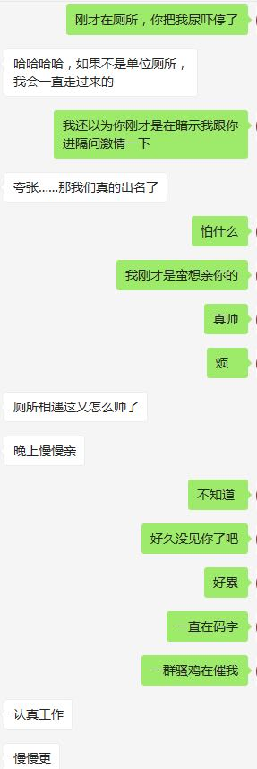

            90楼 | 风中的名义 | 2018-01-16 09:06

姐们请翻到开头前两段我提到的小A妹妹。  
百分之百的口嫌体正直。嘴上说着嫌弃建豪的精致，实际上！！！早都加了微信开始撩了！！！  
现在进入故事的主体，也就是上周五中午开始。  
敲黑板，画重点，我要讲我是怎么快速拿下建豪的了。

            93楼 | 风中的名义 | 2018-01-16 09:17

丫吧新人烦请各位姐妹科普一下为什么讲故事是煮饭？

            95楼 | 风中的名义 | 2018-01-16 09:18

姐妹们，我快下班了，要跟建豪吃饭，然后去超市买东西，晚上回去看情况还更不更吧

            97楼 | 风中的名义 | 2018-01-16 09:22

下班回去惹，建豪在星巴克等我。  
晚上更不更，看情况吧

            109楼 | 风中的名义 | 2018-01-16 10:25

讲完就匿，开场就打错字。我错了

            118楼 | 风中的名义 | 2018-01-16 12:00

姐妹们，我回来了。  
建豪去洗澡了，我开始更。  
正在下载《call me by your name》，建豪说看了两遍了，但是今晚要再陪我看一遍。  
so, let&\#x27;s begin\!

            121楼 | 风中的名义 | 2018-01-16 12:12

话说上周五的中午，毫无预兆的，我在出电梯的时候，突然发现小A妹，傻直男，建豪，一起从对面电梯出来了。  
小A妹对我说了她今后将悔恨终身的一句话：  
要不要跟我们一起去吃饭？？？？

            123楼 | 风中的名义 | 2018-01-16 12:17

说实话，这辈子没有吃过这么冷的饭。  
南方的冬天虽然不那么冷，但是大中午在阴冷的街道上吃煲仔，是不是脑子有点抽啊？  
为了建豪，我真是什么都忍了。  
同行六人，因为我最生分，所以第一时间我找了桌子的一个角落坐下，大家也随意落座。  
建豪坐在我的右边，小A坐在建豪的右边。  
分析：高甜！  
后来建豪告诉我，他一开始听到我的拒绝，很失望，后来发现我又跟着跑出来了十分开心。第一时间找位置坐在我的身边也是有意为之。  
当时的我，完全没有意识到建豪的小心思。  
同时，我也没有感受到小A妹队建豪的追求，天真的我就以为午饭大家坐下的位置是随意出现的。

            126楼 | 风中的名义 | 2018-01-16 12:23

这顿饭，again，是我这辈子吃过最冷的一次。  
风呼呼刮，建豪在一边乐滋滋地说：还好听说要出来吃，果断把大衣穿上才出来。  
可怜我就穿着西装，大衣扔在办公室。  
整顿饭的过程，其实很普通，不敢对建豪有过份的关注，要时刻跟其他同事也有说有笑。  
在等饭的间隙，我拿出手机，开始打游戏，打的什么游戏，一会儿截图给大家看。  
建豪就这么看着我打，我一直低头专注地看着手机，不方便抬头跟建豪目光交流。  
毕竟大家都围着一张桌子，做什么表情，有什么心思，都显得多余。

            127楼 | 风中的名义 | 2018-01-16 12:26

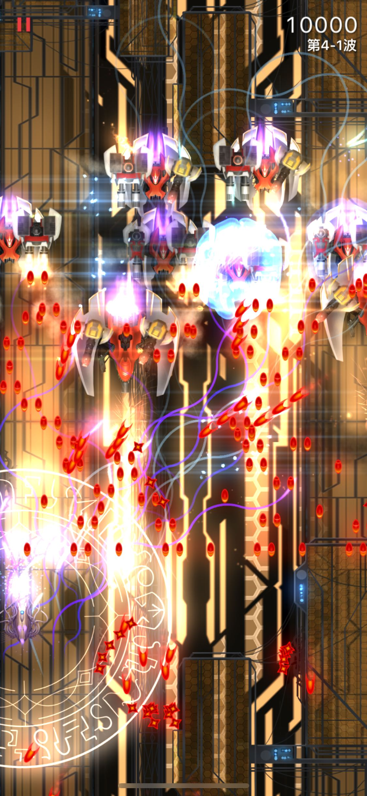

            128楼 | 风中的名义 | 2018-01-16 12:26

一顿饭就这么稀里糊涂地吃完了。  
不知道建豪对我的留意，不知道 小A对建豪的追求。  
我真是天字一号小纯洁呢。  
但是，吃完饭回去的队形却有了变化。  
作为跟他们最不熟悉的人，理所当然地走在了最前面。可是建豪不管我走得多快，都始终坚定地跟我并行。把其他人甩在后面。  
头一回这么两个人一起走回了公司，一起进电梯，一起回到办公室。  
我们客气又小心的聊着天。  
说今天有点冷啊，没吃过这么冷的饭啊。你来公司还习惯吗，以前是做什么的？blablabla  
PS：其实第一天见到建豪我就让HR帮我看了他的资料，学校，年龄（小我俩月），专业，前东家，身高（185），体重（80），家庭成员，住址，邮箱……  
dèi，姐妹们，我就是这么努力，我早在第一天就了解了他的基本信息\~哈哈哈哈

            129楼 | 风中的名义 | 2018-01-16 12:33

建豪洗完澡了，现在在床上坐着呢，刚才来监工看我的进度，要求我九点去洗澡，然后看call me by your name。  
对不起惹，这样肯定是写不完了。

            130楼 | 风中的名义 | 2018-01-16 12:34

接着讲中午吃完巨冷的饭回到办公室吧。  
我内心有点迷惘地坐着，因为跟建豪的聊天，很官方，很浅，察觉不出丝毫他对我的感觉。  
（建豪后来解释说，他也很小心，很注意，不敢表露心机。真是苦煞一对可人儿。我害羞就算了，\*\*\*一个大帅比，你害羞毛啊，直接壁咚我啊，我会开心地叫出声的……）  
但是还是满足的，好歹，我们迈出了第一步，有了第一次正式的长时间的对话。  
莫名其妙，到了下午，我突然戏精附体，正式跟建豪有了进展。

            132楼 | 风中的名义 | 2018-01-16 12:39

事情是这样，建豪的斜对面可以看到一个领导的门，我因为穿了新皮鞋，有点闷脚，所以把皮鞋脱了。  
突然有个急事要跟领导沟通，我又不想弯腰再把鞋子穿好，所以我突然转身，中气十足地叫了一声：建豪！  
我也没想到我平时这么稳重的人当时怎么这么冒失，这一声在安静的办公室里简直犹如惊雷。  
我自己也尴尬地愣住了，因为建豪抬头看着我，周围十几号人全都看着我……  
我简直要瞬间脸红了，又必须保持自己的仪态，强忍害羞接着说：你帮我看看\*总在不在办公室。  
感觉这样直接命令有点奇怪，我又脑袋被驴踢了一样补了一句：我皮鞋脱了，不想再穿着走过去看……  
妈耶，这下大家都笑了……我简直是被自己给气笑了。  
建豪一边跟着大家笑一边看了看领导房间说，领导不在。

            133楼 | 风中的名义 | 2018-01-16 12:44

加完微信之后，这个世界就变了。  
要不我直接把对话截图发出来？还是自己转述呢？  
给大家看看什么叫郎情妾意，什么叫情切切良宵花解语，意绵绵静日玉生香，什么叫教科书级别的借坡下驴。  
每每想起我们微信的开场，我都能笑上三分钟。那种我知道你要干啥，你也知道我要干啥，但是我们都不说破，偏要你一言我一语地把套路走完的感觉。  
怎么说呢，beyond words\.

            135楼 | 风中的名义 | 2018-01-16 12:54

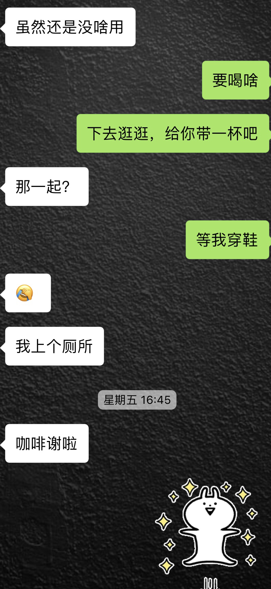

            136楼 | 风中的名义 | 2018-01-16 12:58

呐，说了我讲故事就不骗大家，截图的时间跟聊天都是真实的。  
总之就是没羞没臊要感谢他，我主动要给他买咖啡，他主动要一起去。  
我当时一边聊一边笑，内心其实快爆炸了：还有这种操作？还能这样接话？  
大家数数，我们微信从添加对方，到约好下去买咖啡，只聊了12句。  
12句，可能只是废话；12句，也可能一点用没有；12句，也可能只是你论文里一个开门；但我这个12句，却可以把我爱慕了近一个月的男神撩到手！！  
这过去的一个月里，我不知道YY了建豪多少次，给姐妹发了多少偷拍，一会儿截图给大家看看我都说了啥。  
现在看起来我自己都脸红，真是骚cry惹。

            138楼 | 风中的名义 | 2018-01-16 13:03

呐，我不要脸了，这就是我上个月跟小姐妹们发的骚

            139楼 | 风中的名义 | 2018-01-16 13:08

你们居然不关注我那个打飞机游戏的截图？这个游戏可是把我和建豪的关注拉近了一大步呢

            140楼 | 风中的名义 | 2018-01-16 13:11

不更了，明天更吧，还在看电影

            159楼 | 风中的名义 | 2018-01-16 15:07

睡不着了，被抱醒

            171楼 | 风中的名义 | 2018-01-16 19:41

各位姐妹好，我在上班的路上，手机写一点吧。  
昨晚call me by your name 没看完，建豪就累了要睡觉\(¦3ꇤ\[▓▓\]。  
所以我也睡了，其实过去这几天对我和他都很刺激，有点坐云霄飞车，不对，应该是火箭的感觉。  
从互通心意到升温到确定关系，一切都太顺，以至于我们不停在问自己：is this real?  
有句话说，最幸福的事，就是你喜欢的人恰好也喜欢你。  
我深以为然。  
早上出门前建豪还在被窝里玩手机，奏撩起被子说姐妹们都要看你的照片，要不把你这壮硕多毛的185大腿先拍了给大家看看？  
他羞涩地把我踢开了。  
哈哈，今天好好工作，有空我会更新，绝不弃坑，就算故事写完，也可以日常更新一些生活趣事吧，如果大家想看

            179楼 | 风中的名义 | 2018-01-17 00:12

手机连发三条，全都被吞了吗？？？

            182楼 | 风中的名义 | 2018-01-17 00:40

各位姐妹好，我在上班的路上，手机写一点吧。  
昨晚call me by your name 没看完，建豪就累了要睡觉\(¦3ꇤ\[▓▓\]。  
所以我也睡了，其实过去这几天对我和他都很刺激，有点坐云霄飞车，不对，应该是火箭的感觉。  
从互通心意到升温到确定关系，一切都太顺，以至于我们不停在问自己：is this real?  
有句话说，最幸福的事，就是你喜欢的人恰好也喜欢你。  
我深以为然。  
早上出门前建豪还在被窝里玩手机，奏撩起被子说姐妹们都要看你的照片，要不把你这壮硕多毛的185大腿先拍了给大家看看？  
他羞涩地把我踢开了。  
哈哈，今天好好工作，有空我会更新，绝不弃坑，就算故事写完，也可以日常更新一些生活趣事吧，如果大家想看

            183楼 | 风中的名义 | 2018-01-17 00:42

接着更吧。  
之前讲到我跟建豪借坡下驴分分钟约好去买咖啡的嘛。  
我穿鞋的空档，他先去撒个尿，结果我又被下属缠住解决问题，让建豪在电梯间等了我一会。  
等我走到他身边的时候，又是静悄悄的二人世界，那种心照不宣又宛如在迷雾中前行看见微光的奇妙感觉，想来这辈子也难得体会到一次吧？  
电梯门开了，没人。  
我们走进去，不知道要聊什么。我又提起了中午那顿饭可真冷，顺道又聊起了建豪的家乡，求学经历，家里几口人，多大年纪，我也介绍了我家多少人，Blablabla。  
非常普通又饱含关键信息的交流。  
两个人默默回到办公室。这时候，小A妹妹又上线了，我屁股还没坐热她就问我：你怎么也买了星巴克！？  
我侧着眼睛瞟了一眼建豪桌上，嗯，也放着咖啡，心想小A妹妹你这么关注建豪，实在是挑错了对象。  
我没说话，继续对着电脑微信，跟建豪聊天。  
心里其实对建豪的心思，还是没底。唯有通过更多的交流来明确彼此的心意。

            191楼 | 风中的名义 | 2018-01-17 02:38

为了写这段，我清晨醒来的时候把我跟建豪的聊记录拿出来看了一遍，简单概述一下，就不截图了。  
之前的截图里看到啦，我说要看看建豪鼻毛剪修剪后的效果。（昨晚睡前他真的用了哈哈）  
建豪问起了我过年的旅行安排，给了很多自己的建议。这时候我鸡贼地翻了他的朋友圈：仅3天可见？？？  
气die惹！！！  
接下来发两段截图吧，蛮搞笑的聊天。

            193楼 | 风中的名义 | 2018-01-17 02:45

其实聊到这里，我已经有点明确了。  
建豪各种高甜宠溺地回复我的对话，撩起人来真的很厉害。  
但是我也有我的担心，这种男神级别的帅哥，向来不缺人追求，这种撩人技巧亦正亦邪的，不知道是他用惯了，还是真的对我有意？  
大家从聊天记录里可以看到，本仙女一直在加班，晚上九点多才下班，然后吃饭睡觉，心里揣度着想跟建豪说话，但始终没有行动。  
直到睡到半夜被热醒又拿起手机，看到建豪一点多发了条朋友圈，是一首歌  
《Light A Fire》，他写了两个单词：don&\#x27;t quiver。  
然后我突然发现他的朋友圈，全部可见了？？？？？？  
seriously？还有这种操作？下午还是3天可见啥都没有，怎么我睡一觉起来就全部可见了。  
此时不看，更待何时？？？？  
然后我花了一个小时刷完他的朋友圈，把好看的照片全都存下来，发给我的姐妹们品鉴。  
哈哈哈哈哈哈  
其实这个晚上发生了很多高甜的细节，是我不知道的，都是建豪这两天一点点透露给我的。

            194楼 | 风中的名义 | 2018-01-17 02:50

又忙了，下午再更，不是为了蹭热度，不过也希望姐妹们多跟我互动互动，顶顶贴。  
我有空会手机回复大家的评论，分享我的心情。  
这两天好多人说我气色好，变年轻。  
自己也觉得本仙女这几天笑容甜美，容光焕发呢，哈哈哈

            195楼 | 风中的名义 | 2018-01-17 02:53

今天建豪出去面试了，遇到HR一直夸他帅，这才几天啊，就要操心这些了，我真命苦。

            202楼 | 风中的名义 | 2018-01-17 03:43

我的手机端一直不能回复信息，统统被系统删帖，说登录异常，哪位妹妹教教我该怎么办？

            203楼 | 风中的名义 | 2018-01-17 03:47

催催催…  
周五的晚上对我和建豪其实都不好过。  
聊天记录大家看到啦，说完加油以后，我本着仙女人矜持，硬是没有主动跟建豪主动发过消息。  
这个被动的建豪，他做了什么呢？  
1、他想知道我是不是加完班了，于是八点多去问小A妹妹下班没，问小A“你不会加班到最后才走吧？”  
小A告诉他，她走的时候我还在加班。  
可是他就是不主动来关心我……不知道这个双鱼是不是个傻子？  
2、他周六跟我解释说，周五晚上跟好朋友打电话的时候，他的朋友说他朋友圈只三天可见这样不太好，所以他全部开放了。  
后来他解释，什么朋友，什么电话，都是瞎扯的，他就是想开放给我看，又不知道怎么告知我、提醒我。  
所以他深夜发了那首歌，还配了句 don&\#x27;t quiver。好在我也都按他说的发现了他的朋友圈开放了。。。。  
后来听他说这些的时候，我都是又开心又扶额。。。男神你能不能有点种，直接告诉我这些哦？

            215楼 | 风中的名义 | 2018-01-17 05:45

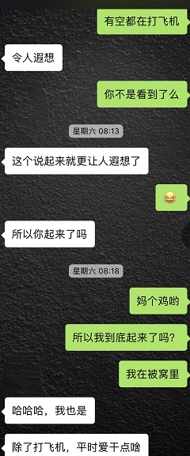

            219楼 | 风中的名义 | 2018-01-17 05:55

周六那天，他跟另一对夫夫去采购，去外地夫夫家玩儿。  
我则是中午出门跟朋友吃饭下午要爬山。  
但是我们一整天的微信都没停过，一直聊到晚上一点多。  
你们想想，这么心意相通地暧昧，这么持久的聊天，能出现什么结果呢？

            220楼 | 风中的名义 | 2018-01-17 05:58

姐妹们想想，你们YY了快一个月的男神，主动撩你，各种高甜，你们能受得了？？  
我真个人都特么都飞起来了好吗？  
周五晚上看了他的朋友圈之后，被那些照片迷得恍恍惚惚，睡一会儿就醒来，看看他有没有回复，然后再睡一会儿再醒来，看看他有没有回复……一夜都没睡好  
周六晚上更是如此了。特别、超级、非常的亢奋，完全没有心情入睡，三点半睡着，七点又醒了……我真个周末的懒觉就这么没了。  
而且因为周六中午在路上他猛撩我，我一个高兴过头，连地铁坐过站了都没发现。。。。

            222楼 | 风中的名义 | 2018-01-17 06:01

我很快问了他一个问题：  
我们是一个部门的，又在一个公司，小A妹还对你发起这么猛烈的关注与追求，怎么办？  
建豪给出了他的答案：  
我本来就要告诉你，我之前已经准备好周一就提离职，周二就last day。  
WHAT????  
我一脸懵逼。  
从技术上讲，周六是我们认识的第二天，下周一是我们认识的第二个工作日。  
要不是周五有小A妹助攻我们相识，所以你离职之前有没有想过我们很有可能一点儿进展还没有？  
你想要怎么办？？？

            224楼 | 风中的名义 | 2018-01-17 06:06

建豪说：如果在我离职的那一天，我们还没有进展的话，我会鼓起勇气走到你身边，跟你聊天。  
我说：突然来找我？不怕我白眼翻走你吗？

            225楼 | 风中的名义 | 2018-01-17 06:13

浑浑噩噩的周日醒来，就在等建豪周日中午坐车从外地那对夫夫那儿回来。  
我就在家洗床单、衣服、晒被子、打扫卫生、整理房间。  
我不勤快，做这些家务也是因为周末到了，再加我可以一边做家务，一边跟建豪打电话。  
建豪一路上都在跟我微信语音或者电话通话，把我的airpods都打到没电……  
其实有点奇怪的，毕竟是第一次跟建豪这么长时间用语音聊天。  
不过还是很开心啦\~

            227楼 | 风中的名义 | 2018-01-17 06:18

休息一下，一会儿讲我们上周日的约会。

            230楼 | 风中的名义 | 2018-01-17 06:28

一会儿下班要陪建豪去机场，送他出差。  
会不会在机场吻别呢？  
一走就是好几天，哎。  
休息下，晚上我自己了就可以多更一点。  
姐妹有什么问题只管留言，反正我跟建豪这运气太像电视或者小说了，大概也是羡慕不来的，甜就甜吧，我自己也很甜。

            232楼 | 风中的名义 | 2018-01-17 06:36

下班了，建豪在家等我一道去机场呢。  
晚点儿给大家煮饭

            240楼 | 风中的名义 | 2018-01-17 10:14

简直笑死，跑回家发现乌漆嘛黑没灯，原来建豪真的躺在床上打阴阳师

            243楼 | 风中的名义 | 2018-01-17 10:37

被建豪抓住手机密码还是前任生日，昨晚逼着我改成了他的生日。  
今天只要face ID不成功，需要手动密码的时候百分百输错…  
我都用了四年了，说换就换谁能习惯

            244楼 | 风中的名义 | 2018-01-17 10:40

以后你们找了这样的男友，出街一定要注意点。  
因为我跟他都是185高，走哪儿都有比较显眼，有对情侣非常不害羞地对我们指指点点，也有服务员盯着建豪看…  
我变特务了

            251楼 | 风中的名义 | 2018-01-17 11:59

建豪过安检去了，我回家给姐妹们煮饭吃去

            252楼 | 风中的名义 | 2018-01-17 12:24

继续讲周日的约会吧。  
总之就是等了建豪一天，他终于在晚上六点多的时候到达了我所在的吃饭的地方。  
在等他的途中，我自己逛了逛衣服、眼镜啥的，其实并不想买啥，只是打发打发等待建豪的时光，也给自己做做心理建设，毕竟从周五下班后到现在，我跟建豪的关系发生了质的变化。  
从同事变成了恋人，从不熟悉不知晓，到了解了一些彼此的信息。  
周日晚的见面，是第一次以这种身份见面，交谈。虽然不至于每一次的呼吸都反复练习，但是起码要好好调整一下，知道一会儿要用什么姿态面对吧。  
妈耶，二十八九岁的小伙子，居然也有这样的担忧？我觉得自己有点秀逗。

            259楼 | 风中的名义 | 2018-01-17 13:55

挑选吃饭的地方，建豪很暖男，都听我的，我因为这三天跟他的关系巨变，一是情感上如火箭般飞速发展，另一方面却带来了生理上的不适。  
首先睡眠极差，每晚只能睡三到四个小时就行了，其次顿顿饭都没有胃口，食不知味。  
我跟建豪都陷入了同样的幸福困境中。  
姐妹们不要觉得我夸张，这种感觉，谁经历过谁知道。  
逼逼这么多，我想说的是我只挑了一家吃川味的小吃店。不过还是需要拿号排队。  
我在外面坐了大概十分钟的样子，埋头打游戏。不一会儿，真的看见建豪走过来了。  
居然穿着上班的正装？？？

            260楼 | 风中的名义 | 2018-01-17 14:03

吃饭的环节其实挺好的，虽然是从同事身份陡然转换成恋人。但是建豪其实handle得比我好多了，落落大方，一点不羞涩。  
倒是我，有点傻，面对面坐着，终于可以目不转睛名正言顺堂而皇之光明正大地看着他了……  

            261楼 | 风中的名义 | 2018-01-17 14:10

吃完饭的中途，我买好了电影票，《勇敢者的游戏2》，吃饭的地方是我常去的地方，所以驾轻就熟。  
建豪稍微就没那么熟了，所以跟着我显得呆呆傻傻，可爱十足。  
这电影，其实真的蛮好看的，开场吓得我叫了两声……建豪表示很无语哈哈哈。  
“”你这傻缺只知道笑我，为什么不知道握住我的爪子呢……”我一边想着一边把手伸向了他。  
哎，其实还是有点不好意思的。毕竟刚见面不到一小时，刚吃饭也是含蓄加害羞毕竟旁边也有人。所以伸手去握住建豪都不知道他是不是真的喜欢我，或者其实并没有很中意呢？  
心里正踟蹰着，建豪握住了我的手，放在他胸前。因为他把中长的西装外套盖在了身上，所以还是很隐蔽的。

            263楼 | 风中的名义 | 2018-01-17 14:29

哈哈，其实建豪握住我的手的时候，我是非常受用的，自诩我的手已经算是白净修长好看的了，也常有人夸我手好看。不过建豪的也丝毫不差。  
而且手感贼好，嫩嫩的，一点儿不粗糙，虽不是柔弱无骨，却也温暖宜人。握在一起，只觉得心头温暖踏实。  
电影情节很搞笑，全程无尿点，看得看开心地同时，又觉得心头舒服。  
建豪带上3D眼镜之后，更帅了，想吻，没敢。  
只是两人的手一直紧握着，都出汗了，建豪也丝毫没有放开的想法。真的握了整整一部电影。  
还有个小细节，建豪开场前说要喝水就买了一瓶，所以很理所当然的我们一起喝了这瓶水。哈哈。  
电影看完的时候，建豪说，憋了小半部电影，因为电影全程无尿点，所以没能出去，快憋炸了。  
我赶紧带他去了厕所。  
一次愉悦的电影就这么看完了。简单又踏实。

            265楼 | 风中的名义 | 2018-01-17 14:44

哎呀，什么我少了情节，那是因为周六周日两天我跟建豪聊了上千条微信，里面包含了大量高甜的内容，我怎么跟你们讲呢？？？  
互相表露是G的身份以及关系的确认，都在我与建豪的互撩中完成了，我没有细讲，直接讲到了周日晚上的约会。  
没想到妹妹们真的对这个情节套路又这么深的执念。  
真的饭吃多了吗？  
好吧好吧，我专门把周六周日的聊天内容看了一遍，接下来进入纯高甜版聊天内容概述。  
为大家揭晓我们是怎么一点点聊得深入，并确定了彼此心间的美意。  
你们可满意？真是累煞本仙女了。

            271楼 | 风中的名义 | 2018-01-17 15:05

周六上午，内容概述：  
因为建豪凌晨一点发了朋友圈，我问了他一句：这么晚不睡，修仙呢？  
他没有回我，大概是睡了。因为这个我迷迷糊糊看了好几次手机，直到早晨7点多他醒来回了我短信。我们马上开启了热聊互撩模式。  
主要内容如下：  
1、他问我为什么这么那么晚不睡，我说我热醒了。  
2、他问我今天什么安排，我说我今天下午跟朋友去爬山。建豪是要跟朋友去宜家购物、买绿植、一起去周边城市帮朋友收拾新房。另外建豪听说我要去爬山，叮嘱我说：今天多穿点，宁可脱了拿在手上，也别冻着了。（此处为原话）  
3、然后我问他为什么朋友圈突然开放了？他骗我说是被大学同学教育了。（实为他专门打开所有朋友圈，并吸引让我来看的，前面有截图大家自己找）  
4、我吐槽建豪的跳一跳游戏分数很低。他说他不爱打游戏，我说我很忙，有空都在打飞机（见之前聊天截图）。此处已经有点黄腔了，渐入佳境。  
5、我说我在被窝里打游戏，手冷，他说：要找人暖手吗？我说：哎，找不到  
建豪：太挑了吧！  
我：对对对，建豪挑，我不挑。  
建豪：我哪里挑了？  
我：那你有人暖手吗？  
建豪：单身狗瑟瑟发抖。  
我：那你抖一个我看？  
建豪真的发了一个\*\*的狂抖的表情……  
正好，我无聊下载了一个游戏《天使纪元》，直接起名叫“抖神建豪”，还专门截图给他看。我们一起笑得哈哈哈。  
（这几天一直在玩这个游戏，看着抖神建豪一路走到了快400级，哈哈，把建豪当儿子养）  
6、然后我就游戏去了。建豪突然问我：还在玩吗？  
我：没有（其实根本玩儿得停不下来呢……

            273楼 | 风中的名义 | 2018-01-17 15:19

建豪的飞机落地了！！！居然已经这么晚了

            274楼 | 风中的名义 | 2018-01-17 15:24

刚才那些聊天只是周六早晨7\-10点的精选。  
没有错，我继续撒糖了，甜死了我不负责。  
建豪很会撩人，总是主动关心我，比如：  
1、十点的时候，突然问我：你吃早饭没？  
我：当然没有。  
建豪：以后提前买点蛋糕也好啊！  
我：你这家伙，有点甜！  
建豪：农夫山泉喝多了。  
我：部门有妹子值得你甜吗？  
（我终于知道妹妹们纠结的互认环节了，原来在这里，是我漏掉啦，面对暴击吧你们！这是你们自找的

            281楼 | 风中的名义 | 2018-01-17 15:32

接着转述聊天：  
我：你这，我好方啊！  
建豪：吓着了吗？  
我：有点复杂，我们是同事，又在一个部门，不会太戏剧性吗？（这算我直接说出了我和他的关系吧？）  
建豪就说了他周一就提离职，周二就last day，周三去外地（就是现在！！就是right now

            282楼 | 风中的名义 | 2018-01-17 15:39

我想看到姐妹们的鼓励，有点儿写不下去了，手疼。

            283楼 | 风中的名义 | 2018-01-17 15:41

建豪说：如果到我离职的时候，我们还没有联系的话。我会来找你的，跟你侃天侃地侃人生。（听到这句话的时候，我真的被击晕了，这是什么？韩剧吗？？？

            285楼 | 风中的名义 | 2018-01-17 15:48

建豪整个周六都暖到炸。  
一会儿问，你跟你朋友见面了吗？你是不是饿坏了？你们到吃饭的地方了吗？吃完了吗？  
我真是一顿饭都没怎么吃。  
妹妹们，如果你们男神这样关心你，不停给你发微信，你还能吃下东西？笑得假胸都飞出来了吧……  
反正我是被他撩得神魂颠倒。下午跟朋友爬山的时候，一个劲儿嘿嘿傻笑

            287楼 | 风中的名义 | 2018-01-17 15:51

下午三点多，我还在山上，腿已经快废了。  
我问建豪，你是什么时候注意到我的？他说是我跟他聊阴阳师那次。  
算了，就算是阴阳师软文我也认了！感谢阴阳师！！！感谢小米手机，苹果X！！感谢《天使纪元》！！  
我问建豪，你第一次注意到我，你心里在想什么？  
他说在想能不能跟这个同事发生点什么。  
我问，你看出我是G了？！  
建豪：恩，你看我的眼神。跟其他人不一样。  
我：透露着欣赏吗  
建豪：反正就是不一样。  
然后我给他发了山上的美景，他给我发了他们宜家疯狂血拼的战果。  
我告诫他，谁在开车，如果是你开车，就不要跟我聊天，注意安全。（这招叫以退为进吧？

            291楼 | 风中的名义 | 2018-01-17 16:06

建豪说，每次跟这对朋友出来，都吃狗粮吃得够够的。  
我问：夫妻吗？（姐妹们让我看到你们的手，你们一定知道我在问什么）  
建豪说：夫夫啊！！！  
哈哈，然后就是那张截图了，再上一次。

            292楼 | 风中的名义 | 2018-01-17 16:12

哈哈哈，他问撩到我了吗。  
我说：我帮你问问A妹，你到底有没有撩到她。  
他郁闷了哈哈

            295楼 | 风中的名义 | 2018-01-17 16:20

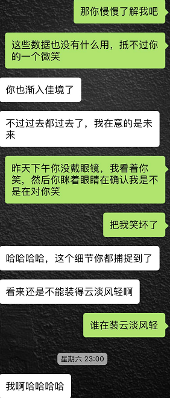

            297楼 | 风中的名义 | 2018-01-17 16:37

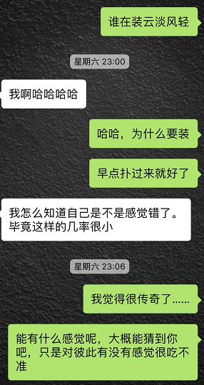

            298楼 | 风中的名义 | 2018-01-17 16:38

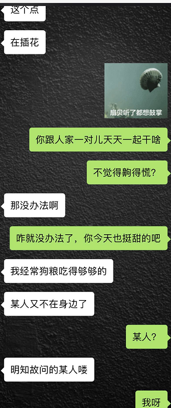

            299楼 | 风中的名义 | 2018-01-17 16:39

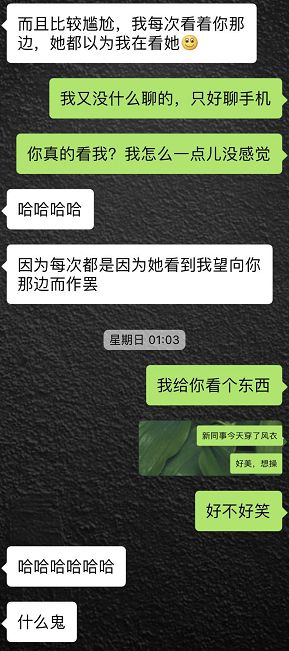

            300楼 | 风中的名义 | 2018-01-17 16:39

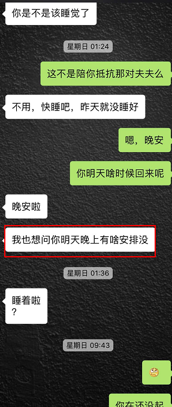

            301楼 | 风中的名义 | 2018-01-17 16:40

请大家随意吃糖。  
所以，现在还有哪位可人儿觉得缺少了确认身份和确定关系的环节的，请站出来，看我不打烂你的贝塔。

            302楼 | 风中的名义 | 2018-01-17 16:42

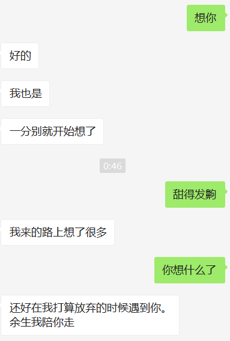

            303楼 | 风中的名义 | 2018-01-17 16:48

姐妹们早上好\(๑•̀㉨•́ฅ✧ 早  
今天很华丽地迟到了\(•̀ᴗ•́\)و ̑̑  
其实是个好事，说明经过好几天的紊乱，身体终于回复平静了，终于可以一觉睡到天亮了…  
另外，现在我跟建豪的故事，希望没有乱掉时间线，本来已经讲到周日晚上见面看完电影分开了，结果被姐妹们挑刺，所以我补了周六日的聊天内容和细节。  
接下来的故事会继续沿着看完电影分开，各回各家继续讲

            312楼 | 风中的名义 | 2018-01-18 00:46

故事先不讲，日常吐槽来一发，刚才的

            317楼 | 风中的名义 | 2018-01-18 02:40

忘了告诉大家，建豪早跟家里出柜了，母上大人听说他有了新恋情，开心得飞起。  
所以建豪没事儿就住我这里呀😄，同居也是自然而然的吧！

            319楼 | 风中的名义 | 2018-01-18 03:00

哇，姐妹们真的捧场呢，两天时间我都有一百个粉丝了

            330楼 | 风中的名义 | 2018-01-18 05:11

开始做饭咯

            347楼 | 风中的名义 | 2018-01-18 12:48

好啦，等了一天的，终于要讲回上周日的分手。  
看完电影出来，我必须承认本仙女真的是出淤泥而不染。看完电影之后一心只想着赶紧回家睡觉，毕竟第二天还要上班，他也要上班，这么晚了回家妈妈多担心。各位妹妹说是不是？  
在进地铁的路上，我对建豪说，呐，我这几天想了好多问题，比如你离职之后的工作问题，如果的在A区呢，我就搬去A区住，如果你在B区呢，我们去B区住。  
建豪：那你去了B区，上班通勤得多久啊？  
我：这有什么，应该的嘛。  
建豪不说话了，抿着薄薄迷人的嘴唇对我笑，欲言又止的样子。  
笑得我脸都红了……  
一会儿分手上了地铁。我微信问他，你笑什么？  
他说我没有想到你会想这么远。不过这样也好，说明你很认真。  
我问：你呢？你认真吗？  
建豪：当然认真了，其实我今天都抱着不回家的打算了

            348楼 | 风中的名义 | 2018-01-18 12:58

我当时刚从地铁出来，站在路边的我突然非常紧张，what?突然说要来过夜吗？  
虽然心里踟蹰，但是手上还是很干脆的，马上打字：  
那你过来吧。傻缺，为什么不直接说？没打算回家直接说啊。  
建豪直接回了语音：那我已经上车了，现在下来吧，我打车。你发个定位我看你在哪。  
发完定位，我说，我在路边站着等你。  
建豪说，把外套穿上。  
OS：从哪学来的这一套，嘴巴这么甜惹。

            349楼 | 风中的名义 | 2018-01-18 13:01

因为看电影的时候我的左手一直被他握着，所以站在路边还能闻到手上残余他的香水味道。  
（这个建豪真的很香，昨儿下午他不是关着灯窝在我被窝里打阴阳师么，我晚上回来睡觉，被窝里全是他的味道。建豪说这是他的体香……

            350楼 | 风中的名义 | 2018-01-18 13:08

好了，接下来要讲小黄文吗？  
建豪进了门，第一件事，拥抱。  
啊，姐妹们设身处地想想，近一个月的YY，近两天的热聊，在外面人多只敢摸摸手，回到家，终于可以跟这个帅哥深情拥抱了，感受他的力量和温度。（写不下去了，这有啥好写的，反正就是深情拥抱30秒，over）  
第二件事，换鞋。  
WTF？都是185的身高，凭什么我41的脚，建豪是44的脚？？大我大概个码？？？  
我的拖鞋他都穿不进去！！！真是同高不同脚！  
然后给他拿毛巾，找睡觉穿的贴身衣服，虽然他80，我72,，不过睡衣的size倒是没多大差别吧。  
然后，我把被套取了回来，建豪执意要帮我套上。  
well，非常的不sexy了。哪有见面头天过夜，不是关门干茶烈火脱掉衣服啪啪啪，而是一起铺床单、套被套的？？  
这剧情，可以说非常尬了。  
我赶紧把他赶去洗澡了，我继续整理。

            353楼 | 风中的名义 | 2018-01-18 13:23

等他洗完出来直接钻被窝了，我在干啥，忘记了，把衣服丢洗衣机了吧？  
然后就洗澡，出来吹了头发就钻进了被窝，当时已经十一点半了。  
然后……还是拥抱和Kiss吧。没有更多了。  
建豪不仅穿了自己的睡裤，还穿了内裤，那晚我连奖杯都没看到。哈哈哈哈哈  
什么干柴烈火？什么天雷地火？什么巫山云雨？

            355楼 | 风中的名义 | 2018-01-18 13:29

哈哈哈，想起来真的好笑，姐妹们知道那晚的我跟建豪什么状态么。  
因为连着两天的热聊，我跟建豪都处于茶饭不思，寝食难安的状态。建豪晚上更是只吃了一小口东西。  
我也因为两天睡了六个小时非常崩溃。  
哈哈，可是两具肉体钻进被窝，还是能带来极大的满足与慰藉。  
无关性爱，不涉欲望。  
建豪轻轻揽我入怀，我轻轻把头埋进他的肩膀臂弯。  
就好像鱼儿入水，又恰似船儿入港。  
我能近距离细细品闻到他身上的香气，感受到他的温度，和比我粗壮许多的肩膀、手臂。  
一言不发，喉头发干，不知道要说什么，却清楚地记得自己当时的念头：希望时间永远停在这一刻。

            356楼 | 风中的名义 | 2018-01-18 13:35

建豪时而平躺，时而侧过来抱着我。  
他之前在微信上就叫我好奇宝宝。此刻我更是有成千上万的问题想要问他。  
比如你是什么时候注意到我的？你对我的第一印象是什么？你喜欢我什么？我们之间真的合适吗？  
因为不是微信聊天，我不能回查记录，所以借此机会也把我跟建豪的相识和大家常问的问题，在这里一并回答了吧。  
一、建豪是个什么样的男神？  
样貌的确能吸引人，平常人见了只会夸帅。  
但是建豪运气不好，之前都是被男友劈腿。  
而建豪又是一个思想传统，近乎奇葩的男生。不用blued，不用Jackd，不用探探，唯一用的就aloha了还极少登录，上面应该有上千粉丝吧（对的，当晚他当着我的面卸载了a，我也把我的软件全删除了），可是昨天发现他微信里的同志不到十个。  
而他的前任，都是在学校、公司等现实环境里认识的。  
好吧，只能说帅哥不用软件照样能交到同志朋友。（朋友们，见到身边帅哥直接上啊！！！）  
当初建豪来到公司，我就一直在软件上浏览，却始终找不到跟建豪情况相仿的资料。谁能料想这个奇葩根本不玩软件？？？  
建豪是一个队感情比较悲观的人，导致他在寻找朋友方面一点也不主动。用他妈妈的话说，就是嫉妒清高，不远主动。  
你们还记得建豪跟我的接触吗？无数次欲言又止，但是他就是不主动。（讲到这里，感谢自己的勇敢和戏精本领）  
所以，他妈妈知道我跟建豪在一起了，非常开心，为建豪感到高兴，为清高的儿子找到心仪对象感到开心。

            357楼 | 风中的名义 | 2018-01-18 13:44

二、我是什么样的人？（其实就是你们一直在问的，为什么建豪会看上我？

            358楼 | 风中的名义 | 2018-01-18 13:58

到了凌晨两三点的时候，我还一点不困。  
我不停地笑，不停地多自己说: is this real？  
建豪不停地回应我：yes！  
哈哈，迷迷糊糊睡过去，早晨七点半闹钟响了。赶紧爬起来。  
一起洗脸、刷牙。（他真的把牙刷头朝下放进了刷牙杯里！

            360楼 | 风中的名义 | 2018-01-18 14:06

姐妹们只看不说话还是根本没人看哦，更得有点寂寞

            361楼 | 风中的名义 | 2018-01-18 14:08

哈哈，我在跟建豪视频。  
他说他喝多了可是看起来还蛮正常的，说一会儿要来检查帖子。  
我休息会儿吧，跟姐妹们互动一会儿再写好吗

            363楼 | 风中的名义 | 2018-01-18 14:18

从来没有觉得从家到公司的路上会有这么美好。  
晚冬的早晨没有强光，也没有冷风，一切都是温暖宜人的。  
以前跟朋友相处，常常发现刚接触的时候，走路特容易相撞，大概是路线、步伐、角度不同吧，刚开始大抵没那么和谐。  
不过跟建豪走在一起，一切都非常非常的自然。没有一次擦碰，没有一次转错方向。就算我走了比较偏僻的小区里的路，建豪都很机智地跟上，默契满分。  
我说，我不爱走主路因为上面全是公司的人，我喜欢在小路上安静地走，享受这份清净。  
建豪说，反正我刚入职，谁都不认识，无所谓。  
我笑：你是不认识谁，可是想认识你的人很多啊。  
快到公司的时候我去了便利店，给我们买早餐，建豪去了星巴克，有喝咖啡的习惯，我要了拿铁。  
然后两人一起走进公司，一起等电梯。  
一切都那么自然又陌生，跟建豪一起等电梯，一起看同事匆匆忙忙跑进大门，都感觉不太一样了，一切充满了生机。  
我跟建豪人高马大站进电梯，引人侧目，但是我不敢跟他有一点儿交流，毕竟认识我的人很多。  
出了电梯，悄悄坐到座位，心里甜到简直不知道要怎么开展工作。  
突然总监就出现了，召集负责人开会，这才把我从恋爱的幸福泥潭里短暂地拉了出来。

            367楼 | 风中的名义 | 2018-01-18 14:32

年底了，我的工作特别忙，姐妹们知道，上周五跟小豪互撩了也不能直接约会，因为真的忙。  
刚九点多才下班，回来啥都没干就在这里煮饭。  
除了跟小豪视频聊天，几乎没咋停手呢。  
好了，终于把时间线推向了本周，今儿才周四呢，我要讲周一周二的事情了哈哈。  
我的下属小A妹妹的戏份可就重了起来。

            370楼 | 风中的名义 | 2018-01-18 14:40

总监找我们开完会，我出来的第一件事，是跟金边王子出柜！！  
我直接告诉金边王子和另一个好G蜜鸡头。  
昨天跟我睡的，就是那个新来的帅哥同事。哈哈  
王子跟鸡头当我又是像从前一样只是分享帅哥，因为这几年我都是单身，我也从来没有跟他们表露过身份，大家都避而不谈。感谢王子和鸡头对我的照顾。  
王子跟鸡头说，快分享下发生了什么事惹。  
我重新说了一遍：我说的确认关系，是确认了我要跟他在一起惹。  
哈哈哈哈哈哈哈哈哈哈哈哈，让我笑上十分钟，他们的反应，我还是直接截图来得实在一点。

            374楼 | 风中的名义 | 2018-01-18 14:52

鸡头比王子还要激动，他觉得我跟小豪在一起，满足他多年对腐的期待吧，大概是指两个不错的人走到一起，很养眼？很让腐男腐女觉得受用？  
我是不太懂这个哈哈。  
反正当晚鸡头就拉着我跟小豪来了个群语音聊天，感觉他比我还开心，全程抖包袱秀下限，把我跟小豪逗得哈哈笑。

            375楼 | 风中的名义 | 2018-01-18 14:58

好了，接着说公司的事吧。  
作为事业处在上升期且开始带团队的“当红”（我自己加的哈哈哈哈）负责人，其实我对手下都是给予充分的信任和发挥空间，再加上本身我的同志属性，我跟team成员的沟通很顺畅，在群里从来都是嘻嘻哈哈。目前也感觉不到他们有另建小群背后骂我的哈哈哈。  
所以小豪一来公司，A妹妹就在群里跟我们提了这个事。大家翻翻开头，小A妹妹的口嫌体正直，一点儿不假呢。  
上周五的午饭，更是让我意识到，原来我一直按兵不动等待时机的时候，  
小A妹妹早已经加了小豪的微信！！！  
约他吃早饭！！！  
中午小团伙吃午饭！！！  
没事跑过去聊天！！！  
小豪离我也就三个人座位的距离，我们的中间就是小A妹妹。  
之前建豪就说了，每次他偷偷看向我，小A妹妹都会回应他的目光，以为小豪是在看她……

            376楼 | 风中的名义 | 2018-01-18 15:06

这种环境其实真的很尴尬地。  
我跟小豪眉眼含情自不必说。  
可是小A关注她的男神小A，也关注她的领导我。  
所以才会出现周五刚回来她就发现我跟建豪手上都有星巴克，尴尬又无奈。我帮不了小A，却也不希望她难过。  
建豪说小A真的蛮主动又频繁地跟他发信息，各种聊，建豪最后都冷处理了。  
就连周五晚主动问小A加班有没有结束，其实也是为了探寻我是不是还在加班。  
可怜的小A，我现在真的feel sorry for her。  
可是你为什么要看上小豪呢，你输在了起跑线上，这不怪我吧。  
话虽如此，小A还是制造了不少尴尬地局面。  
周一那天，我尽量克制自己不跟小豪有什么互动。想尽量低调度过两天。  
可是下午的时候我有些拉肚子，一去厕所，建豪的微信就来了。然后他就跑出去给我买酸奶了。  
他说放在茶水间，我起身就去取，建豪也在里面呢。  
千算万算！没想到A妹假意泡茶，跟进来了！！！我去！！！当时我内心的\*\*\*奔腾各位姐妹能感受到吗？？？  
我允许你喜欢我男人，我也体谅你求而不得的苦楚，但是你这样搞跟踪，我真的就不开心了！！！

            378楼 | 风中的名义 | 2018-01-18 15:17

虽然小A只是看见我跟建豪在茶水间，看见我们开着冰箱门发呆，但是我相信凭她女人的直觉，起码能感觉到我跟小豪之间的熟稔。  
而且小豪因为周末没回家，周一一天都没有工卡，很不方便，我悄悄给了他一张，还被小A看见了。  
小A当时是这么嘀咕一句：你们在搞什么见不得人的交易。  
我只得承认：小豪没带工卡嘛，我这儿有张多余的，给他用用。  
小A妹妹很机灵，她看到我跟建豪在茶水间，顺势放下水杯就转身去了厕所。我拿了酸奶赶紧回了座位。  
心烦意乱。  
建豪说，我回去之后不久，小A就从厕所回来了，专门在茶水间又跟他聊了一会儿天。  
我呵呵。

            379楼 | 风中的名义 | 2018-01-18 15:23

中午吃饭的时候，我小豪商量了一下，还是不要一起了，维持原样是最安全的选择。  
小A果然又约了小豪。我假装没看到好了，反正我有自己平时的饭友。  
结果我因为拉肚子去得太晚，一个人落单了。  
我一个人坐着吃饭，突然小A妹妹、用苹果7的傻直男还有建豪一起经过了。  
小A没有看见我，带着大家径直去了别的地方。  
很快我收到建豪的微信，为什么是一个人，早知道我陪你吃饭……  
说不开心那是假的，又觉得小豪这也太小题大做了，一个人吃一餐饭难道很可悲吗？  
为了我们长久的幸福，一个人吃餐饭又算的了什么哈哈哈！！

            380楼 | 风中的名义 | 2018-01-18 15:29

忙碌的一天，在建豪的关心下很快过去了。  
上厕所被他尾随，路过被他抬头锁定，茶水间一起接水这些就不细说了，反正高甜咯。  
下班我要加会班，他去星巴克等我。然后我们一起吃了顿饭，就各自回家了。  
因为下午他也一直在惨叫，三天睡了差不多十个小时极度亢奋的副作用已经让彼此像只剩一口仙气吊着一样。  
哈哈哈哈，真是又惨又幸福。  
周一的晚上，各自安眠，一夜无话。

            381楼 | 风中的名义 | 2018-01-18 15:32

早上好，姐妹们我还在被窝，该起床喽。  
今天的被子，只有淡淡的建豪的味道了，甜甜的还有一丝若隐若现的苦

            391楼 | 风中的名义 | 2018-01-18 23:35

早晨出门的时候，本想穿那双新皮鞋，但又觉得它有些不透气。  
可是它毕竟是我跟建豪之间的神助攻。  
它不闷脚，我就加不上他微信

            396楼 | 风中的名义 | 2018-01-19 00:10

收到妹妹们的关心，不要怕

            403楼 | 风中的名义 | 2018-01-19 03:11

你们看看你们看看！  
我都努力成什么样了？  
努力到差点被度娘当成机器人永久封号了都！  
感觉我今年是不是能得奖了？

            408楼 | 风中的名义 | 2018-01-19 04:42

忙碌的一周终于告一段落。  
刚把建豪的睡裤内衣啥的丢进洗衣机，居然跟我有同款不同色的开衫，骚骚的枣红，上面有他的香水味道。  
要把家里的衣服收一收，周日他就要回来啦\~\~  
周日晚上我打算把我公司最好的两个朋友小C（女）和小D（男）叫上一起吃饭。我已经跟他们剧透了，我说我有个 big news要宣布。  
1、不是结婚；2、不是买房；3、不是换部门；4、不是换公司。  
他们昨天深夜还在群里讨论，一直认为答案就是：new girlfriend\!\!  
哈哈，我一想到后天，建豪这个前同事出现在他们面前，再由建豪帮我出柜，他们会是什么表情？？  
哈哈，that&\#x27;s a real big news\!

            415楼 | 风中的名义 | 2018-01-19 13:11

饭煮到这里，其实没有更多的细节和背景跟大家分享了，慢慢要变成你们说的华人叔那样了吧。  
昨晚专门去看了下华人叔的贴，原来是11年就开始的！我早有看过，不过后来没有再跟，当时也只是看了个开头。不过我们没有华人叔那样两人都做金融那么厉害啦，他们加起来得上层了。  
我这儿堪堪算个没有根基的假中产哈哈。  
跟小豪生活下去应该是没问题的。不过为了他，我也要多注意注意理财了，不能再像个没头苍蝇一样处理自己的存款。  
为什么我要这么努力？因为我爱的人超完美啊！

            416楼 | 风中的名义 | 2018-01-19 13:18

故事讲到周二了，那天早晨，他从家里过来，到离我最近的地铁口等我过来。然后跟周一一样，一起买早餐，一起排队，一起进公司。  
一天忙碌也记不得有什么事了。晚上吃饭的时候，假装跟小C一起偶遇了建豪。让他们两先见了一次面认一认。哈哈就等周日晚上看我们怎么震惊小C他们。想想我都暗搓搓激动地搓手。毕竟是头一回跟直人好朋友出柜。  
然后晚上我跟建豪一起去了家乐福，因为我要买拖把和纸巾。  
走在路上，我嘿嘿笑，我说，你看我俩，都西装革履的，却是在约会，下了班没有去酒吧夜店，却是去超市。哈哈，是不是特别土哦?  
建豪说生活就是这样嘛！  
我想起那晚睡觉的时候，迷迷糊糊中我问他，建豪你会爱我一辈子吗？  
他口齿不清地说：当然不了！  
我问那是怎样？  
他说，要爱你十八辈子。  
哈哈，进了超市，建豪还挺会过日子，用方言跟当地阿姨问价、比较，买起纸巾来也要认真看看。说起来我比建豪大两个月，我摩羯他双鱼，可是总感觉他比我要成熟，把衬得像个傻子。  
从超市回来 的路上，想来画面一定很搞笑的。我俩一人抱着纸巾，一人抱着拖把，他还拎一壶果汁，走在路上就打开猛喝。  
旁人的关注，看来我是必须习惯了。每次跟他在一起，总免不了受旁人的注视。  
就像前天我们坐地铁去机场一样，跟人盯、乘客盯、服务员盯……我都只能假装看不见，谁让建豪高高大大的惹 人爱。  
那么，今天写到这里，算是把答应给大家煮的饭煮完了。

            417楼 | 风中的名义 | 2018-01-19 13:27

今天正好是周五，正好是所有故事正式开始的那一天。  
上周五，我在加班，今天我也在加班。  
可是心情和感受却是完全不同的。上周五下班那会儿，其实跟建豪中间还隔着很模糊的一座冰山，任我戏再多也不敢奢望仅仅一天就表露了双方心意，然后顺理成章地走到了一起。  
而这周五，建豪也不在我身边，可是我一点儿也不觉得孤独，反而宁静而满足。  
（六点多我还在公司的时候，他突然打来电话，我新设置了他的头像和昵称，那张大帅脸自拍突然弹出来的时候，把我自己吓了一跳哈哈，这么大的脸，小A妹妹看到怕是要生气了。）  
这种自然而然的结合，与我们是同事有关，与我们前半个月的相互关注与好感有关。  
所以，我要感谢。  
感谢公司，把我们招到同一个部门，让我们有了相识的可能；  
感谢领导，在大会上给力地赞我，让建豪对我印象深刻；  
感谢同事，感谢建豪成为我一个月的同事，感谢公司的招聘这么给力，把建豪骗进公司；  
感谢下属，是小A妹妹邀请我一起吃午饭，才打开了我和建豪相识的幸福之门；  
还要感谢命运，在我即将步入虚岁30的时刻，遇到了我愿意为之守护奋斗一生的人。  
感谢吧里的姐妹们，希望这锅饭，本仙女没有煮坏

            418楼 | 风中的名义 | 2018-01-19 13:36

今天周六，我睡了大懒觉然后来公司加班了。  
刚把活干完，顺手写一段关于有姐妹说秀爱分快的事。  
   
其实我进圈也有十年了，看过天涯，也逛过丫吧，看过一些帖子。正所谓没吃过猪肉总见过猪跑吧。虽然我平生都没敢妄想过自己能有这么幸运的一天来跟大家分享我的故事，但是既然来了，也做好准备有好姐妹有喷子的准备。  
   
注意我用的字，是分享。不是秀。  
   
我写帖子这几天，真的是在分享，我相信姐妹们能感受我发自内心的开心与满足，与你们真情实意的互动，还有建豪自己上来讲话，这都是非常自然而然的，建豪自己也支持。  
   
昨天早上，我的账号被度娘封了，我这个贴子显示被删除。  
一会儿就接到好几个姐妹的私信问我为什么删贴，可是我连回复都被禁止了。  
当时我截图告诉了建豪，他说那怎么办，这是你亲自写的帖子，那么用心，本来想做一个好的纪念，多心疼。要不我帮你发个贴，告诉大家是什么情况？  
我当时说，没事，封就封了吧，我写帖子只是图自己开心啦。  
   
其实我真是这么想的，不是不重视各位姐妹与我的有爱互动。而是我更看重的，是我自己在回忆跟建豪的相识过程中的点滴快乐与满足。  
   
一边写，一边想当时发生了什么，我说了什么，建豪说了什么，为什么说，好笑在哪里，感动在何处，建豪哪一次笑得最开心，哪句话最打动我。  
   
是的，写帖子讲故事，与其说是给大家看，在我看来更多的是与自己的对话。通过文字，我重走了一遍我与建豪相识的过往，虽然只是一周前的事，却带给我前所未有的快乐。  
   
所以，说我秀恩爱的姐妹，我真的没这么想，就算这个帖子被封，我自己坚实铭记的回忆与快乐却一点不会少。  
   
不管这个帖子大家喜不喜欢，我却感谢它帮我重走了那一段甜蜜时光，无他。  
   
似此星辰非昨夜，为谁风露立中宵。感恩2018的美好机遇！  
   
（我不会弃帖而去，喜欢这碗同事饭的，可以慢慢吃，我们一起走下去，谢谢）

            433楼 | 风中的名义 | 2018-01-20 09:15

唉，建豪明天才能回来，已经走了三天了。  
只盼着明天回来，晚上要给我两个好友小C和小D一个大大的惊喜哈哈哈  
从来没有跟人出过柜，不知道他们会是什么反应呢？  
反正我跟建豪说了，由他来阐述事实，由他来介绍。  
哈哈哈，有没有有过经验的朋友？

            441楼 | 风中的名义 | 2018-01-20 14:50

啊，我突然想起，建豪刚来公司一周左右，就主持了一个公司的活动，当时我特别忙，去参加的唯一理由，完全是为了舔建豪的盛世美颜。  
建豪也没有让人失望，主持得落落大方，我在一边偷偷录了他好多视频，拍了照片都分享给姐妹哈哈。  
后来那场活动的宣传照片，就是以建豪为中心的。当时一个女同事看着邮件里的照片，一直在感叹“很帅啊！”那会儿我哪儿知道建豪已经看上我了？不然我一定冲上台给他献花了！  
虽然现在他不在公司了，但是在轮播视频上看到建豪那个活动上的笑容，还是莫名地自豪…

            442楼 | 风中的名义 | 2018-01-20 14:55

煮什么煮，建豪今天下午的飞机，他不回来，大家没饭吃  
靴靴

            447楼 | 风中的名义 | 2018-01-21 01:10

建豪落地啦♪\(๑ᴖ◡ᴖ๑\)♪  
我要出门了，跟小C小D吃饭，  
不知道今晚的出柜会是什么结果呢？

            460楼 | 风中的名义 | 2018-01-21 09:44

吃完饭咯，第二场。

            461楼 | 风中的名义 | 2018-01-21 12:53

不煮了不煮了，  
建豪累了，  
陪他关灯睡觉

            464楼 | 风中的名义 | 2018-01-21 14:54

忙了一天终于有时间来见缝插针煮一段。  
昨天下午约了小C（女）和小D（男），跟建豪一起吃饭，庆生，顺便来个破天荒 的出柜。  
下午五点多的时候，我见到了小C，贴心的妹妹居然用了一天时间做了一个蛋糕！！！  
我拍了小C一张照片发给刚下飞机的建豪。建豪表示心如刀割……  
我问他怎么了，他说他早下飞机了，骗我还没上地铁，其实是为了腾出时间去买蛋糕，而且都联系好了……  
我笑着骂他戏多，只求他赶紧回来吧，别整这些妖娥子了。  
到了餐厅，因为提前预定了位置，坐在一个比较安静的角落。（为了给出柜营造足够的氛围，后来表明这个音乐餐厅选得真好，哈哈哈哈）  
我跟小C先落座，她问我，今天你的big news是什么？这第四个位置又是给谁做的？  
我害羞地表示，没有big news 啦，还有一位朋友要来。  
不一会儿，建豪真到了。小D也很快到了。  
然后就由建豪来点餐了，细心的家伙各种照顾，问东问西，也就不细说了。  
刚上菜，我收到建豪的微信：什么时候说呢？  
我回：我也不知道，好懵逼。  
他说：那就再聊一会儿吧  
吃到一半，我碰了碰建豪，他说：你们不是一直问Big news是什么吗？  
小C跟小D看着对面的我俩，沉默了。  
小C说，跟你们有关吗？  
我们点头。  
小D说，你们搞基了？  
我跟建豪说，对啊。  
哈哈哈哈，你们可以相像这一刻有多尴尬，以至于我突然觉得好想尿（建豪后来说他也是）。  
小C小D都捂住了脸往后仰，小C的眼睛甚至瞬间有了泪花……不知道她是开心还是震惊还是难过还是感慨。  
她拿出手机录视频，说，你们要发誓没有骗我。  
建豪真的举起右手发誓了……  
小D说，没事没事，我们很开明的，接受授受，我看过很多电影blalblabla……  
小C陷入了沉默，貌似真的冲击到她。  
建豪说要上厕所，我说我也去。嘘嘘的时候，他说，我本想留给你们一个单独的时间呢，你咋也跑出来了。  
我说，那你在外面玩会儿游戏 吧，我先回去跟他们聊聊。  
等我回去落座，小C小D其实也没什么问题问我。感觉就是默默接受了吧。  
小D说，你们很般配，但凡这个人没有建豪这么优秀，那我是不答应的。  
哈哈，小D习惯了没事就满嘴跑火车的。

            469楼 | 风中的名义 | 2018-01-22 12:25

加班到一半office居然崩了？？？我买个游戏本做做工作居然给我崩了？  
我不指望你剑三重制版跑得666，做个表你还崩？？？开机三秒有毛用？  
气的我出来剪头发，建豪早都洗完澡趴床上玩儿了，又换好衣服陪我出来

            472楼 | 风中的名义 | 2018-01-22 13:57

早上好，八点半要跟CEO汇报工作。昨天在家工作到十二点。  
早晨吓得我六点多就爬起来了，洗脸刷牙烫衬衣穿好衣服，建豪冲我张开手，我扑上去就是一个吻💋。  
建豪说，加油\( ¯ᒡ̱¯ \)و  
哈哈，希望今天都顺利。  
最近真的很忙，想煮饭都心有余而力不足。

            476楼 | 风中的名义 | 2018-01-22 23:45

最近为了煮饭，总是在回忆一周、三天、一天前的，回忆细节，这种感觉仿佛是《记忆碎片》的男主，只有片刻记忆。  
关于前天的生日，现在留下的只有快乐和感动了。虽然小C一直处于震惊中，小D一直吧吧聊，不过说实话我更多的注意还是在我身边的建豪身上。  
他用了香水，很香。衬衣袖子挽起来，小臂白皙却壮实，精致却有力，奇怪的统一。  
一整晚嘴角都带着淡淡的微笑，有节奏地跟小C小D聊着。他在小C所在的家乡读书工作了好些年，两个人还能用方言聊上一会儿，看着和谐又有趣。  
这里必须要赞一下那晚的音乐餐吧了：  
小C刚听到消息的时候，有些震惊，餐吧在放王菲的《容易受伤的女人》，小D神来一句：呐，这首歌就是送给你的。  
把我们笑得前仰后合。  
主唱的妹妹上台的时候，第一首就是《当你老了》，他们对着我说：这是送给你的……  
我吐血。  
我嘀咕，真想让她唱一首惠特妮休斯顿的《I have nothing》，这两天我常对建豪说：I have nothing ,if I don&\#x27;t have you。  
结果主唱休息的时候，餐吧真的放了《I have nothing》！  
也许是天意，也许是命，把建豪跟我最好的两个朋友带到身边。  
（插一句题外话，我的果汁上来的时候是两根吸管缠绕的，我说贼好喝，要给小C尝尝，她拒绝，我就递给了建豪，他果断用了另一根吸管，那会儿还没出柜呢，演给小C小D看一看哈哈哈哈，想来好笑）  
让服务员把小C妹妹做的盖满了草莓贼敦实的乡村土蛋糕端上来。开玩笑啦，里面是巧克力膏体，有点蛋糕慕斯混合的口感，小C妹妹打了好几次才成功的奶油，虽然看起来略磕碜，但是感动满满。  
小C特别细心还专门带了火机和蜡烛，我们三个男的都不抽烟。  
我说，就只插一根蜡烛吧。小C说，嗯，也好， 反正总共也不够30只。（又被怼了，哭唧唧）  
我飞快双手合十，大概只有一两秒的时间，我也不知道我许了什么愿，把蜡烛吹了。  
这个时候小D在拍照，拍出了一张高甜的、第二天我到处发的照片。  
我正在吹蜡烛，旁边的建豪侧身躲远，本意是不想进镜头，想让小D拍我吧。不过小D还是完整地拍下了我和他。  
建豪右手撑着脑袋，侧着身子直直看着我，嘴角上扬，眼睛笑得眯成一条线。  
我把这照片发出去的时候，朋友都说： he clearly likes you\!含情脉脉的眼神,溢出屏幕的爱意\.  
听得我怪不好意思的，却是十分满足。  
吃完饭，小D坚持要带我们去喝一种老字号的汤，我一路捧着小D送我的《环太平洋》的暴风赤红手办，跟小C走在他俩后面。  
我絮絮叨叨讲着我跟建豪的细节，总之，幸福，大抵就是这个样子吧。  
（飞快的一句，当晚还有什么？关灯的时候，建豪说，已经第三晚了啊！哈哈哈，我心里觉得好笑，也知道他是什么意思，于是送了他一个充满爱意集我十年基路之绝学大成的perfect bj。哈哈哈，然后就心满意足的睡了，不会煮荤菜，点到为止）

            481楼 | 风中的名义 | 2018-01-23 07:52

我跟建豪突然很好奇，这么多好姐妹，哪些是腐女？哪些是拉拉？哪些是基佬？  
我知道就算你们评论也是瞎评论…所以我注定是得不到答案了。

            483楼 | 风中的名义 | 2018-01-23 08:27

建豪不舒服，今晚想在家睡。  
我不能答应。

            485楼 | 风中的名义 | 2018-01-23 09:27

早上好，例行打卡。  
已经快到公司了…自从上周一跟建豪在一起之后，我不知道哪根筋搭错了，持续早起早到。  
昨天一早的汇报，我七点多点儿就到公司了，空无一人的办公室，我整紧张地处理最后的资料，总监突然出现了，连声说我辛苦了。  
我只想说，年底激励多分我一点就好了，别整虚的，我家床上还躺着个大宝贝，我需要钱，哈哈哈哈

            493楼 | 风中的名义 | 2018-01-24 00:05

自从上周日跟小C小D表明身份以后，建豪也顺理成章地进入了我们三个的小群，这俩朋友一会儿叫我嫂子一会儿叫建豪嫂子，各种占便宜。  
昨天因为工作进展顺利，我下午得了些空，想着出去逛逛药店，建豪因为头疼睡不好也挺久了，平时常吃的药也没了。  
我一边寻思着去给他买，一边发微信给小C。  
小C说，我昨天上班趁有空已经出去转过了，没有买到。  
What?你昨天已经帮建豪找过了？  
我想起周日晚上建豪跟小D在前面走的时候，我跟小C讲了一些体己话，没想到这姑娘真的记下来，还帮建豪找了，真真要为这个姑娘点赞。建豪知道这事以后也颇为感动。  
昨天下班那会儿，小D找我，说一起下班，要给我一个东西。  
我收拾完下楼，看见小D在大堂站着，手里捧着另一个机甲（我是机甲粉，喜欢《环太平洋》，所以生日那天小D送了我最喜欢的一台暴风赤红）。现在他手上拿的居然是那个单身驾驶的那台（就是电影里黑人指挥官单人驾驶求了小时候的麻子那台，电影里那台都挺模糊的，还是头一回看清全貌）。  
小D说，我本来买了两台，一台给了你，现在觉得这台送给建豪更合适。  
What?居然要送他一台，凑一对？  
这事儿让我跟建豪又感动了一把。  
我问小C小D，你俩故意的吗？怎么都这么甜？？  
他们表示只希望我跟建豪好好的。我开心他们就很开心。  
泪目，我真的感动😭。  
昨晚回家路上我给建豪汇报这些事情，他正在来我家的路上，表示也要感动到流泪了。  
等我捧着东西回家打开门。又是一个惊喜。  
What?建豪居然把家里整得干干净净？？？  
这要说回上周建豪去外地住朋友家，我说了句，在朋友家可要注意一点，收拾好自己的东西哦，别给他们添麻烦。  
建豪说，你这是提醒我在家没收拾啊…  
我赶紧认错，你在我家，我来收拾天经地义blablabla。  
我以为事情都过去了，没想到他这才休息了一天就抽空把我住的地方整成这样了！  
本来同志的衣服就比较多一点点点点点。我自己平时都扔的有点乱，偶尔收拾。建豪来了以后，两个人的衣服更是多到没边儿。两床被子以前我都是扔床上，现在都不知道要怎么放了…休闲裤西裤睡裤短袖衬衣打底衫一大堆内裤袜子…额😓…  
可是眼前这个房间不要太干净哦！  
置物架整整齐齐，给我分了杂志书籍，零食，电子产品，常用药品。  
书桌整得干干净净。  
洗手间里的面膜香水擦脸油发蜡喷雾整整齐齐…  
我一边瞅着一边感叹，妈耶这个帅帅的清高的帅哥，居然能这么细心地把我这乱七八糟的地方整得这么干净，没有两个小时绝对做不完。  
难怪我昨儿一直催他出门都没动静，原来是给我整这出小惊喜！  
要不是我昨儿软磨硬泡让他晚上回来住，我恐怕真的要开心到睡不着。  
我一鼓作气用上次跟建豪一起买的拖把把地拖了。  
建豪回来，带了些常用的东西要来常住啦♪\(๑ᴖ◡ᴖ๑\)♪。  
晚上躺床上一起把《环太平洋》又看了一遍。  
他时不时在微信上跟他的好朋友讲我有多好多好，还没事儿打开贴吧追我的帖子。  
朦胧入梦间，我抱着建豪有些神游，总觉得这两周来的幸福，像是一场我永远也不愿醒来的梦。  
大概，前三十年的不顺与孤单，大约就是为了今日的确幸吧！  
（所以，暂时感情不顺的姐妹们不要灰心，那是因为你们年级太小，姻缘未到，要有耐心哦）

            494楼 | 风中的名义 | 2018-01-24 01:19

建豪依然把牙刷头往下放，这是我跟他最大的冲突

            499楼 | 风中的名义 | 2018-01-24 02:36

建豪生病了，我给他搁家里养着，就当养了条小狼狗吧。  
昨儿白天联系不上他，吓得我翘班跑回家，原来这厮一直在睡觉！  
没办法，谁让我一心都在他身上，最关心的就是他的健康和睡眠，睡就睡吧，起码人还是我的。  
BUT！有姐妹说我这饭是白开水加白糖？？？  
Excuse me?

            512楼 | 风中的名义 | 2018-01-25 00:46

昨天是这样的。  
我这里再引入一个人物，Y哥。  
房买在市标附近的小区，开宝马，总之挺有钱的吧，跟我认识有两三年了，还是老乡。所以就当个哥哥这么相识着。  
以前我教他游泳，经常提前下班来公司楼下接我一起去游泳馆。最近这半年我比较懒，也没怎么见面。以前偶尔也有一起出去玩过。  
但是我们之间纯洁的，没有什么。  
他不找BF，我也不犯不着对他上什么心。  
跟建豪在一起之后，这两天我跟他都忙着到处散播喜讯。Y哥知道后，也很替我高兴。加上他之前也确实跟我还不错，我坚持要求带建豪一起请他吃个饭。定在昨晚。  
下班后，建豪在公司附近等我一起。毕竟是前同事，不敢在公司楼下太招摇，要是让小A妹妹看见，那可不得了。  
很顺利就到了吃饭的地方，我跟建豪坐着等Y哥。  
Y哥平时都有健身的习惯，加上天天做面膜（别问我怎么知道的，我去香港帮他带过面膜，一买上百片……）、各种保养，虽然40了，但是因为打扮入时，长得也不错，所以看上去三十多也不为过。  
跟建豪一起做什么都是甜，就连坐着傻等也觉得有趣，我低头吃着他等我的时候买的双皮奶。  
一会儿Y哥到了。

            513楼 | 风中的名义 | 2018-01-25 01:15

Y哥到了。  
其实聊天还是挺愉快的。  
Y哥跟建豪讲起我跟Y哥之间的往事，游泳啊，购物啊，逛街啊，等等等等。  
也是通过Y哥的回忆，我才记起来原来我们这两三年真的断断续续有过蛮多接触。  
建豪也做了些基本情况的介绍吧。一顿饭轻松随意。  
接近尾声的时候，我起身去洗手间，顺便买单。我一来就跟建豪说，今天不要跟我抢单，是我执意要请Y哥吃饭。  
买完单，上完厕所，等我回来没坐2分钟。我们就起身去楼下的甜品店了。  
三个一起走，迎面就遇到上楼的拉拉，一看就是T。那眼睛把我们盯得，走过去了也要扭头看。  
建豪跟Y哥都算帅哥，这样被盯大概也习惯了吧。  
是我自己说要去许留山的。  
落座，Y哥问了我跟建豪要点什么之后就起身去了收银台。  
这时个，建豪贴着我耳朵小声说：你刚才上厕所买单的时候，Y哥加了我微信，还约我这两天去游泳。

            514楼 | 风中的名义 | 2018-01-25 02:02

今天上班忘记带钥匙，下午建豪亲自过来送，还带了甜品。我让小C妹妹下去接的。  
她拿回来的钥匙居然有另外一把…我心生激动，天哪，怎么这么甜，这么喜欢搞惊喜？怎么突然把他自己家钥匙也给了我一把？  
感动cry惹…  
后来我一问，原来是建豪脑袋抽风，把我给他的钥匙拆了给我。我落在家里的钥匙还在家里躺着…  
真的智商捉急哦\( •̅\_•̅ \)。  
好在他本来下午就要回娘家，而我晚上有应酬。  
刚结束应酬，回来的路上我估摸着他应该在过来的公交车上了。  
于是我打给黑漆板凳。  
喂？老婆吗？  
建豪贼搞笑，一声萌萌又尴尬的“哎呀”，就不说话了。  
我说，咋啦？  
他：你再这样叫，我不理你了。  
哈哈哈，我想到他在公交车上生气又不能说啥的表情，乐不可支。

            527楼 | 风中的名义 | 2018-01-25 12:51

看着建豪认真又小心的眼睛。有那么一瞬间我不敢相信他说的话。  
有那么一秒，我有点想笑，怎么可能？Y哥认识我这么久，我相信他是打心眼里替我开心。  
又有那么一秒，我觉得也说得通。毕竟建豪长得帅，各方面条件都是优秀的，Y哥喜欢他，我也能理解。  
再过一秒，一股发自内心的厌恶和不适弥漫心头。  
为什么畅聊了一顿饭，偏偏在我买单如厕的时候加微信？游泳的事我自己都说了以后可以让建豪教你，为什么还要趁我不在加微信？大家都是千年的狐狸，你这是演哪一出聊斋？  
说Y哥是无心为之。我，一点儿不信。  
还没有从怀恨在心心怀不满满腔怒火火冒三丈丈二和尚摸不着头脑的复杂情绪里回转过来。  
 Y哥已经回来落座了。  
我低头打开了手机，对，我玩儿起了《天使纪元》，继续把心血花在我的“抖神建豪”身上。这个小法师，从我跟建豪热聊得第一天起，就开始慢慢变得强壮了，现在已经要马上突破500级了。  
与其说是游戏好玩，倒不如说是我打翻了醋坛怕自己忍不住翻脸。所以整个过程我都不想说话。  
任由建豪跟Y哥全程聊天。  
Y哥是这么夸我的：你看我们小W，别人我不敢说，小W我是认识这么久的，就是一个特别靠得住的，是一个过日子的人。  
（我OS：是，我是过日子的，你就是那个带建豪开心、旅游、游泳、运动的？）  
小W我是知道的，喜欢就是喜欢，不喜欢就绝对不理。  
（我OS：嗯，Y哥也是呢，一看就喜欢建豪，不过背后加微信约游泳的事儿，我W也干不出来，靴靴）

            535楼 | 风中的名义 | 2018-01-26 07:08

心里一边腹诽，手上游戏却没停。  
建豪一直在轻拂我的腿，或者碰碰我的手臂，肩膀。不知道是做给Y哥看呢，还是爱意流露。  
就这么听他们大概聊了十几二十分钟。  
我听着Y哥夸我，建豪宠我，慢慢的，也没什么气了。  
大家看我不说话，于是起身准备回家。  
回家的路上，建豪问我，你真的生气了吗？我的眼里只有你。  
看着建豪美丽的大眼睛望着我，我哪里还生得出什么气？  
我说，我当然不生你的气，只是Y哥背后这么对我，让我接受不了。不过，游泳什么的，他要约你就去吧。反正你们游完也要回公司接我一起吃饭，就当他陪你玩玩呗。  
建豪摇摇头，我不去，不能因为这个人让我们之间产生不愉快。  
这事我一直有在群里讲给小C和小D，他们一边帮我骂Y哥，一边骂我是个千年老醋坛。  
那当然啦，难不成真的让建豪坐在宝马车里笑么？  
哈哈哈哈。  
今天本来是Y哥约建豪游泳的日子，不过建豪真的有事走不开，他们没能成行。  
不过我可能真的心大，就让Y哥约他游泳吧，能怎么样呢？

            537楼 | 风中的名义 | 2018-01-26 11:07

在等建豪回家，索性写日更撒糖。  
其实Y哥的事，在我跟他之间没啥影响，每日的生活都在高糖中前行。  
上午在群里跟建豪说，中午吃我们第一次认识的那家吧？小C也一起来。  
快到中午的时候他真的准时点好了吃的坐着等我们了。  
吃饭的时候，小C坐在我俩中间。她戏可多了，时不时要往后仰，生怕影响了我跟建豪之间的聊天。  
我看见建豪怕是出门太着急，衬衣领折得不很不整齐。  
（心里默默抱歉，平时上班只顾着烫自己的衬衣，忘了给他烫，真是个蠢男友。  
刚才回来先把他的另一件衬衣烫好了这才开始煮饭）  
小C过来吃饭的路上买了酸奶，总是这么细心的姑娘。她也很喜欢建豪，说周日做饭给我们吃。  
吃饭的时候我问建豪，你把我西装拿去送洗了吗？  
他一拍脑袋，说忘得一干二净。哈哈  
吃完饭他赶紧回去帮我送洗衣服去了。  
结果被告知两点才收衣服…我心疼地让他赶紧回去休息，他却坚持在旁边的开封菜坐着等到开门。  
心疼建豪。  
今天建豪家的亲戚从国外回来了，必须去吃饭。  
结果亲戚戏多，一直等到七点才见上面。建豪一直跟我抱怨。说耽误了跟我相处的时间。  
我听着心里开心，嘴上却一直劝他不要着急，亲戚好不容易回来，不要让别人觉得失礼…  
哈哈哈，平日里，最会吐槽的就是我了，不知道为什么越是想他，却越是要安慰他，不能让他着急。  
建豪其实性子不急，也不温吞。唯独一点，比较刚烈。常说，我最不喜欢别人威胁我了！  
就说昨晚，跟他一起敷了面膜，他坚持要自己晾干，不去洗脸。  
我说，你要不洗脸，晚上就不准亲我了。  
这家伙说，那就不亲…  
这…就以为我没办法了吗？当即我就跳上床冲他撒娇。说了啥就不明说了，反正建豪向来嘴硬心软，一撒娇服软，他就都听你的了，哈哈哈。

            538楼 | 风中的名义 | 2018-01-26 12:35

这种游戏，完全没考虑到老年玩家早睡早起的用户习惯。  
可以说是非常闹心了。

            543楼 | 风中的名义 | 2018-01-26 22:37

天哪，居然是第一次跟建豪过周末。  
看到这个桌布，姐妹们一定知道这是哪家店

            545楼 | 风中的名义 | 2018-01-27 04:39

不知道要煮啥。  
日子并没有那么多跌宕起伏啦，毕竟都是甜甜蜜蜜顺风顺水的哈哈。  
昨儿是头一回度过一整天。  
眼前的可人儿，终于不是那个穿着睡衣光着腚的建豪了哈哈哈哈。  
昨天一起吃了西贝，然后看了《神秘巨星》，全程握着手。  
中途，建豪看着我说：我从来没有想过我还能过上这么幸福的生活。  
我说，我是从来没想过会过上这么幸福的生活。  
电影感人，好几次忍不住偷偷亲亲，因为买的晚，所以只能坐最后一排角落。  
最后煽情部分，我泪如泉涌，建豪吓得给我擦眼泪哈哈哈。泪点就是很低。  
晚上去吃寿司，建豪坚持要讲彼此家庭的故事来增进了解。结果全程都是他在诉苦，吐槽。我的家庭传统又和睦，实在没啥讲的。  
然后去商场等小C，一起帮我给小D挑了新年礼物，我还在网上买了礼物送给小C，总之，要好好感谢一下两位好朋友。  
要起床了，今天小D，建豪和我，要去小C家吃饭咯。

            550楼 | 风中的名义 | 2018-01-28 03:23

不要跟我说话，我在打麻将，输的一塌糊涂，气哭

            555楼 | 风中的名义 | 2018-01-28 07:18

打完了，一下午，我跟建豪输的一样，小D最惨，小C这个没上过麻将桌的妹子，大杀四方…  
出门吃鸡去了。

            556楼 | 风中的名义 | 2018-01-28 09:16

晚上我们四个加两个同事去吃烧鸡。  
谎称建豪是小C的朋友。  
席间最搞笑的是，一个同事问，你们怎么认识的？她是指我跟小D。  
小C头也没抬就开始说，他（建豪）是我老乡嘛，小W是我的朋友blablabla\.\.\.\.  
大家一脸懵逼，哈哈大笑。  
尽管一开场就专门让小D把我跟建豪隔开坐的，还是没忍住有点露馅。因为我不胜酒力，最后一杯让建豪帮我代，结果他接过我的杯子就开始喝。  
心里当然甜呐，但是也不知道有没有引起注意。

            558楼 | 风中的名义 | 2018-01-28 11:55

专门开楼回复554楼的妹妹。  
楼主虚岁30啦，周岁29，建豪小我俩月。  
我之前有过两三段不长的感情，因为楼主以前都喜欢大叔，所以在相处模式上，我是那个被照顾的，大叔们不管是单身还是离异，感觉相处起来都比我佛系。  
也就是说，他们经历得比我多，所以我跟他在一起，或者离开，可能都是他们生命长河中的一段浪花，反正我是没有感觉到我对他们的必不可少，indispensable 的感觉，现在细细回想，真的不多。  
一方面我年幼无知，一方面大叔随缘佛系，享受当下。所以因为异地或者其他什么原因，总归会导致分手，也没有哪一方拼命挽留。

            559楼 | 风中的名义 | 2018-01-28 13:28

为什么跟建豪的这段感情，我会很激动并且投入完全不同的情感呢。  
首先是因为这段感情的奇妙开端。从陌生同事到暗生情愫，从欲说还休到真情吐露。一切都仿佛冥冥之中注定的缘分，我没办法也不想辩驳，只有接受上天的安排。（对于不能解释的现象，我们一般都会归因于鬼神之说，我也不能免俗）  
其次是我自己身份的转变。因为这是我单身五年后的第一次投入，而五年的时间我能从毛头小子变成企业初级管理层，我能从一贫如洗变成有自己稳定的收入。而我跟建豪之间的对等和共同投入，更让这段互相吸引的感情，没有了哪一方亏欠，也没有哪一方更投入。一段健康长久的感情，恰恰是灵魂的对等方能保其长久。（别看我整天在这里花痴一样写建豪，其实他对我的喜爱与关怀，一点儿不比我对他的少）

            560楼 | 风中的名义 | 2018-01-28 13:30

最后就是我跟建豪的态度了，他是一个需要被挽留的悲观者，我是一个需要感情寄托的期盼者。从一开始，我们就是奔着生活在一起的目标去的。  
所以这几天，我们在考虑共同买房的事，买车的事，年后搬去哪里的事，首付怎么给，房贷怎么还的问题。都在我们讨论的范围里。  
我们也知道如果立即行动，一定是操之过急了。所以会给彼此一年左右的时间，如果始终心意明了，意志坚定。那就会开始实施我们的美好计划了。  
而且，在沟通这些房产，车子之类问题的同时，我们更是从彼此的言语里看出了对方的信心。

            561楼 | 风中的名义 | 2018-01-28 13:36

至于你说的这五六年感情生活怎么过。这让我想起我认识的一个到了40岁跟一个新加坡男人结婚的白人大叔。  
我当时也跟他说，你看你都是40岁在找到对的人，才终于结婚。所以我还有十几年可以等呢！  
这是不是跟你问我的问题一模一样呢？  
每个人的际遇都是不同的，同志群体更是因为环境的复杂与身份的困扰，需要经历更多的苦难。在很多楼层都可以看到姐妹们被逼婚，形婚的难处。  
我虽然遇到了建豪，他又已经出柜，在这个问题上，问题不是很大。  
但是这也不代表我有能力，权力，或者资格来给姐妹其他需要自己负责的建议。  
我在这五年里，也有很多苦闷，寂寞，想要放弃的时刻。  
但是我坚持下来了，坚持自己的进步，坚持相信爱情的可能，始终热切且主动寻找着自己的缘分。  
这段感情的降临，有命运的成分，但是如果没有这段感情，我想，我应该也会继续等待，不忘对爱的执着吧。

            562楼 | 风中的名义 | 2018-01-28 13:42

好啦好啦，别催了，日更撒糖有啥好更的？  
这饭煮的，难道要把每天亲了几次也要讲出来么。  
那就写几件趣事，安慰一下兄弟们吧。  
【洗牙事件】  
话说楼主一般会一年左右去洗一次牙，上周六更是坚持要把建豪拉着一起去。  
建豪说他已经好几年没洗了。  
我预感到这次洗牙对他来说一定不好受。  
哈哈哈哈，挂号缴费的时候，我跟窗口说，能不能两人用同一张医保卡，回复说必需是亲属哦。  
哦，那我们是表兄弟，总可以吧。窗口小妹妹点头。  
等待的时间有点儿长，前面有四五个在洗的。我跟建豪坐在外面，一个阴阳师一个看杂志，airpods一人分戴一只。  
dei，很甜就对了。  
轮到我洗的时候，小姐姐处理得还是很快的，牙龈边缘的结石整整，感觉10分钟就完事了。（但是漱口的时候还是吐出来一些血丝）  
我起身的时候，建豪也躺下一会儿了，因为我还有个牙要补一补就去了修复科。  
排队间隙，感觉过了很久，二十分钟总有的，我又跑回去看看建豪。  
还给他录了段小视频发给小C小D，建豪痛苦地躺着，眉毛眼镜挤成一团，那痛苦的表情，宛如正在被人\*\*。（自行脑补）  
从给他洗牙的时间之长，和表情之痛苦，我能想到他有多惨。  
因为结石都靠在牙龈边缘，长时间不洗的话，肯定会很痛。  
事后建豪说，疼得他连他妈是谁都忘记了哈哈哈哈。

            572楼 | 风中的名义 | 2018-01-30 00:49

【iPhone X事件】  
周末某天晚上，建豪又坐在床上肝阴阳师。  
我也不知道在磨磨蹭蹭忙活啥，听见他说：哎！要换X啊！  
我一边爬上床一边问，怎么，小米还是不好用吗？要换X？  
建豪说：没，游戏里，要换茶！（他在说什么……）  
我：哦，其实换X也行啊，都用IOS会好一点。你想要吗？  
建豪突然放下手机，看着我，一脸认真地说：  
我不要iPhone X，这个手机也挺好用的。不要乱花钱，我们可是要买房买车的，要过日子的。你要是敢买，我就拿去退掉。

            574楼 | 风中的名义 | 2018-01-30 00:56

半个月过去了。  
心情已经从刚开始的过山车逐渐平静了。  
不过还是略微有一点不习惯。偶尔半夜醒来，会忘记身边有个人，一转脸突然发现有个大帅比建豪在旁边。通常会突然觉得开心，一把把他揽怀里，或者钻进他怀里。  
个中滋味，好似炎炎夏日见到冰镇西瓜，也像数九寒天遇到暖炉。  
这两天你天气越来越冷了，早晨我都要从建豪的怀抱里挣扎着爬起来，这简直需要巴黎所有姐妹的婊气一起支持才能完成。  
然后赶紧把另外一床被子拿过来给建豪盖上。俩人盖一床是挺温暖的， 但是一个人就必须得两床。  
出门前再跑过来一个Kiss，心满意足出门。

            575楼 | 风中的名义 | 2018-01-30 01:25

昨儿晚上临睡前我问建豪，你咋回事儿，晚上总ying着？  
建豪没说话，过了一会儿自己嘿嘿笑，嘟囔着说了俩字：种马。  

            578楼 | 风中的名义 | 2018-01-31 01:50

这是哪儿呢

            582楼 | 风中的名义 | 2018-01-31 04:03

下班回家催他赶紧洗个澡好出门儿吃饭。  
等他收拾完，又香喷喷地拥抱了一下。  
出门儿的风可大了，好在我一直让他多穿点儿。一起边走边逗趣走进地铁…  
到了吃饭的地儿，要排队，建豪取了零食一直分给我吃，拿着菜单像个小朋友一直看来看去，要点这个要点那个。  
等了十几分钟排到位置。落座，借着温暖的灯光，我端详起建豪的脸，又觉得直勾勾得不太好意思，兀自笑了起来。  
他说，你在笑啥？  
我说，因为我不好意思看着你。  
话音刚落，我左边隔栏的阿姨好像听到了我说的话（我们只间隔半米），抬起头打量我和建豪。  
这一下我羞得头都低到了桌面的菜单册上。  
超级尴尬。  
一顿饭无话，建豪催赶紧走，说要出去看月食。  
走出大楼，外面风呼呼吹，冷的要命。  
其实也并不能看出什么呀，好多人都在大街边站着，举着手机。  
我说，为啥要看这个残缺的月亮？我身边已经有最美的太阳了啊！  
建豪哈哈笑。  
我说，我已经单身这么久了，终于可以把这些酝酿了多年的情话说出来了。  
他说，我现在就可以讲一个。  
我：你讲吧。  
建豪说：遇到你以后，我觉得我之前所有前任就是什么都不是了。  
我哈哈大笑，在大街边花枝乱颤。  
我问，那些前任到底是啥呢？  
建豪说，他们让我变得更加优秀好遇见你。  
我真是被甜齁了。看着建豪的坏笑，充满宠溺。  
无奈耳朵太冷，我用手捂着双耳在路边等红绿灯。建豪又从后面用双手捂住了我的手。  
相信这一幕，街边很多人都看到了，不过也无所谓了。  
Anyway，真诚感谢有你的每一天。

            586楼 | 风中的名义 | 2018-01-31 13:41

终于躺下了，洗了两次澡，快把我冻死了

            594楼 | 风中的名义 | 2018-02-01 14:26

昨天晚上他洗澡的时候以冷为由不让我看，于是我爬得老高偷窥了他洗头，洗脸，洗身体的全过程，并且在最后阶段被他成功当场抓获。  
建豪瞠目结舌表示难以置信还非常羞愤的同时不忘向我索要损失费，说什么一分钟一百块。  
幼稚！\(¬ω¬\)  
晚上十一点我困了就拉他一起睡了，早晨不到七点我就醒了，把亲爱的摇醒，告诉他我梦见我们一起去看某某表演了。  
建豪说他没有看过。  
于是我拿起手机兴冲冲地买了今晚的票。  
然后我们有一句没一句聊以后要养什么狗，要买什么车。  
对，我自己不睡，他也别想睡。  
我起床的时候，他开始肝阴阳师，并痴呆一样嘀嘀咕咕地说，看我多爱你，为了陪你睡觉，一周一次的针女我昨天都没刷，今天这活动还有几个小时就要结束了，我得赶紧。  
MDZZ，不刷御魂就是爱我？？？

            598楼 | 风中的名义 | 2018-02-02 01:56

刚才有人说到建豪满足了我对男朋友的所有幻想，哈哈  
那我就再来夸一夸好了。  
昨晚上吃饭的时候，他讲起有富婆要出钱包他的事。我问多少钱？  
他伸出三个手指。  
我说三百万？  
他翻个白眼说，三千万好不啦。  
哈哈哈哈，我一直说反正你现在人也离职了，我在公司上班，你在家做个主播，多好。  
那些b\*\*\*上的主播，其实好看的没几个，我们建豪要是当个主播，成个大咖没问题，哈哈哈哈。  
本来说实话，我在公司看到建豪第一眼就是喜欢的，五官清晰，眉眼俊朗。  
再加上185的身高，我自己在公司都是很高的存在了，又来一个这么高的，谁能忍住不多看两眼。  
后来发现建豪东北人的基因，就算长肉也是均匀地长在胸、臂、腿上，腰上赘肉又少。  
真真儿是高大魁梧了。是我最喜欢的体型。

            599楼 | 风中的名义 | 2018-02-02 02:51

自占600楼  
\-\-\-\-\-\-\-\-\-\-\-\-\-\-\-\-\-\-\-\-\-\-\-\-\-\-\-\-\-\-  
很难想象建豪这样的家伙，偏又是个执拗的人，认准要开始了，就特别专情。  
前两天在小C家聊天，看他嫉恶如仇的劲儿，吓得我狂翻相册，把之前所有其他聊天的人都删了，前任也删，长得帅留着舔的也删，一面之缘的也删……  
我都单身这么多年了，再加上懒，手机上留的照片都不想清理。每次换手机也是itunes一键备份再拷过来了，连微信聊天记录都能留上四年不删。  
不过为了不让建豪以后不开心，全删。好友也清理掉了上百人……（绝大部分都是僵尸好友）  
昨儿过马路的时候，我问他，以后我们都到了中年，彼此腻歪了，可不可以找找其他人，开心一下？  
建豪一脸嫌弃，表示坚决反对！  
我有点惊讶：所以以后我们不能有任何哪怕一丁点跟别的男人暧昧、想法、接触？  
建豪肯定地点头：是的。发现一次，你就死定。  
我问，那你就这么肯定自己不会对别人动心？  
建豪：百分之百肯定。  
说完他就大步前行了，留我楞在原地：所以我这到底是找了个啥男友？以后年纪大了找个人来个couple fun一下也不行？我这接下来的几十年是要有多枯燥？？

            600楼 | 风中的名义 | 2018-02-02 02:52

又进去了建豪不想起，我又睡不着，使劲儿闹他也没有，一把把我抱住不让动的循环

            613楼 | 风中的名义 | 2018-02-04 02:31

就在刚才！！！  
楼主在洗澡，我用的是科颜氏那个250ml瓶装的洁面油，还剩2/3，所以每次用都要带过来晃一晃才好挤出来。  
结果刚才手一滑，摔地上把瓶盖儿打烂了。  
啪的一声。  
建豪在外面喊：出啥事儿了？  
我说，我把洗脸油的瓶盖摔坏了。  
建豪喊了一句，我没听清，想着大概是“人没事就好”、“没关系”、“小心点”之类的。  
所以我问，你说啥？  
建豪重喊一遍：赔钱货！  
WTF?  

            617楼 | 风中的名义 | 2018-02-04 15:01

最近的天儿可是真的冷。  
周五下班，晚上跟建豪去看了个秀，回来路上被冻得抽抽。  
到家附近都10点多了，一路上跟小C联系，因为下班就赶路过去，连晚饭都没吃。  
小C在我们快到的时候，开始煮面。因为建豪不爱吃面，她还特意加了几个饺子。  
之前我们这个小团体，因为我年纪最大，他们总爱叫我爸爸，所以现在小C都叫建豪妈妈，之前建豪都是坚决反对的，现在慢慢也乐于接受了。我还趁他睡着给他在群里的备注改成了“豪妈”，哈哈，现在一口一个豪妈，他可习惯了。  
小C是个很有心的姑娘，也很会做饭，常常做吃的给我们。晚上那两碗面更是很用心了，两份还根据我跟建豪的不同口味做了不同的辣味。  
建豪不爱吃面的人，也全都吃光，连连感叹小C这样的姑娘得早点儿找个好男生。  
我们笑，她天天跟我们混在一起，哪还看得上直男。

            620楼 | 风中的名义 | 2018-02-05 03:56

就在刚才！！！！  
建豪陪我吃完晚饭回来就乖乖洗脸刷牙躺床上了。  
我穿着睡衣也趴床上腻歪了一会儿，建豪催我去洗漱。  
我问，建豪你洗脚了没？  
建豪：洗了。  
我问：你怎么洗的？  
建豪：用花洒。  
我俯身把床边两双凉拖都拎起来，说：你骗我？凉拖全是干的？你到底洗没？  
建豪：…没…有…  
哈哈哈，这个懒鬼居然还狡辩只是晚上出门吃饭穿了鞋袜一点儿不脏，脚不臭。  
我把棉睡衣扔给他，一把把被子掀了。  
吼他：不洗脚也敢睡觉！！！  
建豪乖乖爬起来，光着腚披着睡衣去洗脚了。（我们约定，睡觉上面可以穿内衣，下面不准穿哈哈哈）  
一想到他露着鸟披着睡衣灰溜溜爬起来的样子，我就笑坏。

            624楼 | 风中的名义 | 2018-02-05 14:23

晚上去小C家拿东西，大家玩儿起了唱吧，我点了一首蔡依林的《说爱你》，唱到一半，我拿给建豪看歌词，说：我突然发现这首歌讲的就是你和我的故事。  
建豪凑过来看了一遍，深以为然。  
送给大家，希望大家真的遇见Mr\. Right。  
我的世界  
变得奇妙更难以言喻  
还以为  
是从天而降的梦境  
直到确定  
手的温度来自你心里  
这一刻  
我终于勇敢说爱你  
一开始  
我只顾着看你  
装做不经意  
心却飘过去  
还窃喜  
你没发现我  
躲在角落  
忙着快乐  
忙着感动  
从彼此陌生到熟  
会是我们从没想过  
真爱到现在  
不敢期待  
要证明自己  
曾被你想起 Really  
我胡思乱想  
就从今天起 I wish  
像一个陷阱  
却从未犹豫相信  
你真的愿意  
就请给我惊喜  
关于爱情  
过去没有异想的结局  
那天起  
却颠覆了自己逻辑  
我的怀疑  
所有答案因你而明白  
转啊转  
就真的遇见Mr\.Right

            626楼 | 风中的名义 | 2018-02-05 14:50

睡前一看都300粉了

            634楼 | 风中的名义 | 2018-02-06 16:00

每一天最难的就是挣脱男友的怀抱爬起来上班了。

            636楼 | 风中的名义 | 2018-02-06 23:56

表面姐妹，催我日更。  
跟建豪已经生活在一起快一个月了，讲一讲我们最大的矛盾吧。  
应该是我们对音乐的taste不同。  
又是一个非常不sexy的一天，我们在整理床单、垫被。  
建豪问我，亲爱的，如果让你在新家选一件最重要的设备，你觉得哪个最重要呢？  
我说：音响。  
建豪很满意，说，不是一家人，不进一家门

            638楼 | 风中的名义 | 2018-02-07 03:02

想不到吧，用聊天记录来凑数。  
让你们看看帅比建豪多黏人。  

            642楼 | 风中的名义 | 2018-02-07 07:10

            649楼 | 风中的名义 | 2018-02-07 16:51

昨天哪位姐妹推荐我听来着？刚到办公室坐下发现耳机里就是这首哈哈哈哈

            650楼 | 风中的名义 | 2018-02-08 00:33

整个人放空，困到爆炸…早上不想上班，被建豪踢出被窝…  
昨天晚上我俩聊到凌晨两点才睡。  
认识建豪到现在逐渐平静，早都没有熬夜的习惯了。  
对，两个29周岁的中年人，平时12点之前就睡着了，从来不熬夜，不泡吧…非常养生了。

            652楼 | 风中的名义 | 2018-02-08 01:14

中午没有多少休息时间，只能靠着椅子半眯一会儿。  
刚才一点儿睡意没有，闭着眼睛出神。  
朦胧间隐约仿佛回到了上个月，那时候还没有跟建豪讲过几句话，总是一转头能看到他回来坐到位置上，或者对着屏幕发呆。  
手指白净修长，眼神忧郁，仿佛总有睡不完的觉，褪不尽的黑眼圈。  
高冷的气场，让从未如此主动心动过的我都有些不知所措。  
再一转瞬，又想到他睡觉的时候，常常转身，一把把我拥入怀抱，姣好的容貌身姿总让我觉得十分受用，不想抵抗。  
我最常做的，就是睁眼凝视他的侧脸，浓密的眉，狭长的眼，俊俏的鼻，刚毅的唇。  
然后就会忍不住抱他更紧一些，也常常会换来他无意识地紧拥。

            654楼 | 风中的名义 | 2018-02-08 05:07

昨晚十一点多爬上床，关了灯磨磨唧唧抱抱睡睡的。  
我问建豪，你不是一直想聊些什么好加深了解吗？那我就给你讲讲我的大家庭吧。  
建豪其实困了，但是在这件事上他从来都听我的，我不睡，他就陪我说话。（比心）  
建豪握着我的手，我真的开始讲了。  
讲了爸爸妈妈两边好多的亲戚，哪些以后可能会遇到，哪些跟我比较亲近，哪些以后可以出柜，我都分析了一通。  
包括我跟家里人的感情亲疏，相处方式，全都一点一点讲给了建豪。  
然后，他也反过来把他的亲戚关系讲了一遍。  
事后建豪表示，介绍完之后，彼此变得更加立体了，知道了彼此感情的链接与羁绊。  
我的家庭环境和背景都是普普通通和和睦睦传统又正常的大家族。  
建豪这倒霉孩子却生在了一个家大业大颠沛流离彼此生分的大家庭里。  
连亲兄弟姐妹都能淡如水，甚至反目成仇。  
我听罢，一边感叹世道的多样，一边觉得建豪真的可怜，在极度缺乏关怀和情感的环境中长大，也难怪对感情的需求至真至纯。  
还好，我很符合条件呢😊

            655楼 | 风中的名义 | 2018-02-08 07:39

明天要年会了，今晚跟小C小D一起在小C家吃饭。  
叫了一桌外卖。  
小D前天跟女友分手了。  
陪陪他。

            657楼 | 风中的名义 | 2018-02-08 10:36

下班冲去理发店，正躺着洗头呢，建豪来接我了，拿了我的西装跟背包在门口乖乖等我。  
好在来的早，很快理完发，跟建豪一起去小C家吃饭。  
晚上本来是要安慰小D的，我跟建豪没忍住讲起了相遇的小细节。  
小C突然说，生日那天，听到这个消息，一直是震惊的。回到家哭了好久，第二天没办法上班还偷偷哭了一会儿。  
然后捂着脸又哭了起来，哽咽着说，因为想到小W选择了这条路，以后会有很多的压力和心酸。  
建豪赶忙上去安慰小C。  
我也眼眶湿润不停擦眼睛…没有想到小C会善良到为我考虑到这么多，心下大为感动。  
小C又说，看到小W跟豪妈这么幸福，我才觉得放心了一些。  
小D被这突如其来的场面震惊到，完全忘了自己分手的事。  
不过很快大家就又活跃起来，各种起泡酒果酒啤酒喝起来。  
我跟建豪分享了自己换房买房买车的计划，小C表达了看到我们也非常想恋爱的愿望，小D还为女友的未来感到担心。  
一顿饭吃吃玩玩仨小时，我去洗碗，小D跟建豪收拾桌子。  
其实我们四个现在算是彻底敞开心扉的好朋友了。愿大家都好。

            658楼 | 风中的名义 | 2018-02-08 14:38

昨天晚上着急睡觉，没有好好写昨天的事情，先道个歉。  
今天上午没什么事可以多煮煮。  
勤劳的煮饭婆来啦！  

            661楼 | 风中的名义 | 2018-02-09 01:17

今天下午是公司的年会。  
早上闹钟响了之后完全不想起来\~跟建豪继续腻歪，突然翻身起来，又给了他一个BJ哈哈哈哈。  
完事他一脸懵逼，为什么到了上班的点儿不起来，反而说来就来这个？  
难道是我欺负他了吗？？？

            662楼 | 风中的名义 | 2018-02-09 01:21

一会儿要去酒店年会了，心情太high的我不知道 要写什么了都。  
昨儿晚上，喝得有点微醺，我跟建豪讲了很多事给小C小D。（昨晚，我帮他们三个都搞齐了五福，亲自帮建豪扫到了敬业福。）  
建豪喝到一半，我已经半躺在沙发上发呆了。  
他握着我的手，悄悄说：其实，我看到你的第一眼，就觉得你是我的理想型。  
我听了很开心：你说什么？请你大声再说一遍！  
建豪大叫：从见到你第一面，就觉得你是我的理想型！  
听得小C小D连连求饶。  
他在我的腿上摩挲，说，就这腿，我也能玩儿一年。  
我问他为啥。  
他说，你的个子高啊，腿又细长。我最喜欢这样的。  
哈哈哈哈，喝多了瞎表白吗这是？

            666楼 | 风中的名义 | 2018-02-09 06:04

小C问起我今后的打算。  
建豪说，不管小W是渐渐出柜，还是要形婚演戏，不管他做什么决定，我都支持他，不离不弃。  
哈哈哈哈，小C又害羞地捂起了脸，本来是要被安慰的小D气得要吐血。  
喝到兴头上，大家说年后要租个大的三居室，我们一起搬进去。  
小C还要求以后我们买房了要低价出租一间房给她。  
小C小D有那么一段一直怼我，说我找到建豪真是走了大运了！  
我说，嗯，我只是运气比较好，但是我觉得建豪的眼光比我好呢。  
哈哈哈哈，建豪点头，嗯嗯，你的运气好，我的眼光好。

            667楼 | 风中的名义 | 2018-02-09 06:05

今天好闲，坐了一天。  
求下班，求回家抱男友。

            678楼 | 风中的名义 | 2018-02-10 09:04

原谅我此刻激动地坐在建豪身边煮饭。  
之前我用的是另一款加拿大啥啥二百多的手机壳，可是一直想在李大锤那儿买个原装红色硅胶，没货。比苹果店里便宜一百呢。  
可是今天只是放建豪跟小C进城一次。  
回来就给我整这惊喜？？？？  
妈的我真的开心坏了，太久没有被人这么温柔的对待

            680楼 | 风中的名义 | 2018-02-10 09:57

有点儿语无伦次了…下午小C把建豪借出去逛街了。刚才下班我到小C楼下，建豪跟她正好出来。  
建豪手上拎着一个礼物袋子，打开居然是欧舒丹的身体乳…

            681楼 | 风中的名义 | 2018-02-10 10:02

坐下吃饭咯，建豪饿到低血糖。  
都怪我…因为要去东南亚过年，进城买几件短袖短裤。  
下午建豪陪小C逛过一次了，又来陪我逛。  
其他店人不多，但是Hollister试个衣服就排了二十分钟

            682楼 | 风中的名义 | 2018-02-10 11:27

临睡前，用了男友送的身体乳，马鞭草的清新香味，非常喜欢。  
建豪在床上催：这位先生，你到底啥时候才肯脱掉睡衣到床上来？  
哈哈哈，我一会儿晾衣服一会儿刷牙一会儿吹头发，就是不愿睡觉。  
建豪是标准的回家就洗澡，擦干就进被窝的傻子。  
等我磨蹭完，关掉房间灯，建豪就会默契地打开床头灯。  
我掀开被子，说：你的老公马上要登陆啦…  
建豪答：你的老公已经等你好久了！  
哈哈哈哈，关灯睡觉咯！

            686楼 | 风中的名义 | 2018-02-10 16:01

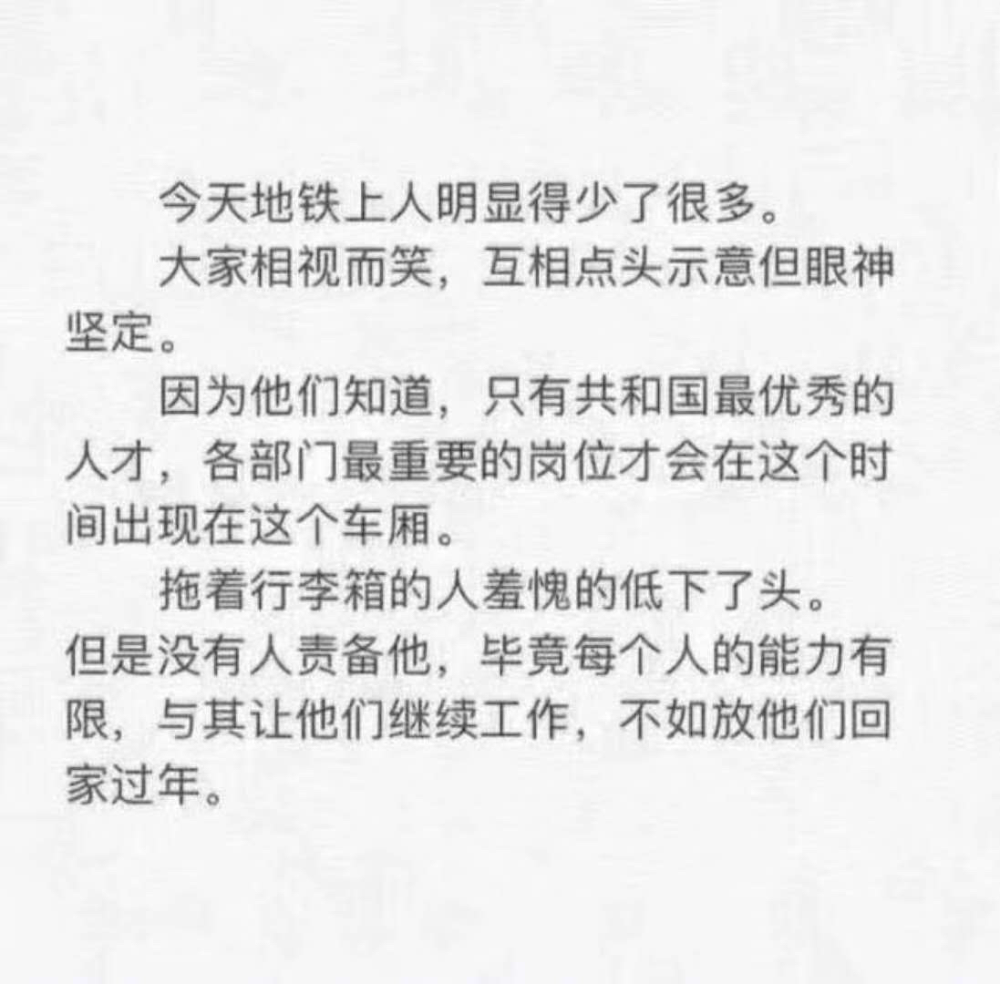

            690楼 | 风中的名义 | 2018-02-11 00:44

哎，今天还要上班。  
早上看见建豪手机有条信息跳出来，手机欠费哈哈，刚给他充了点话费。  
（对啊，第一天他的手机就录入了我的指纹，我的faceID不能录入他的脸，但是我把手机密码换成了他的生日）  
不要谈什么空间、什么隐私、什么自由。爱情从来都是自私且没有尊严的。  
建豪这个人呢，对于隐私的问题，可以说是一点儿也不看重，各种随你看随你查，还巴不得你天天盯着他的行踪……  
之前跟大家讲过，他坚决不允许两人跟其他任何人一丁点接触。  
昨晚有段对话如下：  
建豪：万一我过年去你家被赶出来怎么办？  
我：没办法，我老家有哥们可以收容你。  
建豪：Y哥的事你没长记性？还敢让我跟你其他朋友接触？  
我：没事，那哥们是个0。你去上他吧，我没意见。（认真脸）  
建豪（放在我肩上的手马上拍了一下）你可不行！不管是前面还是后面，都不行！！嘴巴也不行！！  
我：哥，我觉得还行啊，以后给你找个0给你玩，我都行，哈哈。我觉得性跟两人的感情也不是这么完全挂钩的吧？  
……  
聊不下去了，就看到建豪郁闷地噘嘴。  
我赶紧安慰：没有别人没有别人，以后都没有，我都听你的，听你的。

            691楼 | 风中的名义 | 2018-02-11 01:11

建豪这个家伙对爱情总是很悲观。  
昨儿他不是叫着已经等我很久了嘛。  
我爬上床就是一顿抱抱，再来点口水交换……  
嗯，有那么几分钟，我们就这么抱着没有说话。安安静静的。  
我问建豪，你想啥呢？  
他说，something bad……  
我一脸诧异：what?这个点儿你想什么坏事儿？  
建豪摇头不说，我非要让讲出来。  
建豪说，好吧，我在想你是不是对每一个前任都这样好，是不是对我只是花言巧语，是不是不久就会离我而去……  
也难怪，建豪这个人封建又保守，在没有什么情感的家庭长大，前三段恋情又都是被劈腿结局。  
哎，不知道要怎么安慰他。  
巴黎姐妹帮我证明一下吧

            692楼 | 风中的名义 | 2018-02-11 01:32

建豪抱着我，一起躺着看《歌手》

            697楼 | 风中的名义 | 2018-02-11 14:28

一到上班就起不来，一到放假就睡不着。恨自己这不争气的身子。

            699楼 | 风中的名义 | 2018-02-12 00:01

\*\*\*居然吼我：你醒了就一直动，我都没睡着过了

            700楼 | 风中的名义 | 2018-02-12 00:50

别提了，你们建豪老公凶我醒了一直动，吓得我戴着耳机看微信阅读里的书，稳如磐石，不动如山…

            702楼 | 风中的名义 | 2018-02-12 01:03

今天是我跟建豪加上微信，正式认识的整整一个月。  
明天一早我们就要分离了，所以今天我们要做一些特别的事。

            709楼 | 风中的名义 | 2018-02-12 13:42

你们建豪老公刚目送我进了车站，回头看着他，特别闪亮，又白又嫩，么么。  
等我回来😊

            713楼 | 风中的名义 | 2018-02-13 00:46

嗯，带着建豪的颈枕想眯一会儿。起太早了，困。  
刚一闭眼，听着耳机里的音乐（抵抗那些火车上外放儿童剧的小孩），迷迷糊糊想起了昨晚。  
建豪坏笑着说：我说过，跟我\*\*过你会更喜欢我。  
哈哈哈哈，羞死人惹。

            715楼 | 风中的名义 | 2018-02-13 01:22

嗨，送大家一张真理寺的图。  
愿世界和平，巴黎春天，姐妹情深。

            726楼 | 风中的名义 | 2018-02-15 08:30

几天没见建豪，想得不行…其实…也就两天？  
度日如年

            728楼 | 风中的名义 | 2018-02-15 14:36

清晨醒来。  
窗外隐约传来汽车、摩托的行进声。  
因为空调开得足，再加上窗帘禁闭，丝毫感觉不到曼谷的酷热。  
（昨儿在大街上真的把我热得要倒地了，平日不管冷热天气都呆在办公大楼里，早已经不太习惯暴露在这么严酷的环境里了）  
悄摸洗漱完，又戴上耳机坐回床上打开手机看了一会儿书，却静不下来，一直想我们家那口子。  
这几天忙着安排行程，冷落了他，虽然每天都有视频聊天，不过也能感觉到他的失落。  
他家亲戚朋友不像我家这么融洽热闹，这种节日更是每天尴尬，无奈我不在身边也不能陪他。  
嗯，明年春节一定带着他一起回我家。

            737楼 | 风中的名义 | 2018-02-17 00:54

我悟出来一个道理：  
爱他，就要把他当儿子养。  
真的。

            738楼 | 风中的名义 | 2018-02-17 00:55

这几天没空日更，感谢巴黎姐妹的私信和祝福。  
2018我真的没有更多的期望了，或者说，接下来的很多年都不敢有什么奢望了。  
有建豪的陪伴，我很满足。  
几年前在泰国拜了不少佛，许了不少次愿。  
这次，终于可以心满意足地还愿。

            739楼 | 风中的名义 | 2018-02-17 00:58

你们的老公要拉黑我惹…

            741楼 | 风中的名义 | 2018-02-17 17:32

明天就可以见到建豪了。  
这两天，一直在“哇，这个小哥挺帅的”和“嗯，不过我家那个还是最帅”中来回默念。  
哈哈哈哈୧\(๑•̀⌄•́๑\)૭

            745楼 | 风中的名义 | 2018-02-19 04:58

明天你们的老公要来接机，要见他的公公婆婆了，为他感到紧张

            746楼 | 风中的名义 | 2018-02-19 08:47

建豪身上居然有中淡淡的奶香，大概是香水的残留跟他的体味混合的吧。  
建豪最爱贴在我身上闻了，唯一的癖好就是闻我身上的味道。  
然鹅，我又不施粉黛，有啥好闻的？  
昨儿建豪机场接机，安排住宿，陪吃陪逛。  
饭桌上，我妈说，建豪怎么长得这么漂亮？  
哈哈哈哈，我看建豪脸都红了。  
饭桌例行逼问我女友的事，问我啥时候给他们带个惊喜。  
我说，今天带这么帅个同事，不算惊喜吗？  
大家纷纷表示，惊喜惊喜，非常惊喜。  
哈哈，吃完饭，很心机地集体合影了。  
没错\( ¯ᒡ̱¯ \)و  
建豪已经拍了我们的全家福了哈哈😄

            752楼 | 风中的名义 | 2018-02-21 03:05

我现在单枪匹马带家里人吃饭。  
阿姨说，昨天那个小伙子，多细心，观察又细致，blablabla  
简直不敢骄傲

            753楼 | 风中的名义 | 2018-02-21 03:55

晚上跟建豪看了唐人街探案。  
自从跟他在一起，什么后排，什么角落，完全没有在怕的。  
反正也是牵牵手，亲亲脸。  
今儿买晚了票，坐到了最角落。这下可以整个头都靠在建豪肩上了，差点睡着了我。  
时不时对着他耳朵说：叫我。  
建豪就靠过来对着我的耳朵说：老公。  
哈哈哈，我笑着亲他一下。  
建豪说：那你叫我呢？  
我对着他耳朵说：老公。  
哈哈哈，笑作一团，捏捏小手，亲亲老脸。

            761楼 | 风中的名义 | 2018-02-21 15:45

一大早边拉屎边打游戏。  
突然听见建豪大叫：亲爱的，你在哪儿？  
我吓了一跳：我在厕所…干啥？  
建豪：我做了一个梦…  
我喊：啥梦？  
建豪：梦见我跟戏精牡丹吵架…  
我：………

            762楼 | 风中的名义 | 2018-02-22 02:23

刚才打了个类似你们老公身材的肉照，被系统删了

            764楼 | 风中的名义 | 2018-02-22 03:35

晚上我妈跟阿姨要做饭。  
我跟建豪陪着他们在超市买食材…  
困死我了😪

            767楼 | 风中的名义 | 2018-02-22 07:16

上班咯！  
祝巴黎姐妹新的一年工作顺心，万事如意，早日找到Mr\. Right\.  
我的Mr\. Right 现在正在送我的亲戚团去高铁站回家呢。  
这几天，他们可是对建豪赞不绝口，各种满意呢。辛苦我家亲爱的了。  
如果他们知道晚上我跟他都是抱在一起睡觉的，会不会打断我的腿…  
哈哈哈哈…

            774楼 | 风中的名义 | 2018-02-23 00:44

更到现在，也没什么好写的了，不知道要不要把一些隐藏在故事背后的东西写出来。  
事物总是两面的，有幸福甜蜜的一面，却也伴着不为人知的略苦楚的一面。  
听建豪的吧，我相信他一会儿会来审查各位姐妹放荡的留言，你们说的话，他应该都看过，哈哈哈

            776楼 | 风中的名义 | 2018-02-23 04:51

下班咯，跟建豪吃饭去\( ˘ ³˘\)♥

            779楼 | 风中的名义 | 2018-02-23 09:43

建豪扮好饭，自己分了一小碗，剩下全端给我。  
我说：你给我这么多？？？我俩饭量谁大啊…  
他说：差不多吧？  
我回：真的吗？那你怎么长那么多肉？  
他：

            780楼 | 风中的名义 | 2018-02-23 10:15

我在床上看书。  
建豪肚子不舒服躺在一边，头枕着我的腿。  
突然，他抓过我的手，拿着我的食指在他鼻孔里晃了两下。（鼻子高挺就是不一样，鼻孔真大哈哈哈）  
我问：你干啥？  
他说：挖鼻屎。  
我：

            782楼 | 风中的名义 | 2018-02-23 11:57

惹…突然接到建豪电话，要求晚上去他妈妈家吃饭

            793楼 | 风中的名义 | 2018-02-24 05:08

已经坐上taxi了  
你们的老公来公司楼下等我，我下班他就叫车，然后一起钻进了后排。  
应该没有同事看见吧。  
好紧张哦\( •̅\_•̅ \)

            796楼 | 风中的名义 | 2018-02-24 10:18

建豪说，今天你要来，还有小姨一家，我妈一定火力全开，使出浑身解数做菜。  
把我给紧张的哟，到了他家附近超市，赶紧买牛奶酸奶哈密瓜坚果啥的，乱拿一通。  
我一边手忙脚乱地整理龙眼，一边觉得自己超级搞笑，长这么大还真没做过这些。  
最后建豪拎着一堆东西走出超市。边走边说，我先拎着，等到我家你再拎进门。  
嗯嗯，我点头如捣蒜。

            801楼 | 风中的名义 | 2018-02-24 15:48

一口气爬上楼，建豪要开门。  
我赶紧制止：等等等等，我还在大喘气，让我缓一下。  
等我稳定了呼吸，建豪这才打开家门，推门进去。  
我赶紧准备好微笑\(•̀⌄•́\)。  
跟家里的各位一一问好。  
建豪妈在厨房忙碌着，我赶紧跑进去给阿姨拜年。  
建豪妈一边跟我寒暄，一边盯着我看了好几秒，仿佛要把我看穿了似的。  
紧张，紧张。

            802楼 | 风中的名义 | 2018-02-24 15:53

好家伙，这顿饭是我这辈子见过最豪迈的北方菜，一个凉拌菜能整一盆的。  
哈哈哈，我看着一大盆又一大盆的菜，真是觉得很好笑。不过建豪很开心，建豪妈这次真的很用力，做出这么多的菜。  
一顿下来真给我撑坏了，到现在也没消化。

            803楼 | 风中的名义 | 2018-02-24 16:00

吃完饭，我躲在房间消失，一直到很晚，其他客人才走了。  
这才正式跟建豪妈开始谈话。  
还没说上两句呢，阿姨的红包先递过来了。  
哎呀，马上羞红了脸，这是干啥捏。我可不是上门啊，转头一想，大概是个拜年红包。  
建豪说接着吧，我就乖乖接过来了。

            804楼 | 风中的名义 | 2018-02-24 16:04

我跟建豪在桌边坐下，建豪妈坐对面。  
我们开启了长达一个多小时的双边会谈，有感动，有暖心，有希冀。  
不能一一详述，仅总结主要会议精神。  
一，阿姨说建豪自又品学兼优，为人正直，品性纯良，是一个非常可靠又心地善良的小伙子。  
二，阿姨说听说小W是研究生毕业，也是一个听话的好孩子，今日一见，你跟建豪能互相吸引，有缘走到一起，很好。  
三，阿姨说对建豪的要求只希望他身体健康，感情生活幸福，你跟建豪都要好好加油，把日子过好。

            806楼 | 风中的名义 | 2018-02-24 16:09

四，阿姨说，我现在见到你了，那也要开始为你担心了，你也要好好照顾自己。两个人都是急性子，要互相谦让。  
建豪，你不要这么懒，不能老让别人做家务。

            807楼 | 风中的名义 | 2018-02-24 16:11

席间有很多搞笑的事。  
他们聊起建豪小的时候，说建豪特别能吃，整天都在吃吃吃，是小区里著名的肥仔。  
哈哈哈哈୧\(๑•̀⌄•́๑\)૭  
阿姨跟我聊天的时候，我一直捧着建豪的左手，摩挲着。  
而他，翘着二郎腿，一直在用右手抠脚！！！  
要不是阿姨在眼前跟我谈话，我早把建豪臭骂一顿了。

            809楼 | 风中的名义 | 2018-02-24 16:31

夜宿对象家里。  
这个建豪，半夜一直挤我，快把我挤到墙上了。  
半夜被挤醒，使出吃奶的劲儿把他往外推了几厘米，好在他被推醒了，自己挪出去。  
我俩身高相同，但体型迥异。经常下楼的时候，我跳到他身上让他背我走。建豪高高壮壮的，那叫一个稳当。  
那天我说试试背背他…几乎失败…咋这么沉呢？？？？

            814楼 | 风中的名义 | 2018-02-25 00:23

来的路上我就一直记着，要看建豪小时候的照片。  
昨晚刷牙我还突然跑出洗手间去喊建豪拿，他一直扭扭捏捏说黑历史太多。  
哈哈，越说越好奇，一会儿等他醒了就让他去翻出相册。  
我倒要看看现在长成男神的建豪以前有多胖。

            815楼 | 风中的名义 | 2018-02-25 00:25

昨天早晨醒来已经八点半了，建豪依旧沉睡着，紧紧抱着我不让我动。  
于是我又睡了过去，做了好多好多的梦，再次醒来已经快中午了！  
赶紧爬起来洗漱，阿姨已经在客厅坐着玩儿手机了，看我们起来了，就跑去厨房忙活。  
昨儿晚上巨多的菜，中午看起来仍是非常的多，三个人十个菜……  
这浮夸的用膳风格，也是让我惊讶。  
吃完饭，建豪手磨了咖啡，居然还手动打出了奶泡，给我做了一杯卡布奇诺。么么。  
换好衣服，就坐车回来了。  
我收拾家里，建豪外出跑步。等着晚上跟小C小D吃火锅。  
结果吃饭的吃饭的时候居然闹了些不愉快。  
真是屎尿未及惹。

            822楼 | 风中的名义 | 2018-02-26 09:21

忘记说了。  
昨天中午爬起来，建豪第一个任务就是找相册。  
翻箱倒柜拿出来一个大大的相册集，一打开就是我们家无敌可爱的建豪。  
从刚满月大大的眼睛流着口水的萌照，到三四岁皮肤白净笑容甜美的瓷娃娃一般小洋人儿似的照片，到小学突然变胖的肥仔照。把我笑得乐不可支。  
建豪小的时候真的特别特别特别的可爱，我见过那么多幼儿园的小朋友，建豪这个算得上数一数二好看的了。而且据他妈说，小时候可会拍照了，只要一喊，马上姿势就摆好了。  
（我心想，这么会摆姿势，别是从小就是个基佬吧）  
后来突然变胖，拍照就不那么配合了，照片数量也少了很多。  
不过还好高中瘦回来变成了男神，连以前不大的眼睛也突然有了欧式双眼皮。  
有次他认真地说是前年去韩国激光做的双眼皮，我差点信了……  
老天真是不公平，怎么会有自然越长越美的人？

            823楼 | 风中的名义 | 2018-02-26 09:27

说回周日晚的火锅吧。  
小C从家乡回来，带来她的好姐妹小E。所以这顿火锅就是去建豪心心念念好久的地方，跟小C/D/E一起开心了。  
建豪负责点菜，小D负责提前半小时去排位，我们到了之后其实没等多久就有位置了。感谢小D。  
吃饭的过程我觉得还挺愉快的，毕竟都是比较熟的朋友了。  
可是吃到尾声的时候，我因为夹了一筷子面吃不下，问建豪：要不你吃吧？  
他突然黑了脸：现在想到我了，我才不吃。  
有点尴尬\~  
赶紧安排结账，大家出去走走。  
路上建豪闷不吭声，我一直追问，他这才告诉我。  
是因为吃饭的过程中，都是建豪在给我夹菜，照顾我。而我却一直在给小D夹菜，没有管建豪。  
他自然是看在眼里，气在心里。  
哈哈哈哈，赶紧好说歹说把建豪哄回来。  
其实也是我心太大，忘了照顾建豪。主要是想着桌上5个人，小C跟小E好姐妹，我跟建豪不必说。  
小D刚分手，一个人挺落寞的，所以难免多给他夹些菜，多跟他说说话，照顾一下。  
哈哈，我记得刚认识的时候，建豪也因为我逛街的时候勾肩搭背了小D而心生不快。  
哈哈，这个可爱的建豪，那他没办法。  
我以后注意咯。

            826楼 | 风中的名义 | 2018-02-27 02:15

转眼跟建豪已经在一起一个多月了。  
其实每天的生活都是很甜的。  
前两天回家路上买了车厘子，到家建豪又是洗澡换衣服坐上床。我就洗好车厘子，跑到床前，非要抛起来让他接着吃。每吃一颗都得抛上好几次才行。不过我还是乐此不疲，建豪也不恼不气。  
建豪最好的一点，就是很听话，也常常任我摆弄。  
说让背就背，让扒光就扒光，让他晒被子、晾衣服，他全都照做。  
所以有时候看着憨态可掬的他，我总是觉得特别好笑又可爱。  
今天早上起床稍早了一些，我洗漱完穿了一半衣服又跑上床抱着他，在他脸上亲来亲去，他迷迷糊糊地说：你要刮胡子了，我脸疼……  
哈哈哈哈。

            827楼 | 风中的名义 | 2018-02-27 02:58

笑哭了。  
刚才亲亲我问他：你咋在翻白眼？  
他说：你是不是晚上应酬喝酒了，刚回来又吃了橙子，布丁，喝了安慕希。  
我说：不是，我还喝了可乐…  
建豪有气无力：你还是去漱个口吧。  
哈哈哈哈哈

            835楼 | 风中的名义 | 2018-02-28 14:23

各位姐妹元宵节快乐！  
今天晚上要回建豪家陪建豪妈过节。  
明天终于要见一见建豪的朋友们了

            841楼 | 风中的名义 | 2018-03-02 01:02

哇，世界上居然有这么好吃的东西？？？  

            845楼 | 风中的名义 | 2018-03-02 13:01

吃完好吃的  
我已经撑到变形，再加上下了班就一阵赶路来建豪家，已经很乏了。  
于是直接打车回家。  
元宵节真难叫车，起码等了二十分钟才上了车。  
结果龙体倦怠，上车我就靠在建豪肩膀上睡着了。  
大概睡了二十多分钟吧，被建豪摇醒，他说快到了醒一醒。  
迷迷糊糊跟着建豪下车，回家的路上，他看着天上的满月，说：刚才在车上看着你睡得那么深沉，好幸福。  
哎哟，月光下的情话boy。  
我说，最近我变成了一个特别能吃还特别容易睡着的中年了…  
建豪说，那多好呀，幸福！

            846楼 | 风中的名义 | 2018-03-02 14:58

到了家，建豪妈煮好了元宵。  
我拿出手机，看到小C小D群里很热闹。  
我一翻聊天记录，\*\*鸡哟！！！  
建豪趁我睡着的时候把我拍了发到了群里！！  
就是那种我看在建豪肩膀上，仰着头迷之角度，嘴巴半张的丑照！！！  
小C在群里重复了好几遍：真丑…  
好好的元宵节，定格在这样的照片里…

            847楼 | 风中的名义 | 2018-03-02 15:02

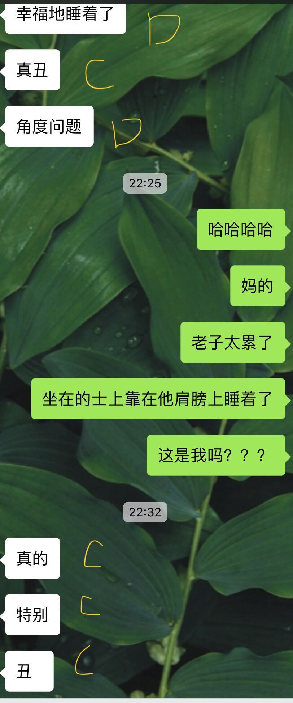

            848楼 | 风中的名义 | 2018-03-02 15:04

到家躺在床上，突然兴趣盎然。  
于是申请近距离访问建豪。  
嗯，距离很近。  

            853楼 | 风中的名义 | 2018-03-03 10:10

昨晚吃完饭去小C家拿东西，临上楼建豪突然表情痛苦地扶住我。  
把我吓一跳，赶紧问他怎么了。  
他说：菊花疼\(৹ᵒ̴̶̷᷄﹏ᵒ̴̶̷᷅৹\)…  

            856楼 | 风中的名义 | 2018-03-04 00:28

建豪头埋在我怀里睡觉，我单手游戏。  
然鹅，也并没有带来爱情的力量…  
气鼠惹…

            858楼 | 风中的名义 | 2018-03-04 01:44

大家好，新的一周，新的工作，一定都不怎么情愿吧哈哈！  
为了给建豪过好生日，年前就买好礼物放到小C那儿。  
又提前一周跟小C小D各种安排，终于让建豪在意外与惊喜中度过自己29岁的生日。  
在这里，要再次感谢小C和小D的辛劳付出。

            860楼 | 风中的名义 | 2018-03-05 02:16

我在家学习充电，他在外面跑步锻炼，还能顺变跑个腿。  
多好

            864楼 | 风中的名义 | 2018-03-06 13:11

跟建豪去朋友的店沐足。  
朋友问，你们是要生姜呢，促睡眠呢，还是醋呢，还是blablabla\.\.\.  
建豪说，有没有通便的？

            869楼 | 风中的名义 | 2018-03-10 09:45

今天想去看黑豹。  
看豆瓣评分不高…所以到底看不看呢？

            874楼 | 风中的名义 | 2018-03-11 05:58

周一的早上总是格外繁忙紧张。会议一个接一个简直令人有些恍惚。  
还是忍不住悄悄打开文档，一点一点敲一些文字。  
回忆一下给建豪过生日的细节吧。  
那天醒来已经十一点了吧，虽然年纪大了，不过有时候强制睡懒觉也还是能做到的哈哈。  
建豪问我，那我们今天还是下午跟小C小D约在\*\*mall 见面吗？  
我说：对啊，晚上就去西贝吃饭好了，吃完想玩儿啥就听他们的意见呗。  
建豪很乖巧地点头。  
相处久了，我发现建豪真的是一个很乖很可爱的人，不爱挑剔，常常是我说什么他就听什么，我有什么提议，建豪全都同意。  
磨磨蹭蹭爬起来（懒起画峨眉，弄妆梳洗迟），我跟建豪说，你今儿要打扮得好看一点，毕竟过生日，要拍照呢！  
建豪点头，问我，那我今天是穿这个蓝色的衬衣， 还是这个粉色条纹的？  
我想了想，粉色吧！  
终于出门了，打算跟建豪吃日料去。排队都排了半个小时，我们在商场里瞎逛，等到吃饭的时候已经一点半了？  
我俩这边闲散自得，其实小C小D那边都忙得炸开锅了。

            878楼 | 风中的名义 | 2018-03-12 02:00

其实早在一周前，我跟小C小D就安排好了这次生日的惊喜。  
小D把这个事当做项目管理，做了一整套方案。  
有人整气球，有人整晚餐，有人整住宿，有人整圈套。  
哈哈，我就那个负责迷惑建豪，全程带着他慢慢游走，误入趴体现场。  
吃完日料，我坚持要继续逛街，要买几件新的衬衣。哎，我觉得建豪根本就是个天秤座。选择困难起来，真是吓人，点外卖、选衣服，都是。  
（所以你选择苦难这么严重，你是怎么选中我的？）  
买完衣服，已经快三点了吧，我佯装打电话给小C。  
小C哇，你在哪里啊，我跟建豪直接去\*\*mall等你们吗？啊？你们在\*\*啊，我们也在这附近呢！你还要再逛一会儿？那我跟建豪去那里等你们？我们去星巴克见面吧？好好好，那我跟建豪现在过去吧，星巴克见。  
哈哈哈，一套对话下来，呆萌建豪当然是乖乖点头跟着我走，丝毫没有察觉我要带他去哪里。  
可能心里还在想着要早点去排队吃西贝吧。  
我真的是要忍住心里的狂笑，还要不断跟建豪边聊边走，每分钟都在破功的边缘。

            879楼 | 风中的名义 | 2018-03-12 02:20

跟建豪慢慢散步到了星巴克，人贼鸡儿多。完全没有地方可以坐。  
建豪此时又特别暖，给我占了一个位置让我坐下，自己又跑前跑后找了一把椅子搬到我身边坐下。  
我一直低头微信询问小C小D的进度。  
后来我实在是有点绷不住了，起身借口要去厕所。  
建豪乖乖坐着肝阴阳师。  
大概等了五分钟，小C发来消息，可以过来了！  
我跟建豪说，小C他们在那边呢，发了个定位给我，我们导航过去吧！  
建豪点点头，乖巧地跟着我，他说：往那边走吗？地铁在反方向呢，咱慢点走，等小C过来吧？  
我说：你看，小C在这个位置都没动过，可能是在看什么吧？我们慢慢走过去？  
建豪没说话，跟着我走。  
突然，小D已经出现在前面，斜靠着一栋复古的大房子门口，对我们坏坏地笑。  
建豪一脸懵逼。  
哈哈哈哈哈……

            880楼 | 风中的名义 | 2018-03-12 02:34

话说看见小D出现，我就径直往里走了。  
进第二道门的时候发现小C躲在门后面手里拿着气球。看着我嘿嘿笑。  
只听见我身后的建豪一直在叫：what?这是什么？怎么在这里？  
等他走进来的时候，小C啪地扎破了气球，大叫：Surprise\!生日快乐！  
哈哈哈哈，我能感受到建豪的惊讶与开心。  
我环视四周，墙上已经贴好了happy birthday的气球，麻将，零食，水果，小D调的酒，一应俱全。  
整个房间布置得温馨可爱，让我心头一热。  
赶紧跑去厨房把他们买的水果都洗了端出来。  
电话响了，我定的蛋糕到了，赶紧接进来放进冰箱。  
哈哈哈，现在想想还是觉得好笑，建豪可以说是很激动了，一直疯狂留影，还在气球下面亲我，让小C给拍了一张。嗯，他还发到朋友圈去了（带分组的）。平时很少发朋友圈的建豪，那一天他连发了三条朋友圈吧。

            889楼 | 风中的名义 | 2018-03-15 08:09

在房间摆摆桌子，这看看那整整，一栋复古老宅真的充满了情调，窗外的绿树和窗纱，布满了灯光，慢慢闪烁，朦胧迷离的美感。  
我们一时兴起，决定就在这窗边吃饭了。  
小D早安排好了一家酒店的外卖。可是在吃之前，我还有很重要的工作没有做：给建豪煮一碗长寿面。  
小C小D早给我买好了面、番茄、鸡蛋，房子里也有各种调料。  
这里不想讲了，我这个菜B，完全没进过厨房，煮个面老费劲了，最后还贼难吃。  
只有建豪一个人吃完了自己的一大碗，其他三人只有一点点，都没怎么吃。  
我对自己煮的这碗面，给负分，毫不客气地说：真鸡儿难吃！  
难为我们建豪，靠着远超常人的毅力和对我的爱，吃完了面……  
给你一个爱的么么哒

            890楼 | 风中的名义 | 2018-03-15 08:14

吃完饭，我让他们休息，自己赶紧把碗筷厨房都清理了。  
毕竟让他们吃了这么难吃的面，我要将功补过。  
小D调的酒真的挺好喝的，脉动\+柠檬\+伏特加，不能喝酒的我也能喝上不少。  
收拾完毕，大家想出去散步消食。  
走之前，我说，等等！我们小C妹妹昨天辛苦到凌晨4点才睡，为了送你一个礼物。  
小D打开了电视，看到一个命名为《环太平洋》的视频（哈哈，因为这个电影是我的最爱，对，环2马上要上映了！约起来！）  
点开视频的一瞬，本来就一直处在开心幸福眩晕状态的建豪更晕了。  
因为这是小C给建豪做的庆生视频。开场都是我上次去建豪家偷拍出来的他小时候的萌照、黑照、逗逼照。  
第二段是建豪跟我相识的日子里留下的点滴影像。  
第三段是我们这些天找各种朋友录的“祝你生日快乐”的视频集锦，这几天我们发动了身边各种朋友录回来这些小视频，有公司同事，有国外的朋友，有我的金边王子，有我的小侄女，有小D项目组的朋友，有小C的朋友。  
我这人泪点可低了，看着看着我真的眼睛湿润了。  
一直辛苦小C小D为这个惊喜准备着，我感动幸运，能遇到建豪，更因为小C小D的支持与陪伴感到幸福。

            891楼 | 风中的名义 | 2018-03-15 08:23

建豪看完视频，心绪难平。  
因为他不知道我们的惊喜是这样一波一波的，哈哈，所以只好再发一次朋友圈。  
散步回来，大家开始打麻将。不好意思，我一人赢他们三家。  
然后又一起看了《小萝莉的猴神大叔》。不好意思，我跟小D哭得泪流满面。  
到了十二点，百密一疏发现没带火机，小C赶紧 下了一个吹蜡烛的APP（黑人问号？？）  
蛋糕是啥口味我都忘了，反正外面有一圈玫瑰花。  
用手机记录下建豪许愿吹蜡烛的样子。  
生日趴，就这么结束了。  
希望建豪每天都开心快乐，小C小D也能平安喜乐。

            892楼 | 风中的名义 | 2018-03-15 08:32

OMG\!\!\!  
居然有贴纸！！！！！  

            900楼 | 风中的名义 | 2018-03-17 05:26

完了，你们老公变娘了

            907楼 | 风中的名义 | 2018-03-22 07:29

我就想知道王者荣耀还有没有新玩家进来了？  
我一个小钻石带建豪入门打打青铜排位，能给我打蒙圈了！  
你说没新手吧，那我的队友都拉莫蠢是怎么回事？  
对手总有两三个秀的，把我们按在地上摩擦…  
好几天了，胜率惨不忍睹，经常是系统送一把对面机器的，才能屈辱赢一把。  
今天下午气到卸载。  
打什么农药，真是伤身体！  
（与其在峡谷被打哭，不如在床上被\*哭）

            914楼 | 风中的名义 | 2018-03-25 12:01

我知道我也挺渣的，但是遇到队友无脑抢野，各路崩溃，一个阿轲芈月能把他们打成狗…  
打十把赢一把，真的气die。  
这还是青铜局吗？？？？

            917楼 | 风中的名义 | 2018-03-25 12:19

晚上吃完饭，跟建豪走到我们常去的公园。  
昨天还跟建豪和小D在这里夜跑来着，所以对这里很熟悉。  
有行人，有情侣，有吉他弹唱，有小孩溜冰。  
有微风，有湖水，有轻云蔽月，有建豪在侧。  
我问他：你说，再过个四五年，我会不会对你的容貌厌倦了？习以为常了，不再珍惜你了？  
建豪答：这是你的问题，我说过我不会。  
我一时语塞。  
这个建豪，已经相处三个月了，每每谈到未来的事，总是信誓旦旦又毫不犹豫地表达要钟情一辈子，要安安稳稳在一起。  
常常有巴黎姐妹私信催更，可是我真的不知道要更什么啊！！  
你看你们建豪老公，生他气都生不起来，不知道有什么故事要写。  

            923楼 | 风中的名义 | 2018-03-27 13:56

我突然想起来，好像也不全然是一点矛盾也没有，就细细跟大家掰扯一个吧。  
我觉得主题应该叫做：“我”与“我们”的转变。  
有句话，我要讲在前面：单身久了，真的没好处。  
想想我这三十年，除了有过一段半年多的跟男友生活的时光，其他时候我都是一个人。这意味着什么？意味着我醒来可以随意点个外卖，躺着打农药没人管；意味着我可以五分钟收拾好行李背着包出去旅游；意味着我在便利店可以随便买自己爱喝的七喜、巧克力味的奶；意味着我可以随便买一场深夜电影自己坐在影院看；意味着我可以一时冲动买机票就去跟好朋友见面。  
这样的生活美吗？（其实挺美的啦）  
但是，现在回想起来，其实真的没那么好。

            924楼 | 风中的名义 | 2018-03-27 14:03

认识建豪以后，一切都变了。  
醒来身边躺着一个大帅比，让我心情美美的同时我也不能老吃外卖，更不能捧着手机打游戏不管另一半（游戏和伴侣你要二选一，当然最近我把建豪带到王者峡谷，让他看到我被别人挨着地上打，可是他只是个帮不上忙的小萌新，哭唧唧

            925楼 | 风中的名义 | 2018-03-27 14:15

晚上带了公司电脑回来写点东西。建豪看我加班就自己去跑步了。走之前把刚买的小芒果放到我身边让我记得吃。  
半小时后，我发了条微信给他，说刚买的小芒果贼鸡儿好吃，我一口气吃了三个。  
然后！果不其然，刚刚你们老公回来的时候，手上又拎了六个小芒果！！！！  
我一边煮饭，他一边坐在我旁边给我剥芒果，塞到我嘴里，又是递纸巾，又是拿黑加仑！  
导致我半天没有煮出来多少！  
年前，你们老公陪我去做西装，上周末做好了去试穿，腰围居然小了！！！！！  
又要改大一寸！！！！！  
我过了一个假年……中年发福的日子终于来了。

            926楼 | 风中的名义 | 2018-03-27 14:22

本来想写一个思辨意味的“我”与“我们”的转变。  
写不下去了呢，简单说，就是从一个人变成两个人，你必须舍弃一些单身的便利，拥抱双人的变化，也许会有不适，会有摩擦。  
但是，1\+1&gt;2，在爱情里是行得通的。  
毕竟，两个人在一起，是为了成就更好的彼此。

            927楼 | 风中的名义 | 2018-03-27 14:24

接着说矛盾。  
其实我跟建豪之间的矛盾，我想了很久，大概用双人滑冰的概念比较好理解。  
建豪因为之前的感情经历，都是较稳定的，这也把他天然训练成了一个熟练的双人花滑选手。  
而本可儿，姐妹们知道的，没什么稳定感情的经历，所以我可能就是习惯了单人飞翔。  
这就造成了一些矛盾：建豪伸手的时候，我可能跑开了；建豪觉得应该一起前进的时候，我可能完全没有意识到；建豪感觉要来个托举啦，我可能在跟别人挥手致意。  
（为什么要举这个我完全不懂的运动例子……）  
当然我觉得我自己做得挺好啊，滑得挺美啊，可是忘了现在是双人花滑。  
所以，建豪常被我气到黑脸。  
而我一脸懵逼：我错哪啦？

            939楼 | 风中的名义 | 2018-03-29 02:26

可是有矛盾也并不全然是坏事。  
以前，我都是跟年纪比我大的人交往。所以在感情的世界里，常常是被迁就、呵护、照顾的一方。  
现在跟比我小俩月的建豪一起，虽然他人很成熟，但是当然也免不了有一些孩子气，我们更多的是互相关心、呵护。  
跟建豪沟通多了，了解了彼此的需求，我常常暗自反省：妈呀，就我这脾气秉性，以前的朋友真的容忍我太多了！  
确实是我太任性又大条，被人包容习惯了。  
所以有时候，不禁感慨，难道我这三十年白活了？为什么在设身处地为他人着想方面，经验几乎为零？  
同事有时候说我稚气，大概就是因为替别人想的少吧。  
我看巴黎的姐妹个个古灵精怪，左右逢源的，想来在工作学习中，应该比我做得更好吧。

            940楼 | 风中的名义 | 2018-03-29 02:33

建豪昨晚说可以爆照了…问我应该在哪一楼爆照比较好？  
我也不知道\( •̅\_•̅ \)

            941楼 | 风中的名义 | 2018-03-29 04:35

事情是这样的，昨天晚上躺在床上我在翻看那天去建豪家拍的他小时候的照片。  
我说，巴黎姐妹都很想看看建豪的样子。要不从这些小时候的照片里挑一张给大家看看。反正小时候也可爱得像个瓷娃娃。  
建豪说，我可不想当网红，那就挑一张外人见不到的小时候的照片吧。  
于是……  
你们一会儿看到了别打我哈哈哈哈

            984楼 | 风中的名义 | 2018-03-29 05:18

呐，建豪的照片

            1007楼 | 风中的名义 | 2018-03-29 05:25

哈哈哈，姐妹们不要哭。  
这个照片建豪刚会走路一点点，也就一岁多吧？  
不过眉眼已经很可爱啦♪\(๑ᴖ◡ᴖ๑\)♪  
所以他现在的样子你们随便YY，至于以后有没有可能爆照，还是要听建豪的。  

            1012楼 | 风中的名义 | 2018-03-29 05:33

刚刚回到家，一边脱鞋一边想起建豪昨天晚上半夜把我敲醒，我当时以为是因为我抢他被子，我抱怨这家伙戏太多。  
结果他说以人格担保是因为我的呼噜声太大？？？？  
Seriously? 我这么身量苗条，体格风骚，我打呼噜？

            1019楼 | 风中的名义 | 2018-03-29 13:23

刚刚建豪出去跑步了，我在家吹某种乐器…一口气没换好，突然发出了猪一样的鼾声。  
本可吹乐器已经有十年光景了，从来没有发出过如此不堪又不优雅的声音。  
哈哈哈哈，联想起刚才建豪的抱怨，我真的要被自己笑出猪声了…

            1020楼 | 风中的名义 | 2018-03-29 13:26

每晚一集新白，带着建豪一起看起来

            1025楼 | 风中的名义 | 2018-03-29 15:33

昨天的呼噜梗，怕是过不去了😔。  
昨晚看完新白已经是00:14了。我把ipad一关就闭眼。  
建豪说：你是不是很困了？我看你眼睛都睁不开了。  
我说：对啊…  
……………  
后来发生了什么，不知道，因为我就是有五秒入睡的本领

            1027楼 | 风中的名义 | 2018-03-30 02:18

回到建豪家来了…深夜到访，阿姨都睡了哈哈哈

            1035楼 | 风中的名义 | 2018-03-30 15:47

我都怀疑我遇到建豪以后是不是魔障了？  
周周都忙得飞起。  
这周末另外一对儿夫夫来了。  
周五晚上拉上小C跟她室友小E（巧的是建豪的师妹）陪夫夫一起宵夜到深夜。  
然后两对夫夫四人跑回建豪家农药肝到两点多，第二天夫夫可乖巧了爬起来陪建豪妈去买菜做饭。  
（对啊，我就是陪着建豪睡到中午只负责吃饭的…）  
下午一起去看了《头号玩家》，强烈推荐！  
然后晚上再次折返到小C家，纠结小D小E外加我们两对夫夫…  
七个人喝得那叫一个昏天暗地…  
把小C喝吐了…

            1044楼 | 风中的名义 | 2018-04-01 08:38

这会儿赶紧把建豪从补觉中叫起来。  
金边王子的飞机已经落地半小时了，得赶紧去接他吃饭。  
这个姐妹国外呆久了，点名要吃海底捞。  
一会儿又得排队了。

            1045楼 | 风中的名义 | 2018-04-01 08:43

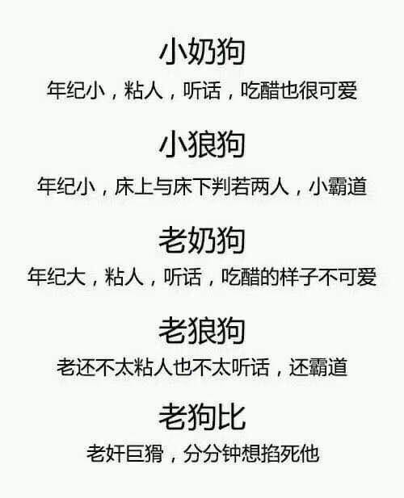

            1051楼 | 风中的名义 | 2018-04-02 09:24

最近有点不开心啊。上周五的晚上喝得high到飞起。  
回家的时候，一起身，就感觉膝盖疼，脚踝也不舒服，建豪扶着我说，没事，喝多了都这样。  
然后他就一直搀着我走。  
回到家我就百度了一下，妈耶，居然是痛风的前兆？嘌呤高（肉吃多了，确实）  
我用了个app监测睡觉的情况，妈耶，一晚上真的录了3个60s的呼噜声录音。  
我是猪吗？？？？  
要锻炼了，以前仗着自己瘦，肆无忌惮的。现在人到中年，三年从120长到了150斤！  
昨天中午，建豪摸着我肚子上的肉，还说：多好！我喜欢。

            1052楼 | 风中的名义 | 2018-04-02 09:32

今晚要跟建豪看这个…  
好几年没看恐怖片了，不知道是不是作死

            1054楼 | 风中的名义 | 2018-04-03 03:56

嘿嘿嘿，你们放假去哪儿玩儿？

            1057楼 | 风中的名义 | 2018-04-04 09:33

今天跟建豪一起去爬山了。  
就是那个我俩第一次聊天那天我爬的那个山，就是那个我被太阳晒得睁不开眼睛满脸褶子的那个山。  
哈哈哈，算是来还愿？

            1063楼 | 风中的名义 | 2018-04-05 13:54

@臭水沟老鬼

            1066楼 | 风中的名义 | 2018-04-07 14:36

连吞几次？我到底写了啥敏感词汇

            1081楼 | 风中的名义 | 2018-04-12 03:45

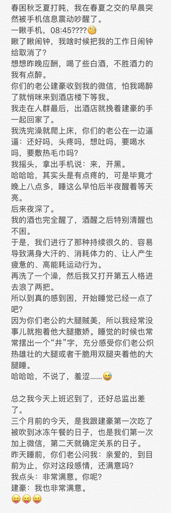

            1084楼 | 风中的名义 | 2018-04-12 03:50

西柚、抹茶、麻薯…  

            1085楼 | 风中的名义 | 2018-04-12 07:43

建豪永远记得我爱吃肉，爱喝酸的东西。所以买柠檬、西柚口味准没错。  
（有次他点菜点了一个酸菜红烧肉，说猜我爱吃…）

            1086楼 | 风中的名义 | 2018-04-13 03:19

哇，600粉了！

            1090楼 | 风中的名义 | 2018-04-16 04:46

可忙了最近。  
周末无休上课培训。  
辛苦建豪天天在外面转，让中介领着看出租房。  
昨天晚上下班一起去看了一处还不错的突然放租的房子，距离我跟建豪的公司距离都差不多。  
今天一早交了定金（说是昨天放租已经好多人来看了，今天又约了八个要来看？？要不要这么恐怖）  
这几天要忙着收拾打包，周末要搬家了。  

            1099楼 | 风中的名义 | 2018-04-24 02:46

发福利，好哇，一会儿发个四岁的建豪给大家😊

            1103楼 | 风中的名义 | 2018-04-24 11:03

你们老公要带妈妈出去玩儿，一走就是好几天。  
除了春节分开过几天，还从没有分开过呢。  
明天我就让他再拍一次手表，然后背景是摆成十字架的一双筷子。  
你们觉得怎么样，哈哈哈哈

            1112楼 | 风中的名义 | 2018-04-25 07:07

建豪虽然在外地，也心系着搬家的事。  
从来不会做饭的我，听到他买米买油，突然觉得日子既有烟火气，又觉得往如隔世颇为感慨，当然更多的是被幸福的感觉充盈了。  
心生爱慕，只需要一秒。可是涓流度日，却需要付出心力与关爱。  
其实前两日有过最大的一次争吵，不过结局仍是拗不过建豪亲昵的投怀送抱。  
我是一个冷静的摩羯，对于吵架从来坚持两点：一是吵架的目的是为了解决问题，探知对方的真实想法、底线；二是绝不翻旧账，只谈问题和未来。（怎么跟工作汇报似的）  
我知道我跟建豪的开始非常迅速也很魔幻，也担心过好景不长昙花一现的剧情，不过走到现在，都只是一步一步印证我的想法：  
建豪就是我的Mr\. Right\.

            1117楼 | 风中的名义 | 2018-04-27 09:39

今天建豪就要回来啦。  
想起在他家的时候，晚上躺床上聊天，他抱着我说：真不敢相信，我居然跟我男朋友在我住了十几年的房子里一起睡觉，居然带回家了

            1119楼 | 风中的名义 | 2018-04-28 01:41

每天让你们老公宠上天，有什么好更的。  
上周末搬家，这几天疯狂收快递，各种家居各种物件。  
宜家也逛了，淘宝也逛了。  
窗帘换我喜欢的宝石蓝，桌布换他喜欢的亚麻加绿植花纹的，置衣架，新书桌…  
各种买买买，今天上午开会还买了抱枕，挂钟…建豪告诫我要刹刹车，可是人家就是忍不住要把家里布置好，要好好跟建豪生活

            1125楼 | 风中的名义 | 2018-05-03 10:47

周末咯，今天在外培训，一会儿小C跟她闺蜜小E要去我们那儿玩了。  
建豪在家做饭呢😊

            1126楼 | 风中的名义 | 2018-05-05 08:01

站进拥挤的上班电梯。  
耳机里居然在唱要把每一天当holiday。  
听得我气不打一处来…  
大周一的真鸡儿觉得丧

            1127楼 | 风中的名义 | 2018-05-07 01:34

刚看到贴吧有人发街拍贴。  
看到这个人，觉得跟建豪好像。  
鼻子可以说一毛一样了，嘴唇也有八成像。  
眉眼略有差异，整体有六七成相像吧，差不多类型

            1134楼 | 风中的名义 | 2018-05-12 13:32

笑cry

            1137楼 | 风中的名义 | 2018-05-13 09:02

周六跟建豪还有建豪妈去刷了复联3。  
以前我最喜欢的是还太平洋，如今可以换成复联3了。各种燃…  
当然开场的时候已经忍不住跟建豪十指紧扣了，洛基被直接捏挂的瞬间，我惊讶地抓紧了建豪的胳膊，同时意识到，灭霸是来真的了…复联er们要倒霉了，原石要被一颗颗拿走了！  
不过原想着第三部分上下，六颗石头总得慢慢找，慢慢打，给人一种《魔戒》般的史诗宏大吧。  
现在的编剧，真心要把观众玩坏，剧本怎么绝望怎么走，简直把我的心脏都捏在手上任意玩弄。  
洛基狗带，奇异博士被擒。试问哪一部电影有这么强的爪牙，一个打两个/三个的爪牙，不要太刺激。我就搞不懂章鱼脸哪来的本事，伸个手指就能天旋地转，把我们糖尼，小蜘蛛打得找不着北。浩克就不说了，活活被打怂到不敢出来的肉，完全不参团。看看人家对面一个强力法师，一个牛魔一样的肉…  
另外一组男女爪牙，也是强到没边。在这儿也要吐槽一下幻视，seriously?全程没有打出伤害，复联2里牛上天的你咋回事儿啊😱…不过这里是全剧我最惊讶的段落了。完全没有想到绯红女巫这么能打的？一个法师能飞能近战，还能发射魔法炮？你们见过甄姬跟李白能打这么久的？当然，旺达比甄姬厉害点，起码位移多…不过在面对这么强力近战的局势，旺达能打那么多个回合不怂，一直干到美队来支援，要给她特别大一个赞。顺道吐槽寡姐，你们为啥不杀了这一对坏蛋，还让人家逃了？看看后来他俩在瓦坎达整得腥风血雨，令人生气。

            1138楼 | 风中的名义 | 2018-05-14 00:30

昨晚建豪回家都快九点了。  
一起刷了一遍复联2，倒床就睡。  
听说喜茶新出的波波茶很好喝？上周路过人多到炸，今晚再试试

            1141楼 | 风中的名义 | 2018-05-15 03:20

相当一部人虽然接受了抑郁症作为一种精神疾病的存在，却想当然地认为抑郁症患者都是逆商不够高的人。他们或许同情抑郁症群体，但这同情中总是夹杂着也许自己都未曾察觉的不解和轻视。  
抑郁症的发病机制极为复杂，与人的遗传因素、内分泌和工作、生活环境等诸多方面都有关系，而发病诱因也非常之不确定。  
一个潇洒豁达的乐天派完全可能在某天清晨睁开双眼时，突然发现生活中的一切都失去了存在的意义，丧失了奋斗的动力，陷入痛苦而空虚的状态。

            1145楼 | 风中的名义 | 2018-05-23 07:37

一部分人会对抑郁症患者抱有先入为主的期待，要求他们坚强，克制，不要沉溺于痛苦中。但以上种种要求，本身就是一种残酷的否定，将抑郁情绪和抑郁症混为一谈。就如第一部分所说，他们认为抑郁症是意志力不坚定所致。你不会要求骨折的病人去跑步治疗，却强求丢掉开心能力的人去乐观开朗。  
另一部分人接受抑郁症患者的低落，会竭尽所能地给予患者言语安慰和开解，希望能给他们激励和抚慰。可是患了抑郁症就像迈入了沼泽，他们拼命挣扎但是无能为力。所以，几乎没有积极正面的道理能够安慰他们，这种行为反而会增加他们的压力，为他们带去更大的困境，让他们为了满足你的期待而愈发痛苦。  
那我们什么都做不了吗？不是的。抑郁症患者会时常陷入孤独和被抛弃的恐惧，他们极其需要他人的支持和社会体系的支撑。耐心的陪伴，一个拥抱，一个让他们放声哭泣的机会，都要比苍白无力的劝勉有用得多。

            1146楼 | 风中的名义 | 2018-05-23 07:38

Each coin has two sides\.  
有时候，世界真的是这么运作的。  
第一次注意到建豪精神状态不好，是他刚入职那周，俊俏的样貌，也难掩眉眼间的阴沉，黑眼圈，很重。  
那时候，只当他是贪玩睡得晚，早起没精神。  
后来发现他在公司只要不是交谈，一个人的时候总是静静地坐着，有时候还轻锁眉头。  
当然，那时的我，既难跟他说上话，也没功夫想到他可能遭受着疾病的困扰。

            1147楼 | 风中的名义 | 2018-05-23 10:57

还记得周五那天加完微信，到周六中午一拍即合。  
得知他要离职的消息，我惊讶得合不拢嘴。  
我不停地追问，为什么？  
建豪神神秘秘地说，等我们见面了，我就告诉你。  
周日的晚上，当我躺在他怀里的时候，我又问了他。  
他说，我说出来，你可别被吓到噢！  
我点点头。  
建豪说，我有重度抑郁，和双向情感障碍。医生要求我住院治疗。  
我愣住了。

            1148楼 | 风中的名义 | 2018-05-23 11:33

事情都是几个月前的事了，可以说我跟建豪从在一起的那一天起，就在跟抑郁症做着抗争。  
你们还记得建豪有次看电影，悄悄对我说：没有想过我这辈子还能过上这样的幸福生活。  
不知道无原因的姐妹只当是建豪夸张，不过我很理解他。  
一个痛苦挣扎想要一了百了的人，突然能够重拾对生活的信心和对爱情的期待，这是命运对建豪的救赎，也是命运对我的眷顾。

            1158楼 | 风中的名义 | 2018-05-27 15:07

几个月来，都只是跟姐妹们分享着爱的喜悦与乐趣。其实这就像磁带：A面的歌曲再好听，也有播完的时候；B面的歌曲再想逃避，也免不了要播放一遍。  
确定关系不久，建豪离职，我们一起去医院，打算安排住院治疗。

            1159楼 | 风中的名义 | 2018-05-27 15:10

我还记得那天，匆匆跟领导请假，跑去医院。  
深冬的天气，冷酷无情，我裹着大衣围巾，包得严严实实地跟建豪约在挂号的大厅。  
可能我比较幸运，这辈子都很少有机会进医院，更别提这种精神类的医院。  
医院里本来就不大的候诊区域，我跟建豪站哪儿都有些打眼，索性也坐在冰冷的不锈钢椅子上等着。  
薄薄得西裤哪抵得过座椅的冰冷，从包里抽了本杂志垫着。还是冷得抽抽。  
我转头问建豪：一会儿见了医生，谁跟医生坦白我俩的关系？  
建豪说：不是说好你来讲嘛。  
我怂了：不行不行，还是你来说吧。  
建豪满不在乎地说：这有啥，我说就我说。  
我嘿嘿笑，觉得踏实。  
关于跟医生坦白恋爱关系这件事，我们一致认为是有必要的。毕竟，精神类的疾病，在情感这种重要方面，还是如实告诉医生最靠谱，想来也是病情考量的重要因素。

            1162楼 | 风中的名义 | 2018-05-28 01:38

叫到我们了，赶紧唰地站起来走进诊室。  
医生很亲切，询问建豪的近况，心情如何，睡眠如何。  
建豪害羞又委婉地笑了，说情绪挺好的。  
医生看了看站在一边的我，问：这位…是？  
我看向建豪。  
建豪说：这是我对象。  
医生恍然大悟：哦…是你的朋友！  
医生问我：你觉得建豪最近怎么样？  
我：嗯嗯，挺好的，我觉得他跟我在一起，状态挺好，我感觉不出他是病人。  
医生：是最近变好呢？还是之前也是这样？  
我突然不知道怎么接话。  
建豪说：我们刚认识不久。  
因为建豪半个月前状态非常差，医生当时已经诊断过需要住院，建豪也因此提了离职。虽然这一周因为跟我的相识，彼此亢奋到无暇他顾，但是我们还是想一次把问题解决了，老老实实住院治疗。  
去住院部登记的时候，发现没有床位。需要签字等几天后病床空出来的通知。

            1164楼 | 风中的名义 | 2018-05-28 15:21

建豪填完排队等待住院的资料，把一页纸递到我面前，我一看，建豪刚劲的字体上面一行空着，前面有两个字：家属。  
我没有多想，写下了我的名字和电话。  
走出医院，外面还是那么冷，让建豪回去休息，我还要赶回公司。  
装作若无其事的我，其实心里很难过。因为在建豪排队取药的时候，我坐下来翻开了建豪的病历。  
第一次看到这么大段的病情诊断记录，密密麻麻，我能回想起来的字眼，多是令我心痛又不忍直视的字句。第一次真切地知道抑郁症带来的影响，而这些，又是怎样地折磨着建豪，折磨着这个相识相知皆要感念缘分奇妙的建豪。

            1168楼 | 风中的名义 | 2018-05-29 12:24

后来的事，其实也没有大家担心得那么糟。  
作为家属的我，没几天接到了医院的电话，告知我们有床位了。  
鉴于我跟建豪相识的两周里，那种如梦如幻的经历带来的喜悦，仿佛减轻了建豪的病情。至少把death相关的想法清理得差不多了。  
征求了医生的意见，同意我们不采取住院的方式，按时服药，每半月见医生一次。  
建豪两年前治疗过一次，吃起药来倒是很自觉，早中晚顿顿不差，让人省心。

            1178楼 | 风中的名义 | 2018-06-07 13:19

每隔两周，我都会陪着建豪去医院。其实也没啥要做的。就在一旁听医生做一些循例的问诊，睡眠好吗？排泄好吗？有其他问题吗？  
有时候也会cue到我，你觉得建豪最近好吗？  
我都会点头，嗯，觉得他的情绪都挺稳定的。  
然后交钱，取药。  
然后他回家，我回公司。  
轻车熟路，亲密又安静。  
建豪说他妈妈不理解这个病，他前任也从来没有重视过，没有陪他去过医院一次。自己一个人面对这个，难免无助。  
听到这些，我都暗自决定，每一次，我都要陪在建豪身边。

            1180楼 | 风中的名义 | 2018-06-07 13:26

建豪被偷拍的日常。  
不知道多少次看到别人偷拍建豪了…  
有次在地铁上，我跟建豪坐着，站在我俩面前一个穿着齐逼热裤的妹子，拙劣的演技，镜头对着建豪，假意望向别处，拜托妹妹偷拍不知道用音量键吗？你拇指按在屏幕中间下方除了是快门还能是啥啊？

            1182楼 | 风中的名义 | 2018-06-08 00:59

不知道咋回事儿。  
虽然知道建豪是帅哥，但是最近有些魔障地特别想吸建豪。  
昨天雷声大作暴雨如注，偏就是这雨声特别撩人。  
水乳交融，云雨一番，如甄幻境。  
完事儿因为看他低头玩手机的样子实在五官精致，别有风韵，忍住又来一发哈哈。  
半夜折腾好久才愿意睡下。  
凌晨模模糊糊醒来，是我一抬手戳到了建豪的眼睛。  
哈哈哈，一般建豪不爱让我搂他，都是我枕着他的胳膊睡。可是好几次凌晨醒来都会发现建豪在我臂弯里，贴抱着我。  
意外之余，更觉甜蜜。  
今天白天，我在床边看书学习，建豪在我身边睡觉，书本本来枯燥，美人在侧更是心猿意马，一直在玩弄建豪的传家宝。  
他娇嗔，你这两天咋啦，再这样我都要尿路感染了。  
哈哈哈

            1185楼 | 风中的名义 | 2018-06-09 09:54

为了响应巴黎姐妹的号召，我忙不迭地翻出我的泳帽泳裤泳镜，跟建豪老公去游泳。  
新搬家，正好附近有个泳池，赶紧跟建豪去。这附近没有以前跑步方便了，巴黎姐妹们都在催我多跟建豪一起运动，不敢不从呀。  
建豪老公真的挺有趣的，天生骨架大，腰部不长肉，胸臂腿就算因为抑郁症停止健身了，形状还是有的。  
殊不知，他一下水，真\*\*厉害。  
我是风烛残年，一下水发现是1\.5米到1\.8米的形状，斜线向下，不像我以前常去的是U形泳池，两端会浅一些。越游越心虚，居然一口气没换上来，呛了一口，可是总不能方寸大乱花容失色吧！最终我宝刀未老勉力游到头，赶紧休息下。  
再看你们老公，好似脱缰的野马，在水里了一趟一趟地游，还不停喊我赶紧跟上。  
委屈的我，跟在建豪游一趟（50米）就停下来休息，看你们老公再来个往返，我再跟上游一趟。  
对，我来回8次，400米，你们老公，400\*3，1200米。我都娇喘微微浑身没劲儿了，他还没事儿人似的。  
哈哈，想起来有次在床上休息，他自己拍拍自己，嘟囔俩字：种马，嘿嘿嘿。  
好吧，建豪这体能，我服气。

            1186楼 | 风中的名义 | 2018-06-09 10:10

还在跟建豪看创造101哈哈哈，高秋梓太好玩儿了。

            1189楼 | 风中的名义 | 2018-06-09 16:47

如果我diss杨超越，会不会被骂

            1191楼 | 风中的名义 | 2018-06-11 04:09

好久不见，最近我跟建豪的工作都很忙。白天公司事情多，周末也常常有安排。  
明天要去参加一个资格认证的考试，所以最近下班就忙着复习。就算有时候嫌累不想看书，也会被建豪从沙发上拍起来去房间学习。  
我去学习了，建豪就会收拾家里，洗完澡也跑进房间，在我身边躺着。看书或者刷手机。  
美人在侧，让我经常难以自抑地停下学习，爬到他身上吸一吸。有时也免不了擦枪走火，哈哈，所以最近在学习的时候办事，比在卧室的时候要多。  
严格地说，到现在已经快6个月了，已经是我情感经历中，在一起生活时间最久的一次。  
目前感觉很好，比任何一次都好。不知道是不是我比较魔障，到现在看电视、吃饭、休息，都会很喜欢看身边的建豪，觉得他眉眼迷人，唇鼻俊俏，自带滤镜一般。  
最近两周更是这样，我常常问建豪，我是不是傻了？越看你越觉得迷人。  
建豪说，正常就该这样啊，我也是越来越离不开你。

            1200楼 | 风中的名义 | 2018-06-22 01:27

恭喜山支大哥C位出道！

            1202楼 | 风中的名义 | 2018-06-23 16:03

建豪要去总部培训了。  
临行密密缝…呸呸呸，临行细细嘱咐。  
他发了一个这么丑的表情…  
我男友怕是个直男吧…

            1205楼 | 风中的名义 | 2018-06-25 03:39

给大家汇报一下建豪的病情。  
自从认识我之后，建豪的病情大为好转了。上周一起去看过医生，医生说如果一切稳定正常，晚上可以减少剂量。  
之前建豪有试过一次，不过效果很差，会完全睡不着。没想到这两天这么棒的，减了剂量也正常睡着了。  
上周我因为要考试前夜各种兴奋，建豪一直说：真的，我还有很多有镇静的药，你要不要吃一点？  
妈 蛋😂  
看着建豪一天天健康起来，我当然最高兴了。毕竟每天我都拿他当我的任性玩偶，各种又抱又亲的。  
话说今周建豪不在，我们搬家这么久他还是头一次不在家过夜。  
晚上少了个抱枕，哎。

            1206楼 | 风中的名义 | 2018-06-25 15:02

最近真的有点忙过头，再加上我妈也南下来照顾我，平时有空都想着带她到处看看。没能来煮饭，大家多担待哈哈。  
为了迎接我妈的到来，建豪早早把小房间里的床、书桌都整理好，要营造出一种我平时就是睡在这里的假象，正巧平时晚上我们也确定在小房间看书，我的书本、练习册啥的都扔了一屋子，不怎么刻意也能看出我是住这里的。  
我妈来了，就顺理成章把小房间收拾出来给她，我只能委屈委屈跟建豪睡一个房间咯。  
其实也没有什么麻烦的，洗完澡回房间，门一反锁，该干嘛干嘛。哈哈。  
唯独有时候激情了把床弄得吱吱响有些尴尬。不过我们可以站着嘛，可以在地上嘛。（哈哈哈哈，大误）  
还有一回，嘴里含着东西出去漱口，一开门，我妈居然还没睡，在刷牙！  
乖乖，还好我多个心眼把睡裤先穿上了。假装上厕所，洗把脸漱个口，建豪就不能出来了，在卧室用水杯吧哈哈哈哈。  
总之，又囧又有趣。

            1211楼 | 风中的名义 | 2018-07-06 01:24

不过也有些时候挺麻烦的，比如一条大浴巾，一个漱口杯，扔到一起的袜子内裤啥的，分起来也可麻烦了，平时谁管这个啊，衣服也能互穿。  
有回周末出去玩，建豪穿了一件无领的白衬衫，事后我说漏嘴了，说这件衣服是我的，我自己还没穿过呢。我妈狐疑了一会儿。  
还有一次我妈发微信问我：二立回来吃饭吗？  
给我惊得手机都掉了，赶紧问：哈哈哈哈，你咋知道他小名儿叫二立？  
我妈说：春节来的时候你告诉我们的啊……  
吓得我虚惊一场，还以为我妈知道了什么秘密，要认建豪当儿子呢。  
平时呢，我既想关心建豪，又不能太关心建豪，只能侧面跟我妈说：妈，我想吃芋头，我想吃茄子……  
我妈就嘀咕：我咋不知道你还爱吃这些东西？  
总觉得再这么下去，我妈迟早要感觉到什么。

            1212楼 | 风中的名义 | 2018-07-06 02:17

说到我妈对建豪的态度，因为春节那次建豪接待过他们，当时都夸这小伙子细心啦。  
这次我妈跟我们朝夕相伴的，私底下好几次跟我提到，建豪这个小伙子长得很漂亮。  
有一次还问我他这么漂亮为啥不谈女朋友？  
我说我不知道…

            1214楼 | 风中的名义 | 2018-07-06 06:55

上午汇报顺利，心情有点好。  
这周为了这个项目，白天黑夜地操心。昨天下班本来要跟建豪一起去餐馆，临时工作有安排只得作罢，让建豪在家等我了。最后回到家吃了外卖。  
洗完澡只觉得乏累，丢建豪在书房我自己跑去卧室躺下了。  
没两分钟，建豪就吧吧跑进来，也躺下来。我说你干啥，还不到十一点，你要不困就先在外面玩儿啊，我是真累了。  
建豪说，一起睡嘛，我躺一会儿也就困了。  
我说，那你可别玩儿我，我是真累了。  
建豪表示委屈哈哈哈。突然他说，哎呀，洗衣机里的衣服忘记晾了。  
我说算了，明天早起来再晾。建豪不肯，一咕噜爬起来。  
我已经睡得迷迷糊糊，等他晾完衣服回来的时候我模糊听他嘟囔一句：好热啊，我都出汗了。  
没精神回应，只感觉建豪远远地躺下吹吹汗。  
恍惚不知道睡了多久，感觉建豪在后面贴着我，我一翻身，就被他搂紧怀里，我枕在他的肩头，吻着他的脖颈。腰被他搂着，双腿纠缠。  
哈哈，这是我最喜欢的拥抱的姿势了。  
没过一分钟，我想我大概就这么睡过去了。  
（其实也没啥，毕竟每天都是这么睡的，只是昨天太累，突然那么一瞬间觉得很幸福）

            1222楼 | 风中的名义 | 2018-07-20 06:21

刚才吃完饭回家洗澡，就搂在一起看了个电影《灵异第六感》，不剧透了，虽然是老电影，但是最后十五分钟让人感慨不已。推荐哦！  
中间有段，小男孩对男主说，你要是想要对方听见你说的话，就趁她睡着的时候讲给她听，她会无意识地听进去的。  
男主点头。  
我对建豪说，如果你睡着了，我会趁你睡着跟你说啥你知道吗？  
建豪一脸问号，你会说啥？  
我笑：我会唱歌给你听。  
建豪害羞：矮油，啥歌呀？  
我：  
你一点都不胖我不许你减肥，  
要保持自己完美的体型，  
你你你你不是纽约，  
我也不是洛杉矶，  
我相信爱情，可以打破距离！  
哈哈哈哈哈哈哈哈哈

            1223楼 | 风中的名义 | 2018-07-23 15:26

刚爬起来，冰箱里还放着两支建豪给我准备的酸奶，泪目

            1234楼 | 风中的名义 | 2018-08-09 02:40

好开心，终于有机会可以两个人一起去旅游。  
可是已经在机场瘫坐了两个小时，还没有登机的希望是怎么回事。  
好崩溃，机场里面还有点冷。  
好在你们老公在旁边坐着。刷完了两集延禧攻略，已经开始犯困了，还有一个小时要等。

            1238楼 | 风中的名义 | 2018-08-10 15:23

已经开始发宵夜了，我等到龙体困乏，睁不开眼了

            1239楼 | 风中的名义 | 2018-08-10 15:30

三十岁的可人不能熬夜，刚才全程睡着，现在落地困成狗。

            1241楼 | 风中的名义 | 2018-08-10 17:52

你们老公抱着我沉睡，我却捧着手机吃别人家的饭？

            1243楼 | 风中的名义 | 2018-08-13 03:43

晚上跟建豪吃饭的时候，建豪回忆起自己年幼的趣事。  
他说，你知道的，我唱歌那叫一个恐怖，可是就这水平，小时候我爸都能非常宠溺地听我唱完，然后心满意足地去上班。  
我问，你唱的啥？  
他说，总之就是澎湖湾之类的老歌，类似蔡依婷的那种。  
我笑，what?你这么本质的？这么小就唱蔡依林？

            1244楼 | 风中的名义 | 2018-08-13 14:21

这张照片是建豪从背后搂住我，扶着我的手拍的，姐妹们个个冰雪聪明，猜猜这是哪里？

            1245楼 | 风中的名义 | 2018-08-13 14:28

七夕快乐！经常收到这样丑丑的东西怎么办？

            1248楼 | 风中的名义 | 2018-08-17 03:02

七夕有礼物啊。我没给建豪准备惹

            1249楼 | 风中的名义 | 2018-08-17 14:07

听了没听了没！  
火少新单出来了！  
火箭少女101《撞》 

            1250楼 | 风中的名义 | 2018-08-18 06:22

昨天小C送了一块跟小E一起做的印章，是建豪的上半身，剪影比较清晰，能看出建豪的样子耶，不知道能不能发出来

            1251楼 | 风中的名义 | 2018-08-19 03:02

昨天晚上临睡前，建豪问我知不知道裹蒸粽。  
我说我没听过。  
他表示，非常惊讶。裹蒸粽啊，很大的那种！  
我说，多大？  
他认真地说，小C头那么大…  
然后我只是稍微设想了一下小C的头是个粽子我就开始笑，断断续续到越笑越严重大概五分钟吧，眼泪流了不知道多少，一直笑的躺也躺不住，最后坐起来还在笑。  
我笑得出了一身汗，建豪觉得很不好意思，他就不理我，然后真的拿起手机就在淘宝买了三个裹蒸粽！！  
我真的很好奇建豪为什么要说粽子像人的头这么大？真的是傻到可爱…  
第二为什么偏偏是小C的头？平心而论她头也没多大啊…  
第三我一想到脑袋变粽子这个画面我就忍不住哈哈大笑，差点撒手人寰。

            1256楼 | 风中的名义 | 2018-08-19 10:41

跟如懿传看来是正面刚了！

            1259楼 | 风中的名义 | 2018-08-20 03:03

像像像

            1260楼 | 风中的名义 | 2018-08-20 05:39

谁能告诉我上司饭怎么了

            1265楼 | 风中的名义 | 2018-09-03 15:34

更新动态。  
昨天开会，遇到一个非常精致的哥们。  
头发顶部略长，烫了卷，有点新F4里的发型？  
衬衣烫得超级平整，袖口袖了自己的名字，还带了一串P品牌的珠子…细细一看，居然有纹眉…奢侈品牌的裤子（带了一logo），腰带也是…  
私底下打听，年纪比我还大三岁，未婚。  
这世道，真是一个比一个精致。  
昨天还发现我同事，aloha粉丝一万七，令人惊讶…  
你们最近有啥奇遇？

            1271楼 | 风中的名义 | 2018-09-04 00:50

跟建豪上周看完了《傲骨之战》第二季，要为Lucca 和Diane 疯狂打call！！！  
Maia能不能退出该剧？Marrisa都比她可爱一万倍。  
昨天开始追《西部世界》第二季，oops，第一集就有整根奖杯明明白白露出来的画面，跟第一季联系紧密，令人满意。这周末感觉可以追完惹。

            1272楼 | 风中的名义 | 2018-09-07 13:46

昨晚，战斗。  
他一直叫，声音有点大。  
我有些担心，俯下身去问他，疼吗？  
他摇头：爽…  

            1275楼 | 风中的名义 | 2018-09-09 07:36

原谅我工作忙成狗，今天好不容易有一天不加班可以跟建豪一起吃晚饭

            1280楼 | 风中的名义 | 2018-09-19 13:08

中秋三天假，大家做啥呢。  
第一天晚上约了建豪一个表哥吃饭，这个远房表哥大辅听闻建豪的消息，很快地找建豪姐妹相认了。听说最近俩月找了个男友，晚上便约我们夫夫一起相见。  
到了吃饭的地儿落座，我一眼就看着大辅对他男友用情更甚，怕是不能长久。  
果不其然，这没两天，刚就在三人的群里看到大辅发出来的截图，这找男友啊，真心不是简单的，哪有那么多恰如其分的对象？  
看对眼到正式开始，这是一道坎；开始到相处，又是一道坎。  
大辅这段感情，好在也只开始了两三月，能早点看清楚抽身，对大家都 好。

            1281楼 | 风中的名义 | 2018-09-24 10:05

今天去给建豪买西裤，楞是买不到合适的，腿太粗，现在卖的衣服全是修身版型，给我愁坏了。腰围合适的一定腿太细，大腿鲜有能不紧绷的。  
我自己买衣服都是随便买，可建豪咋办。  
大概还是得去订制。

            1284楼 | 风中的名义 | 2018-09-24 12:22

事事都好，只是我懒

            1289楼 | 风中的名义 | 2018-10-14 17:23

国庆的时候，跟着建豪去了四川，各种火锅串串烧烤，把我给吃得，每天撑到爆还上火了。哈哈，人到中年，真没有年轻时的干劲儿了，有天晚上去了gay吧，然后跟他朋友烧烤到夜里三点，第二天直接昏睡过去了。

            1290楼 | 风中的名义 | 2018-10-15 09:39

最近呢，建豪在看如懿传，我有空就跟着看两眼，一直分不清豫妃，大公主，容妃啥啥啥的一大堆。  
每次我就是十万个为什么。  
“这是谁？”  
“这又是谁？”  
“怎么有两个公主？”  
“五阿哥谁生的？”  
“十二阿哥呢？十三阿哥呢？”  
……  
你们可以想想建豪满头的黑线哈哈。  
不过如懿断发之后我倒是看得多些，也觉得剧情没那么流水账了。  
昨天晚上看86的时候，看到皇上和如懿诀别，我还流下了两行清泪。

            1291楼 | 风中的名义 | 2018-10-15 09:43

对了，有天晚上一起看这个电影，说是喜剧，最后给我哭得眼泪汪汪的，推荐给大家。  
我不会剧透的。

            1292楼 | 风中的名义 | 2018-10-15 10:31

快快快，87集开始了

            1293楼 | 风中的名义 | 2018-10-15 12:01

在呢在呢

            1296楼 | 风中的名义 | 2018-11-01 02:04

建豪离开的第三天，想他。  
出门翻袜子的时候，还是忍不住谴责这些大脚男人，袜子穿一双破一双

            1297楼 | 风中的名义 | 2018-11-03 07:58

大半夜被迷晕在电视机前。  
《声入人心》真是神仙打架，吹爆廖佳琳，阿云嘎，王晰！！！！

            1301楼 | 风中的名义 | 2018-11-09 16:56

许久没有煮饭。在这个特殊的节点，写一些东西。  
生活总归没有什么波澜壮阔，大起大落。有焦虑有烦躁，有失落有期待。  
最近跟建豪忙着装修房子，当然主要都是他在干，选装修公司，改造，门窗衣柜沙发茶几，把他累够呛。  
因为商量了以后，决定以后去他所在的城市发展会更合适。所以他作为先遣部队回去了。  
对于突然变成异地恋这件事，刚开始接受起来还是蛮难的，十个月都几乎每天一张床上睡，突然变成自己睡，难免有些不习惯，再加上各种工作的杂事，有段时间有些失眠严重。  
建豪本身就黏我，一个人回去也挺失落。无奈生活总需要牺牲与隐忍，都是为了更好的未来嘛！  
目前一切都算顺利，就等明年找到合适的机会，跟建豪重逢在爱巢了。  
嘻嘻！

            1311楼 | 风中的名义 | 2018-12-10 09:14

哈哈哈哈，年度报告，这首歌，这个日期。  
忍不住笑了，是认识建豪前两天因为P的事哈哈！  
姐妹们记得吗？

            1318楼 | 风中的名义 | 2019-01-04 04:11

建豪走路摔倒撞伤了膝盖。  
骚画小能手上线。  
好，我跪

            1320楼 | 风中的名义 | 2019-01-21 09:25

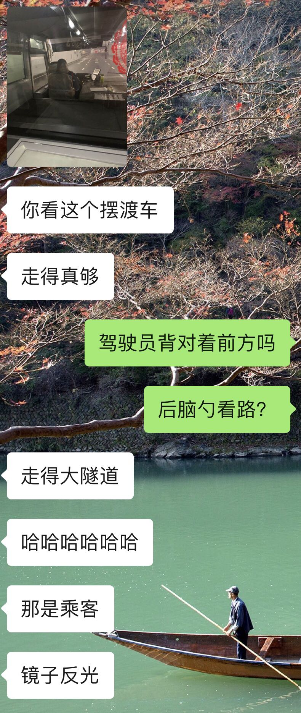

            1327楼 | 风中的名义 | 2019-02-13 11:32

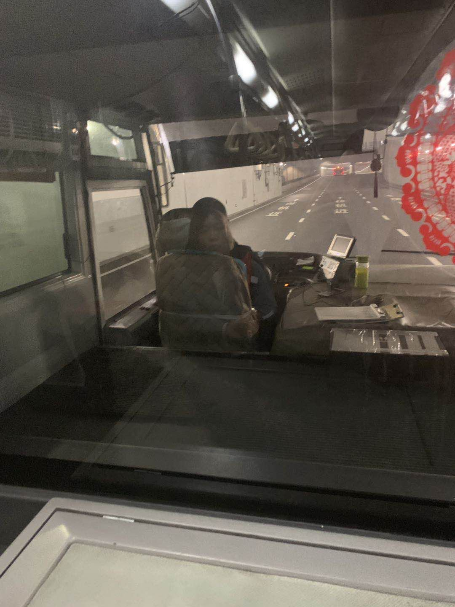

            1328楼 | 风中的名义 | 2019-02-13 11:32

宝宝们新年好，我跟建豪一切都好。  
就是最近我连缴几天公粮有点虚。  
咳咳…

            1329楼 | 风中的名义 | 2019-02-13 11:33

今天下班挺早的，给姐妹们报个平安，祝大家节日快乐。  
年初六那天从家里过来，马不停蹄去给建豪妈妈拜年，带上年前买好的护肤品。这一年没少去建豪家，跟他妈妈也很熟识了，没那么多讲究。不过每次都是不凑巧，大的家庭聚会我还没有参加过。  
房子装修的差不多了，这周末建豪就可以搬进去了，哈哈。  
我也只等合适的工作机会就过去汇合。  
这个春节没少让家里人催婚，我都承诺说明年一定带回家，侥幸逃过一劫。  
明年春节的事儿，谁知道呢？我是打算换了城市就赶紧找一个形婚对象好了。

            1334楼 | 风中的名义 | 2019-02-14 10:19

