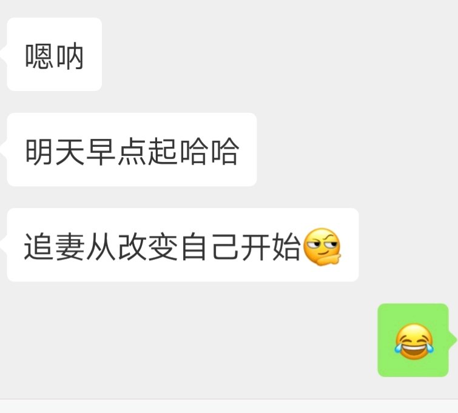

【办公室虐恋】回忆向

            1楼 | 借他一生💖 | 2018-12-11 14:52

本可儿大四下学期进入了面试找工作的时候

            2楼 | 借他一生💖 | 2018-12-11 14:53

因为自己的专业优势加上本可儿成绩还不错，学校还不错，轻轻松松签到了一个满意的外企。然后中间就是入职培训，体检实习巴拉巴拉各种事情

            3楼 | 借他一生💖 | 2018-12-11 14:54

集体实习期满，我们这些被招进来的要被分到各个部门去，是每个部门的主管来挑，然后我们也有权利选择，就是类似双选会

            4楼 | 借他一生💖 | 2018-12-11 14:57

本可儿其实很纠结惹，不过因为看到了当时面试我的那个小姐姐。面试时我有点紧张，全英文面试，本来本可儿准备得很充分的，可是还是结巴了，那个小姐姐就很温柔对我说别紧张

            6楼 | 借他一生💖 | 2018-12-11 15:01

然后，本可儿就想选她

            7楼 | 借他一生💖 | 2018-12-11 15:03

就这样，我进了业务部。那个小姐姐后面就称她为婷姐吧。婷姐对我的帮助真的很大，我们现在还一直有联系。婷姐其实不是业务部主管，因为主管那几天出差，她是主管的秘书，所以代他来的

            11楼 | 借他一生💖 | 2018-12-11 15:08

就这样本可儿有了自己的第一份工作，有着比较满意的工资，而且外企的待遇和工作环境真的不错

            12楼 | 借他一生💖 | 2018-12-11 15:11

本可儿正式进入业务部的第一天，下班后婷姐就带我们几个新人去吃饭，欢迎我们，婷姐说业务部虽然看起来很光鲜，其实挺辛苦的，别看现在轻松，以后你们都是要经常出差的，特别是男生。

            14楼 | 借他一生💖 | 2018-12-11 15:16

婷姐还教我们在公司怎么和老员工相处，最后婷姐让我们千万不要惹到主管了，因为我们业务部的主管出了名的严格

            15楼 | 借他一生💖 | 2018-12-11 15:18

然后就安排了一些我们需要做的日常工作，三天之后主管就出差回来了。让我们赶快适应新的生活节奏。

            16楼 | 借他一生💖 | 2018-12-11 15:20

入职以后，作为小白我都是做一些简单的工作，做做表，跑跑腿之类的，可能是我真的很可爱吧，大家对我的态度都很友好

            17楼 | 借他一生💖 | 2018-12-11 15:22

直到那天，主管回来了，那天真正见识了什么叫精英气质，就是那种有点吓人但是真的凌厉的感觉。我们主管姓罗，国外留学会来的。那天他回来后就叫我们新来的几个去他办公室。  
仔细看了看他，五官不精致，皮肤黄黄的，但是很有精神，就是那种有文化的糙汉子的感觉，但是说糙汉子又不太恰当

            19楼 | 借他一生💖 | 2018-12-11 15:28

他一开始问我们从实习到正式入职这么久了对公司是什么感觉。然后本可儿就直接说了一句很好啊，感觉大家对人都很友善。说完我才意识到自己这样抢答很不礼貌，当时超尴尬

            20楼 | 借他一生💖 | 2018-12-11 15:31

后来他问我们对我们要做的工作有什么了解吗，我们有看过以前的一些报表吗？有什么看法吗？  
一问三不知

            21楼 | 借他一生💖 | 2018-12-11 15:34

没有经验不是借口，没有经验就需要更加努力，你们给我好好想想自己到底是来做什么的。  
然后就让我们出去了

            22楼 | 借他一生💖 | 2018-12-11 15:35

当时心里很受挫惹

            23楼 | 借他一生💖 | 2018-12-11 15:35

于是乎后面每次本可儿看见罗主管我都选择避开他，绕路走

            24楼 | 借他一生💖 | 2018-12-11 15:38

可是天意弄人啊

            25楼 | 借他一生💖 | 2018-12-11 15:42

第二天我就直接去机场见，然后直接去西安。因为本可儿差点睡过头了厚，都没有好好照镜子就出门了

            27楼 | 借他一生💖 | 2018-12-11 15:46

然后本可儿赶紧拿出包里的小梳子，用手机当镜子梳了梳

            29楼 | 借他一生💖 | 2018-12-11 15:50

后来在飞机上因为是赶得早班飞机，所以飞机上还提供早餐，虽然不好次，但是本可真是饿了，几下就吃完了，然后罗主管看我吃这么快，就把他的那份也放在我面前的小桌板上。然后继续翻杂志。  
我其实不太好意思厚，就问他，主管你不吃吗？  
他说，我不饿，你吃吧。  
然后本可真是很不争气，就把他那份也吃了。  
本可儿吃的时候他竟然就看了我一眼然后笑了一声。  
我问娟我吃东西的样子很搞笑吗

            30楼 | 借他一生💖 | 2018-12-11 15:53

吃完早饭之后，本可儿就准备睡会觉

            32楼 | 借他一生💖 | 2018-12-11 15:58

过了一会他肩膀可能被我压麻了，就推了我一下，然后本可儿真是演技爆表

            33楼 | 借他一生💖 | 2018-12-11 16:00

然后娟那是掏出包里的纸给我，于是乎我想也没想就帮他擦 旁边的空姐也在看着，我没想那么多，就只想着把水擦掉。一个男的在大庭广众之下拿着卫生纸在另一个男的腹部和裆部摩擦，我真的是蠢顿如猪

            34楼 | 借他一生💖 | 2018-12-11 16:05

他好像也觉得有点尴尬，就对我说没事没事，不全怪你，等下飞机换了就行

            35楼 | 借他一生💖 | 2018-12-11 16:06

后来下了飞机他给我说以后回去了在公司遇到事情了也不要慌，不要像刚刚在飞机上那样急急忙忙

            36楼 | 借他一生💖 | 2018-12-11 16:07

然后西安公司那边的人来接机惹，把我们送去酒店，我们就先去酒店放行李  
娟单独住一个房间。  
我和罗主管一间房。  
到了酒店本可才发现，原来主管出差住的房间都这么豪华这么宽敞

            37楼 | 借他一生💖 | 2018-12-11 16:10

但素，本可儿怎么可能放弃这么好的机会厚，于是我假装去上厕所，走过去偷偷瞄他弟弟惹

            42楼 | 借他一生💖 | 2018-12-11 16:14

可素他动作好快，我都没有机会看到厚

            43楼 | 借他一生💖 | 2018-12-11 16:20

然后本可就在附近逛了逛，有点饿了，就到咖啡厅点了一杯卡布奇诺，要了一块香草味蛋糕。嗯，果然高档的咖啡厅就是不一样厚，天惹，终于知道为什么那么多人愿意找一个又老又丑的金主包养了，每天都可以享受这种生活，一般人很难抵挡物质的诱惑啊咖啡和我平时在超市买的完全不是一个感觉厚，蛋糕也是非常的细腻香软

            51楼 | 借他一生💖 | 2018-12-11 16:29

等了快3个小时了，天惹，本可儿都要无聊死了，于是打开了小蓝

            52楼 | 借他一生💖 | 2018-12-11 16:30

滴咚，一条微信，你上楼吧，xxx包间。差不多了

            54楼 | 借他一生💖 | 2018-12-11 16:32

看他那个鬼样子，虽然走路还能走，但是一出酒店就往我身上倒，我比他矮一点点，就这样扛着他，在路边打了辆车，回我们住的地方了。  
天惹，没想到他看着苗条却这么重

            55楼 | 借他一生💖 | 2018-12-11 16:35

回到房间，他已经有点不清醒了。  
可是，刚一进房间他就想吐了，他自己跑到马桶边上，我看着他吐我都难受，哇，我想哭

            57楼 | 借他一生💖 | 2018-12-11 16:37

然后我把他从马桶旁边拖开，把马桶冲了，当时那个味道我差点吐出来

            58楼 | 借他一生💖 | 2018-12-11 16:40

然后我就拿纸巾把他嘴擦干净，把毛巾弄湿，把他衣服脱了给他擦了一下身体和脸

            59楼 | 借他一生💖 | 2018-12-11 16:43

然后就把他拖到床上去，真是重死了

            61楼 | 借他一生💖 | 2018-12-11 16:45

看着他躺在床上，不省人事，本可儿有点坏坏的想法厚 ，不过毕竟是自己的上司，还是算了吧

            63楼 | 借他一生💖 | 2018-12-11 16:47

可是虽然这么想着，本可儿还把手放到了他的皮带上，然后把皮带解松了，然后扒开他的裤子看到他性感的内裤

            64楼 | 借他一生💖 | 2018-12-11 16:49

然后隔着内裤，用手摸了一下，软软的凸起

            65楼 | 借他一生💖 | 2018-12-11 16:51

明天继续煮了，太困了，姐妹们也早点睡觉吧

            66楼 | 借他一生💖 | 2018-12-11 16:52

煮饭了煮饭了

            76楼 | 借他一生💖 | 2018-12-12 04:30

本可儿当时非常慌张，觉得自己要被主管扒光鸡毛然后被炒鱿鱼惹

            77楼 | 借他一生💖 | 2018-12-12 04:34

但素本可儿真是被吓得不轻惹，不敢再努力了惹

            78楼 | 借他一生💖 | 2018-12-12 04:36

我以为他会在我转身的那一刻拉住我的手，然后把我拖倒在床上，开始强吻我，然后和我披头散发，不知神淋为何物惹

            79楼 | 借他一生💖 | 2018-12-12 04:40

可素到了半夜，神奇的事情发生，本可儿睡得正香，突然感觉被子被掀开了惹

            82楼 | 借他一生💖 | 2018-12-12 04:49

当时我真的心态爆炸惹，可素没有办法，老娘总不能睡地上吧，于是只能滚回自己床上

            83楼 | 借他一生💖 | 2018-12-12 04:51

那个情况下一开始当然睡不着咯，于是本可儿开始用手偷偷摸他的身体惹

            84楼 | 借他一生💖 | 2018-12-12 04:54

然后本可儿当时鸡脑子发热惹，开始不断揉搓他的弟弟惹

            85楼 | 借他一生💖 | 2018-12-12 04:57

于是本可儿就像被鼓励了似的，更加努力的帮他撸惹

            86楼 | 借他一生💖 | 2018-12-12 04:59

本可儿真素个脏女孩惹

            88楼 | 借他一生💖 | 2018-12-12 05:00

口了半天，本可儿都累了

            89楼 | 借他一生💖 | 2018-12-12 05:01

晚上再煮后续厚

            91楼 | 借他一生💖 | 2018-12-12 05:02

好了继续煮

            95楼 | 借他一生💖 | 2018-12-12 06:16

于是本可儿准备继续睡觉了

            96楼 | 借他一生💖 | 2018-12-12 06:21

他把本可儿压住，让我趴在床上

            98楼 | 借他一生💖 | 2018-12-12 06:24

后来本可儿没有办法，于是决定夹断他

            100楼 | 借他一生💖 | 2018-12-12 06:29

可素，在本可儿夹紧的时候，他竟然se了

            102楼 | 借他一生💖 | 2018-12-12 06:47

然后他就不动了，继续压着本可儿

            103楼 | 借他一生💖 | 2018-12-12 06:47

最可怕的事是就这样本可儿竟然睡着了，对

            104楼 | 借他一生💖 | 2018-12-12 06:49

最尴尬的时候来了，第二天早上，他比我先醒了

            105楼 | 借他一生💖 | 2018-12-12 06:51

然后就超级尴尬，我不说话他不说话，我就去洗了个澡，等我出来的时候，他看着我说了一句:小王，那个，对不起  
本可儿:

            107楼 | 借他一生💖 | 2018-12-12 06:53

虽然是本可儿嘴馋惹，可素还是不能接受惹

            108楼 | 借他一生💖 | 2018-12-12 06:54

然后他看到我哭了，他就说:小王，真的对不起，我当时也不知道怎么就没控制住自己，就。。  
本可儿还是不知道该说什么，不过毕竟是自己嘴馋在先

            109楼 | 借他一生💖 | 2018-12-12 06:59

然后也没有说其他了，他也去洗澡了

            110楼 | 借他一生💖 | 2018-12-12 07:00

后来时间也不早了，然后都收拾好，我给娟发了一个vx说可以出发了，然后我们三个就在楼下大厅集合，一起去西安的分公司准备那天的工作。那天除了好的，嗯。没有和他说其他的话。因为遇到这种事情真的很尴尬

            111楼 | 借他一生💖 | 2018-12-12 07:03

后来晚上回到房间，我也不想把关系弄的那么僵，毕竟我还要工作赚钱惹，我就主动给他发了条vx。我们就当昨晚的事情没有发生过，以后做好朋友吧。  
天惹，不知道他是真蠢还是假蠢惹，直接跑到我面前，对我说，好

            113楼 | 借他一生💖 | 2018-12-12 07:09

然后他说请我出去吃夜宵，我问他娟呢？他说就咋俩不带她

            114楼 | 借他一生💖 | 2018-12-12 07:09

然后就和他一起出去吃夜宵了，我们住的地方离钟楼挺近的，他就说我们去回民街吧，挺有名的。  
本可儿在抖音上看到过，感觉很想去，然后我们就去了那边，不过真正去了才发现在手机里看起来和实地去是两回事厚

            115楼 | 借他一生💖 | 2018-12-12 07:12

不过晚上的钟楼很好看

            116楼 | 借他一生💖 | 2018-12-12 07:12

后来我们逛了一圈，吃了些东西，就回去了。那天晚上第一次发现原来在公司高高在上一丝不苟的主管也有可爱的一面

            118楼 | 借他一生💖 | 2018-12-12 07:14

可能就是从那天晚上起，本可儿才喜欢上了他。后来回去之后很正常，洗完澡就各自睡了。第二天还有工作要做

            119楼 | 借他一生💖 | 2018-12-12 07:17

后来几天都很平常，一直到出差的最后一天，工作基本都完了，然后西安分公司的经理说要请我们好好吃顿饭。那天晚上，本可儿吃得很舒服，因为不是那种应酬，都是自己公司的人，也没有要喝酒

            120楼 | 借他一生💖 | 2018-12-12 07:19

后来吃完饭，时间还早，他们就说去KTV玩，然后我们就去了一家会所，欧式装修风格，看起来富丽堂皇地。他们要了一个vip包房

            121楼 | 借他一生💖 | 2018-12-12 07:23

本可儿在不熟的人面前其实一般都挺腼腆的

            122楼 | 借他一生💖 | 2018-12-12 07:28

虽然本可儿不是专业歌手的，但是唱歌还是在调上的。虽然本可儿替罗主管唱了一首，但是他们还是要他唱一首

            123楼 | 借他一生💖 | 2018-12-12 07:31

好了，晚上继续煮了

            125楼 | 借他一生💖 | 2018-12-12 07:40

继续煮饭厚

            132楼 | 借他一生💖 | 2018-12-12 15:14

然后我们就开始唱歌啦，主管果然不太会唱歌，但是声音是好听的，就是有点走调而且，但是有本可儿带着他勉强还是唱完了

            133楼 | 借他一生💖 | 2018-12-12 15:18

后来娟也唱了一首，然后大家越玩越开心，也没那么拘谨了，通过那天还认识了一些人，也算为我后来的离开他的城市来到西安做下了铺垫吧

            135楼 | 借他一生💖 | 2018-12-12 15:20

后来有点迟了，第二天也要回去了。就回酒店了

            136楼 | 借他一生💖 | 2018-12-12 15:21

回到酒店，虽然本可儿心里清楚点至少还有你是直男的小把戏厚，但素还是心存幻想地问了一句。你为什么点至少还有你啊？

            137楼 | 借他一生💖 | 2018-12-12 15:23

哦，好吧

            138楼 | 借他一生💖 | 2018-12-12 15:25

出差回来过后，仍然是普普通通的工作着，只是再见到主管不会像原来那样害怕了。他也经常会和我们组里的一起吃午饭。我一直以为日子会这样平平凡凡过下去，我能好好工作，好好赚钱。

            139楼 | 借他一生💖 | 2018-12-12 15:28

那天因为有个文件要我赶出来，本可儿不想回自己小小的出租屋里还要继续工作厚，就留下来加班了。其实正常情况下是不会加班的厚，这点我们公司还是很人性的。

            141楼 | 借他一生💖 | 2018-12-12 15:41

文件搞定差不多快9点了。本可儿寻思着该走了。然后收拾好东西，背起自己的小背包高高兴兴准备回去了。第一次这么晚才下班。看着都市繁华的夜景，本可儿觉得凭借自己的努力，一定也可以很好的在这里生活下去

            142楼 | 借他一生💖 | 2018-12-12 15:46

本来准备坐公交回的，当时觉得骑共享单车回去更有意思，因为路途也不太远。于是本可儿骑上小黄车，戴上耳机。心情愉快的往回骑。  
但素骑到一半，天惹，明明是自行车道，不知道哪里来的智障惹，风一样骑着个木兰车，还搭着两个人。当时本可儿沉浸在美丽的夜景和音乐中，根本没有反应过来厚，就撞上了

            143楼 | 借他一生💖 | 2018-12-12 15:57

没有办法，在这个城市里没有其他可以寻求帮助的人了，然后我拨通了主管的电话。  
主管:小王啊，怎么了？  
我:那个，主管，我这边出了点情况，你能就是来接我一下吗？  
主管:嗯？怎么了？出什么事了吗？  
我:没有，就是我，嗯，也没啥，如果您忙就算了，我让我同学来接我也成  
\(其实哪有什么同学呀，大学四年，除了和自己几个舍友相处的好一点以外就没有什么太熟的人了。可是我还是不好意思说出实情\)  
主管:你现在在哪呢，我马上过来。  
我:我不知道我现在具体在哪，就是公司出来往前走一点，然后左拐，往前  
主管:你直接vx给我发定位,我过去找你  
我:好，谢谢您

            144楼 | 借他一生💖 | 2018-12-12 16:03

偷偷问一句有人在看吗

            145楼 | 借他一生💖 | 2018-12-12 16:04

我就坐在地上等了大概20分钟，他就来了。看着我狼狈的样子。他问我到底怎么了。然后本可儿就没办法，就告诉他到底发生了什么。然后他好像有点生气说了一句，我手底下怎么有你这么傻的员工啊！我没说话，因为他说的对，我真的一遇到事情就处理不了。他看我情绪不太对，也没有继续苛责我。然后开始扶我起来。可是当时本可儿小腿太疼了，一动就疼，然后他就直接给我公主抱抱上他的车的后排，让我躺着，然后开车带我去医院。检查了一下，没有伤到骨头，自是小腿肌肉组织损伤比较严重。然后医生给我开了一些外抹和内服的药。让我静养最多一周就能好。

            149楼 | 借他一生💖 | 2018-12-12 16:15

后来他就送我回我的出租屋了，说是出租屋其实就是一个大一点的房间，然后带独卫。有一张单人床，和一个能做饭的阳台。不知道大家有没有住过那种一个人的出租房。虽然地方不大，但是本可儿布置的还是很好，而且我平时也很爱干净，也是整整洁洁的。

            150楼 | 借他一生💖 | 2018-12-12 16:18

然后他把我扶上床上坐着。帮我把腿抬上去让我躺着。然后，把我的裤腿往上扒，你要干嘛？本可儿本能的说了一句。  
主管:帮你抹药啊，蠢死了，被别人撞了也不知道记个车牌号，拍个照？  
我:\.\.\.当时没反应过来  
主管:唉，现在的大学生哦。  
然后他问我:你一个人在这边？  
我:嗯，我家是xx的  
主管:那更要学会一个人照顾自己，不要让自己父母担心。不过看你这小屋子布置的还不错，看来还挺热爱生活的嘛。挺好的

            152楼 | 借他一生💖 | 2018-12-12 16:25

当时本可儿没有回复他，因为他提到了本可儿父母厚

            153楼 | 借他一生💖 | 2018-12-12 16:32

然后他好像哄小孩一样搂着我，拍拍我的背:没事的都会过去的

            154楼 | 借他一生💖 | 2018-12-12 16:34

好噜，明天中午继续煮了惹，姐妹们晚安，想起这些回忆让我一个人哭一会

            155楼 | 借他一生💖 | 2018-12-12 16:34

本可儿来煮饭了，快夸我

            160楼 | 借他一生💖 | 2018-12-13 04:27

哭了一会，妈惹，我把他衬衣都哭湿了

            161楼 | 借他一生💖 | 2018-12-13 04:31

第二天本可儿醒的时候已经9点多了

            162楼 | 借他一生💖 | 2018-12-13 04:35

本可儿吃得正香的时候，有人敲门

            163楼 | 借他一生💖 | 2018-12-13 04:37

一开门发现是主管惹

            166楼 | 借他一生💖 | 2018-12-13 05:25

对不起大家咯，今晚我多煮点，今天下午有正事，中午就只能煮到这了

            168楼 | 借他一生💖 | 2018-12-13 05:26

他都那样说了，本可儿就不好意思不让他进屋坐了，然后他看我扶着凳子，他就把手伸过来扶我回桌子旁边坐着。

            170楼 | 借他一生💖 | 2018-12-13 11:06

然后他就把那个保温筒打开，帮我把骨头汤倒出来惹

            171楼 | 借他一生💖 | 2018-12-13 11:10

吃完之后，他让我记得吃药，然后就走了

            172楼 | 借他一生💖 | 2018-12-13 11:10

后来下午下班之后他又来了。还带了一个凳子来

            173楼 | 借他一生💖 | 2018-12-13 11:14

主管:我专门帮你买的哦。  
我:你到底买的啥啊。  
然后他从门外拿进来一个东西

            174楼 | 借他一生💖 | 2018-12-13 11:16

主管:这样你小腿不能蹲也可以轻轻松松上厕所了

            176楼 | 借他一生💖 | 2018-12-13 11:18

我:主管，谢谢你啊。帮我这么多。

            177楼 | 借他一生💖 | 2018-12-13 11:25

主管:好了，你好好休息吧，我先走了  
我:好的，主管慢走  
后来的几天，每天中午他都会来看一下，每天下午下班他也来坐一会再走。没过多久我的腿就好了。  
不过真的超级感谢他这样照顾我

            178楼 | 借他一生💖 | 2018-12-13 11:27

然后本可儿又能去骚去浪去happy啦

            180楼 | 借他一生💖 | 2018-12-13 11:31

可是，每天下班回到我的小出租屋，我就会觉得少了点什么，好像习惯了他每天的到访和关心。有些东西得到的时候不觉得有什么，可是到了突然消失的一天心里又空落落的。总感觉心里不太舒服。后来，我渐渐发现自己会不自觉的开始关注起主管来，总是翻他空空的朋友圈。点开新换的头像。翻着和他的聊天记录。  
我发现，我好像喜欢上他了  
该死惹

            181楼 | 借他一生💖 | 2018-12-13 11:35

不行不行，虽然本可儿和他有过亲密接触，但素能感觉到他觉得不是基厚

            182楼 | 借他一生💖 | 2018-12-13 11:37

可素自欺欺人是没有用的。然后本可儿又开始躲他。除了重要的工作事项，再也不主动给他发消息。不再和他一起去吃午饭。故意晚回他的消息。故意躲着他。  
可素，这一切好像太明显了，明显到他很快就感觉出来了

            183楼 | 借他一生💖 | 2018-12-13 11:39

那天早上去上班，看到他在电梯口，于是本可儿就只好走楼梯咯。可素，没想到，刚刚走到目的楼层，他就站在楼梯口。  
主管:小王，你。。最近怎么回事？感觉不像以前一样爱和大家交流了。好像，好像故意躲着我似的。  
我:没有没有，我只是，最近心情不太好。  
主管:那，干嘛不坐电梯，走楼梯。？  
我:我只是今天早上吃的比较多，走走楼梯有助消化。不然坐一上午胃不舒服。  
主管:唉，好吧。不管发生了什么，不要影响自己正常的生活状态。你好好调整一下。  
然后他就转身走了

            185楼 | 借他一生💖 | 2018-12-13 11:45

呼，松了一大口气。  
可是不知道为什么，说了那些话心里会难受。  
唉，心里默念了一句。你想什么呢，好好工作去

            186楼 | 借他一生💖 | 2018-12-13 11:50

可是，要骗自己好难呀。  
从知道自己喜欢上他的那一刻起，每见他一次，就会难过一次，我也不知道为什么。每天晚上想起他就会不自觉嘴角上扬，然后莫名其妙眼泪就会掉下来。  
我知道所有的一切都是我自导自演的一出独角戏。可是对于他。我知道我输的彻彻底底

            190楼 | 借他一生💖 | 2018-12-13 11:57

就这样一直到了我生日那天。第一次一个人过生日。说心情美好是骗人的。  
那天第一次破天荒的一个人去了酒吧。

            193楼 | 借他一生💖 | 2018-12-13 12:01

可是本可儿真的没喝过什么酒，就喝了几杯水果酒就有点飘了了

            194楼 | 借他一生💖 | 2018-12-13 12:05

我真的好难过，各种各样的事情。不知道是不是酒精的作用，我拿起了手机，给他打了一个电话  
主管:小王？这么晚了有事吗？  
我:啊，没啥事，呵呵，就是想你了  
主管:嗯？你喝酒了？是吗？嗯？说话！  
我:我没有。我只是。。。\(然后我就又开始哭。\)  
主管:不想被炒鱿鱼你就给我待在原地别动！！马上把位置给我发过来！

            195楼 | 借他一生💖 | 2018-12-13 12:10

我也不知道我在路沿上坐了多久，然后一辆车停在我面前。  
然后他好像很生气的样子把我拖起来，说:你是不是傻啊，不会喝酒就别喝，喝醉了还到处乱跑，简直了！  
我没有说话，呵呵呵看着他傻笑。  
主管:走啦，我把你送回去。  
然后就这样，他又把我送了回去。把我扶到床上，他说:你今晚好好睡吧，我先回去了，明天早上来看你死没死。  
我:我想洗澡，我想洗澡，酒吧都把我搞臭了

            196楼 | 借他一生💖 | 2018-12-13 12:23

主管:还真是讲究呀，都醉了还想着洗澡。喝醉了不能洗澡的\*\*  
我:我要洗，不洗我睡不着  
主管:事真多，我帮你擦一下，洗澡就算了吧。  
我:好

            198楼 | 借他一生💖 | 2018-12-13 12:25

然后他就让我自己脱衣服。我很快就把自己脱的光溜溜的只剩一条小内内了。然后他把我扶进卫生间，把热水接到盆子里。开始拧毛巾。我就一直趴在他背上。  
他一边拧毛巾一边说:唉，摊上你这么个员工，和养个孩子一样麻烦  
我:我才不要当你孩子，不然就得天天被你训了

            199楼 | 借他一生💖 | 2018-12-13 12:31

惹，我先去洗个澡厚

            201楼 | 借他一生💖 | 2018-12-13 12:52

惹，马上开煮厚

            204楼 | 借他一生💖 | 2018-12-13 14:14

然后他就转过来帮我擦身体，我用水随便漱了个口，然后准备转身自己走回床上去，惹，不知道为什么，脚一下软了，身体直接往下坠，不过还好他在旁边，一下搂住了我。

            206楼 | .* | 2018-12-13 14:31

然后我就抱着他的腰，他就这样把我拖到了床上。  
主管:好了，都弄好了，放手吧。我该走了  
我:你别走好不好，陪陪我，就当，就当送给我的生日礼物  
主管:生日礼物？原来今天你小子过生日啊，怎么不早说呢。一个人跑去酒吧过生日你也想的出来

            208楼 | .* | 2018-12-13 14:35

主管:吃蛋糕了吗？  
我:没有。  
主管:那晚上吃的啥  
我:酒  
主管:你这人真是

            209楼 | .* | 2018-12-13 14:51

后来，我都睡着了，突然灯开了。我一下惊醒了。这么晚了我屋里进小偷啦？？！！  
然后听到那个熟悉的声音  
主管:哎呀，都睡着啦呀，那不好意思，打扰啦，但是，生日快乐呀  
然后我看见他手里拎着一个蛋糕  
他看了一眼表，说:11点43啦，快点起来许个愿吹蜡烛然后吃口蛋糕，不然生日就过啦，愣着干嘛，快过来啊。  
当时那种感觉真是要感动死了。

            211楼 | .* | 2018-12-13 15:02

吃完收拾完都快1点了。  
主管:呐，钥匙还给你，收好了，别丢了怪我  
我:你哪来的？  
主管:从你裤子里拿的咯，笨呀  
我:

            212楼 | .* | 2018-12-13 15:11

我:好了好了，不说了，你快走吧，我困死了，要睡啦  
主管:刚刚还要留我过夜，现在又让我走，你这人怎么回事  
我:刚刚要走的不是你吗

            214楼 | .* | 2018-12-13 15:20

有人在看吗

            215楼 | .* | 2018-12-13 15:21

然后就准备睡觉了惹。我们背靠着背，我能感觉到他的体温，那种感觉真好，就是很有安全感

            220楼 | .* | 2018-12-13 15:35

早上他比我醒的早，他从外面买好了早饭回来，叫我起床吃饭，其实本可儿一般都是上班路上在早餐摊上随便买一点，边走边吃，走到公司刚好吃完，突然让我起来吃早饭还有点不习惯。不过那种被人照顾的感觉真素太好了

            221楼 | .* | 2018-12-13 15:39

吃完早饭就开开心心去上班啦。从那天开始我也不躲着他了，我开始正视我对他的情感，我觉得他对我这么好，如果我还是只是一味逃避，对他太不公平了。所以我就看开啦，决定做回真正的自己。该怎么处怎么处，不过分，不越界。  
后来我们就混的越来越熟了。我开始不叫他主管了，直接叫他老罗。  
那天下午，下班过后，老罗突然给我发了一条vx。今天晚上有空吗，出来吃个饭呗。  
我回复他:正愁晚饭没地解决呢，地址，时间发过来。准时见

            224楼 | .* | 2018-12-13 15:48

见到他了，我问他:怎么今天想起请我吃饭啦

            228楼 | .* | 2018-12-13 15:58

然后两个人就漫无目的地走着，走了大概十几分钟吧，我们走到一个河滩上，天蒙蒙黑，河风吹着，很凉爽。我闭着眼睛享受这惬意。  
这时他突然说:xx\(我的名，本可儿叫王xx\)，你过来。  
我:啊？怎么了  
他:我，我想给你说一个事  
我:哦？好事坏事？  
他:我不知道算好事还是坏事。  
\(第一次见他如此拘谨的模样，还有点小担心他出了什么事\)  
我:怎么了嘛？往常都是你说我扭扭捏捏，今天你怎么也扭扭捏捏起来了  
他:我，我想以后一直守着你保护你。  
本可儿大脑一瞬间空白

            232楼 | .* | 2018-12-13 16:13

惹，今晚就到这厚，明天中午继续

            233楼 | .* | 2018-12-13 16:15

统一回复一下大家  
看到那么多人看我的帖子，很开心。  
其实不必纠结真假。好多细节我也不能完全记起了，可能人回忆过去的时候还是想起美好的事情多。大家当故事看就好了。并没要求有谁能体会。

            238楼 | .* | 2018-12-14 01:04

然后他就抱着我，我就在他怀里哭，不过我哭了一会才反应过来，我干嘛要哭，我不是应该高兴么

            239楼 | .* | 2018-12-14 04:23

然后就洗洗睡啦。上次是我从背后搂着他，这次是他主动来搂着我，他比我高一点点。  
他:以后别抱抱枕了，抱我

            242楼 | .* | 2018-12-14 04:43

说实话厚，被搂着睡觉身体上的感觉其实并不舒服

            243楼 | .* | 2018-12-14 04:52

开始煮饭惹

            249楼 | .* | 2018-12-14 13:51

然后他就醒了

            250楼 | .* | 2018-12-14 14:07

后来就简简单单吃了个早饭就去上班啦。虽然在私下可以勾肩搭背，但是在公司我们两个还是很正经的。  
除了工作上的事也没有过多交涉。都是偷偷在微信上

            251楼 | .* | 2018-12-14 14:16

最搞笑的是结账的时候，那个阿姨，对他说:帅哥，这是你娃呀。不像啊，你看起来好年轻的哦。  
然后他很尴尬地笑了笑。我当时都要笑喷了

            252楼 | .* | 2018-12-14 14:20

出了超市，我就笑他，你看别人都说你是我老爸耶

            253楼 | .* | 2018-12-14 14:23

他也任由我笑他。后来我们就肥去了。虽然认识了这么久惹，但是还是第一次去他家。果然有钱人就是不一样哦，虽然离公司远了点，但是环境真的是很好，不管是绿化还是附属设施。的确比我那边安静多了。  
然后就停车，上电梯，开门。一进门，我天，这装修风格，也太。。直男了吧。就是那种很简约，深色居多。浅色只有白色。陈设也很简单，真是觉得他一个人住这个房子浪费空间惹

            255楼 | .* | 2018-12-14 14:36

天惹，总之他的生活方式简直是太直了。简简单单。难怪他要带我去买那么多东西。他家里除了一些必需品，真什么都没有

            256楼 | .* | 2018-12-14 14:37

我问他:你平时不上班都做些啥呀。我感觉你家里太空了。要是让我一个人住这，\~我都不知道得多难受。  
他说:不上班呀。睡懒觉，看书，健身，出去玩。  
我:好吧，你不玩游戏吗？\(本可儿觉得现在很少有男生不玩游戏\)  
他:早就不玩了，当初在香港做游戏营销的时候玩的太多了，搞得我现在对这些都没啥感觉了。  
我:为啥啊？  
他:你大学上课怎么学的呀？做游戏营销你不得先自己把这个游戏玩通透，清楚他的定位，他的受众，这些都要自己去体验，光凭开发商的企划书是不够的。

            257楼 | .* | 2018-12-14 14:46

他:所以说你们上课学的还是不够滴，以后要在工作中慢慢学。  
我:是是是，罗主管说的对，我以后一定好好学。  
东西差不多都收拾好了，天还早，他坐在妃座上翻他的在那翻他的杂志，我在哪吃着零食看电视

            259楼 | .* | 2018-12-14 14:51

看了一会电视，我准备去洗澡了。不过本可儿不会用他的热水器厚，然后，看着他的大浴缸，我就想试一试，毕竟长这么大还没用过浴缸

            261楼 | .* | 2018-12-14 15:00

然后他就先帮我洗头惹，我是那种齐刘海类似西瓜头，但没那么圆，所以头发还是蛮长的，然后他竟然边抹洗发水边玩我的头发

            264楼 | .* | 2018-12-14 15:08

然后他就拖着本可儿直奔房间，惹，果然男人都是下半身思考的动物厚，这么快就想睡我。不过本可儿也没有反抗

            266楼 | .* | 2018-12-14 15:14

卧槽，当然那个给我尴尬的呀。我说，那要不现在去买

            267楼 | .* | 2018-12-14 15:18

刚上车，一坐下，我就把手伸过去摸他那。  
我:嗯，现在软了，好好开车吧

            268楼 | 借他一生💖 | 2018-12-14 15:25

飞速回到家之后，一进门，鞋都不脱他直接就开始啃我的嘴，然后就吻上了，我靠着墙，他边吻边把手伸进我衣服，摸我的背，然后我开始帮他脱裤子

            269楼 | 借他一生💖 | 2018-12-14 15:40

后来，我去上厕所，发现，妈惹，真的出血了

            270楼 | 借他一生💖 | 2018-12-14 15:42

然后在这里告诉巴黎的姐妹惹，如果一个男人真的爱你是不会愿意让你痛苦的

            271楼 | 借他一生💖 | 2018-12-14 15:43

然后他就准备搂着我睡觉惹，然后我告诉他，要不咱们像第一次你压我那样试试

            274楼 | 借他一生💖 | 2018-12-14 16:04

今晚先煮到这惹，明天中午继续咯，大家晚安啦

            275楼 | 借他一生💖 | 2018-12-14 16:05

姐妹们吃午饭啦

            277楼 | 借他一生💖 | 2018-12-15 04:16

可能是真的折腾累了，两个人都睡得很香，第二天早上起来，就是那种休息得贼舒服的感觉。两个人都准备起床了。然后我先穿好自己的衣服，准备给他找今天穿的衣服，然后我问他他上班穿的衣服放哪，然后他指了指衣柜最中间的地方。天惹，我一打开，感觉自己面前的衣服都是一个样

            278楼 | 借他一生💖 | 2018-12-15 04:21

然后就随便给他拿了一套

            279楼 | 借他一生💖 | 2018-12-15 04:22

然后本可儿就去煮面了，其实我也不太会做饭，我的厨艺也就糊弄糊弄自己还行，反正饿不死自己。  
他收拾好了就和我一起吃面。  
他吃了一口，一脸嫌弃的说:你这怎么做的，这么难吃。  
我:是吗，我觉得还行啊

            280楼 | 借他一生💖 | 2018-12-15 04:28

然后，就去上班了惹。他把他的一些生活用品和衣服也给拿上了，准备今天就住我那了。周末再回这边来。  
然后我们就去上班了惹。  
\(现在想起那段时间还真是幸福惹，两个人基本就是全天24小时都在一起

            282楼 | 借他一生💖 | 2018-12-15 04:37

他半躺在床上，我趴在他身上。他半搂着我。特别温暖的感觉。两个人都互相黏人得不行。巴不得时时刻刻都抱在一起，能感受到彼此的体温。所以常常一进门就抱在一起，做什么都靠在一起。

            283楼 | 借他一生💖 | 2018-12-15 04:42

然后一整晚我都很兴奋

            289楼 | 借他一生💖 | 2018-12-15 14:20

然后就洗洗睡啦，两个人挤在一张床上。渐渐就习惯了有他在身边睡觉的日子。   
一周的工作时间很快就过去啦，周末又回他那边去了。然后回去之前又去了一趟超市，买了些吃的。就赶忙回去了。那天没有在外面吃晚饭，两个人打算回家自己做，然后又是两个人在厨房忙忙活活。到了快9点才吃上晚饭。  
其实和他在一起的时光大多数都是平平淡淡的，只是两个人每天黏在一起的时间太多了。所以就习惯了这种感觉

            290楼 | 借他一生💖 | 2018-12-15 15:02

那个周末两个人就一直在家里宅着，一天到晚都穿着睡衣。最经常做的事就是躺在他胸膛上听他讲他原来小时候，上学的一些有趣的事。然后我也告诉他我原来发生的那些事

            292楼 | 借他一生💖 | 2018-12-15 15:30

然后周末宅在家最容易发生的就是，明明上一秒就在好好说话，下一秒就吻上了

            293楼 | 借他一生💖 | 2018-12-15 15:39

然后愉快的周末就这样过去噜。又回去上班了。周一早上本可儿和他开开心心去上班，为了不被大家知道然后引起误会，所以一般都会快到公司分时候我就下车自己走过去。但是，夜路走多了总会遇到鬼，那天被娟撞到我从他车里出来

            294楼 | 借他一生💖 | 2018-12-15 15:45

然后他就自己开走了，我就慢慢走过去，生怕又撞上娟。  
后来坐到座位上，我突然觉得今天不太对劲惹，为什么看到我的人都偷偷笑

            295楼 | 借他一生💖 | 2018-12-15 15:55

然后我就不信邪，跑到卫生间去照镜子，真的没啥哎。但是我正准备扭头走的时候，发现我左脖子靠近耳朵的那边一个红红的印子

            297楼 | 借他一生💖 | 2018-12-15 16:00

            298楼 | 借他一生💖 | 2018-12-15 16:06

下班然后我直接就自己走了，对于这种事情我真的不能接受惹。虽然也不是什么大事，但是我就是感觉不太好啊。  
然后他给我打电话，问我怎么自己走了。其实生他气是假的，主要是害怕，又被同事看到，然后加上今天脖子上的印子，这太容易被扒光鸡毛了。我都能想到如果这事在公司被知道了会有些多久难听的流言。说到底我还是一个怕事的人

            301楼 | 借他一生💖 | 2018-12-15 16:11

我回到家没多久他也回来了。他问我到底怎么了嘛，我就给他说:你看我脖子上。我怕咱俩的事迟早有一天会被捅破。我害怕

            303楼 | 借他一生💖 | 2018-12-15 16:18

好啦，今晚就到写啦，明天中午继续咯，大家晚安

            304楼 | 借他一生💖 | 2018-12-15 16:23

惹，开煮惹

            307楼 | 借他一生💖 | 2018-12-16 04:20

可是我越害怕什么，什么事情就发生了

            308楼 | 借他一生💖 | 2018-12-16 04:30

刚刚出超市，坐上车，手机一响，一条微信。娟发过来的。  
娟:大可爱，你刚刚是不是在xx广场大润发这买东西啊，我好像看到你了  
我不知道怎么回，就把手机给他看。  
我问:这我怎么回。。。  
他说:你如实回答就行，人家这么问肯定是看到你了的  
然后我就回了娟:嗯嗯，刚刚在大润发买了点东西  
然后娟又发给我一条消息:那个大可爱，我问你一个私人问题哈，你别介意哈  
因为我跟娟私下挺熟的，平时工作上的合作也很多，所以我也不知道该怎么回她了，我就回了一句，什么事啊？如果是要问\*\*莓的话，我就不说了

            309楼 | 借他一生💖 | 2018-12-16 04:43

然后她又发了一条给我:不是这个，就是你是不是和罗x在一起了？  
我的天，我以为我们隐藏的很好了，可是仔细想想也不是，老是一起去吃饭，下班一起走，周末还老是一起出去玩，最主要还是早上一起上班被撞到了吧

            311楼 | 借他一生💖 | 2018-12-16 04:51

然后娟发了一条消息:哇，我的天呐！！祝福你们呀，大可爱你们一定要勇敢地走下去！  
当时心里很是感动，原来我也可以得到别人的祝福。  
回复了一句:谢谢  
然后他就拉了拉我的手说:看吧，你老是往最坏的结果想，你这思维方式以后得改改。好了，坐稳，我们回家。

            312楼 | 借他一生💖 | 2018-12-16 04:57

惹，中午到这惹，晚上争取多煮点

            313楼 | 借他一生💖 | 2018-12-16 04:58

煮饭惹

            319楼 | 借他一生💖 | 2018-12-16 14:21

回到家之后，我一直坐在餐桌的旁，他去做饭。看着他做饭的背影，我就感觉，我这样被宠着是不是太幸福了，我都害怕这是一场梦，会不会有一天梦醒的时候，这一切都没了我会怎么样。  
我生性就是一个敏感的人，太容易因为外界的波动影响到情绪。很容易就想太多，忧虑得不行。又可以因为一点小事就开心到飞起。那个时候的自己注定还是不够成熟的。他端着菜出来，看着我的样子，说:想什么呢，脸色这么难看，是不是身体不舒服啊，过来给我看看。  
他见我不动，用帕子把手擦了擦，走到我面前摸我的脸，说:怎么了，这么不开心。  
我:我不知道，我就是感觉可能有点害怕。  
他:害怕什么？  
我:你知道的。  
他:唉，你就是太敏感了。别想太多。快去洗手吃饭了。  
然后我就乖乖去洗手然后吃饭了

            320楼 | 借他一生💖 | 2018-12-16 14:32

吃完饭之后碗都没收，就过来搂着我，说:走，我们去阳台上看月亮去。  
然后我们就去了阳台，我们坐在地上，我坐前面，他坐后面环抱着我，像我的一个椅子一样。就这样一直靠着，看着外面，从天上挂着若隐若现的月亮到天上月亮变得明亮。两个人都没有说话。后来气温慢慢降下来了，我说:我们进去吧，冷了。  
他:嗯嗯。

            321楼 | 借他一生💖 | 2018-12-16 14:50

然后就去洗澡澡了，一起洗澡的时候他贼傻了，用沐浴露吹泡泡给我看，然后我就笑了。然后他也笑了。我知道他是故意想让我开心一点。所以我还有什么理由不开心呢。

            322楼 | 借他一生💖 | 2018-12-16 14:54

我说:一直都是你帮我洗头，今天我帮你洗，你坐下来。然后他就坐在我面前，我就抹上洗发水给他洗头，他头发不长，很好洗惹。但是我还是故意洗了好久。他:好了好了，快洗完，头皮都要给我扣掉了

            323楼 | 借他一生💖 | 2018-12-16 15:02

第二天周六，我们起的早早的，准备去爬山玩。不愧是本可儿的男人，穿上一身运动装加上他黄黄的肤色。简直不要太好看。我们简单带了些东西就出发啦。果然出去玩能忘掉很多事情。那天我们登到山顶，看着两个人一起走上来的路，哇，那个感觉，真是太爽了。

            324楼 | 借他一生💖 | 2018-12-16 15:14

我看着周围没啥人，偷偷凑过去亲了他一下。

            325楼 | 借他一生💖 | 2018-12-16 15:19

可素周一刚去上班就接到了一个不好的消息，老罗又要出差去，这次安排里没我

            326楼 | 借他一生💖 | 2018-12-16 15:26

周二那天下班之后他就直接回他家去了。  
我就自己回出租屋，说不难过是假的，虽然又不是什么大事，可能那个时候的自己还是太矫情吧。  
回去之后就一直在床上窝着，没事就打开手机看一下，有没有他发的消息。大概快9点了吧，他拖着箱子提着东西就过来了。看我躺在床上，看了一眼小饭桌，他有点生气了说:一看就知道你没吃晚饭，都这么大了怎么这么小孩子气呢。身体不要了呀。  
我不知道该说什么好，我又不能说是因为他。可是其实我不说，他也什么都知道。  
他:早知道你会这样，不然我才不过来看。呐，吃吧，给你打包的晚饭。  
\(我只能说那个时候的他真的太了解我了，只是最后的我们变成了我越来越了解他，他却不愿懂我了\)

            327楼 | 借他一生💖 | 2018-12-16 15:33

我就乖乖下床去吃饭了。  
他就看着我吃，他:我就去一个星期不到，最多6天，我过去尽快把事办完。办完我就回来。应该能提前。  
我:嗯嗯，你别担心我，我会好好的。  
他:说的可是好好的，然后就这样？我都还没出发呢就不吃东西。我一去那边你还想怎样哇。  
我:哎呀，我给你保证我会照顾好自己。你老是觉得我是小孩子，可是我早就是个成年人了。  
他:行行行，那你以后每顿饭都给我拍个照，ok？  
我:好好好，人与人之间最起码的信任呢

            328楼 | 借他一生💖 | 2018-12-16 15:53

吃过饭之后我问他，明天不是还得去机场么，他几点走。  
他没给我说几点只说了明天上午走，从这过去来得及。  
然后两个人就挤在我的小床上睡了。我一直拽着他的手，然后睡着了。  
第二天早上，他很早就起床了吧，虽然他动作很轻，不想把我吵醒，但是我迷迷糊糊还是感觉到了，看了一下手机，5:52。然后我帮他把灯开。他看了我一眼:还是把你弄醒了啊，真对不起。  
我:没事，等你走了我还能睡会。  
他:嗯，我很快把东西拿上就走了，你照顾好自己。  
我:嗯，你路上小心，到了给我发个消息。晚上记得给我打电话。  
然后他拿上东西就走了。我把灯关了，想要再睡一会，可是睡不着了，把头深深埋进他睡得枕头里，去感受他残余的气息。这样也能安稳一点。

            330楼 | 借他一生💖 | 2018-12-16 16:03

然后就一直闭着眼睛，一直到闹钟响起。起床收拾好自己，元气满满得出门，不管怎样也要认真过好每一天呀

            331楼 | 借他一生💖 | 2018-12-16 16:17

大家晚安，睡觉啦

            332楼 | 借他一生💖 | 2018-12-16 16:18

然后时间就这样慢慢过去，每天晚上回去和他视频，聊聊每天发生的琐事。然后周六那天晚上他给我说明天晚上他就能回来啦。明天他上午把事情办完，然后下午飞机直接飞回来。然后我给他说我来接你。他不让，他说太迟了。可是我还是想去。  
我就告诉他:你不给我说我中午吃过饭就去机场，一直等。  
他才把航班信息发给我，挺迟的了22:15才能到。又骗我，说好忙半天，其实又是要一天。不然不会这么迟的航班。  
他:这么晚你别来了，周一不还得上班。  
我:没事，我白天多睡。  
就这样约定好了周天晚上去接他

            336楼 | 借他一生💖 | 2018-12-17 04:19

周天很兴奋，但为了能够晚上不困，好好去接他还是强迫自己多睡了一上午。起床洗个澡，收拾好自己，吃过午饭就寻思去机场了。可是时间明明还很早。没办法，就这样无聊的走来走去。想给他发消息，可知道他在忙，不愿打扰他。那种等待的时刻真是太难熬了，明明有大把的空闲，可是什么也不想做，只想快点到那一刻。

            337楼 | 借他一生💖 | 2018-12-17 04:27

晚上八点，我打车去机场了，到那边也才9点一刻。然后去咖啡厅坐着，慢慢等他。他登机之前是给我发了消息的。我知道他虽然嘴上说着不要我来接，心里还是想的。口是心非。  
终于10点了，我离开了咖啡厅，去出口等他。大概半个小时吧，一眼从出来的人群里看到了他，兴奋得要死。  
我朝他挥手，他也看到了我，拖着箱子加快脚步走过来。那天我一点也没有害怕周围人的眼光，直接一把抱住他。然后他搓搓我的脸，说:走吧，回家。

            338楼 | 借他一生💖 | 2018-12-17 04:33

那天晚上我们打的车回去的，他为了迁就我第二天上班方便，我们回的我的小出租屋。两个人坐在后排，手一直牵着，紧紧靠在一起坐着。到家的时候马上就12点了。一进屋他就坐在小饭桌旁，动也不动，我知道他肯定很累了，就让他赶快睡觉，我也一个他在等我，所以我感快把东西收拾好就准备睡觉了，那晚他澡也没洗，脚也没洗，直接把鞋脱了就上床去了。可是我一点也不嫌弃他，因为这是自己的男人。搂着我，不一会他就睡着了。我知道这几天他肯定累坏了，他就是这样一个人，不会常常给你说甜言蜜语，可是做的每一件事情都能给你安全感，能让你知道他有多爱你。  
吻了他一下，紧紧抱住他，我也睡了。

            339楼 | 借他一生💖 | 2018-12-17 04:57

第二天早上，迷迷糊糊醒了，然后我一动他也醒了。第一次看到他这样头发都贴着，脸也花花的样子。他看着我笑，我也盯着他笑。笑着笑着眼泪就流出来了。   
他:怎么了，又伤心了。  
我:因为你太累了。  
他:我不累，你看我这睡一觉就满血复活了。  
我:我爱你。  
他:嗯。知道。我也一样  
我:\*\*。

            343楼 | 借他一生💖 | 2018-12-17 14:39

他从被窝里他手掏出来，给我抹眼泪。  
他:好了好了，别哭了。我这赶天赶地地回来你就给我看这个？再躺会就起床，今天还上班呢。  
我亲了他额头一下。  
他:一天多没洗脸呢，脏。  
我:再脏也不嫌弃。  
然后就吻上了他的嘴。

            344楼 | 借他一生💖 | 2018-12-17 14:44

起床之后，洗漱完收拾好。  
我去上班，然后他休息半天，下午才去上班。  
下班之后，两个人心有灵犀赶紧回去我的小出租屋捕捉爱的小游戏

            346楼 | 借他一生💖 | 2018-12-17 14:54

这次我让他慢慢帮我扩张。然后差不多我觉得好了的时候，我才让他进

            348楼 | 借他一生💖 | 2018-12-17 15:05

两个人休息了10多分钟，然后就一起冲澡去了

            349楼 | 借他一生💖 | 2018-12-17 15:12

吃过晚饭，又开始了日常的肥宅生活，我看剧，他刷手机。然后就准备关灯睡觉了。可是年轻人嘛，刚一关灯，又开始干材烈火惹。可素这个时候，不知道是哪个讨厌的大妈惹

            350楼 | 借他一生💖 | 2018-12-17 15:22

然后两个人就停下来了

            351楼 | 借他一生💖 | 2018-12-17 15:28

后来大多的日子都平时淡淡，只是因为和喜欢的人在一起所以每天都显得那么有意义。渐渐在公司也混熟了。生活也越来越步入正轨。有忙碌的工作，也有闲暇的生活。

            352楼 | 借他一生💖 | 2018-12-17 15:32

长休的在冬天，从小在南方长大的我没怎么见过雪，于是两个人就说去西安看雪。说走就走。话说西安这座城市记录了我们好多的美好时刻。  
冬天，吹着寒风，两个人在城墙上骑了一圈自行车。在兴庆公园里讨论杨贵妃和皇帝怎么在这园子里捕捉爱的小游戏

            353楼 | 借他一生💖 | 2018-12-17 15:43

附上爱你哟的图片，虽然有错别字

            354楼 | 借他一生💖 | 2018-12-17 15:49

出来度假，晚上回到房间。

            355楼 | 借他一生💖 | 2018-12-17 16:07

大家晚安安咯

            356楼 | 借他一生💖 | 2018-12-17 16:17

惹，今天中午煮不了惹。

            357楼 | 借他一生💖 | 2018-12-18 04:51

一晚上六次的后果就是时时刻刻感觉自己后面贼难受

            361楼 | 借他一生💖 | 2018-12-18 14:20

西安之行结束之后，没有多久就快春节了。从毕业到工作大半年都没有回过家，归心似箭。可是回家，就得和他分开了。虽然常常开玩笑说要把他带回去见我爸妈，还想着要怎么把他介绍给我爸妈。正月就去他家，怎么把我介绍给他爸\(他是单亲家庭，小时候爸妈离婚了。他妈从新组建了家庭。\)  
那个时候两个人是真的有想过向双方父母出柜这件事情的，只是在这件事上我还是比较理性，我知道以我那个时候刚刚工作的状况我还不能让父母放心，也不能算完全独立，就想着等自己完全稳定下来再说。

            362楼 | 借他一生💖 | 2018-12-18 14:28

两个人约好了同一天回上班的城市。然后就回家过年啦。不得不说回家的感觉真是非常好呀。  
但是就是一起吃团年饭的时候各种亲戚都是各种问有没有女朋友

            363楼 | 借他一生💖 | 2018-12-18 14:38

过年那天晚上，我从10点回房间就一直和他视频聊天，一直到快12点然后就能听到远处传来的烟火爆炸的声音\(我家在一个小县城，所以没有禁止燃放烟火。\)噼噼啪啪都听不清楚电话里的声音了。于是两个人就开着视频不说话一直看着。  
后来我问他年夜饭吃的啥。因为他老家是北方的，所以吃的和我家还是很不一样的。后来我就给他说我被催找对象的事情又问他他家里的亲戚朋友有没有催婚呀之类的。他给我说他家里年年催，他都烦死了

            364楼 | 借他一生💖 | 2018-12-18 14:46

正月里白天就一直黏着我妈，当她的小跟屁虫，晚上就和他打电话分享每天发生的事情。后来跟他聊天我就故意很少提及我跟我爸妈的在一起咋了咋了。就都说自己的事情。  
其实他这个人吧，不了解的人觉得他很厉害，很强，什么都能做好。其实好多时候他都是硬扛，死扛。

            365楼 | 借他一生💖 | 2018-12-18 14:56

其他人完全不知道其实他内心的最深处是有点自卑的。而且他这个人不爱表达。他总是觉得做实际的事情总比嘴上说的要管用。

            366楼 | 借他一生💖 | 2018-12-18 15:03

过完年了，虽然也很不舍得又一次离开家，可是还是得走啦，而且老罗还等着我。  
他的飞机比我早到两个小时，所以这次换他等我咯。然后两个人一起拉着行李出机场，打车，回他家了先。  
大半个多月不见，见我第一句就是:你长胖了。

            367楼 | 借他一生💖 | 2018-12-18 15:12

生活又回到正轨，又开始了每天的工作。只是虽然没有怎么提到但是一直对我很好的婷姐要外派了。所以她走之前请我们几个在公司很熟的人吃饭。当然有我和老罗啦。大家聊了很多，然后最后婷姐就说以后主管秘书的位置就由我们xx\(我的名\)来接任啦。我一脸懵逼，反倒是老罗在旁边偷笑。  
我就问婷姐:不是，婷姐，你别拿我开玩笑了，我这也到公司还不到一年

            368楼 | 借他一生💖 | 2018-12-18 15:28

就这样我就成了老罗的秘书，成为公司升职最快的人

            369楼 | 借他一生💖 | 2018-12-18 15:35

虽然说升职很快，但是随之而来的就是更麻烦琐碎的一些工作，而且还会有一些不要脸的故意搞事情

            370楼 | 借他一生💖 | 2018-12-18 15:49

感觉自从当了秘书之后，就没有以前工作那么快乐了，能很明显感觉到有人就是在针对你。我也不知道我到底哪里惹到他们了，所以我都能避则避。虽然幸苦了些，不过还能接受，毕竟赚的钱多了

            371楼 | 借他一生💖 | 2018-12-18 15:53

本来以为这种快乐的二人世界可以持续好多天呢，但是有一天下班回去过后，他给我说可能，我们不能住在一块了。心里咯噔一下。我问他为啥，他说他准备把他爸爸接过来了，丢在老家一个人不放心。因为他爸从他出来上大学开始就一直是一个人生活了，我非常能够理解，叔叔的年纪慢慢大了，身边也没有一个可以照顾他的人。我就给他说没关系啊，我们天天再一间办公室里，天天都能见啊。  
他:嗯嗯，找个时间我让你们认识认识，他一定会喜欢你的。  
我:谁啊？你爸？

            373楼 | 借他一生💖 | 2018-12-18 16:05

后来他爸就和他住一起惹，然后我们两个人的二人世界就这样没有了。说实话，不开心。因为再也不能天天晚上被他搂着，抱着他睡觉了。  
我找他要了一件睡衣，套在我的抱枕上，这样就会有他的味道，可是却没有他的温度了。  
这样的日子挺难熬的，虽然每天下班都会先到我的出租屋待上一个多小时。可是两个人在一起过夜变成了一种奢望。我甚至有时候觉得我们两个是在偷情。  
我告诉自己不要那么狭隘，他不是因为别人，而是因为他的爸爸，才会暂时把你放在不那么重要得位置上。  
道理都很明白，可是心里还是会难受。

            374楼 | 借他一生💖 | 2018-12-18 16:12

我开始越来越缺乏安全感，我甚至有觉得我做错了事情。每次分开的时候，我总说没关系，快回去照顾叔叔吧。  
可是我明明就很自私，明明就有关系。只是我不允许自己那样说。  
其实真的好累的。可是不仅是我累，他也累，一边要顾及我，还要照顾叔叔，还要工作。这种神奇得生活状态真的令人难受。

            375楼 | 借他一生💖 | 2018-12-18 16:19

一次周末，他让我去他家吃饭，说让我和他爸认识认识。第一次见他的家人，我当然还是很忐忑的，认认真真收拾好自己。  
第一眼见到他父亲，一看他就是亲生的，两个人很像，只是他父亲比他更多了一些豪放的气息。说起话来也是不拖泥带水，贼直接。上来第一句话就是:小伙子嫩的很哦，和小菇凉似的

            376楼 | 借他一生💖 | 2018-12-18 16:32

姐妹们晚安惹，早点睡吧

            377楼 | 借他一生💖 | 2018-12-18 16:33

天惹，今天中午15分钟吃完饭就赶文件。刚刚搞完，准备交了。然后发现今天中午12点半发的通知，推迟到下周上交

            379楼 | 借他一生💖 | 2018-12-19 06:18

那天晚上喝了一点酒，于是我就假装自己喝大了

            380楼 | 借他一生💖 | 2018-12-19 06:22

叔叔让老罗帮我收拾一间房间出来。  
老罗:爸，不用这么麻烦，他和我挤挤就行，我们都熟的不能再熟了。  
我:对对对。叔叔，您别那么见外，我和他可熟了。

            381楼 | 借他一生💖 | 2018-12-19 06:27

本来准备和老罗一起收拾的，可是我想着自己是一个喝飘的人，所以我就乖乖去沙发上坐着，看手机。他爸坐在沙发另一端看电视。  
他收拾好了，过来坐到我旁边，我就自然而然地往他身上靠，等靠在他身上之后才想起他爸在

            382楼 | 借他一生💖 | 2018-12-19 06:39

不好意思惹，今晚迟了

            385楼 | 借他一生💖 | 2018-12-19 15:32

开始惹

            386楼 | 借他一生💖 | 2018-12-19 15:32

终于又可以和他睡一张床了，超级开心。本来想一进房间就开始捕捉爱的小游戏，可是怕他爸没有睡着，我俩动静一大被知道了就尴尬了。虽然我们房间和他爸房间中间隔了一个客厅，但是还是小心为妙。

            387楼 | 借他一生💖 | 2018-12-19 15:40

两个人就聊着一些最近的琐事，大概过了快1个小时了。我觉得差不多了，就直接吻过去，然后两个人就吻起来了，很久没有在夜晚做这种事情了

            388楼 | 借他一生💖 | 2018-12-19 15:50

不过我特别喜欢那种两个人胸膛紧贴的感觉，就是那种两个人特别特别近的感觉。然后他半躺在床边，我羞耻地开始自己动。

            389楼 | 借他一生💖 | 2018-12-19 15:54

山海不可平丶💖 楼主：虽然两个人都很爽但是真的累惹，做完之后两个人都出了一身汗，背都是粘粘的。休息了一会之后，明明是在自己家，还要像小偷一样轻手轻脚地去浴室，然后水放的小小的冲澡

            390楼 | 借他一生💖 | 2018-12-19 16:00

第二天吃过早饭他就把我送回去了，于是又一个人在我的小出租屋里宅着。

            391楼 | 借他一生💖 | 2018-12-19 16:05

或许就是我的占有欲太强，又或者是我内心本来的不安分，又或者我以为的生活一直都太理想了。  
那天我们认认真真地谈了这件事。  
下班回来，像往常一样，他会把我送回来，然后陪我待会再走。  
我说:老罗，我们可不可以不要再这样下去了，我觉得这不是我想要的生活。  
他沉默了  
我:我只是觉得我们之间突然变得很奇怪，就是我感觉我们不像以前一样了。好像我们再也不是互相的全部了。  
他开口了，语气还算平和:我知道，你不喜欢这样的感觉，我知道现在我们的状态让你很缺乏安全感。可是这就是我们需要面对的困难呐。  
我:我一直觉得我应该理解你，我不应该自私，可是我一直这样我好累啊。我都不知道我到底要怎么做。你觉得你爸能接受我们两个的关系么？  
他第一次对我说了那四个字，说的那么无力。  
他:我不知道。

            392楼 | 借他一生💖 | 2018-12-19 16:16

听到我不知道四个字的时候，就是心碎的感觉。  
我:那你有没有想过，如果你爸不接受我们的关系怎么办

            393楼 | 借他一生💖 | 2018-12-19 16:23

我:那我就等着，等到你爸会接受的那天。  
\(我现在还是对你说我等你，可是我又有什么资格，拿什么等你呢。\)

            394楼 | 借他一生💖 | 2018-12-19 16:26

躺在床上写到这发现眼角眼泪又流出来了。

            395楼 | 借他一生💖 | 2018-12-19 16:29

他:嗯，我陪你一起等。  
他过来抱我，那个时候的仍然相信，以后一生都是他了。

            396楼 | 借他一生💖 | 2018-12-19 16:31

困了，大家晚安

            397楼 | 借他一生💖 | 2018-12-19 16:32

后来还是日复一日的生活。简简单单，平平淡淡。偶尔周末还是回去他家吃饭，和他爸爸聊聊天。只是极少过夜。两个人都渐渐习惯了这种平淡的生活节奏，每天一起上班，一起吃午饭，下午下班送我回家，偶尔的激情，黄昏的分别，周末的宅生活。  
很快春天就快过去，夏天就来了。

            402楼 | 借他一生💖 | 2018-12-20 04:50

今天晚上早点开煮惹，现在有点忙。先溜啦

            403楼 | 借他一生💖 | 2018-12-20 05:00

            407楼 | 借他一生💖 | 2018-12-20 15:27

一般这种换季的时候就是我们要飞外地出差的时候了。因为出差，老罗不得不找个保姆在家里照顾他爸。  
一般他外出的话我大概每一两天都会去他家看一次，和他爸聊聊天，看看他的生活情况，晚上回去又给他汇报。

            408楼 | 借他一生💖 | 2018-12-20 15:31

虽然因为出差的缘故两个人常常会分开。因为我们两个很少能出差的时间是安排在一起的，就算在一段时间内同时出差也常常是两个人分别去不同的地方。  
每次他出差回来总会给我带东西，虽然每次都让他下次不用带了，麻烦。但是他还是一如既往。  
那一段时间两个人都忙坏了，最多的时候，两个人能半个月完全见不到。  
虽然这样，还是会努力的找时间黏在一起。

            409楼 | 借他一生💖 | 2018-12-20 15:38

那一次是我被安排去三亚，他没有外派安排。忙了一天，慢吞吞回住的酒店，然后发现他竟然在酒店门口站着。太惊喜了吧

            410楼 | 借他一生💖 | 2018-12-20 15:49

他:咦\~你爱的真随便。  
我:

            411楼 | 借他一生💖 | 2018-12-20 15:54

两个人一起洗澡，他都好久没帮我洗澡啦。洗完澡澡，我直接去从他包里翻出他的衬衣，穿上。然后穿上一条宽松的7分裤，踏上沙滩鞋，出发。他也换了一身休闲的衣服，短裤短袖。  
他:干嘛穿我的衣服？  
我:你的衣服比我的大，晚上穿着舒服

            412楼 | 借他一生💖 | 2018-12-20 16:05

吃完饭，两个人慢慢在海边散步。傍晚的风一阵一阵的，带着那种海水的味道，加上洗完澡浑身清爽得感觉简直不要太舒服。最重要的是还有人陪着

            414楼 | 借他一生💖 | 2018-12-20 16:15

他:你跑慢点，没穿鞋呢。  
我这个就是想到什么就会做什么，虽然有些时候这样也不好，但是还是改不掉

            415楼 | 借他一生💖 | 2018-12-20 16:26

大家晚安惹，最近真的超忙

            416楼 | 借他一生💖 | 2018-12-20 16:27

今天冬至，大家记得吃饺子哦。  
还有考研的旁友们，加油呀！！！

            422楼 | 借他一生💖 | 2018-12-22 03:14

哇，我的天，我刚刚遇到罗x了，哇，太可怕了。虽然天很黑，我没有戴眼镜，但是我还是知道是他，他拿着包和另外一个人在一起边谈边走，不知道他有没有认出我，就是擦肩而过，我当时没有意识的蹦出一句卧槽。  
真没想到这么久没见他，竟然能在我晚上闲逛回来的时候碰到。  
卧槽，这都能遇到，但愿他没认出我。  
分开了这么久，我TM竟然还能感觉出来那种就是不用多想，就算看不清楚，就一眼就知道是他。  
哇，他 妈 的，我真的迷醉了。  
我不要再看到他了。不要了。

            424楼 | 借他一生💖 | 2018-12-22 14:07

容我平复一下心情再开始煮饭惹

            425楼 | 借他一生💖 | 2018-12-22 14:08

接着煮饭了，这才是接着前天的哦

            426楼 | 借他一生💖 | 2018-12-22 14:41

第二天，我把工作做完之后，就回酒店了。心里知道他在等我，所以做事情效率也会高。不过说起来，和他在一起时还是我等他比较多吧。可能10次9次都是我等他。我也不知道为什么，每次两个人约好一起去做什么，我就是要提前个半个小时，或者20分钟去约定的地方等着。  
有洗完澡穿着薄薄的睡衣在楼下一直吹着夜风等过他来取东西。有为了等他一起去吃饭，等到胃疼也忍着。  
我最爱给他说，我等你。因为我觉得，时间是最珍贵的东西，如果一个人愿意和你共享他的或者愿意为你付出他的时间，那他一定是深爱着的。

            427楼 | 借他一生💖 | 2018-12-22 14:51

三亚之行结束之后就回去啦。回去的第一天，理所当然去老罗家蹭饭啦

            429楼 | 借他一生💖 | 2018-12-22 15:18

当时场面一度尴尬。我也不知道该说什么，就装傻，一直默默吃饭。  
老罗:爸，我都说了，我没遇到合适的，而且你也知道，我这工作经常往外跑，人家姑娘也不愿意跟着我啊。  
他爸:那你就打算这样一直一个人啊？你赶紧找个媳妇，把孩子一生，你在外面忙工作就忙工作，那女人在家里带孩子不是正好嘛。  
老罗:爸，你这样说就不对了，人家姑娘和着就是来给你生孙子带孙子的啊。我这不没遇到合适的吗，你看你急个啥嘛，我都不急。  
他爸:就是你不急我才急啊，你急我还就不替你着急了  
这个时候我没忍住插了一句:叔叔，那个，这种事情要看缘分，急不来的。  
他爸:小王啊，你还年轻，可以慢慢找，他可和你比不得。  
我尴尬而不失礼貌的微笑了一下，乖乖闭上了嘴。  
老罗:哎呀，爸，你别老担心我了，你过的开心我就开心啊。  
他爸:要我开心啊，那你赶紧给我找个儿媳妇。  
他:怎么又扯这个啦，唉，算啦算啦，不和你扯了，我刷碗去。  
我:那个，叔叔，我吃好了，我去帮他刷碗

            430楼 | 借他一生💖 | 2018-12-22 15:28

唉

            431楼 | 借他一生💖 | 2018-12-22 15:33

我回去之后给他打电话，问他像他爸这样催他咋办呀。他说拖着呗，能拖多久就多久吧。  
我要是个女孩子就好了，我就可以光明正大和他在一起了。

            432楼 | 借他一生💖 | 2018-12-22 15:36

我不知道是怎么了，他爸就像发了疯似的对他进行催婚，特别是我在的时候，所以后来我干脆不到他家去了。  
真的是很烦啊。形容不出来的。或者就是我太敏感吧，我不知道自己怎么了，我越来越讨厌，准确的说是害怕他爸了。

            433楼 | 借他一生💖 | 2018-12-22 15:39

为了应付他爸，他周末不得不去各种相亲。  
那天晚上他打电话给我。我听得出来，他哭了。这个我爱的男人，第一次我知道他也会这么脆弱。  
我:你在哪呢？我马上过来。你等我。  
原来他车就在我楼下。

            434楼 | 借他一生💖 | 2018-12-22 15:43

我一打开车门，坐到副驾驶上，他就开始抱着我哭。我懂他，压力太大了。  
我抱着他，像安慰小孩子一样摸摸他的头。还是熟悉的硬硬的头发。  
我:没事的都会过去的。  
我知道，他不快乐。一有时间就被逼去相亲，可能很多人不知道那种感觉。大概有一半的相亲都是我陪他去的。我会坐在一个离他们比较远的位置。就这样看着整个过程。真正见到了才会有这种感受，可能相亲对于那些性格开朗一些，健谈一些的人来说不会特别难受，但是对老罗不一样。他本来就不太爱说话，也不太会找话题。常常就看到都是对方问什么他答什么，通常聊不了多久，别人很礼貌地离开。

            435楼 | 借他一生💖 | 2018-12-22 16:19

他其实很讨厌这种相处方式，可是他不得不去。  
那个时候我真的觉得老罗的爸爸太可怕了。我甚至觉得那算真正爱自己的孩子吗？那只是他自私的以为老罗搞快取个媳妇多好，多开心。其实只有他会开心而已。  
而老罗也就只是为了让他爸开心，所以把自己搞得这么累。

            436楼 | 借他一生💖 | 2018-12-22 16:22

我心疼他，可是我什么也做不了。  
那段时间两个人都很难受。  
总想着他，想着他，都快要失去自己的生活节奏了。就这样我犯了一次大错。  
那天公司有一个会议，是从国外飞回来的一个大佬来我们公司做培训。  
这个培训的安排是按不同部门排的时间。因为时间比较紧张，所以我们部门的培训被安排到了周末。  
这件事情我们部门只有我去和那个大佬交接，所以关于培训会的所有事项我们部门其他人包括老罗都不知道。周四的时候接到大佬的通知，周日下午两点，在公司大会议室进行培训。  
人在心绪杂乱的时候什么都可能回发生。  
到了周六下午，我正午睡起来准备出门。鞋还没穿好，电话响了，一个陌生号码。我接起来:喂，请问是哪位？  
对面:你是业务部负责培训会的人吗？  
我:对，我是，请问您哪位？  
对面:那现在两点一分了，我想问一下你们的人呢？  
我:啊，我们的培训不是在明天下午两点吗？\(听对面得语气我已经有点慌了\)  
对面:哦？可是我这记录明明写的今天，而且给你发的通知也是，你自己看看！  
我:那您稍等下，我看一下

            437楼 | 借他一生💖 | 2018-12-22 16:41

然后我赶紧去翻通知，没错，清清楚楚，周六下午

            438楼 | 借他一生💖 | 2018-12-22 16:46

哇，然后马上打电话老罗，因为他是主管。打完之后我也没给他多解释，我就只说了事情是怎样的，然后多紧急，让他赶紧往公司赶，把那个大佬那边稳住。然后我马上往微信群里发通知，打电话通知我们部门的我最熟的那几个，让他们赶紧过来，也让他们快给其他人打电话。就这样火急火燎，我们3:05分开始了本来2:00就应该开始的培训会。好在大佬就是大佬，不管什么情况都能把事情做好，讲的东西真的很有用，大家收获良多。  
但是，大家都懂得。因为我的原因，让整个部门在周六休息的时候突然往公司赶说要培训会，所以我们部门很大一部分人就会说一些很难听的话，而且就是当你面，完全不留情面那种。可是没有办法，自己做错的事情就得承担。虽然和我熟的那几个都给我说没关系。可是我还是很自责。我的底线是不要因为自己的个人原因影响到别人，这是我不能接受的。还有就是本来就有一些看我不顺眼的人由此借题发挥，诸如“吃干饭的吗，这点事情都做不好”“你们敢相信吗，我现在两点半收到通知让我赶去两点开始的会议呢”“没有金刚钻，别揽瓷器活，不嫌自己恶心”直接就在朋友圈开始了

            439楼 | 借他一生💖 | 2018-12-22 16:59

唉，那天真的是噩梦，好在那个大佬人很好，没有追究我，也没有说要处理我，只是口头上说了我几句。不然真要追究起来我觉得我都可以被炒了

            440楼 | 借他一生💖 | 2018-12-22 17:02

不过因为这件事，部门一些人开始就是很明显地不喜欢我了。就是能感受到的对你的排挤。不过无所谓啦，我不care他们。  
最伤心的是，这次连老罗也不站在我这边了。

            441楼 | 借他一生💖 | 2018-12-22 17:04

晚安了，姐妹们，明天继续吧，困了，累啦

            442楼 | 借他一生💖 | 2018-12-22 17:05

            443楼 | 借他一生💖 | 2018-12-23 15:40

那天培训会结束之后，等人都走完了我和老罗才走。回到我的小屋的路上，两个人一句话都没说。  
进门。  
老罗:怎么回事？  
我:什么怎么回事？很简单，就是我不小心看错了通知，我的问题。  
他很严肃:为什么要犯这么低级的错误？  
我:我也是人，我也不是机器，总会出错。只是我也没想要我会在这件事上出错。  
他:为什么不和大家解释？  
我:我不想解释，因为事实就是我的问题，我没有什么可以解释的，所有的后果和处理决定我都可以接受，因为错误本来就在我。你知道我最讨厌因为我个人原因影响到别人，我真的很烦了已经，你可不可以让我静一静啊。  
\(我真的就是很烦了，他还一直问，那天两个人都有气。可能我们都是这样把好的一面留给别人，把不好的一面给了自己最亲近的人\)  
他什么也没说，转身走了，只有一声重重的关门声。

            444楼 | 借他一生💖 | 2018-12-23 15:55

呼，他走了，终于我松了一口气，整个人立马瘫坐在地上。那天发生的事情真的是从小到那么大遇到过的最棘手的问题了。刚刚融入一个新的集体不久，就发生了这样的事。  
那个时候真的觉得自己怎么变得不像自己了。虽然我一直知道自己很感性，但是那件事之后，我突然觉得我好像不能把感情当成全部了。一个人一定要有自己的生活，不能因为你喜欢一个人，因为感情上的事情所以成天魂不守舍，连简单工作都做不好了。可能每个人都是这样一步步从碰壁中学会成长吧。  
我不想向老罗解释是因为我不想让他感觉是因为他我才会这样。他自己也很烦了，所以我不能再给他添乱了。

            445楼 | 借他一生💖 | 2018-12-23 16:03

可是哪有那么容易过的坎呢。虽然后来会有些不好听的话，不过对我这种人来说没啥，我不在乎那些对我无关紧要的人对我的看法。  
可是我和老罗直接出现了问题。  
两个人有快接近一个星期的时间。除了工作上的交接。没有多说一句话。  
那天晚上我打电话给他  
我:为什么啊？  
他:什么为什么？  
我:我们为什么也会变成这样啊？  
他:这样是哪样？这样不是你想要得那样吗？你是不是觉得你的事情都和我无关了是吗？你是觉得所有事情你都要自己扛是吗？所以对我你都讲不了真话了是吗？  
我TM当时听到这几句就哭的一塌糊涂。原来他都懂。  
我:我不想这样，可是我不得不这样，我不想你不开心，我不想你烦，我不想给你增加负担。

            446楼 | 借他一生💖 | 2018-12-23 16:12

最可怕的就是两个人都在以自己以为可以解决或者减轻这个问题的办法来加深对彼此的误会。  
其实很多时候只要简简单单说清楚就好了，可是总觉得是为对方好，所以不说，所以隐藏，其实那样一点也不好

            447楼 | 借他一生💖 | 2018-12-23 16:15

我:对不起，我不想这样的，可我真的不知道我要怎么办了，我都不知道我们以后要怎么办。我觉得我好累啊，你也好累啊。  
老罗，我们，我们分手吧。我受不了了  
电话被他挂了。剩下我自己在床上哭成个傻子。

            448楼 | 借他一生💖 | 2018-12-23 16:20

第二天下班之后，两个人一起回了我的小窝。  
他面无表情的问了一句:你认真的吗？  
那个时候的自己真是好懦弱啊，我竟然一个字都说不出来。  
他见我没回答，直接过来扶起我的脸，吻下来，还是熟悉的味道。  
两个人吻着吻着，我看着他的眼睛我就崩了。眼泪又开始不争气的流出来，两个人的脸贴的这么近，眼泪都可以流到他脸上。  
他眼睛也红了。两个人紧紧抱在一起。我的头靠着他的头。  
他:\*\*，以后那种话不能说了。我听了会伤心的  
我:我爱你，我爱你，罗x我爱你。

            450楼 | 借他一生💖 | 2018-12-23 16:30

大家晚安惹，明晚继续了惹

            451楼 | 借他一生💖 | 2018-12-23 16:33

大家晚上好呀

            455楼 | 借他一生💖 | 2018-12-24 15:38

两个人抱着哭的不行。  
我:我不想这样的，可是我不知道为什么会被我搞成这样，我真的不是\.\.\.\.\.\.\(哽咽到说不出话\)  
他:以后不要什么都想要自己扛了，我一直在呢，如果你都不愿意把难过分给我，我只会更加难过。  
不管后来怎么样了，我们曾经爱过，还爱的那么深。

            457楼 | 借他一生💖 | 2018-12-24 16:04

那晚他破天荒地没有回家。  
两个人躺在床上，我躺在他怀里，头顶着他的头。  
他:我，我准备我把我们俩的事情告诉我爸了，这个周末我们一起回去吧？  
我:你想好了吗？可是我觉得，叔叔不会接受的。  
他:我知道他不会接受，可是我不想再这样下去了，我这么多年，才遇到一个可以重新让我生活充满阳光的人。我不会轻易放手的。所以，可能前路很难，你愿意和我一起扛吗？  
我握住他的手  
我:嗯，我不怕。我只是担心你和你爸，答应我，不管最后会怎么样，永远把你爸爸放在第一位。  
他:我明白，可是我也只能一试了。  
这就像一场赌博，没有人知道结果

            459楼 | 借他一生💖 | 2018-12-24 16:13

周五晚上，我和他一起回去和他爸一起吃晚饭。  
保姆阿姨做了一桌好菜，老罗提前让阿姨走了。  
三个人的饭桌。  
先聊了会家常。  
然后老罗开口了:爸，我想，就是给你说个事。  
他爸:啥事啊？  
他:关于我感情上的事。  
他爸:哦，是吗？怎么，有发展了？  
他:嗯，我觉得我找到合适的人了。  
他爸:那就赶紧带回家来给我瞧瞧。  
他:我已经  
我连忙打断他:他已经准备要带回来给您瞧瞧了。

            460楼 | 借他一生💖 | 2018-12-24 16:21

老罗盯了我一眼。  
我看着他，摇了摇头。他眼睛里的光一下黯淡了。  
我:那个叔叔，我吃好了，我晚上回去还有事，我先走了，那个你和老罗慢慢吃，我自己打车回。  
他爸:嘿，杂今天吃这么快，这才来一会嘛。  
我:我下次再来陪你们喝酒，可今天真不行，我得先走了。您慢慢吃啊。  
然后我起身赶紧离开了。  
我刚出他家门，老罗也跟着出来了。  
他:我送你，你这样一个人走我不放心。  
然后他就送我回去了。到我家之后  
他问我:刚刚为什么打断我。  
我:我不敢，我不敢看如果你那句话说出来下一秒是什么场景。  
他:可是就差一点了啊。  
我:对不起，我不敢面对，我真的不敢想象，那会是一个怎样的结果。

            462楼 | 借他一生💖 | 2018-12-24 16:29

我:我真的好害怕，因为我搞得你们父子翻脸，因为我二伤了你和你爸的亲情，真的好难啊。你爸不会接受的，他永远也不会接受我的。你看，你刚刚说要带女朋友回去给他看的时候他有多高兴。你忍心吗？  
他:我不忍心，那我们呢？  
我:可能我们一开始就是错的吧？  
他:你疯啦？？是谁说他要带我回去过年的，是谁说我不丢他就不会走的？是谁说要一起面对的？  
我:我不怕带你回家过年，不怕向我爸妈出柜，因为我知道，他们会理解我的。但是你爸对你不一样，你觉得你爸能接受吗？如果我们完全按照自己得意愿来，你不怕把你爸气出问题吗？你爸什么脾气你比我更清楚。我们理智一点好不好。不要再骗自己啦。

            465楼 | 借他一生💖 | 2018-12-24 16:38

他:你在说什么呢？你才给我清醒一点啊！我说过，不管什么后果我都接受。你可不可以，就当为了我。勇敢一次啊！  
心被戳穿了，其实就是我不够勇敢。

            467楼 | 借他一生💖 | 2018-12-24 16:44

我好像一直活在自己想象的剧本里，我还是像他说的那样，所以事情都往最坏的方向打算，所以，我始终没有勇气去做没有把握的事情。  
我:对不起，你再给我一点时间，相信我，我会的，我会为了你，为了我们变得勇敢。  
他抱着我没有说话。  
周天我又一次去了他家。  
同样三个人的饭桌

            468楼 | 借他一生💖 | 2018-12-24 16:47

他:爸，那个上次和你说过，带对象回来给你瞧瞧。今天带回来了。  
他爸:啊，哪呢？  
他:饭桌上坐着呢。  
他爸脸色一下子就变了。空气静止了起码10s。他爸盯着我，问了一句  
:认真的吗？  
我不知道他是在问我还是问他，只是因为他盯着我，所以我也情不自禁答了一声:认真的。  
两个人的声音重叠在一起。  
他爸怒了:罗x，\*\*\*疯了啊，老子一个人幸幸苦苦把你养大就是让你今天给我看这个的？啊？你是不是一直不谈女朋友就是因为你旁边这个小白脸啊？我说怎么感觉他和你不太一样呢，原来是这样啊，你爸我今天可算长见识了！

            469楼 | 借他一生💖 | 2018-12-24 16:56

他爸继续对着我说:我说你这小子三天两头往我家跑呢？原来等着这来恶心我呢？你爸妈知道吗？你爸妈知道你不觉得自己隔应吗？小伙子，你爸妈把你养大不容易，阳光大路你不走，非得搞这些见不得人的东西，我都替你爸妈丢人呢。  
我真的很想骂回去，说我可以，不能提我爸妈。可是我忍了！后面好多一些难听的话我就不说了，就是一些他们那个年代骂txl的话，上不了台面。  
他爸:罗x，我只给你一条路，马上和这小子断的干干净净，好好给我取个媳妇过日子，这事我就当没发生过。否则你也就别再说你是我老罗家的人，也别再说你是我儿子，我替你丢不起这个人！你说说你，一天到晚工作到底在干些啥？被这种人勾搭去了，也不嫌恶心！

            470楼 | 借他一生💖 | 2018-12-24 17:04

唉，被骂的一句话也不能还，现在想起那些话都觉得痛。  
晚安大家，明晚再煮咯

            471楼 | 借他一生💖 | 2018-12-24 17:07

他爸:我知道我现在说什么你也听不进去，我给你时间，你好好给我考虑清楚。还有你，你要是真的想对罗x好你就给我离他远远的，能有多远滚多远。  
老罗:不用考虑了，我们滚。  
然后我们刚走到门口，背后飞过来一个茶杯。“我砸死你这个白眼狼，滚，滚了就别回来了！”  
嘭，杯子砸在了他左肩膀上，那种玻璃和骨头碰撞的声音，沉闷，厚重而不清脆。杯子滑落在地上，没有碎。  
我被吓得睁大了眼睛，很清楚的看到老罗皱了一下眉头。他还是拉着我，出了门。  
我轻轻碰了一下他的左肩。  
我:你，疼吗？  
他点点头。  
他:我可能来不了车了，你开。  
我知道那一下砸的很重，可没想到那么严重。  
我:我们先去一趟医院。  
他:没事，先回你那吧。  
我:我不，这次你得听我的。你是不是傻啊！非得搞成这样。\(说着说着，我又开始掉起了眼泪。\)  
他低下头，吻上我的脸颊。  
他:你知道你的眼泪是甜的吗？别哭了，多浪费。  
我用手蘸了一下放进嘴里。  
我:哪有？明明是咸的。  
他:蠢 货。  
然后两个人就傻呵呵笑起来。  
他:我的任务完成了，以后，靠你咯。  
我点点头，嗯嗯。

            475楼 | 借他一生💖 | 2018-12-25 16:20

后来我们先去了医院，检查了一下，骨头没有受伤，可是砸出一个窝一样的形状，并有很大一块淤青。  
医生说他这个一定要要每天敷药，按时吃药。过一段看恢复情况，如果后续淤血一直不散的话可能那块肉就会坏死了。所以还挺严重的。我光看着那个淤青的样子我都觉得疼。  
然后我们就回了我的小窝。  
回去之后我就让他躺床上。  
我:以前都是你照顾我，现在换我来照顾你啦。  
他:那个，今天我爸说的那些话你别放心上。他这人就那样，你别和他计较。我代他给你道歉。  
我:没事，我不会放心上的\(其实有些话还是很戳心的，说完全没有影响是假的\)，好了好了，别想那么多了，你先想想你这样出来了以后咋办呀？真不回去了？  
他:唉，你看我现在这样回的去吗？能咋办，慢慢磨呗。总有一天我爸会想通的，他就我这一个儿子总不能不要我吧。不过在此之前我就只能在你这挤挤啦。  
我:怎么，我这很差吗，我这虽然小了一些。但是麻雀虽小五脏俱全。我觉着舒服。  
他:嗯，我觉着你这床是挺舒服的。多睡几次还觉着比我家那舒服多了。  
我:对了，你好像没啥衣服在我这了，上班你穿啥？  
他:你帮我看看我还有些啥衣服在你这，实在不行明天下班去买呗，我这总不能回去拿吧，我爸那暴脾气我可不想再受一次伤了，疼死我了。  
我:行，看你今天这么可怜的份上给你一个至尊vip待遇。

            478楼 | 借他一生💖 | 2018-12-25 16:38

我放了一盆热水，端到他面前。  
他:干嘛？  
我:拿起他的小腿，给你洗脚啊。你肩膀不是不能做大动作嘛。  
然后我就挽起他的裤腿，帮他把鞋和袜子也给脱掉。然后把他的脚泡进热水里。  
我:我爹妈可都没这待遇呢，你赚大发了。  
摸了摸他的脚，平平的，内侧边上有因为经常穿皮鞋磨出的茧子。  
我用手握住他的脚  
我:你这脚可真大啊！  
他:傻子，你咋那么可爱呢啊？  
我:其实，你也很可爱呢

            479楼 | 借他一生💖 | 2018-12-25 16:46

晚安啦，最近比较忙，所以可能每天更的不是很多，大家理解一下咯。不过我会坚持每天又更新滴

            480楼 | 借他一生💖 | 2018-12-25 16:48

帮他洗完脚之后，又帮他敷了一次药，然后给他绷起来。我就收拾收拾洗澡了。  
然后两个人就这样安安稳稳睡了。  
第二天下班，因为他没啥衣服在我这了，又不能回去拿，为了应急，两个人就准备去商场给他买衣服。  
他买衣服这么是很直男惹，就是进他喜欢的那个品牌的店里。直接拿起就试，合适就买了，也不多选一下，多看一下，直接就付钱去

            483楼 | 借他一生💖 | 2018-12-26 15:58

陪他买衣服因为他受伤所以都是我帮他提袋子，他悠闲地走在前面，我拎着大包小包累死了。  
不过那种感觉真的很好，就是感情已经开始融入到生活而不仅仅是精神上的依赖。就好像男耕女织的生活一样。两个人住在我的小出租屋里，我每天尽力地做着饭，虽然每次还是会被嫌弃不好吃，每天洗我和他的衣服\(那段时间他的内裤都是我洗的

            484楼 | 借他一生💖 | 2018-12-26 16:08

两个人每天一起去上班，一起回家，周末会一起睡到10点，会一起去玩，意思去跑步，会躺在床上我追剧他看书。没事也会互相逗逗对方，偶尔来个激吻什么的。  
半个月过去了，去医院复查，他的伤基本恢复了，就是受伤得还是有一点暗沉，但是已经没事了。可能那个就像是有些伤口会留下疤痕一样，留下了淡淡的黑色印记。  
我:你这么久不回去看看你爸啊？  
他:我每天都和阿姨联系呢，他没事。  
我:哦，这样啊。那好吧，咱们不谈这烦心事了。我们来做些快乐的事情吧。  
他:哼，你这个坏坏。  
\(\*\*，到底谁坏！！我都还没准备好就开始扒了！\)

            485楼 | 借他一生💖 | 2018-12-26 16:18

他伤好了，所以两个人可以放肆地造作惹，不过主要我这屋隔音不太好，所以我们都还是尽量比较克制，不会有太大动静，而且一般啪啪啪的时候都外放音乐，可以盖住两个人的声音

            486楼 | 借他一生💖 | 2018-12-26 16:32

今晚没饭惹，好累惹

            488楼 | 借他一生💖 | 2018-12-27 16:03

来了惹

            489楼 | 借他一生💖 | 2018-12-28 15:59

那段两个人窝在一个小屋里的时光应该是最美好的了吧。虽然平平淡淡，却真正把互相融入了彼此的生活。  
都大概搬出来一个多月了吧，老罗一个多月都没回去过了，虽然他可以通过阿姨知道他爸的情况，却总有不妥。  
虽然他不说，但是我常常能看到他走神的样子，我知道，他在想他和他爸的事。那天晚上，我告诉他，这都这么久了，你还是回去一趟吧，毕竟血浓于水。

            491楼 | 借他一生💖 | 2018-12-28 16:09

我想陪他一起去的，但是我怕他爸见了我来气，所以就没有去。  
下午下班他把我送回来就自己去找他爸去了，说实话，虽然有一点担心，但是我有把握，只要我不在应该不会出现上次那样的事情了，其实上次的事情，我知道很大一部分原因是因为我在。  
我一个人，随便弄了点炒饭把晚饭解决了。然后就看着剧等他。  
过了9点他还没回来，我以为他今晚会在他家住下了。  
9点多快10点的时候，他回来了。  
我:怎么样？  
他:没怎样啊，挺好的。  
我:你爸没急眼吧？  
他:嗨，没咋急眼，不过他那人性格就那样。  
我:所以还是急眼了，你们不会又吵架了吧？\(我还有有意识地扫视了他一下，因为担心他爸又给他添点伤，不过好在没有。\)  
他:也没吵，反正他说我就听着呗。  
我:那咋这么晚才回来？  
他:陪他多聊了回呗，不过最后还不是被轰走了。  
我:既然都能聊上天，说明问题不是特别严重了，慢慢来嘛，不急。  
他:嗯嗯，我们慢慢等总能等到那一天的

            492楼 | 借他一生💖 | 2018-12-28 16:20

我也曾以为能够等到呢。  
后来，有一天，我上班，突然接到我妈的电话，我爸在他的冷冻仓库囤东西的时候不小心没放稳上面的货物滑了下来直接砸腿上了，刚送到医院，说要做手术。我透，我当时慌的一匹。那冻硬了的东西就相当于硬石头啊！而且我妈都主动给我打电话就知道挺严重的了。\(我妈是一个从来不会想麻烦我的人，除非迫不得已\)于是我马上把我这一年能请的假全部给请了，我必须回去一趟，老罗陪我回去收拾的行李，送我去的机场，让我回去了要像个大人一样稳住，凡事别着急，遇到不知道怎么办的时候找他。  
就这样我回老家去了。

            493楼 | 借他一生💖 | 2018-12-28 16:32

等我到医院的时候，手术已经做完了，还好，很成功。  
我爸见了我高兴的不行。妈呀，担心死我了。其实我刚上大学的时候就劝我爸别再做他的冷库了。可他就是不听，说实话，我爸妈真是算特别特别好的爸妈了，从小到大，从来没有限制过我，不触及原则性问题\(比如说谎，去网吧之类的\)从来不会打我骂我。虽然那个时候我们家也不算富裕，但是我的玩具永远不会少，我的各种故事书，漫画书，现在还打包成一箱一箱地放在我老家的房间里。只要是我想要的，正当的，都会得到满足，他们真的是在自己最大限度给我最好的。我一个，我爸不愿意放弃她的生意不是因为爱钱，是为了让我稳定之后能有一笔钱付首付。  
我也曾经任性过，伤过他们的心。不过现在我长大了，该换我来照顾他们了。  
我真的，很感谢，也很爱他们。

            495楼 | 借他一生💖 | 2018-12-28 16:42

心委家里那边的生意还需要打点，所以我妈在家里忙着开清单巴拉巴拉的，我还得医院家里两头跑，搬东西之类的重活还得我去，我妈不能让她干。  
那段时间每天都过的很忙碌，只有每天晚上躺在我的房间里，才有片刻闲余和老罗打个电话，但常常，我说着说着就睡着了。

            496楼 | 借他一生💖 | 2018-12-28 16:48

后来有些时候白天太累了，我晚上躺在床上就睡了，也索性没给他打电话了。半个月过去了，我爸出院了，不过还不能做重活，还得养好长一段时间。一直不愿意请人的，凡事亲力亲为的他们，也不得不请一个工人了。  
一切都安置妥当我也该回去干自己的工作了。老罗帮我订好了机票，我就又这样匆匆离开。

            497楼 | 借他一生💖 | 2018-12-28 16:53

大家晚安惹，我明晚应该可以早点更了惹

            499楼 | 借他一生💖 | 2018-12-28 16:54

刚刚洗完澡惹，等我修整一下开始煮饭

            502楼 | 借他一生💖 | 2018-12-29 14:00

因为我是下午走的，下飞机都9点多了，老罗在机场来接的我，唉，半个月没见了还是挺想他的呢。  
每次接我都是一个傻样，呆呆站在那。一眼就看出来了。  
我:开多久了？  
他:刚到一会啊。我掐着时间来的啦，没吃饭吧？那先去吃饭吧。  
我:嗯嗯，我都要饿死了。  
他:想吃啥呢？  
我:不想吃饭了，好累啊，找个地方吃面吧。  
他:这个点吃面的地不好找啊，要不我回去下面给你吃吧。  
我:也行，家里还有面吗？  
他:我记得应该有的。  
我:我不在的时候你回去找过你爸没？  
他:找过啊，他现在好像改变策略了，也不骂我了，改成劝说了，我耳朵都快起茧了  
我:不骂你就行，呼跑这一趟累死了  
他:你啥时候也带我回去见见你爸妈呗？  
我:你真想去啊？我还没想好怎么给他们讲呢。

            503楼 | 借他一生💖 | 2018-12-29 14:34

他:那就先不讲，就去你家那边玩一趟，先认识认识，反正主要问题在我爸那边，你爸妈那边不急。  
我:嗯嗯嗯，唉，可是我今年应该都没啥假期了

            504楼 | 借他一生💖 | 2018-12-29 14:41

吃完过后，把碗给收拾了，两个人就去洗澡了惹，唉，坐车又坐飞机真是累死了惹。完全不想动。  
他:手抬起来呀，这么累呀，像要死了一样。  
我:我好困，想睡觉。  
他:洗澡呢，洗完澡再睡觉，都说洗澡让人精神，洗完才困，你咋越洗越困呢

            505楼 | 借他一生💖 | 2018-12-29 14:53

起床，洗漱，吃早饭，出门上班。  
半个月没上班，才知道我的好多事情基本都是老罗帮我完成的，也没有麻烦别人，如果是别人代办的还得以后还回去呢，毕竟我不喜欢欠别人的。

            506楼 | 借他一生💖 | 2018-12-29 15:02

后来有一个校企合作的项目，让老罗也去参加开幕，签约仪式。顺其自然我也去了。巧的不行的是，和我们公司签约的学校就是本可儿毕业的大学惹

            507楼 | 借他一生💖 | 2018-12-29 15:13

吃完饭之后，下午他们还有一些什么各种各样的活动啊，和学生交流啊啥的。我不想参加这些活动，我不喜欢人多，吃过饭就走了。公司还有一大堆事情等着我呢

            508楼 | 借他一生💖 | 2018-12-29 15:17

后来都下班了，老罗还没回来，我给他打电话，他说校方请他们吃晚饭。他吃完饭就回来，让我自己把晚饭吃了。唉，自己就自己吃吧，回家把昨天剩下的菜挑出来，给自己炒了份炒饭，还挺好吃的。  
吃完饭之后。看了会电视，都8点多了，老罗还没回来

            509楼 | 借他一生💖 | 2018-12-29 15:34

他:哈哈，不过也是，每个人选择不同罢了。  
我:嗯嗯，是啊，现在看来我的选择没错，哈哈。  
后来就洗澡捕捉爱的小游戏惹

            510楼 | 借他一生💖 | 2018-12-29 15:38

今天就到这吧，我好累啊

            511楼 | 借他一生💖 | 2018-12-29 15:39

来了惹

            516楼 | 借他一生💖 | 2018-12-30 15:32

因为校企合作的时候，那段时间就会经常有学校的人来我们公司，那天，徐老师也来了，然后，她就来了老罗的办公室，可是这个时候老罗恰好有个会。我就先接待了一下

            518楼 | 借他一生💖 | 2018-12-30 16:01

我:徐老师，今天您也来了。  
徐:嗯嗯，唉，你不是那个xx一班的学委吗。你是不是叫王xx？  
我:哈\(被认出来还有些尴尬\)，徐老师记性真好，我记得我上您的课的时候我才大二呢，都这么久了您还记得我。  
她:主要你是学委嘛，你经常下课抱着作业来交，自然就印象深刻一些。现在你是罗x的秘书呀？  
我:嗯嗯嗯是，对了，徐老师，问您一句，您和罗主管是什么关系啊？  
她:我们是大学同学，后来他拿了全额奖学金出国了，我继续在国内深造，这不，上次突然在学校见到他，才知道他现在混的这么好。  
我:哦哦哦\(本可儿知道你们是同学，其实我想问一些八卦的

            519楼 | 借他一生💖 | 2018-12-30 16:10

这个时候老罗回来了  
他:聊什么呢，这么欢？  
我:和老师叙叙旧。  
他:怎么，徐老师找我有事情吗？  
她:没有啥大事，就是今天跟着学校过来办事顺便来看你一下。没巧，正撞上你开会。  
他:嗯嗯，这样啊，那徐老师还有事吗，没事的话请回吧，我现在比较忙，也没有时间来接待您。  
我总感觉老罗对徐老师的态度怪怪的

            521楼 | 借他一生💖 | 2018-12-30 16:19

就这样又是一段平静的日子。每天下班，两个人回到家，黏在一起，算得上是岁月静好的真实写照了吧。  
可是有些事情好像冥冥中注定，还是发生了。  
那天下午，我正在处理手头的事情，老罗给我说他有一个合约要去外面签，下午他大概2点多就离开公司了。  
他刚走大概半个小时，我手机就响了，然后接起来是阿姨的电话。就是老罗雇佣的阿姨。  
我:喂，阿姨怎么了？怎么突然给我打电话。  
阿姨:那个小王啊，你快过来一趟吧，你罗叔今天骑他的小电驴出门结果还没出小区门口就摔了。  
我:啊？他中午是不是喝酒了？阿姨你别急，你给罗x打电话没？  
他:打了，就是他让我打给你让你赶紧过去的，他说他现在回不来，让我给你说。  
？？？什么东西，自己爸出事了让阿姨给我说？自己打个电话的时间都没有？合约就这么重要？比自己家人还重要吗？当时真是气死我了！

            522楼 | 借他一生💖 | 2018-12-30 16:34

唉，强忍着一肚子气，我赶紧收拾一下，让娟帮我把剩下的活给做了。我就飞奔去老罗的小区。  
我到的时候罗叔已经被送到小区门口的诊所了，我问大夫情况怎么样，大夫告诉我左腿有点问题，让家属赶快送医院检查，该批评了我一顿，说怎么能让老人这么胡闹呢，喝了酒还骑个电驴到处跑，出事了咋办？  
这次老罗的爸爸见了我也没上次那种凶神恶煞的感觉了，反而像一个做错事得孩子，让我哭笑不得。  
我:罗叔，你别不乐意啊，我这次真要好好说你一句，你这喝了酒到处跑什么跑，出事了咋办？还有阿姨您也是，就任由他这么胡来？要是出事了老罗不得找麻烦？  
阿姨:小王啊，那个是阿姨不好，可是我就洗个碗的功夫，你罗叔就溜出去了，我这也没注意。唉，我下次一定注意。  
我:这事也不能全赖您，现在咱先把罗叔往医院送，走吧。  
然后就叫了辆车去医院了。

            525楼 | 借他一生💖 | 2018-12-30 16:44

大家晚安惹

            526楼 | 借他一生💖 | 2018-12-30 16:45

今晚和朋友们出去跨年惹，所以就不更新惹

            529楼 | 借他一生💖 | 2018-12-31 13:47

最近事情比较多惹，不得不断更几天噜，大家放心惹，会写完的

            532楼 | 借他一生💖 | 2019-01-02 14:04

为了证明我没弃贴，预告一下，明晚来更

            535楼 | 借他一生💖 | 2019-01-07 04:00

开始惹

            538楼 | 借他一生💖 | 2019-01-08 15:28

到了医院之后检查完之后，拍片出来骨头有裂纹，而且小腿也很肿，木有办法，又要住院，真是巧的不得了，我爸也是脚受伤，他也是脚受伤

            539楼 | 借他一生💖 | 2019-01-08 15:45

没过多久他就出来了。  
他:走吧先去把晚饭吃了。阿姨说你也没吃。你说你要是个女的该多好，我爸肯定喜欢死你了。  
\(其实当时听到这句话不知道是开心还是难过，自是觉得心里梗了一下\)  
我:走吧走吧，去吃饭，我快饿死了。  
吃过晚饭之后，又买了点水果送到病房，然后我就走了。老罗留下来守着他爸。  
回到家，赶紧洗了个澡，呼，这一天天快累死了。洗完澡躺在床上，总觉得心里空落落的，不知不觉也睡着了。  
第二天依旧要上班呀。下班之后我特意去超市剃了些骨头，准备第二天炖点骨头汤给老罗他爸送过去，虽然他知道我和老罗的事情不太待见我，但是因为毕竟以后要长期相处的，我觉得儿媳妇能做的，除了生孩子我都能做啊。炖些骨头汤送去也算是一种讨好吧。

            540楼 | 借他一生💖 | 2019-01-08 15:55

他:我爸就那种人，他说的你别往心里去。  
我:没事，反正我炖的也不好喝，对了，今天上午有人来送过骨头汤么？谁啊？  
他:徐老师，可能她听说我爸受伤住院了吧，然后就送了来。  
我:你们。。。很熟吗？  
他:也不能算很吧，比较熟。  
我:她怎么知道你爸在哪个医院的？  
他:昨天我在医院撞见她了所以她知道呀。  
我:这样啊，我觉得你爸应该挺喜欢她那样的媳妇吧，有文化，有气质，有涵养，还长得好。  
他:嗨，你看你又不知道在想些啥。  
我:呐，你要喝就给你喝吧，别当着你爸面喝啊，不然又不高兴了。  
他:走，带你去个好地方。  
我:医院哪有什么好地方？  
他:走嘛，到了你就知道了。

            542楼 | 借他一生💖 | 2019-01-08 16:16

原来他说的好地方就是医院的地下停车场

            546楼 | 借他一生💖 | 2019-01-08 16:29

我:那你告诉我那个徐老师到底怎么回事。人都来送骨头汤了。  
他:那个其实吧，原来一直害怕你不高兴所以没告诉你，那个徐老师是我  
大学同学，也是我大学时候的女朋友，后来各自的选择不同，也算好聚好散了吧。  
我:所以你们现在算久别重逢吗？  
他:嗨，你又多想去了，就不该给你说，好了好了，难得咋俩单独在一起，不说这些了。  
我:我想去ktv了，我现在一股子情绪憋得慌。  
他:现在吗？  
我:嗯  
他:那行，想去咋就去。  
我:你爸怎么办。算了，别去了，也不早了。  
他:那，周末咱们去，白天阿姨在不用我。  
还没等他说我我就亲过去了。两个人一触即发，吻的快要窒息了。此处没有车震，我们还是比较冷静的，就吻了吻抱了抱。

            548楼 | 借他一生💖 | 2019-01-08 16:47

明晚继续煮啦，大家晚安啦。

            549楼 | 借他一生💖 | 2019-01-08 16:49

明天要出差，今天晚上收拾东西，早点睡，明天早班车，就不煮了，明天上午我在高铁上为大家煮饭

            551楼 | 借他一生💖 | 2019-01-09 13:52

后来，我就一个人回去了。  
等到周末，两个人就真的一起去了KTV，第一次两个人去KTV。  
很开心的是一向不太唱歌的老罗这次一直陪我唱，虽然还是会跑调。  
他:下首歌我自己唱，唱给你。  
我:哦？好呀  
前奏结束，原来是《信仰》呀  
“我爱你，是忠于自己忠于爱情的信仰，我爱你，是来自灵魂来自生命的力量”  
没想到他这样一个人啊，也能对我唱出这样的歌啊。  
唉，po一张那天他给我拍的照片给大家看吧

            553楼 | 借他一生💖 | 2019-01-10 00:19

哈哈哈，那个时候的我还真是鲜肉

            555楼 | 借他一生💖 | 2019-01-10 00:24

唱完歌，两个人吃了个饭他就又回医院了，然后他爸也快出院了。  
他爸出院之后，他也回去住了，毕竟阿姨晚上是要回家的。  
还是老样子，他每天下班会在我这待一会再回去。我心想着，就这样也挺好的，至少我们还在一起。  
只是造化弄人吧。  
那天老罗正在开会，然后徐老师突然跑到公司来找他。  
我:徐老师，您怎么来了？是有什么事吗？  
她:我打罗x电话他不接，所以没办法只能跑过来找他了。  
我:哦，他正在开会呢，所以不方便接电话，您在办公室等他一会会吧。你是工作上有什么急事吗？  
她:没，就是一些私事要找一下他。  
？？？私事，当时我就觉得怪怪的

            557楼 | 借他一生💖 | 2019-01-10 00:38

后来老罗开完会回来了。  
然后他让我去楼上拿报表。我不知道他是真的要我去拿报表还是要把我支开。  
后来我下来的时候，徐老师应该还没走，办公室关着门。我也不好意思进去，就等了一会。然后门开了，徐老师脸色不太好的走了。  
我进去之后  
我:怎么了？我怎么看她脸色不太好？  
他:没啥，你别管了。  
我看他也不太高兴，也没多问了，继续去忙自己的事情了。

            559楼 | 借他一生💖 | 2019-01-10 00:46

下班之后，他手机vx一会就响一下，他只是看一下，也不回，我问他:别人给你发消息你不回吗？  
他:群消息，我没必要回  
我:哦，今天那个徐老师找你来到底做啥啊？  
他:xx\(我的名\)，那个，我不想骗你，但是你相信我，我会处理好这件事的。  
我:到底怎么了？我相信你能处理好。  
他:徐xx怀孕了，我的。  
我:😳你的？什么时候的事？  
他:你回去的时候。  
我:哦。  
我好像意外地平静，没有哭也没有闹。其实不是平静，只是不知道到底该如何回应。  
他:嗯？你怎么了。  
我:哈，没怎么，只是有点懵。  
他过来抱住我:你相信我，我一定把这个事情处理好。  
我:那她怀了你的孩子，你娶她吧。  
他:？？？你怎么了？  
我:你爸会喜欢她的。你们两个都这么优秀，孩子基因那么好以后一定是人中龙凤呢？  
他摇了摇我:你怎么了？！！  
我:没怎么，只是我觉得这样最圆满了

            561楼 | 借他一生💖 | 2019-01-10 01:04

照片应该是被吞了惹

            562楼 | 借他一生💖 | 2019-01-10 01:05

我:时间不早了，你先回去吧，你爸该等急了。这个事我们明天再说好不好？  
他:你怎么了？\(他始终问着这一句\)  
我:没怎么，别担心，只是事情多了，有点缓不过来，我相信你能处理好。你快回去吧，有啥事我们明天再说。  
他:唉，行吧，那你好好休息。  
他走了，门关上了。  
像是提着的最后一口气突然释放了，没有力气整个人摊在床上，然后嘴角渐渐开始抽搐。眼泪打湿了头发流到了床单上。  
原来真的会有这么一天啊

            564楼 | 借他一生💖 | 2019-01-10 01:14

第二天，上班，并没有和老罗过多的交流。下班之后，到我家。  
他:那个，我已经和徐xx说好了，这个周末去医院。  
我:去堕胎么？\(我没想到堕胎两个字我竟说出口了。\)  
他点了点头，默许。  
我:她同意了么？  
他:她会同意的。  
我:那天你喝酒了么？  
他:没。  
我一直以为他是喝了酒才会，原来没有啊。  
我:那，孩子留着吧。那可是你的孩子，也是\.\.\.\.\.\.\(我本来想说也是我的孩子,可是不是我的孩子。\)一条活生生的生命啊，你忍心吗？  
他:那你呢？你就永远做老好人你就不为自己想想吗？  
我:可是孩子是无辜的，他没错  
他:对，错在我。  
我:错也不在你，在我。罗x我们分了吧，你结婚去，过不了多久就能当爸爸了。  
他:你说什么呢？  
我:我认真的，我还年轻，我还可以遇到好多好多的人。等我到了你这个年纪说不定孩子都能打酱油了。而且，你也知道，我们两个终究不会有结果的，现在老天爷给你这么一个好女人，你该好好珍惜，而不是再和我浪费时间了。徐老师是个好人，你不亏。我退出，祝你们幸福。  
他:你？不，我说了我会处理好你相信我。  
我:我相信，可是这一次听我的好不好。我累了，该放手了。

            566楼 | 借他一生💖 | 2019-01-10 01:34

我:你爸是我们始终过不去的坎，就算一直耗着，也会有好多好多的困难，那么难走的一条路，既然你可以不走了，那就不走了。  
他眼睛红了:你还喜欢我吗？  
我:我喜欢。  
他没有说话，转身走了。  
我知道他想干什么，我知道他周末还是会带着徐老师去医院

            567楼 | 借他一生💖 | 2019-01-10 01:41

有两条路摆在我眼前  
我不插手，任由他，然后我和他还能在一起，就像什么都没有发生一样。可是那样一个无辜的生命就没了。  
我退出，罗x和徐老师结婚，孩子也有了，有一个完美的家庭。可是那个我爱的人就再也不属于我了。  
轮到你，你会怎么选呢？

            568楼 | 借他一生💖 | 2019-01-10 01:47

我想自私的，可是我做不到。  
所以，就算有再多的舍不得，我还是要放手了。  
想了一晚上，第二天下午下班之后，准备给他说清楚。  
我:罗x，我以后，应该不会喜欢你了。我们就这样吧，你好好的去组建你的家庭，我们以后还是好朋友，好兄弟。  
他:你真的这么想吗？  
我:其实你并不讨厌徐老师，只是有了我，所以才会这样。你想想呀，你和徐老师在一起多好啊。这次我决定了。不过说好了，我要当孩子的干爹。  
他:你，真的不要了吗？  
我:我拿什么要呢，我们不要再逼对方了，我们好聚好散好不好。我会祝福你们的。  
中间太多争论就不赘述了。最后两个人都争红了眼。  
最后他问了我一句:你还会等我吗？  
我:我不等了，你好好过好自己的生活。  
他:那如果有婚礼，你能来吗？  
我:我一定来，只是，我不能当你的伴郎，我两个表哥结婚都是我当的伴郎，人家说伴郎当多了就找不到爱的人了。  
他:嗯。谢谢你。  
我:也谢谢你。我会好好的。

            571楼 | 借他一生💖 | 2019-01-10 02:29

很多事情都记不清楚了，只记得那天躺在床上哭了好久好久，睁眼已经是第二天早上。  
还是好好的上班，好好的工作。  
快下班的时候  
他:等会还能去你那坐一坐么？  
我:行，坐一坐吧。  
回去之后  
我:怎么样，你们两个商量好了么？  
他:嗯，商量好了，婚礼在下个月  
我顿了一下，这么快？不过也应该快一点了。  
我:找好婚庆公司了吗？  
他:没，只是我爸看了下日子，确定了哪天，准备这个周末去找公司。  
我:那你们还得拍婚纱照呢，这个也花时间，你们平时都这么忙，来得及吗？  
他:嗯，忙一些可以。  
我:你相信我吗？相信我的话婚礼交给我置办，算我送给你的最后一个礼物吧  
他看了我一眼:最后一个礼物吗？  
我:嗯，你看行吗。  
他:好。

            573楼 | 借他一生💖 | 2019-01-10 02:39

终于，还是到了婚礼的那一天。  
那一天，我本是不想去的。可是心里总是有一种牵挂。好像这是最后一件我能同他感同身受的事情一样。你还是舍不得，舍不得放弃任何一点点会有他的时间。所以我还是去了。  
那天他穿一身深蓝色的西装。衬的他白了许多。穿婚纱的徐老师很美，像天使一样。他爸爸很开心。徐老师的父母也很开心。  
我远远的看着他们交换戒指，看着他们kiss。我看着那个我最爱的男人牵起了别的女人的手。所有人都在欢呼，拍手。我忍不住了，转过头走了。真巧，放的BGM是至少还有你。

            578楼 | 借他一生💖 | 2019-01-10 03:07

回去之后，一个人坐在床上发呆。感觉这个世界都和我无关了一样，所有东西都放空了。  
也不想哭了，只是觉得一下子变得空荡荡的。不管是心，还是身体，没有一点力气。

            579楼 | 借他一生💖 | 2019-01-10 03:12

我知道后来的一切都和我没关系了。所以我准备离开这里了，当我说我要调去西安分公司的时候，可能每个人都不理解，好好的不在总公司却自己要求下放。可能他以为我不想再见他了吧。他很生气地给我说，你要闹那样？  
我:我没闹，我只是想要去锻炼锻炼，还是回回来的。说不定回来的时候你这个位置就是我的了。  
他:那，有问题记得找我。  
我:嗯，会的。孩子出生的时候给我说一声，我请假回来。  
他:嗯。好。  
只有自己知道自己离开这里不再天天见到他才能断了念想。  
就这样，我到了西安的分公司。

            580楼 | 借他一生💖 | 2019-01-10 03:20

当一个人的心伤到极致得时候，就不会想要闲下来了，因为一停下来就会想到以前的事，想起以前的人。  
刚到西安那段时间是最难熬的时候了。除了每天都加班来\*\*自己，我却找不到其他的缺口。那个时候严重到不能听到“罗”也不能听到“x\(他的名\)”这个字。一听到或者看到这两个字，就好像非条件反射一样，眼泪自己就掉下来了。  
每天晚上回家，打开手机放着音乐，呵，列表里都是他给我推荐的歌啊。最难熬的是夜，还是会忍不住去回想那些快乐的时候，还是会翻着他并不多的朋友圈，还是会没事的时候点开那个对话框，看看以前的聊天记录。  
其实我根本没人说，其实我没你不能活

            581楼 | 借他一生💖 | 2019-01-10 03:30

呼，先煮到这。快完结了。今晚不一定会煮，如果今晚没煮，明晚一定会煮的。

            582楼 | 借他一生💖 | 2019-01-10 03:32

其实我从来就没有问过他，他和她到底发生了什么？我只知道我该走了。  
到了西安之后就再也没有主动联系过他。反倒是他，每天都会发条vx给我，“吃了吗？”“好好照顾自己”“别委屈自己”“别熬夜了”是常态。每天看到这些心还是会悸动。当断则断是每个人都懂的道理，可是落到自己身上我却做不到。我知道，我断不了。  
有一天晚上，回到家。  
叮咚，手机里又一条vx  
老罗:我一直在

            606楼 | 借他一生💖 | 2019-01-11 15:40

还是没忍住。  
回了一条:罗x，我想你了。  
关掉网络。躺在床上，闭上眼睛，真安静。安静得只剩下空调呼呼的吹风声和悄无声息淌着的泪。哭吧，哭累了，就睡了。  
第二天早上，打开手机。没有回复的消息。我问自己，你还在期待着什么呢？  
起床，洗漱，出门，买一份早点，挤地铁，到公司，坐下嚼着早餐开始工作。那个时候的自己像是个工作狂，不会喝酒，忙碌是唯一可以让我暂时忘掉他的途径。

            607楼 | 借他一生💖 | 2019-01-11 16:09

对不起大家，今晚我煮不下去了。先睡了。

            608楼 | 借他一生💖 | 2019-01-11 16:11

加完班，准备回家。收拾好东西。下楼。走到门口。刚准备打出租。电话想了。是他。  
我:喂，怎么了？  
他:我到西安了，你把地址发给我，我很快过来。  
我愣了一愣。  
我:啊？你来了？  
他:嗯，你先把地址发给我，司机师傅等着呢，我路上慢慢给你说。  
我:哦，好吧。  
然后把地址发给了他，然后我也打了辆车很快回去了。  
我到家大概一个小时之后。咚咚咚的敲门声。开门，是他。  
我:进来吧，你怎么来了。  
他:我来看看你。  
我:哦，吃饭了吗？应该没有吧，我给你做一点。  
不知道为何，两个人多了几分拘谨。  
简单下了两碗面条。端到桌上。他吸溜了一口。  
他:还是这个味道。好久没吃过了。  
我笑笑不说话。  
他:怎么样，一个人还习惯吗？  
我:挺好的。  
他:好就好。  
一时间两个人竟然找不到话说了。  
默默吃完面条。  
我:碗给我吧，我去洗碗。  
他:我洗吧，从前都是我洗的。  
我盯着他的眼睛  
我:罗x，可是，现在已经不是从前了。  
他没有说话，把碗递给了我。  
两个碗能洗多久呢？只是尽量多冲洗两遍，消磨时间。泡了两杯茶，两个人坐在窗前。  
他:我记得你以前是不喝茶的，怎么？  
我:嗯，喝茶可以提提神。  
他:哦对，你不能喝咖啡的。\(我喝咖啡会嗓子疼\)。工作很累么。  
我:还好，累也不会比你累吧。你呢？和她怎么样？你这样跑出来不好，不应该在家好好守着老婆和孩子吗？  
他:我给她说我到这边出差。

            619楼 | 借他一生💖 | 2019-01-12 16:30

他:其实我知道的  
我:知道什么？  
他:婚礼那天你来了。  
我:嗯，后来走了。  
他:我还知道你为什么会来西安。  
我:你知道还来找我？你想干嘛啊？\(我有点生气了。\)是，你什么都知道，就我什么都不知道，就我最后才知道。  
他:你想知道什么？我都告诉你。我宁愿你骂我打我恨我，我也不想你这样什么都不要什么都不在乎一样就走掉啊！  
我:知道有什么意义呢？恨你？不恨了，有爱才恨。我不爱了。  
他:你说谎！  
他从床上一把抓起我的柴犬抱枕。上面套着他的那件被我洗的黄黄的白衬衫。  
他一把抱住我。  
他:我知道你一点也不好，我知道，我都知道！你不要再逼自己了！  
我一下就崩了。  
心中所有的委屈，埋怨全都爆发。  
我哽咽着:为什么？  
他:对不起。  
我:你告诉我为什么会发生这样的事情？

            620楼 | 借他一生💖 | 2019-01-12 16:50

他终于告诉了我实情。  
原来他和她第一次见面根本不是在我陪他去签约后来我走了的那天的晚宴上。之前他去学校谈的时候他们就已经见过了。仔细想想，第一次徐老师来找他时说的是：在学校碰到的。而他告诉我的是在签约那天晚宴上第一次碰到的，发现老同学在学校教书。呵呵。  
我：所以，在我爸受伤我回去之前，你们已经。嗯？  
他：那个时候我并没有和她有任何过多的联系，只是停留在正常的朋友关系。骗你第一次见在是在晚宴上只是害怕你多想。  
我：哦？怕我多想？然后呢，然后后来发生的你怎么解释？你TM跟她上床怎么解释？我不说你就真的以为我不在乎是吗？你知道你告诉我她怀了你的孩子的那一刻我的心有多疼嘛？你知道婚礼那天我看到你和她站在一起的时候我有多羡慕她嘛？你知道那种本来就已经就已经破碎不堪的心还要被踏上一脚撵成粉末是什么感觉吗？你知道我这么多个晚上是怎么过来的吗？是，我一直在忍，所以我换来了什么呢？   
他也哭了。

            630楼 | 借他一生💖 | 2019-01-13 16:21

我最后问你一个问题：如果当初我没有阻止你，你真的会去把孩子打掉吗？  
他沉默了。  
我：所以从一开始你就已经知道了结局，所以一开始你就准备要和她结婚的是吗？而我的退出只是你早就算好的一步。是啊，你可真了解我啊。可是罗X我只想告诉你，何苦呢？你真的觉得我傻得可爱什么都不懂是吗？只是我还是愿意信你。哼。落到现在算我活该。  
他脸上还残留着泪水。  
他：我知道，现在说再多的事情都于事无补，我只是想你不要再折磨你自己。我只想你能像以前那样开开心心地生活。王xx你给我听好了，我罗x认识你之后至始至终只爱过你一个，只有你一个。  
我：所以你今天来就是为了这嘛？那对不起，我不能接受。我承认，我还没放下。我需要时间，所以你不应该来打扰我的你明白吗？你也不应该每天给我发一些无意义的消息。你以为那样我会好受一些吗？那样只会让我陷入更加痛苦的循环。我们真的回不去了。  
他：我那样只是想让你知道，你一直在我一直在。  
我：在有什么用呢？你已经不属于我了，明明你比我更清楚。

            633楼 | 借他一生💖 | 2019-01-13 16:30

今晚不煮惹，白天回去路上给大家煮吧

            642楼 | 借他一生💖 | 2019-01-14 16:06

知道了最后的答案，最后一点期待也熄灭了。  
我:你走吧，我们以后都不要再见了。就此两清吧。  
他:两清吗？能\.\.\.\.\.\.吗？  
我:算了，今晚你住这，我出去住。  
拿上手机，穿上外套，我想要逃离。我怕再听他多说一秒我又狠不下心。  
我的手还没握上门把手，他一把拽住我，使劲一拉，我撞到了他的身上。他双手捧着我的头，想要吻我。我拼命挣扎，奈何，还是被他吻上了。  
所有的防线就在被吻上的一瞬间溃败了。是那个熟悉的呼吸。  
我再也没有反抗，我眼看着他的眼泪从闭着的眼睛的眼角溢出来。他嘴唇在我的嘴唇上开始抽搐了。他放开了手，离开了我的嘴唇。  
他抬起头，转过身。  
我还是没忍住，冲过去从背后抱住他。贴在他的背上哭泣着。  
他转过来，抱着我，我脸贴靠在他的颈窝。  
他:对不起\(他一只手挽起我的手，十指相扣\)，不管你接不接受，我还是只想告诉你，我一直在。你要知道，很多事情不是我们能掌控的，我输了，输的彻彻底底。  
我:输的不是你，是我。  
对你，我永远都是输。

            644楼 | 借他一生💖 | 2019-01-15 16:46

口口声声说着爱我，却还要让我伤心。他太容易感动我。太了解我，所以要伤我就更容易彻底。  
他把我挪开:好了，我该走了。  
我:可不可以，陪我最后一晚。  
他:你想吗？  
我:嗯。  
我还是变成了自己都讨厌的模样

            645楼 | 借他一生💖 | 2019-01-15 16:52

任凭水流从我头顶留下。他还是像以前那样，温柔的摩挲着我的身体。  
他:来，过来一点。  
他把我拉到他身上靠着。一如既往轻柔地揉搓着我的头发。很安静，只有水流的声音和头发摩擦的沙沙声。  
冲洗完之后，他用浴巾帮我擦干身体。  
他:你先去睡吧，我洗完就睡。  
我:嗯。  
默默走到床边，躺下，盖上薄薄的被子。  
他过了一会也过来了。躺下。两个人没有说话。我伸手，贴住他的手掌，扣在一起。始终闭着眼睛，不曾睁眼。他挪动着身体靠了过来，我蓦地转身，他用手搂住我，把我的背贴在他的胸膛。我还是没有睁眼，他也没有再动，我把手重叠到他的手上。安安静静。

            652楼 | 借他一生💖 | 2019-01-17 04:33

可是怎么睡得着呢？感受着背后传来的温度。鼻子一酸，眼泪还是不自觉的流下来，落到枕头上。  
我还是没忍住，我知道有些东西不该流露。  
他轻轻问了一声:怎么了？  
没有回应。我努力控制自己的呼吸，可是那种源于生理构造细微抽搐是没法阻止的。  
他起身，准备开灯。  
我阻止他:别开。就这样。  
我不想他把这样的我尽收眼底。  
他把手抽出来，靠上我的脸颊。  
碰到的那一刻他抖了一下。真真切切抖了一下。  
他还是把灯打开了，我背对着他。  
他下床，走到我面前，我用双臂捂住自己的脸。他用手把我的双臂拨开。用大拇指拭去眼泪。  
他:说了多少次了，你哭的时候最丑了，别哭了。

            653楼 | 借他一生💖 | 2019-01-17 04:51

等会迟一些就更了，不会弃贴的

            668楼 | 借他一生💖 | 2019-01-19 07:39

依旧说不出话来。我还是闭着眼睛，不敢看他的眼睛，我怕我多看一眼就沦陷。他手指在我的脸上摩挲着。然后他直接躺了上来，把我面对面搂在他怀里，他的下巴抵着我的额头上端。他：哭吧，把所有的委屈都哭出来。把该流的泪都流了。（他也有一些哽咽了）原来在他怀里还是那么安稳。第二天我还要去上班，他说他还在这呆一天，我没有拒绝他。不知道为什么，明明不该，可是心里还是会有那一丝丝期待。期待着能够早点下班。期待着回去的时候他坐在那等着我。下班了，我飞快往回走，可是离家越近我的心就越慌，却又激动着加快自己的脚步。打开门。屋子整整洁洁，可是没有人。手机响了一下。“xx\(我的名\)，现在的你大抵已经下班快到家了吧。我走了，对不起，你等了我很多次这次我却没等你。还是有好多话想对你说，可是一见到你脑袋就会空掉，好多事情还想帮你做，可是好像发现没有机会了，可能这次分开了以后下次再见也不知道是什么时候了。你的小衣服柜子我帮你重新收拾了一下，衣服给你分类放了。床单被套那些在最下面压着。小药箱里的药都给你换过了，以后多上点心，不要一些药过期了都不知道。卫生间龙头滴水也给你弄好了，不过可能也坚持不了多久，最好还是让物业给你修修。鞋子能刷的也帮你刷了，都在窗栏上晾着，别忘了收，你的脏衣服也给你洗好了。以后要记得好好吃早饭，不要老是熬夜了，周末也多出去走走，在新的地方多认识一些新的朋友，不要总是固执的觉得不会有人理解你，要对自己有自信，你要知道其实你真的很棒。最好把大学的会计书再多看一看，你以后工作会经常用到。遇到自己不能解决的事了不要瞎抗，该找领导找领导。西安的冬天会冷一些，别忘了买一些厚点的衣服，冬天会有暖气，记得提前检查暖气片会不会漏水。暖气会有些干，你本来冬天皮肤就有些干，记得买个加湿器。对自己好一些，不要再为别人伤心了。我给你做了晚饭在锅里保着温，不用自己做了。对了，钥匙给你放桌子上了记得收了。”我没有回复。默默走向厨房，把锅里的饭菜端出来。放到桌上。一个人吃着晚餐。所以还是熟悉的味道，会比在其他地方吃的饭菜淡一些。那天晚上吃的很饱，因为每一口饭都是就着泪水咽下去的。一别两宽，各自安好。

            669楼 | 借他一生💖 | 2019-01-19 09:12

开始觉得拥有不易，后来发现舍弃更难。时间是最好的解药，我以为一切都会结束的时候，一通电话改变了整个世界。  
下班之后，喜欢一个人慢慢走回去。这时候电话响起  
我：喂。娟，怎么了，怎么突然想起给我打电话了？  
娟：喂，大可爱，你啥时候回来啊？  
我：嗯？我？回来？  
娟：是啊，这么大个事你不准备回来吗，毕竟原来一个部门的。  
我：嗯？什么事啊？你在说些什么啊？  
娟：嗯？（很震惊）你不知道嘛？罗x的父亲去世了，昨晚。  
我：啊！！？？他（我迟疑了一下）没给我说啊。  
娟：啊！！？你没看到他朋友圈那句话吗？“愿天堂没有痛苦”  
我：额，我把他朋友圈屏蔽了。  
娟：好吧 ，哎我又多事了，或许我就不该给你打这个电话。  
我：啊，不会啊。我和罗叔叔接触还挺多的，是应该去送他最后一程。  
娟：嗯，那你啥时候回来啊？我去接你。  
我：我看看今晚能不能订上机票吧。我要回来的事情别给罗X说，我悄悄去，悄悄走。  
娟：啊？哎，好吧，那你确定时间了记得给我说。  
我：嗯，好的。  
谁又知道这一回去又会发生什么呢，只有心底那个声音告诉我，我要去。

            670楼 | 借他一生💖 | 2019-01-19 09:13

            678楼 | 借他一生💖 | 2019-01-20 13:59

在网上看了一下机票的信息，有一趟晚上10点多的飞机，没有多想，订了票，没有把时间信息发给娟，因为到那边都半夜了，一个女孩子来接我不安全。  
我赶快回去，收拾了一点点衣物，背着个旅行包就这样去了。  
飞机落地后，赶忙找了个机场就近的酒店，因为这种酒店一般会有车来机场接你到酒店，比较方便。订了个闹钟，赶紧就睡了。  
醒了第一件事是给娟发了个消息，告诉她我到了。然后我便去了她家匆匆赴约。  
门开了。开门的是娟的妈妈（娟那个时候还和父母住）  
进门之后，我很急切的想要知道到底发生了什么。  
我：到底怎么回事，你快告诉我。  
娟：大可爱你别急，其实说实话你要问我到底怎么回事我也不清楚，因为从知道罗X父亲去世到现在我们都不知道怎么了，而且说实话，他的事情已经和你没关系了，你又何必……  
我：我回来不是因为他，我只是来送罗叔叔最后一程。  
她：今天就要火化了。你要去吗？  
我：去！

            679楼 | 借他一生💖 | 2019-01-20 14:05

就这样我和娟两个人急急忙忙跑到了殡仪馆。（其实生命真的很脆弱，那种你上一次见还活生生在你面前的一个人突然就消失了，或许只有大家每个人经历过才能体会那种感觉。）我们去的时候已经开始火化了，应该只有罗X和徐老师在内房。其他来吊唁的都在外面等着。我盯着天花板，想着往日和罗叔叔一起吃饭喝酒的情形，想着他骂罗X，打罗X的样子。想着他也曾对我微笑过。眼睛还是湿润了，心里默念着“罗叔叔，一路走好。”过了好一会儿，我看到罗X出来了，手里抱着个匣子。原来再看见他时心跳还是会加快。他看起来好像很平静，或许他可以骗过所有人但他骗不过我。眼睛里的红血丝，不再整齐的后脑勺的头发，不再一尘不染的鞋子。我都可以知道这几天对他的打击有多大。站在她旁边的徐老师依旧很美丽，只是铅笔画再美也是灰色的，没有了往日的生气，眼里含着泪。我躲在人群中，看着这一切。看着他一步步走向我，又一步步走远。我没有跟出去。此行的任务已经完成了。我应该走了吧，悄悄的来，悄悄的走。我还有好多想知道的，可是一切都与我无关。走吧，走了。娟陪我站在原地她：大可爱我们走吧，都没人了。我收回一直望向门口的目光，看了娟一眼：他们去哪？公墓吗？娟盯了我一眼，没有说话我：我就问一问，不去。娟：应该回家了吧，据说是要回老家安葬。我：罗X的老家么？娟：不然呢。走吧，已经不关你的事了，回我家去午饭吧，我让我妈做了好吃的，你看你去了那边都瘦了，脸上都没以前那么多肉了，都快不可爱了。我：嗯，走吧。

            680楼 | 借他一生💖 | 2019-01-20 14:23

吃过午饭，坐在娟家里的沙发上，回想着今天上午的场景。是啊还是会忍不住回忆。  
突然，不知道大家能不能理解这种感觉，就是特别突然那种心惊了一下。  
今天上午看见徐老师为什么，为什么她的肚子，是平的？？！！！都过了好几个月了，这是万万不可能的！！我马上叫住娟。  
我：娟，走我们去咖啡厅，我有急事和你谈。  
她：啊？怎么了。  
我：走，到了给你说。  
就这样我和娟出了门，到了最近的一家咖啡馆。  
我：徐老师不是怀孕了么，为什么嗯？难道流产了？  
娟：怀孕了？啊？ 什么时候的事？你怎么知道的？流产又是什么鬼啊？  
（我才一下想起徐老师婚前怀孕的事老罗又怎么会告诉别人呢？）  
我：就是你没有听说过徐老师怀孕，也没有听说过徐老师流产？  
娟：你拉我出来就说这么些乱七八糟的啊，吓死了。你问的这些我都没听说过。而且罗X那人你又不是不知道，除了工作谁能接触到他的私生活啊，可能也就你了吧。就是有你说的这些事我们也未必知道呀，嗨人家一家人你一天天操啥心。  
我：我就是听到些风言风语就，哎没事没事，喝咖啡，我请客。  
娟：当然你请客啦，拉我出来还想我请客，大可爱你说说你哪找我这么好的姐妹。  
我：噗，谁和你姐妹啊，最多算姐弟。

            681楼 | 借他一生💖 | 2019-01-20 14:31

今晚就这么多了

            682楼 | 借他一生💖 | 2019-01-20 14:32

开煮

            695楼 | 借他一生💖 | 2019-01-21 14:20

坐了一会。  
我:娟，我要走了。  
她:啊？这么快，不能明天走么？  
我:不了，不想耽误太多时间，我坐迟一些的飞机回去就行。  
她:唉，那好吧，这才来半天又要走了。  
我:走吧，先回你家，我背包还在你家呢。  
然后去娟家拿上了包，和她告了别。  
掏出手机，拨出了那个陌生有熟悉的号码。电话接通了。  
他:喂。怎么了？\(他的声音有些许颤抖\)  
我:你，今天早上，真的没看见我吗？  
他:我没想到你会来。  
我:是没想到还是根本没想要我来你比我清楚。  
他:可你还是来了。  
我:今天晚上有空吗？我觉得你应该给我一个解释。太多太多我看不懂的东西了。  
他:今晚么？我，走不开。  
我:第一次吻我的时候的河滩，今晚我会一直等你。  
然后我把电话挂了。其实那个时候我也没有把握他到底会不会来。我只是在赌博。我想好了，如果我等一晚上他不来，那我第二天就回西安，然后把他的所有的联系方式都拉黑，把他在我世界里最后的影子消灭干净，就当，就当从来没有认识过这个人，就当不曾发生过。从此以后变成真正的陌生人。

            698楼 | 借他一生💖 | 2019-01-21 14:36

在河滩上看着夕阳落下，只是这种景色从前都是两个人看。  
时间还早，我还在等他。  
天色慢慢变得灰蒙蒙，8点多了。他还是没来。河边有些凉，说实话我不想等了，太难受了。我从来没想过自己会做这么蠢得事。  
可是我还是怀着那仅有的一点点期许等待着。  
又过了快一个小时。周围已经很黑。我一个人，还是很害怕的。虽然河风很凉。但是这种黑夜和孤独带来的心理的恐惧比生理上的难受更难克服。我决定等到10点他再不来我就走了。  
可我等到10点他还是没来。好了，这下该死心了。  
望着天，说了一句“再见”。  
背上我的背包。走了。

            700楼 | 借他一生💖 | 2019-01-21 14:45

这次真的把他所有联系方式都拉黑了。虽然算是和过去的告别，可是心里就像有一块石头，沉沉的。就近找了加宾馆，开了个房，洗了个热水澡。准备好好休息一下，毕竟这两天都没休息好了，说不疲惫是假的。我都要睡着了，11点40多的时候，我的手机响了，一个我没见过的号码，不是手机号，有些奇怪，手机也没有提示是骚扰电话什么的。我接了起来。  
我:喂，请问您是哪位？  
对面:你在哪呢？！微信电话都给我拉黑了！我找你，怎么找你？！  
我:我在xx酒店，304房，你来吧。  
他:你要吓死我啊！你等我，我马上到。

            703楼 | 借他一生💖 | 2019-01-21 14:53

过了10来分钟，有人敲门。  
我打开门。是他。  
我:进来吧。  
他:你要吓死我啊，我还以为你。  
我:以为我为你跳河么？我等了你一直到10点。我以为你不来了。  
他:我总要把我那边的事处理好才行吧。  
我:好了，我直接问了。徐老师流产了？还有你爸爸为什么好好的突然就去世了？你到底有多少东西瞒着我？  
他:如果你找我是为了这些。  
我打断了他:我到底为了什么你知道。你就告诉我好不好我求求你了。至少你让我离开地明明白白，可以吗？  
他:对你，太残忍了。  
我:所以现在这样对我就不残忍么？我不知道到底发生了什么事，我只知道现在的我，你都不快乐。你告诉我啊！！\(我有些发抖，哭喊着\)  
他:好吧。可是，你要答应我，不管怎样，以后，你还是要好好的继续生活下去。  
我:好，我答应你。  
他:我和徐xx，没有过。  
我:？？？没有过什么？  
他:没有上过床。  
我:那你干嘛骗我说她怀孕了？为了逼我走是吗？\(那种感觉真的是，我当时感觉自己都快要晕过去了，那种头快要裂开，我不知道大家有没有过，当你的情绪激动到极限，你会感觉自己的脑海有一个界限，如果突破了那个界限你的头脑就会不再清醒。我感觉我差点变成一个神经病，现在想起还是特别后怕。\)

            704楼 | 借他一生💖 | 2019-01-21 15:09

呼，姐妹们，我先洗个澡冷静下，想早睡的宝宝明天再来追文吧，等会洗完澡睡前会再更一些，尽量把这部分更完吧

            707楼 | 借他一生💖 | 2019-01-21 15:13

收拾好了，开煮惹

            709楼 | 借他一生💖 | 2019-01-21 16:25

我当时真的感觉自己快疯了，他大概看我状态太不正常了，他一把抱住我，把我按在床上，我不知道我用了到底多大的力，我只记得我拼尽全力挣扎，我用力锤他的背，可是我还是没有挣脱，瞬间脑袋变得很闷很闷，我已经没有力气挣扎了，我只是觉得眼泪好像已经不受控制不停的从眼睛里流出来。就好像失禁了一样，可能这个形容不太恰当，但就是这种状态。我好恨啊！  
他见我不挣扎了，渐渐放松了束缚我的双手。我像一个植物人一样，一动不动。他还是搂住我。  
他哽咽着告诉我:对不起，对不起。是我的自做聪明，是我的自大。我以为我都可以做到，我以为我是在保护你。但是我一开始就走错了，一步错，步步错。原来我给你的保护才是对你最大的伤害。  
骗你徐xx怀孕是为了逼你走。因为，只有你走了，离得远远的那样以后得你才能快快乐乐。可是我太高估自己了。你以为我真的不爱了吗？我至始至终爱的只有你一个，可是我不得不，不得不让你走。因为我不能让我爸在最后的时光里\.\(他说到这已经撑不住了，他掩面痛哭\)

            710楼 | 借他一生💖 | 2019-01-21 16:43

我坚持着，问:罗叔叔到底怎么了？  
他还是告诉我了:记得我搬出来和你一起住，第一次回去和我爸吃饭的那天吗。我很晚才回来。不是因为我们有很多天要聊，而且我爸在吃饭时递给我的化验单，肠癌复发了，因为他之前患过一次肠癌。所以复发就代表着他剩下的时光不多了。那天我才知道为什么他会在我过年回去时主动提出要我接他来一起住。  
\(我看着泪从他的眼睛里流出来，我看着他悔恨的表情。\)  
本来，本来他的日子会长一些的。可是我一开始不知道，他也没告诉我，我还和他闹，我还不让他开心。  
\(我顿时觉得天都要塌了。闹什么？不就是我吗？不就是因为我吗？有点常识都知道，不愉快的心情对癌症的恶化简直就是催化剂。\)  
所以，你知道吗？那天晚上，我爸告诉我，他希望，希望他能在最后的日子里能够见证我成家立业。我真的，真的没有办法，我不能再让他不开心了。可是我又不能让你知道这件事，所以，我只能想到，我让你恨我，我让你远离我，我以为这是对你的保护，我以为我做得到。  
我:所以就算没有徐xx也会有另外一个女人，罗x，你知道嘛，其实你做的很成功了，如果你在我走后不要在联系我，那天不要突然出现在我的面前，我就真的再也不会和你有任何瓜葛，我也不会再知道这些。可是我们都输给了自己。

            711楼 | 借他一生💖 | 2019-01-21 17:06

我不知道他的做法是对是错？  
或许如果他一开始就告诉我真相，结果也不会有什么变化。可是总之，我对罗叔叔造成的伤害，我永远也不会原谅自己。  
我上前去抱着他:对不起，对不起，都怪我。\(我真的，从心底里对他和罗叔叔愧疚，我恨我自己，如果没有我，是不是一切都会不一样了？\)

            712楼 | 借他一生💖 | 2019-01-21 17:13

            713楼 | 借他一生💖 | 2019-01-21 17:14

明晚更新厚，今晚就不了，累死了

            722楼 | 借他一生💖 | 2019-01-22 14:50

开煮惹，来晚了不好意思

            728楼 | 借他一生💖 | 2019-01-23 15:04

大概是那一刻，我能够理解。  
或许是父亲的爱的绑架，又或者是不想我怀着愧疚过一辈子。  
并不是为他开脱。他就是这么一个人，一个认认真真的，一个或许在别人眼里看起来木讷的人。  
他不懂什么形婚，也不知道自己是不是gay。  
而让我远离是因为他太了解我。像我这样一个感性的人，又怎么能够原谅自己。或许大家会觉得罗叔叔的事和我没关系，可是当你真真切切站在我这个位置的时候我不知道你能否坚持的想法。如果没有我的出现，又或者我当初能够阻拦住罗x没有让罗叔叔知道我们的事情，可能他能够开开心心地多过好一阵子。我不想也不能为自己开脱。  
借用领悟里的一句话。  
当我看到我深爱过的男人竟然像孩子一样无助。  
那天晚上，他真的就像一个无助的孩子一样，悔恨，无奈都写在他脸上。  
我知道他很累。每天都要应付那么多人，那么多事哪能不累呢？

            729楼 | 借他一生💖 | 2019-01-23 15:20

他抱着我哭，就像一个小孩子一样。  
那个时候真的觉得，如果，如果我是个女人该多好。那样这一切的事情都不会变成这样。  
可是我们只是喜欢一个人，有什么错呢？  
他趴在我身上，哭着哭着就没声了。我一看，他睡着了。我多想就这样搂着他睡上一晚，可是我已经没有资格了。  
我摇醒了他。  
我:累了就回去睡吧。家里人该等急了。  
他怔怔的望着我。  
我:现在徐xx才是你的妻子，你这么晚不回去，她会担心的。\(我强忍着眼泪说出这句话\)  
他:谢谢。我洗把脸马上走。  
可能是我太心软吧，从那一晚开始我就再也不恨他了。我只是觉得，命运在和我开玩笑啊。

            730楼 | 借他一生💖 | 2019-01-23 15:29

第二天，我准备回西安了。一大早上电话响起。  
我:喂，请问是哪位？  
对面:小王啊，是我，阿姨\(罗叔叔生前罗x帮他请的保姆\)  
我:哦，阿姨啊，什么事情呀？  
阿姨:那个你在西安那边的地址是多少呀，你罗叔叔走之前给了我一封信，拜托我务必交给你，我给你寄过去。  
我:啊？阿姨你确定是给我不是给罗x的？  
阿姨:嗯，肯定没错，他还让我别给罗x说这事，你赶紧把地址告诉我啊，我赶紧把信给你寄了好了事。  
我:阿姨，不用，你把你地址发给我，我马上去找你拿，我现在就在xx呢。  
阿姨:那感情好。  
找到阿姨拿到了那封信，用信封封着。我谢过阿姨之后，就离开了。  
紧张又急切。为什么罗叔叔会留一封信给我？是让我永远都不要再靠近罗x么？我有点不敢打开那封信，我害怕看到一些我不想面对的话语。  
唉，算了，看吧。我撕开信封，里面只有薄薄一张纸，上面写着:  
小王啊，对不起。以前对你说的一些难听的话别放在心上，我时间不多啦，你看到这封信的时候我大概已经不在了。罗叔叔这一生过的太失败。唯一的成功点就是生了罗x这么个争气的儿子。我看着他结婚，很开心。可是，他好像再也没笑过。我记得，你在他旁边的时候，他是会笑的。  
我好像觉得我让他结婚是不是一个错误的决定。他不快乐。可能只有你才能让他那么开心了。  
小王啊，如果可以的话，以后多和罗x交流交流吧。  
如果可以重来的话，叔叔会选择接受你。可能说这些都太晚了吧。可是我只想看着罗x能开开心心的。希望你能帮帮我，叔叔在这里感谢你了。

            731楼 | 借他一生💖 | 2019-01-23 15:47

那是一种灼烧般的痛。  
我好想，我好想告诉罗x，我们可以在一起了。  
可是，徐老师呢？让罗x和她离婚么？她也只是一个不知道事情真相却一心向着罗x，向着她心里的那个家的可怜女人。  
看起来每次我都有的选，可我真的有选择吗？

            732楼 | 借他一生💖 | 2019-01-23 15:53

神奇的事情是，我因为业绩突出18年上半年又被调回总部了，虽然是算升职。但是又要和他每天一栋办公楼上班。好在我这次没有和他在一层楼了，中间隔了两层楼。  
可是还是免不了会碰见，特别是月底要集合开总结会的时候。那个时候一定会在同一个会议室。  
碰见的时候我会扭过头去或者转身去，假装看不见。我不知道他看见我是什么反应，我也没有勇气面对面和他目光交接。我只是躲着他的目光偷偷看他。  
这就是为什么会有某一天晚上我会碰到他。  
我记得刚刚回来的时候，第一次总结会，我在最后面偷偷看他。散会的时候我赶紧走了。还是会难过，就那样看着看着就流泪了。  
闲的时候还是会忍不住去和他去过的地方多坐一会。我们一起时常常去一家书店。我记得他最喜欢坐的那个位置，每天下班，如果时间不晚，都会去那个位置上坐一会看会书。可能这是我和他之间能有的唯一的联系了。  
可能直到今天我还是没能完全放下，我也不知道还会有多久。但是我能勇敢的写下这些文字，至少代表着我已经能够正视过去。  
我不知道我现在是否还喜欢着他。  
或许时间才是最好的答案。

            737楼 | 借他一生💖 | 2019-01-23 16:24

关于真实性的问题，以前就提过半假半真。后面部分其实很多细节没有写，主要也是时间不太够了吧。  
觉得太戏剧性了就当小说看吧。谢谢大家。晚安咯。

            738楼 | 借他一生💖 | 2019-01-23 16:27

慢慢还是会放下吧

            739楼 | 借他一生💖 | 2019-01-23 16:29

谢谢大家一个多月来的陪伴吧。  
希望大家都能遇到一个值得的人吧。我也会继续让自己变得更好，大家一起加油吖

            740楼 | 借他一生💖 | 2019-01-23 16:32

大家都问有没有后续，我也不知道有没有，毕竟现在同在屋檐下。如果有的话，也是只能做普通朋友了吧

            749楼 | 借他一生💖 | 2019-01-24 01:19

他 曾抚过我的发  
不经意  
对我笑靥如花  
他 曾把我手紧抓  
最后 却把我丢下  
你 何必怪他  
三言两承诺也曾真挚啊  
碾压  
耳边零碎的情话  
难免沦落成谎话  
他的他 终究没  
成为属于他的他  
这未必是一种遗憾啊  
在最美的年华  
只为遇到他  
哪怕注定会失去他  
你曾是我的他  
却不再是我的他  
谢谢你  
赠予我空欢喜啊  
你是我的青春  
一场最美的相遇  
谢谢你  
来过我故事里

            758楼 | 借他一生💖 | 2019-01-24 09:10

ENDING

            759楼 | 借他一生💖 | 2019-01-24 09:11

放假回到家的第一天竟然失眠了。

            773楼 | 借他一生💖 | 2019-01-31 17:19

大家新年快乐

            776楼 | 借他一生💖 | 2019-02-04 04:49

新年福利，爆照半小时

            777楼 | 借他一生💖 | 2019-02-04 04:49

算惹，为了保护他，我撤回了

            779楼 | 借他一生💖 | 2019-02-04 04:53

看到了吱一声，不然我撤回了

            781楼 | 借他一生💖 | 2019-02-04 05:09

好惹，我撤了

            783楼 | 借他一生💖 | 2019-02-04 05:11

今天是情人节了哦

            802楼 | 借他一生💖 | 2019-02-13 16:07

春节放假回家后和他发生了一点神奇的小插曲，还蛮尴尬的

            803楼 | 借他一生💖 | 2019-02-14 15:29

放假回家之前在公司也有遇到过他，不过只是当做陌生人，假装不认识。不过因为年会每个部门要表演节目，然后就要每个部门的负责人一起商议自己部门出什么节目，不能重复。  
所以，很尴尬的事情就发生了。就这样我和他又被拉在一个微信群里。  
此前除了我们公司的总群，其他有我在的群他全退了。

            804楼 | 借他一生💖 | 2019-02-14 15:40

本来我是很想率先在群里发言的，不过，我知道我发言他肯定就不发言了。所以我就等他们都说好了，我再说我们部门表演啥。最后讨论完了，他的部门要演小品，我们部门是一个歌舞。  
排练都是大家下班以后的闲置时间，在会议室里。但是，因为会议室的数量有限，所以基本就是先到先得。  
不得不说，罗x工作上的事情很牛逼，但是这些娱乐的事情，他真的就呵呵了

            805楼 | 借他一生💖 | 2019-02-14 15:48

不过像唱歌跳舞这样的事情怎么能难倒我呢

            806楼 | 借他一生💖 | 2019-02-14 15:54

趣味项目就是抢板凳坐气球，然后抽红包做游戏。  
然后他竟然抽中了一个喝交杯酒的红包

            809楼 | 借他一生💖 | 2019-02-14 15:59

我真想剁了自己的手，虽然我抽到最大的红包，可是我一点也不开心

            810楼 | 借他一生💖 | 2019-02-14 16:01

哇，最难受的就是所有人都觉得这就是游戏嘛，你还不能推迟。  
所以众目睽睽之下，我和他站在台上，喝了交杯

            811楼 | 借他一生💖 | 2019-02-14 16:08

年会结束就代表着春节假期的开始了。  
空闲的时候常常会回想起年会那天的情景，其实我很好奇，当时他的眼神是怎样的。有点小小的后悔没有看他的眼睛一下。  
人闲的时候就容易没事找事。假期第二天的下午两点多几分的时候。  
我在那个群里点开了他的头像，点击了添加到通讯录那个绿键。  
我写的验证消息是:如果可以的话，以后就做普通朋友吧。

            812楼 | 借他一生💖 | 2019-02-14 16:15

可是从两点多一直到五点多，我却没有收到任何回复的消息。就此石沉大海。  
那天下午其实还是有点小难过。就和娟说了一下这个事

            813楼 | 借他一生💖 | 2019-02-14 16:20

其实从那天下午开始，我就决定还是再也不要打扰他的生活了，虽然不能在他的世界消失地干干净净，但是能有多远就多远吧。

            814楼 | 借他一生💖 | 2019-02-14 16:22

然后就这样到了除夕夜，娟给我发了一条拜年的信息，我就回了她一个红包。然后，她把红包领了，我以为就没事了呀。  
不一会儿，她给我说，她把我给她发的红包发给罗x了

            815楼 | 借他一生💖 | 2019-02-14 16:31

大家晚安咯，目前的后续大概就是这些，以后还会发生什么我也不知道，走一步，看一步吧。

            816楼 | 借他一生💖 | 2019-02-14 16:33

天惹，今天新来了一个经理，成熟稳重的高级知识分子，气质超级好。我觉得这样的人我真的很可以

            823楼 | 借他一生💖 | 2019-02-26 06:34

            829楼 | 借他一生💖 | 2019-03-13 04:24

趁着中午吃饭的时间和大家分享一个好消息哦

            830楼 | 借他一生💖 | 2019-03-13 04:24

            831楼 | 借他一生💖 | 2019-03-13 04:24

妈呀，吃个饭这么多条回复

            837楼 | 借他一生💖 | 2019-03-13 04:55

这个不是罗x啦，是一个比我早来一年的哥哥

            838楼 | 借他一生💖 | 2019-03-13 04:56

我和罗x肯定没可能了呀

            839楼 | 借他一生💖 | 2019-03-13 04:57

这个小哥哥比我大两岁，我们不在同一个部不过也挨得很近。有天晚上我加班比较迟啦。然后他也是加班就恰好撞上了

            840楼 | 借他一生💖 | 2019-03-13 05:00

不行了，先溜了，晚上煮惹

            841楼 | 借他一生💖 | 2019-03-13 05:00

            845楼 | 借他一生💖 | 2019-03-14 05:57

真是难难过过，昨天晚上帖子被吸了

            846楼 | 借他一生💖 | 2019-03-14 05:59

本来准备今晚把最近煮一煮的可是今天真的累到爆炸惹

            849楼 | 借他一生💖 | 2019-03-14 14:52

好惹，来了

            851楼 | 借他一生💖 | 2019-03-15 15:56

那天晚上和小哥哥遇上之后，因为我和他也不熟，但是知道彼此是同一个公司的，就简单微笑打了个招呼。  
然后就准备赶快走掉了。  
结果，他让我等等，然后他把手机掏出来，妈呀，是aloha

            852楼 | 借他一生💖 | 2019-03-15 16:00

我也不知道他从哪里看出来是本可，我的Aloha都是一个卡通头像而已。  
然后，我就说，这是探探么？我不玩这个

            853楼 | 借他一生💖 | 2019-03-15 16:08

然后路上我问他怎么注意到我的，他说我身上的感觉就很像，有一种特别的气质。  
我就觉得是不是我太娘了

            854楼 | 借他一生💖 | 2019-03-15 16:14

其实他这样我也蛮尴尬的。  
我承认，我没有明确拒绝他。  
因为我也想试着和其他人接触一下。所以我没有接受也没有拒绝。  
但是虽然聊天觉得我们两个很多想法都一致，可是从心里我好像并不喜欢他，我感觉我好像只能和他做朋友吧。

            857楼 | 借他一生💖 | 2019-03-15 16:24

可是这几天他每天都对我特别关心，我反而觉得有点不适应，每天下班他还要和我一起走。  
不知道大家有没有这种感觉，当你习惯一个人之后，突然有一个人想要走入你的生活你会有点排斥。感觉不太习惯。说到底还是不喜欢吧。  
如果真的喜欢的话是会渴求他走进你的生活吧。  
所以我还是蛮纠结的。

            858楼 | 借他一生💖 | 2019-03-15 16:26

然后昨晚他还约我今天晚上和他去看电影惹，我拒绝了

            860楼 | 借他一生💖 | 2019-03-15 16:28

困了，先睡了厚。后续的话也会持续更新惹

            861楼 | 借他一生💖 | 2019-03-15 16:29

好久没来了呢

            867楼 | 借他一生💖 | 2019-04-06 16:02

给大家煮一煮最近的情况吧，前段时间莫名其妙走桃花运。一共新认识了3个人

            868楼 | 借他一生💖 | 2019-04-06 16:05

然后就是事情特别多，当一个人每天都连轴转忙着手里的事情的时候哪还有心思谈恋爱

            869楼 | 借他一生💖 | 2019-04-06 16:06

或许是我已经独立惯了，我感觉现在的自己变得特别的强势，不愿意迁就任何人。然后也觉得hold不住我吧。  
拒绝了两个，还有一个自己就悄悄消失了。  
感觉自己可能还是适合一个人吧

            870楼 | 借他一生💖 | 2019-04-06 16:08

呜呜呜\(┯\_┯\)

            871楼 | 借他一生💖 | 2019-04-06 16:13

唉╯﹏╰

            872楼 | 借他一生💖 | 2019-04-06 16:14

真的我觉得有毒唉，为嘛我感觉自己其实很理性的，MD！！！

            873楼 | 借他一生💖 | 2019-04-06 16:15

刚刚有个姐妹的回复感觉很对唉。应该就是有了防备吧？好像很难再把自己心里的东西完完全全交给别人了。感觉现在的自己越来越尖锐。越来越强硬。越来越容易得罪别人了吧

            874楼 | 借他一生💖 | 2019-04-06 16:21

晚安哟

            876楼 | 借他一生💖 | 2019-04-06 16:32

如果每一次都是差一点的话，可能还是自己努力的不够吧，如果多做一点点，可能一切都会那么不同。  
这一次真的体会到了什么叫失之毫厘差之千里。  
唯一能做的就是不要再在一个地方跌倒第二次吧。

            890楼 | 借他一生💖 | 2019-04-27 10:24

啊啊啊啊啊啊，要累die了呀。  
不过自己选的路爬也要爬完呀。  
大家一起加油呀

            894楼 | 借他一生💖 | 2019-05-11 12:23

刚刚和他打完电话。我真的服了，这件事情太乱了。一时半会我也说不清楚。等我缕清楚再慢慢煮饭。我真的服。

            898楼 | 借他一生💖 | 2019-06-13 15:30

先放图

            899楼 | 借他一生💖 | 2019-06-13 15:34

            900楼 | 借他一生💖 | 2019-06-13 15:35

最近几天可能不能把这件事给大家讲清楚了，他今天晚上突然给我发消息说这个事。刚刚打了一个多小时电话。还是没有解决。我准备明天给他当面再给他说。  
我的立场是我不希望他就这样离婚。我感觉他给我的理由太扯了。  
我会尽力按自己的方法去处理这个事情。

            903楼 | 借他一生💖 | 2019-06-13 15:55

            918楼 | 借他一生💖 | 2019-06-15 14:37

喝了酒的人真的什么都说的出来

            919楼 | 借他一生💖 | 2019-06-15 14:38

过段时间把最近发生的事情给大家好好煮一煮惹，现在太忙惹，周末都好多事情要处理

            934楼 | 借他一生💖 | 2019-06-21 23:43

统一回复一下大家，和罗没有复合。也不会复合。我管他的事只是单纯为了他女儿。毕竟我说过要当她干爹，虽然没当上

            955楼 | 借他一生💖 | 2019-07-01 15:40

啊，今天晚上给大家煮饭惹，终于基本忙完了

            967楼 | 借他一生💖 | 2019-07-12 05:03

            969楼 | 借他一生💖 | 2019-07-12 12:54

今天下午被吸了。。。

            970楼 | 借他一生💖 | 2019-07-12 12:55

那天他给我发消息后我马上给他打电话他没接，后来又打了一次，他接通了  
“为什么突然就要离婚？”  
他顿了很久，没有说话。我那个时候就有点急了“你TM给我说话啊！”就吼了他一句。  
他嘟嘟囔囔的说着，一听就是喝了很多酒的那种声音。“就想了啊，我觉得我已经做的够了，都快满了，我好累啊。”  
他就是说的一些没有逻辑的只言片语，拼拼凑凑。我大概懂他的意思吧。  
说实话，那天他说话那种语气我有点担心他。特别的苍白无力，就好像身体里的没一根筋都被抽掉的，想动又动不了。一直下坠下坠，看不到底。大概那个时候的他是真的被击溃了吧。  
我放平了自己的语气“那你现在在哪啊，大晚上的了，早点回家吧。”  
他“家？呵，算了吧”  
我被他这句话噎住了。  
我说：哎，你冷静点好不，我们明天当面说吧。你好好想想。至少为你女儿想想吧。  
他没有说话就把电话挂了。  
我想着联系徐老师让她想想办法啥的，可是转头一想，还是算了吧。我以什么身份管他们的事情呢？  
我想着第二天他还得上班，应该有分寸吧，就没管他了。

            971楼 | 借他一生💖 | 2019-07-12 13:26

结果第二天去公司，特意绕路从他办公室门口逛一圈。结果竟然没人！我问了一下他的下属，结果才知道他这两天都请假了。我一想，坏了肯定今天见不到他人了，估计离婚手续是阻止不了他去办了。我当时就莫名其妙的心跳加速，很紧张。说实话我不知道如果他离婚之后会发生什么，其实我真的没有那种无懈可击的勇气去肯定一些事情。那一刻，想着他离婚了，我竟然还有一丝丝的高兴，现在想想觉得真是不要脸惹。我告诉自己，算了吧，别想了。不论怎么样，你是你，他是他了。一切就随他吧。这是他的生活，不是我的。然后我就开始一如既往忙自己的事情去了。中午休息吃饭，他突然给我打电话。“喂，我在对面星巴克，你过来吧。”我还没来得急说话，电话就被他掐断了。。。就算是这样我还是屁颠屁颠去了。坐到他面前，我问他“怎么不来上班？（其实我想问他手续办了？但是看到他我突然变得有点不好意思说这个事情）”他：“就休息一下，调整一下”。我：那。。。。。他打断我：你不准备问我离婚的事情么？我没想到他能很轻松地说出这句话。我：其实 ，这件事我不该再过问了。他：可我还是想你知道。我：我觉得知不知道没有什么太大的差别了。昨晚我可能有些表达不太恰当，不过，我的出发点是站在孩子的立场。可能和你想的不太一样。他：好吧。他没有说话了，空气突然安静。气氛一下变得很尴尬。我顿了一会问：还是决定今天下午去办手续么？他：嗯，你觉得呢？我：你这话什么意思？（我突然觉得他有一点神经惹，而且他微微笑，两只眼睛盯着我的眼睛说话，我觉得有点害怕）他：你想我去吗？我：这是你自己的决定，不关我的事。（我不想再和他说下去了，我有点烦这样的他，像一个无赖）他：我还是想知道你的想法。我：你再这样我觉得我们没得聊了。然后我准备起身走了。我站起来，出门他也跟着我出了星巴克。他从背后按住我的肩膀，说：我只是想知道你是怎么想的，你的第一反应。我：以什么身份呢？然后我甩开他的手就走了。他也没有追上来我真的很反感他这么做，让我有一种被他玩弄的感觉。\.

            972楼 | 借他一生💖 | 2019-07-12 13:27

惹，我先去吃个东西昂

            973楼 | 借他一生💖 | 2019-07-12 13:37

说实话，一开始我真的有点想不明白他想干嘛？我觉得他可能想找我复合？但是又不好意思直接说，所以这种方式告诉我？还是他根本没打算离婚，或者说先试探我的态度？  
如果是后者，我真的觉得他有病！  
那天下午我被他搞得脑子乱的很，本来就很忙了，被他这一弄我更是忙乱了。没办法。只有拉着大家一起加班了。  
大概快到9点40多的时候吧，基本上都忙完了，大家基本都走了，我把东西收拾好也准备走了。  
然后一下楼就看到他！！我真的是5醉了！  
然后我就想假装没看到，低着头跑。哦豁，结果他就是来堵我的。。这我能跑掉？  
我:？。。你到底想干哈！你怎么知道我今天加班。  
他:你觉得要知道你今晚加班很难么？  
我:神经病，拜拜，我要回去休息了。  
他:不准！  
我:你到底要干嘛啊？  
他:干你。  
我TM当时就想打死他。听到他说这。我一开始还以为他喝醉了找我撒酒疯呢。可没有酒味，一看他，很清醒。很正常啊。而且他刚刚在说“干你”这两个字的时候。还有两个人从我旁边路过。。。我真的当时觉得他疯了

            977楼 | 借他一生💖 | 2019-07-12 14:24

可是我一走他就跟在我背后。。我真的服了。  
我转过去给他说让他不要跟着我了。可没有用。他还是跟着。我真的是搞不懂他了。  
我就站住了。非常认认真真地问他:你到底要怎样啊？你不觉得你这样很搞笑吗？你到底在做些什么事情你自己清楚吗？你变了，你和我以前认识的罗x不一样了。

            978楼 | 借他一生💖 | 2019-07-12 14:32

可能是我说的话刺激到他了？  
他真的没有跟着我了。我就自己走了。  
刚上地铁。一条微信，他发的  
“我一直没变，变的是你”  
我没回他。一是我不知道怎么回这句话，二是，我在想我真的变了吗？

            979楼 | 借他一生💖 | 2019-07-12 14:34

唉，你们知道吧，我处理和他的关系其实挺累的。很多时候我想顾及他的感受，所以有些话我又不敢说得那么伤害他。可是有些话如果不那么说他又会骗自己，会逃避现实。就像我一样

            980楼 | 借他一生💖 | 2019-07-12 14:36

就在那个周末，他打了个电话给我。说想和我认真谈一谈。我听他说话的回到了正常的感觉。我就答应他了。  
然后他开车来接我，我们到了一家茶苑。选了个最角落的位置。  
我:你想谈什么？  
他:我觉得什么都可以谈啊？你想谈的。  
我就很直接问了他:手续办了吗？  
他摇头  
我:嗯，挺好的。\(至于为啥没去，我不想知道，也没必要知道\)  
他:你呢？还是一个人？  
我:嗯，我现在觉着一个人挺好。  
他:说实话，一开始我觉得我们两个可以的  
我:可以什么？  
他:重新开始  
我:哦？为啥  
他:不重要了，因为我现在知道我们没有可能了。

            982楼 | 借他一生💖 | 2019-07-12 14:55

其实听到他说我们没有可能了。我还是会心悸一下。可能这就是感性与理性的区别吧？不过我也很清楚地知道我和他不可能了。

            983楼 | 借他一生💖 | 2019-07-12 14:57

后来他说想去转转，让我和他一起去，我同意了，既然大家都把话说开了，我觉得已经很好了。

            984楼 | 借他一生💖 | 2019-07-12 14:59

大抵是曾经相爱过的人总还有一些默契吧，一开始我就猜到了会去哪。  
很快就到了那个他第一次拥抱我，吻我的那个河滩。河滩因为连日的降雨已经被淹没了些许。  
我:我就知道你会带我来这里。  
他:我知道你会猜到。还记得吗？我们开始的地方。  
我:记得啊。怎么可能会忘呢？  
他下意识地靠近了我。我却没有躲闪。

            985楼 | 借他一生💖 | 2019-07-12 15:30

今晚先到这惹

            988楼 | 借他一生💖 | 2019-07-12 15:41

激情过后。  
我变成了连自己都讨厌的样子。  
我又一次输了。就算我清清楚楚地知道，我不可以这样，但是当我碰触到他的一瞬间，我便逃不掉了。  
和他在一起的感觉太熟悉了，熟悉地像自己的呼吸。就好像要把自己融化进他的身体。  
那晚我和他紧紧拥抱在一起，我又一次躺在了那个陌生又熟悉的胸膛，十指相扣。  
其实我真的有过很自私的想法，我想让他离婚，我们丢掉过去的一切，去另外一个城市，我们重新开始。  
可是我真的做不到啊。我一想到徐老师，一想到他的女儿我就会心慌，心慌到快要呕吐。  
那一夜，我完完全全没有睡着。我就一直默默躺在他怀里，倒数着天明的时光。

            1008楼 | 借他一生💖 | 2019-07-15 15:06

他醒得很早，透过床帘的缝隙还可以瞥见外面还未破晓。  
他:怎么眼睛还睁着？失眠了吗？  
我没有回答。  
他挪了一下身体把头靠近我的头。搓搓我的头发。  
很温柔地问:怎么了？  
我还是说不出话来，眼角的泪滑落。  
他把我转过来，两只手捧着我的脸看着他。  
他:怎么又哭啦？唉，从我认识你起，就总是惹你哭，你看看。  
他用大拇指帮我把泪拭去。  
“从我认识你起”  
多么有故事的几个字啊。  
我深呼吸了一下，调整好自己的情绪。  
我:我们不能这样，不可以。  
他:我懂你的意思，我很快就去把手续办了。  
我:不，你不懂。如果你真的懂，你就不应该再来招惹我。我要的根本不是你离婚。  
他:你放心，我会处理好这个事情。我会把房子留给徐老师，孩子平时有姥姥姥爷带着，以后也是，我每个周都会去看孩子，孩子以后的抚养费都由我出。  
我:那你有想过你和徐离婚会对孩子有影响吗？你以为你每周回去看几次就能代替她需要的陪伴吗？等她懂了离婚这个概念，你觉得她真的不会被影响吗？如果我支持你去离婚，那我就太自私了。  
他:那你说，要怎样。  
我:就当这是一场闹剧吧。答应我，好好走下去。  
他:当成一场闹剧吗？你说的未免也太轻松了吧。  
他情绪也开始激动起来。  
我:所以说，一步错步步错。我们不要再错下去了。  
他:可是世界上并不是只有对错，难道我们之间永远都是错吗？  
我:从我们两个人做第一个错误的决定开始，就已经再也回不了头了。你看，我们两个多像啊。都以为自己曾经做的决定是为对方好，却从来不考虑对方真正想要的是什么。\(说到这里，我已经哽咽了\)，我想要的，再也没有了。这是我自己毁掉的，我不怪你，也不怪任何人。  
他也哭了。  
他:我希望你幸福，我\.\.\.想\.\.\.给\.\.\.你\(他已经抽泣了\)  
啊，他为什么要说这句话啊，我真的一听到这句话，完全控制不住自己。我一把抱住他。  
我:对不起，对不起，对不起，我真的好想好想，好想好想和你一起，可是我真的不能。对不起，对不起，对不起\.\.\.\.\.\.\.\.\.  
他:傻瓜，我怎么会不知道呢。我都知道，所以我那么长一段时间都装作看不到你，其实每一次撞见你，就算在夜里你低着头，我都知道那是你。我懂你的意思，所以我一直做一个好丈夫，好爸爸。可是，你知道吗，我也是人，我也会累，所以该道歉的是我，明明知道结果，我还是这样做了。

            1011楼 | 借他一生💖 | 2019-07-15 15:42

对不起大家，我要先睡了，写不下去了

            1012楼 | 借他一生💖 | 2019-07-15 15:43

啊，大家不要争吵呀，任何针对我自己他的言论都可以接受，但是不希望大家因为立场不同而争吵

            1039楼 | 借他一生💖 | 2019-07-20 02:29

那天黎明两个人说了好多，争吵了好多，哭了好多。可是，到了天亮之后，生活还是要继续。  
回到自己租的房子，我拨通了他的电话  
他:喂？怎么了？  
我:这场闹剧到此结束吧。昨晚，就当是精虫上脑，没有控制住自己，对不起。  
他:疯子！你骗人！  
我怕控制不住自己的情绪，把电话掐了。我打算周一就去交辞职信。半个月后悄悄离开这个地方。

            1046楼 | 借他一生💖 | 2019-07-20 15:27

那天晚上，躺在床上，想了很多。回想这些天来发生的事情，回想起以前的种种。回忆最开始的情状，一步步艰辛走到今天这个地步。  
一想到，马上就要丢掉这里的一切，去另一个陌生的地方重新开始，突然会有点舍不得。可是我就是这么倔，就是回不了头了。  
那天晚上，他打来电话。醉醺醺的语气骂着我:骗子，你这个大骗子！！你明明不是那样想的！  
我立马把电话掐断，不想再听到他的声音。  
于是他给我发了那条vx“你就是我舒服用的”  
终于，还是躲不开互相伤害。  
好累啊，想要逃离这一切。

            1047楼 | 借他一生💖 | 2019-07-20 15:40

周一，中午趁人少的时候把辞职信递交了。不想别人知道我要离开的消息，特别是他。  
下午下班早早得离开了公司，回去了。  
咚咚咚，有人敲门。  
我的住处极少有人拜访，我感觉不太好。我大概猜到了是他。  
我:谁啊？  
他:快递。  
这个声音一听就是他。  
我:不好意思我最近没有快递，你走错了。  
他:王xx你给我开门！  
我没有搭理他，不想再和他多说些什么了。  
他:不开门是吧，不开门我就给你踹开，你今天不给我说清楚你就别想走！  
我没有办法，只好被他逼的开门。  
他一进门，揪着我的衣领，啪的一声把门给关上。然后推了我一把。  
手里举着我的辞职信。  
他恶狠狠得盯着我说:这是什么！！？？  
我:你知道了。  
他:你准备悄悄的离开是吗？你要放弃现在拥有的一切吗？你疯了吗？你觉得重新去开创一份事业很容易吗？王xx我告诉你，你不要太高估你自己！！！  
我看着他这个样子，我当时脑子乱的不行，我只觉得他才像一个疯子一样的对着我呐喊。  
我挥起手臂，啪的一声，好像用尽了所有的力气，给了他一巴掌。  
任凭他激动得像个疯子，我始终冷冷的看着他。  
可能是我用的力气太大，也可能是这突如其来的一巴掌让他懵掉了。  
突然就安静了。他怔怔地盯着我。

            1048楼 | 借他一生💖 | 2019-07-20 15:57

那两个吵架的朋友ballball你们不要再吵啦！！！退一步海阔天空，大家都少说一句嘛

            1049楼 | 借他一生💖 | 2019-07-20 16:00

我:清醒了吗？你以为我想离开吗？可是我不离开我的心就永远不安。我会害怕啊！我不想做出我自己都不能原谅的事情。我告诉你，罗x，走到今天这一步，是我们两个人一手造成的，我们都不无辜！  
你以为我想吗？你以为我真的那么无情吗？我告诉你，和你分开之后，这些年我从来就没有和别的男人上过床，也没有和别的男人谈过恋爱，我每一次遇到一个动心的人，然后就会不由自主想到你，总会用你把别人比下去！！！你呢？你TM说说你呢？？天天和另外一个女人在一张床上，我告诉你，我觉得你恶心！！！是啊，我也恶心，我还是恬不知耻和你上床。你真的以为我不在乎吗？我比你更在乎！！！可是又有什么用呢？你懂吗？我们两个之间的距离如果不拉开，永远永远都不会快乐的。放过我吧，谢谢你了。  
他把我的辞职信撕了。  
他:心安心安，你永远都想着心安！！！你就不能有一天为自己而活吗？？！！你要心安是吧，好，我马上回去就和徐xx说清楚，我把我们之间的事情原原本本地告诉她，不管结果怎么样我都认了。你什么都不顾了是吧，好啊，那一起啊。  
我:你有病啊！！  
他:有病的不是我，是你啊！！！你真的觉得你的离开能改变什么？我求求你看清楚，事情已经不会好转了。是，我一点也不无辜，那就让我得到应有的惩罚，你，给我好好得待在公司，做好你自己的事情。  
他:错的是我，不是你。我走了，你好好想想吧。  
我被吓到了。  
我:等等，你耳朵流血了。

            1050楼 | 借他一生💖 | 2019-07-20 16:23

今晚先到这吧，明天晚上继续，大家晚安

            1051楼 | 借他一生💖 | 2019-07-20 16:27

            1063楼 | 借他一生💖 | 2019-07-21 14:32

看到他耳朵里有血滴出来我都要吓死了。我马上凑过去。  
他用手摸了一下他的耳朵，发现有血。皱了一下眉头。  
我当时脑子一片空白，被吓得懵了。我就直接拉起他说:走啊！去医院！  
他也有点懵:哦。  
然后我就和他打车去了医院。  
医生检查了一下还好，不是特别严重那种耳朵里面破了，可以自己长好。我真的吓死了，要是他被我一巴掌聋了咋办

            1071楼 | 借他一生💖 | 2019-07-22 15:51

回到家以后，想着自己的事情，辞职信被他给截了，算了，直接去当面给经理说吧，虽然这样有点不礼貌，但是也没有更好的办法了吧。  
计算着要离开的日子，又不知道要去哪里。

            1073楼 | 借他一生💖 | 2019-07-22 16:11

那一个星期过的意外得平静，他没有再来找我了，我也给经理说了自己的打算。虽然我也知道放弃这一切很可惜吧。但是这样至少我能够安心一些。  
时间不多了，只有半个月的时间留给我告别了。

            1075楼 | 借他一生💖 | 2019-07-22 16:15

周五的那天中午，他给我发了一vx  
知道你要走了，就当给你饯行吧，今晚6:30老地方请你吃饭。  
我没有回复。只是当做没看到。既然这次下定了决心要远离，那就彻底一点吧。  
回到家，大概想了想以后要怎样谋生，也在网上大概看了一下适合自己的工作机会，基本上有了几个选择。准备精细了解后再做决定。

            1076楼 | 借他一生💖 | 2019-07-22 16:21

或许他也是感觉到我的坚决了吧，那条约我吃饭的消息我没回复之后，他也没有再发消息，或者再打电话。我觉得，再过一个星期，一切就这么平静地结束吧。

            1077楼 | 借他一生💖 | 2019-07-22 16:23

轰轰烈烈最疯狂

            1079楼 | 借他一生💖 | 2019-07-22 16:29

晚安，大家，今晚码的少，明天给大家补上吧

            1080楼 | 借他一生💖 | 2019-07-22 16:30

终于一切都要归零，也不准备告别。要离职的最后一天，一个人待在公司很晚，默默收拾着东西。收拾完之后，在位置上坐了坐。毕竟待了挺久的地方，突然一下子要离开了还是会有点舍不得。

            1085楼 | 借他一生💖 | 2019-07-23 14:36

我收拾好一切准备离开，抱着一小堆东西。勉勉强强往门口走。一出门就看到他。我假装没看到，把头往抱着的东西里遮。他一把拽住我的手。我：干嘛？  
他：我送你回去。  
我：不必了，我自己已经提前打车了，估计司机马上就到了。\(其实并没有提前打车\)  
他：那你取消吧，我送你。最后一次吧。  
既然他都这样说了，反而我觉得轻松了一些，哎，我就同意了  
上了他的车  
他：你工作找好了嘛？  
我：大概找好了，我过去再详谈。他：在哪，哪家公司？  
我：这你就别管了。  
他：我没别的意思。  
我：那就别管这么多了，好好开车吧。  
然后估计他觉得说不出什么话来了吧，也就默默开车了。最后到了之后，我急急忙忙下了车。他就把车停在路边然后就跟着我。  
我：我到了，再见  
他：嗯我  
就不管他，一直往里走了。结果他还跟着。  
我：嗯？额？干嘛  
他：就送到门口  
然后就这样奇奇怪怪走到了门口。我把东西放到地上，右手正在掏着钥匙。。他一把从背后拉住我的左手说：再等我最后一次吧。

            1086楼 | 借他一生💖 | 2019-07-23 14:42

我大脑突然有些空白。  
我也没有回应他，然后就赶紧把门扒拉开，然后把东西搬进去就赶紧说了句，再见，谢谢。  
然后就把门关上了。  
靠着门摊坐在地上。然后就开始掉眼泪。  
也不知道是为什么。  
突如其来的苍白和无力。  
大抵快速关上门的原因有一部分也是不想这个状态暴露在他的面前吧

            1087楼 | 借他一生💖 | 2019-07-23 14:54

如果你要问我还喜欢他吗。  
我只能回答不知道。  
大概和他之间已经没有最初时那种激情。却又有些说不清道不明的联系这是一种很难描述的状态。  
又或许我仍然感性地喜欢他，但是我的理性又让我远离他。  
我现在甚至完全没有一个概念，如果他就此从我的世界里完全消失掉。  
我会难过吗？  
我不知道。  
想想还真可笑，等他？等他什么呢？

            1088楼 | 借他一生💖 | 2019-07-23 15:01

离职之后的我，没有直奔下一个公司。我准备给自己一两个星期的假期，回家一趟。看看爷爷奶奶，陪陪我爸妈。此刻在屏幕前敲击着地我仍然是在家里。  
不过也快了，外出的车票也已经订好。后天就出发了。  
毕竟不是小孩子了，应该承担起自己的责任。

            1090楼 | 借他一生💖 | 2019-07-23 15:06

之于他，他和徐老师之间的事我也无权过问。我不知道后来会发生什么。生活还是会继续。

            1091楼 | 借他一生💖 | 2019-07-23 15:10

其实自己好像蛮虚伪的。  
明明嘴上倔强的不行，一口咬定不会等他，也没有等他。  
可是仔仔细细看看过去几年，自己的种种作为明明就是在等，只是一直不愿意承认罢了。  
就好像表面上一直不和他多说话，一脸冷漠，一直拒绝。但是其实自己心里很清楚真实的想法，只是不愿面对。  
说到底，我还是一个胆怯的人。我怕输，输给他，输给自己。

            1093楼 | 借他一生💖 | 2019-07-23 15:16

大概也就只能在这样真正离开之后才敢正视内心的这些想法吧。  
我还会等他吗？  
这次大概不会了吧。  
如果要再多说一句的话  
“LW，爱过你，不后悔”

            1094楼 | 借他一生💖 | 2019-07-23 15:18

晚安

            1095楼 | 借他一生💖 | 2019-07-23 15:18

今天是收到消息的第十五天了，不知道他会不会来

            1140楼 | 借他一生💖 | 2019-08-22 23:49

唉╯﹏╰，觉得自己好不争气好蠢啊。别人给一点希望就会想要拼命抓住。现在整个人紧张死了。

            1141楼 | 借他一生💖 | 2019-08-23 00:02

等不到了吧

            1146楼 | 借他一生💖 | 2019-08-23 14:00

好久没来了

            1189楼 | 借他一生💖 | 2019-10-19 02:44

目前的情况大概就是，已经在同一个城市了，但是各自忙着各自的事情，见面的频率也不多。各自都给对方留又空间，大概是过了那种轰轰烈烈有着极强控制欲的年纪了？谈情说爱是少数，多数还是忙着自己的事情，也没有在一块住。期间也发生过一些摩擦，一些狗血的事情。大概有些沟壑一旦拉开就很难填平了吧？反正就是两个人直接的关系变得很奇怪。

            1190楼 | 借他一生💖 | 2019-10-19 02:51

今天去他那吃午饭

            1204楼 | 借他一生💖 | 2019-11-02 03:24

最近天天加班，就是为了周末能腾出时间惹

            1205楼 | 借他一生💖 | 2019-11-02 03:25

呼，好久好久没来啦。这个年过得太艰难啦！！！  
现在，立刻，马上开始码字

            1219楼 | 借他一生💖 | 2020-01-31 08:48

我在电脑上努力码字呢

            1221楼 | 借他一生💖 | 2020-01-31 09:15

去年8月底的时候他突然说要来找我，虽然一直等等等，等不到消息。而且也联系不上他，后来便权当他是开个玩笑。  
结果到了快九月底的时候，他又给我打了电话，那个时候已经下午三四点了吧，约我见面吃饭。  
说实话那个时候其实是很生气的，我觉得他真的完全凭着自己的意愿办事，一点也不和我商量，总是要把事情处理好之后再来联系我。感觉把我当成什么了似的。  
电话里  
我：现在又打电话，干嘛啊？我是没有给你发过消息，还是没有打你的电话啊。想不理的时候就不理，想理的时候就理？你当我是消遣？你永远都是这样，不会尊重别人。  
说完，我就把电话挂了。

            1225楼 | 借他一生💖 | 2020-01-31 10:09

气过了之后我还是有一点点后悔，我觉得我好像不太应该这样什么都不听他解释。  
虽然我觉得他做的不对，还是有那么一点点恻隐之心吧。  
于是过了一个小时左右吧，我给他打过去。  
我：刚刚有点激动，你现在在哪呢？  
他：我刚到高铁站。  
我：哦，那你刚刚给我打电话？  
他：额，就是提前预约一下。  
我：好吧，那你在车站等我吧，我去接你。  
唉，叹了口气。我简单收拾了一下就打车过去了。

            1226楼 | 借他一生💖 | 2020-01-31 10:10

我到了之后给他打电话: 喂，你在哪呢，我到了。  
他：你等下我马上出来。   
他的声音有一点颤抖，我知道他很紧张，其实我也是啊。我当时都要慌死了。  
没几分钟我就看到他从出口走出来。拖着个箱子。  
我冲他挥了挥手。他走了过来。那个时候的气氛特别的尴尬。说不出来的那种尴尬，所以两个人只有低着头，也不敢看对方，他还好，反正我是一直要么低着头，要么侧着头。  
可能还是有点生分的感觉？也不是啊，就很难描述。  
他先打开了话匣子：怎么还这么瘦啊，还是没学会好好照顾自己啊？都这么大了。  
我：啊？没有啊，就是体质问题吧。  
他：哦，感觉你变了。  
我；是吗？可能吧，人都是会变得。  
他：嗯，你没以前开心了。我还记得刚认识你那会，一个刚刚毕业的小孩子，一天天可活泼了，开开心心的，现在反而让人觉得忧郁了些。  
我；可能吧，人都会长大的嘛。  
他：我还没吃饭呢，你也没吃吧，我们先找个地吃饭吧。我对这不熟，你带路吧。  
我：嗯好，走吧，就去随便吃点中餐吧。

            1227楼 | 借他一生💖 | 2020-01-31 10:10

于是我们就找了一家湘菜馆，找了一个没啥人的角落坐下。一是方便说话，二是方便他放行李。  
他：你咋老低着头呐，从车站到现在都没正眼瞧过我一眼。怎么了？现在这么不待见我了啊。不至于吧  
我：没，先点菜吧。想吃什么？  
他：菜单给我吧，我来。  
我：嗯，好。  
把菜单递给他的时候，看到他的手比我记忆中的变得粗糙了许多。虽然还算的上一双玉手。  
他很快就把菜点好了。而我还一直盯着他的手，没有回过神。  
他：嘿，一直盯着我的手干嘛。那把你手给我看看。  
我把手伸到桌子上问：有什么好看的，不都那样么。  
他：看看小姐的手啊，果然就是不一样啊，哈哈哈。  
我被他逗笑了。  
我：还记得这个梗啊？  
他：当然了，没忘过。你现在怎么不爱说话了，你看我大老远跑来，你一直耷拉个脑袋，怪怪的。  
我：没有，我今天情绪有点不太对，见谅。  
他：反正你今天怪怪的。  
不一会儿上菜了，我没问他点的哪些菜。结果上的菜全是我特别喜欢的。说实话有被感动到。  
他：怎么样，我点菜的水平还可以吧  
我：原来你都还记得啊  
他；嗯，一直记得呢。（他两只手抱拳撑着下巴，望着我）  
我对他笑了一下。怔怔的看着他。果然时间是不会骗人的。他还是成了一个中年人啊。

            1228楼 | 借他一生💖 | 2020-01-31 10:11

吃着，吃着我有点控制不好自己的情绪，很奇怪的感觉，感觉自己会哭，就赶紧借口去上厕所洗了把脸，看了看镜子里的自己叹了口气。  
回到餐桌  
我：你怎么打算的？  
他：什么怎么打算的，不是早就和你说了，我来投靠你啊。  
我：什么时候说的，你根本就什么都不和我说  
他：我已经把事情都处理好了，我这次不是随随便便就过来的，你相信我。  
我；你孩子呢，工作呢？  
他：和她离了。还有，我和你的事情我大概都给她说了。她说她要孩子，房子说好了是女儿的。银行的存款我都没拿，可能这是我唯一能做的一些事情了吧。我就这么拖着个箱子出来了，其他的行李还没快递到吧，估计明后天吧。我已经找到工作和住的地方了。不用担心。  
我：你还是你啊，什么都要安排的妥妥当当。  
他：哪能说安排妥当呢，只能这样罢了。  
我：你什么都不要，你不怕要是找不到工作饿死街头嘛？  
他：哈哈，这不有你呢嘛，反正肯定饿不死。  
（不得不说厉害的人终究厉害，就这样突然换工作他也能坐到一个让人难以望其项背的位置。）

            1232楼 | 借他一生💖 | 2020-01-31 13:02

他：哎，对了，今晚我去你那住方便么，今天太晚了，我租的房子肯定收拾不出来了。不方便我就去住酒店也行。  
我：额，那你还是去住酒店吧  
他：你你你你怎么这样呢啊，我大老远过来的！  
我：行吧，去我家。  
于是就拖着箱子在路边等车。那会已经9点多了吧，天已经黑了。我们两个人站在路灯底下傻傻的等车，出门的时候没穿外套，到了晚上还是有一点冷。  
他：冷啊？  
我：嗯，有点  
他转转头看了看四周，然后用他的右手握住我的左手。  
他：这么冰呢。  
我有点懵，转过去望着他  
我：你干嘛！  
他：没事，没人看见。你不是冷吗，我手暖和吧。  
我：什么啊，等会车就到了，你松开。  
他：那你数30秒我再松。  
我：。。。。。。

            1233楼 | 借他一生💖 | 2020-01-31 13:03

不一会儿叫的车到了，于是我们就回了我住的地方。  
他：哟，住的不错嘛，这收拾的整整齐齐的，还是和以前那个小屋的感觉一样。你回去看过最开始住的那个屋子没。还在那。  
我：走了之后就没回过XX了，那里应该早就别人在住了吧。  
他：有机会回去看看吧，你没带走的东西都还在那，那个屋子我一直给你守着的。  
我：果然罗总有钱就是任性。  
他：其实就是想留一点念想。可能人岁数大了都这样，总是怀念以前的东西。我原来下班的时候经常会去那里坐坐偶尔打扫打扫。没人住的房子太容易积灰了。  
我沏了两杯茶，放到他面前  
我：好好聊聊吧。你怎么想的。  
他：哈哈，我也不知道我怎么想的。我更想知道你怎么想的。  
我：你就这样过来你不怕见不到我？你不怕你做的所以全都是白搭？  
他：怕啊，怎么不怕。我都这个年纪了，这么折腾怎么不怕。但是我又觉得我都40多了，我要再不折腾，可能我这一辈子都不会有机会了。所以我还是来了。但是你看现在见着你了就证明我赌赢了。

            1235楼 | 借他一生💖 | 2020-01-31 13:05

我：不怕我已经和别人在一起了？  
他：你不会，你这个人虽然表面看起来处处为别人着想，自己吃亏也无所谓。却是一个内心自尊又倔强还要强的要死的人。一般人根本受不了你，而且他们根本入不了你的眼。  
我：我咋不觉得这是夸我呢？  
他：本来就不是夸你啊，不然你自己想想这个世界上除了我，谁HLOD住你啊。  
我竟然被他这句话逗笑了  
他：不过我还真的蛮担心的，你看你才刚30出头吧，我都40几了，要是你看不上我这个中年大叔我还真不知道该怎么办。  
我: 哈哈哈哈，你还担心这个呢。哎，不过岁月不饶人啊  
他：是的吧，不过见你现在这样我就知道，你还没变。我觉得不亏啊。  
我：反正你怎么都不亏，你什么时候亏过，吃亏的不一直都是我么  
他：我不是这个意思，我的意思是我们重新开始吧，真的，我特别特别怀念原来的那种美好。那是我这辈子第一次也是唯一一次体会到，一个和自己如此契合的人在身边是多么的快乐。现在想想我真的好自私。  
我：对啊，你好自私的你知道吗？

            1236楼 | 借他一生💖 | 2020-01-31 13:06

啊呀，不要急啦，我也有其他事情要做呀

            1250楼 | 借他一生💖 | 2020-02-01 04:31

他：现在想起来这么多事情也恍如昨日，你说是不是年纪大了都这样，老是想起以前的事情。  
我：我可不知道，我可不老。  
他：你会觉得我老了嘛？  
我：事实罢了。况且人呢，都会老的。  
他：你小子现在还真是成熟了啊，说话感觉都和以前不一样了。  
我；当然啊，小子也会长大的。现在想想原来真傻，世界上这么多比你好看的人不喜欢，却偏偏把本该最惬意的那么些年都耗在你身上了。  
他：怎么，后悔了啊。没事，以后不会让你后悔的。  
我：这话你不是第一次说了吧。后悔？我就没后悔过，有遗憾，但是不后悔。

            1255楼 | 借他一生💖 | 2020-02-01 12:44

他这个时候从椅子上站了起来，走到我的背后，从背后抱住我。  
我不自觉的抽搐了一下。  
我；干嘛？  
他：别说话，坐一天车累了，我靠靠。  
过了几秒，他又说：你身上的味道变了。  
我：你的也变了，别抽烟了，对身体不好。  
他：好，以后不抽了。  
那种感觉还是那么的熟悉啊，就好像两个许久不见的老友，虽然断掉了很久的联系，但是一见面，却从来不会有一点生疏。反而相处变得格外的融洽。

            1256楼 | 借他一生💖 | 2020-02-01 12:45

我坐在椅子上，他就在后边抱着我，头靠在我肩膀上。  
我把手伸出去，摸他的手。  
他：怎么手这么凉。  
我：不要说话，就这样。  
我闭上了眼睛，静静的。  
他：王XX，我们重新开始吧。反正我赖上你了。  
我：上辈子我一定欠了你的。老是被你占到便宜。  
他: 那我以后慢慢补给你。  
我：你都这样了，我能不要嘛。  
好奇怪的感觉，起初以为自己会因为过去的种种责怪他，可是却没有，就好像一切都是剧本，简简单单的又在一起了。可能从内心深处来说我就没有怪过他吧，又或者其实我一直就是在等他？可能这就是人吧，很多时候自己要什么自己都不知道。

            1257楼 | 借他一生💖 | 2020-02-01 12:45

他：不早了，我先把东西收拾一下。等会就太晚了。  
我：嗯。对了你说你找了住的地方？  
他：嗯，我工作那边离你住的太远了。而且我现在进去，一开始交接肯定会比较忙，现在又没车，只有先找个离公司近的房子。等过段时间我再想办法找个折中的房子，离我两工作的地都还好的地方。怎么？这是迫不及待要和我同居呢？没关系，今晚上就满足你。  
我：爬爬爬，想什么呢，我就问问，你要不住这边我就不帮你把行李都拆开了，免得你又打包。  
他：哦，这样啊。那今晚我就不满足你了，换你满足我好了。  
我：。。。。。。。  
我：那你啥时候过去？  
他：下周吧，还得在你这待两三天。我啥都还没交接好呢。今天刚到这呢嘛。不急。  
我：哦，行吧。  
他：你明天有空么，陪我去趟宜家吧。我就带了些生活必需品，其他啥都没有。可麻烦了呢。  
我；你这突然要搬个家能不麻烦嘛。  
他：要不是太远了，我真想就挤你这得了，啥都现成的，多好，省好多事呢。  
我：你还真是啥便宜都想要占光。明天我陪你买去。  
时间已经不早了，都晚上11点多了。于是就准备洗洗睡了。  
那晚什么事情都没有发生哈，因为我洗完澡吹完头发进房间发现某人已经睡着了。。。大概是太累了吧

            1258楼 | 借他一生💖 | 2020-02-01 12:46

本来以为睡着了，结果我一进被窝，某人的咸猪手就开始乱摸了。。。  
我还以为我动静大，把他弄醒了。  
我：别乱摸了，睡觉了。  
他：那你过来一点，我抱着你睡。  
于是乎，我就往他那边挪了一点。。我才发现他是裸着的。。。  
然后，我被他搂着，睡衣也被他扒了，我也。。果着。  
他：就这样，睡吧。今天太累了，明天再办你。  
我内心白眼都要翻上天了。  
结果半夜给我热醒了，我就挪开了。挪到一边自己睡。鬼知道这个中年老男人怎么半夜体温这么高。

            1259楼 | 借他一生💖 | 2020-02-01 12:46

第二天是周末，周末我又不挂闹钟的，所以醒的时候已经九点多了。我醒的时候某人估计还在做梦吧，嘴巴还流着口水。  
枕头都给我弄湿了。。。  
本来想把他弄醒的，结果看他睡得太香就没好意思。于是乎我就一个人起床了。洗漱完毕。准备随便搞点吃的。于是煮了几个速冻汤圆。煮好的时候某人竟然还没醒。我就叫他起床吃饭了。结果他自己都不相信自己一觉睡到了10点。  
他：好久没睡过这么好的觉了，果然还是你的床比较舒服。  
我：？？？？我咋感觉你说的这话怪怪的，听起来那么不舒服呢  
他：哈哈哈哈，不是不是。我说错了。吃啥啊。  
我：你快去洗漱吧，吃汤圆。  
他：哟，现在都会包汤圆了呢，果然是长大了啊  
我：速冻的。  
他：哦，速冻的啊，速冻的也挺好，你煮的速冻汤圆也比别人煮的好吃。  
我：嘿，你咋现在一点也不稳重了，说话那么轻浮呢，油腻死了。  
他：可能人到中年都会变得油腻吧？  
我：没没没，你就说话有点，身材还是保持的很好，我昨晚检查过了。  
他：哦，你趁我睡觉，干坏事，小坏蛋。  
我：？？？？  
他：你等着，哥哥今晚上就把你办了。  
我：别逼逼赖赖了啊，快点吃东西了，今天不还要出门呢嘛。  
他：哦，对对对，差点忘了。

            1260楼 | 借他一生💖 | 2020-02-01 12:47

笑死我了，今天下午和我爸我妈还有他在家里打麻将，结果这个憨憨疯狂输钱

            1281楼 | 借他一生💖 | 2020-02-03 09:14

吃完饭之后我们就准备换衣服出门了。  
嗯，人变老了衣品还是没变。出门逛街也是一身深色。  
我：能不能穿的休闲点，你这身显老。  
他：我衣服都差不多这个调调，要不我换条牛仔裤吧。  
换完之后。  
他：我看着这牛仔裤和我的上衣不搭呀。你帮我选一件吧。  
我；我给你找件我的衬衣算了，我有一件当外套穿的大的。  
结果，我做外套穿的衬衣还正好可以让他成了贴身款衬衣。不过还挺好看。  
我：挺好看的，就这个吧，陪你牛仔裤好看。  
他：我也觉得不错，你要不换件衣服吧，你的卫衣是红的，这件衬衣绿绿的。我们这出去不成红配绿了嘛。  
我：是哦，那我要换吗？  
他：算了算了，走吧走吧。不用换，我的你不是正绿你的也不是正红无所谓。  
就这样出门都能折腾了快半小时。

            1287楼 | 借他一生💖 | 2020-02-03 12:56

终于出上门了，我们准备公交倒地铁，那天的天气特别好。  
两个人直奔宜家，帮他买了床，还选了一些生活用品。  
然后又去了一家商场，先去吃个午饭  
而且他要买点衣服，又是那个死贵死贵的意大利品牌。名字很长的那个，我念不出来，不会念。衣服好看是好看，但是我觉得不值卖这么高的价格，一件薄的毛呢风衣外套要8000多！！  
出去之后我：你不是净身出户嘛。花钱还这么大手大脚。我是服了你了。你这买一件衣服够我两个月房租了都。  
他：哇，你以为我花钱不心疼啊。我就只给自己留了一笔启动资金，其实10W不到，你想想我还要租房还有杂七杂八的东西要买，其实穷死了。买这个衣服又不是平时穿，上班见客户的时候需要，懂了么。怎么哥哥没给你买衣服不开心啊。  
我：哪有，我又不是那种人，我只是刚刚觉得你这样花钱没必要，不过现在理解了。我又不傻。  
他：哈哈哈。你可得好好挣钱啊，以后我还指望你呢。  
然后我们又去屈臣氏买了点洗护用品，不得不再这里吐槽一句，屈臣氏的阿姨们太热情啦，受不了啊啊。

            1288楼 | 借他一生💖 | 2020-02-03 12:57

然后我们就回家啦，先把东西都放了，然后准备去超市买点东西回来做晚餐。说是做晚餐啦，其实就是去买点东西回来下面。顺便买点水果回去。买好之后两个人溜达溜达着回去了。然后到了小区门口的药店。  
某人突然停了下来。  
他：你等我一会，我去买个感冒药。  
我：你感冒了？  
他：你先回去吧，我买好就回来。  
我在风中凌乱了一会才反应过来他要干嘛。  
我：。。。。。。。。。。。

            1289楼 | 借他一生💖 | 2020-02-03 12:57

他出来之后  
我：感冒药买好了？  
他：嗯是哪，你看。（他把他手上的999给我看）  
我：哦，好吧。走吧回去。  
然后我们就进小区了，在路上，穿过一个小花园的小路的时候我看附件没人，偷偷往他裤兜一摸。  
我：哦？不是买感冒药嘛，这是啥呀？有的人怎么像个老流氓啊。（我故意逗他）  
他：等会回去就让你知道什么是真正的流氓啊。  
然后就上楼，回家了。  
一进门果然有人要开始耍流氓了。一关门手就开始往我衣服里钻。  
他：刚刚不是说我流氓么，现在让你看看真的流氓啊。  
然后，他就开始啃我了。  
我按住他的头：啊呀，等等好不，先把晚饭解决一下，然后洗个澡好不，在外面逛一天了一身都是汗。  
他：就不，流氓现在就要，不嫌弃你。  
我：我没洗澡呢，我\~\~\~\~\~\~  
我TM话还没说完他的嘴就往我耳朵和脖子上吸，这谁受得了啊！！！

            1290楼 | 借他一生💖 | 2020-02-03 12:58

先更这么多，我先去洗个澡（家里人多要早点排队洗澡不然晚了会影响爸妈休息），等会迟一点还有的

            1291楼 | 借他一生💖 | 2020-02-03 12:59

可是后面那段就好羞耻啊，感觉不太好发出来

            1292楼 | 借他一生💖 | 2020-02-03 13:00

然后我们就直接一路走一路脱，到了沙发上。有一说一，我也是很久没有啪啪啪，所以我还是有点紧张的。

            1295楼 | 借他一生💖 | 2020-02-03 15:15

估计他真的累了吧，头发都打湿了，在我身上趴了好久好久，闭着眼睛没有说话。  
我亲亲亲他的头，摸摸他的头发，拍拍他的背  
他就像一个累坏了的孩子，任我揉他的头。  
然后我突然感觉有暖暖的液体滴到我脖子上。我一开始还以为是汗水，仔细一看才发现他哭了？？！！  
是的，他是真的在流眼泪。  
我又摸了摸他的头发。  
我用很温柔的声音问他：怎么了？  
他把脖子又往我脖子上蹭了蹭。  
他：别说话，再抱我一会。抱紧一点。  
我也不知道该怎么做，从前都是他哄我，这次轮到我了，我却有点措手无策。便只有照做。

            1296楼 | 借他一生💖 | 2020-02-03 15:29

不知道过了多久，我觉得有点冷了，虽然10月份的气温还不算低，但是到了天黑的时候，温度还是慢慢转凉，一丝不挂，还是有点凉意。  
我：起来啦，我们去洗洗吧，等会感冒了。  
他：王xx，我爱你。  
他这突如其来的一句话，搞得我有点一下不知道该干嘛的感觉，就是那种大脑一下空白，但又不是懵了的那种，好难贴切的形容。  
我：我也爱你啊，一直都爱。  
然后他就站起来了。  
突然看了我一眼对我笑。  
我：笑啥？  
他：那个，哈哈，漏了，漏你沙发上了。  
我一看才发现，他的tt里的那个东西漏到沙发上了。。。

            1297楼 | 借他一生💖 | 2020-02-03 15:40

今晚到这啦，明天晚上继续吧，大家晚安。旁边的某人已经开始打呼噜了

            1299楼 | 借他一生💖 | 2020-02-03 15:41

做了个噩梦，醒来发现竟然还不到五点

            1305楼 | 借他一生💖 | 2020-02-03 20:44

惹，最近比较忙惹，我空了就更哈

            1319楼 | 借他一生💖 | 2020-02-12 03:06

            1363楼 | 借他一生💖 | 2020-10-05 02:31

