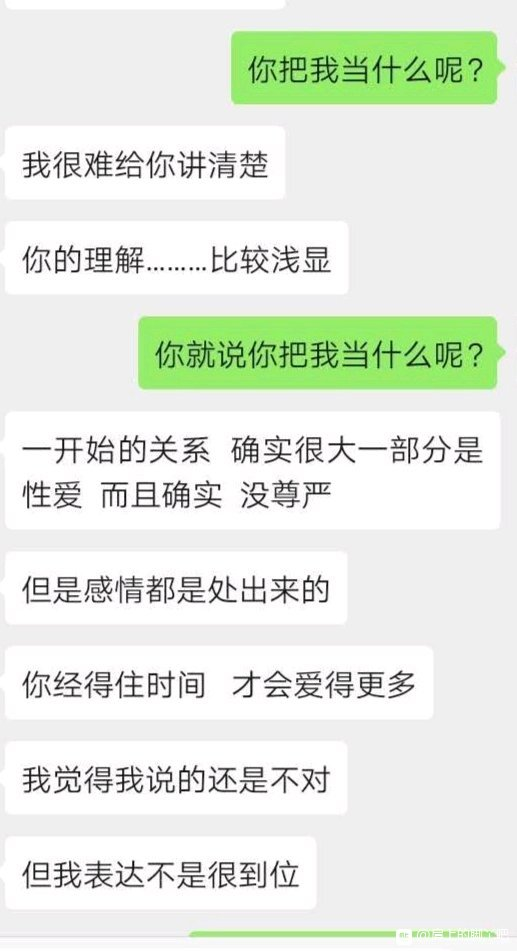
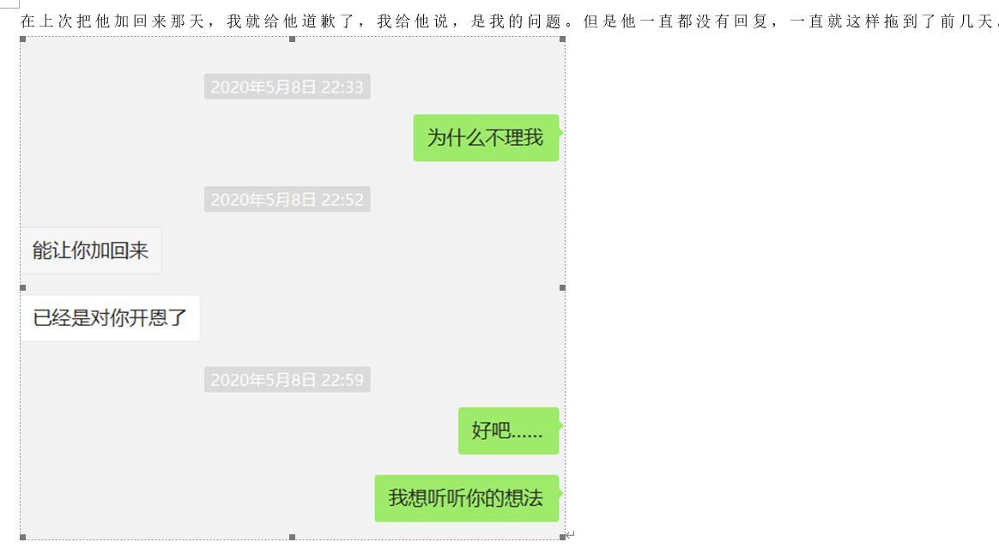
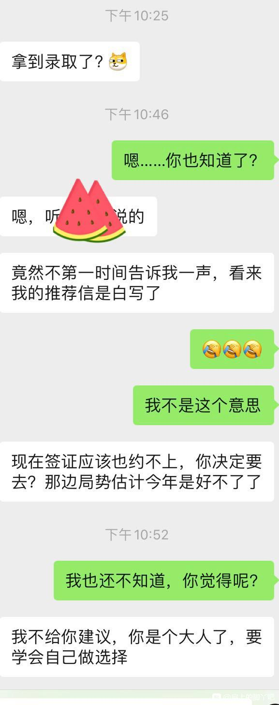
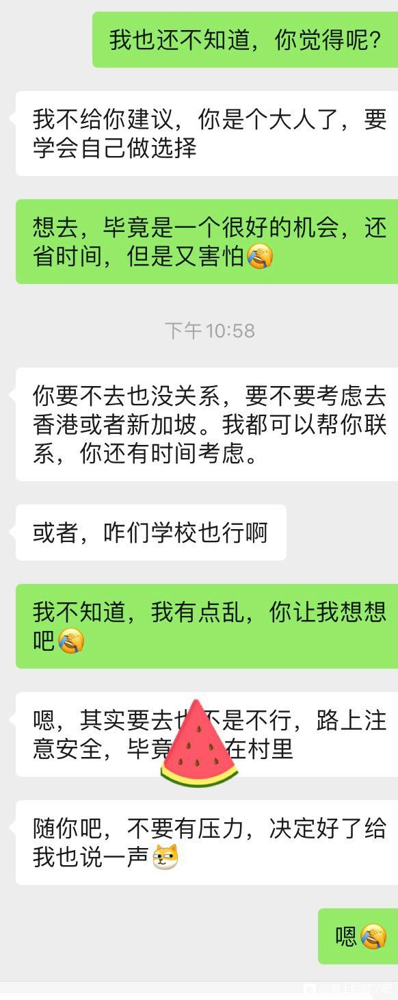

【和本校博导的二三事】

            1楼 | zwjr💕 | 2019-12-01 07:06

本可今年大三，是一名名副其实的清纯男大学生，在学校从来不约，虽然经常上小蓝小红看看却也很少面基。

            2楼 | zwjr💕 | 2019-12-01 07:09

大二的时候，上专业课，讲课de是我们学校一位很厉害的老师惹。从美国top10回来的惹，还是什么计划巴拉巴拉的引进回来的厚，反正就是很厉害的样子。是我们学校最年轻的教授惹

            3楼 | zwjr💕 | 2019-12-01 07:11

因为本可以后也有去美国站街，呸，深造的打算，所以就加了他的微信好友。想要询问一些关于申请学校啊，还有本科阶段要做什么事情的准备厚

            5楼 | zwjr💕 | 2019-12-01 07:13

加上本可是班里的学习委员。平时一直负责帮老师收作业，布置作业巴拉巴拉的事情，所以一来二去就和他慢慢熟络起来了

            7楼 | zwjr💕 | 2019-12-01 07:16

一开始就是非常普通的师生关系惹，就觉得这个老师人很好惹，把学生当朋友一样，就是让人感觉和他相处，和请教问题的时候完全没有压力惹

            8楼 | zwjr💕 | 2019-12-01 07:20

本可记得有一次我有一个问题没懂，就在微信上问了他一下，然后他没回惹，那个时候大概晚上十点多了吧，我以为他睡觉了，结果快12点的时候他发了好多张图片过来。把我问的那个问题从模型的建立，到推导，再到延伸。每一个细节都清清楚楚写出来

            9楼 | zwjr💕 | 2019-12-01 07:23

本可一下子就觉得非常感动惹，于是回了一句“谢谢老师，这么晚还回答我的问题。非常感谢呀”  
然后他回了一句“别熬夜了，早点睡啊，如果还没有明白的话下次课前方面给你解释”  
本可感觉很感动，但是又略微有点尴尬，因为他明明就在熬夜还劝本可早点睡觉

            10楼 | zwjr💕 | 2019-12-01 07:26

转折出现在半期考试，因为本可那个学期有学生会的职务，要带一群学弟学妹，还要负责一些活动项目，所以根本没有多余的时间复习半期考试，而且期中一般都是活动最密集的时候，所以毫不意外，本可半期考试爆炸了

            12楼 | zwjr💕 | 2019-12-01 07:29

半期考试满分100我只有72分。而且题目并不难。但是由于本可没有复习，光凭着平时上课也很难拿高分。就感觉非常的难过，半期考试以后我也不敢再主动问他问题了，因为感觉很丢脸惹

            13楼 | zwjr💕 | 2019-12-01 07:31

其实按道理来说大学老师完全不用像高中老师一样那么认真负责，上完课就可以走人，做好自己的科研就好了。可是他真的很认真惹。  
可能是我太长时间没有问他问题吧。我也不知道他是故意的还是无意的，后来有一次上课的时候他抽我回答一个问题。说实话，那个问题真的有点难度，需要推导一下。所以我没有回答上来。。然后他就让我坐下。然后他就在课堂上说“老师呢，还是希望大家有不懂的地方及时提问。这门课是大家的专业核心课程，不管以后分流选哪个方向，这门课都是大家的基础。所以呢希望大家要好好学，我们互相配合，为以后更专业的学习打下一个好的基础。”  
我在下面默默低着头，没有控制住自己的情绪，在那里偷偷抹眼泪。其实也不是什么大事，就是突然很难过。

            15楼 | zwjr💕 | 2019-12-01 07:40

为什么要踩本可的帖子惹

            17楼 | zwjr💕 | 2019-12-01 07:52

那天下课之后本可就拿上书包立马就出教室走了，不想被别人看到自己哭了。害怕别人觉得我太矫情。然后就是因为那天太沉浸在自己的情绪里。完全不知道那天布置了课后作业。。。而且加上本可的宿舍是混合宿舍，就是我们一个宿舍4个人是三个专业的拼在一起的那种。没有室友和我一个专业。于是乎也没人给我说有作业。等到下一次上课前，我们班的同学找我交作业的时候我当场懵逼了。。。。  
唉，当时就算现抄也来不及了。。。所以那一次的作业我就没有交。作业是算平时分的，计入期末总评。没有办法，自己的过失，只能承受。  
怎么说呢那一个星期都是浑浑噩噩的，就是好像到了一个瓶颈期，上课听不进去。也没有看手机啥的，就是听着听着课脑袋就空掉了。特别的迷茫

            19楼 | zwjr💕 | 2019-12-01 08:05

然后那个周末他主动发了一条微信给我。内容大致是这样的“xxx，你的作业是不是漏交了？收作业的时候只想着收别人的，自己的都漏掉了，下次仔细点，下周上课前给我就行了。”  
我看着手机屏幕一下愣住了。。突然觉得好愧疚啊。

            21楼 | zwjr💕 | 2019-12-01 08:09

当时我也不知道怎么回复，想了很久之后就回复了一个字。。好。。  
我也不敢解释，我总不能说是的自己忘把自己作业放进去了吧。。因为明明就是没写。于是乎我那天下午就背上书包去图书馆自习去了。花了整整一下午，写完了那份作业。。为什么会花一下午？。。因为上课没认真听，现学现做，能不慢嘛

            22楼 | zwjr💕 | 2019-12-01 08:13

不好意思厚，突然有点事情需要出去一下，等会吃晚饭的时候再煮了

            25楼 | zwjr💕 | 2019-12-01 08:20

然后后来我去交作业那天他用那种开玩笑的语气说“这一次就算啦，下一次再忘了就给你记一笔咯。”  
我尴尬又不失礼貌的微微笑。回答dao“呵呵呵，谢谢老师”

            29楼 | zwjr💕 | 2019-12-01 09:04

经过那一次之后吧，我上课也变得认真了很多，因为我总觉得老师都这么信任我，我不应该辜负这份信任。然后也渐渐问他问题多了起来。  
因为是下半学期，我们学校大四的学长学姐不是要做毕业设计嘛，然后他做指导老师，毕业设计需要一些数据，这些数据需要去外面做问卷调查  
。有一次课前他就问我们班上有没有同学有兴趣参与的，因为是一个专业的嘛，可以提前了解更多一些东西，  
我当时想着也是对自己的锻炼就给他说我想去。然后我们班上还有几个同学也想去，于是我们就组成了一个小组。去外面做问卷调查。

            30楼 | zwjr💕 | 2019-12-01 09:16

就是因为这个事情，除了上课之外的时间和他接触也多了起来。因为他要给我们指导怎么做调查，然后有些问题的指向性啊巴拉巴拉的。  
但是做调查远比想象的辛苦多了，天气很热，还晒。然后很容易被别人当成发小广告的人或者骗子。反正就是很多情况。不过好在还是完成了。

            32楼 | zwjr💕 | 2019-12-01 09:25

后来就期末考试了，本可努力复习，最后考了96。也是非常开心惹。事情真正的发展是快放假前一周，就是刚刚考完他那门试的那周。那天吃午饭在食堂排队遇到他。然后就和他坐在一起吃饭。

            34楼 | zwjr💕 | 2019-12-01 09:28

吃饭的时候他就给我说了一些他在美国上学时候的好玩的事情。  
然后我就蹦出一句“真好，我也想去美国看看”。  
然后他说：“哎，我暑假带我的学生（他带的博士生）去伯克利一趟，要是可以的话，你也可以去啊”  
那个时候本可还不太了解美国的大学，就出丑了  
我：哇，伯克利音乐学院嘛？  
然后他就笑了“自己回去查去，哈哈哈”  
于是我就很尴尬。。。  
不过那天他提出说可以带我去美国我却默默记了下来

            35楼 | zwjr💕 | 2019-12-01 09:34

然后那天晚上，我就在微信上问他，我真的可以和他去美国嘛？他说可以啊，不过时间很紧迫，因为我还没签证，如果我要去的话最好快点这两天就快点决定，这样才有足够时间可能把签证拿到。然后他也给我说了来回机票的话我要自己买，因为他和他学生去是用的公费，所以不能算我，但是住和吃的话我跟着他们蹭一蹭就行啦，也不用多花钱

            36楼 | zwjr💕 | 2019-12-01 09:45

于是乎我大概在某旅行软件查了一下看看飞美国的机票多少钱，发现其实没有想象中的贵唉，于是我就搞快打电话给我妈，给她说了这件事，然后因为是和学校老师去，她也支持我多出去见见世面。于是乎就这样愉快的决定了。

            37楼 | zwjr💕 | 2019-12-01 09:47

填完信息已经10点多了。然后他又给我列了张单子，让我回去准备什么照片，银行流水账单，存款证明。还有一些复印件巴拉巴拉的。还让我办张visa方便我买东西。然后我就回宿舍啦。其实那个时候我也没有特别激动吧，他说不一定我能拿到签证呢。因为他有签证，我和他的学生没有。我们得去领事馆面签嘛。运气好的是我正好去年去新加坡玩办了护照，所以不用耽搁时间办护照，不然一来二去要拿签证肯定时间不够了。  
然后过了一周多就放假了。回去大概半个月应该时间差不多吧，就到了要去面签了，面签还算顺利，还好我是和他学生一起去的，然后我们一对人在一个窗口。面签官一开始还用中文，后来知道是去学术交流就一直英文问问题了，问了带队的那个学长大概都快半个小时了吧我们一队人终于一起approved了。要是让我一个人去，估计只能拿到红纸了

            40楼 | zwjr💕 | 2019-12-01 10:03

面签之后我就没回家了，我就和他们回学校了。我们学校暑假不封校，而且还有很多考研的就在学校复习，所以也并不是很冷清。我想着也可以看看平时他们研究生博士生都在实验室做啥，而且过不了多久就出发了，回去又来太麻烦。于是乎我就征得了老师的同意，可以进他们实验室。  
原来博士生和研究生很多暑假都要留在学校。其实也蛮辛苦的。然后有一天说要去外面做调查。具体考察什么就不说了，因为太容易暴露学科和学校了

            43楼 | zwjr💕 | 2019-12-01 10:22

那个时候我才大概知道我可能是晕倒了。然后到了车旁边，他把我放下来让我搂着脖子稳住一下，他开门，然后他把我放到副驾驶上，他进来之后把窗子然后拿起一瓶矿泉水，让我先喝一口，然后给我喝了他放在车上的霍香正气水，还喂我一颗水果糖。硬糖糖因为夏天太热了，都化开了，粘粘的。我看他的T恤已经湿透了。但是那个时候实在太难受了，我没有力气说话。于是乎我就蔫蔫的在副驾驶上瘫着。他边开车还时不时扯一扯我的耳朵鼻子，让我清醒一点。没有多久就到医院了。其实在车里休息这一会已经比最开始好受多了。然后到了医院，我可以站住了，他就扶着我进了急诊科。。。然后医生就问我什么症状，然后医生就问我，吃早饭了嘛。  
我：没有

            44楼 | zwjr💕 | 2019-12-01 10:38

            45楼 | zwjr💕 | 2019-12-01 10:42

本可刚刚写完作文，来煮煮夜宵噜

            48楼 | zwjr💕 | 2019-12-01 15:39

后来医生也没给我开药，给我喝了两支葡萄糖，用电筒看了看我的眼睛，就让我们走了。说我是低血糖，加上天气太热所以才晕倒的。  
然后走出医院的时候他走在前面我就跟着他走在后面，因为看出来他有点生气，我也不敢说话。  
然后他突然转过头来对我说“我先带你去吃点东西然后送你回学校，今天在宿舍好好休息吧。”还是平常很温柔的语气。  
我不知道说什么，就悻悻的点点头。  
后来在车上他就问我  
“还有不舒服么？”  
我说：没有了。  
过了一会我又说：x老师对不起，我给您添麻烦了。  
他转过头看了我一眼，又转回去继续开车  
他说：没事，要是真觉得对不起我，那以后就都记得把早饭吃了。  
我很坚决地答应了他

            49楼 | zwjr💕 | 2019-12-01 15:46

过了一会他把我带到一家外婆印象，那个时候否11点多了，那是除了在学校食堂以外我和他第一次吃饭，我至今都记得很清楚。要了三个菜，一个莲藕排骨汤，一个宫保鸡丁，一个面筋。  
吃完饭之后他把我送回了学校，一直送我进了寝室门才走。

            50楼 | zwjr💕 | 2019-12-01 15:52

那天下午我就在宿舍躺了躺，然后玩了玩lol。然后大概4点多的时候吧，他和学长学姐们应该是收工了，然后准备去吃饭，他打电话问我要不要去。我虽然对那天上午发生的事情感到没脸见人，但是又不好意思拒绝，于是还是答应了。约好在学校门口一起走。  
我赶紧洗把脸，换了身干净的衣服准备出发。我到学校门口的时候他们全都在那了。搞得我特不好意思。  
然后一个学长开玩笑说：好啦，现在又活蹦乱跳得了，不想干活明说嘛

            51楼 | zwjr💕 | 2019-12-01 15:58

吃饭的时候，我就在旁边听他和他的学生聊天，因为那个时候我才大二，他带的其他学生都是研究生和博士生。他们说的一些我也听不太懂。不过大致知道他们在说他们收集的数据啥的。  
吃完饭之后，回到学校，就各自回各自宿舍了。  
不过第二天一早当我跑去实验室准备去那混时间的时候发现他们都不在。。。  
我就明白他们没给我说，然后又外出了。突然就有一种拖别人后腿被抛弃的感觉。怎么说呢，我这个人自尊心很强说难听点就是有点自卑吧，那个时候我就觉得自己总是腆着脸皮跟着老师，却又没有一点贡献不说，还拖后腿，突然觉得自己有点不要脸的感觉。反正那种感觉就特别不好受吧。但是我也不好意思向他表达这些。

            55楼 | zwjr💕 | 2019-12-01 16:12

于是乎后面两天天我都没再去他实验室，就自己呆在宿舍，看看书，打打游戏，睡睡觉。到点就去食堂吃饭。  
然后第三天的晚上吧，9点多的时候，我刚刚洗完澡回宿舍。  
然后，看到他10多分钟前发的消息“怎么这两天都不见人了？新操场修好了，咱们去转转吧”  
因为暑期我们学校新修的运动场修好了，那天好像正好开放。  
然后我赶忙回消息“不好意思呀x老师，我刚刚在洗澡，我马上换好衣服就来”  
然后刚把消息发过去，他就回复了“嗯嗯，不急”  
于是我赶紧把头发吹干，换了身衣服就下楼了。

            57楼 | zwjr💕 | 2019-12-01 16:18

我到的时候他已经在操场上等我了。他先看到我，然后向我挥挥手，有点黑，我不确定是不是他，然后走过去，发现是的。突然有点小尴尬，不知道该说什么。  
然后他先开口了：这两天做啥去了？天天在宿舍打游戏呢？还是去图书馆学习呢？  
我：没有，就是想在宿舍调整调整。  
他：这样啊，我还以为你生气了呢。  
我：啊？没有没有，是我自己笨，拖后腿，不怪你们。  
然后他就笑了，说：我就说了个生气了，为啥生气也没说，你看你自己全说出来了。  
然后我就非常不好意思，感觉好尴尬啊

            58楼 | zwjr💕 | 2019-12-01 16:26

搞得我都没法说话了。  
然后他又说：行啦行啦，我们说点别的，上周护照寄到了，我们后天就出发，明天收拾好东西，后天上午一早我们就走。  
我：啊？那机票我还没订。  
他：你是不是傻呀，你护照签证在我这，我早就订好了。哈哈  
我：哦，是哦，那对了，老师我把钱转给你吧，机票多少钱。  
他：不急，等这趟回来再给我钱吧。这还没出发呢就急着找我算账啦？  
我：啊，我不是这个意思

            60楼 | zwjr💕 | 2019-12-01 16:33

然后他就给我说，什么东西必须带。什么东西可带可不带。什么东西不用带。要坐15个小时才能到加州。教我怎么坐长途飞机坐的舒服一点。  
后来我又问他一些他在美国上学的事情，我特别喜欢听他讲自己的故事，感觉特别有趣。正当听得入迷的时候，我踩到了跑道边上的凸起的那一块。就是跑道最边上那一块凸起的条状的石头。一下没站稳差点摔了。然后他一下两只手抓住我手腕。那是我第一次很清楚的感受的他的体温。他的手很有力量，也很热。  
因为我的手臂贴着他的手臂。热热的，我一下脸就变得特别烫。还好那是晚上，我估计自己的脸红的和猴屁股一样吧。我感觉站稳。撤开。  
他：没事吧？  
我：没事没事不小心踩错了地方。enmm，老师我看也不早了，我们要不就回去了吧。  
他：嗯嗯，好，我送你到宿舍楼下吧。  
我：啊？不用不用，您直接回吧，走我宿舍楼您又得绕路。  
然后我就没让他送我，两个人就在运动场门口分开了。我回到宿舍照镜子发现自己脸还红红的。真是羞死了

            62楼 | zwjr💕 | 2019-12-01 16:46

惹，今晚就到这吧，先睡了，白天有时间继续煮。。emmm，因为就是今年暑假发生的事情，也没有很长的时间，我也想把细节都煮的多一些，所以节奏可能会比较慢。睡觉啦

            63楼 | zwjr💕 | 2019-12-01 16:48

本可这周考试很多，白天要复习。只有晚上抽出时间煮饭惹，大家不要逼太紧惹。我要是没考好会被他骂的惹

            71楼 | zwjr💕 | 2019-12-02 09:10

我来惹，嘻嘻嘻

            74楼 | zwjr💕 | 2019-12-02 15:29

然后第二天我就好好在宿舍收拾东西，按他给我说的，该带的都带了。那天很激动惹，因为马上就要第一次去美国了。  
到了真正出发的那天了，因为直飞的飞机太贵了，所以我们订的机票都是先飞首尔然后转机飞美国。  
那天早上我们先在学校门口集合，然后分两组打车过去。到了机场，取机票巴拉巴拉的都是他去弄的。我和几个学长学姐就在休息区等他。  
哦对了，说一下我们一行人我，他，他的一个男博士生和一个女博士生，两个男研究生和一个女研究生，加起来一共7个人。  
机票取出来，飞韩国的机票没有和他挨在一起，从韩国飞美国的却是邻座。  
我一开始还以为飞韩国就要五六个小时嘞。结果不到三个小时就到了。  
然后在仁川机场逛了逛。吃了碗9400的面。呆了一共也不到两个小时，简单逛了逛机场的免税店。。啥也没买然后就登机了。登机的时候，韩国时间也才3点多。

            75楼 | zwjr💕 | 2019-12-02 15:48

长途飞机其实挺无聊的。也不能上网。就看看机载的电影，然后吃饭，睡觉。不过好在他坐我旁边，聊起天来也挺好玩的，我的位置是A，他的是B。空姐给餐的时候我不太好拿，他就会帮我接。晚上了，慢慢外面的天也黑了。然后其实也累了。于是就准备睡觉了。飞机上有毯子，我把毯子裹在身上。但是可能我不太受得了飞机舱里的冷气，于是就打了个喷嚏，然后有点流鼻涕的感觉。因为是晚上了，已经熄灯了，我坐在最里面我也不方便出去拿我包里的外套，于是乎就只能把毯子裹得更紧一点。  
他看到了我这样，于是把他自己的毯子裹在我身上，然后自己穿上外套。  
我正想说话呢，他做了个手势，嘘。  
然后我就说了个谢谢就继续睡觉了。唉，其实飞机上睡觉真的很不舒服，主要是经济舱太挤了。所以都是半梦半醒罢了。而且还有熊孩子不知道为啥在那叫，简直太难受了

            76楼 | zwjr💕 | 2019-12-02 15:58

然后就到了加州了，我忘了那个机场叫啥名字了，就是离旧金山那边很近那个。我们到的时候加州还是下午，因为有时差的原因嘛，就很累，而且飞机上也没休息好。于是就先在一个地方，我也不知道是哪，反应是他找的，不是旧金山城里，一个我也不知道算不算郊区的地方。反正就是公路很宽。两边都是一些社区和各种商店的地方。  
在那里的一个hostel住下了。分房的时候自然而然就变成了2\.3\.2。我和他一间，他的三个男学生一间。两个女学生一间。其实二人间个三人间没区别，就是多和少一张床的事。  
因为太累了，我晚餐也没吃，洗了澡就直接睡了。

            77楼 | zwjr💕 | 2019-12-02 16:08

然后我醒的时候才半夜两点。。发现他还没睡。  
他：醒了啊？我给你打包了吃的回来。板凳上，你快吃吧。怎么样，坐飞机累了吧。  
我：嗯嗯，没想到这么累呢。老师你怎么还没睡啊。  
他：我吃完晚饭回来已经睡了一会了，又醒了。唉，果然是老了啊，不去你们这些小崽子能睡。  
我：现在咋才两点啊，我还以为睡了好久。  
他：正常，倒时差呢，过几天就慢慢习惯了。我又有点困了，准备再睡会。你把晚饭给补上，不过不要吃太多了，吃到不饿就别吃了，回床上躺着养养神，明天上午好好休息，下午出发去伯克利。  
我；嗯嗯，好嘞

            79楼 | zwjr💕 | 2019-12-02 16:16

来啦来啦

            85楼 | zwjr💕 | 2019-12-03 15:33

第二天我们就出发去伯克利了，期间我就是跟在后面，参观图书馆，校园啊巴拉巴拉的。然后他们就去办公室谈课题的事情了，这次他主要过来好像就是和这边的教授有一个合作的研究项目。中间这些我就不煮了。他们说的我也没听懂。反正那几天就是我跟着他们在实验室里打杂。虽然挺无聊的吧，但是跟在他背后就感觉挺安心的。

            87楼 | zwjr💕 | 2019-12-03 15:41

学校里的事情差不多近尾声了，于是乎我们就准备在加州玩一两天，然后去下一站，纽约。  
不知道大家知不知道，在去十七里黄金海岸线的路上。公共海滩的地方有一个叫情人岛的地方。那天出去玩的时候正好路过，于是我们就在那待了一会。那里有好多像松鼠一样得动物。还不怕人那种。于是乎我在那逗它们玩，他还在旁边笑我。

            88楼 | zwjr💕 | 2019-12-03 15:46

虽然我不记得情人岛有什么传说了，我记得他当时给我讲过的。  
想着既然都到了情人岛，那就做点什么吧。  
于是我转过头，向着他说：你有一美分的硬币嘛？给我一个呗。  
他：有啊，给你。  
然后他就很疑惑得从裤兜里掏出一个一美分。  
我一把拿过来，然后转身往最靠近海边，最高最险的那块石头走去。  
他看到我往那边走，说：嘿，xxx小心点，这些石头都很锋利的，别摔了。  
我回头对他笑了一下，点点头，继续往前走。走到了那块石头下面

            89楼 | zwjr💕 | 2019-12-03 15:52

就是这块石头，当时还有只鸟在上面

            91楼 | zwjr💕 | 2019-12-03 16:00

放好之后，我站在情人岛上，默默得面对着这片大海许了个愿望。  
我想，如果可以的话。就让这两枚硬币的主人一辈子都在一起吧。现在想起来真是又傻又好笑呢。  
然后我就往回走啦。  
他问我：跑那边干啥呢，怪危险的。  
我：就是看看啦，站的高看的远。哈哈。

            92楼 | zwjr💕 | 2019-12-03 16:05

我又对他说：如果有机会的话，我一定要再来一次。你要不要一起啊

            94楼 | zwjr💕 | 2019-12-03 16:16

哦，煮了这么久都忘了讲讲他是个啥样的人。他是85后。他比我高一丢丢，185左右吧，但是高了那么几厘米却比我重了20多斤

            95楼 | zwjr💕 | 2019-12-03 16:37

来了

            106楼 | zwjr💕 | 2019-12-04 15:31

后来我们又在旧金山玩了一天，就准备去纽约了。  
从美国西海岸坐飞机到东海岸要6个小时左右。我们是晚上的飞机，所以人特别的少。所以运气很好，我们那一排四个座位只有我和他两个人坐了，就空了两个。所以还算宽敞。而且座位与座位间的扶手可以抬开嘛，所以我就把扶手抬开，半个身体趴在另外两个空的位置上去。因为实在太困啦，所以很想睡觉。  
我正把垫背的那个东西准备用来做枕头呢，他两只手拖住我的肩膀，往后面挪了挪，让我头睡他的大腿上

            108楼 | zwjr💕 | 2019-12-04 15:47

不好意思今晚煮的太少，因为今天考了两门试，精神绷了一天，中午复习也没午休，有点扛不住了，太累了。明晚给大家补上好吧

            110楼 | zwjr💕 | 2019-12-04 16:03

姐妹们不要催我惹，我是这两天真的事情超多惹

            122楼 | zwjr💕 | 2019-12-06 22:21

惹，等本可明天早上的考试一考完本可就来乖乖煮饭惹

            129楼 | zwjr💕 | 2019-12-11 10:13

我们当时住的地方，在曼哈顿中城，美国txl是合法的，可以结婚的，所以连警察局门口都有彩虹旗。估计是骄傲月留下来的吧。那天下午正好出去吃饭，在一个餐厅门口，看到两个男的搂在一起亲亲。。然后我就站在那看了一会，现在想起来真的好傻。。我在那看得很认真，所以没发现自己都要掉队了，结果一个学长叫我，我才反应过来

            131楼 | zwjr💕 | 2019-12-12 11:01

姐妹们，我最近这么更不了惹，事情真的太多了，我都快疯了，感觉老天爷在和我开玩笑。好难受

            162楼 | zwjr💕 | 2019-12-23 15:50

来了来了，我放假了，现在在回家的车上

            170楼 | zwjr💕 | 2020-01-12 00:20

之后我们又去了纽约几个比较有代表性的学校，不得不说他是真的挺厉害的厚，看不出来他认识那么多学校的教授，他说那些教授都是他的原来读博一个办公室或者项目组的。  
我虽然知道他\*\*\*，没想到这么牛逼

            171楼 | zwjr💕 | 2020-01-12 00:25

有一天下午六七点，因为我们住在曼哈顿中城，周围有好几个那种酒吧，就是那种不开灯，只点蜡烛的那种。从外面看很昏暗，然后那几个学长就说想去。没想到他竟然同意了厚

            172楼 | zwjr💕 | 2020-01-12 00:39

晚上时代广场的人真的多惹，不过这里卫生真的比不上国内，地上都是黑黑的，脏脏的。倒是周围有很多商场。  
后来我们逛累了就准备回去了。回去的路上气氛还是有点尴尬的。因为不知道要说啥，他应该也觉得气氛有点尴尬，于是就开始哼歌。你们绝对猜不到他哼的啥歌

            173楼 | zwjr💕 | 2020-01-12 00:50

然后就这样走着走着，他突然用手指戳了我背，也不是背吧，就是腰上面一点点，基本就是裤子上面十公分。  
我有点懵，转过去看了他一眼。  
他用那种贱贱的语气：咋了，还不能戳你一下  
我有点无语

            174楼 | zwjr💕 | 2020-01-12 01:08

他：哈哈哈哈哈哈，你咋还害羞呢。羞答答的，哈哈哈  
我尴尬又不失礼貌的微笑，结果他还在笑。  
于是我就用那种很母很母的语气，撒娇一样那种说“哎呀，你不要再说这个了”。就是那种很母，身体还要跟着扯动一下的那种

            175楼 | zwjr💕 | 2020-01-12 01:13

            186楼 | zwjr💕 | 2020-02-12 02:50

吃午饭了

            190楼 | zwjr💕 | 2020-02-12 04:13

后来我们就回到了hostel。  
在纽约也待了一个周了差不多，在空闲的时候也去了很多地方，最后我们就准备回国了。  
不知不觉这一段在外的旅程也结束了。回到学校，离正式开学也就大概一周的时间了，我也不准备再回家了，就在他的实验室搬搬砖。  
有一天上午，他在实验室里问大家：下午有没有人去打打羽毛球呀，好久没活动活动筋骨了。  
然后学长们纷纷摇头：不去不去。  
我看他们都说不去，于是我说：那我去吧，反正我下午也没事。  
他看了我一眼，说：会打么。  
我；我小学三年级就会打了，不过好一阵没打过了，可能手有点生。  
他：没事，会打就成。  
于是乎下午我和他就去一个室内羽毛球场打球去了。  
我：x 老师， 我们怎么不在学校打呀，还要开车出来。  
他：害，你不懂。我不想在学校打，放不开，熟人太多。  
我：哦，这样啊。还是不太懂。  
他：哈哈哈哈，没事，以后你会懂的。

            191楼 | zwjr💕 | 2020-02-12 04:13

到了之后他带着我热了热身，然后我们就准备开始打球了。我：X老师，我太久没打了，你让着我点哦。他；在外面学校不用叫老师，叫玮哥就行。我：伟哥？这个叫法会不会不太好啊。他：什么不太好，怎么？是嫌我年纪大要叫叔叔嘛？我：不是不是，那就。。。伟哥吧。（我当时想的是伟哥不是那个啥嘛，虽然他是王字旁的玮，但是叫起来不就是一样的嘛。。。我又不好直接说。）开始打球啦，不得不说，我很菜惹。。。。一开始热身还好，后面我就有点坚持不住了，他的攻势太猛了，一次又一次的射击，我都招架不住。他：你不行呀，虽然会打，但是都是凭感觉来打。你过来，我教你一下，把动作改一改。我：哦。然后我就走到他的那个半场。然后我站在他前面，他站在我后面。他在后面伸手把我的小臂握住。我愣了一下。。。。因为是夏天嘛，两个人都已经满头大汗了。而且靠的这么近，能够特别明显的感觉到他的体温。。。而且他在教我的时候，说话的呼吸又直接碰触到我的脖子。我TM瞬间就害羞了。不过还好是背对着他。他：你这样，你看你这个角度打球，这样用力的话就会省力很多。。。然后巴拉巴拉讲了一堆，给我纠正动作。接着又继续打了一会。都打疲了。就准备回去了。

            192楼 | zwjr💕 | 2020-02-12 04:14

他：直接去我家吧，你也顺便洗个澡。  
我：我还是回学校洗澡吧。  
他：不是，主要是这里离我家近，回学校要绕一点，我想快点回去换身衣服。你要想直接回学校也成，我先送你回去。  
我：那算了吧，去你家好了，不过我没带换的衣服哎。。。。  
他：我回去翻翻我的衣服吧，你应该有能穿的。  
于是我就这样去了他家。。。。

            193楼 | zwjr💕 | 2020-02-12 04:14

他家在一个还比较高档的小区，从绿化就看得出来这里房价肯定不低。  
进楼，上电梯，到了他家。他家不算很大，不过反正他也是一个人住。。。  
他：你跟我来房间，看看有没有你能穿的衣服。  
我：哦。（我还很好奇他的房间是什么样子的，会不会像大龄单身男青年一样乱乱的。）  
结果发现不是惹，反而特别的整洁。他的房间还有一个小阳台，采光还挺好。  
然后他就开始从衣柜里翻衣服。  
这件你看看？这个呢？这个？那这个吧？  
翻了好几件出来，终于有一件我能穿的短袖了。。。因为他虽然和我差不多高，但是要壮一些，所以好多他的衣服对我来说都偏大。。。  
然后随便找了一件篮球裤凑合凑合。  
他先去洗的澡，洗完之后我又去。  
我洗完穿好衣服出来。

            194楼 | zwjr💕 | 2020-02-12 04:15

他怔怔地望了我一眼：你别说，你穿这个还挺好看的。  
我：是吗？  
他：哎，对了这件衣服你要不，送给你。我朋友从国外给我带的，不过这配色，我穿不出门。  
他递了一件Hi panda 的衬衣给我，是那种浅红格子，加灰色的拼接款。  
我：我感觉有点大哎。  
他：你先试试嘛，我觉得应该合适。  
然后我就当着他的面把短袖脱了，试了试这个衬衣。。。真的还挺合适。。。。  
他：你看，我说吧，挺合适的。送你了。  
我：啊？这样不好吧，我都不好意思了。  
他：哈哈哈，没事，反正我又不穿，这衣服吊牌都没拆。。。你不要我也只能压箱底放着。  
我：哦，那好吧。  
后来在他家坐了一会。  
然后他就送我回学校了。到了学校。  
我：谢谢X老师了，对了我身上的衣服，我明天洗好还你。  
他：不用还了，送你了。你身上的我都穿不了。。没事。  
我： 啊。。。。那好吧。  
他：我回去了啊，下次有机会再一起打球啊。  
我点了点头  
他就笑了。  
我：笑什么啊？  
他：没有，就突然觉得你穿着这身衣服和一个人好像，行了，我走了，你也回去吧。

            195楼 | zwjr💕 | 2020-02-12 04:15

集美们不要逼太紧惹

            214楼 | zwjr💕 | 2020-02-13 01:24

吃晚饭惹

            218楼 | zwjr💕 | 2020-02-23 11:01

说实话，他送我衣服搞得我怪不好意思的。。。。  
于是我就准备去买一件短袖送给他。在商场挑了好久，找到一件PUMA的短袖感觉挺合适的。主要是贵了的我也买不起。。。所以就挑了好久。。。  
买好衣服的第二天我就拎着个小袋子去他的办公室找他。  
我：X老师，这个给你。  
他：这什么？衣服啊？  
我：嗯，是。我我我，，，，买的  
他：钱多的烧的慌啊，我不缺衣服，自己拿去穿去  
我：额。。。我没乱花钱，我拿奖学金买的。你的码，我穿太大。  
他：。。。。。。。害，你这小孩，早知道你这样上次就不该送你衣服。行吧，那我收下了，谢谢你啊。我等会回去试试。  
我：嗯，好。那我先走了。老师再见\~  
后来晚上的时候他给我发了一条VX：衣服很合身，很好看，有心了，谢谢。

            219楼 | zwjr💕 | 2020-02-23 11:02

再后来，就开学了，因为开学事情可多了，虽然我大三了不用管迎新的事情，但是班上同学的教材啊什么的都还要我负责去领，还有学办各种各样的表要填，忙了好几天。  
那天下午上完课，我正从教学楼出来准备去食堂，突然有人叫我。我转过头一看，发现是他，估计他也是刚刚上完课。  
我：啊。X老师啊，好巧。我刚刚上完课准备去吃饭了  
他：嗯，那一起？我正好也去。  
然后我们就走在熙熙攘攘的人流里。  
他：怎么样，开学了还习惯吧。  
我：嗯嗯，感觉没啥差别。  
他：嗯，对了，你还准备出国么？我听你们班主任说你成绩挺好的，正常来说，保研没问题的。  
我：哦，是吗？我还没考虑的很清楚。我其实现在也有点纠结。

            220楼 | zwjr💕 | 2020-02-23 11:03

他：那你要好好考虑咯，你都大三了哟。国内和国外的环境你都体验过了，怎么选看你自己。如果你想保研本校的话我给你留一个位置。你想去其他学校我也可以帮你联系。你要想出国也没问题，反正你现在基本条件都够，不过要是想出去的话早点把语言成绩考出来哦。  
我：哦，好吧，我考虑考虑。  
他：其实吧，我觉得你更适合出去  
我：为啥？  
他：你太乖了，该出去激发激发自己的潜力。其实你很厉害的，可是你有点不自信。当你一个人在国外的时候，环境会逼迫你成长。而且你不是说你想以后做大学老师嘛？那就去美国念个phd再回来。  
我：嗯。那我好好准备语言成绩先。  
吃完饭之后，我准备去图书馆坐一会。他要回办公室，正好顺路。  
走到图书馆，他突然摸了摸我的头。  
他：走了啊。  
我：哦。  
然后我就往阶梯上走，走到一半我转过去看着他的背影，又摸了摸他刚刚摸我头的位置。  
总感觉怪怪的。  
那种怪怪的感觉一直持续了一个晚上。一直到那天晚上我睡着。

            221楼 | zwjr💕 | 2020-02-23 11:03

因为这学期他没有带我们的课，所以我们基本就是在实验室见得比较多，我一般做完自己的事有空闲就往他实验室跑，想要搬砖搬也蹭一些成果出来。可是还是蛮难的，主要是他不准我水。我平时上课时间又多，很难跟实验室学长学姐他们的进度。  
不知道为什么，我从来都没有见过他穿我送他的那件衣服。没次见到他的时候我都会有意的看一下，结果他从来都没有穿过。我也不好意思问。  
有一天晚上，我从图书馆出来，准备回宿舍了，结果正碰到他准备开车回家。  
我：X老师，你这么晚才回家啊。  
他：嗯，在办公室多呆了一会。你这学这么晚回去啊？不才开学嘛？  
我：我喜欢呆在图书馆里，安静。  
他：哦，行，那我走了。（然后他就进他车了）  
我：X老师再见。  
他：哎，等一下，给你个东西吧，正好放在车上。今天M教授送给我的巧克力，他去国外开会带回来的，给你吧，我不喜欢吃这东西。拿着，给你你就拿着。  
我：哦，那谢谢老师了。老师再见。  
他：嗯，再见

            222楼 | zwjr💕 | 2020-02-23 11:04

刚刚看完书，洗完澡煮饭惹

            230楼 | zwjr💕 | 2020-02-23 12:49

后来就还是周末实验室见见，然后就平平常常到了国庆节。  
国庆节本来我是打算回家的，结果忘了提前一个月买票，那个时候已经没车票了，坐飞机又太贵了

            232楼 | zwjr💕 | 2020-02-23 13:51

结果假期第一天我就真的傻傻的早晚的去实验室，准备去看看能做点啥。  
结果我去了之后，办公室和实验室都锁着，没人。

            235楼 | zwjr💕 | 2020-02-23 14:04

不过不一会儿他又给我发消息。  
他：你这两天有事嘛，在学校呆着无聊的话，我带你出去玩啊。  
我一脸震惊

            236楼 | zwjr💕 | 2020-02-23 14:23

好困噜

            237楼 | zwjr💕 | 2020-02-23 14:25

不是我不想更新惹，是真的没有时间惹

            258楼 | zwjr💕 | 2020-02-27 13:49

来了来了，我先在电脑上码好的

            264楼 | zwjr💕 | 2020-02-29 13:33

吃完饭，他问我想去哪玩 我说不想跑太远，外面太热。  
他就说：哎，那我们去KTV唱歌玩吧。  
我：啊？我们两个人啊？  
他：你想热闹也行，我找找其他人过来。  
我：啊？那还是算了吧，两个人我还勉强不会尴尬。  
我们吃过饭就直奔市里某商场，准备去KTV。结果上楼的时候发现有电玩城。  
我：要不我们先去电玩城玩玩吧。  
他：都是小朋友玩的，你想玩啊？  
我：才不是呢，有好多游戏的。  
于是我们就先去了电玩城，笑死了。。。嘴上说着不去，身体却很诚实。  
结果就在电玩城玩了两三个小时吧，都快玩遍了。其实很多也就是小孩子玩的游戏啦，不过现在的体感游戏很多，还是蛮好玩的，哈哈哈。

            265楼 | zwjr💕 | 2020-02-29 13:33

我们也顺便在这边吃的晚饭。  
他：怎么样，玩的过瘾嘛？  
我：过瘾，哈哈，好久没这么玩了，谢谢老师。  
我：哈哈哈，好吧。  
他：明天我们去爬XX山吧,怎么样，早上爬不热。而且人还少。还能锻炼身体，你看看你这瘦瘦弱弱的，一看平时就不锻炼。  
我心里想：。。。。原来他比我还贪玩啊。。。  
我：平时是不太爱锻炼，但我也不弱的。  
他：是吗？我怎么记得有人在现场晕倒来着。  
我：。。。。。。。。那是意外啦。  
他：明天要一早啊，今晚早点回去休息。  
我：要多早啊？  
他：最好五六点啦，我们可以慢慢玩，玩到下午，早上得早点上山，不然人多了，中午太阳出来可难受了。  
我：啊？那么早呢，宿舍门禁都不开呢，那么早出去得找阿姨开门，说出去玩会被骂的。  
他：蠢，你不会撒个谎啊，比如你要回家订的早上很早的票。

            266楼 | zwjr💕 | 2020-02-29 13:34

我：啊？这样骗人不好吧？感觉好假啊。  
他：是哦，有点假。。。那要不你今晚住我那？明天正好出发，我还不用来学校接你。  
我：这样也可以，不过我啥都没拿哎，换洗的衣服也没有。今天穿的鞋明天爬山也不合适啊。  
他：傻啊，吃完饭回去拿呗，还想将就今天的衣服穿啊，脏不脏  
我：我不傻，我正想说呢，你就抢先了。  
他：嗨，还敢顶嘴了。你信不信我和你们xx老师说一声你平时分就没了？  
我：啊？别啊，我开玩笑的。  
他：哈哈哈哈哈哈哈哈哈哈，你真好玩。  
我好玩？？？？？？

            267楼 | zwjr💕 | 2020-02-29 13:34

吃完饭就回学校拿衣服了。  
他：我把车停停车坪。我在车里等你，你慢慢去，不急。  
其实停车坪和宿舍还是有一段路的距离吧。但是我也知道他为啥不把车开过去。虽然我是男生，但是教授和学生走的太近好像被别人知道了总归不太好。而且还是在假期。   
所以也能理解，三步两步也蹦跶回宿舍，收拾好衣物，装包里，背上下楼了。  
我回到车上。  
他：这么快啊。用跑的啊。。  
我：没，就正常速度啊。  
他：我们先去超市买点干粮啥的之类的吧，不然明天上山没得吃，上面的东西不好吃还贵的要死。  
我：嗯嗯，好啊。  
然后我们就去超市了，挑挑选选了好一些吃的。  
最后我们准备去结账啦。  
他:你这买的啥啊，咋一堆零食啊，小孩子没长大是不。（极其嫌弃的眼神）  
我：啊？就自己喜欢的啊。  
他叹了口气，然后把我的篮子也拿了过去。  
我：老师（我还没说完这两个字，他就盯了我一下），，那个，，玮哥，我可以自己结账。  
他：不碍事，你在出口等我就行。

            268楼 | zwjr💕 | 2020-02-29 13:35

结果回去之后我看他买的都是正正经经的干粮。。还有一些蔬果。他说做早饭用。  
东西都收拾好之后就准备洗洗睡了，毕竟第二天要早起。  
他说他要处理一些文件，让我先去洗澡。我洗完澡出来之后他还在鼓捣。  
他：来，你过来，帮我做个表，把这些都列进去，按照样表就行。  
我：哦，好。  
他：其他文件别乱动啊，都很重要的。我先去洗澡。  
然后我就在那认真做表格，结果有个东西我不认识，不知道填在哪。我就准备等会问问他。  
我听到浴室门打开的声音，望了一眼看到他裹着浴巾进房间了，然后我就抱着电脑过去，结果，最最尴尬的事情发生了。我进他房间的时候他正坐在床上穿内裤。。。就是内裤还没穿上，刚刚到脚踝和膝盖中间。然后 一览无余。。

            269楼 | zwjr💕 | 2020-02-29 13:35

这么好的机会本可怎么会放过，做什么表格？我要做教授的RBQ惹。

            270楼 | zwjr💕 | 2020-02-29 13:37

真实情况是我用了1\.3秒才反应过看到了不该看的东西。。。赶紧把头转过去。尴尬的要死啊啊啊啊啊啊啊！！！  
他：怎么了？  
我：啊，没事，我有个东西没看懂，所以来问你。  
他：哦，哪个？  
我：啊，就是，就是，，，  
他：你转过来吧，我穿好了。。。  
我：呵呵。就是这个（我抱着电脑走过去）  
他：你看这个地方，填这里就行。  
我：啊，哦哦哦知道了。我马上去填。  
然后我就赶紧想走，毕竟太尴尬啦！！！  
他：哎，你今晚睡床还是沙发。算了你睡床吧。长身体睡沙发不好。  
我：我睡哪都行。。我先去把表做了。。。。（赶紧溜了，太尴尬了）  
不过有一说一，教授的身材虽然没肌肉但是看起来很壮惹，而且还蛮大的

            271楼 | zwjr💕 | 2020-02-29 13:38

今天晚上更新惹

            293楼 | zwjr💕 | 2020-03-07 01:32

来了来了

            301楼 | zwjr💕 | 2020-03-07 13:18

过了一会儿他穿好了衣服出来了。  
然后他就去接水喝了，还给我接了一杯。  
我：谢谢。那个表弄好了。  
他：嗯，不错，效率还挺高。你今晚睡我床吧，次卧的床我没收拾。  
我：不用了，我睡沙发就行。  
他：害，我叫你过来住，怎么好意思让你睡沙发。没事，你等会睡我床就行。  
我：哦，好吧。  
然后，我就去睡觉啦。  
说起来怪不好意思的惹，他的床的味道和他衣服上的是一样的惹。就是那种淡淡的味道，不是香味，但是有一点甜甜的，咸咸的，很催眠，该不会是汗味吧。  
第二天是他叫我起的床，然后洗漱，洗漱完准备吃早餐，他问我想吃啥，我说都行，不要太硬的，早上胃口不好。  
然后他就煮燕麦。先用水煮燕麦和薏米，煮到稠稠的之后加特仑苏，然后加热再过一会就好了。然后他又往煮好的燕麦里加蜂蜜。我就在旁边站着扔垃圾，我还是第一次看到这种做法，感觉他吃个早饭也好精致。再加上几片全麦面包，真是营养又健康。不得不说还挺好吃，这样煮出来的麦片有一种椰香，很神奇。

            302楼 | zwjr💕 | 2020-03-07 13:20

吃过饭之后天也才蒙蒙亮。换好行头，背上背包我们就出发了。一直往城外开。  
到了目的地，以为我们已经算蛮早了，没想到已经有一些人了。然后开始了一路边爬山，边观景。不过徒步爬山真的蛮累的。但是虽然累，但是亲近大自然的感觉却很惬意。  
爬到半山腰的时候已经快中午了，随着气温的身高，两个人都大汗淋漓了，供人休息的亭子早已经被更快一步的人占满了。于是我们两个人再往上爬了一会自己找了个没人的树荫在那里歇了一会。顺便吃点东西，补充补充能量。然后我们也不管地上脏不脏了，直接坐下开动。虽然那天是个大晴天，但是在山上在树荫下，是不是会有风，吹起来还是很凉快的，加上自然的泥土和被太阳晒出来的草木的暖暖的味道，特别的舒服。  
我：这里好舒服啊，景色也好。  
他：那当然了，也不看看谁选的地方

            303楼 | zwjr💕 | 2020-03-07 13:20

可能是太舒服了，我竟然打起了哈欠犯起了困。  
他：怎么？困了啊。要不靠在我包上眯一会。  
我：也不是很困啦，坐一会就行。  
结果后面准备起身出发的时候可能坐的有点久还差点没站稳，还好他伸手拉了我一把。  
后来还是慢慢的爬啊爬，终于爬到了山顶，山顶是特别大的石头，也没有什么植被，只有几颗看起来瘦瘦弱弱的树。站在顶上真的有一种不一样的感觉。风呼呼的吹。  
我就像个傻子一样特别开心。  
他：怎么样，好玩吧，我看你半路上都想耍赖皮不爬了呢。  
我：哈哈哈哈，不过我还是爬上来了啊。  
他又开始挖苦我。  
他：哎，好好珍惜现在的欢乐时光啊，就你这身板，估计回去之后身上得疼好几天吧。  
我：不会吧。哪有那么严重。  
他：那就看咯。  
可能太激动了吧。我还站在山顶上叫了一声。后来反应过来周围还好一些人呢。  
他：喂，你乱叫啥，别人当你神经病呢！！！  
我：

            304楼 | zwjr💕 | 2020-03-07 13:21

然后我们就坐缆车下山啦，下山的风景也很好看啊。下山就得赶紧往回了。毕竟离得还是蛮远的。结果晚上九点多了，还没能回去，一是太远了，二是太堵了。  
没有吃晚饭的我都快饿的不行了，又累又饿又困。整个人都蔫了。  
他：哎，没想到回去这么堵呢。  
我：不行了，好饿啊。  
他把手申过来。  
他：那要不先啃两口我的肉垫一垫。  
我被他逗笑儿。  
我：你不饿吗？  
他：不饿啊。  
结果他刚刚说不饿他的肚子就发出咕一声。然后两个人都笑疯了。  
我：哈哈哈，你的肚子说你说谎。  
他：是呢，贼不争气呢。

            305楼 | zwjr💕 | 2020-03-07 13:21

可能太累了吧，后来我都睡着了，到了他家的时候都快晚上11点了。他把我叫醒的。  
我：啊？到了啊。  
他：是啊，到了，你很累嘛，呼噜都打起来了。  
我：啊是吗？好尴尬啊。。。  
他：走吧。回去下点面条吃，今天累死了都。果然国庆还是不该出门。  
我：怎么？后来要叫我出去玩了啊？  
他：是啊，后悔死了，悔的肠子都青了。  
我：这么后悔啊。  
他：不过一想到和你出去玩的话，就没那么后悔了。哈哈哈哈，快走吧，傻小子。  
然后我们就回去下了一点面条。  
他：我随便下一点面条啊，太晚了。也没啥吃的了。  
我：有口吃的就行，太饿了。  
几下吃完。我就先去洗澡了。  
结果就就十几分钟吧，我洗完澡出来，他就在沙发上睡着了。。。  
我走过去推了推他，把他推醒了。  
他睡眼惺忪的样子还有一丢丢可爱。  
我：快去洗澡吧，洗完澡再睡。  
他：额，好。哦，，额，那个我今晚和你一起睡床吧，反正我床大么。  
我：啊？哦，好啊。  
他：那个，主要是沙发太硬了，睡了腰疼。。  
我：哈哈哈，那你昨晚还要睡沙发。。  
他：以前没睡过，我咋知道。。

            306楼 | zwjr💕 | 2020-03-07 13:22

在房间看了会手机他就洗完澡准备睡觉了。  
没有一个被窝，大夏天的都是一个人裹一张空调毯就行了。  
结果我都快睡着了。突然感觉我的手腕被捏了一下，还有点痛。  
结果发现是他的捏的。  
我正有点迷惑，他死死捏着我手腕干啥？  
我小心翼翼的：X老师？X老师？玮哥？X玮！  
结果他开始打呼噜了。你敢信他睡着了，然后还捏着我手腕。而且他手心可热了，捏着我搞得我也感觉很热。最后我也不知道我是怎么睡着了的。再睁眼的时候就是天亮了。

            307楼 | zwjr💕 | 2020-03-07 13:22

我醒的时候他还在睡，我就悄咪咪的起床先去洗漱了。打开手机一看才不到8点。。。我也是佩服自己的生物钟，真是够顽强的。结果一起床，哇，这酸爽，真就全身痛。。。  
洗漱完，本来说等着他醒再说吃早饭的事。可是我感觉好饿。。于是我就去看看冰箱里还有啥。。。然后我就学着他的样子开始煮燕麦，大概整个过程20分钟吧，我就把早餐做好了，其实也蛮简单的。  
结果我一转头发现他坐在沙发上盯着我，吓得我差点把手里的早餐给洒了。  
我：我去，你啥时候在这的，都没声音，吓死了都。  
他：哎呦喂呵，这是我家，我想在哪在哪，你管的着啊。不过你做早饭的样子好好笑哦，笨手笨脚的，我都怕你把我厨房炸了。  
我：不至于吧，我觉着我做得还挺好的哎。你来尝尝。

            308楼 | zwjr💕 | 2020-03-07 13:23

他：我尝尝，嗯，还行。  
我：不过你还真说对了，今天身上蛮痛的

            312楼 | zwjr💕 | 2020-03-07 13:51

大家可以先睡觉，明天早上起来就能看到了

            343楼 | zwjr💕 | 2020-03-15 13:52

那天吃过午饭之后我就回学校了。  
后面几天就是日常的事情了，一直到国庆节的最后一两天。那天下午，他说国庆还没大家一起出去吃个饭。于是就准备一起出去吃饭。一共七八个人，点了一大桌菜。大家正吃着，聊着，笑着，正开心。结果他电话响了。他就出包厢去接了个电话。他接完电话一进来我就感觉好像不太对。一看他脸色可难看了。大家都在吃吃喝喝，他可能也不想坏了大家心情吧，还是装作没啥事一样走过来，真一秒变脸。  
还没坐下他就说：你们先吃，吃完早点回去，我有点急事要处理一下，账我已经结了。我要先走了。  
就这样他就走了，留下我们一桌人。师兄师姐他们倒还是没啥影响，反而他不在了更放的开一些，几位师兄还偷偷又多点了一些酒。  
我也觉得可能就是学校有啥急事吧。也没觉得有啥大问题。吃完饭，也就回去了。

            344楼 | zwjr💕 | 2020-03-15 16:59

第二天做做作业也就过去了。第三天我忙完了自己的事情，准备去实验室看看。一进他的办公室发现他不在。  
我就问：唉，学长，那个x老师今天咋不在？这个时间他应该都在的吧。上厕所去啦？  
学长：嗨，你的玮玮昨天就没来了，他最近几天出差了。  
我：哈哈哈，玮玮可还行，他知道你这样叫他么。出差了，你们没人和他去么？  
学长：没有吧，贼神秘了呢。我们都不知道他去哪了，突然说出差就出差了。  
我：哦，这样啊，行吧。  
然后我在办公室呆了一会就走了。  
出差去了？我总觉得怪怪的。  
于是乎我就给他发了条vx。  
我：x老师，我今天听学长他们说你出差去了？  
他过了大概十多分钟吧，回了我一条消息。  
他：嗯，是，最近几天暂时回不来。  
我：哦哦，你去哪里了呀，怎么突然就走了。  
他：等我回来再说吧。最近几天比较忙。  
然后他就再也没回消息了。我也不好再发消息

            345楼 | zwjr💕 | 2020-03-15 17:00

从国庆收假，开始上课，一直上到周五的时候，我终于那天晚上在学校碰到了他。  
我：x\.老师，你啥时候回来的啊。  
他：哦，我昨天刚回来的。怎么，这几天有什么问题嘛？  
我：哦，还好，没啥大问题。话说你咋说走就走了，我还以为出啥事了。  
他：没，就，一个比较紧急的会。  
他说这句话的时候明显就迟疑了，连我都看的出来他在敷衍  
他：时间不早了，早点回去休息吧，我也要回去了。  
我：嗯好，再见  
回宿舍的路上我给他发了一条微信  
玮哥，如果你相信我的话，我可以做一个很好的倾听者。  
他回了个谢谢，就没有下文了。

            346楼 | zwjr💕 | 2020-03-15 17:01

第二天，周六。睡了个懒觉。迷迷糊糊又混到了下午。手机震动了一下。  
他的消息。  
他：晚饭有空嘛，出去吃饭吧。  
我：嗯？好的吧  
在路上的时候，感觉气氛很尴尬，就两个人，也不知道要说什么。  
终于到了吃饭的地方。他破天荒的第一次在我面前喝酒，往常出去吃饭就算是师兄他们起哄喝酒，他也没喝过。  
我：今天叫我来是咋了，咋还喝上了。  
他：没事，就是放松放松。  
我：咋了？你说说，虽然我懂得也不多，到也能帮你分析分析嘛。  
然后他就手捂着眼睛哭了？？！！！

            347楼 | zwjr💕 | 2020-03-15 17:02

我当时就被吓住了。这什么情况，这不对啊。  
我过了好久。才说，  
我：玮哥，咋了呀。  
他：我难受啊！  
我：咋了呀？你别吓我。  
我第一次见这种场面，其实我当时差点都想溜了，气氛太诡异了。他终于说话了。  
他：我上次不是去出差，我回家了。我姥姥去世了。  
我：哦，看来你很爱你姥姥，她肯定也很爱你，所以她一定不想看到你这么难受。  
他：我真的好后悔，我连最好一面都没有见上，她一直念着我，直到最后一刻，可是我还是没有赶的回去。  
我：这又不怪你，没事的。  
他：你可能不懂，她对我意味着什么。

            348楼 | zwjr💕 | 2020-03-15 17:02

然后他就给我讲了她姥姥的事情。  
在他很小的时候，那个时候他刚上小学。那个时候，他妈妈和爸爸都很忙，忙着经商，忙着天南地北到处跑。于是每次寒暑假就把他送到姥姥家。姥姥在一个小山村，他还有一个表亲舅舅是村里的村长，他有个妹妹是舅舅的女儿，她姥姥的家和他这个舅舅家就是唉在一起。所以他常常和妹妹一起玩。因为舅舅是村长，所以自然舅舅的女儿好吃好喝的东西就没断过，尝尝会有人送一些饮料糖果之类的，但都是单人份的，肯定就没有他的分了呀，而且他也不好意思让妹妹分给他。所以很多时候他都只能巴巴的望着，还要装作自己不在乎。但是毕竟都是小孩子，他又怎么会真的不喜欢那些东西呢。其实那个时候，小山村里的生活条件也不好，他和她姥姥住的还是泥土修的房子。姥姥也没有什么收入，能够种些地，自给自足。结果一天下午，姥姥从背篼里给他拿出来一瓶豆奶，他说那个时候还是玻璃瓶裝的，而且这种豆奶就是表舅舅家的妹妹喝的那种。他问姥姥哪里来的，姥姥说她把几个鸡蛋拿去集市上卖了给他买的。从小山村到集市走路要走两个多小时路。  
姥姥告诉他，让他快点喝，别让隔壁家看见了。  
于是他就傻傻的一口气咕噜咕噜喝完了。他说那个时候他还小，一口气喝完一大瓶，肚子撑得不行。但是他现在都记得姥姥看他喝豆奶时脸上的笑容。姥姥是一个朴实的不能再朴实的人了，就算在最艰苦的那几年，他爸妈生意几乎破产，姥姥也没有让他受一天苦，也没有要她爸妈一分钱，一直把他当做宝一样，给他做好吃的，给他缝新衣服，每次爸妈接他回去要开学了，还要塞一堆土鸡蛋，装上一只鸡让他们带回去。姥姥会在夏天给他拍蚊子，摇蒲扇，会在冬天给他烧暖炉，给他做过年的新衣服。  
他还讲了很多很多。我很能理解他为什么这么难受了。如果说这个世界上的美好是光的话，那姥姥应该是他的太阳吧。

            349楼 | zwjr💕 | 2020-03-15 17:03

我从来没有想到过他会告诉我这些，我也很庆幸他告诉我这些。  
可能是被他感动了吧，我也硬着头皮陪他喝了一杯。结果我还是不行呐，喝了一杯红酒就不行了。我感觉有点晕晕的也没敢再喝。吃完饭，两个人又一路疯疯癫癫，互相搀扶往前走，嘴里细细碎碎的说着有的没的，终于，一路踱到了他家。

            350楼 | zwjr💕 | 2020-03-15 17:03

我要睡了哦，明后天有空会更新的

            352楼 | zwjr💕 | 2020-03-15 17:09

进门鞋也没换，两个人就晃悠晃悠的坐到沙发上。  
他：第一次喝酒呢？  
我 : 嗯

            374楼 | zwjr💕 | 2020-03-18 15:32

本来我们是两个人都瘫坐在地上的姿势，但是渐渐得他把我压到了地上。虽然我当时很激动很紧张，但还是没羞没臊的没有反抗。然后他的舌头就进我嘴巴了

            379楼 | zwjr💕 | 2020-03-18 15:50

就那么几秒钟，那种温存的感觉一下子就消失了。那种感觉好复杂。有失落，有羞愧，甚至还有一点点被践踏的感觉。。。我当时一句话也说不出来，只是觉得一下跌落到谷底。他还是背对着我，站在阳台上。  
我把自己的衣服穿好。然后去卫生间洗了把脸。一声也没有吭，自己就走了。  
那种感觉真的特别复杂，只是觉得很无力。除了电梯，走出那栋楼，还是忍不住，捂着自己的嘴巴，眼泪哗哗的流。说不出为什么，就是很难过，很难过，很难过。那是人生中第一次那种难过的感觉，和以往都不一样。

            384楼 | zwjr💕 | 2020-03-18 15:59

刚刚出小区门，他的电话就打过来了。  
他：喂。你怎么走了？！大晚上的你去哪啊？！  
我：我，自己打滴滴回学校。（我有点哽咽）  
他：？怎么哭了  
我：没有。滴滴司机的电话进来了，我先挂了。  
然后我就把他的电话给挂了。  
然后我就打出租回学校了。  
等到学校的时候，都12点多了，宿舍门禁都关了。又被阿姨数落了一顿。回到宿舍，室友们都还没睡，我赶紧洗漱完上床睡觉，结果一准备上床的时候，发现手拉着床却用不上力了，我根本爬不上去。是在地板上给磕了一下。于是我拿板凳搭着，总算勉强爬上了我的床。  
躺在上面想着发生的事情。总是有点不解。感觉他大抵是知道我喜欢他的。可是，为什么又会这样呢。  
打开手机，准备设置一个闹钟，发现他发的消息：今晚的事，对不起，我太冲动了。  
看到冲动两个字，说实话，我是有点难过的，可能一直就是我期盼的太多了而已。我又是对这些事情特别敏感的一个人。所以又死扣字眼，觉得原来自己的期盼只是配得上冲动两个字。  
我没有回他，手机扔到枕头旁边。闭上眼睛，尽量让自己不要再想这些事情。

            386楼 | zwjr💕 | 2020-03-18 16:13

明晚继续了，大家早点睡吧

            387楼 | zwjr💕 | 2020-03-18 16:14

突然发现怎么这么多人看了惹

            425楼 | zwjr💕 | 2020-03-19 11:42

第二天一觉醒来，迷迷糊糊睡到了快11点，身上还是有些酸疼，加上前一天晚上没有来得及洗澡，身上粘粘的，特别不舒服。感觉起来去洗了个澡。  
睡了一觉之后，感觉没有那么难过了，但是还是会有失落吧。做什么都提不起劲。去食堂吃了午饭之后，又回到宿舍窝着，就盯着天花板发呆。  
每一次手机震动我都赶紧拿起来，以为是他发的消息，可是都不是，其实还是期盼着。  
我想着要不我给他发吧，问问他到底为什么。但是就算我把字打在了聊天框里我还是没敢点一下发送。  
就这样惶惶恐恐得过了一下午。  
吃过晚饭，在宿舍呆了一会，觉得实在不该这样丧丧的样子，准备去操场跑个步。结果出宿舍，正好碰见他和几个老师一起好像开完什么会，在路上走着。  
唉，这下连跑步的心情也没有了。

            439楼 | zwjr💕 | 2020-03-19 15:29

到周一了，还是一如既往的上课，好在没有他带的课。不然不知道会多尴尬。而整整一个周，我都没有再碰到过他了，他也没有联系过我。原来的时候觉得学校很小，经常容易碰见。那一个星期又觉得学校很大，怎么样都碰不上。不知道你们有没有过这种感觉，你总想要碰见一个人，想要就偷偷的看他几眼，可是你又很害怕碰见他，怕觉得尴尬。  
就这样过了一周，又到了下一周。自己像着了魔一样，想要创造一切要偶遇的机会。我会故意下课后赶紧跑下楼背对着站在教学楼门口。有一次我都看到瞥到他的背影了，他好像看着手机，就这样走了，并没有看到我。后来我又我跑到学校的教务系统网站查他什么时候上课，在哪上，教室是哪。我会在他下课的前两分钟，故意跑的教室外面的楼梯口，或者走廊（当然不是在教室门口），然后等下下课，故意放慢脚步，随着下课的人流一起慢慢的涌出教学楼。

            440楼 | zwjr💕 | 2020-03-19 15:41

可是好像再怎么努力他还是看不到我的样子。一天在食堂碰到了他带的研究生学长，问我怎么都快半月不去办公室转转了。我推脱说自己最近很忙。然后我试探性的问他  
我：怎么，我这么久没去，是不是x教室不高兴了？

            446楼 | zwjr💕 | 2020-03-19 16:00

他愣了很久，没有说一句话。  
我把手从他的手里拿了出来。  
我：我明白了。  
他：明白什么了？  
我：明白你其实并不喜欢我。我记得你说我很像一个人。其实我有猜想过，那天晚上，你应该是把我当成那个人了吧。  
他：原来你想的这么多啊，对自己这么没有自信么？你要相信自己是独一无二的。  
他一直不愿意正面回答我的问题，总是一直说一些无关痛痒的话。明明他知道我说的是什么意思，他却每一个回答都能完美规避掉我最想要知道的部分。这就是成熟男人的圆滑么？  
我也不想再问下去了，因为，我脑子里认定了那天晚上只是他喝醉了把我当成了另外一个人。而一直以来对我那么照顾，可能我只是一个别人的替代品而已。  
一想到自己那么小心翼翼保护的情感，一直是别人的影子，就觉得难过的不行。我害怕自己哭了，所以我就直接走了。火速出了他的办公室，下楼。  
他好像也跟着我下了楼。可能是出于在学校里吧，他好像也没有跟我很紧。我一直走到操场上，然后开始疯狂的跑跑跑，终于跑到自己肺痛的不行，我停了下来，衣服已经湿透了。  
抬头擦汗的时候，发现他在看台上。

            452楼 | zwjr💕 | 2020-03-19 16:14

他从看台上朝我走了过来，从兜里拿出一包纸巾，打开，拿出一张，我以为他要把纸巾递给我。准备伸手去接。结果他直接用纸巾在我脸上给我擦汗，那是第一次，在外面，在有人的地方。他对我做那么亲密的动作。  
他还当什么都没有发生一样，笑嘻嘻的说：不错嘛，现在都知道自己锻炼了。就是你这跑的也太猛了，容易受伤。  
我竟然突然对他生不起气来，反而被他笑嘻嘻的表情给逗笑了。  
他：对了嘛，多笑笑。其实我没把你当成别人，一直把你当自己人。  
他说出这句话的时候，我还挺感动的。

            457楼 | zwjr💕 | 2020-03-19 16:23

唉，没想到自己随便记录一下竟然这么受欢迎，有点受宠若惊

            461楼 | zwjr💕 | 2020-03-19 16:26

集美们对不起，今晚不能煮饭了，手头还有一个team project从下午弄到现在还没搞完，今晚要和同学一起先把这个做了

            483楼 | zwjr💕 | 2020-03-20 14:21

有人问疫情期间还有team project吗？是这样的惹，虽然我们现在都在家没去学校，但是都一直按学校时间在上网课。所以还是会有project要做惹

            485楼 | zwjr💕 | 2020-03-20 16:07

来啦来啦来啦

            513楼 | zwjr💕 | 2020-03-22 14:49

集美们真的逼很紧惹

            514楼 | zwjr💕 | 2020-03-22 14:49

擦完汗，他又陪我在操场慢慢走了两圈，吹着晚风。两个人都默契地沉默着，在灯光打不到的地方，他会捏一捏我的肩，然后又松开。  
我：好了，我该回宿舍了。  
他：行，快回去洗洗吧，衣服都湿了，容易感冒。有时间还是来实验室逛逛，以后有好处的。  
然后我们一起出了操场，一个往东，一个往西。  
走在回宿舍的路上，想起他刚刚说的话，自己人？什么叫自己人呢？有点小开心，又有点不解。

            520楼 | zwjr💕 | 2020-03-22 15:01

就这样，好像那一点点小矛盾就解决了。又回到往日那种生活。只不过好像两个人都默认了对方一样？很奇怪的暧昧。他开始喜欢对我动手动脚了，而且越来越明目张胆。有些时候，我坐在我在办公室在那写东西，他接个水都要来捏捏我的肩。走在路上，喜欢和我勾肩搭背。甚至，偶尔走到没人的地方他还会用手用力捏我我的小臂，就好像小孩子之间的打闹一样。最最最污的是，我坐他车，他想把手伸进我裆里

            524楼 | zwjr💕 | 2020-03-22 15:11

其他的我还能接受，说实话，他要摸我裆我真的有点不舒服，所以他一次也没有得逞。而且因为这个事情很生气，是真的很生气那种，我让他放我下车，他看我生气了，他也没有要继续得寸进尺，拉了拉我的手臂，又道歉了，我也就没有计较了

            526楼 | zwjr💕 | 2020-03-22 15:23

11月以后，是最暧昧的时期，经常两个人偷偷出去玩，看电影。但是他都会赶在学校门禁前把我送到校门口。所以我们其实也没有发生什么。那段时间，两个人都默认是男朋友的关系一样，除了没上床，情侣之间做的事都做了遍。这种暧昧的关系一直到了12月初。那天晚上，我们和往常一样，出去玩，不过恰巧那天去的地方特别挤，怕找不到停车的地方，所以我们就坐公交和地铁过去了。玩到晚上，该要回去了。深秋的晚风  
已经有点凉了，我没带外套出来，有点点冷。  
他：冷了吧，那你走的离我近一点。  
于是我就和他挨在一起走，我的背时不时还会撞到他的肩。因为离得太近，我的手还会和他的手时不时碰上。我很想牵他的手，所以没碰一次我都试探一次，每碰一次我都试探一次。每一次以为他要牵我手，结果都没有

            533楼 | zwjr💕 | 2020-03-22 15:41

说实话，他那种反应我还蛮难过的

            534楼 | zwjr💕 | 2020-03-22 15:52

回到学校，躺在床上，想着这些事情。认真思考我和他之间的关系，我总觉得很奇怪，奇怪的地方在于他从来就没有对我说过喜欢我，或者什么的。可是他又对我那么的特别，而且那些事情不就是情侣一起去做的事情嘛

            545楼 | zwjr💕 | 2020-03-22 16:11

那一个星期我都没有去实验室，每天要按时去医院打吊针，空闲时间还要上课。而且那段时间课还有很多没结，我大多时候只能抽中午午睡的时间去医院。一般我都是自己去，只有我实在是晕的不行，才会告诉他，让他送我去

            547楼 | zwjr💕 | 2020-03-22 16:27

先睡觉了，今晚一边煮饭，一边处理学校的事，所以煮的有些慢

            548楼 | zwjr💕 | 2020-03-22 16:30

为什么我每次想偷懒抱大腿的时候都被别人偷懒，我好难啊，我还要现在赶出来一个ppt明天上午汇报

            566楼 | zwjr💕 | 2020-03-23 15:39

就这样，那天上午请完假，我就回宿舍收拾东西，然后待了一会。等他上完上午的课。看着快要下课了，我就出发了，不过我没有直接去找他，而且自己出了学校，坐公交车坐了两站下车在那里等他。毕竟中午放学的时候学校人太多了。看到我上他车的话总归是有点不合适的，而且我对外宣称是去我亲戚家。

            574楼 | zwjr💕 | 2020-03-25 14:56

下午我打完点滴又在医院坐了一会，等他来  
他：看来效果不错嘛，气色比中午的时候好多了，中午我都没敢告诉你，你脸色煞白煞白的。  
我：是嘛？不过我现在感觉舒服一些了，心不会慌的那么厉害了。  
他:走吧，咱们先去把晚饭解决了。晚上吃啥呢？要不还带你去喝粥？  
我：不要了，喝粥感觉不顶饱，我一会会就饿了。

            578楼 | zwjr💕 | 2020-03-25 15:21

他抱着我在沙发上眯了一会会。我也闭着眼睛养了一会神。感觉自己就像一只宠物猫，或者一个小孩子一样，被大人抱着哄着睡觉

            582楼 | zwjr💕 | 2020-03-25 15:32

吃完药，我就回房间躺着了。主要是没力气，难受，只想躺着。不知不觉就睡过去了。  
然后隐隐约约听到一些声音，醒过来，发现是他进房间了。  
他：醒了啊，去冲一下吧，看你这汗出的，头发都快湿了身体也太虚了。  
他一说我才发现自己出了好多汗。不过头还是很沉。我爬起来，花了可能都不到五分钟，全身冲洗了一下，换了衣服就回房间了。  
他：还难受不。  
我：嗯，有点。  
他又摸了我额头，  
他：还是有点烧，家里没体温计，明天我买一个回来。  
我主动过去趴到他身上。两只手搂着他脖子。他拍了拍我的背。  
他；咋了？  
我：抱抱我，难受。  
他：这么难受呢？  
反反复复的发烧，让整个人的状态不断下降，头晕。没有力气，生理和心理都难受到不行，就好像整个人都轻飘飘的薄雾，随时都会被一阵微风给吹散，他温柔地拍着我的背，趴在他怀里有一种犹如婴儿在妈妈怀里的感觉。如此安稳，就像是本能得到了满足，身体也慢慢放松了，我都没有知觉，慢慢就又睡着了。

            586楼 | zwjr💕 | 2020-03-25 15:51

没有弃贴的，前段时间生病了

            684楼 | zwjr💕 | 2020-04-04 12:26

谢谢大家关心我身体，我以后会好好锻炼的

            690楼 | zwjr💕 | 2020-04-04 13:18

前排提示，今天的跨度可能会有点大，但是还没有结束惹。

            691楼 | zwjr💕 | 2020-04-04 13:19

第二天很早我就醒了，发现嗓子疼的不行。还没有天亮，静的可怕，可以听到躺在旁边的他的呼吸声。模模糊糊的能看到他的样子，下意识的往他那边靠了靠。结果他一转身抡了我一胳膊。  
“咳咳咳”，胸口被他手臂压迫地不自觉得咳嗽了好几声。我赶紧挪开，怕他等会又一转身给我来一下。  
可能我的声音太大了，他醒了。眼睛都没有完全睁开，朦胧地看着我，伸手摸了我额头一下。  
他：嗯。好像没那么烧了。几点了，醒这么早，还难受不？  
我：好多了，咳咳。  
他：咋还咳上了，刚刚是不是打到你了，我习惯了一个人睡，可能动作有点大。。  
我：我起床了先，睡不着了，我去喝点水，嗓子疼。

            693楼 | zwjr💕 | 2020-04-04 13:20

简简单单吃了早饭之后他先送我去医院，然后去学校了。  
中午他又把我接回去，我一个人就在他家待在。就这样反反复复了三四天，终于我的病基本好了。在他家呆了四五天，我也该回学校去了。  
但是后续医生还给我开了10副中药让我接着吃完，说是给我调理身体。医院是可以煎药的，但是我拿煎好的药汤回去没办法保存，所以就出现了接下来这样非常有趣的一幕。  
我每天都到他办公室去喝药，他在家里煎好然后拿保温杯装好带到学校。所以那段时间他的办公室充满了中药味，我每天去办公室喝药，时间一久师兄师姐他们也知道了原来他是每天帮我带的药，就开始调侃说我才是他的亲学生，他们都是后妈养的。不过这事情也就在嘻嘻哈哈中就过了。

            694楼 | zwjr💕 | 2020-04-04 13:20

吃过晚饭之后，就回家了，在外面逛了半天都累了。  
我：你这也太会花钱了吧，出去一趟买这么多东西。  
他：这有啥，你以后赚钱了说不定比我还爱花钱呢，我一年也就这样两三次。又不是和女的一样天天逛商城（说实话，我觉得他内心深处应该对女性有一种厌恶，或者说是有误解，因为好几次他说出的话都感觉他仇视女性似的，记得有一次我陪一个女性好朋友去逛街买衣服，我就给他发微信说我逛街脚都逛疼了，结果他给我回了个“这就是你陪女人逛街的下场”，他还说过“女人就是麻烦”。。我也不知道他是受了什么刺激。）  
我：是是是，反正你都花自己的钱，怎么样都有理。  
在沙发上坐了一会他就去洗澡了，等他洗完，我就去洗了。  
等我洗完澡进房间，他还坐在床上看书。（他有特别多书，每天晚上睡觉前都看）  
我：又在看书呢。  
他：嗯，叫你看你又不看。  
我：。。。。。。。

            696楼 | zwjr💕 | 2020-04-04 13:22

他突然抬起头盯着我看。  
我：嗯？你在看什么。  
他：刚刚洗完澡脸红红的还挺可爱。  
我：呵呵呵。  
我在那吹头发，刚都还没吹干，他就站起来，走到我面前把我往墙上推。我被他吓到了。  
我：干嘛？  
他：\*\*（对，他说的就是这两个字。。。我做梦也没有想出来他会说出这两个字。）  
我：我。。。我不想。（我是真的被吓到了）  
然后我还没反应过来他就把我按床上了。  
直接就压在我身上。  
我：你压到我了！  
他：帮我把裤子脱了。  
我承认我下建惹，我就听他的话帮他把裤子脱了，他也把我给扒光了。  
然后他开始啃我的脖子耳朵，再到我的嘴，他又直接把舌头伸进来了。我感觉自己也被他弄的兴奋了起来，我完全沉溺在他一次又一次的深吻中。

            697楼 | zwjr💕 | 2020-04-04 13:22

他可能觉得差不多了吧，然后戴上套就要进来。我还没反应过来，他一下就猛的进来了（对，戴上套就直接进来了）。瞬间刚刚所以的快感都消失了，剩下的只有痛。  
我：别动，痛！  
他：忍一会就好了，你放松。  
我用手去勾住他的脖子，紧紧的抱住他。  
我都还没缓过来他又开始了。  
他：啊\~舒服\~  
我：嗯\~\~\~\~\~\~（疯狂忍痛ing）  
过了一会我实在痛的受不了了  
我：真的好痛啊，不行了。  
他：忍一会，我舒服就行了。（就是这句话，我现在都记得清清楚楚，一字不差）  
我：你快点，我真的太痛了。  
然后他就加快了速度，不一会了他就趴在我身上了，终于结束了。  
在我身上躺了一会，他起来了。  
他：舒服。  
然后他就去洗澡去了，把我一个人丢在床上。  
那一刻唯一的感觉就是眼前的这个人怎么一下就变得如此陌生起来，好像以前认识的他都不是真正的他。

            698楼 | zwjr💕 | 2020-04-04 13:23

他洗完澡出来，半坐在床上。  
他：来，躺我身上吧。  
我又乖乖地挪过去，头放在他肚皮上，可以听到他肚子里咕噜咕噜的声音。  
结果不一会了他就那样坐着睡着了。怎么发现的？他的呼噜声。。  
于是我起床去冲了一下身体，然后回来把灯关了，把他给摇醒。  
我：睡吧。  
然后他一把把我拽过去，头贴着他脖子。  
他：累了，睡吧。

            699楼 | zwjr💕 | 2020-04-04 13:25

第二天吃过早饭就和他一起回学校了。在路上的时候，他问我  
他：怎么？还痛嘛  
我：还不是你干的好事  
他：我干啥了，你就这样说我。  
我：你干了什么你自己清楚。  
回到宿舍，躺在床上，想着他昨天晚上他在身上说的话。  
我对于他，到底算什么呢？毕竟他从来没有说过一句“我喜欢你”也没有承认过我和他之间的关系。我没有问，他也没有说。  
于是我决定了，我不要每天再主动给他发消息了，看看他会怎么样。  
结果就这样一天，两天，三天，过了一个星期，他也没有给我发一条VX，好像我不主动联系他，他就消失在我的世界里一样。

            700楼 | zwjr💕 | 2020-04-04 13:25

加上他的行为，言语，那个时候我就觉得，这个梦一直只有我自己在做而已。  
我在夜里翻来覆去，如何也想不明白。  
于是第二天晚上一下课我去他办公室找他，我一定要问清楚，进门发现学长学姐们也在，往常学长学姐晚上基本都是不在的，这也是为什么我晚上去的原因，因为晚上整栋楼人都少。  
我：X老师，我找您有点事，可以单独聊一下嘛？  
他：走吧，我们出去说。

            701楼 | zwjr💕 | 2020-04-04 13:26

于是我们下楼了，慢慢走着。  
他：说吧，想说什么。  
我: 我就一个问题，你到底把我当什么。  
他：这个，很难界定。  
我：很难界定？这很难嘛？  
他：好朋友吧  
（我想过无数种可能性，但是也没有想到他会说出好朋友这三个字，那一瞬间我觉得他恶心！）  
我：好朋友？哦，原来你和你好朋友也上床啊。  
听到这句话他语气一下就变了。  
他：在学校别乱说，我们出去再说。  
我：不用了，X教授，不好意思打扰您了，我的问题已经解决了。您放心，我什么都不记得，也什么都不会说。再见。  
说完，扭头就走，“好朋友”这三个字真讽刺啊。

            702楼 | zwjr💕 | 2020-04-04 13:27

明天给大家更新。今天发生了一些事情，很难过，很累。大家早点睡，晚安。

            780楼 | zwjr💕 | 2020-04-06 14:14

来了来了

            791楼 | zwjr💕 | 2020-04-07 12:59

恍恍惚惚一直走一直走，脑子里不断浮现的是他说出“好朋友”三个字时那么平静的声音，像一潭死水，不声不响。  
脑子完全被一件事情占据了，人的行动也变得笨拙。走在路上，不小心被树根拱起的铺地石绊了一下，用手去撑住树，没摔，但是惯性太大，手掌被树表面的沟壑狠狠磨了一下，火辣辣的痛。到教学楼的洗手间用冷水冲了下手掌，只是破了几个小口，抬头看到镜子里的自己，怎么这么垂头丧气的样子。深呼吸了一下，告诉自己，没关系的。  
回到宿舍，躺在床上。感觉眼泪在眼眶里面打转，赶紧用手搓掉，我才不想为他哭，他不配！

            792楼 | zwjr💕 | 2020-04-07 12:59

第二天上午，我把那件他给我买的羽绒服找了个大盒子装起来，然后用胶带封起来，室友问我这是干嘛，我告诉他们衣服在网上买的不合适，我装好去退货。趁他上课的时候，我抱着盒子去到他的办公室，把衣服放到他的桌子下面，然后拿马克笔写上他的名字。  
不想欠他的，可是好像又还不清。

            793楼 | zwjr💕 | 2020-04-07 12:59

中午，他发来一条VX：自己来把东西拿回去，还给我是几个意思。你咋不给我打钱呢？  
我觉得他这是有病，故意找茬，我就真一咬牙从自己小金库里给他vx转了个1600\.  
我：钱转给你，衣服算我自己买的，我不欠你的。  
他：还真转钱啊，我不收，就要让你欠我的。  
我：爱收不收

            794楼 | zwjr💕 | 2020-04-07 13:00

接下来的好几天，我就像往常一样每天忙着自己的事情，但是毕竟还在他组里，去办公室是免不了的，我还没硬气到要退组。但是我尽量选他不在的时候去，反正大部分问题我跟着学长学姐就能搞定，即使这样碰面还是不可能避免的。但是我没有正眼看他一眼，首先是不想，其次是不敢。  
周末晚上开组会，最后结束时，他点名说让我留一下，我当时心里是极惶恐的，我不知道他又要整什么幺蛾子，我也不想和他单独说什么。为了保险起见我让一个和我宿舍楼比较近的学长等我一起走，学长在办公室外面等着我。

            795楼 | zwjr💕 | 2020-04-07 13:00

他：这么怕我呢？  
我：X教授，叫我留下来有什么事，如果没什么事我就走了。  
他挤眉弄眼，嬉皮笑脸地说：你现在贼冷漠呢。  
我：就说这个？  
他：你让XXX先走我就给你说。  
我：你要干嘛？  
他：就和你说说话。  
我：说什么？  
他：你让XXX先走。  
我：你先告诉我说什么？  
他：嘿，你咋这么倔呢？  
我：那我走了。  
他：没意思，走吧走吧。  
然后他提起自己的包就走了,最后说了句“记得锁门”

            796楼 | zwjr💕 | 2020-04-07 13:01

但是躲得过初一躲不过十五，下一个周末，他要去参加一个会，在市里的一个大酒店。年末了，各种学术or校企交流会也开始了，但是这种会议虽然看起来高大上，但其实质量参差不齐，一些其实就是过场，说的难听一点就是一个交际会（不知道这样说会不会得罪到巴黎的一些学术大佬，如有冒犯请当我是瞎编的就好了），没有什么实质的作用，加上师兄师姐都很忙，他们也不想去这种会议，虽然我也不闲，但比起来还是相形见绌。所以小跟班的位置自然而然就落到我的头上。虽然我可以想办法不去，但是，怎么说呢，自己内心还是有一点点说不上的好奇或者憧憬，原谅我词穷了，形容不出来。  
然后就是那种心情我觉得大家应该明白吧，明明知道是他的套我还是头铁要往里钻。

            797楼 | zwjr💕 | 2020-04-07 13:03

于是乎我就去了，为了去做小跟班我还特意去借了一套西装，基本的礼仪我还是懂的。  
会议是在下午两点开始，所以我上午还睡了会懒觉，然后还去洗了个澡，毕竟我也是第一次出去见识那种正式场合，所以我自己还是比较认真对待的，还画了个很淡很淡的妆\(我平时基本不化妆的，偶尔在学校或者出去参加一些活动会画，毕竟要让别人看起来精神，舒服\)吃完午饭在宿舍收拾好然后我就换上衣服出门了。  
他在办公室等我，我一进门，他从头到脚打量了我一番。  
他：这换身衣服还差点没认出来呢。   
我：呵呵呵   
他：你。。。是不是化妆了？贼放荡呢。  
啊啊啊啊啊啊啊啊，我不能接受，太囧了，太尴尬了。你们知道你几百年才化一次妆结果一出门就被别人指出来那种尴尬的感觉吗？而且还是被他看出来了，我一瞬间内心世界就崩塌了。  
然后他用手捏住我的下颚线，  
他：我看看你的脸。  
我：干嘛，放开。  
他放手了，说“走吧，该出发了”

            799楼 | zwjr💕 | 2020-04-07 13:05

穿的有点少，虽然天气很晴朗，走在外面还是有点冷的。上车之后觉得好多了。  
我很自觉的没有做副驾驶，坐进后面一排。  
他：干嘛，怎么不坐前面。  
我：后面宽敞。  
他很轻蔑的笑了一下，然后说  
他：你确定坐后面，我等会还要去接三个人的，你要和别人挤后面？  
我向来是不喜欢和陌生人离得太近的。于是只好又坐到副驾驶去了。  
我：你不会还要去接其他老师吧？我坐副驾驶岂不是很不合适？  
他：你想太多，先把安全带系上。  
然后车就发动了。  
我：那你要去接谁啊。  
他：不接谁，骗你的。  
我：你是不是神经病啊，啊，神经病。  
他故作腔调：怎么和老师说话呢。  
我：

            803楼 | zwjr💕 | 2020-04-07 13:07

他开着车，我看着前面，结果他突然手就要往我脖子里伸。  
我打了他手一下  
我：你要干嘛？！手这么冰。  
他：那正好你给我暖暖。  
话音未落，他手又要往我衣服里伸。我当然不会让他得逞。  
我：你能不能好好开车，你再这样我真生气了

            805楼 | zwjr💕 | 2020-04-07 13:11

下午开会我就全程当跟班，会议结束之后，晚饭是会议的举办方请的，就在我们开会的这个酒店，我也就跟着蹭了一顿饭。  
不过不得不承认，他还挺厉害的，看他穿着西装，和那些人侃侃而谈的样子还挺迷人。  
吃完饭之后，就准备回去了。  
车停在地下停车场，走到他的车面前，我直接走到后面，等他开锁，这次我可不想坐前面了。  
结果我刚一开门，他一下就从后面抱住我，然后把我压进车里，对，没错，就是硬生生用他的体重把我压了进去，我一下就躺在了后排座位上。他也进来了，用手压住我，然后嘭一下把门关了。平时我关车门重了一点都要说我，这次自己死命砸车门。

            807楼 | zwjr💕 | 2020-04-07 13:12

我：你干嘛，外面有人哎！  
他：有人还不知道小声一点，我还不信我治不了你了。  
我：你要干嘛？  
他：你说呢？  
我：你有病是不是，你快起开，再不起开我叫人了啊！  
在车后排逼仄的空间里被他压着 我就只有一只手能动。   
他直接用嘴来堵我的嘴，我一直扭头想弄开，结果都不行。  
而且，我感觉他有一点点那个，怎么说呢，说变态好像也不对。就是我越反抗他压我压的更紧，刚刚吃完饭我吃得本来就很饱，他这样压着我，搞得我肚子很难受。  
然后我是真的生气了就咬了他一口，咬的他的嘴唇，那一瞬间真的是什么都没思考，就用力咬下去，我感觉那力量应该是极大的吧，他一下叫了一声，他把头移开了，然后又我扇了他一巴掌，我也不知道为什么会咬他会扇他。就好像是出于保护自己的本能，再极短的时间内，这一系列动作就完成了。  
然后他恶狠狠地盯了我一眼，那个眼神我现在想起来都会有窒息的感觉，我感觉那一秒钟他掐死我的心都有了，特别地可怕。我以为自己要被揍了，赶紧用小臂护住自己的头。紧紧闭着眼睛，准备迎接一顿毒打。

            812楼 | zwjr💕 | 2020-04-07 13:16

结果他从我身上起来了，  
冷冷地说了一句：把衣服整理一下，我送你回学校。  
然后他就出了后排，坐到驾驶位上去了。  
这个时候我才觉得自己嘴巴里味道怪怪的，反应过来，应该是把他咬出血了。  
突然觉得刚刚我那样是不是有点过分。  
车上的气氛诡异地让人窒息，安安静静，只有车在路上行驶的声音。  
我还是出于些许的担心吧，打破了僵局  
我：那个，，，你没事吧。  
他没理我。  
我：要不我陪你去医院看看吧，你出血了，我感觉还挺严重的。  
他还是没说话。  
我知道应该挺严重的，毕竟咬他那一口用了多大的劲我最清楚。  
我想给他说一句对不起的，但是却又怎么也说不出口。  
他始终开着他的车，不理我。  
我：你说句话好不好你，你这样算什么。  
他：你好吵啊，闭嘴行不行！  
他吼了我一句，很愤怒的那种。我知道他真的生气了。  
我：那你放我下去吧，我自己回去。  
他: 认真的？  
我：嗯。  
然后他真的找了个地方把车停在路边。  
他：滚吧。  
我：行，我滚。

            814楼 | zwjr💕 | 2020-04-07 13:18

他说出滚那个字的时候，我真的没忍住，我的声音有一点颤抖了，本来心里充满的是对他的担心，现在一下被满满的委屈占据了。我都不知道是我的问题还是他的问题了，好像两个人都有自己的立场，谁也不想让谁。  
我下了车，走到他的车窗前。  
我：我自己回去，你还是去医院看看吧。  
他抬起头看了我一眼，我看到他的嘴角有血，而且还不少，嘴唇是湿润的血色，他的眼神就是一个受了委屈，眼里含着泪的孩子，我一下又不生气了  
我没敢多看，低着头对他说。  
我：那个，你还是快去医院吧，真的出血了。

            819楼 | zwjr💕 | 2020-04-07 13:21

那天我最后就一个人回去了。怎么说呢，感觉挺复杂的，不知道为什么，好像他对我做再过分的事我都不会恨他，但是心里明白，他越是这样越要懂得拒绝。就好像是一场博弈，随时可能要输给他。  
说实话，他真的是挺好的一个人，包括之前帮助我，照顾我，我都很感谢他。但是，好像从我们上过床之后，他对我的界限就越来越让我感到有些害怕。 我有些时候都不知道他是不是故意刺激我，感觉他对我有了一种控制欲和占有欲，而且越来越强，说实话，我不在意他对我动手动脚，我也不反感他想在车上对我做什么。我怕的是，如果一切事情都按他的意愿发生之后呢？我妥协之后呢？我真的害怕，所以我只能不断的拒绝。

            829楼 | zwjr💕 | 2020-04-07 13:33

第二天上午，我一大早吃完早饭就跑到他办公室去，假装是过去上自习。实际上是想看看他伤势如何。  
去的时候，正好碰到他上楼，我就慢慢的走在他后面。进门的时候我下意识的看了一下他的嘴。  
天呐，很明显的形状不对了，我当时心里可慌了，我是不是一下把他嘴唇给咬变形了，咬坏了。整个办公室就我和他，气氛异常尴尬。他坐在位置上看手机，我也不好意思说话。  
不一会儿，学姐进来了  
学姐：师傅，那个，你的嘴怎么了，怎么看起来这么奇怪。  
他：哦，没事，昨天晚上喝多了，不小心在家里洗手间磕到的，去医院缝了两针。  
学姐：你这也太不小心了，看起来好奇怪。你明天就这样去上课啊。  
他：那能咋呢，我戴个口罩去上课？  
我在旁边听他们说话，心里偷着乐。

            892楼 | zwjr💕 | 2020-04-08 13:50

嗯，大概了解了他的情况之后，我就准备撤了，毕竟坐在办公室里我还真学不进去。赶紧收拾书包准备撤退。  
结果他看我装书，就开始质问我  
他：咋刚来就走呢？  
我：我就来拿书的。  
他：坐在那那么一会就拿书呢，你桌子上上也没两本书啊。  
我知道他是故意呛我的。我就尴尬又不失礼貌地微笑就走了。我在心里默默骂了他130遍神经病了。  
搞得师姐还以为我是不是没有完全他给的任务，还发消息来问我怎么了，弄得我贼尴尬。

            896楼 | zwjr💕 | 2020-04-08 13:55

那天我真的都想退组了，虽然他也不至于故意给我穿小鞋什么的，但是在他组里就始终会受到一些无形的限制，道不清说不明，这到底算什么。但是碍于一些原因，我也不好意思就说我要离开，主要是有些小工作我已经从学长学姐那接手了，当初刚去的时候我就是个小白，啥都不会，他们一遍又一遍的教我，现在我说不干就不干了，总之心里过意不去。所以只有硬着头皮，而且他也没有说特别过分吧，至少还在我能接受的范围之内吧。所以就想管他呢，做好自己的事情就好了。

            899楼 | zwjr💕 | 2020-04-08 14:00

后面几天的日子都还好，有些时候我去办公室，虽然他也在，但也没有什么交谈，那些事情的压力我也在忙忙碌碌中就忘了。我觉得大概就这样了吧，能做好自己的分内之事吗，也挺好的。  
那段时间正好有一个某比赛，我和我们学校其他学院的一个学长和两个同级的同学之前组了个四人小队，之前参加过类似的比赛，所以也准备去试一下这个。本来准备找他做指导老师的，但是现在肯定不行了呀，所以我们队的学长就去找了一个他挺熟的教授。那段时间就要改我们之前的方案嘛，所以就要经常碰面讨论。  
有一次中午我们在另一个教授的办公室里讨论的时候他应该是吃完午饭回他办公室从外面路过。我不知道他是不是第一次看到我，反正那天我是第一次在那个办公室里看到他从外面过。然后他盯了我一眼，很轻蔑的笑了一下就走了，我当时就觉得很不舒服了，我这是做了什么见不得人的事了吗，用那种眼神看我？

            900楼 | zwjr💕 | 2020-04-08 14:00

他这么一弄，搞得我很怕，所以我就能躲则躲，尽量在他有课的时候去办公室，其余时候就不去。但是躲不过开组会这种东西啊。果不其然，他又点名要我留下来，我没办法，又让学长等我一起回去，  
结果他恶狠狠地对学长说：等什么等，等着看他的笑话吗。  
这话我一听就觉得不对，学长多半以为我哪里没做好他要训我了，估计学长也很少见他这架势。所以学长看了我一眼也走了，我最后一根救命稻草也没了。  
讲真，我当时手都在抖，我觉得自己真倒霉。但是也没有特别的恐慌，我想着他最过分也就和那天在车上一样吧，大不了我就配合他算了，反正也不是第一次吃这种亏了。

            902楼 | zwjr💕 | 2020-04-08 14:07

结果他就坐在自己位置上，我站的离他有1m远吧。他也没有很生气，反而很平静地和我说话，  
他：是不是害怕我了。  
我：有点。  
他：看出来了。  
我：其实，也不是怕吧，尴尬更多。他：明白。最近老看到你和几个人在XX老师的办公室，你们干嘛呢？我：就我们几个参加x比赛，找XX老师做的指导老师，所以经常去找她。他：怎么不找我，算了，找我我也不想带你们，麻烦。  
我：没，本来是想找你的，这不，所以就没。  
他：你是不是觉得我，贼那个。  
我：哪个？  
他：额。。我也不知道怎么说，就是让你害怕吧。  
我：有些时候是吧。你有些话是挺伤人的。  
他：那，对不起啊，我有些时候说话就是不过脑子。  
我当时都震惊了，我都没有想到他会给我道歉，他一直那么高高在上的，一句软话也不肯说。竟然主动给我道歉了。  
我：啊，你这样我都不知道说什么了。  
他：那这样吧，周末你来我家我请你吃饭。  
他说这句话的时候我就觉得怪怪的，我怎么感觉他是想那个。  
我：啊？就在外面吃吧，要不你请我吃一顿海底捞吧，哈哈，  
他：行，那就海底捞吧。

            914楼 | zwjr💕 | 2020-04-08 14:15

他：你过来。  
我：嗯？干嘛。  
他：你过来嘛，我不动你，真的。  
然后我就走过去了。结果他从抽屉里拿出一个袋子，里面有一个盒子，递给我。  
我：这是干嘛？  
他：Merry Christmas, 送你的。  
我：这什么啊？  
他：一条围巾，回去再看。  
我：谢谢你

            922楼 | zwjr💕 | 2020-04-08 14:26

下楼的时候，我本来还想问他关于“好朋友”的事情，可是好像他一温柔下来我就没办法开口了

            930楼 | zwjr💕 | 2020-04-08 14:32

周末，我就按时赴约了，两个人的海底捞。  
虽然他平时嘴上不饶人，但是出去吃饭从来还是将就我的，知道我不能吃的特别辣，他也迁就我的口味。  
边吃边聊，就聊些学习上的事，比如某某老师给你上什么课，上的怎么怎么样，他还给我讲一些老师间的八卦，比如某男老师去追某女老师结果被截胡。  
最后吃完了，我们又在外面走了一会  
我就鼓起勇气问他，  
我：上次，那个，“好朋友”你是故意的嘛？  
他：嗨，你还记得呢，就是我找不出一个好的词来形容，你又盯着我，我就说了“好朋友”。  
我：你知道的，我没有只把你当好朋友的

            936楼 | zwjr💕 | 2020-04-08 14:48

我觉得，我都说的很明确了吧

            949楼 | zwjr💕 | 2020-04-08 14:59

            951楼 | zwjr💕 | 2020-04-08 15:00

我这样是不是真的太赔钱了

            955楼 | zwjr💕 | 2020-04-08 15:03

其实我最难过的是我知道他是喜欢我的，可是他就是不承认，每次问，就给我装傻，如果真的不喜欢我就不要对我做那些事情，不要在背后保驾护航，不要明里暗里地帮我了。  
我觉得这条路本来就很难走，好不容易遇到三观那么合得来，相处那么舒服的人，为什么不努力争取一下呢。  
我不知道他是对我没信心，是怕我出去了，就变了？还是对他自己没信心，觉得他比我大10几岁，又怎么怎么样。  
我真的很想不明白他在怕什么，但是我又知道他在怕什么。  
我甚至想过，我大不了不出去了，我就跟着他读研，读博。这又不是不可以。可是他就一直逃避，他这种态度我敢赌嘛？我不敢拿自己的未来做赌注。  
但凡他能坚定一点，都不会变成现在这样

            965楼 | zwjr💕 | 2020-04-08 15:19

对不起大家，今天晚上有点没控制好情绪

            966楼 | zwjr💕 | 2020-04-08 15:20

今晚就不更新了。等周六吧

            994楼 | zwjr💕 | 2020-04-09 13:05

来了

            1038楼 | zwjr💕 | 2020-04-11 14:26

那天下午，和他交谈完之后我已经算是下定决心，不要再模糊不清的相处下去了。我真的不贪心，我的想法很简单，如果他不愿意，那就回到最单纯的关系就好了，亦师亦友不也是很好的吗。我也没有要记恨他什么的，毕竟感情不都是你情我愿的么。能理解他的处境，毕竟处在这样一个环境里，都由不得自己。

            1040楼 | zwjr💕 | 2020-04-11 14:27

那天下午，和他交谈完之后我已经算是下定决心，不要再模糊不清的相处下去了。我真的不贪心，我的想法很简单，如果他不愿意，那就回到最单纯的关系就好了，亦师亦友不也是很好的吗。我也没有要记恨他什么的，毕竟感情不都是你情我愿的么。能理解他的处境，毕竟处在这样一个环境里，都由不得自己。

            1042楼 | zwjr💕 | 2020-04-11 14:27

所以从那天起，我很努力的像没有发生过这些奇奇怪怪的事情一样，把他当成我的老师，我的朋友。加上一门又一门期末考试的来临，时间也变得紧迫，更加无暇去顾及他了。见面变得少了起来，VX好几天也不会和他说一句话。已经要开始慢慢习惯到这种熟悉的生活节奏中的时候，他又开始不断出现了。  
时不时发一两个表情包，问我一日三餐吃的啥，复习的进度怎么样，蹩脚地找着聊天的话题，好像他是我妈一样。还问我周末空不空要不要去看电影，要不要去吃饭。当然我都一一婉拒了。  
他好像也当作什么都不曾发生一样，不过他在往后退，回到原来；而我在往前走

            1043楼 | .* | 2020-04-11 14:28

一门又一门的考试把时间加速的飞快，转眼间，就已经是最后一门考试了。记得很清楚，周四下午，坐在教室里，教室里闹哄哄的，最后一门，大家都兴奋地不行。离考试还有大概20分钟开始的样子，几个监考老师就进来了。  
真是没想到最后一门考试还能碰到他监考。看到他之后，我倒吸了一口凉气，默默的低下了头，等着考试的开始。  
他走到每个同学的位置旁边检查证件，到了我这，拿起我的学生证看了半天，我怀疑他是故意来搞我心态的，别人的都看一眼就走了，非得在我这站一会。  
考试开考了，他又开始在教室里转悠，我在那写一写的，感觉怪怪的，抬起头，发现他站在我斜背侧看我答题，真的是瘆得慌。然后我就停下来，假装思考，他就继续开始转悠了。就这样来来回回在我这站了得有五六次吧，还好最后一门不是很难，而且复习时间给的很长。  
赶紧写完，交卷走人了，我可不想再在那教室坐下去。  
最后考试完我室友都问我为啥那个监考老师老来盯着我，以为我带了啥小抄之类的被怀疑了。

            1044楼 | .* | 2020-04-11 14:28

他倒是及时的很，4点多，估计刚刚收完卷子吧，就发来一条VX  
他：啥时候回家呢？  
我：买的下个周末的票。  
他：哦？怎么那么晚回去？  
我：我不是签约了X博物馆的志愿者嘛，最近一直忙考试都没去，考完试了我得去把服务时长补上。  
他：哦，那还有那么多天嘛，要不我明天请你吃饭吧。  
我：无缘无故的干嘛请我吃饭？  
他：就当奖励你今天答题答得好吧  
我：。。。。。。  
我：你为啥盯着我做题啊，贼奇怪了，故意来搞我心态？  
他：这不一学期没给你上课了么，我就想看看你学的怎么样。  
我：那谢谢您关心嘞。  
他：给个准信呀，明天去不去。  
我到底要不要去呢，要不要去呢，我知道我不该去的，但是还是会有一点紧张，哎，咬紧牙关，算了吧，一直这样就一直会有念想。  
我：算了，我就不去了吧。  
他：不是就我俩去，整个办公室一块去，这不要放假了么。  
我：哦，那好吧，那我去吧。  
他：你咋这样？  
我：啊？我哪样了。  
他：我不说是大家一块去，你都不愿意去了。  
我：我不知道怎么说，但是你懂我的意思的。  
他：明白了。

            1045楼 | .* | 2020-04-11 14:29

第二天我按时赴约，和师兄师姐还有他和和气气吃了一顿饭，吃过之后我们几个学生就一起回学校了，很平常，很普通。考试都考完了，学校里的人就变少了，冬天，几个人三五成群的走在学校里，风吹着很冷。心想，这一学期，这一年就这样混混乱乱的过去了，等来年春天再回来的时候，又一切都是新的了。

            1047楼 | .* | 2020-04-11 14:29

回到宿舍，早早地睡下了。第二天收拾好，便急忙忙地往博物馆去，得赶在正式开馆前到岗。博物馆里的人依旧很多，久了没人给别人讲解，讲了不到一个小时嗓子就快不行了。我正在给别人在展厅里讲解的时候，不知道他是从哪里冒出来的，但是有游客在，我也只能先无视他，先把眼前的事情给做了。一个展段完了之后我让另一个志愿者替我一下，一是嗓子实在是有点受不了，二是他在那当跟屁虫。他递了一瓶水给我。  
我：你等一下，我先去把衣服脱了。在志愿者服务处的隔间里，把志愿者服给脱掉，然后和他走到休息区的凳子上坐着。  
我：你咋来的。  
他：没，我就今天没事，来博物馆逛一逛，没想到恰好看到你在这给别人做讲解员。  
我：就是有空顺带讲一下，我可不是专业的讲解员。  
他：我感觉你还挺厉害的嘛，知道那么多。话说，你像刚刚那样讲解的话，是按小时收费的么？  
我：你想干嘛？  
他：就问问，要不你给我讲也行，我按博物馆定价给你付钱，你给别人讲多累啊。  
我：给谁讲不一样的么，再说了做志愿者也没钱。  
他：哦，那就别去做讲解员了，说话多了伤神。  
我：算了吧，我觉着看见你才伤神。他：真不打算理我了？  
我：我要是真不理你了，还能在这和你说话么，你就可劲做吧你。  
他：那一起吃午饭，这个点了。你下午还来？  
我：嗯，早点把时长补完呗。

            1048楼 | .* | 2020-04-11 14:31

每次面对他，我都觉得自己很赔钱，他非常自然的觉得并没有发生什么事情一样，还是那样微笑着和我说话。我就会禁不住被他同化似的，我真的没有办法有脾气。  
中午就和他简单的在博物馆对面的小店里吃的米线。吃完坐了一会，我又回博物馆了，继续去做需要做的工作，我真的觉得他是钱多，他硬要再买一张票跟着我进去，但是进去之后就分开了，他估计到处逛去了，我正好去服务站换班，在那坐着。  
等到下午5点多的时候吧，下午的班已经结束了，我也准备走了。估摸着他大概已经走了吧，结果我走到包裹寄存箱去拿我书包的时候，看到他竟然光天化日之下坐着低着头在那的椅子上睡觉

            1053楼 | .* | 2020-04-11 14:35

看到他坐在那里，我一时不知道该怎么办才好。  
每一次我前进一步的时候，他又后退一步。我要后退了，他又开始前进了。  
我并不太能够理解他为什么要这么做，是吊着我？还是放不下？  
他也不告诉我，我一开始还想着要刨根问底，但是一次次地追问都得不到想要的答案。  
我把包拿了后，把他给叫醒了  
出去了之后，  
他：准备回学校啦？  
我: 嗯。  
他：那你明天还来么。  
我：不知道，看我起得来不。  
他：好吧  
我：其实你不用这样的。你不觉得现在这样真的很奇怪么，我都开始怀疑是不是我的想法有问题了。  
他：你真这么想的？  
我：你不觉得你现在这样很不好，很奇怪么。你就这样耗尽我对你的好感吧，总有一天我会真的不理你了。  
他：去我家吧，我们好好聊一聊，外面不方便。  
我：你家？还是不要去了。我又打不过你。  
他：想啥呢，我不动你。  
我：那你究竟把我当什么呢？你的消遣么？我不想去。   
他：真不去？好吧。那我送你回学校吧。  
在车上，两个人一言不发，太累了我在车上都睡着了。  
等他叫醒我的时候，我发现我并没有回到学校，而是停在了路边。

            1073楼 | .* | 2020-04-11 14:48

他带我到了我们第一次，两个人吃饭的那家外婆印象。我现在都还清楚的记得第一次吃的是什么还有那天的日期。  
他：先吃饭吧，你回学校估计食堂都没菜了。  
现在想起来，好像和他认识地这么些日子里，两个人做的最多的事情真的就是吃饭了。  
我：这么多地方，可以吃饭，为啥偏偏来这边。  
他：很久没来过了，今天正好有空嘛  
我：你是故意的吧。  
他：故意什么？先点菜吧。  
我：我不想吃了，走吧。  
他：咋了？  
我：我今天太累了，吃不下。  
其实我只是单纯的不想在那继续坐着了，就好像周围的气压都变低了，胸口会闷，心里会难受。  
可能这就是太感性的坏处吧，会被别人拿捏得死死的。

            1084楼 | .* | 2020-04-11 15:03

明晚见了，晚安。

            1087楼 | .* | 2020-04-11 15:05

大概五六天前，他突然发vx问我想他没？  
我没回答他。  
我说：同样的问题问你。  
他：这不主动给你发消息了么。  
我：哟，真是不容易啊。  
他：这不是等你回来宠幸你么。  

            1142楼 | .* | 2020-04-12 15:25

            1143楼 | .* | 2020-04-12 15:29

我也没想好，回学校了怎么办，太难了。。。。

            1150楼 | .* | 2020-04-12 15:35

谢谢大家关心，其实我害怕的不是我的学业问题，课题组我可以退，实验室也能想办法换，虽然困难，但事在人为嘛。我很纠结的是，我不知道怎么合理的退出，怎么处理涉及他的人际关系，毕竟在学校不像在吧里，谁也不认识谁，什么话都可以说。

            1161楼 | .* | 2020-04-12 15:53

大家的每条回复我都有看，还有好多小伙伴给我私信，谢谢大家了，我会处理好这个事情的，大家也不用担心我的，我很好。  
不必太过放在心上，毕竟我以后的路还长着呢

            1203楼 | .* | 2020-04-13 14:18

昨天晚上睡觉前我去加他噜。。然后他今天下午才给我通过验证

            1218楼 | .* | 2020-04-14 12:47

不是我懒啦，是无米可煮

            1263楼 | .* | 2020-04-23 12:57

被系统删了，申请恢复了

            1274楼 | .* | 2020-05-03 11:48

今晚聊了好多，我把该说的都说清楚了，明晚有空给大家更新。先睡了

            1288楼 | .* | 2020-05-08 16:35

好了，来了

            1327楼 | .* | 2020-05-11 14:44

            1329楼 | .* | 2020-05-11 14:49

不知道怎么不能粘贴了，我就发图片了哈

            1331楼 | .* | 2020-05-11 14:49

其实看到他发的那几个字的时候，我觉得可能是我把他拉黑的举动有点触犯到了他吧，所以我很想和他把事情给说清楚。  
于是我小心翼翼地拔通了他的电话，心里十分忐忑。  
我：喂  
他：嗯。  
我：我就想听听你的想法。  
电话的那头是沉默。  
我：你是不是觉得我的行为很幼稚，很zuo，其实有些时候我自己都觉得。  
他: 你不用这样说，我希望你能一直保有现在的这样一颗心。  
我：感觉现在好像都不知道要说什么了。  
他：想说什么就说吧。时间不早了，说完早点休息。  
我: 我删你，你是不是生气了。  
他: 生气倒谈不上，其实没有什么的。  
我：这样啊。  
我觉得自己和他说话不管我说些什么，他的回答都可以那么云淡风轻。就好像一切都不重要，其实本来就不重要。  
他：不用支支吾吾的，有什么想说的想问的今晚就说了吧，以后大概也不会有机会和你聊这些了。  
我听到他这句话的时候我就明白是什么意思了。  
他：怎么不说话了？  
因为我一时间不知道该说什么了，我想问的已经有答案了，所以我也没有必要再问什么了。  
我：没有，我以后也不会再这样了。  
他：其实，你想过的我也会想，你把我给删了，从某种意义上来说是种好事。我相信这段时间你也会想的很多吧。  
我：嗯。  
他：所以，我觉得我们可以是师生，可以是好朋友，但是不可以是···你明白吧（不可以是什么他没有说出来，但是我知道他指的是什么）  
我：嗯，我明白了。  
他：我希望你，不要很沮丧和难过···至少不要因为我沮丧和难过。  
我：不会的，我会好好地，继续努力。  
他：那还有什么想说的嘛？  
我：你喜欢过我嘛？  
突然那边就沉默了。  
我：那好吧，再见。  
他：嗯。  
然后就挂了。

            1334楼 | .* | 2020-05-11 14:53

那种感觉，怎么说呢，好像是一早就感觉到会是这样了，虽然还是会有那么一些难过。其实我本来还想说好多的，但是在电话里却说不出来。  
我打开备忘录，码了好长好长一段字（可能会暴露信息的部分我删掉了，可能有些地方没那么连贯）：  
删你这件事，是我的问题，我太轴，我只顾自己的想法。  
删了你之后，发现比起其他事情，以后再也没有办法和你好好说一句话一起吃一次饭这样更加让人觉得难过。这个世界不大但也不小，唯一的联系方式删掉了，可能等我毕业了，真的就一辈子两个人都是永不相交的平行线。  
可能你觉得我只是一个匆匆得过客，不管我怎么zuo，好像你都无动于衷，你还是每天一样的生活。  
但是你对我不一样，我还是一直相信，你认认真真喜欢别人，别人也会认认真真喜欢你。  
我给你说过，对你的感情原本就是个意外。我从来就没有想过会和你有这样一段理不清的关系，一开始我对你也只是如普通的学生对老师的钦佩和敬仰，后来不断的接触发现现实中的你和我脑子里的你好像不太一样，还挺有趣。渐渐的就熟了。想起来，最开始认识的时候，聊天可以到晚上两三点，现在好像都没话说了。  
后来，有一段时间，突然我忙起来不联系你，你也不会联系我了，就那样过了十天。可能你觉得没什么，很正常，虽然我有点不开心，但也理解，毕竟你和我不一样，你要忙的事情很多，我的生活很简单，就两样，学习和你。那是我第一次觉得你不在乎我，至少没那么在乎。  
但是请你不要觉得我不在乎你，我真的很在乎，你真的是我那么那么认真喜欢得第一个人。暑假去玩的时候，我会在海滩上把你的名字的缩写和我的名字的缩写写在一起，我在加州情人岛的岩石缝里塞了两个1美分硬币,想着以后有机会和你一起去取，逛商场时候我买了两件一样的衣服，你的比我大一号，我买的电动牙刷上偷偷刻的是你的名字，我会记得你的生日和你妈妈的是同一天，我知道你不喜欢吃辣的但是喜欢芥末。  
后来，我其实迫不待想要去找你，但是好像每次我有空你有事，你有空我有事，硬生生拖了好久。  
但还是那样，我不给你发消息，你就会消失一段时间。所以我那么多次反复的追问你把我当什么。最可笑的是你说把我当好朋友，但是又拉我上床。我说你都没有把我规划进未来过，你说我们才认识多久，说我没有努力过。  
于是我努力，我疯狂压缩时间，我不睡午觉的在教室里写作业，挑一个周末说和你出去玩，结果你一开口就拒绝，说没时间，要去打羽毛球。说实话那一刻我很难过，因为我觉得在你脑子里我还没有打一下午羽毛球重要。当然，好在最后我们还是一起出去玩了，反正和你一起去玩就会很开心。  
那天晚上，在步行街外面，我很忐忑的，牵了你的手。那是我第一次，去牵别人的手。我很紧张很害怕。终于握住了之后，你数了10s又挣开了，说很奇怪。后来你回家了，虽然最后你没有陪我，但是我还是很开心，你陪我玩了一天。  
但是，自从那次之后，我们就好长好长时间，再也没有单独的出去玩过了。而且我不主动联系你，你也不联系我了，每次找我聊天，说不到几句，就要跑到性上去，可是你从来也没有说过喜欢我，也从来没有说明过我在你心中的定位，哪怕我一次次的追问。那让我很害怕，我害怕我在你眼里只是一个工具。所以我开始逃避，我开始让自己不要理你了。  
后来放假，回家了，还是一样，好像渐渐的就淡了。大概你心情好的时候也会给我发一些有的没的消息，发一些好笑的表情包。但是我故意说一些话呛你，故意不理你。我以为我zuo至少能让你知道，我挺在乎得，我不想只是你的消遣。可是好像过了几天又变成老样子了。所以我才冲动地删了你。  
那几天，我想了很多，我后悔了，我觉得我想的太理想化了。我们的生活本就不一样，你要工作，要交际，要面对来自社会的来自家人的压力。或许你也很累呢，其实我希望你累的时候也可以告诉我。  
本来这条路就很难走了，好不容易遇到一个合的来的人为什么不努力争取一下呢。  
可能很多话你永远都不会说给我听，或许你是觉得你比我大不好意思吧，或许你也是和我一样很多话说不出口。  
我的嘴很笨，很多话都不会当面说，你说过你欠我一句说不出口的道歉，我不需要你道歉，因为我其实从来就没有记恨过你，虽然你有些时候说的话做的事的确很伤人，可能那些话你也没有办法对别人说了吧。  
语无伦次的说了这么多，最后对你说一句谢谢吧，教会了我很多。

            1336楼 | .* | 2020-05-11 14:56

他最后给我发的几个字

            1337楼 | .* | 2020-05-11 14:57

可能大家都会觉得他挺渣的吧，但是他也从始至终没有和别人发生什么之类的，而且除了一些时候，其实对我还挺好的了。看到有些评论说让我和他做PY？如果我想的话，不知道和他睡了多少次了。  
其实现在我还挺能理解他的，毕竟每个人都一定有他的无奈，他得到的东西很多，注定也有一些得不到，可能他有机会得到，但是他也不敢。也就是这样，我愈发觉得他是一个真实的人，他的确很优秀。  
以后他还是那个教授，我也只是他组里的一个学生。  
我知道很多人肯定觉得我是赔钱货，但是，我就是这样一个我啊，并不是碍于他的身份或者地位比我高，只是单纯的喜欢吧，喜欢一个人的确会变得卑微的，我也不介意把我的卑微展示给他看，因为那就是我，我就是那个样子的。  
当然以后不会了，我也学会了很多，人总是在成长的嘛。  
有难过吗？当然有啊，难过的时候真的很难过，为他哭过都好多次了。  
虽然无数次的纠结过为什么他不懂的珍惜，但是真的都是过去式了。  
后悔嘛？不后悔，没有什么好后悔的。我觉得他也有喜欢过我的吧，可能很短暂。  
我觉得至少认识他的这一年多快两年，经历了真的特别多吧。我现在更真切的能够感觉到这个世界的真实了。  
至少可以画下一个句点了。

            1344楼 | .* | 2020-05-11 15:12

可能大家说的对吧，可能他就只是想找个可以解决生理需求的人吧。  
现在越来越觉得这出戏都只有我自己一个人在唱了。。。

            1348楼 | .* | 2020-05-11 15:20

我是不是真的被pua了

            1427楼 | .* | 2020-05-18 07:26

收到录取了，可是美国这情况我感觉我也没法去啊

            1448楼 | .* | 2020-06-02 04:15

我又迷惑了

            1454楼 | .* | 2020-06-03 15:05

            1455楼 | .* | 2020-06-03 15:08

            1456楼 | .* | 2020-06-03 15:09

不知道他在想什么……感觉他怪怪的

            1457楼 | zwjr💕 | 2020-06-03 15:10

他来我这边出差……明天中午要去找他吃饭

            1493楼 | zwjr💕 | 2020-07-04 09:42

出门了

            1500楼 | zwjr💕 | 2020-07-05 02:06

没有发生什么厚……就是普通吃饭，然后聊了聊我以后的打算，一起逛了逛就送我回家了

            1512楼 | zwjr💕 | 2020-07-05 13:13

虽然他的确是想带我去酒店惹，但是我拒绝了……

            1513楼 | zwjr💕 | 2020-07-05 13:14

唉，大家不要骂他了，可能我的叙述方式有问题……他不是把我当工具，如果是，以他的条件想要约真的很容易，也不用从他出差的城市特意坐两个多小时的公共汽车来见我。  
至于他说带我去开房，也不是那种要强迫我，我拒绝的原因是我害怕啊，在吃饭的地方我站在他后面看他在那拿饮料的样子，我就想起无数次曾经似曾相识的画面，我就想从后面去抱他一下，不知道大家知不知道那种状态，我知道我不能和他在只有两个人的地方独处。  
这一晃都半年没有见过了，再次见到的时候原来我比自己想象中的还要喜欢他。  
昨天点菜的时候，没想到他还记得我喜欢吃什么……  
唉，可是真的好难啊  
他比我理性。  
年龄，身份的差距，真的很难跨越啊。  
我现在渐渐能够理解他了。  
他昨天叹了口气说等我念完书，他都40了，那个时候我也才28\.29。  
我以前一直觉得只要够努力，什么事情都可以做得到，现在突然都觉得没有信心了。  
昨天他送我回家，一直送到小区门口。我真的好想好想拥抱他一下，可是我都不敢。  
站在小区门口，他让我回去，他去等公交。我没有走，我陪他在那一起等，最后看着他上车。

            1517楼 | zwjr💕 | 2020-07-06 00:49

已经回到学校了，现在推免也基本结束了，我已经确定保送到别的学校去了，虽然没能出国，也算是自己的努力没有被辜负吧。  
现在和他也越来越少的交集了，毕设也是我以后的导师带我做，除了刚刚回学校和课题组的人一起吃了个饭，和他就基本没见过了。  
过好在这里的最后一年，虽然以后也还都在一个市。  
祝大家都有光明的未来

            1552楼 | zwjr💕 | 2020-09-24 11:28

今天下午吃完饭，我一个人在学校边听歌边遛弯竟然碰到他了，我看见他了，但是假装没看见，他主动打的招呼，话说国庆以后就没见过他了，我这学期已经不在他课题组了，已经到未来导师的组开始做一些事情了。  
没想到他见我第一句话：嗨，好久不见，xx你胖了啊。  
我感觉略微有点尴尬……不是他说话的内容什么的，而是很久都没有交集，然后突然见到的那种尴尬。我都不知道要怎么和他说话了……  
我还没来得及回复他，他又说，  
他：身体像现在这样强壮一点才好，你原来太瘦了。最近又换季，小心别又生病了。  
他还是老样子，衣服架子一样的人，穿衣着一身西装特别地精神，看他手里拿着个文件夹，大概是刚刚开完会之类的吧。  
我机械性地回复他：嗯嗯，会注意的。谢谢x老师。没什么事的话我先走啦。（不是我讨厌他了或者其他的，就是单纯的尴尬，我很想赶快离开）  
他点了点头，互相道了再见我就走了。  
长舒了口气的感觉……走了一会会吧，我也不知道怎么得就鬼使神差的回头望了一下……然后他竟然在原地没走，而且看着我走掉。大概是他看到我回头，知道我看到他在那了？他急匆匆转身就走了。  
我这一回头搞得我心里又咯噔一下……就从今天傍晚到现在，我心里始终不舒服，特别特别奇怪的感觉。  
明明什么都没有了的，也特别清楚的知道不会有的，怎么还是会这样呢，我不知道他为啥站在那里看我走，我也不知道自己为啥回那个头……奇奇怪怪的

            1560楼 | zwjr💕 | 2020-11-16 15:53

