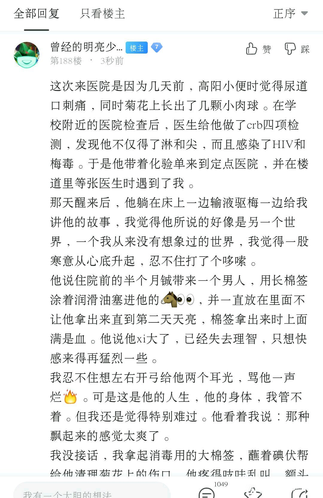
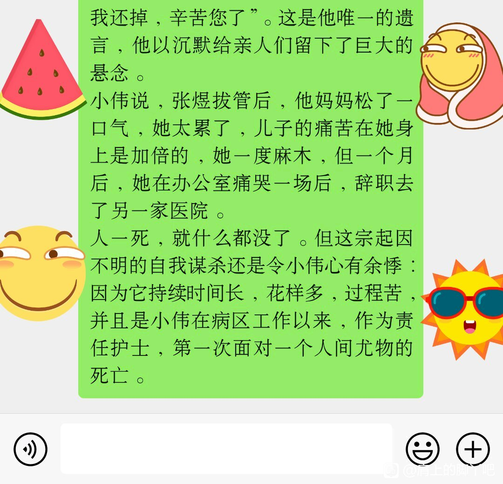
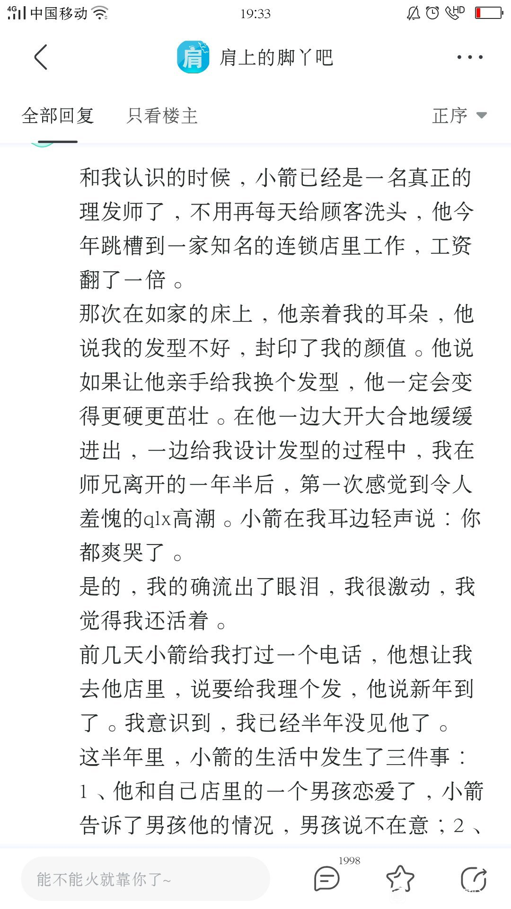

【见闻录】他们那个的世界爱与痛

            1楼 | 曾经的明亮少年 | 2020-12-16 02:41

锅先放着，等我淘米。如果不停电，就慢慢煮。

            2楼 | 曾经的明亮少年 | 2020-12-16 02:42

一、17岁的小夏说你看他好开心  
第一次注意到小夏是在一个下午。那是2017年的秋天，那一天是我的生日。我订了一个小蛋糕，坐在临窗的楼道里晒着太阳等外卖员送到。我看着窗外的风穿过樟树，将很多的叶子吹落。  
小夏从病房出来，扶着栏杆扭腰运动。蛋糕送来的时候，外卖员说了声祝你生日快乐。小夏侧过头朝我这边看了看，说：哥哥，你生日啊？我前天刚过17岁的生日，都没蛋糕吃。  
后来，我们一起吃蛋糕，他说好想念妈妈，妈妈在时，每年的生日他都能吃到好东西，还会有生日礼物。  
我说：你妈妈呢？没有陪你来住院吗？他低下头用叉子挑起蛋糕上的樱桃，小声说：妈妈在我15岁那年去世了，也是在这个医院，和我一样的病。  
我愣了一下说那你爸爸呢？他说：爸爸也一样。  
我们朝窗外看去，刚才给我们送蛋糕的外卖员在楼下飞快地奔向他的电瓶车，飞驰电掣地消失在我们视线中。小夏说：你看他好开心啊。

            3楼 | 曾经的明亮少年 | 2020-12-16 03:00

小夏出生于南方的一个水乡。他妈妈来自西南边陲某省一个偏远的山村。在外出打工时和来自北方的小夏爸爸相识。一年后，小夏出生，三年后，小夏弟弟出生。  
小夏弟弟5岁时因多日发烧不退住院治疗，在入院crb四项检测中，查出HIV阳性。随后医院对小夏和他爸妈也进行了检测，结果是全家阳性。  
一个月后，小夏弟弟因肺部感染治疗无效去世。小夏也开始服用HIV抗病毒药至今。  
2015年，小夏的妈妈因肝癌，在我们当时所在的这所医院去世。当时，小夏15岁。  
此后，小夏爸爸和小夏两个人相依为命，在水乡他们用多年积蓄买下了一套不大的房子。他爸爸做木工养家，小夏在一所普通高中读高二。

            4楼 | 曾经的明亮少年 | 2020-12-16 13:42

我记得那天我和小夏坐在病房的楼道中聊了很久。深秋的夕阳透过落地窗的玻璃，将扶手和栏杆在地面上投射出奇形怪状的影子。  
小夏一边吃着蛋糕，一边将他的过去娓娓道来，他用平静而温柔的声音，有着与年龄不相称的早熟和淡然。除了常年吃药显得肤色稍微暗淡一点，他可以称得上是个非常好看的少年。  
小夏说他在很长的时间内不知道自己是什么病，只知道爸妈每天会定时督促他吃药，这成了他生活中最根深蒂固的习惯。对于吃药，小夏说“就像吃饭喝水一样平常”。17岁的他安慰刚刚确诊的我说，哥哥别怕，真的不影响寿命，按时吃药，我们可以活很久。  
高一那年的12月1日，学校组织开展预防HIV主题讲座，小夏知道了HIV传播的三种途径。他笑着和我说哥哥我不是⭐途径传染的。  
小夏说，班里有个叫江洋的男生和他关系很好，他们每天上学放学结伴而行，但他不知道自己的病。

            10楼 | 曾经的明亮少年 | 2020-12-16 22:46

小夏那次住院是因为扁桃体发炎一直不见好转，医生在做了一个全面的体检后没有发现大的问题，就让他住院输液消炎。从弟弟去世的那一年开始，这十多年间他是这个医院的常客，医生护士都很喜欢他。  
小夏问我我是怎么生病的，我和他讲了我和师兄之间的事，小夏听得很认真，他说他也很喜欢江洋，但他停顿了几秒钟，随即又笑着说“我不配”。这句话刺痛了我的心，我不知道过去的这些年，带着一个不可告人的秘密，他是怎么活过来的。但我知道，在我的余生里，我也要带着这样的秘密活下去。  
天色渐渐暗下去了，晚饭的时间到了，楼道里热闹了起来，住在我隔壁病房的老张拿出了他的二锅头和花生米，又开始了他喝着喝着就开始胡言乱语的日常。  
小夏说：“我病房里现在只有我一个人，要不告诉护士一声，把我们两个人调到一间好了，我想和哥哥多聊天”。  
小伟护士很爽快得答应了，给我们换好了铺位和床头卡。  
那天晚上，我躺在床上想着自己的以后，慢慢地进入了恍惚。后来我依稀听到有人给小夏打电话，他们聊了很久，最后小夏说：我会照顾好自己的，你放心。

            12楼 | 曾经的明亮少年 | 2020-12-16 23:17

第二天早上，我醒得很晚，医生来查房时，我迷迷糊糊听他给小夏说“多开导开导你旁边的哥哥，他一时还没适应”。小夏说“好呀，我们昨天聊了很久呢”。  
我睁开眼睛看到了窗外穿过云层的晴朗，我有些害怕。师兄刚刚去世一个月，看到阳光我想起了我第一次见到他时，那个傍晚的太阳。我害怕想起以前的日子。  
我问小夏：“昨晚是你同学江洋给你打电话吗？你们聊了挺久的。”  
小夏抬头看着我，轻生笑着说：“不是的，是另外一个病友。”  
那个被称为胡哥的病友，是小夏妈妈2015年住院期间认识的。当时他和小夏妈妈一个病房，看着她离开。后来他加了小夏的微信，时不时会电话联系。  
胡哥是一家小公司的老板，经济条件不错，这两年一直是他在给小夏生活费，也会隔一段时间去水乡中学看他。  
小夏说：“是他让我第一次知道txl这个词，我知道他对我有那种想法，但我需要他的帮助，我爸爸太辛苦了。”  
他坐在靠窗的椅子上吃早餐，阳光照着他长长的睫毛，他突然带点戏谑的口吻说：“我是不是挺不要脸的。”  
我不知道该怎么接话。我知道他们之间可能早已达成了一种类似于by的默契。但我没有权利去评判一个未成年的孩子，他需要面对孤独时的勇气，也需要钱。甚至我觉得，他比我坚强，在其他小孩还在父母的怀抱里做梦时，他已经在和这个对他不友好的世界握手言和。  
我说：“我觉得你的胡哥一个好人。”  
他想了想说：“嗯，他是个好人，但我还是更喜欢江洋，他长得比胡哥好看。”  
原来，颜值真的比钱更正义。

            14楼 | 曾经的明亮少年 | 2020-12-17 01:45

之前煮的师兄的饭，也会在这次穿插进去。昨晚睡不着，有和小夏微信聊天。告诉他我要写他的故事，他说好啊，写好了给他看。他在胡哥所在的城市读一个三本。

            15楼 | 曾经的明亮少年 | 2020-12-17 02:11

傍晚的时候，胡哥来了，手上拎着两个大袋子，里面装了水果和一些新买的衣服。胡哥长得很高，皮肤白净，身材适中，有一种儒商的气质。他进门看到我，打了声招呼，然后就一把把小夏抱在怀里，揉着他的头发问你身体还难受么？  
小夏轻轻挣脱开，红着脸看看我，然后对胡哥说：别人看着呢！  
胡哥坐下来，拆开衣服让小夏试是否合身。小夏穿好衣服转了个圈说很合适。胡哥笑了，说年轻人果然穿什么都好看。  
小夏真的很好看，穿着运动裤和套头线衫的他，有种朝气又内敛的少年气。他这个年纪的男孩子应该是在篮球场上挥汗如雨，一个转身投篮能吸引无数目光。但小夏说他从小不参加激烈的运动，他怕自己受伤去医院不方便。  
他描述的情形像极了一个带着镣铐跳舞的人，与生俱来的束缚捆绑了跃跃欲试的灵魂。我知道，在这个世界上，还有很多和我们一样的人，但与小夏相比我们要幸运得多。因为我们终究拥有过自由的时光。  
胡哥晚上在医院陪宿，八点时他订了很多肯德基外卖，我们三个叫来值夜班的小伟护士一起吃。小伟讲了很多医院里的段子，她把我们逗得像三只傻子。笑声惊动了隔壁的老张，他探头探脑地过来问：啥事这么开心？  
后来，小夏说想去卫生间冲个澡。胡哥也一起进去给他搓澡。  
过了很久，他们出来了，小夏捂着下面快步跑上床，让胡哥去护士台给他拿一套干净的病号服。胡哥出去的时候，小夏笑呵呵问我：哥，你会经常dfj么？会不会对身体不好？  
我说会啊，这对男的来讲是很正常的一件事。 小夏说：刚才在卫生间洗澡时，胡哥给他dfj了，他说很舒服。  
胡哥拿着病号服进来了，问小夏说什么坏话呢。小夏哈哈一笑：说你对我好呢。

            16楼 | 曾经的明亮少年 | 2020-12-17 03:26

第二天胡哥离开后，小夏一个人在床边呆坐了很久。我问他在想什么？他说他在想胡哥万一哪一天找了其他男生了，那该怎么办。他说他爸爸赚钱很辛苦，没有能力让自己再去读大学。  
我安慰他说：你这么可爱，他不会不要你的。  
小夏红着脸说：昨天晚上他想要和我做，我没让他进去，我没有和别人做过，我怕。  
说实话，我也不知道该怎么回答他。我不清楚胡哥对他，到底是一种什么样的心态与目的。也许有日久生情的因素在，也许只是一时兴起时的工具。但他们之间，的确有物质关系的纽带，维系着两年这样一个不深不浅的“缘分”。  
与胡哥相比，他的朋友江洋应该会简单很多，纯粹的好感，纯粹的年纪，纯粹的友情。只是，江洋不知道，小夏的人生，从出生时就注定了不会纯粹。他需要一个人，去帮助他用力活下去。这种形而下的当务之急超越了常人社会的道德评判。一个17岁的孩子，他能付出的大概也只有身体。  
而且胡哥并没有一丝强迫。他看小夏的眼神中，有温暖的亲情在，也有暧昧的欲望在。  
那天，医生告诉我我的检查结果出来了，各项指标显示可以开始进行抗病毒治疗。我到楼下的门诊领取了半个月的药物。医生建议我住半个月，在治疗眼睛的同时，度过药物的导入期，以免出现严重的副作用。  
第一天吃药后，我在眩晕中入睡，做了很多色彩斑斓的梦，像《盗梦空间》中描述的那样，一层梦境套着一层梦境，层层叠叠间师兄的脸一直在半睡半醒间闪回。那是他离开人世的一个月中，第一次进入了我的梦。

            18楼 | 曾经的明亮少年 | 2020-12-17 04:02

三天后的上午，我去眼科做完会诊。回到病房时刚好看到小夏在骂老张变态。老张看到我进来讪讪地走了。我问小夏发生什么了。小夏说刚才他上厕所撒尿时，老张突然进来盯着他下面看，还动手上来摸。  
我说，老张上午大概又喝酒了。其实老张也是个可怜人。  
小夏说江洋给他打电话来说一定要来住院的城市看他，住院的医院是这种病的定点医院，省内的人都知道。他怕江伟知道了他的病，就再也不会理他也不会陪他上学放学一起走了。所以他打算后天周五就出院。  
中午护士来查房时，小夏和护士说了他要出院的想法。护士说上午医生开例会时说小夏刚做的肺部CT有阴影，怀疑可能是肺炎，需要再做进一步检查确定情况。如果严重还要做治疗方案调整。他的身体情况目前不能出院。  
小夏只能给江洋发信息说让他不要过来看望。  
我在卫生间突然听到小夏啊得叫了一声，出去看时小夏把手机给我。是他和江洋的微信聊天界面，江洋说：“我去年去你家时无意中看到你桌子上忘记收起来的药瓶，后来我去上网查了一下，知道是治什么病的，但我一直没和你说我知道，我怕失去你这个朋友。我只想你平安。让我去看看你号码？”  
周六时，江洋来到了医院。一进病房他就给了小夏一个大大的拥抱。我看到小夏在他的胸前哭了。江洋一边说别哭别哭，一边手忙脚乱地给他抹眼泪。  
江洋长得好高，一米七五左右的小夏在他身边显得小鸟依人。他问江洋说我这个病你不怕啊？  
江洋说：高一讲座时不是说了日常途径不传染吗？我又没和你上床，怕什么？  
小夏笑了。说今晚你和我睡一张床敢不敢？江洋大笑着说不怕不怕，就睡一张床。

            19楼 | 曾经的明亮少年 | 2020-12-17 05:41

周日下午，江洋要赶回读书的水乡中学。小夏送他下楼。我现在楼道的玻璃窗前看到他们站在住院部的大门口说着什么，后来江洋抱住了小夏，过了一会儿江洋离开了。小夏回到病房后告诉我，江洋说永远是他最好的朋友。  
病房里的日子有些无聊，在无聊中，我会想起过去。我感觉那些曾经的美好正在从我的生活中慢慢抽离，并且告诉我它们永远不会再回来。  
但小夏过得很开心。他拿着江洋带给他的课本坐在楼道的窗户前认真地学习。他的样子让我想起我读高中时的光景。我想，我读了很多书，但依然没有过好这一生。  
周一时胡哥又来了，带给小夏一部新的苹果手机，小夏特别开心，换上手机卡玩得不亦乐乎。他给胡哥说江洋来看他了，并且知道了他的病。  
胡哥笑了笑说：这样也好，以后你在学校，就多了个说心里话的人。

            24楼 | 曾经的明亮少年 | 2020-12-17 13:03

胡哥和小夏去卫生间待了一会，出来吃了些水果，下楼给小夏交了一笔住院费后就离开了。  
小夏笑眯眯地告诉我：胡哥发泄玩shou欲，切换成贤者模式了。  
不知怎么，我觉得他们的相处模式很妥帖，就是那种说不上来好坏但很舒服的方式，各取所需但又不薄情寡义。抛开带病出生这一点不提，小夏还是幸福的，他的幸福在于他在现实意义上找到了最适合自己当下的存活之路。尽管这条路在别人眼里也许多少有些不堪。

            25楼 | 曾经的明亮少年 | 2020-12-17 13:22

三天后，因为工作上的原因，我提前办理了出院手续。小夏送我离开，他告诉我一切都会过去。他宁静的脸庞写满了年少的温柔，像秋天里风平浪静的湖面，清澈而明亮。他说，我的任务是找回自信回归生活，他的任务是努力学习考上大学。  
三年过去了，我再也没有见过小夏一面，但我和他时常在微信里相互问候。  
2018年9月，小夏考上了胡哥所在城市的一所三本大学。按照胡哥的建议他学了财务专业。胡哥说，毕业后让小夏到他公司管账，他要养小夏一辈子。  
2019年元旦，小夏说江洋交了女朋友，他介绍小夏给女朋友时说，这是我最好最好最好的朋友，以后要做我们孩子的干爹。小夏说他很开心，但也有一丝难受。我知道，如果没有病，他想要的理想伴侣，一定不是胡哥。  
2020年的夏天，小夏和胡哥在三亚的沙滩上给我发来合照。碧海云天，晴空如洗，胡哥背着小夏站在浪花里，笑得像个慈父。  
我知道，小夏已经完成了他的任务，而我至今，还没能找回自己。我沉溺在对往事的回忆中，像一只冬眠的乌龟，惧怕醒来，也惧怕醒不来。

            28楼 | 曾经的明亮少年 | 2020-12-18 02:09

（二）袁超和任凡说：我们都是好孩子  
第一次住院期间，胡哥来看小夏，他晚上陪宿时点了很多肯德基，我们叫来值夜班的小伟护士一起吃。小伟给我们讲了很多病房里的段子，她绘声绘色的讲述逗得我们三个放声大笑。  
其中有一个段子就是关于袁超的。小伟值夜班期间半夜12：00查房，发现袁超不在病床上，也不在卫生间，楼道里找了一圈也没发现人影。赶快叫来一起值班的护士帮忙找，最后在另一个病人的病床上找到了袁超。  
袁超和那个病人搂在一起，盖着被子看不出有没有穿病号服，但床头柜上放着一个撕开了的byt包装，可以想象得出，两人正不知天地为何物。  
看到小伟护士发现了他们，袁超吃吃地笑了，说：我冷，想找个人一起睡觉暖和。小伟没有拆穿他，只让他赶快回自己病房。  
这是我第一次听到袁超的名字。我想这是一个什么样的男孩子，能做出此等豪爽之事。小伟说：挺好看的男孩子，而且不“挑食”。  
2019年五一，我趁着假期来医院领药，顺便住院三天做全面检查。小伟那天值班，她说：刚好有个病人做了手术没人陪护，安排你和他一个病房照应一下。就是我和你说过的袁超啊！  
于是，我看到了传说中的他。他的手指被突然破碎的钢化玻璃划伤，需要做一个手术。我被安排进他病房时，他已经做好了手术，一只手平放在床边，一只手拿着手机在看电影。  
看到我进来，他放下手机，朝我笑了一下算是打了招呼。我终于明白小伟说的“一个好看的男孩子”。他是标准的直女眼中的帅哥，浓眉大眼高鼻梁，确实好看。我说你需要帮忙就叫我，小伟让我照顾你。  
他看着我狡黠地笑了笑，露出一颗小虎牙，他指了指绑着纱布的右手说：“我要尿尿”。我说之前你尿尿时怎么办？他说：小伟帮我解开裤子拿出来。  
我懵了。

            42楼 | 曾经的明亮少年 | 2020-12-19 04:58

我和袁超一起走进卫生间，站在马桶前，我有点尴尬，刚进病房还没坐下，就要给一个素不相识的男孩子把尿，这让我有些手足无措。  
他看我没动静，看了我一眼，说快点啊哥，要憋不住了。我给他解开病号服裤子的绳子，正打算拉下NK从里面拿出他的兄弟，没想到宽松的病号服裤子一下子从他身上掉了下去，露出两条光溜溜的大长腿。  
我们一起哈哈大笑。笑声化解了尴尬，我用拇指和食指的指尖捏住他的兄弟拿出来说：快点。  
听到马桶里哗啦啦的声音停止了，我转过身正准备帮他放回去，他看着我说了一句：我的大不大？  
我终于相信小伟所说的关于他的故事绝非虚构，这孩子真是个神人。我定睛看了一眼，果然是黑里透红粗粗壮壮，正面一根隐隐约约的青筋。  
我笑着说挺好看的，可惜我们都生病了没太多机会用了，随后帮他系好裤子，送他回到病床。  
经过这一出插曲，我们一下子熟络了很多，他拿出柜子里的各种零食给我吃。我靠着病床的床头，听他在放的一首音乐，是王筝的《我们都是好孩子》。到音乐的高潮部分，他跟着唱起来：  
我们都是好孩子  
最最天真的孩子  
相信爱可以永久啊  
然后他说：我弟弟也很喜欢这首歌，我们曾经一边听一边亲👄。  
我再一次懵了。不到半个小时，这个我刚认识的男孩子，让我受到了不小的惊吓。

            44楼 | 曾经的明亮少年 | 2020-12-19 06:13

第二天，我见到了袁超的弟弟。我曾一度怀疑我的眼睛，因为他长得太出众了，他走进病房的那一刻，我感觉好像房间里多开了一盏灯。但他和哥哥一点也不像。他是那种咄咄逼人的帅气，诱人但不够亲和。他和我点头示意，说谢谢你照顾我哥哥，随即把背包放在袁超床头，坐在凳子上歪着头看着哥哥。  
袁超呵呵笑着说：“看我干嘛？来这么晚，害得我撒尿都要被人看那里。”  
他弟弟还是歪着脑袋，打趣地说：“你还怕被人看啊？上次住院你不都跑到别人床上了嘛！护士早告诉我了。”  
说着他手伸进被子，在袁超下腹处摸索。似乎是使劲捏了一下，只听袁超一声“我靠”，伸出好的那只手，一拳打向弟弟的胸膛。随即他们笑得抱成一团。  
我有些尴尬，也有些迷惑，就走出病房在护士站的活动区域转圈散步。刚好小伟给另外的病人换完盐水回来。我给她说袁超的弟弟来了，用不着我照顾了。  
小伟听了朝我诡秘一笑说：晚上把耳朵塞住装作什么也听不见。  
回到病房，袁超弟弟站起来说：我叫任凡。  
我说你们是兄弟，怎么不是同一个姓啊？  
袁超说：我们异父异母。  
原来，袁超的爸爸和任凡的妈妈在离婚后，带着各自和前任生的孩子，组成了新的四口之家。他俩只差四个月，从十三岁时就在一起生活。  
晚上八点的时候，两个男孩子一起打开药盒，熟练地吃下三颗💊。袁超看我迷惑的表情，解释说：任凡也和我们一样，我们一起确诊的，爸妈都还不知道。

            48楼 | 曾经的明亮少年 | 2020-12-19 12:56

晚上八点护士查房过后，我们早早睡下了。任凡合衣躺在我和袁超床位之间租来的躺椅上，入神地看着头顶吊着的输液挂杆，他侧面的轮廓像一副满分的素描，光与影交错中的五官起伏恰到好处。我却想起了师兄的脸，想起来和他在一起的日子里，他被我激怒时强忍着不动手揍我的样子。不得不承认，我曾经是一个很作的人。  
师兄很怕他爸妈知道自己的取向，这是他最大的弱点，所以这成为每次吵架时我攻击他的靶标，一击致命。有次我们进行到中途，他从我体内拔出来想让我给他口，我不愿意我说你去洗一下。他正在兴头上，就气呼呼地说：你都被我干过多少次了，还装什么清纯？  
我一听不乐意了，就冷笑着对他说：你爸妈知道你刚刚在捅男人菊花吗？  
然后我们就光着身子打了起来，宿舍瞬间化为战后废墟。  
想到这里，我有些想哭。我还想这个和我打架的人，想他再回到我身边。和袁超与任凡一样，每天一起看着对方吃下三颗药丸，相依为命，开心时抱成一团，愤怒时打成一片。人的一生能有多大需求，一个相爱相杀的ta也就够了。  
任凡突然头转向袁超说：哥，你说爸妈知道了我们的事，会不会被气死？  
袁超迟疑了几秒钟后说：为什么要让他们知道啊？他们又不会治病。  
任凡叹了口气说：可是我好害怕。  
袁超侧过身握住他的手说：别怕，我们在一起。  
那天晚上，在两人你一言我一语的交叉叙述中，我明白了他们之间的来龙去脉。

            50楼 | 曾经的明亮少年 | 2020-12-19 23:49

他们的故事时间轴如下：  
2005年，袁超的爸爸和妈妈离婚，11岁的袁超抚养权归爸爸；  
2006年，任凡的妈妈和爸爸离婚，12岁的任凡抚养权归妈妈；  
2007年，袁超爸爸和任凡妈妈结婚，13岁的袁超和任凡生活在一起，成为异父异母的兄弟。他们在新家里住同一间卧室。  
2008年，袁超的母亲和任凡的父亲各自又组成了新家庭。  
2009年，两个人共同的小弟弟出生。袁超和任凡说，那一年，他们感觉自己被所有人抛弃了。  
2010年，两人16岁，有一天白天，爸妈不在家，他们第一次一起看钙片。那部片的片尾曲是《我们都是好孩子》，王筝唱的。  
2011年，这一年发生了很多第一次，第一次接吻，第一次互相飞机，第一次互咬，第一次袁超给任凡说，我们以后永远在一起生活。  
2012年，袁超和任凡进入同一个高中。  
2013年，在跟着小视频学习的过程中，他们第一次进入对方。  
2015年，blued让袁超发现了周围的大同世界。有一天，袁超要和一个距离2公里的人见面。他告诉了任凡，任凡说：带上我啊！同年，两人进入同城的两所不同的大学读书。  
2016年，袁超急性肠胃炎，住院挂点滴，入院四项检查HIV初筛阳性。同时，任凡也被确诊。同年，他们开始服用抗病毒药，至今。  
2017年，袁超和任凡加入了同城一家志愿者协会，在那里他们结交了很多朋友，有时候他们会遇到中意的人，三个人一起嗨皮。  
2018年的五一，我在医院遇到了他们，大开眼界。  
我想，你们这，是好孩子？

            52楼 | 曾经的明亮少年 | 2020-12-20 00:33

那天晚上，在他们如同唠家常般的平静讲述中，我慢慢进入了梦乡。梦里什么都没有，只有两个孩子在雪地里玩，他们堆了一个比房子还高的雪人，并在雪人旁边唱歌。那是一首我没听过的歌，听到歌声，太阳出来了，雪人化了，一地的水中，两个孩子抱头痛哭。  
后来我醒了，我听到有人在哭，我打开床头的壁灯，任凡坐在袁超病床边，一脸的泪。  
我清楚地记得，那是凌晨4点。  
任凡说，他已经忘记了2015年，他和哥哥有过多少次一起去约人玩，他说那一年很快乐，他们并肩作战，亦兄亦友，高潮迭起，活色生香。他们熟悉彼此的身体，如同熟悉那些一起走过的日子。他们在共同进入另一个人的身体时，感觉到一种亲密无间的亲情、友情与爱情，并在彼此的眼神中看到了埋藏于童年的深沉寂寞。很多时候，他们会在另一个人的身体里一起迸发，这让他们感觉到两个人成为一体，永不分离。  
袁超说他们都很羡慕小弟弟，因为他的爸爸和妈妈在一起，他像一个真正的孩子。而他和任凡，被放逐于任何亲情之外。  
但我想，这不是他们放任自己的理由。至少，不是伤害自己的理由。在2017年时，23岁的他们，还没有意识到，这个病毒，对他们的人生，意味着什么？  
但三年过去了，他们仍然在努力活着，他们朋友圈中的合影依然可以让任何北背景黯然失色。  
他们在自己原来的妈妈和爸爸的资助下，一起开办了一个少儿培训机构，生意红红火火。他们仍然一起去找人玩，但仅限于感染者的圈子。  
他们与现在的家庭脱离了关系，但与当初失去抚养权的父母每周相见。在四个人聚在一起外出吃饭时，看到的人们会以为他们是一家人。  
他们只是弄丢了曾经心爱的玩具。  
前天，我给袁超发信息时，他说刚刚给任凡打完飞机，我说我要写写你们的故事。他发了一个👌的手势，并说：记得写得浪荡一点。  
他们都是好孩子。

            58楼 | 曾经的明亮少年 | 2020-12-20 13:36

@Cedicლ

            65楼 | 曾经的明亮少年 | 2020-12-21 00:07

其实我和师兄的故事也简单，时至今日已经不再痛苦，而更多麻木。2005年从北方一所大学本科毕业，来到南方一所大学读研。读研期间认识了同专业的高一级师兄。后来我们调换到一个两人间宿舍，在一起生活了两年。2007年师兄考上了上海一所大学博士，我仍然留在学校读研三。  
师兄在上海读博期间和同专业一个女生交往，也在第一时间告知了我，我为他开心。在2007年的中国，走进主流婚姻成家生子，仍然是男同的普遍归宿。那是一个经由张国荣的纵身一跃，同志群体才被公开讨论的年代。走进主流婚姻不但不被认为是骗婚，反而在一定程度上等同于浪子回头。所以，我内心其实为他高兴。他是军人家庭，父母都是军医，家庭背景决定了他的人生选择。  
2008年，我研究生毕业留校。  
2009年，我和研三期间认识的同学院师妹登记结婚。是她主动和我交往，我在她短信表白的第一时间告知了她我的性取向。她很意外，但第二天还是告诉我她想试一试两个人交往。我没有拒绝。  
2010年，师兄从上海博士毕业，回到我们曾经读研的城市，进入另一所高校工作。他和读博期间交往的女同学和平分手，原因是两个人彼此没有感觉。  
2010年12月，师兄给我打电话，希望我们可以重新在一起，我没有答应，我觉得我们已经没有回头路可走，因为我已经有了事实上的婚姻。而且我和爱人在一起，生活大体是幸福的。夫妻生活也保持在一个基本和谐的状态。我已经习惯了这样的生活，我是个知足常乐的人。  
2013年1月，我的孩子出生。  
2013年2月，师兄和我发生了激烈的争执，并将读研期间我们在一起时拍的私人照片发给我妻子。  
2013年6月，我和妻子协议离婚。孩子归我，房子归前妻。我带着孩子在外租房过度。  
2014年1月，我和师兄搬到一起生活。孩子也和我们一起生活。

            69楼 | 曾经的明亮少年 | 2020-12-21 00:40

和师兄在一起的日子，是开心的，这种开心与和前妻在一起的感觉不一样。前者是相濡以沫，后者是相敬如宾。前者激烈，后者柔和。  
2014年5月，师兄一次性给了我32万，让我作为首付买了一套不大不小的房子，他拒绝房子加他的名字，说是作为破坏我家庭的补偿。  
2014年8月，暑假期间我们一起回了徐州他老家，和他父母在一起生活了半个月。我们没有明确和他父母说明关系，但他告诉父母他不打算结婚，他父母看了看我，没有说话。离开他家前，他妈妈和他说，无论要不要结婚，无论和谁在一起，都要一心一意，不要今天张三明天李四后天王五。他爸爸补充了一句:至少不要同一天和张三李四王五在一起。

            72楼 | 曾经的明亮少年 | 2020-12-21 01:27

2014年9月，我去另一所高校脱产读博。  
2014年11月的一个周末，我返回工作的城市看师兄，进了家门看到他和两个男生一起躺在床上。衣服当然是没穿的。我不是故意这样不打招呼就回家突袭，因为刚好读博的学校有一个学术会议是在我工作的城市开的，我跟着导师一起过来，事先并没想到中途有时间可以回家看他。  
然后，我和其中的一个长得不那么好看的0打了起来，我和他一起把那个0给打哭了。最后我们一起去了派出所做笔录。  
之后，我们仍然在一起，像什么也没发生过一样。我其实并不是一个占有欲很强的人，我对他的要求只有一个:无论白天在干什么，晚上记得回家。  
2015年7月，师兄从他工作的高校辞职，回了徐州，他没有告知我辞职原因，也没有告知我是否有下一个备选的工作单位。他是独子，他说父母希望他回家。其实我们在一起同居后，之间的性生活并不多，我们的相处更像是一对兄弟。我们之间并没有保护措施，他喜欢毫无保留地在我身体深处留下他的痕迹，并告诉我说这是他的地盘。  
2016年2月，春节期间我给师兄发了一条信息，我说我很想他。他回了一条信息，说他也一样。他问我有没有再找朋友，我说没有，我说朋友不是必需品，再说我已经有过他了。在我的人生观里，很多事情，有过就可以了。别人有的，我不求比别人多，只要也有过就行。他说:嗯。  
2016年4月，前妻说，要不我们复合吧，为了孩子。我说孩子挺好的，我们已经错过一次，不要一错再错。其实，我心里想过复合，孩子会想妈妈，她也会想孩子。我有时候，也会想起她。  
但我们最终没有在一起，我们之间隔着那些照片，隔着师兄，隔着在2015年之后已经被公众频繁讨论的同妻与骗婚的话题。我们都在体制内生活，我们不想将这些乌七八糟的私生活演变成他人鸡零狗碎的谈资。  
2016年6月，师兄打来电话，这是我们分开后，他第一次打电话给我，我有点意外，但我开心，我听到他的声音在电话那边说：你好吗？  
我想起第一次见到师兄时的那个下午，他在迎新点等着最后一个来报到的我，他说他饿死了，为了等我报到，他都错过食堂饭点了。我只记得那天他背光而站，傍晚的太阳把他的轮廓勾勒出若隐若现的光圈。  
我在电话里给他说我挺好，还是一个人。他说你身体好吗，我说挺好的，他说：嗯，那就好。

            74楼 | 曾经的明亮少年 | 2020-12-21 01:36

2017年4月，我结束博士学业，回到学校全职工作。  
2017年5月，我的银行卡收到一笔21万的汇款，汇款人是师兄。我打电话给他他没接。  
2017年6月，师兄的爸爸打来电话，问我有空吗，我说叔叔你说我听着，他爸爸说你能不能来徐州一下，珩儿想见你。我说好的，我也很久没见他了，我也想他。  
我处理完手头的工作，和别的老师调换好课，第三天到了徐州。是在医院见到的他，卡肺。  
他带着呼吸面罩，正在睡觉，安静地像个孩子。我说师兄我来了，他睁开眼睛，眼泪一下流了下来。  
我说你为什么要给我打钱？你不是给过我钱买房吗？你为什么躺在医院里？你怎么了？医生怎么说？你很快就会好吧？他只是流眼泪，也不说话，看着我。  
我说好了不说了，你安静休息一会。  
他爸爸说他辞职回家后就一直没有工作，成天待在房间里，也不给家人说发生了什么。直到这次肺部感染才被爸妈拉到医院检查，在医院门口他突然哭着和爸爸说：爸，我感染了HIV，他爸说什么？他说HIV。他爸懵了。  
然后就直接去了传染病医院，住院第二天，他给他爸爸说想见我。  
所以，我来到了他的城市，看到了好久不见的他，他瘦了太多，但依旧很好看，棱角分明的脸，明亮的眼睛，还有那双以前我们在一起时，每天晚上睡觉，我都握着的好看的手。

            77楼 | 曾经的明亮少年 | 2020-12-21 02:04

一周后，我回到了工作的城市，在徐州的医院，我也做了抗体检测，阳性。我很伤心，但我不想让他看到我的伤心。我知道他觉得对不起我，所以他才给我汇款。  
但我觉得这不是我们关系的全部。我们在接近十年的时光中，一起经历了如编年体般简洁又如叙事诗般深情的过往。  
在我们所认为的深情中，有很多为此付出代价的人，包括他的前女友，我的前妻，我们的父母，我的孩子。他们在我们的感情中，与我们一起沉沦。  
但我还是很难过，他的病情很重，他确诊后不敢告诉我，选择了离开我们工作的城市，他没有吃抗病毒药，他在住院时，cd4细胞只有4个，一个很不吉利的数字。  
2017年7月5日，他去世了。  
我并没有哭很久。但我的确哭了。我很难过，我知道死对他是一种解脱，他很聪明，也很努力，他从一所并不好的民办本科开始，考研，考博，再进入一所重点大学工作，他没有依靠父母的帮助，没有得过且过，没有画地为牢，他是个明亮的人，他最好的时光和我一起走过，我们一起伤害了很多人，我们也伤害过彼此，我们带着拜对方所赐的累累伤痕曾经相互责怪并相依为命。  
他是和很多人睡过，但他的夜晚从来只属于我一个人。他在自然属性与社会属性间摇摆不定但最终选择了和很多人谈性但只和我一个人说过爱。他解脱了，在一个刚过而立的年纪。  
2017年7月8日，我去徐州送他最后一程。我说师兄不怕，我们总会有这么一天，一个人先走，另一个人带着回忆生活。只是先走的那个人，我没想到是你。  
我想起和他相互出柜的那一天，我在电脑上看杨凡导演的《美少年之恋》，他突然跑进我宿舍叫我吃饭，看着屏幕上的电影，他说我靠，你是gay啊？我愣住了，我说你怎么知道的？他说不是gay谁看这个电影。  
后来我们就调换到了一个两人间研究生宿舍，上床下桌。从各自睡自己的床到两个人挤在一张床再到他嫌床小我们一起打地铺睡地上。  
我还记得他身上的气味，记得他很多天早上醒来后朝我耳朵吹气，记得他有次打完羽毛球回来，来不及洗澡就拉下短裤按着我的头让我给他口，记得有一次同专业一个女生问你们俩成天在一起是不是搞基，我们异口同声说管你屁事。  
我记得很多已经在分手后的时光中慢慢忘记的事。想起这些时，我很伤心。

            78楼 | 曾经的明亮少年 | 2020-12-21 02:15

补上77楼，帖子顺序有些乱？是不是因为审核的原因，先后次序被打乱了？

            81楼 | 曾经的明亮少年 | 2020-12-21 02:36

我说师兄不要怕，我们不是曾经一起在风中狂奔在雨中散步，一起在阳光下争辩江面上飞的到底是水鸟还是白鹭，那时候我每天回到宿舍都要写论文，而你却像第一次我见到你时那般吵着肚子饿。我们终究会在另一个世界相见。  
2017年7月9日，我回到我工作的城市。回去之前，我将银行卡里的二十一万转给了他爸爸。我说我不能要这笔钱，师兄不欠我什么，这是他前些年努力工作赚的。  
他爸爸老了很多，他失去了唯一的孩子，他说珩很乖，从小都很乖。他说珩不喜欢女孩子一直都没交女朋友。我说叔叔他喜欢我，我们在一起很多年。他爸爸沉默了一会，说：我知道。  
2017年9月22日，我的眼睛突然视网膜脱落，我在定点医院住了半个月院，在住院期间办理了抗病毒药上药流程，也是在那里，我遇到的小夏。  
今天，我已经吃药三年多了。我还活着。  
我从来没有和人说过师兄，说过我和他的过往。有一段时间，我怪过他，怪他把我拉出了本已风平浪静的婚姻生活，怪他把我的人生和他捆绑在一起后又不声不响丢下我独自离开。  
他离开我回徐州后，我经历了一段靠着回忆度日的日子。我认为这样的状态很安全，我不想让任何人再走进我的情感世界。  
有时候，我会非常想念他，想念他身体的温度，想念他在我半睡半醒时说着白天发生的其实并不好笑的事，想念他在我身后一边冲刺一边问我爽不爽时的样子，想念他在冬季阳光下拿着杂粮饼朝我走来时那种明朗的忧伤。  
他是个忧伤的人，他给我的快乐很少，和他一起时的时间就像一场不停的淫雨，有些压抑但不令人生厌。  
其实时至今日，我几乎想不起我和他性生活的具体细节，我们之间好像从一开始就没有激烈的欲望。也或许，他本来想从我这里得到的，已经在其他很多男人身上得到了补偿。我之于他的意义，更多是精神层面，他觉得有一个人在等着他回家，他觉得这就是我们情感的几乎全部的意义。  
我认为他这样是对的。我和他属于同一类人，我们都很寡淡，但在这寡淡中，更多的是对于同性关系的清醒。  
有一次他问我，那次推开房门看到他和两个男的在床上，我第一反应是什么？我说我第一反应是我是不是进错家门了，因为我心里你是非欲望的，你从来没有和我如此热烈过。  
他说，因为我把你放在心里，我把你当亲人，我不想进入你的身体，那样我感觉离你的心会很远。我说：你啊……

            88楼 | 曾经的明亮少年 | 2020-12-21 04:28

在我二十多岁的那个时代，没有blued，没有贴吧，没有微信，两个男人之间的相互试探在不断的猜测与拉锯中开展，很婉转但却有火花绽放的绚烂。那时的txl，还没有到炮火连天的状态，那是个还没有rush的年代，那时的性生活有点痛，那时还不是遍地飘0，那时的油还很难买到，那时的马云刚刚赞助了上海国际电影节，那时的淘宝还没有家喻户晓，那时的师兄在床上只干我一个人。那时同性之间的爱和异性一样。不爱，不会随意做爱。  
后来，过了几年，世界突然变小了。blued出来后，师兄的身边全是gay，他找人方便多了，甚至一次找两个。  
但他最终迷失在他亲手种下的丛林，并在迷路的那一刻，把我拉上了他的后座。  
2018年7月10日，师兄的爸爸打来一个电话，他说那天是师兄的祭日，他说他不知道师兄读研之后的那些年，是怎么生活的。他说你们在一起时我儿子开心吗？他说我想我儿子了。  
我不知道该说什么，我听着他在电话那头压抑着的抽泣声，我理解他的悲伤，一如我理解我曾经为了这段感情付出的代价。  
我说叔叔你不要难过，他和我在一起的十年里，活得很快乐。  
他问我孩子多大了，我说幼儿园快毕业了，他问了我地址，给孩子寄过来一套衣服。  
我知道，他把我的儿子，当成了他儿子的儿子，他知道并不是，但他需要一个寄托。  
我想起有一次，孩子从他妈妈家过完周末回来给我说，妈妈问我珩叔叔好不好？我说你怎么回答的，孩子说，珩叔叔很好。  
前妻对于师兄，大概是一种非常复杂的感情吧。他们都觉得对方在感情中是第三者形式的存在，但我一直觉得，所有的错都在我。  
我不该走进婚姻，我不该走出婚姻，我不该让师兄离开。我不该一开始屈从于现实，最后却又想做回自己。  
在我们的开始，是我们的结束。  
我和师兄的爸爸说：叔叔，你和阿姨保重。  
我不想再接到他的电话，不是我厌烦，是我害怕。我不想在想起师兄时，再想起任何人。我想关于我和他的记忆里，只有我和他。  
但在2019年和2020年师兄的祭日，我仍然接到了他的电话。对于他，关于儿子的怀念，已经和我永久性地捆绑到了一起。和我联系，是他纪念自己孩子的一种方式。他需要在不停的重复中确认，他的孩子在生命的最后十年，是快乐的。他的孩子，在人世间，是有过爱情的，尽管他的爱情在世人眼里，多少算不得爱情。

            91楼 | 曾经的明亮少年 | 2020-12-21 05:15

我一直不太理解gay中的10角色。我从来没有在和师兄的关系中有过明晰的定位。我是男人，师兄也是男人，我们以一个男人的身份喜欢另一个男人。  
我对于同性之性的定义，一直缺乏一种狭义层面上的角色认知。我不知道我在思考欲望的时候，我在思考着什么？我不知道我是该进入还是该承受着进入，我在性的层面，模糊了主体和客体。曾经有一度，我认为我们之间不需要性。  
但我却有着形而下的欲望，有时候我会觉得风吹过我的脸庞，似乎是他在抚摸我，我把一切感官上的美好触动都具象为他的温暖。但我不知道我和他之间，该如何在身体层面索取与付出。  
我们的性基本上很淡，没有活色生香，没有欲擒故纵，没有情调，也没有余温。我想，这或许是师兄会去约别人的原因吧？我和他在身体层面的错位，导致了他在精神和肉体之间的观念裂变。  
那时的他应该很痛苦，他心里有我，但也有欲望，他选择了欲望，觉得愧对我，他在身体上忠于我，但欲望折磨着他。  
在撞见师兄和别人玩三人后，我曾经试着调整我们之间的错位。我说珩，你不用管我怎么想，在床上，我们是不必要平等的，你想怎么样刺激，我作为你的伴侣，是有义务配合的。你想怎么样干我都可以。  
他说做不到，他在满足自己的时候，会不停地想，这样是不是我会不开心。我说你开心我就开心，他说他在不明确我开心不开心的情况下，他是无法开心的。  
一个闭环。  
有时候在我们打完一架后，他会报复性地发泄，他会一边粗暴地进出，一边捏着我的下巴问我还敢不敢打他。那一刻我在他眼里看到一种具有韧性的欲望，我竟然有些感动，我想他心里是有我的。  
但更多的时候，我会听着他的呼吸入睡，他宁静的脸庞如这个城市的四季，含混而温柔，我时而恍惚，我们喜欢对方什么？  
但他却会突然醒来，问我，你怎么还不睡，你在想什么？  
我明白，我们在一起，真的很久了。

            92楼 | 曾经的明亮少年 | 2020-12-21 06:00

我其实是一个善良的人，这样的善良给了我一种介于明喻和暗喻之间的修辞型人格。我在任何一种情感中，都处于被试探和窥视的角色。我不喜欢让对方不自在，我宁愿委屈自己也想着周全他人。  
在和师兄的相处中也是这样，他在事件层面将我绑架进他的生活，而我在精神层面让他感觉到一种介于自责和自虐之间的空虚。他想填补这样的空虚，用欲望的形式，他想打破我的善良，让空虚变成一种可以触摸的实体。  
他也是个善良的人，他在人生的某个节点上，试图去弥合我们情感的裂隙。但他不知道，这样的裂隙源于欲望，但早已高于欲望。  
他很少哭，他是个明朗而忧伤的人。他的忧伤与我们所学的专业相关，我们在小说里见多了七情六欲，在面对伤害时有一种文学性的免疫力。  
但有一年的中秋，并没有喝过酒的他却哭了，他的头靠着我的肩膀哭得很伤心，他说他把一把钥匙弄丢了，他再也打不开抽屉了。  
至今我仍然不明白他弄丢的，是哪一个抽屉的钥匙。我们的房间，没有一个抽屉是上锁的。  
在徐州的医院陪伴师兄的一周里，我们没有说太多的话，我们避免回忆太多的往事，我给他擦身体，给他换病号服，我其实从来不会做这些，在我30多岁的生命中，我还没有面对过任何一种严格意义上的死亡。  
他终于乖乖地躺在那里，不能动，也不能从我身边跑开，他从来没有那样听话，我让他握拳就握拳，我让他张嘴就张嘴。  
他的身体仍然如一年前离开我时那样，精壮美好，只是他不再可以像以前那样抱着我沉沉地睡去。  
我给他擦下半身时，他有点害羞地笑了。他和他爸爸说，爸你去给我买几个苹果。  
他害怕他爸爸看到他的害羞，他说他爸爸在部队里生活，在他的概念中，不存在男人之间的爱情。  
其实我们都知道他爸爸知道，他爸爸也知道我们知道他知道，但成年人之间的体面，正在于明知而佯装不知。  
师兄说，一生好短啊。  
我用脸碰了碰他的手，说别怕。  
他说刚才给他擦身体，他想起很多年前有一次我们在宿舍一起洗澡时，把一块肥皂掉在地上，然后剪刀石头布决定谁弯腰去捡起来。  
他说他刚才下面有点反应，他想起我们第一次时的情形，我们都不知道男生之间该怎么做。  
我说那一年是2006年吧？好像是一个周日的下午，外面下着好大的雨，我们拉着宿舍窗帘，脱得精光像两条搁浅的鱼。  
我突然想起了相濡以沫这个词，两条相濡以沫的鱼。  
我看向他，他流了一脸的眼泪，脖子上都湿漉漉的，全是眼泪。我把手伸进被子摸了摸他的小动物，问他想要么？  
这时候，他爸爸回来了。手上拎着苹果。  
这是我们之间最后一次关于性的念想，我不知道那一天他心里在想着什么，但我是真的想，想让他的小动物在我掌心哭泣。

            93楼 | 曾经的明亮少年 | 2020-12-21 06:19

师兄做的最不可思议的一件事，就是他把我和他在一起时的照片发给了我前妻。在拍那些照片时的2007年，智能手机还没有普及。我们用卡片数码相机拍的，他说要记录我们最性感的时刻。却不知在几年后，他用智能手机将这些照片以一种石破天惊的方式，投向了我已经平静的婚姻生活。  
我一直不知道那一刻，他在想着什么。我们其实有很多方法，可以做我们自己，比如他重新爱上另一个人。  
我其实愿意在告知我前妻我的性取向的情况下，和她在一起好好生活。我们都做出了成年人自己的选择，并将一个小生命带到了人世。我们的身上不仅有感情和自我，还有为人父母的责任。我至今仍然在想，如果有如果，我们的人生都可以重新来过。师兄可以选择不辞职，我愿意和他一起面对余生，一起吃药，一起活着。  
他所做过的一切我都不会再责怪，因为在我的概念中，包容是爱一个人的一种方式。只是优秀如他，却终究没有磨炼出一颗包容自己的心。在他知道自己感染的那一刻，他心里该多难过，他是怎么独自撑过离开我的那些日子，他为什么不告诉我？他怕我责怪吗？  
但和我一起十一年的他，应该知道我是一个什么样的人，我更多时候都首先会反问自己，是不是我哪里做的不好？  
我们有一年去绍兴东湖玩，他很怕水，他死死抓住我的手腕，坐在乌篷船上全身紧绷像个无辜的孩子。我说我也怕水，他说我不管我就要抓紧你不放开。  
那一天是2005年的元旦吧？公园里就我们两个人，那天下了好大的雪，他穿着一件有着毛绒绒帽子的羽绒服，站在一个石桥的尽头回头看我，雪地折射的明亮的光，让他看起来像我们当时的年纪一样纯净。  
他说我们永远不要分开。  
后来我们去了秋瑾故居，他没头没脑说了句：秋瑾是不是喜欢女人啊？

            95楼 | 曾经的明亮少年 | 2020-12-21 07:30

师兄离开后的这三年，我过得不开心，不开心，很不开心。我曾希望自己仍然像以前那般，淡然，文艺，明亮，清浅。  
我和师兄都是文学专业，我们有太多的理由可以自由出入于某种文学性的情感状态，并告诉自己那只是源于生活而高于生活的幻象，打破它，才能消化它。  
但我做不到，我们之间横亘着背叛，也勾连着灵魂。他的去世将彼此救赎的可能性一笔勾销。他将流动性的时间定格为不容置疑的永恒。  
我手机里有很多我们的照片，穿衣服的，没穿衣服的，醒着的，睡着的，刚打过架脸上带伤的，刚和解我捧着他带回来的面包傻笑的，还有他正面向我进攻时闭着眼睛皱着眉头的。  
我肯定是打不过他的，他比我高半个头，也比我有力气。但有时候气急了我会变得很不平和，一反常态，我会用尽力气去打他，而他也会毫不留情地还手。但我们的矛盾都不会过夜，有时候气呼呼睡着了，半夜醒来时，却发现我们的手拉在一起。我们已经有了身体记忆，无论多么激烈的争执都会在睡着后和解。  
有一张照片是我们在上海外滩拍的，我们的背后是东方明珠塔，他踮起脚，他的下巴放在我的头顶，双手环抱着我。那天是一个周末，我从工作的城市去他读博的上海看他。他告诉我他正和他的女同学尝试交往，我也为他高兴，我希望他可以开心地走进正常生活。  
我心里其实也有吃醋，我想着他以后会抱着那个女生，和她做爱，我想起这些时有些茫然。我觉得我把他弄丢了。  
那天我们在学校外的宾馆过夜，我们还是和以前一样抱在一起，他温暖的呼吸像若有若无的风，他拿起我的手放在他的肚子上，说，我饿了。  
我记得那天我给他去买了方便面，烧水给他泡好，他有点怅然若失，他说你是不是会恨我。我说怎么会呢？你不是还在我身边么？

            96楼 | 曾经的明亮少年 | 2020-12-21 10:06

2008年7月，我研究生毕业。在师兄离开学校的第二年，我选择了留下。我留在了我们曾经共同生活过的地方。  
处身某地而言说某地是一种为难，一如我们未能泰然处之的感情，在旁观的温度与体验的深度间不能两全。那时我觉得，我们终究还是放开了彼此的手，以事业的名义。况且他已有女朋友，我们短暂的交集终究未能将迷人的体温磨合出天长地久的宣言。  
在没有师兄的校园里，我几乎忘记了那些身体碰撞时痛并快乐着的瞬间，只剩下温暖的感伤。我想起有一次和师兄讨论文学时他说，叙事就是故事，而故事正在发生。  
但我还是时不时去看看他的微博，我想知道不在我身边的日子里，有哪些人和事在充满着他的生活。他和女朋友捧着奶茶的笑？他在图书馆林立的书架间走过时的繁华与寂寞？他查了一天资料回到宿舍后的慵懒？  
我想象着我在他身边。  
他也会打电话过来，问我好吗？问我交女朋友了吗？有时候，他也会问我有没有想他。他会来我所在的城市过个周末，我们一起在我的单身宿舍里关着门，并排躺在床上看一整天的电影。  
但那段时间，我们没有做。我不想做第三者，尽管我和他认识的时间，远比他女朋友早。

            99楼 | 曾经的明亮少年 | 2020-12-21 10:31

我并不明白我喜欢他什么，我想更多是因为我在他身上看到了我自己，我们的相同大于不同，我们的性格中有一种相似的沉溺。我们很容易为一件寻常的事，投注过量的深情。  
我很喜欢让他给我洗头发，我坐在凳子上，把头伸在水龙头下，他摩擦着我头顶的泡沫，像是在揉搓着不紧不慢的时间。我喜欢这种状态下的我们，像两个正在过家家的孩子。  
这是我们还在一起读书时的模样，之前我们太小，之后我们太老，那时刚好。我们都在人生中学习如何直立行走，学习如何爱人，和被爱。  
有一次，他问我读本科期间在北方的那个城市，有没有像喜欢他一样喜欢过一个人。我说没有过，你是我第一个喜欢的人。以前我根本不知道，我可以喜欢一个男生。我一直是个被动的人，但在遇到他之前，的确没人主动说过爱我。  
他说他也没有。他说我们不但本质相同，而且形式一致。我们在严格意义上来讲，喜欢上的是对方身上的那个自己，一种镜像化的欲望折射。我们将爱和性割裂开来，并认为这才是真爱。

            101楼 | 曾经的明亮少年 | 2020-12-21 10:44

2006年某一个冬天的下午，我们坐在寝室阳台上，用他的笔记本电脑看着黄磊的《似水年华》。他靠着墙，我靠着他。慵懒的阳光照着慵懒的我们。  
电视剧旁白说：“乌镇的美是一种令人绝望的美，是岁月经过时留下的痕迹”。  
我说，师兄，我们去乌镇。  
两天后的周六中午，我们站在了乌镇的石桥上。我记得那天有点轻冷，他的头发被桥上自由的风吹得一袭凌乱，他微笑的脸庞写满了抒情的迷醉。那一刻，我突然想告诉他，我想一直和他在一起。  
我们穿行于古镇的小巷，寻找着《似水年华》里那些美好镜头的所在。那天乌镇的行人很少，在没有人的深巷中，我们手拉着手，像一对真正的恋人。  
那天晚上，我们在一个民宿房间里开心地接吻，他躺在床边，双手抚摸着我的头发，他的小动物在我手中慢慢苏醒，然后，我们认认真真地做爱。  
我记得他对我说：放松，别紧张。然后，我疼得叫出了声。他说：嘘，别叫。  
他努力的样子像极了一个专心致志的小学生，他热烈的气息吹过我的胸膛如盛夏的热风。最后，他在我体内尽情绽放。  
乌镇的美，是一种令人绝望又让人迷失的美，是我们经过彼此身体时留下的痕迹。  
周日的下午，我们返回读书的城市，一路上他靠着我的肩膀酣眠，我看着车窗外倒退的风景，想起我远在北方的家乡。我没有感觉到惆怅，因为有他在身旁。  
后来的十年中，我们一起去过很多水乡，但只有乌镇，是唯一一个我们多次故地重游的地方。

            102楼 | 曾经的明亮少年 | 2020-12-21 10:52

            103楼 | 曾经的明亮少年 | 2020-12-21 11:28

            104楼 | 曾经的明亮少年 | 2020-12-21 11:29

我和师兄的故事到此终结。如果有时间，我会继续煮医院里的其他见闻。煮大家腊八节快乐。好吃不过饺子。

            105楼 | 曾经的明亮少年 | 2020-12-21 11:30

（四）老张说：年轻人就像早上八九点的太阳  
我在2017年9月第一次住院时，有一天回到病房，碰到小夏在骂老张变态，因为老张在他撒尿时盯着他下面看，还要摸他。我给小夏说：可能他刚刚又喝酒了，其实他也是可怜人。  
老张肛门癌住院，事实上，那时候他已经在医院住了很长时间，长到小伟护士从怀孕到宝宝满月给病房发喜糖，老张都还在。因为老张的儿子们不愿意和他一起生活，而老张的干儿子们又都要上班，无法照顾老张。于是儿子和干儿子们就让老张住院，请了个护工长期照料。  
第一次见到老张时，他正在楼道里唱昆曲，糯软绵长的腔调唱起《牡丹亭》，让人仿佛回到了白先勇小说《游园惊梦》中民国遗老的时代。那时老张诊断出肛门癌不久，同时确诊HIV阳性。老张唱到“看那姹紫嫣红开遍，似这般都付予断井颓垣”，似乎悲从中来，忍不住涕泪连连。  
护工阿姨在一旁给老张洗衣服，看老张这般，便软语安抚说：你看病房这么多小年轻，都不一定能活到你这个年纪？  
站在一旁的我和小夏，不禁皱起了眉头，心里浮现出一个词：纳尼？  
然而阿姨说的也有理，老张年轻过，我们却不一定有老的一天。  
况且阿姨又接着说：你看你两个干儿子多好，一人一天换着来看你，还帮你洗澡换衣服，比老婆儿子都贴心。  
老张抹了抹眼泪，严肃地对阿姨说：他们两个都是我老公。  
我和小夏又是一个黑人❓脸——纳尼？

            116楼 | 曾经的明亮少年 | 2020-12-22 03:54

老张有两个干儿子，是在浴室洗澡时认识的。一个叫小阳，当时22岁，一个叫小昌，当时24岁。  
那天在浴室休息间里，老张一眼看到了小阳和小昌。两人当时正佯装看电视，但手却不安分地在对方身上活动。老张以为是一对小情侣一时兴起按耐不住，于是故意咳嗽了一声示意他进来了，免除尴尬。却不料二人置若罔闻，竟旁若无人抱在一起亲了起来。老张想：只要我不尴尬，尴尬的就是他们……  
二人一番唇枪舌战后，擦了擦嘴，注意到了老张，然后相视一笑。围上浴巾和老张聊起了天。老张才知道原来两个小伙子并不认识，只是洗澡时相互帮忙搓澡，竟一时见色起意情难自禁。  
然而老张又岂是等闲之辈，年轻时走南闯北办事，中年时停薪留职下海，见多识广阅人无数，到了老年儿孙满堂，阖家欢乐，却想到一生压抑隐藏，是时候释放自我回归本性了。于是和老婆孩子摊牌离婚财产分割一气呵成。  
据老张自述，年轻时的他长得一表人才相貌堂堂，插队时曾与一起在云南下乡的一个男生有过三年地下恋情。直到老张返城时，那个男生选择留在当地扎根，两人才断了这段情缘。后来老张出差途径当年插队的地方，知道男生已经与当地一个副县长的女儿结婚生子，生活幸福，这段感情遂成回忆藏在心底。

            118楼 | 曾经的明亮少年 | 2020-12-22 04:52

那天老张和两个年轻人相谈甚欢，于是从浴室出来后一起相约去吃夜宵，三人喝了些许酒。老张向两人讲述了他年轻时在云南的凡此种种，并坦言自己一生最大的遗憾就是没有活出自己。虽然亡羊补牢但为时已晚，大好年华已尽数淹没在柴米油盐中，淹没在伪装高潮的卖力表演里。刚离婚一个月的老张对小阳和小昌说，他想念插队时和那个男孩子在一起的感觉。  
聊天中得知，小阳正在一所大学读大四，学旅游专业，小昌高中毕业后就一个人外出打工，辗转多地后最后来到这个城市，在一家台资企业做工。他们因为共同的爱好，在那一天的那个时间在那个特殊的浴室相遇。  
夜宵结束时已过晚上12点，意犹未尽的老张邀请小阳小昌一起回他家过夜，三人慢慢走回老张在离婚后独自居住的单身公寓。随后，一夜贪欢。  
事后，老张不禁感慨：年轻人就像早上八九点钟的太阳。活力四射啊……  
从那天起，老张就将两人认为干儿子，他们一起生活在老张家里，单人房，双人床，三人躺，不亦乐乎。

            122楼 | 曾经的明亮少年 | 2020-12-22 07:36

在老张唱《牡丹亭》的第三天，是个周六，小阳和小昌一起来医院看老张，提着一罐在家里煮的鸡汤，还有一些老张儿子让他们捎带过来的新衣服。  
那是我第一次见到这两个传说中的年轻人。他们长得比我想象中要稚嫩，瘦高瘦高得像日系漫画中走出来的少年。两人一到病房就接受了护工阿姨手头的活，喂饭擦身捏腿捶肩，将老张摆弄一番后，坐下来和我们开始聊天。  
小阳已经从学校毕业，进入一家知名旅游公司上班，因为形象气质好，很快得到领导赏识，委以重任，前途一片灿烂，只是对于家人的催婚头疼不已，被护工阿姨打趣说快把老张带回去见公婆。我们听了哈哈大笑，老张也变得开心起来，眉开眼笑，全然不似唱昆曲时那般凄凄惨惨。

            124楼 | 曾经的明亮少年 | 2020-12-22 08:18

小昌却看起来有些郁郁寡欢，他一个人进了卫生间去清洗盛鸡汤的罐子。他看起来比小阳文静，但说起话来语气坚定，看似不是那种拖泥带水的男生。他洗完罐子走出病房，在楼道里临着一扇半开的窗，拿出一根烟点燃抽了起来。从窗户透进来的微弱的风将烟雾吹得颇为曼妙。我看着他，想象他和小阳老张三人在床上的情景。101？110？001？111？000？天啊，我在想着些什么！  
小昌是个被遗弃的孤儿，被人捡到送去pcs，寻找父母无果后进了家乡的孤儿院，所以小昌姓“党”，他的姓与他名字中的“昌”相得益彰，听起来有一种大气磅礴的美。在孤儿院里成长起来的他，读完高中后就外出打工，四处辗转漂泊，直到遇到了小阳和老张。  
对于他，老张如同一个真正的父亲，在一起的三年中，他觉得自己有了家。他想起从离开孤儿院到遇见老张前的那些日子里，所饱尝过的不为人知的艰辛与孤独，感到一种莫可名状的恐惧。他害怕失去这个亲人，他害怕老张会死，他知道这一天越来越近。  
小阳却不会想太多，他有自己幸福的家庭，两个姐姐已经成家，父母把他视为珍宝，他只用做一个听话的孩子，就可以拥有了小昌梦想中的人生，老张对他而言，只是一个过客。  
人生很长，每个人都只能陪你走一段。

            127楼 | 曾经的明亮少年 | 2020-12-22 09:44

老张的两个儿媳妇来医院看过两次老张，出于基本的孝道，她们勉为其难地客套了几句，就挽着手在楼道里巡视，好奇地打量着我们这些通讯录怪物。并不时予以恰如其分一针见血的点评。比如说她们问小夏：长得这么好看的小伙子，怎么就喜欢男人呢？比如她们向护工阿姨说老张：哦吼，那么老了被两个生猛的年轻人干，铁打的py也要开花的唻！  
但令人惊奇的是，对于公公的两个干儿子，她们却给足了好评。认为他们爱情至上不计得失，超越年龄性别障碍情比金坚。她们很遗憾自己没能遇到这样的男人，大儿媳说小阳一看就是那种一夜几次的，而小儿媳却说小昌这种看似老实的男人最闷骚。最后二人一致叹息，觉得可惜他们都被公公糟蹋了，真是好白菜都被猪啃了。  
笑鼠！真素铁血女战士厚！

            129楼 | 曾经的明亮少年 | 2020-12-22 11:36

再次见到老张是在2018年五一那次住院期间，老张已经不能坐在楼道里唱他的昆曲了，但每隔一段时间，就能听到他从病房里传出痛哭的声音，护士说老张已经到了晚期，疼痛让他难以忍受。  
老张躺在病床上，床头挂着一条毛巾，每当疼痛难忍时，他就咬着毛巾，一只手抓着护工阿姨的手，一只手在空气中挥舞，嘴里发出呜呜的嘶吼。  
我和袁超、任凡路过时，看到老张瘦成皮包骨头的模样，也忍不住唏嘘良久，颇有一种兔死狐悲的感慨。我们明白，在未来的某一天，我们也会和老张一样，躺在病床上，等待着死神最终降临，来结束这造孽的一生。  
每天下班后，小阳和小昌会结伴前来，陪伴老张一晚，然后第二天从医院出发赶去上班。他们会和老张聊天，聊以前的日子，聊他们相遇的那个晚上，那条街道午夜的灯光，回忆起在一起的几年里三人一起吃过的美食、压过的马路和看过的美景，老张时而有些许快慰，时而又悲从中来。但最终他会被巨大的疼痛所淹没，开始他间歇性的哭喊。  
那次住院的几天里，我没有再听到老张唱《牡丹亭》，也没有看到老张的儿子儿媳出现在医院。但老张的儿子会定期来交住院费，衣食供应护工工资倒也一应不缺。  
我和袁超说起那次小夏撒尿，老张喝醉酒跑进卫生间看小夏被骂变态的事。袁超说：我老了不会也这样吧？任凡笑着骂他：我的还不够你看吗！  
我想，作为一个HIV＋通讯录，能终老已属幸运，还顾得上什么孤独？  
然而，老张终究是幸福的。他完成了属于他那个年代的男人的使命，上山下乡，响应号召，结婚生子，并将孩子养大成人，助他们成家立业。在他生命的最后时间，有喜欢的人陪在身边不离不弃，虽受病痛折磨，但也算死得其所。

            131楼 | 曾经的明亮少年 | 2020-12-22 13:28

那几天我经常看到小昌在楼道的角落里抽烟，一根接一根，像是在烧香拜佛延续老张的生命一般。每当老张的哭声传来时，他会看向病房的方向，扔掉烟头无措地搓手。  
小阳已经向家人出柜，他妈求神拜佛寻医问药一番，在遮遮掩掩委委婉婉几经试探得知儿子是攻后，便瞬间坦然接受了这个现实，并和他的小姐姐小姐夫商议决定，他们再生一个孩子跟小阳家的姓。  
小阳爸爸一再警告他，不要做受，不要做受，不要做受。但事实上，小阳和小昌在床上，是互攻的。  
他们仍然住在老张很久没有回过的家中，睡在曾经三人一起大被同眠的床上，但他们说自从老张住院后，他们很久很久，都没有再做了。小阳和小昌都没有被感染，他们一直做保护措施，在和老张的关系里，他们都是冲锋但未陷阵的一方。他们没有问过老张为什么会感染，因为这不是他们关系的核心。  
他们在一起时，一直很开心。  
任凡和我说：生活是一场暴走的欲望。  
我深以为然，在这场暴走中，有的人迷路了，有的人骨折了，有的人，跌倒了，而且再也爬不起来了，有的人，走着走着就哭了。  
哭了的那个人，名叫疼痛。老张在最后的日子里，很疼痛。

            134楼 | 曾经的明亮少年 | 2020-12-22 23:41

我出院的三个月后，去医院按期领药。在门诊室碰到了小伟护士。问起老张，她说老张终于解脱了，临了时病床前只有小昌和小阳，两个人哭得很真诚。  
我松了口气，抬头看天空时，一架飞机拖着长长的带状白云飞过，将8月的天空切割成两半深邃的蓝。老张不会再喊着他疼了。  
老张去世后，我再也没有听到过小阳和小昌的消息，他们或许还在一起，抱着对方互相进出时他们会想起老张吧？  
小昌也许会离开这个城市继续漂泊，毕竟，他是一个无根的孩子，短暂的停留只是因为他有了一个家，他在从未体验过的温暖中做了一个关于父亲的梦，梦醒了，父亲又走了，他又没家了。  
小阳一定还在努力工作，他只是个幸福的孩子，爹疼娘爱，无忧无虑。老张的死，是他第一次真正意义上的伤心。如果小昌要去远方，他不会选择跟随。  
因为小昌追寻的那抹温暖，他给不了。  
（老张，小阳，小昌的故事结束）

            135楼 | 曾经的明亮少年 | 2020-12-23 00:26

还有一个退yi的wjbgg的故事，一开始在我所在的医院治疗，后来去了苏州工作，断断续续有联系。只是有些敏感，不太敢煮。他的经历是那个特殊集体生活的一个缩影。终究是可惜了那张脸。

            137楼 | 曾经的明亮少年 | 2020-12-23 03:05

（五）高阳说：为爱受的伤，是我的勋章  
2018年12月的一天，我去去医院领药时认识的高阳，他在门诊室门口等HIV科的专家到来。那是一个正午，他手里捏着几张化验单，呆呆地侧身站在栏杆前。冬日的暖阳透过落地窗倾泻在他的脸上，我想起那句美好的诗：明月松间照，清泉石上流。  
可以豪不夸张地说，他是我见过的最帅气的男生。挺拔的身形，白净的脸庞，五官端正地令人触目惊心。我看着阳光下发亮的他，居然有些恍惚。  
楼道里只有我和他两个人，他注意到了我在看他，面向我欲言又止，看了看地面又抬头看向我，略带迟疑地问：你……也是这个病吗？我说是的我也是。他又沉默了一分钟的样子，似乎是鼓起勇气对我说：你说这个会不会误诊？  
我没有回答，我知道这几乎不可能。我经历过那个阶段，觉得这小之有小的概率不该出现在自己身上。但我也清楚地知道自己做过什么，知道自己的身体曾被无数次进入，并留下了那些可能承载病毒的载体。这样的误诊在特定群体的身上，几乎不会发生。  
然而我不想告诉他这些，我说医生来了再问问医生，再说即便是确诊了，按时吃药就好。  
然后我就看到两行眼泪顺着他的鼻梁两侧留下来，滴在他的手背上。  
我竟然有些心疼，长得这么帅的男生怎么可以哭呢？他这样的人，应该永远笑着，让他哭的人，简直不是人。

            141楼 | 曾经的明亮少年 | 2020-12-23 05:26

医生来了。他说能不能陪他一起进去，我说好的，刚好我也是同一个医生给我开检查的单子。  
专家是HIV科的张主任，他也是我曾经住院时的主治医生，是个非常和蔼与温柔的人，在病友中深受欢迎。他低头看了一遍化验报告，抬头看了一眼高阳问：你今年多大？高阳低声回答说24岁。  
张主任笑了笑接着问：有没有女朋友？  
高阳：……  
张主任：那男朋友呢？  
高阳：……  
张主任：性伴侣呢？  
高阳：有过……  
张主任：有过几个？  
高阳：记不清了……差不多四五十个不到……  
张主任：啊？男的还是女的？  
高阳：大部分是男的，也有女的，但都是约见的男的临时带来的……  
张主任：这样吧，先住院全面检查一下，把身体目前的病治好，等疾控中心的确诊单下来后，再抗病毒治疗HIV。  
高阳小声问：HIV会不会误诊呢？  
张主任笑了：有过，但不会发生在你身上。  
于是集齐了四重大礼包的高阳拿到了住院通知单，我陪他到楼下小超市买了日常用品，送他到五楼的感染二科护士站办理入住手续。我加了他的微信，就领了自己的药离开了。  
回去的路上，我翻看了高阳的朋友圈，竟发现他当过bing。在一张2016年的照片中，他穿着迷彩服，手握钢枪背对朝阳。文字写着：为爱受的伤，是我的勋章。

            144楼 | 曾经的明亮少年 | 2020-12-23 07:14

住院的当天晚上，高阳给我发信息，问我能不能四天后的周末过去陪他两天，他要做手术，我答应了。  
周五下午，我下班后赶到医院，看见高阳靠在病床上在输液，他闭着眼睛，双手环抱着微微起伏的胸膛。他的睫毛被头顶的灯光在眼窝旁投下长长的影子，高高挺起的鼻梁像一个滑梯连接山根，在他棱角分明的脸上如雕刻般精致。我有些失神。他真的是那个曾经在训练场上龙腾虎跃的少年吗？  
我把包放在他床尾时，他睁开了眼睛，看着我说：你来啦？  
他说今天心情好了一些，因为医生说经过几天抗生素治疗，化验结果显示他四合一大礼包中的淋菌性尿道炎已经消失，今天小便时已经完全没有刚入院那天的灼痛感。他笑呵呵地说：能哗啦啦放心尿一泡尿真是太幸福了。但提起第二天的手术，他又像霜打了的茄子，瞬间耷拉着脑袋，如同犯了错误的学生。  
我说：你这不像个当过bing的人啊？这点疼都怕。  
他有些赧然地看了我一眼说：倒不是怕疼，但那是菊花啊，被人拿着工具捅进去……  
我说医生眼里没有菊花，只有病人和尖尖。  
天渐渐暗下来了，医院远处如星的街灯透过玻璃，似有还无，像一群小松鼠胆怯的眼睛。  
高阳打完了点滴，护士进来打了封管液后，他用塑料薄膜缠住留置针，钻进卫生间冲了个澡，然后光溜溜地出来一蹦一跳窜到床上钻进被子，露出一个湿漉漉的脑袋看着我说：给我去护士台拿一套干净的病号服好吗？  
我拿好病号服回来递给他，他将裤子拿进被子穿好，然后坐起来穿上衣。就在他迅速穿好打算扣扣子时，我发现他两个ru头周围有十数个诫点样的疤痕。  
我吃惊地问他这是什么？  
他慌乱地看着我，有些结巴地说：这个……被我一个朋友用烟头烫的……  
我疑惑地说：朋友？  
他尴尬地笑了笑，说：其实是pao友，在一起玩过很多次。  
那天晚上，我和高阳在他的病床上一人一头同被而眠，他和我讲了很多自己的往事。冬夜很冷，窗外有风，后山上失眠的乌鸦时不时吱哇一声，像精神病院没关门偷跑出来的病人，冷不丁窜出来吓人一跳。不知不觉中他安静了下来，我起身看了看，他已经睡着了，留着寸头的圆圆的脑袋压着自己的臂弯，像一个吃饱喝足的婴儿，均匀地呼吸着。  
我却在心里反复想象着那个男人把他双手反绑，用红红的烟头烫向他身体的情景，他那时候不疼吗？

            145楼 | 曾经的明亮少年 | 2020-12-23 10:00

第二天一早六点，窗外天色蒙蒙亮时，小伟护士走进病房，把高阳叫起来灌肠。我迷迷糊糊地听到小伟让他把NK脱掉，随即听到他闷哼一声。我转过身看时，只见挂在吊杆上的一大包生理盐水迅速变少，注入高阳的身体。  
小伟出去后，高阳悄咪咪地给我说：生理盐水灌进去真爽，护士把管子插进我菊花时，我都硬了……没过一会，他就捂着肚子去卫生间了，病号服裤子下面，果然翘起来高高一个帐篷，颇为壮观。  
在等待高阳从手术室出来的过程中，我想起他给我说的自己在bd的日子。  
他是大二时在读书的学校yzrw。初到bd的新bing训练中，他认识了来自青海和他同样性质的沐林，两人在摸爬滚打中逐渐产生了好感。新bing训练结束后分配去向之前，在半夜无人的厕所里，高阳蹲在地上，从沐林的裤子里拿出他斗志昂扬的小动物，含进嘴里……这是他们有生以来的第一次，后来两人并没有分配在同一个地方。直到bingyi结束后各自回到原来大学读书时，他们才在高阳学校所在的城市再次见面。  
回忆起他们见面时的场景，高阳觉得沐林很霸道。一进酒店房间，沐林就命令他跪在地上，一把将他的头按向自己的dang部，用强硬的口吻说：张嘴，给我含住！  
那是2017年的国庆假期，在高阳的记忆里，和沐林在一起的五天里，他们每天待在酒店房间，除了吃饭睡觉之外，就是在床上大汗淋漓。沐林像一台永不疲倦的机器，高阳像一只言听计从的绵羊。  
但他说他慢慢喜欢上了这种感觉。当沐林用浴袍上的带子将他双手反绑，抓住他的头发疯狂打桩时，他一边疼地求饶，一边却被干得失禁将尿喷到床上。  
他觉得很羞耻，也觉得很奇怪，在bd的两年里，他学会了服从，但沐林不是他的上级，他为什么要心甘情愿听他的话。他也说不清楚。也许只是因为，两年前的第一次，跪在地上的那个人是他，而站着的是沐林，他们都永久性地铭记住了自己的角色。  
一个小时后，高阳从手术室里被推着出来，带着个蓝色的一次性手术帽，乖乖地躺着被推回病房。

            150楼 | 曾经的明亮少年 | 2020-12-23 14:40

好几次被吞，发图片吧。

            163楼 | 曾经的明亮少年 | 2020-12-23 23:17

天黑时，高阳醒了，因为药效已过，他开始感觉到伤口疼，并且说自己头晕。我说你躺着别动，要撒尿时叫我我给你把壶拿到床上你侧着身尿。  
他受惊般地说：不要不要。  
我说：高阳，刚才你睡着时我给你换湿裤子，你大腿上的伤疤我都看到了，那个沐林你为什么要让他这么对你？  
他愣住了，显然没有想到自己的不堪被我无意中发现。他把被子拉上去盖住脸不说话，活像个掩耳盗铃的蟊贼。  
过了一会儿他伸出脑袋露出眼睛，看了看我说：你是不是觉得我↓？  
我说那倒不至于，我只是有些困惑。  
他慢吞吞地说：其实，这些伤疤都不是沐林弄的。是他介绍的一个朋友烫的。  
我生气地说：你不是当过bing吗？你长得人高马大的，人家烫你你就让烫啊？你没手啊，你不会打他啊？打不过吗？  
他说：沐林手里有他的把柄，我不敢违逆他，他让我要听他朋友的话，让我做什么都得服从。否则就要让别人都知道我是个↓货。

            166楼 | 曾经的明亮少年 | 2020-12-24 00:06

高阳说他爸妈离婚后，他从小跟着爷爷奶奶长大，因为爷爷奶奶和大伯一家一起生活，大伯的两个儿子又大他几岁，小时候无论是玩具还是零食，他都抢不过两个堂哥，经常被揍，有一次大人不在家，还被他们关到墙角的狗窝里不让出来。  
他说他自从读大学离开家乡后，就不再和两个堂哥联系，直到当bing期间奶奶去世时，他请假探亲才回去了一次。两个哥哥倒是早就忘记了小时候的事，但高阳每每想起来，还是心有余悸。  
入wu之前读大学时每到假期，他在爸爸家待几天，在妈妈家待几天，然后回到学校或学习或打工，他害怕看到爸妈各自重组家庭里的孩子。每当看到他们，他觉得自己越发像一个孤儿。  
有一段时间，他特别依赖沐林，沐林的霸道给他一种安全感，让他在被控制时忘记了内心深处长年累月的恓惶。他同意沐林用手机拍下了他很多不堪的瞬间，比如跪在地上给他口，被他绑着双手打耳光，还有因为稍微反抗了一下就被罚贴着墙壁站军姿。虽然之于沐林，自己不过是众多玩物中的一个，但还是一次次地满足他的任何大大小小的要求。直到有一天，沐林发来信息，说介绍他给另一个人认识。

            169楼 | 曾经的明亮少年 | 2020-12-24 01:54

            178楼 | 曾经的明亮少年 | 2020-12-24 04:16

第二次见铖是高阳主动联系。铖看到他后轻佻地问他：叫我出来做什么？还自己开好了房间。  
高阳感觉很羞耻，他红着脸问铖有没有东西，他想xi。铖让他脱光跪在冰冷的瓷砖上，用一个眼罩遮住他的眼睛，然后拿出东西点燃喂他xi。后来高阳才知道，铖给他用的东西中，加了其他更催qing的物质。  
那天铖的本性完全释放了出来，他对几乎失去理性的高阳百般凌辱，高阳第一次被他用烟头烫伤了胸膛。听到高阳的叫声，他随手拿起一块毛巾塞到他嘴里，然后使劲按住他烫了好几下。  
后来的每次见面，铖又带了其他人一起来玩，一起xd后把他当做发泄的工具轮流进入。高阳说，最多的一次，一共有7个人进来过房间，他们来来往往，像走马灯一样在他身体里留下痕迹。  
每次事后，他都觉得自己像一条狗，追悔莫及。但每次一想起那种通电般的感觉，他又会主动联系铖。听着铖在电话里侮辱他，骂他烂🔥。  
甚至有一次，铖用钥匙把他的下面划伤后，拆开酒店房间方便面里的调味包，把调料撒在他伤口上。我想起给他换裤子时他小动物身上的划痕，应该就是在那时留下的吧。

            183楼 | 曾经的明亮少年 | 2020-12-24 04:49

            189楼 | 曾经的明亮少年 | 2020-12-24 07:04

我问他是否想过把感染的事告诉和他约过的人，他说过去的一年半里，铖带来一起玩的人有多少，他都记不清楚了。而且他并没有这些人的联系方式，都是天亮说再见的一夜贪欢。而且其中还有几个女的。  
他说铖有一次说想看着他和女人做，他说自己对女人没兴趣，但铖后来还是带来了一个女的，并让他吸了后吃了两颗伟哥和那个女的做。  
那次之后，铖又带过不同的女人和他一起玩过几次，每次他最后都会给高阳一些钱，从500元或1000元不等。但他觉得铖一定从中截了一些。  
直到这次住院。  
他还没有想好要不要告诉铖他感染的事，但他说他知道，这些人中一定有绝大多数的人在他之前，就已经感染。但他们都或有意或无意，选择了隐瞒或拒绝检测。  
高阳说：这个小圈子里的人，都只活在当下，活在快感中。他们不去想明天，他们也几乎没有明天。  
听他断断续续讲完了他过去，我觉得我该离开了。我不想和他的世界产生过多的交集，除却我们都是感染者这一点，我和他不是一路人。我相信爱情，也相信我曾被人爱过。而他没有，他不知道什么是爱，他连自己都不爱。

            192楼 | 曾经的明亮少年 | 2020-12-24 08:06

我在医院陪了高阳两天，周日的下午，我要离开医院。离开前，高阳忍痛站起来使劲地抱了我差不多一分钟。他圆圆的脑袋贴着我的脖颈，我感觉到有湿热的液体顺着脖子流过我的背。他趴在我的肩头哭了，他全身的重量靠在我的身上，我觉得喘不过气来。  
我把他的脑袋从我肩头挪开，用手指帮他擦去眼泪，我看着他认真地说：和他断掉联系，好好活着。  
他哇得一声大哭起来，他说哥你不要走，我一个人怕。然后他又使劲抱住我，像溺水的人抱住他最后的稻草。  
我拍着他的背安慰他，等他不哭了，我说：“高阳，我再陪你一晚上，明天一早我要去上班，到时你不要哭，不要耍赖。”  
他不哭了，使劲点点头，说好的，一定不哭。  
晚上，我侧身躺在他身旁，感觉到他渐渐沉睡。半夜12点，护士来挂青霉素点滴，他醒来了。我听到他对护士说：我还能活多久？护士说：这要看你想活多久。  
第二天一早，我去上班，我又给他用碘伏消毒了伤口，告诉他：记着和铖断掉联系，如果他再威胁你，你就报警。  
他还是哗啦啦地流眼泪，但他没再求我陪他，他说：哥，你也保重，记得回我微信，不要不理我。  
我知道，这两天，是唯一的一次，一个人愿意不求回报地陪着他。不会威胁他，不会侮辱他，不会用烟头烫他，也不用他下跪。我给他说：人生来，而且始终是自由平等的。

            197楼 | 曾经的明亮少年 | 2020-12-24 09:32

            200楼 | 曾经的明亮少年 | 2020-12-24 11:16

啊，刚发的一条就被吞了，可见真的是神淋都看不下去了

            216楼 | 曾经的明亮少年 | 2020-12-25 00:43

            218楼 | 曾经的明亮少年 | 2020-12-25 01:10

还有一个是一个女孩子的故事，当时还在读大三，意外怀孕后本来打算和男朋友结婚，家人请柬什么的都发了，结果孕早期检查发现感染了梅毒和HIV，来医院引产，后来得知是男朋友出轨，在外面做0，染了病毒又传给她。她家人把他男朋友带到医院，让他给女孩子跪下自己扇耳光

            219楼 | 曾经的明亮少年 | 2020-12-25 02:35

惹，我家高阳说你们都是一群恶毒的母0！请你们以后时刻牢记自己的身份，靴靴

            221楼 | 曾经的明亮少年 | 2020-12-25 03:42

他退yi后有次出去玩拍的，胸部有伤疤我遮住了，美滋滋那里是他有点搭帐篷，我也遮住

            222楼 | 曾经的明亮少年 | 2020-12-25 04:29

（六）小伟说：我很怕死，因为我见得多了  
小伟是一个女护士，自然八卦无比。整个科室就属她人小，嘴快，嗓门高。护士长总责备她爱传播段子，但每次有病人想不开寻死觅活，还是会首先派她救火。  
虽然见多了gay，小伟有点腐，但我愿以丫吧姐妹的终身幸福指天发誓，她绝对是个直女。所以小伟见到男人时自然风骚无比，我就亲眼偷看到，她在休息室摸她男朋友的胸，然后一脸猥琐地浪笑。  
因为男朋友是个直男，又阳刚挺拔，小伟得时刻防备着病房里那些狂蜂浪蝶，比如袁超和任凡，甚至高阳。但她对我是放心的，毕竟，她认为我是个知道廉耻的人。  
而事实上，我也曾一边幻想着舔他男朋友的捷豹，一边在病床上dfj。虽然次数不多，并且每次事后，我都觉得自己↓键，对不起死去的师兄。  
小伟说，春天的发芽是为了秋天的收获，但人活着不是为了死。所以她不明白为什么有人因为生病就要zs，吊死在后山的树上，溺亡在医院的湖里，砸碎在八楼下的车顶，服毒昏迷在门诊楼的公共厕所里，风干在地下室废弃的储物间中。她见了很多死法，但并未司空见惯，每次面对这些，她仍然会感到恐惧。  
在那次和我、小夏、胡哥一起吃肯德基时，她说：每次遇到这些事情的时候，她一回家就会和男朋友做爱，看着男朋友在自己身上生龙活虎，她才能平静下来，并因为快感而忘记那些花样层出不穷的死。  
插导尿管时，面对害羞不肯脱裤子的病人，她说得最多的一句话是：快点脱，本人摸过的鸟比你见过的还多。  
一个悍妇！

            235楼 | 曾经的明亮少年 | 2020-12-25 10:58

说起空少张煜，小伟仍然忍不住叹息，她说那几天她的心里像被抽空了一般，不仅仅因为张煜确实是个人间尤物，更因为他是自己医院同事的儿子。眼睁睁看着他拒绝吃药拒绝吃饭拒绝喝水拒绝说话，最终隐球菌脑膜炎、肠结核、卡肺多管齐下，把他年轻的生命永远定格在了25岁的元旦夜。  
张煜在HIV病区住院在医院几乎无人不知，张煜妈妈是重症监护科主任在HIV病区也几乎无人不晓，因为小伟说他的实力实在不允许他低调。  
小伟和张煜妈妈关系极好，虽然年龄相差不少，但三件事让她们成了忘年之交，一是小伟的男朋友是张煜的表哥，二是张煜的爸爸是小伟读研时的导师，三是张煜的责任护士是小伟。  
第一次见到张煜，是在他爸爸组织的家庭聚餐上，21岁的张煜正在读空乘专业大四，能流利用英、日、法三种语言与老外交际。小伟说当时看到他时眼睛都直了，因为的确是个人间尤物，时尚优雅，健谈开朗，全然不似后来张煜妈妈介绍给她的表哥，直来直去直接直白，一个上床前总忘记洗脚的糙直男。  
毕业后，张煜顺利入职一家航空公司做空乘，主飞东南亚航线。  
2015年6月，24岁的张煜在年度例行体检中被查出HIV阳性，他势如破竹却昙花一现的事业就此终结。  
确诊后的他一直崩溃至死，尝试过跳楼，割腕，烧炭，上吊等一系列最终中途放弃的zs尝试后，最终以放弃治疗这样一种比较温和的方式逃离人间。

            237楼 | 曾经的明亮少年 | 2020-12-25 12:12

真是神了，连续被吞四次发文，图片形式也被吞，怎么回事？

            245楼 | 曾经的明亮少年 | 2020-12-25 14:54

            247楼 | 曾经的明亮少年 | 2020-12-25 15:03

            248楼 | 曾经的明亮少年 | 2020-12-25 15:05

246楼删除内容。

            260楼 | 曾经的明亮少年 | 2020-12-25 23:35

            264楼 | 曾经的明亮少年 | 2020-12-26 00:51

“真正的速度是看不见的，就像日出日落，就像你不知道树叶什么时候发芽，鸟儿什么时候长出第一片羽毛，就像你不知道什么时候，爱上了一个人”。这是电影《无级》里的台词，一部垃圾电影，一段好台词。  
小伟说：就像你不知道，什么时候你会忘记一个人。  
曾经有一次，我问高阳，在你的生命中，谁最重要？他说：我妈妈，因为她不爱我。  
他最难忘记的不是折磨他的铖，却是没和他一起生活的妈妈，原来爱真的比恨更难宽恕。每个人一生中念兹在兹的，不过是那个自己不曾实现过的梦，和不曾经历过的事，不曾拥有过的人，和不曾体验过的爱。虽然你永远不知道，什么时候你会爱上或忘记一个人，因为真正的速度，是看不见的。  
我希望王奶奶有一天会忘记他的儿子，因为不值得，尽管她不舍得。  
小伟说她时常恍惚，觉得所在的不是人间，那些绝望的眼神，痛苦的哭喊，寂静的沉默，让她感到既熟悉又陌生。作为一个护士，她是一个天使，但天使的翅膀也会累，她用一半的时间去记住那些病人，然后用一半的时间去忘记。  
她说：和男朋友做爱，是自己忘却的一种方法。很简单，很粗暴，但很有效。快感，是上天赐予他子民的一剂不苦口良药。  
我很羡慕她，我不知道什么时候，我可以忘记过去。人们很难忘记他无法再拥有的东西。就像《东邪西毒》中说的：当你无法再得到一个人的时候，你能做的最好的事，就是不要忘记。

            265楼 | 曾经的明亮少年 | 2020-12-26 01:36

其实这几年我过得很痛苦，我约束自己，我不会和任何正常人有任何过界的接触，哪怕他很喜欢我，不在意我的病。我要对得起自己读过的书和学到的道理。我很多次用刀割破自己的xue管，看着xue流出来再凝固，直到手腕上全是伤疤。我不会去做那种我曾经讨厌的人，如果一定要发泄，我只会折磨自己，并在疼痛中感觉自己还活着。

            267楼 | 曾经的明亮少年 | 2020-12-26 03:00

今天儿子不在身边，中午时他发来信息。

            273楼 | 曾经的明亮少年 | 2020-12-26 07:02

小伟对科室医生的点评都很到位，张主任很娘，向主任很色，金医生很直，黄医生很刻薄。有一次四位医生集体查房给一个小帅哥会诊肛周脓肿，张主任伸出兰花指刚插进去，帅哥就嗷嗷鬼叫，向主任很严肃地问你很爽吗？回答说：我疼！金医生疑惑地问：张主任手指不粗啊？还没等帅哥回答，黄医生就语出惊人：手指再粗也粗不过升职器吧！  
全场愕然，小帅哥流下了屈辱的眼泪，无力地诉说着他不是0这样一个明摆着的瞎话。  
我和袁超、任凡听到小伟的讲述差点笑喷。果然一沙一世界一花一菩提，一人一句话，就是性格折光。

            279楼 | 曾经的明亮少年 | 2020-12-26 11:07

大多数时候，上班期间的小伟都是开心的。除非遇到猝不及防的突发事件，比如有病人发癫。  
有一次一个连级junguan晚期神梅，大概是脑子受病毒攻击，突然把留置针拔掉，将衣服脱得精光，冲出病房，一边在护士站满地打滚，一边大叫：我是通讯录，你们快点来抓我啊！快来抓我啊！  
因为是饭点，护士站刚好只有小伟一人，她也一时错愕，不知如何是好，正打算打电话叫保安上来。junguan却自己爬起来，喊着口号迈着正步捷豹左摇右晃地走回病房，留下满楼道的病人面面相觑。  
过了一会，junguan按响床铃把小伟叫过去，一脸茫然地问：谁把我的留置针拔了？小伟说：你的长官叫我拔的。他让你醒来了乖乖躺着不要动！  
junguan说：好的，一切行动听指挥。  
真是神了。  
每次遇到这种情况，小伟就觉得身心被掏空，恨不得马上辞职走人。她觉得这让她绝望，她是在感染科，不是在精神科。但我只记得那个junguan所说的：我是个通讯录，快点来抓我啊！  
这句话让我绝望。我怕有一天我也会这样，脱得精光像只翻着肚皮的死鱼，躺在地上求着别人把我抓起来烧死。

            280楼 | 曾经的明亮少年 | 2020-12-26 11:31

虽然偶有junguan发癫这样的异事发生，但小伟说与医院的其他科室相比，整体上HIV科室很少有医闹现象发生。因为一则这病本来就治不好，治疗方案的合理与否缺乏明确边界，二则谁也不想闹到自己的病情人人皆知。所以，整体而言，这是个医患医护关系基本和谐的科室。  
但患者和家属的争执却是家常便饭。比如那个因怀孕准备和男朋友登记结婚，却在孕检时被查出梅毒和HIV合并感染的女生。  
一出好戏。  
女生是来做流产手术的。但女生的家人是不同意的，因为她家城中村即将改造，数着人头发拆迁费，如果和男朋友分手，孩子流产，意味着几百万的真金白银化为乌有。  
女生的爸妈说：病呢已经赶不走，还不如现实一点，把拆迁费收进来。人不想要，结了婚孩子生下来再离婚不迟。  
女生执意不从，叫着说：渣男渣男\*\*\*，坟头开满喇叭花。  
原来是男朋友在外做0染病，回家又传染给她。的确是渣浪渣浪的。后来，渣男被女生父母抓到医院，跪在病床前自打耳光求原谅，噼里啪啦好不欢快。  
过了几个小时，小伟进入病房换点滴瓶时，发现小两口抱着一瓶水果罐头你一勺我一勺吃得正香。并策划着第二天打完苄星青霉素向学校请假休学后回家保胎。  
小伟说：男生倒是长得周正，一看就是个猛攻，却在外做0，真是人不可貌相。  
不是一家人，不进一家门。千好万好，不如开心就好。太阳底下无新事，人世间万般变幻，不过寻常。

            283楼 | 曾经的明亮少年 | 2020-12-26 12:42

不过，我和小伟、袁超、任凡四人一致认为，最具传奇色彩和颠覆意义的争吵还是那对母子。  
母亲是个漂亮的母亲，弱柳扶风，典雅端庄，我见犹怜。儿子是个十八九岁的少年，高高瘦瘦，阳光时尚，唇红齿白。  
这对号称义母义子的人，在不吵架时看起来称得上母慈子孝，儿子给母亲打水买饭妥帖温顺。但一旦开口对骂，两人语不惊人死不休，一瞬间病区像是从红楼变成了青楼，各种下三路词汇化身音符飘荡在八四消毒液后充满石楠花气味的空气中，让人瞬间上头。  
袁超说他听着听着就硬了，恨不得和任凡过去把那个儿子拉进来暴草一通。  
听他们吵架几次后，事情大致脉络是：女人中年丧夫，没有再嫁，把儿子养大。但对儿子控制欲极强，15岁时都还和儿子睡在一起。儿子16岁时在母亲引诱下和母亲发生关系。后来为了摆脱母亲在外面结交其他男人，最后母子双双染病。两人相互指责对方是将自己人生毁掉的罪魁祸首，并在吵架至高潮时互扇耳光，大骂对方是烂。  
母亲说儿子：你看你↓不↓？撅着个pg让\*\*\*\*，马桶都没你脏！烂！  
儿子说母亲：你就是个天生的df，克死老公克儿子，连自己生出来的都能骑上来。烂！  
然后，就开始桄榔桄榔砸东西，整个病区像过节一样热闹。  
说实话，我从来没有见识过这种场面。而袁超和任凡却跑出病房，以便能更有效地听取每一个音节，回来后兴致勃勃地双双表示吃了伟哥都没这效果。  
小伟说，后来这对母子再也没有来住过院。不知道他们的一生将如何相处。母子？情人？夫妻？  
这是一个时刻颠覆三观的地方。就像《阿甘正传》里，阿甘碰着一盒巧克力说：人生就像一盒巧克力，你永远不知道下一颗是什么味道。

            285楼 | 曾经的明亮少年 | 2020-12-26 14:05

姐妹们晚安，今天的饭先煮到这里，我要呼噜呼噜了，梦里有1有0什么都有。

            286楼 | 曾经的明亮少年 | 2020-12-26 14:06

补发295楼。

            296楼 | 曾经的明亮少年 | 2020-12-27 03:14

            303楼 | 曾经的明亮少年 | 2020-12-27 08:05

            318楼 | 曾经的明亮少年 | 2020-12-27 11:33

有一天，我问江河海，为什么父母给他起了这个名字？他说：因为算命先生说他五行缺水，姓里的江水不够，需要名字里再加加水。  
但我觉得他不是水分不足，而是火气过旺，三千弱水也无法浇灭。主要体现在以下两个方面：  
1、江河海脾气很火爆。因为一个报表中一个微不足道的错误，老板无关痛痒地提醒了他两句，他就和老板大吵一架，说老板睚眦必报处处针对他。  
江河海想勾引老板这个恶熏的企图，在我看来就和秃子头上的虱子一样，令人不齿地明摆着。老板是个女儿已经三岁的帅气直男，妻子温柔端庄待人接物不淡不腻恰到好处，夫妻俩举案齐眉携手创业夫唱妇随，这在旁人看来是再正常不过的事，人家郎才女貌，哪里轮得到他这个怪物来反对。然而，江河海就觉得老板老婆搔首弄姿秀恩爱，是为了故意刺激他。  
尽管别人三番提醒他，不要自作多情，不要打直男主意，不要倒贴，不要意淫。但江河海还是在一个下着雨晚上，向在办公室加班的老板表白。老板听了后只说了一句话：想加工资就明说，别整这些有的没的。  
江河海的戏，比他名字里的水还多。在和老板因为报表的事吵架后，他辞职换了一家公司，老板是个丑胖丑胖的中年妇女，曾经有一次在办公室当场踩死一只大白天跑出来觅食的老鼠。这次他的脾气收敛了很多，对老板毕恭毕敬，低眉顺眼。当然，这些都是他确诊前的事。  
2、江河海yu火旺盛。有一次在小伟的协会里帮忙，因为太晚我们一起在办公室过夜。他不顾我故作姿态的激烈反抗，把我弄石更后，自己坐上来，摇头摆尾，搔首弄姿。在这个事之后，他和我陆续还做过几次，在他面前，我像个彻头彻尾的猛1，但每次最后他仍显得意犹未尽，并说我心里好像没有他。  
天地良心，我心里当然就没有他。他又不帅，还是个纯0，哪个0\.5的心里会装着一个不帅的纯0呢？天打雷劈啊。  
在江河海背后的耕耘男人，也当然不止我一个，他也给我看过自己和一些py的聊天记录与照片，趁他不注意，我也很下作地记下过两个看似不错的人的微信号，只是终究没有发出加好友请求。人，还是要有些底线的。  
所以有一次，当江河海约我和他认识的一个帅得让人沦陷的朋友一起吃饭时，我趁他上洗手间的功夫，和帅哥迅速扫码互加好友。聚餐结束后，我们都以有事为由，拒绝了江河海去唱歌的提议，然后在他离开后，一起去商城顶楼的露天平台喝茶聊天。

            329楼 | 曾经的明亮少年 | 2020-12-28 01:04

江河海是家中的长子，底下还有弟弟妹妹，所以爸妈对他并无太大要求，也未曾逼他结婚生子。他说爸妈有可能看出了他是个通讯录，我非常明确地告诉他：就你那活0活现的样子，瞎子用鼻子，都能闻出来你是个通讯录。  
所以江河海索性破0破摔，越来越释放自己，和他一起走在路上，我都不好意思离他太近，以免别人以为我认识他。而他却总是故意贴近我，做出许多腔调来。  
江河海是个双标的人，每次协会里新来了咨询的人，如果是年轻的小帅哥，他总是不厌其烦循序善诱，让对方陈述具体行为的细节，包括体位、时长、次数、大小。以便他能做出更精确的判断，来确定对方是否需要吃阻断药。甚至有一次，一个刚发生了wt行为的小帅哥，说在过程中因为对方太紧，他的小动物有点磨破皮了。江河海立即两眼放光地问：是他太紧还是你太大？并要求小帅哥和他一起去卫生间查看伤口情况，以便做出判断。  
然而，当来咨询的是一个一般人时，他就会表示自己还有其他事，推给别的志愿者去接待。  
我觉得这样的行为是欠妥的。尽管每次碰到一个长得好看的小帅哥前来咨询，我都忍不住冲上去和他为了抢着接客互扯头花。遇到平平无奇的，我比他更人淡如菊。

            334楼 | 曾经的明亮少年 | 2020-12-28 01:47

和我一起撒谎说有事，然后在江河海走了后与我去商场顶楼喝茶的帅哥，名叫何欢。  
他是迄今为止仍与我保持床笫关系的唯一一人，也是道与器结合最完美的人，和他在一起的每次鱼水之乐，都让我想要多活几年。人如其名，他是宜于合欢的。  
何欢是个服装设计师，对人体的比例有着近乎苛刻的审美，第一次被他脱得只剩一条NK扔到床上时，他打量着我的胸，说我rf偏小rt偏大，随后他拉下我的NK，睥睨着我的小动物，说它呆头呆脑獐眉鼠目。最后，他让我趴在床上撅起来，说我故作矜持，但一看pg就是个知名洗衣粉品牌，碧浪。  
从来没有人这样说过我，我内心屈辱地想要哭出声，他看我不高兴，就说那他不玩了，做势要走。  
我立即换了一副笑脸，说，你不要走啊！不要啊！房钱不能退的。然后我们抱在一起笑成一团。  
他是个恰到好处的人，揶揄时不轻不重，喘息时不急不缓，进出时不急不躁。但没有一次不让我要死要活。  
有一次他要借我几天的药，我们临时见面，谈笑间他突然来了兴致，说我衬衫太透里面没穿背心，他看到了我的rt，他说他想捏。于是我们在见面的书店厕所里，他一边把我捏地面红耳赤，一边嘲笑我是根含羞草，碰不得。最后他说江河海告诉他，我是个表里不一的人，穿上衣服和不穿衣服的对比，就像潘金莲见到西门庆的前和后。  
我一边忍住不让自己叫出声，一边气急败坏地在心里大骂：江河海\*\*\*！

            337楼 | 曾经的明亮少年 | 2020-12-28 02:45

江河海并不知道我和何欢曾无数次坦诚相见，因为他是个暴躁的人，如果知道我们骗他说有事却跑去喝茶，并且背地里多有苟且，他会把我形容成一个厚颜无耻的人。而事实上我不是，我只是有时候，真的不忍心拒绝人，虽然我残忍地拒绝过江河海好几次，因为他异想天开想在我身上做1。纳尼？怎么可能？  
并不是因为他没有一张让人不忍拒绝的脸，像何欢那样。我觉得不能以貌取人，那样显得一个人很浅薄很无礼很没有教养。  
所以我曾给何欢说，我看上的不是你上面的那张帅脸。何欢说我知道，你看上的是我的内涵。但其实他误解了，我想说我看上的，是他下面的那根孽障。  
何欢在床上是个放得开收得住的人，他可以一本正经，也可以插科打诨，但一旦他进入战斗状态，就如箭在弦上，例无虚发。  
有一次我们临时起兴却没有了小雨衣，我说改日再说，我们又不赶时间，何必定要此时此刻。他说苟日新日日新日复一日不日不新，情急之下他从厨房拿出食品保鲜膜，撕出一块给小动物穿上，然后按住我火辣辣地一阵驰骋。  
最后他趴在我身上像一条搁浅的鲸，他慵懒而颓靡地说：我把你脖子咬红了。

            338楼 | 曾经的明亮少年 | 2020-12-28 03:19

何欢在确诊前曾和两个留学生住在一起，有过一段创造101的放浪生活，他说老外很会玩，一人在他身后进出时，另一个把rush倒在纸巾上用NK包起来捂住他的鼻子，所以他总是处于一种巅峰般的迷离状态，如入仙境。  
后来留学生到期回国后，他一时间不知所以，茫然无措，就转而做1，将此前体验过的技术化为己用，成为圈内颇为抢手的人儿。被确诊后良心发现，一度偃旗息鼓。直到认识我后才策马欢腾，重振雄风。  
我信他个鬼，江河海说有一次，何欢想要叫上另一个人一起和他玩，他嫌那个人杰宝是歪的，所以拒绝了。  
所以我们都不是对方的唯一。我想起小箭，他有了自己喜欢的人，每天晚上睡在自己的床上，抱着自己的男朋友做爱，是一件幸福而光荣的事。  
一生和不同的人只有过一次不算伟大，但一生只和同一个人有过很多次，才是伟大。  
我们都是渺小而平凡的人，活在一个失乐园中小小的乌托邦内，用余生去忘记自己的那个生死劫。  
在离老家不远的一个寺庙里，确诊后不久的何欢曾做过半个月俗家弟子，跟着一个小师傅每天挑水种菜念经打坐。企图一洗满身罪孽再如少年时一般清澈，他说那些天看着落日的霞光，想起初入大学服装设计专业时，专业课老师给同学们讲的一句话：人可以晚上不吃饭，但不能白天不穿衣。  
他想起很多次，大白天和别人躺在床上一丝不挂，成何体统。他对不起自己的专业，他当初学习设计服装，是为了让人们穿上去好看，不是为了脱下来方便。  
但佛法不渡无缘人，在清心寡欲半个月后，有一天早上他和小师傅一起打水，竟发现平日没有注意的小师傅竟也看上去眉清目秀起来。  
他觉得自己该离开了，佛门圣地，怎容他突生此等邪念。  
在讲述这个往事时，我和江河海笑得东倒西歪，我说：好好做你的1，也算普度众生。

            342楼 | 曾经的明亮少年 | 2020-12-28 04:23

我已经很久没见江河海了，听说他身体不好，住了几次院，医生说他体质很差，营养不良。我几次三番告诫他，要爱惜自己，你不是以前那个身体已经太久了。  
我想起在协会办公室里的那个夜晚，他37度的包围像一袭热风，让我的小动物在温暖的山谷里惊慌失措地哭泣。  
希望有一天，真的有一个直男会爱上他，让他可以肆无忌惮在朗朗乾坤下做出那许多腔调，而不用怕路人说他母。  
我已经很久没见小箭了，他说最近年底了，理发店很忙，人们要辞旧迎新，也有很多人想“从头开始”。  
我想起他给我理过的那些发型，想起他在我耳边湿漉漉地说“你看你都爽哭了”。今年的最后一次理发，理发师不会是他了。他一定很心疼他的男朋友，这些天每天要洗很多头，所以在做运动时会更加温柔地问他疼不疼。  
师兄离开后，他是第一个进入我身体的男人，与何欢与江河海不同，我在他面前真的哭过，不仅仅是因为快感。  
我也有一个月没有见过何欢了，年底了，服装要开始冲销量，他设计的几款新衣，据说代表来年的潮流。他前天和我发信息说，他有点想我了。  
我不知道关于他，我还想说些什么，因为我和他过去的那些床事，未来还会有。希望他永远对我的身体，保持着犀利点评的热情。只是下一次，何欢，自己备好小雨衣，我不喜欢保鲜膜，那样显得我很不值钱，而且我会感到疼。  
高阳说他元旦会来找我玩，我在想，他是一个人来，还是会带上他男朋友？  
我想起他在医院时脑袋耷拉在我脖子上痛哭的场景。他的眼泪像半开的水，微微发烫，流经我的后背，像灼热的烟灰。  
我们都还活着，知冷知热，有苦有乐，会哭会笑，能跑能走。我们不做欲望的奴隶，但要做自己的主人，在或许不再谈及爱情的余生里，与自己的身体完成一次至死方休的关于快感的和谈。

            347楼 | 曾经的明亮少年 | 2020-12-28 05:53

（八）你可知，你已经犯下了什么样的错误？  
在小伟的协会里做义工，都是周末。我和几个阳性人员轮流值班，工作内容主要是确诊者的心理疏导、高危行为研判与阻断建议、防艾知识普及。因为本职特长，所以我主要做心理辅导，而生性放荡经验丰富的江河海当仁不让地接手高危研判部分。  
第一次去协会是个阳光灿烂的春天，空气中飘扬着丧心病狂的柳絮，它们追逐着人们的呼吸如影随形，伺机钻进各式各样的鼻孔、眼睛、嘴巴、耳朵里。  
我戴着口罩和帽子包裹地严严实实走进协会办公室时，正碰到卓越忧心忡忡地离开。江河海一脸谄媚地送他出门，看到我进来，收起那张原形毕露的嘴脸，说：小卓再见，明天微信联系。  
卓越离开后，我笑着对江河海说：有没有问题我不知道，但联系你肯定会出问题。这么帅的小哥，你能放过？  
没想到一向睚眦必报的江河海没接话，从抽屉里拿出一张检测试纸，我一看，两道杠。  
因为协会没有确诊权，所以一般在这里初筛阳性的，协会会安排一个人陪同前往疾控进行复查与确诊流程。  
第一天来做义工就遇到初筛阳性的，我有些意外，恰好江河海第二天有事，于是陪同卓越去疾控的任务就落在了我身上。  
卓越很快就通过了我的好友请求，但他对我屏蔽了自己的朋友圈。我觉得这很正常，我和他连一面之缘都算不上。  
第二天，却是个大风天，在协会楼下见到卓越时，他穿了一件带帽的卫衣，外加一件羽绒褂，头扣棒球帽，脸上一副墨镜，像一个叛徒或接头情报的特务，但又有点酷帅，而非猥琐。  
他说：怕在疾控被人认出来。  
疾控的流程走得非常快，那天并没有太多人来检测。在快检试纸再次呈现出两道杠后，卓越表情似乎轻松了很多，我陪他又去抽血室抽了血，然后登记了联系信息后就离开疾控。  
他问我：应该板上钉钉了吧？  
我说：嗯。  
随后，我请客在疾控门口的小饭馆里吃了顿牛肉面，他迅速吃完后在等我的过程中，拿起手机不知在和谁发信息。  
过了一会，他收起手机说：小蓝上以前约过的两个人，我都已经告诉他们，让他们去检测了。至于我领导，还得想想怎么和他说……  
我说为什么要告诉领导呢？这是你的隐私，没必要也没义务告知不相干的人啊。他若有所思地沉默了几秒，说：他是我男朋友。

            373楼 | 曾经的明亮少年 | 2020-12-29 11:49

在等待疾控确诊单的一周内，我没有主动和卓越联系，因为作为义工，我的工作已经完成，此后的体检上药等一系列流程，会有疾控跟进。太多的关怀反而过犹不及，容易让对方觉得自己被特殊对待，从心理上与正常人自动划清界限。  
三天后，我刷朋友圈时，偶尔看到了卓越的一条动态，点开他的主页，发现他开放了对我的浏览权限。  
根据过往朋友圈动态，他近几年的生活脉络可以梳理如下：  
2015年7月，毕业于某财经大学会计专业，毕业照中，他穿着学士服将帽子抛向天空；  
2015年9月，入职某景区管委会执法中队，负责财务工作；  
2016年12月底，同事们一起聚餐，照片中，他和一个中年男子搭肩而坐，举起酒杯在笑；  
2017年5月某日，一条文字动态“一座城池为谁留下？”；  
2017年7月某日，一条文字动态“渣男去死”  
2017年10月某日，一条文字动态“心比身先老”  
2017年12月1日，一条图片信息，红丝带图片配文“第30个世界艾滋病日：我的健康，我的权利”；  
2018年4月1日，一条文字动态“希望是个愚人节玩笑”；  
2018年4月10日，一条文字动态“我怕”；  
卓越给我开放浏览权限的日子，是4月10日，在当天的文字动态下，江河海评论道：小哥哥，约起来！  
江河海真是个烂🔥，前几天的那个晚上还在协会办公室里逼我做了两次1。  
几天后，我收到卓越的信息，他说确诊单已经下来了，问我能否陪他去医院体检和领药。  
我说好的。

            376楼 | 曾经的明亮少年 | 2020-12-29 13:39

第二天是周六，我和卓越在疾控指定的医院门口碰面，这次他倒是大大方方，没戴墨镜也没戴帽子，双手插着口袋酷酷地靠在沿河的栏杆上。看到我过来，他叫了声“星哥”。  
在等血常规和肝肾功能检测结果的过程中，我说我看了他的朋友圈。我说你不用害怕，我也从你这个阶段走过来，你看我现在不是好好的吗？  
他沉默了半分钟的样子，欲说还休，最终他小声嘟囔道：我领导，哦，也就是我男朋友，我们在一起时都是wt。  
我想，这的确算是高危，但告诉他自己确诊了，痛痛快快去检测，不比提心吊胆要好吗？  
只听卓越接着说：他有老婆孩子……  
我想起他动态里的那条“渣男去死”，我忍不住问他渣男是不是领导，他说：那倒不是，是去年出差临时约的一个py，这人趁他不注意，偷偷地摘掉了套子，还ns在他身体里。

            377楼 | 曾经的明亮少年 | 2020-12-29 14:13

和卓越分开回去的路上，我陷入了深沉的忧虑。尽管这是他的人生，我可以同情但不必为他焦虑。然而，这显然不是他一个人的沦陷。  
卓越和他科长浩云跨越雷池，正是在2016年的那次年终聚餐后，聚餐结束后，他们在酒店分到一个房间入住。酒后的卓越夜半被来自下身的暖意惊醒，发现浩云惊钻在他被子里，嘴里含着他的小动物。  
“云哥，你……不要这样，你干什么？”  
……  
“云哥，我不行了，我要快了，啊……”  
浩云爬上来，吻上了他的嘴，用舌头使劲撬开他的牙齿，一股石楠花的味道涌入口腔，是他自己的液体。  
浩云其实是个标准的暖男，在单位里几乎人人喜欢，卓越自然也不例外。记得第一天刚来报到时，浩云带他到各个科室帮他引见同事，还帮他去设备科领取电脑，忙前忙后一整天，直到卓越的办公用品一应俱全。  
浩云才看着连连鞠躬致谢的他，说：别叫我科长，喊我云哥就好。  
几个月的相处后，他对浩云有了深入的了解：31岁，水瓶座，独子，有家庭，孩子5岁，喜欢跑步，还有，身材好，pg翘。他想，在床上和老婆做爱时，浩云应该很持久吧？如果在自己身子下被进攻时，会不会叫得很好听？  
每次想到这里，卓越会面红耳赤，他觉得自己真是疯了，这是他领导，他同事，对他照顾有加，他却在想着些什么？然而，好几次dfj时，他在最后的巅峰时刻，脑子里浮现出的，都是浩云的脸，还有他弯腰在饮水机前接水时，的身体的弧度。喷薄而出的那一刻，浩云的脸消失了，他感到一种悠长的夹杂着暧昧的愧疚。  
有一次，浩云问他为什么还没有女朋友。面对这个在大学期间就耳朵听出茧的问题，卓越一如既往地回答：没遇到合适的。没想到浩云却语出惊人：是没遇到合适的性格，还是没遇到合适的性别？  
卓越一时语塞，楞楞地看着他几秒钟，然后哈哈一笑自我解嘲道：对啊，没有遇到像云哥这样，性格和性别都合适的呢。  
浩云却步步紧逼：那要看看⭐方面是不是也合适哦？  
卓越涨红了脸，借口去管委会送报表，火速逃离。

            389楼 | 曾经的明亮少年 | 2020-12-30 01:37

在聚餐那天晚上的事情之后，假期归来上班的卓越发现，浩云和他在科室独处时，比以前似乎拘谨了很多。与往常一般无异的亲切中，混杂了一丝不易察觉但欲盖弥彰的尴尬。想起浩云口腔包裹下那种妙不可言的温度，小动物可以瞬间苏醒蠢蠢欲动，他刻意保持高冷，不去正眼看浩云。  
2017年的五一假期当天，恰好单位里安排他们两人值夜。一起吃完饭后回到办公室后，卓越打开电脑继续做下午未完的采购计划。浩云在身后问他要不要吃木糖醇，他说“嗯”，然后没回头伸出一只手去接。  
突然，浩云一把掰过他的脑袋，对准他的嘴，把一颗木糖醇用舌尖顶进他的口腔。草莓味道混合着浩云甜丝丝的津液，让他想起那个令人心荡神驰的酒店夜晚。  
他一边推开浩云，一边说：你疯了，这是办公室。  
浩云却用炙热的眼神盯着他，一只手搂着他的脖子，一只手捏住他的小动物，欲欲地说：你都硬成金箍棒了。  
不等回话，他把卓越的电脑转移一把转过来，不由分说解开他的裤子，从里面抓出他昂首挺胸的小动物，一口吞进。卓越瞬间沦陷，放弃抵抗。  
那天在办公室，他在浩云的身后尽情摇摆，直到浩云的喉咙里发出不明含义的喟叹，像求饶，也像求草。他一边揪着浩云的头发全进全出，一边压低声音骂他骚🔥。最后，他凶猛的小动物勃然大怒，恣意撒欢，将汗水在浩云体内尽情播撒。  
他趴在浩云的背上问：科长，爽了吗？

            391楼 | 曾经的明亮少年 | 2020-12-30 01:40

浩云见到我，是在卓越委托我告诉他阳性结果的第二天。他是个看起来很舒服的男人，文质彬彬的样子，身材匀称，形容和谐，一点也不像江河海那般，五官各自为政，如同难以平息的内讧，谁都不服谁，在他的脸上按下葫芦起来瓢，各不相让。  
浩云问我：卓越的情况还好吧？  
我说他体检结果都很正常，安心吃药可以活很久。  
他松了一口气，然后说：那给我也用试纸测一下吧。  
结果是阴性，虽然最终放心需要到医院进行血液抗体检查，但这已经足以让所有人松一口气了。  
当天时间尚早，浩云也是轮休日，我们慢慢走向附近的医院，去做血液抗体检测，以便让他最终放下心里的石头。他还是不停问着关于卓越的问题。  
我说：你知道卓越在出差时和别人约过的事吗？  
他说：我知道，他告诉过我。我还和他吵了一架，说他是个垃圾。  
那天，当卓越挑衅地看着他，告诉他自己昨天出差时被一个小蓝上约的大捷豹ns了，他说被人gan的感觉果然爽，难怪每次浩云都叫得像个表字。  
浩云一阵心痛，他想象着眼前这个阳光的男生，被人压在身下输出的样子，他骂了一声：你这个垃圾。  
没想到卓越冷笑一声：你\*\*\*\*老po的时候，我有没有说过你是垃圾？你爬进我被窝舔我的时候，我有没有说你是垃圾？我本来可以回老家有个正式的编制，为了你我留在这里做个临时工，你却和我说你要对得起家庭，和我当什么事没发生过，你他ma把我当垃圾吧？我就是你不要的垃圾。  
卓越一口气说了这些话时，眼泪不停地流下来，如同他奋力耕耘时额头上的汗水，一样的热度和咸度，一样的流动的速度和轨迹。只是，一个让他心醉，一个让他心碎。  
他一把抱住卓越说：对不起，我错了，你打我吧。他拿起卓越的手，在自己脸上使劲打，可卓越却还是流眼泪，不再和他说话。  
他想起第一次见卓越时，他阳光而拘谨的神情，像一棵刚破土的禾苗暴露于料峭的春风，大大方方地羞涩着。  
卓越不是他经常在网上偷偷浏览的网黄脸，他舒展挺拔的青春感中有一种小荷才露尖尖角的性感，让人忍不住想靠近。  
那次在办公室关于女朋友的话题，浩云说在他的躲闪里嗅觉到了同类的气息。他的仓惶而逃更是坐实了此地无银三百两的心虚。  
所以在年终聚会的那天，他刻意提前将两人安排在一个房间。半夜起来上厕所时，他看着柔和的床头灯光线下，那张沉睡的性感的脸，钻进了他的被子。他没有机会卓越的反抗，按住他的两只手，含住他的小动物不由分说地吞吞吐吐，直至感觉到温热的液体如喷泉般涌出。

            392楼 | 曾经的明亮少年 | 2020-12-30 01:42

卓越有家庭，他和老婆是经人介绍认识后结婚的，婚后生活虽说不上激情，但也算举案齐眉，有了儿子后，老婆也将大多数注意力放在了儿子身上。他们之间的⭐生活并不频繁，但双方也都并不在意。  
卓越来了科室后，每次和老婆在亲密时，他的脑海里总浮现出卓越的影子，鼻尖仿佛飘过他身上总是若有若无的香皂的味道，这时，浩云总会变得异常坚挺，巅峰时，他想象着是卓越抱着他在滑溜溜地进出。  
他知道自己是个渣男，但他难以自拔，也无法自控。  
他和卓越说：我们就当什么都没发生过。  
几天后，卓越出差了。回来后，他告诉浩云，被人玩的感觉很爽。他在报复他，用本来是进攻者的身体做一个被侵入者。而且还让别人在他体内留下痕迹。  
他很心疼，也很难过，他知道这是卓越自己自由，他不能给卓越名分，他的夜晚从来不能属于他。他是一个女人的丈夫，一个孩子的父亲，但只是这个男生的同事，仅此而已。  
但在卓越眼里，这远远不够。他想要浩云含着他小动物时，可以是随时随地，无论白天还是晚上。最终，他们都和我在协会相见，“阴阳”相隔，肝肠寸断。  
2018年5月中旬，浩云和妻子协议离婚，孩子抚养权归前妻，他赔偿了一笔精神损失费，然后净身出户。  
2018年6月，我去了他和卓越的小家，他们在我面前，像一对活宝般打情骂俏，让我妒火中烧。  
2018年9月，浩云确诊阳性。卓越说有一次做到半路，他一把扯掉自己小动物上的雨衣，哭着给他说：我们一起涅槃。  
2018年12月底，卓越和浩云一起去水城过周末，他们入住的，是两年前的那个酒店。半夜卓越睡着后，浩云钻进他的被子含住了他的小动物，最后，他们接吻，嘴里满是石楠花的味道。他们都哭了。  
2019年11月，浩云和卓越从单位辞职，加盟了一家奶茶店。浩云说，卓越没有编制，是合同工，他想和他站在一条线上，一起出发。卓越说，自己因祸得福。  
2020年6月，卓越和家人出柜，他们将奶茶店开到了卓越家所在的城市。有一次，浩云的前妻来出差，在他们的奶茶店聊了一会天，走的时候带走了几杯奶茶，没付钱。她说：这是你俩欠我的，渣男，你们好好给我活着忏悔！  
2020年10月，卓越的奶奶去世，浩云以伴侣的身份跑前跑后帮忙，卓越的爸爸说：没机会抱孙子了，权当多了一个儿子。  
江河海很羡慕这两个渣男，他对我说：要不我们在一起？  
我严肃地问他：你能做1吗？你能为我辞职吗？你能和我开奶茶店吗？关键是，你有钱去整容吗？  
江河海使劲揍了我一拳，恶狠狠地骂道：烂🔥！

            395楼 | 曾经的明亮少年 | 2020-12-30 02:45

小林是个白净内向的男孩子，文静清瘦，说话慢条斯理。他在说起盛唐时，哭得很伤心。他说盛唐曾经因为搬家时他弄丢了一张公交卡，踢断了他两根肋骨。  
我看着他脖子上的淤青，问他：这也是他打的？  
小林说：是前天回家我发现垃圾桶里用过的套子，我问他是不是带人回家了，他一拳就抡了过来。  
我无话可说，因为他们隔三差五就会这样，而且总是小林单方面挨揍后，又单方面去讨好。然后再挨揍再和好，如此这般，循环往复。一个愿打一个愿挨的戏码，我已经看腻了。  
盛唐人如其名，虽然当时病着气色不好，但仍像燃烧的火一样奔放滚烫，有种让人仰视的威风与专横。第一次见到他是在协会办公室，他来申请一笔医疗资助，他大咧咧地在我面前坐下，两手放在张开过宽的双腿间，像一个等待群臣参拜的国王。他说：那么，\*\*\*格，就可以领取3000元？  
在他走后，我看了看他的表格，23岁，酒店面点师，感染时间未知，确诊时间为一个月前，申请理由是肺炎治疗。紧急联系人小林。  
我和江河海去医院给他送资助时看到了小林，他正在给盛唐削苹果。看到我们进来，盛唐瞪了小林一眼，粗声粗气地说：还不快去搬两个凳子来，没点眼色？  
我和江河海看到小林涨红了脸，连忙说：不用不用，我们办完事就走。  
两个月后的12月1日，协会开展义诊活动，出院了的盛唐带着小林一起来帮忙。在盛唐被江河海拉住聊地火热的间隙，小林偷偷要了我的微信。  
我说你光明正大地加个微信，有什么可害怕的，他说盛唐知道他不经允许加人微信，回去会打他。  
我惊呆了。我想你是他的奴隶吗？  
事实上，那天回去小林确实挨打了，因为我群发了一条信息给当天来帮忙的人，感谢他们的爱心。  
当两个人的微信同时响起时，盛唐拿过小林的手机，看了看信息，质问他为什么私下加我好友？  
还没等回答，他就拿起一把塑料凳子砸向小林，小林用手挡了一下，掌心被划出一道伤口，立刻血流如注。后来，在他不停地解释中，盛唐慢慢平复下来，给他用纱布包好了伤口，命令他不许掉眼泪，否则不能上床睡觉。  
但他最终没让小林删除我的微信，我们一直保持着联系。

            397楼 | 曾经的明亮少年 | 2020-12-30 04:54

小林后来有几次周末来协会帮忙接电话，他其实是个办事特别认真的孩子，这可能与他酒店客房部的工作有关，有礼有节，不急不躁。  
他和盛唐在同一家酒店，一个餐饮部一个客房部，本来是各不相干无所交集。有次两人在登陆小蓝时发现了0\.02米的对方，盛唐主动发来信息问：情况？约吗？  
几个回合后，两人约定下班后在盛唐不远处的住处见面。  
因为当天客房部交接的同事有事晚到了一个小时，小林赶到盛唐住处时，已经晚上十一点半。他满心欢喜地期待着见到这个照片上看起来剑眉星目的男孩子。  
盛唐打开门，问他：你是小林？  
进门后，正打算脱鞋子的小林，脸上挨了一个火辣辣的巴掌，他被这突如其来的攻击吓呆了，楞楞地看着盛唐不敢说话。然后他听到盛唐说：为什么迟到这么久？  
随后，在小林疼痛地挣扎中，他没有润滑没有带套就一使劲进去了。小林忍不住大叫一声。  
盛唐呵斥他：再叫信不信我打si你？  
那天小林强忍着撕裂般的痛，一边咬着盛唐塞在他嘴里的NK，一边在内心祈祷着他赶快结束。过了好久，他感觉盛唐终于在他体内一跳一跳地喷发。  
盛唐问他：告诉我，下次还敢迟到吗？  
小林已经疼得说不出话，他的两条腿在发抖。  
晚上，盛唐从背后抱着小林入睡，他的呼吸拂过小林的脖颈，像雾像雨又像风。小林感觉他被巴掌打过的左脸，像刚刚被疯狂蹂躏的菊花一样，仍然火辣辣地痛。  
他逐渐适应了这样的生活，在这个城市打工一年后，他才有了一个晚上和自己抱在一起的人。虽然他脾气不好，但在外面，他是冲在前面保护着自己的。有一次，小林的赌鬼父亲找到酒店向小林要钱，是盛唐第一时间过来赶走了他，并说他不配当爹。而在他母亲来城里做手术时，也是盛唐和他一起趁着换班休息时间轮流照料，直到母亲出院。  
但盛唐对他的好是有条件的，就是小林只能是他一个人的，而且必须听话。  
他从来不带套，他说套子总嘞得他很疼，他想让小林接纳他的所有，他的米青，他的口水，甚至他的尿。

            398楼 | 曾经的明亮少年 | 2020-12-30 05:33

在盛唐确诊后，小林也确诊了。小林说：除了盛唐，他没有和任何人有过进入式的行为，他身体里的病毒，只能来自于盛唐。  
在小林第一次在垃圾桶里发现用过的套子后，盛唐在小林值夜班期间约附近其他人来家里，变得不再避讳。他告诉小林，要么接纳他，要么远离他。盛唐说：如果你离开，我绝对不会再打你。  
但小林选择了接纳，他不想失去一个可以给他保护的人。在这个陌生的城市里，他时常会感到害怕。只有在和盛唐在一起的时间，他的内心是安全的。  
所以，盛唐后来甚至拿约的人的照片给他看，让他提意见看好不好？盛唐偶尔会拍几个自己正在冲刺的小视频发给正在值班的小林，问他：老公这个姿势帅不帅？  
小林感到心很刺痛，但他告诉自己，这样反而证明盛夏信任他，把他当自己人，他想象着视频里在被盛夏弄地很爽的人是他。  
认识小林时，盛夏的爸爸因故意伤人罪还有两年出狱，早已改嫁的妈妈据说又生了一个小他八岁的弟弟，在他刚来到这座城市打工时，继父给了他一笔钱，让他租个好一点的房子住。他很感激继父，虽然他从来没有和他们的新家一起生活过。但对他好的人，他会记得。  
盛夏给小林说：总有一天你会离开我，但你别想我会求你。给我的我会要，不给我的，我不抢。  
小林不懂他，真的不懂。他是个多疑的人，怀疑别人，也怀疑自己。

            399楼 | 曾经的明亮少年 | 2020-12-30 06:02

2018年的夏天，小林和盛夏一起去北京玩，在天安门广场，盛夏站在一个bing哥哥身旁拍照，他乖乖地样子像一个不小心走失好不容易找到家长的小孩，低眉顺眼，羞涩地笑着。小林那一刻很心疼他的盛夏，没有人打过他，但也从来没有人爱过他。他想起那次和盛夏在医院照顾动手术的妈妈，因为他没带手套就去用冷水洗衣服，妈妈在他背上锤了一下，责怪他不懂得照顾自己。盛夏对他说：小林你真幸福，我妈从来没有这样打过我。  
想到这件事，小林说他很想哭，他想抱着他的盛夏，告诉他自己不会离开，打死他他也不会离开。  
每次打了小林，盛夏会很内疚，晚上他抱着小林睡觉时，紧紧地握着他的手，说我怕第二天醒来，你会离开我再也不回来。小林想，那你下次打我前，能不能忍一忍？  
我根本不想听到小林说盛夏又打了他，我觉得只要不出人命，他们都在这种关系中得到了乐趣，几道新旧交错的伤痕，两根断掉又长好的肋骨，两个缺爱的小孩。  
仅此而已，不过如此。  
2019年10月，盛夏的爸爸出狱了，他来到盛夏打工的城市，找了一份工地的活，用第一个月的工资给盛夏买了一双挺贵重的鞋子。盛夏将鞋子送给了小林，小林穿上鞋子给盛夏看，盛夏笑得很开心。他说小林以后我再打你一下，你就打我十下。  
小林哭了，他来协会值班时给我说：盛夏不正常了，他是不是疯了？  
我说：傻瓜，他是放过他自己了。  
2020年3月，盛夏妈妈和继父出了一笔钱，帮盛夏开了一个小小的蛋糕店，盛夏自己做糕点，爸爸帮他收银。小夏酒店轮休的时候，会来店里帮忙。  
有一次他抱着盛夏的腰，看着他专心地在糕点上用奶油做出各种图案。然后慢慢摸到他温热的小动物，说：我想要你干我，就现在，马上。  
盛夏用奶油抹在他的额头上说：遵命，宝贝。

            400楼 | 曾经的明亮少年 | 2020-12-30 07:04

我曾接触过一对“阴阳恋”情侣，他们的苦乐与流年同在。  
我问他们，累吗？他们说，累！我说那为什么还要在一起？他们说，分开会死。  
sjb，我说你们sjb啊！  
周徐掐着姚远的脖子，骂他是个硬不起来的fei物时，姚远没有离开他。姚远指着周徐的额头，说他是个行走的病毒库时，周徐也没有离开他。他们如同两只困兽，掉落在四壁光滑如镜的陷阱中，在相互取暖中相互折磨，并以此为乐乐此不疲。在长达五年的时间中，他们身上带着拜对方所赐的累累伤痕，一边痛哭流涕，一边大打出手。直到死亡将他们分开。  
周徐在第一次来协会咨询时，告诉我他有一个男朋友，22岁，学美术，正在外省写生。  
在男朋友写生期间，周徐一时没经得住诱惑，在横店游玩时和一个剧组的武术指导约见，被用各种姿势玩了两次后，最后被武指和从剧组叫来的另一个朋友一起双long。  
前来协会咨询时，已经是三天之后，我告诉他已经过了药物阻断的有效期，但还未过抗体产生的窗口期，检测是没有意义的。即便如此，江河海仍然用试纸给他做了初筛，显示阴性。  
三周后，周徐和写生回来的男朋友姚远一起前来，试纸检测呈两道杠阳性反应。  
姚远抱了抱他说：没事，我会和你在一起。  
在等待抗体产生的三周里，周徐的生活里发生了三件重要的事，一、他和姚远说了自己yp还被双long的事，姚远听完左右开弓就给了他两耳光，骂道\*\*\*就是个马桶。二、姚远给周徐说，如果检测出来是阳性，那他会陪着他一起走下去，如果是阴性，分手。三、周徐给姚远说，为了公平起见，姚远也可以约人玩一次。姚远听了左右开弓又打了他两个耳光，说\*\*\*以为我是你啊！烂火！  
所以，周徐以终身服药为代价，换来了姚远在他身边的承诺。我不知道他是该喜还是该忧。

            408楼 | 曾经的明亮少年 | 2020-12-30 10:28

之后的一段时间，他们仍如从前一样，一起买菜回周徐的住处，一个烧饭，一个洗碗，然后看会电视后洗澡上床。但是上床之后就只剩下睡觉了。  
但姚远很长时间没有再进入过周徐的身体，有几次，周徐主动跪在他面前，拉下他的NK给他舔，但姚远在明明硬邦邦的时候，却对周徐说：我累了，不想做。  
某一天，当姚远再一次拒绝时，周徐再也忍不住了，他朝姚远大吼到：你嫌我脏吗？那你离开我啊！离开我这个马桶啊！  
姚远冷冷地看着他，一声不吭地出门了。  
过了两天，周徐收到一个包裹，他回到家打开一看，是一个18厘米的假捷豹，形态逼真，连皮肤的纹理和暴起的青筋都惟妙惟肖。  
晚上姚远上课回来，周徐问他你什么意思？  
姚远冷笑着说：哦，忘记了，一根不够，你是要两根才能满足。  
周徐觉得无地自容，一时羞愤交加，拿起那根18厘米的玩意，朝姚远砸去。  
最后，他们抱在一起哭了，周徐说：我生病了，姚远，我每天吃药很难受，我只是想你不嫌弃我，你可以离开我，但我求求你，你不要侮辱我，我求你了，你离开我好吗？姚远，你离开我好吗？  
姚远的泪水在眼眶中打转，他的心像被锥子猛刺了一样一阵抽搐，他想起大一时，周徐追他时每天穿过整个城市，从东郊到西郊，只为每天晚上能和他坐在宿舍楼下聊会天。那时的周徐是干净的，忠诚的，澄澈的。  
他说：周徐，你想要什么？想要我陪着你还是我干你？你还记得你追我时怎么说的？你说一生一世一双人，我答应你了，我会在你身边，你还想我做什么？干你吗？你凭什么这样要求我？你凭什么？你被两个人挑在捷豹上浪叫的时候，你有没有想过我？  
看周徐不说话，姚远接着说：你说，你是想我干你才满意吗？  
周徐不说话。  
姚远一巴掌扇过去，眼泪再也忍不住夺眶而出，他带着哭腔说：周徐，你给我吭一声。你说！你就是想\*\*\*\*？你↓不↓？  
那天晚上，无论姚远再怎么骂他，他都咬着牙一声不吭。关灯前，他当着姚远的面，涂上润滑油，将那根18厘米的玩意插进了自己的菊花。

            411楼 | 曾经的明亮少年 | 2020-12-30 11:08

            423楼 | 曾经的明亮少年 | 2020-12-30 12:23

2018年的3月某一天，姚远给我发信息，问周徐有没有联系过我。我说没有啊，你们不在一起吗？  
第二天，周徐给我发信息，说姚远如果联系我，让我不要告诉姚远他在哪里。  
他告诉我他在一家快捷酒店住着，他说他们分手了。  
有一天晚上他们为爱时，周徐自己坐上去动，因为动作幅度太大，最后姚远拿出来时，发现雨衣破了。  
姚远皱着眉头去洗澡，出来后气呼呼地躺在床的一侧不说话，周徐讪讪地向他道歉，说自己已经吃药半年了，病载已经检测不到，就算雨衣破了，也几乎不可能传染给他。  
没想到姚远说了一句：周徐，你是不是故意想把我拉下水？让我和你一样脏，这样就谁都不嫌弃睡了？  
周徐愣住了，他说姚远你不要这样说我，你和我在一起都快四年了，我是什么样的人你不清楚吗？  
姚远打断他说：你是什么样的人？你找人双long你的时候，你问过自己吗？那两个人是怎么玩你的，你给我说说，你当时一定叫地像一只发情的吧。  
周徐气红了眼睛，他想起这几个月，每次姚远都不在状态，无论自己怎么主动，他都不像此前那样斗志昂扬。他知道是因为病毒让姚远有心理阴影。但他可以选择离开，而没必要这样委屈自己。周徐说：你看你，自己硬不起来找我撒气吧？你去买点药吃吃看看有没有效果！姚远你个fei物。  
姚远抄起一本杂志扔向他，气急败坏地骂道：你个人形病毒库，人人可以用的马桶，你等着全身烂掉没人收shi的那天吧！趁现在还有力气，多找几个人双long你去吧。  
周徐没有再说什么，他带着自己的药离开了家，在公司附近找了家快捷酒店住了下来。  
第三天，姚远又发来信息，问我周徐有没有联系我，我说没有。  
同一天，周徐给我说千万不要告诉姚远他住在某某酒店某某房间。我说放心吧我不会告诉他。  
到了第六天，周徐问我，你有没有告诉姚远我在哪里？我说我没有啊，你不是不让我告诉他吗？  
周徐气愤地说：\*\*\*\*，我不想让你告诉他，那我何必给你说我住在哪里？  
我在心里狠狠地骂了一句：sjb啊，我说你们sjb啊！  
然后，我给姚远发了信息，告诉了他周徐的酒店名称和房间号。我说你们最好死到一起，不要分开了。  
你们彼此相爱，就是为民除害。

            425楼 | 曾经的明亮少年 | 2020-12-30 13:01

2019年春节期间，周徐在老家烧tan/zs，他给姚远发了一条信息，他说：谢谢你不离不弃的陪伴，我很幸福。  
姚远回复他说：一生一世一双人，我答应过你。  
几天后，因为一直没有周徐的信息，他打过去电话，是周徐的姐姐接的，她说：周徐已经不在了。  
周徐zs的当天，发出的最后一条信息，是给姚远的。  
那几天，姚远像丢了魂似的不吃不喝不睡，他不停地给我发信息，说是自己害死了周徐，是他嫌弃周徐脏，每次做完总要洗很长时间澡，还经常带两层雨衣。他说周徐第一次向他表白时，拿了两瓶可乐，他们一人一瓶坐在公园里，咕嘟嘟地喝光了打了好多个气嗝，周徐还没有说出口。最后还是姚远主动拉起他的手，说你是不是想让我做你男朋友？周徐哈哈一笑，说是啊，你早问我我也不用紧张地喝完一瓶可乐。  
最后他们一边打着嗝一边接吻，像两个不知廉耻的\*\*。  
他们在一起，打过无数次的架，骂起对方来不顾一切，口不择言。但姚远说他是真的想要陪周徐一起走下去。  
我给姚远说，周徐的死与他无关，这是他自己的选择。从他选择了yp的那一天，他就选择了他们之间相处的方式。只是因为那个“如果阳性，就继续在一起”的承诺，两个人掉进了自己亲手挖出的陷阱。  
他们本来可以选择分开，他们都可以再找到自己的幸福，而不必在一起相互折磨。  
2019年7月，姚远回到老家工作。在离开前收拾东西时，他看到了当初给周徐买的18厘米的盒子，那根周徐用过的东西还静静地躺在盒子里。  
姚远说，那一天他将18厘米塞进了自己的体内。他终于明白，以前每次周徐的叫声，也许仅仅因为他感到疼。  
死亡，终究还是将他们分开。  
至今，我再也没有见过姚远。

            426楼 | 曾经的明亮少年 | 2020-12-30 13:45

姐妹们晚安，明天见！

            428楼 | 曾经的明亮少年 | 2020-12-30 13:59

《晴雅集》的片尾曲《痴情冢》挺好听的。不过这原是《新天龙八部》的插曲，以前看这部毁经典的电视剧时，唯一的亮点就是这个插曲了。

            468楼 | 曾经的明亮少年 | 2021-01-02 11:23

（九）触摸死亡的N种方式  
在我生病前后，我曾无数次想象过死亡，并尝试触摸它。  
我知道割腕横切是不能成功的，伤口会因凝血因子而逐渐愈合，最后除了留下累累伤痕外，我离死亡的距离依旧很远。理想的方法是沿着血管的纹路纵切，我用剃须刀的刀片曾试图这样做，但我看到孩子睡觉前留给我的一盒饼干，他说爸爸晚上饿了吃点东西。于是我将刀片从窗户扔了下去。因为我怕再过几分钟，当求死的欲望卷土重来，我又会拿起它划开自己的皮肤。  
我知道弥留时的感觉，因为我曾经把两个洗澡的浴花拆开做成绳子，试图在病房的卫生间把自己吊死，在头部被血液瞬间充盈，两眼一片漆黑时，短暂的一生在我的脑海里瞬间闪回，像一张张快速滚动的幻灯，我可以感觉灵魂离开身体的幻灭。但最后绳子接口断裂，我被重重摔在地上，右手小指骨折。  
从此，每天护士都会牢牢盯住我的一举一动，但其实她们不明白，我不会再用这样的方式，因为那天，我在失去意识的短暂时间中，小便失禁。  
我是个爱美之人，我不可以容忍自己离开时全身发臭，像一条肮脏的狗。  
有一次，我在凌晨两点走上11楼的楼梯间，打开窗户朝下看是让人眩晕的地面。我爬上了窗台，两手发抖地扶着窗户两边，只要我松开一只手，我就可以在发抖中掉下去，结束这深沉而持久的抑郁。我看着地面上如繁星般的地灯，想起我读大学时，一个同学从文科楼21楼的顶楼跳下后，血溅到了十米开外，一个路过的女人被吓晕。  
我想我也要这样吗？第二天清洁工会因为我把地面弄脏而烦心，而我的儿子，听到清晨楼下的喧闹，不知道那个躺在地上面目模糊的人，其实是自己的爸爸。  
最后我从窗台上自己爬下来，又多活了两年。  
听说跳楼是痛苦最小的一种死亡方法，因为人在半空中会因重力加速度昏迷，而在落地的三秒之内，他就会失去知觉。但除非自己体验，谁也不能通过想象验证这样的说法。  
我不贪生，但我怕死，我怕死不是怕死亡本身，我怕疼。  
住院期间我让医生每天开三片amy，等到一个月快出院时，医生告诉我其实现在的amy安全性非常强，两百片才能达到足量。我一听觉得很失落，把那些积攒的药全部扔进了马桶冲掉。况且，听说amy被抢救时，洗胃是非常非常痛苦的。  
每次听说某个病友去世了，我都特别羡慕，觉得他命真好，早早解脱了，可以尽快开启下一个轮回。而我还阳寿未尽，仍然好死不如赖活地在喘气。

            469楼 | 曾经的明亮少年 | 2021-01-02 14:58

每天深夜，我无法入睡，我没有勇气结束旧的一天。每天清晨，我不愿看天亮，我没有自信面对新的一天。每个白天，我不愿出门，不愿和除了儿子之外的任何人说话，我害怕听到鸟的啼叫，我害怕闻到花的芳香，我害怕青草散发的泥土气息，害怕遇到的朋友和我说“最近怎么样？”，害怕太阳照在我肩头产生的温暖，害怕风吹过脸颊如喜欢之人深情的抚摸。  
三个月前去医院领药，张主任问我还需要再开amy助眠吗？我说不要了。  
张主任开心地说：好啊，现在不需要药也能睡着了？  
我说：张主任，我从来不是睡不着，我只是不想醒。  
为什么我不想醒？因为我怕。梦里什么都有，有过去，有快乐，有爱。但醒来后什么都没有。  
当我们还开心地活着时，我们和死亡的距离，是不曾想象过的光年，然而，当不再开心时，生死不过一念之间。世界上最痛苦的，不是慷慨赴死，而是带着牵挂的坚持。我已经坚持了好多年，我算得上一个勇敢的人。  
现在，窗外又是冬季凛冽而高远的太阳，我不敢拉开窗帘，让阳光倾泻到房内。我怕那种明媚，会提醒我过去的那些时间。别人眼中的太阳，和我看到的不一样。我看到的太阳，是刺眼的。  
妹妹在客厅说：哥，今天天气好，我带你去理发。  
我不要去，我害怕理发，我不想看到镜子里自己的脸，还依稀有着过去的模样。  
我知道这是所谓的抑郁，我在向下降落，一直无法触底。我一笑的时候，就想哭。而当我哭的时候，我却觉得好笑。  
我为什么要笑，我开心吗？我为什么要哭，一切不是都活该吗？  
昨夜有风，门缝里会挤进来丝丝寒意，孩子这两天在他妈妈家，有人帮他洗澡吗？他从浴室出来，有人帮他裹上用油汀烘热的小毛毯，直到身上的水珠都干透，再给他穿上有熊猫图案的睡衣，拍着他睡觉吗？  
我不能死，没人像我这样待他。  
在师兄还在时，每次儿子洗澡，他都会换上短裤T恤，拿着几只小黄鸭放在大大的盆里，一边和他玩水，一边趁他不注意，帮他洗头发。那时，儿子才三岁。  
我躺在床上不想起来，因为没有儿子在我身边催着我：爸爸给我拿裤子，我要起床！

            471楼 | 曾经的明亮少年 | 2021-01-03 00:27

2018年住院期间我遇到的章澄，那是我和他仅有的一面之缘。那天他妈妈陪他一起来取药。  
因为带状疱疹的原因，他应该原本很好看的眼睛涂抹着一层厚厚的药膏，白净的额头上也零星点缀着些正在愈合的疤痕。他非常礼貌地向我鞠躬，叫了声我的名字。  
他说是张主任介绍他来找我，让我们多聊聊。他的妈妈陪着他，和我一起说了很多话，我们互加了微信好友。离开前，他从我的床头柜子上拿走了三颗草莓，说他喜欢吃草莓。  
他离开后的半个小时后，我收到了他微信发的消息，他说：我们处个朋友好吗？我想和你一起结伴活下去。  
我没有答应他，我说：我有个孩子，我以后的路只能一个人走。  
这事我们没有再讨论。我也知道他不过一时的冲动。  
三个月后的有一天，我再给他发信息时，是他妈妈回复的。他说章澄的后事三天前刚办完。他zs了。  
他是在房间里吊在房顶的风扇上死的，在zs前两天，他和爸妈发生了激烈的冲突，他想一个人去外面旅游，爸妈不同意。于是在爸爸开车时，他突然爆发，冲着爸爸的头使劲用拳头打，爸爸突然受到攻击，慌乱之下猛踩刹车，车撞在路旁绿化带上。  
我记得他在微信聊天时，告诉过我他想出去旅游的事，他说他几乎无法控制他自己，他要疯了。他说想找个风景好的地方离开人世。但很遗憾，他还是终结于自己的房间，未曾去过那向往的风景美好的所在。  
我们之间的交集并不多，只有一面之缘，但在微信上聊过很多很多。他毕业于国内某所一流的语言类高校，学习某个小语种，曾在毕业时通过了外交部某岗位的选拔初试复试，止步于最终的环节。在他当时的年纪，这已经是非常了不起的结果。  
后来，回到出生的城市，因为爸妈在他读高中时离婚，他既没有选择和妈妈一起生活，也没有选择和爸爸一起生活。他在外自己租了一套单身公寓，和他在工作单位结识的男朋友一起生活。  
我没有问过他和他男朋友之间的事，以及他是如何感染，因为这对于他已经不再重要。我能感觉到，在他生命中的最后三个月，抑郁已经完全淹没了他。  
我经常在一大早打开微信，看到他在半夜给我发的信息，他说他太痛苦了，他说唯有死亡可以将他解脱。  
说实话，我当时不知道如何安慰他。而到了今天，我也明白，那时，已经没有人可以救他。因为现在，我体会到当时他的那种绝望。  
他曾经告诉我，那天见到我时，他拿走的几颗草莓，是他那两天吃下的唯一的食物。他感觉不到饥饿，也感觉不到喜怒，只感觉到一种悬浮在半空的失重状态，既无法掌握方向，也无法让自己沉降。  
那种绝望，人们称之为钻牛角尖。  
在我看来，他应该有足够的力量可以站起来，他查出来的时候感染并不久，cd4的零头都比我的高。他没有孩子，爸妈又都对他很好，没有各自成立家庭，并且为了他又复婚。他应该努力活下去，而且会过得很好。  
但我现在明白了，为什么他不能和别人一样，因为他不是别人。就像我为什么不可以和别人一样，因为我也不是别人。  
这也许就是每个人的宿命。

            475楼 | 曾经的明亮少年 | 2021-01-03 11:59

            526楼 | 曾经的明亮少年 | 2021-01-05 22:53

突然想起大学时代每天都去潜水的天涯论坛，下载了app去浏览了一下，发现早已不是当年光景了。看来我们真不该喷lyh，相比天涯和豆瓣，贴吧关于同的言论，算是自由了。

            560楼 | 曾经的明亮少年 | 2021-01-10 07:59

今天来医院例行检查和领药，在门诊室遇到一家三口。  
儿子16岁，在另一个医院做阑尾炎手术前查出血液有问题，因为还未成年，所以那个医院的医生将初筛阳性的结果告知了他父母。并且让他转到了现在这个定点医院做手术。  
男孩子耷拉着脑袋坐在门诊医生面前，医生问他什么都不吭声。  
后来做流调的护士填表格，问他是同性传染还是异性传染，男孩很实诚地说是同性。站在他身旁的爸爸揪起他就是一个耳光，骂他“不要脸”。他赶紧起身躲到他妈妈身后。  
然后他爸妈就在门诊室里吵起来了。  
最后护士把他们一家三口拉去候诊室里去谈了。  
那么小的孩子，又一个人间悲剧。

            566楼 | 曾经的明亮少年 | 2021-01-12 06:17

前天例行检查的结果出来了，免疫功能严重紊乱，cd4数量跌破极限，我的免疫细胞不够用了，cd4和cd8比值只有0\.2了，说明体内有严重的感染，肾功能指标也一半超标，我可能真的要离开了

            570楼 | 曾经的明亮少年 | 2021-01-14 04:03

各位姐妹，我把这个帖子的内容修改了一下，整合成一部小说，放到豆瓣上架了。大家可以到豆瓣或者豆瓣读书上搜索《我们那个世界的爱与痛》。这个帖子也会一直放在这里，以后会时不时更些日常。

            583楼 | 曾经的明亮少年 | 2021-01-16 12:42

笑死了，豆瓣上怎么神经病这么多？我是哪里做错了吗？还是贴吧姐妹人善心美。

            584楼 | 曾经的明亮少年 | 2021-01-17 01:42

帖子又申诉回来惹，很开心，几千条的姐妹的留言终于可以又看到了，我要把留言都复制下来保存，觉得心情抑郁时就打开看看，哈哈。因为怕再被吞，昨晚我申请了自己的微信公众号，名称就是“我们那个世界的爱与痛”，以后在那里继续写《见闻录》，也可以更好地写一写其他的影评和日常之类的文章。欢迎关注惹。

            610楼 | 曾经的明亮少年 | 2021-01-20 06:28

            611楼 | 曾经的明亮少年 | 2021-01-21 12:15

谢谢大家关心哦，最近我很好，在一位贴吧朋友的建议下，每天散步十公里，吃复合维生素。心情好了太多。气色也好转了。你看我眼里带笑呀

            618楼 | 曾经的明亮少年 | 2021-02-03 00:52

逛书店遇到一个站着看书的冰哥哥，太过分了，已经那么帅了，为什么还要这么好学？我想大声说，我可以！

            629楼 | 曾经的明亮少年 | 2021-02-13 01:08

这几天有些忙，一直没来贴吧。给大家报个喜，有一个影视界的制片人看到了我的小说，有意向要拍成电影，他已经将文稿转给了一位导演，后期将协调编剧与投资。愿明年的百度云上，可以出现这部小说改编的电影。感谢姐妹们长期的鼓励，我现在很好。

            634楼 | 曾经的明亮少年 | 2021-03-07 16:35

我的城市这几天，一直下着淅淅沥沥的雨，像一个尿频尿急尿不利的前列腺炎患者。最近我很好，即便心底有伤，也会眼里带光。亲爱的你们，过得怎么样？你的城市下雨吗？

            638楼 | 曾经的明亮少年 | 2021-03-12 03:29

告诉大家一个好消息，小说在内地也出版有望。读研时的师姐现在在出版社工作，将我的小说推荐给了著名作家石舒清老师，石老师提了一些修改意见。我按照修改意见修改一下，争取能在内地出版，为我们这个群体发出一些声音。

            639楼 | 曾经的明亮少年 | 2021-03-15 05:01

现在的女生，都这么生猛吗？几年没见，见面就打算睡我吗？怕怕，还好有儿子可以带去做掩护

            642楼 | 曾经的明亮少年 | 2021-03-18 01:23

果然是企图要睡我，还好我机智，保护好自己

            643楼 | 曾经的明亮少年 | 2021-03-18 03:16

太古里的熊猫好好地看着好看的都与好看的好好地在一起。

            647楼 | 曾经的明亮少年 | 2021-04-09 08:21

            648楼 | 曾经的明亮少年 | 2021-04-09 08:24

回到家太累了，行李箱扔下就去洗澡，洗完澡出来一看，儿子打开了我的行李箱找带给他的礼物，我的fjb就这样横空出世，儿子问我这是什么？我只好说：喝水的杯子……

            649楼 | 曾经的明亮少年 | 2021-04-10 11:42

