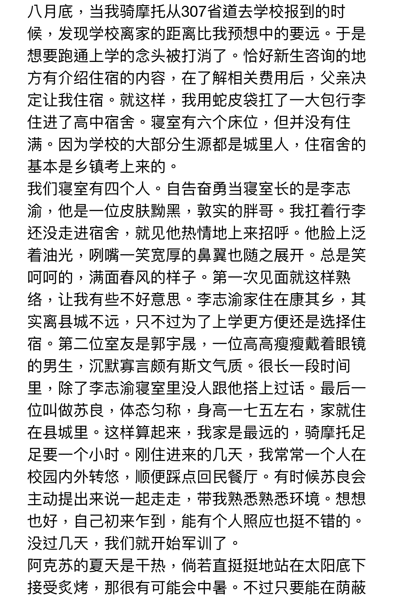

和田小可爱镇楼

            1楼 | 雄霸天下🍼 | 2019-04-28 01:01

最近是那个和我从小形影不离的维族男人说暑假要回阿克苏了  
就想开帖说说 我和他的故事  
因为他算是我意识到自己是个g的关键所在

            4楼 | 雄霸天下🍼 | 2019-04-28 01:08

为什么以【骚回子】作为格式呢，  
因为我今年一年内，被不同的人骂了好几次骚回子。  
他们大多是讨厌msl的人士。  
不过这个骂名，我却不会太生气。  
因为 骚 在新疆话中是 厉害 的意思，是个褒义词。  
至于回子……

            6楼 | 雄霸天下🍼 | 2019-04-28 01:10

一年级到五年级的五年里  
我的班里有几十个维吾尔学生  
一个回回（我），两个汉族  
所以当时我在班上是很孤单的  
因为小学的时候大部分维族人都不太会说汉语

            10楼 | 雄霸天下🍼 | 2019-04-28 01:22

小学的时候我学习很好，因为我的母语也是汉语  
当时老师经常让我来领读课文  
我每次读完，维族学生就会起哄“哦哟……骚的呢” （就是夸你厉害的意思）  
非母语者学习汉语其实是非常困难的  
平时又没有语言环境  
以至于当时班里还有很多维族学生到了三年级都还不会写自己的汉文名字  
所以我当时就成了老师的得力好帮手

            25楼 | 雄霸天下🍼 | 2019-04-28 01:55

故事就从三年级开始  
那时候我在班上唯一交好的就是一个维族女孩，我和她坐同桌  
她很聪明，成绩好，汉语也说的很好  
当时班上的维族男生大都三五成群  
下课就说维语，所以我根本融入不了  
有次上完数学课，一个叫做热合买提的男孩来问我同桌数学作业题

            28楼 | 雄霸天下🍼 | 2019-04-28 02:03

我的同桌维族小美女居然不会那道题  
这个时候我说让我看看，发现我会

            32楼 | 雄霸天下🍼 | 2019-04-28 02:10

之后我上课下课都会有意无意地往热合买提那里瞟  
自从发现他是个帅哥以后，我就开始有意地接近他，和他做好朋友  
当时得知他家就住在镇里，我好生羡慕

            35楼 | 雄霸天下🍼 | 2019-04-28 02:21

他和别的维族男生不同，他是个很爱学习的人，也很乖巧斯文  
他爸爸是一个护边员，戍守祖国的边疆，妈妈是县妇联的  
所以他们家的背景是吃公粮的，也比我家好多了  
我小学的时候，家境还是比较贫寒的  
连着很多年牧场的效益都不是很好  
所以我过着比较拮据的日子  
他爸每天会骑着摩托车来接他回家  
当时他在我心中的形象就是一个有钱的公子哥

            37楼 | 雄霸天下🍼 | 2019-04-28 02:32

和他的关系越来越好，我的人生也变得丰富多彩起来  
下课后我们一起玩弹珠，翻卡片  
两个人如胶似漆，形影不离的  
有时候如果有其他拉他一起去玩，我还会在心中闷闷不乐  
但是他的心思也比较细腻，总是可以很快的发现  
因为照顾我的感受，他都会带着我一起玩  
而且在互相帮助下，学习也变好了  
所以他爸妈当时是很喜欢我的

            39楼 | 雄霸天下🍼 | 2019-04-28 02:41

到了四年级升五年级的那个暑假，我终于第一次去了他家  
事先征求了我爸的同意，他爸骑摩托车走国道大概五公里  
穿越了牧场和荒原，巍峨的天山连绵不绝  
进门的时候我照着回民的方式致礼对他爸爸说了句“salaam”  
他家人都笑出了声，我心里也美滋滋的  
他有一个哥哥和一个姐姐，哥哥读高中，姐姐已经结婚了  
我去他家，他们很热情地招待了我  
在新疆，去别人家里都会被丰盛的水果招待  
苹果、哈密瓜、葡萄等等  
到了中午，我还和他在后院的土窑里烤地瓜，吃美味的油香  
那真的是段很难忘很开心的回忆

            44楼 | 雄霸天下🍼 | 2019-04-28 02:50

当时让我最为震惊的是，他家居然有台电脑  
好像是他爸爸单位的福利  
这种高科技东西对小学时候的我真的有很大的吸引力

            47楼 | 雄霸天下🍼 | 2019-04-28 03:07

吃完晚餐，我和他就坐在院子里的竹制靠椅上乘凉  
他家院子的葡萄藤茂盛生长，盘旋着。  
藤下一片荫翳，旁边还有一口井我记得  
和我母亲一样，他妈妈戴着粉色头巾在院子里刷碗，是个跟贤惠的妻子  
他爸爸放着音乐哼着歌，在旁边看报纸。  
其中有首歌非常好听，我记忆犹新，是俄罗斯的维族歌手Murat的，节奏很律动  
那首歌当时很火的  
不过这么多年了

            59楼 | 雄霸天下🍼 | 2019-04-28 03:33

那个时候已经是夏末初秋，所以到了傍晚，气温降的有些快  
当时我穿着小白鞋，他是光脚的  
院子里是那种石板，就开始有些变凉了  
他估计是冷了，先是缩着脚，  
然后接下来的一件事让我人生第一次鸡尔梆硬  
那就是他把脚搭在了我的大腿上  
当时我立马就脸红心跳，但是他却不以为然  
没过一会儿，他爸爸发现了于是就用维语训斥了他（估计是说他没礼貌之类的）  
他就把脚放下来了，我问他说了啥，他什么也没说只是笑笑撇了撇嘴  
这时我意识到，天黑之前我必须要做一次礼拜功  
平时我在家，都是和父母一起的，已经养成了习惯  
于是我问他麦加的方向在哪，他表现得不以为然的样子  
我当时就有些生气了

            62楼 | 雄霸天下🍼 | 2019-04-28 03:54

葡萄香味四溢，那时候觉得自己一辈子都能这样闲适安逸  
他爸爸意识到了我的意图，于是就领着我去靠近马路那一侧做礼拜功  
因为他在那里有标的物，指向圣城麦加的方向  
他的妈妈这时也放下手中的活，我们几个人一起默念着清真言  
“俩一俩嗨因兰拉胡穆罕默德……”  
鸠鹰在天山上盘旋翱翔  
那时的我，生活在伊斯兰世界，课堂是贴近祖国与外面的唯一渠道  
那时的我，还不懂虔诚是什么，只知道依样画葫芦，但是心灵却没有那么多杂念。  
我有时会畅想麦加究竟是个怎样的地方  
昨晚礼拜功，我们进屋子  
华灯初上，他妈妈拿来播放机放起了舞曲  
我们就在屋子里跳起了舞，非常开心  
那是我第一次学跳维族舞  
虽然他在教我的时候有些过于着急（我又不是跳舞天才

            74楼 | 雄霸天下🍼 | 2019-04-28 04:41

为什么这么多人叫我滚开点

            75楼 | 雄霸天下🍼 | 2019-04-28 04:42

热合买提当时有让我不爽的一点在于，有时候他会用维语嘲笑我  
然而我永远都不懂是什么意思  
问他吧他还不说

            76楼 | 雄霸天下🍼 | 2019-04-28 04:54

那个暑假过后就五年级了，我们的学习压力又加重啦  
但是自从去过他家以后，我们就把他当做自己的亲兄弟看待  
我想他也是吧，有时候他和其他维族打架，我也会一起帮忙  
记得印象最深的一次就是有个叫艾孜木然的好像是，他故意把热合的烤馕扔在地上  
我当时气的要发疯，冲上前去就开始一场恶斗  
他的指甲很尖，把我的脸都抓出血了，以至于我耳朵根下面现在都还有个疤痕  
当时班上拉帮结派的风气很严重，老师也是无能为力  
接下来就是六年级我们分了一次班，我和热合买提被分开了

            79楼 | 雄霸天下🍼 | 2019-04-28 05:05

六年级分了班，热合莫名其妙地跟我疏远了  
其实就在隔壁，我下课会去找他玩，但是他有了个新朋友

            86楼 | 雄霸天下🍼 | 2019-04-28 05:19

感觉自己真的很努力，小学毕业的那个暑假，拿着我哥初中的英语课本记单词  
当时我的方法是，他念一遍，我用中文记下发音

            90楼 | 雄霸天下🍼 | 2019-04-28 05:31

上了初中，汉族和回族多了起来，因为附近几个乡的学生都被集中到了这里。  
而且维族人也开始越来越多的说汉语（小学的时候真的听不懂）  
我也多了几个志同道合的汉族朋友，不仅仅局限于热合买提  
那时候拜城开了好几家网吧，我经常听说他们去城里打游戏  
但是我听了后感觉很不好，因为那时我是很乖的  
我听说网吧里抽烟喝酒的什么样的人都有，但是身为msl是绝对禁烟禁酒的  
老师叫我们不要沉迷于网络，再加我家教也很严格，  
所以我当时听了后就觉得那种地方绝对不能踏入  
有一次，我听说热合买提去了网吧  
我当时非常生气，觉得他真的变了，学坏了很多。所以我扬言要告诉他爸  
结果他居然用很羞辱性的语言骂我，说我多管闲事  
我当时就觉得太委屈了，接下来发生的一件事让我和他产生了第一次关系破裂

            93楼 | 雄霸天下🍼 | 2019-04-28 05:53

我和他辩论去网吧这件事很不对，一来那种地方乌烟瘴气鱼龙混杂容易学坏  
二来沉迷游戏影响学习，三来他自己家就有电脑干嘛还要花钱去网吧上网。  
那段时间他们都在玩DNF，每天就刷塔刷塔（至今不知道这个游戏是在搞什么）  
就当我以为自己是为了他好才这样的时候  
他突然和其他几个维族男生用维语咒骂起我来  
虽然听不懂，但是他们的语言和神态都像一把把刀刺进了我心里  
他还瞪了我一眼，叫我管好自己就行了。  
那个瞬间，我真的觉得自己五年级为他出头打架，六年级对他的心心念念都是在自作多情

            96楼 | 雄霸天下🍼 | 2019-04-28 06:04

在和热合买提关系破裂后，我和一个叫做王振的汉族男生的关系迅速升温。  
王振的个子不高，眼睛小小的，皮肤也比较黝黑，性格开朗很爱笑。  
起初是我们都喜欢踢足球，新疆人应该都懂，就是不同班级之间有时候喜欢踢比赛。  
我和王振一拍即合开始张罗组建我们的班足球队。  
但是因为我和热合买提已经交恶了，所以这个足球队自然是没有他们那帮人的。  
我身为队长，常常和其他班宣战（不知道当时哪来的自信）  
而且我还开始有组织地召集大家进行训练。  
其实现在想想那时候的足球赛都不太合规矩，只是当时不懂……  
我们下课后都会在尘土飞扬的草坪上踢球  
常常都是弄得浑身湿透，汗流浃背才肯罢休。  
王振的家在另外一个村，离我家有点远，如果一起回家的话需要绕路  
但是他当时还没有自行车，所以我常常载着他回家，他就从后面环着我的腰。  
那时候344县道还很破，路都崎岖不平，一路上颠颠簸簸的但我们真的很开心。  
我发现我从心里已经喜欢上他了  
就是因为踢足球和送他回家，导致我有次太晚回家被我爸狠狠打了一顿

            101楼 | 雄霸天下🍼 | 2019-04-28 06:24

就是有一次也是踢足球搞得太晚，而且那天摔了一跤校服上都是黄黄的灰尘。  
十月份的新疆差不多6点就天黑了，而且那天算是踢的特别晚了，我照旧送王振回家。  
之后我就怀着忐忑的心情骑回家，边骑我的背脊就边冒冷汗。  
因为我已经预感到自己大事不妙，果然隔老远就看见我的爸爸铁青着脸站在家门口。  
他手上还拿着抻面的棍子，还没等我把车子停好，一棍子就打在了我的腿上。  
一瞬间我双腿一软就跪倒在地，自行车也倒在一旁。  
接下来就是一顿毒打，我知道是我的错，我玩的太野让父母担心了。  
念清真言的时候我也是强忍着泪水不哭，但是声音已经哽咽了。  
那是我爸最后一次打我，给我一记重重的教训。  
所以这也是我之后变得沉稳和成熟起来的原因。

            105楼 | 雄霸天下🍼 | 2019-04-28 06:45

很快就初二了，初一的那个暑假大家都长高了不少，我也不例外。  
短短几个月直接从165长到了175，开学的时候不少同学都吓了一跳。  
同时我也注意到了自己身体的变化，声音变低沉，胡须开始浓密，下面也变的黑黑毛茸茸一团。  
但那时候我虽然已经有了性意识，但还没有真正的启蒙。  
上生命与健康课，学到相关的知识会兴奋，但是还是遏制自己不要有不好的念头。  
有时候我会做一些有快感的梦，梦里飘飘然好像飞起来一样爽。醒来会觉得懊恼。  
直到一次偶然的经历，我终于学会了那件让我快乐又给我带来很多痛苦的事

            108楼 | 雄霸天下🍼 | 2019-04-28 07:03

又是一次留宿同学家的事情，不过这次是在王振家，跟父母软磨硬泡很久他们才答应。  
他们主要是怕我做客汉族家庭吃了不清真的食物。  
不过王振真的很想让我去他家玩玩，还承诺了不会让我犯忌的。  
至今记得是2012年的五一劳动节，当时下了点小雨，我来到了王振的家里。  
他家是种石榴树的，我想你们吃的市面上的皮亚曼石榴说不定就有他家的。  
总之他也算是个小康的务农家庭，虽然也是住在另一个村子里。  
他家有两层楼，好几个房间。最重要的是他是独生子。  
他的爸妈很热情地招待了我，那时候我就想起五年级那次去热合买提家玩的过往。  
让我不禁有些忧伤，昔日的好友如今却反目成仇，口出恶言伤害彼此，我的心也是在滴血

            126楼 | 雄霸天下🍼 | 2019-04-28 09:43

他爸妈也是很感谢我每天都骑自行车送他回家，我甚至因为这个还挨了我爸的一顿打（因为踢球太晚）  
还说我带着王振踢球，他变得越来越活泼，而且身体也变得越来越好。  
王振大概165左右，矮我一个头，而且身体也比较瘦弱。  
我读书算提前一年，比同学们都大一岁，王振也不例外小我一岁。  
所以我当时真的是把王振当成我自己的亲弟弟来对待，他让我产生了很强的保护欲。  
有时候他因为一些事不开心了，我也会想方设法把他给逗乐。  
或许是失去过才懂得珍惜拥有，总之我当时真的很在意他的感受。  
他成天黏着我，我也一点都不觉得腻，反而很享受那种感觉。  
但是他有时想直接对嘴喝我的水，我还是比较介意。他就会生气觉得我拿他当外人。

            128楼 | 雄霸天下🍼 | 2019-04-28 09:56

在王振家吃完晚饭后，就开始看电影了。他家算很有钱的了，2012年的时候就有影碟机和投影仪。  
然后他爸爸就给我放电影看，放的是美国电影《凌云壮志》阿汤哥在里面非常帅。他在电影里穿的那件皮衣我也很喜欢，所以前面我去乌市的时候也买了一件仿款的（就是我头像这件）

            146楼 | 雄霸天下🍼 | 2019-04-28 11:26

王振下午一回到家就洗了个澡，我原本打算晚上睡前再洗。但是因为他家后来停水了（当时拜城真的老停水）导致我还没洗澡就得睡觉，因为实在是太困了。  
一进到王振的房间我倒头就睡，他关了灯也摸上了床。  
不知道过了多久，我突然被他推醒，我那时候突然不知道自己身处何方还以为睡在自己家。好一会儿才回过神来，就问他咋了。  
他说我脚太臭了，他睡不着。（因为我是容易出汗的体质，所以夏天脚的味道是有点大）  
我感到很不好意思，就说那咋办，现在停水了也没办法。  
他下床去拿毛巾，不知道哪里搞来的水就替我擦脚。当时觉得痒痒的，而且很害羞，我就对他说我自己来吧，但是他说没事，坚持要帮我擦。后来还喷了花露水。  
就这样我们重新睡去。

            152楼 | 雄霸天下🍼 | 2019-04-28 11:37

我是个很容易睡着但也是个容易醒的人，迷迷糊糊中我感觉到他在摸我。  
但我还没太在意就继续睡，直到王振完全把手环在我的身上，脸埋在我的臂弯里，从他嘴里吐出来的热气弄得我痒痒的。  
我这才完全清醒了。那时还不懂什么同性恋，只知道自己把他当作自己的弟弟一样。于是也转过身去抱着他睡。  
但是下面却莫名地有了反应，硬邦邦的顶着他。我下意识地把身体往后挪了挪，不让他发现自己硬了。  
这时候他突然用手摸了上去，毫不夸张地说真的跟触电一样，因为那是我第一次被别人摸那里。  
接着他就开始用手上下套弄，我把他手拿开，有点责怪的意思说，你干嘛。  
他反问我，你知道手/淫是什么意思吗？（我发誓我当时真的不懂，平时只知道趴在床板上顶会有快感）

            155楼 | 雄霸天下🍼 | 2019-04-28 11:50

他估计是累了，在弄完之后我感觉到他的鼻息变得沉重起来，睡着了。  
我感觉很难受，因为天气已经变热的缘故出了很多汗身体黏糊糊的，下面也是黏糊糊的。闻着自己的脚臭混着花露水的味道，快要吐出来。我真的很后悔来他家。  
那时候背负着巨大的精神压力，差点哭了出来（现在想想

            170楼 | 雄霸天下🍼 | 2019-04-28 12:24

<a href="audios/1.amr">语音</a>

            173楼 | 雄霸天下🍼 | 2019-04-28 12:34

<a href="audios/2.amr">语音</a>

            174楼 | 雄霸天下🍼 | 2019-04-28 12:36

在天山脚下的县道上，我边流泪边骑车，即使那天阳光明媚，蔚蓝的天空飘着朵朵白云。  
我的大脑一片混沌，感觉害怕，想要逃离。即有背叛又有被背叛的感觉。父母的脸庞不断浮现在我眼前，和王振的形象交织在一起。  
那种瞬间而来的恐惧感，我想很多人在青春性萌芽时都经历过。负罪感与快感齐头并进，让人矛盾。  
快到家了，但是我的眼眶还是湿湿的，担心被爸妈发现我哭着从同学家里回来，所以我不得不停在路边等风干。  
天山的云雾缭绕，阿勒吞河静谧流淌着。清真言在我耳畔回响起，我在心中虔诚地向真主请罪。  
早晨的气温不过十度左右，谷风吹过，冷的我瑟瑟发抖。停下来后我很快就骑回家了。  
回到家以后，我就积极地帮我妈收拾东西，陪她去集市上卖油香和帕剌孜（负罪感趋势下，帮爸妈做事变得异常积极

            218楼 | 雄霸天下🍼 | 2019-04-28 15:21

五一收假回来以后，我开始不再和王振往来。那时候我们学校每天早上都会发奶子，王振都会帮我拿一瓶放在桌子上。  
我抬头对他说，我自己又不是不会拿。他听了以后拍拍我的肩，尴尬地笑了笑。我当时一门心思的不想再和他往来，殊不知是在伤害一个爱我的男生。

            221楼 | 雄霸天下🍼 | 2019-04-28 15:44

后来我发现自己灵魂深处真正在意的还是热合买提，因为✈️的时候老是不自觉的想着他。  
他爸爸在我和他六年级分班之前给我们拍了一张合照，重印出来还塑封了送给我。那时我常常会把那张合照翻出来，然后看着看着就想打✈️，这样就会异常兴奋，射得也快。  
这时候我才真正意识到我对女生没有兴趣，只喜欢男孩。不过当时没有关于未来的想法，觉得自己的人生不会因此有什么不同。  
性幻想的驱使，让我很想重新去找热合和好。但无奈我当时又是个自尊心很强的人，所以始终拉不下见面。  
这期间，王振试图求和过很多次，他给我写了满满一页纸的信（没记错的话差不多A4大小）跟我道歉，说他知错了请求我原谅。  
但我始终无动于衷，其实我心里早就原谅他了。因为我发现自己根本就是个g，还那样对他完全就是又当又立（当时倒是没有又当又立这个说法，只是我有类似的感觉。）但我仍然像块冰冷的石头一样无动于衷。

            231楼 | 雄霸天下🍼 | 2019-04-28 16:27

心里想着热合，却不敢付出行动去跟他重修于好。另一方面，面对王振的一片真心，我又置之不理。我真的不知道自己想要的到底是什么。  
至于为什么喜欢热合，我觉得纯粹是因为颜值，当时我算是个颜控。长相可爱的男孩总能吸引着我。  
一次换座位后，我跟班上有一个叫做古丽的女生坐了同桌。几周时间相处下来，我们处的非常好。  
而且我感觉到她对我是有点喜欢的，因为她常常会带一些零食来分给我吃。而且还会帮我撕英文字母的临贴纸。有时候我们一言不发，相视一笑。  
她的眼睛也很漂亮，好像里面装着日月星辰，一头乌黑油亮的秀发。她的汉语口音很重（就像外国人说中文一样）我会模仿她说话语调

            234楼 | 雄霸天下🍼 | 2019-04-28 16:44

在我和古丽度过了一段悠闲平静的时光后，我自欺欺人的以为自己爱上了她。有时也会说些暧昧的话语，她就装作听不懂的样子。有时还会有其他同学开我们的玩笑，古丽就抿嘴微笑，脸颊绯红宛若月季。  
二零一二年的六月初，天气已经很热了。我们教室条件很差，只有四台小小的破风扇挂在墙壁上，转动时还会发出聒噪的声音。当时我已发育得很强壮，羽翼渐丰，体重不断增加所以内火烧得旺盛。午休趴在桌上睡觉，醒来后满头大汗，背脊也是汗流如柱。  
古丽见状，就会用她的那把古风扇子给我扇风。当时很多同学都开玩笑说我们俩像是一对夫妻，我内心也把她当成了我的女人。当时我天真的以为，自己将来一定会娶她。我们的孩子，维语和汉语都会说得很好，他会是个完美的人……我甚至开始给孩子取名字，幻想阿訇教导他的样子。那时我还不知道，自己的命运车轮永远都不会驶向这条轨道。  
另一方面，我内心还是想着热合买提。他身高差不多已经170，比以前更帅了，愈发立体的五官和性感的小胡须。我对他其实还是充满埋冤，埋冤他为什么这么久了都不主动找我求和，难道我们过去的点点滴滴他都忘了吗。在教室低头不见抬头见，但两个人也权当对方是空气。  
记得快期末的一节体育课，老师组织我们玩拔河游戏，在经过队伍编排后，热合就在我前面这一位。这是我时隔一年再一次和他如此贴近。我注视着他后脑勺浓密而卷曲的头发，散发着丹桂的清香。低下头去，他身上还有一股似有若无的汗味。我呼吸着，感受属于他身上那熟悉却又久违的味道。比赛开始后，我使出全身向后夯，因为使劲，他整个人也不得不往我身上靠近。对面不敌我们，很快就被拉过了线。比赛结束的那一刹那，热合一个重心不稳向后倾，我顺势用臂弯揽住了他，但他立马就弹开与他人说笑去了。当时我的心情五味杂陈，有种说不上来的酸楚。

            250楼 | 雄霸天下🍼 | 2019-04-29 00:37

现在回过头来想想，自己当时对王振确实有些刻薄了，他不过是喜欢我而已。但我在那之后对他这样冷淡，也只是因为我不喜欢他罢了。如果那夜是热合买提对我做出那件事，说不定我会深深爱上他。爱本来就没有什么道理，也没什么对错，王振只是爱了个不该爱的人。  
王振仍然想要和好如初，有时候偶然撞见他，他都会冲我笑，小小的眼睛弯成两道月牙。在写道歉信无果后，快放暑假的时候，他又给我送了一个八音盒，曲子是《致爱丽丝》。这个时候我其实已经心软了，而且也有些愧对王振的感觉，于是和他的关系也就破冰了。  
另一方面，我尝试在✈️的时候幻想古丽，在几次之后，我发现根本无济于事。这时我终于意识到了自己或许真的不喜欢女生，从小到大似乎也没有女生走进过我的内心。只是可怜的王振，以为我是个直男。我们和好以后，他也不敢再和我有太亲密的举动，载他回家的时候更是不敢环着我的腰。再一次骑车载他回家的时候，他妈妈感到意外，笑着问我怎么好久没来玩了。我也只能谎称我自己前段时间要提早回家帮忙挤奶。有时候王振也会像其他人一样开我和古丽的玩笑，但我知道他这样做不过是在压抑自己内心的情感。现在回头想想，我真是很冷血。  
接下来就是2012年的暑假了，当时我爸在阿克苏十五大队那里批了奶牛指标，和X农乳业公司签了协议。我家的效益不错，所以经济状况也是得到显著改善。我的学习也是稳中求进，一直都在班级前五名，一家人过着其乐融融的生活。开学就是初三了，我提出想要报个英文补习班的想法，我爸二话不说立马同意了。正是这个英语补习班，让事情又发生了转变。

            253楼 | 雄霸天下🍼 | 2019-04-29 01:35

那时镇上就这么一个英语补习班，是我们英语老师推荐的。给我们上课的老师是阿克苏二中的，她每周六都会专门坐车来这里给我们上课。我报的班是下午1点到3点半的，因为考虑到早晚我都要做礼拜，而且周六的早上我一般都会去帮我爸牧羊。当我去上课的时候，我发现热合买提居然也在这个班，我当时都惊掉了。第一次上课，又是一阵脸红心跳，全程都往他的方向瞟，注视着他白色T恤上的印花图案。  
课间休息的时候，热合买提掏出了手机，我听到他们说那是iphone4s，当时在我脑海中对这个手机完全没有任何概念。他们还不断地说什么苹果手机，我脑海中浮现出来的画面就是🍎？？说真的完全不懂。我只知道一群人簇拥着他，玩切水果，汤姆猫等游戏，不时爆发出来的笑声让老师都乐在其中。唯独我，孤零零地一个人坐在座位上，呆若木鸡。我感到孤独，心中又生出一丝嫉妒，嫉妒热合买提有这么多朋友，要什么有什么。连着很多周上课，我都是这样静静地看着自己的书，和他们的世界水火不容。（其实我至今不明白为什么他爸妈在2012年就给他买那么贵的手机。不过他只能周末用，平时上学没有带。）  
我当时真的觉得自己和他永远都不会讲话了，他家境好，人缘好，英俊帅气，我只能远远地望着，望尘莫及。想来又是一阵自卑和心酸，曾经那个天真烂漫，乐观自信的我已经不见了。  
不过，十一国庆节收假以后，很快又迎来了古尔邦节。那是穆斯林一年中最为盛大的节日。

            255楼 | 雄霸天下🍼 | 2019-04-29 02:00

《遗憾》

            264楼 | 雄霸天下🍼 | 2019-04-29 02:48

和王振和好后，我为自己之前的冷眼相待感到抱歉，所以对他比以前更加亲密了，他却比以前小心谨慎了许多。王振矮我一个头，我可以把手搭在他的肩上，揽着他的脖子。他比较瘦小，所以常常被我用力一勾就失去重心了。我也乐于这样，这能给我带来一种征服感。我就这样享受着他的乖巧，我知道他是爱我的，他不舍得离开我。从热合买提那得不到的被依赖感，我可以从王振身上得到。一直以来，隐匿于我内心深处的渴求就是希望有个可以黏着我，需要我的男孩。只不过，这个秘密我到初三才拨云见雾得以知晓。如果热合买提是王振这样该多好，我对热合的情感被投射到了王振身上。  
十一月份，古丽的生日快到了，当时班里已经开始流行给好友送生日礼物。我也在心里也打算给古丽送个礼物，毕竟她跟我很好，而且两个人坐了这么久的同桌。不送的话，面子上有些挂不住。报了英语班，有时候爸妈忘给我零花钱我都不好意思去要，因为觉得自己给家里已经造成很重的负担了，所以真的没有多余的零花钱给古丽买点什么。放学载王振回家的路上，我就跟他说了这件事。  
“生日fo的呢，丫头子喜欢撒……”  
他若有所思地嘟哝着，我没有在意，而是在为生日礼物的事烦心。十一月的拜城已经很冷了，骑车之前我都会戴上牛皮手套以防手指长冻疮。他不敢再环着我的腰，只是用手抓着铁架子。我意识到他是害怕我介意，所以就对他说，马上进乡道了你抱着我吧，怕待会儿跌下去了。

            299楼 | 雄霸天下🍼 | 2019-04-29 09:15

2012年十一月，从古尔邦节回来后的第一次英文补习。老师要求我们读一篇课文对话，随着一对又一对被点起来朗读，我开始紧张得冒冷汗。果不其然，我和热合买提阴差阳错地被安排一起读。至今记得是《新概念英语1》的第63课Thank you doctor，我读医生的部分，他读患者。  
 我想，班里的同学应该也替我们感到尴尬，因为平时他们会簇拥着看热合买提玩手机，我却默默坐在一旁。同学们应该是知道的，所以原本窸窸窣窣的班级瞬间变得鸦雀无声。大概是已经许久没有在一个完全安静的环境里听到他的声音了，较之前更低沉却富有朝气的声音划破空气的寂静。那种既陌生又熟悉的感觉让我紧张，用力攒着的手心沁得湿润。我死死地盯着他读的每一句话，生怕遗漏什么。他的英文口音捎带着维吾尔特有的风格，读得也并不十分流利。  
 我终于禁不住抬眸看他，彼时是初三上学期，我们自闹僵以降已逾两年。两年来，每当他出现在我的视线里，我的眼神便会立马挪开，仿佛是在躲避某种光辐射。映入眼帘的是他那张愈发英俊的脸庞——突厥特色的眉毛，纤长睫毛下的一双眼睛像是生辉的黑宝石，洁白如玉的牙齿在朱色的嘴唇里若隐若现。他的肤色较之前深了些，象牙白的脸颊红润细腻。时隔两年再次这般仔细端详，他像是一块被掷的琥珀，在我的心灵之潭激起阵阵涟漪……  
 很多年后我才知道，有的人就像是种在你记忆沙漠的一朵玫瑰。任由风吹日晒，斗转星移，当你再次见到他的时候，那朵你认为早已枯萎的玫瑰，重新盛开得比以往更加娇艳欲滴。这个人有着令人痴狂的迷人外表和直击心房的特有气质，让你想要跪倒在他面前，将自己最宝贵的忠诚双手奉上。  
 终于读完了，坐下后我长舒一口气，仿佛像是被解放的囚徒。我暗暗感谢自己刚刚表面上的泰然自若，我总是习惯压抑自己的情感，不轻易表露喜怒。倘若有人在我面前骂骂咧咧，我往往不做过多的反击，达到愤怒阈值时会直接出手一拳。所以周围的人常常会觉得我像是一头犟牛，平时耕犁怒时夯。

            301楼 | 雄霸天下🍼 | 2019-05-01 02:31

就像是1972年中美通过乒乓球交流赛破冰一样，那次一起读英文对话成了我和热合买提和好的契机。年少时，朋友之间总是容易因为一点小事而闹僵，事后如果两人都不愿意拉下脸面求和的话，好朋友很可能就此形同陌路。我和热合买提的遗憾在于心生嫌隙后错失彼此人生的两年。除了肉眼可见的外在变化外，这两年他的一切我都无从知晓，即使我们每天身处同一屋檐。再一次的周六英文补习，下课后我将单车从树荫下牵出来，准备推出回廊骑车回家。这时，突然感觉背后被人拍了一下，一回头居然是那个我朝思暮想的人。像从前那样，热合买提眯着眼微笑着，沉寂了好几秒才启口。  
“有时间吗？我们聊聊吧。”  
初三时我已经接近现在一米七八的身高了，热合买提约莫一七零。我沉默地俯视着他，大脑一片空白。等反应过来后才勉强挤出一丝笑容，两人就这样并着一起走出校门。十一月的胡杨被落日的余晖晕染成赭黄色，那一排排胡杨就傲人地挺立着，像是在注视着我们二人。从西伯利亚吹来，经由天山的风萧瑟凛冽，卷起阵阵沙土。终于，他说话了，寒暄了几句上课的内容外，他还关心我父亲和乳业公司签约的事。他的中文已经说得很好了，几乎听不出来有维吾尔口音。差不多也是从那时起，他身上总是氤氲着月桂的芳香，是香水抑或是沐浴乳。  
我们只字不提当年发生的事，那是尘沙在时间之泊的折戟，虽然无法被冲走，但表面是平静的。我们都是这样不善言辞、心照不宣的人。三言两语之间，我们已走到镇子的边缘，其中一条岔路是通往我家的。我们站住了脚步，他拍了拍我的肩说有空请我上他家去吃饭。回家的路上我很兴奋，因为我原本以为自己和他这辈子都不会再说话。我是个在这方面很被动的人，也许心里会一直惦记着对方，可就是没有迈出第一步的勇气。一个下坡，我感到脚下生风，更用力地蹬着。金乌西沉，气温降得很快，我却只觉得体内的熊熊烈火正在燃烧，回到家已然满头大汗。

            313楼 | 雄霸天下🍼 | 2019-05-01 06:05

连着好几天，我都沉浸于和热合买提破冰的喜悦之中，晚上写完作业想到这个都会心头一暖。我全然忘了要给古丽送生日礼物。王振不断在我耳边提起送礼物的事，我却不甚在意。课间时，王振常常会在我身侧，像是绕着恒星公转。我的目光却紧紧跟随热合买提，关心着他的一举一动。我殷切期盼他能来找我，可希望几乎每次都落空。放学时，我像往常一样戴着牛皮手套骑车送王振回家。只是他环在我腰上的温度我不再感受得到，因为我的脑海上演着一遍又一遍去热合买提家吃饭的剧本。临近古丽生日的一天傍晚，我放下王振准备掉头骑回家，突然被他叫住了。  
“你等会儿，我有个东西要给你。”  
说罢，他便飞快跑回家里，地上卷起一阵沙土。我疑惑地站立着，思索他究竟要给我什么。不一会儿功夫，他瘦小的身影夺门而出，手里捧着一个什么东西——波斯风格的粉釉罐子，里面装满紫色的纸星星。正当我好奇这是什么的时候，他眨了眨月牙般的小眼睛抢先说道。  
“这是我这些天折的，你拿去送给古丽吧。”  
“你为撒给我呢？”  
“她是你同桌嘛，又不是我的。”  
须臾间，感动溢于言表。原来他一直在默默地为我做着这一切。怪不得他总是跟我提起这件事。我小心翼翼地接过，一罐沉甸甸的星星发出沙沙声。回家的路上，我感觉自己像是被幸福包围着。接二连三的惊喜，让我不禁笑出声来。想到不知多少个夜晚王振在台灯下一颗一颗地叠着星星，愧疚之情涌上心头。自从那夜的事情之后，我知道他的内心是惧惮的。很多时候我能察觉得到他的谨小慎微，他害怕我再次把他抛下。要对他更好，我暗自笃定。

            326楼 | 雄霸天下🍼 | 2019-05-01 17:08

王振折的那一罐星星，古丽非常喜欢。她好几次都喜悦地跟我说她摆在了书桌上，每天晚上写作业就能看到。听后我一阵羞赧，面上泛起红晕。那时我很忌惮撒谎，因为一个虔诚的信徒是不能撒谎的。愈长大愈多无奈，我就发现有的时候我不得不吞下欺骗的蜜饯。因为不愿撒谎，所以我常常沉默不做解释，任由他人猜想。我能感受得到在王振心里，我喜欢的是女孩。因为他好几次都云淡风轻地开我和古丽的玩笑，我知道他在意。他是个心地善良的人，我明白我不能消耗他的赤诚。但怯弱使我好几次欲说还休，最终还是作罢。  
热合买提有时会来找我说话，或是借走我英文补习的作业。我贪恋他在我面前的一分一秒，目不转睛地注视着他的脸庞，乌黑油亮的秀发让我心神荡漾。从小学到中学，真正走进我心里的只有他。我渴望能够拥他入怀，抚摸他的胡须，轻嗅他的馥郁。我还在痴痴等着一个回响，一个去他家吃饭的邀请。  
从拜城沿307省道向东北方向，可以到克孜尔。很多城里人会特意驱车去克孜尔看龟兹石窟。出于叠星星的感谢，我决定带王振去玩玩。于是周五载他回家的路上，就跟他说了周日我会去接他的事。那时真是一辆单车走天下，所以我的腿部肌肉十分发达，也练就了空手骑行等特技。

            337楼 | 雄霸天下🍼 | 2019-05-02 01:52

阿克苏在公元前是龟兹国的都城，曾先后被匈奴、吐蕃、回鹘等汗国占领过。坐落于帕米尔东麓的龟兹国，是丝绸之路上东西文化融汇的重镇。我常常在想，自己被称作色目人的祖先是如何从波斯一路跋山涉水，越过沙漠来到中国。十二月的风吹在脸上好似刀割，出门前我需涂上润肤的蛇油，穿着羊毛领的牛皮夹克。台台尔石窟被开凿在一处悬崖上，已有千年的历史。壁画精美绝伦，兼具汉唐、波斯、天竺的特点，以及浓厚的佛教色彩。我们算是游目骋怀，饱览历史足迹。  
出来以后我们躺在不远的戈壁坡上稍作休憩，放眼望去满目萧瑟，一片荒凉。犹记得那天天气晴朗，但是气温很低。一阵风吹过，王振开始颤栗。我知道他很畏寒，于是伸出左手使他可以枕着我腋窝。他乖巧的性格和瘦小的身躯总能引起我最原始的保护欲。我们就这样睥睨着太阳。穿越时空之梭，我像是能看到千年前楼兰舞女戴着面纱弹奏龟兹乐。  
王振的学习不错，他志在考取阿克苏最好的地区二中。在大家齐头并进的时候，我的成绩却比以前下降了，我知道是我心事太多的缘故。每天回到家，我要帮忙挤牛奶或是用左旋咪唑给羊驱虫，忙完都已经快九点，做完作业擦擦洗洗倒头就睡了。我一直想考上内高班，走出新疆去内地学习生活。但是希望却像风中残烛，越来越渺茫。尽管我极力压抑自己对热合买提的情感，它依然如雨后春笋般破土而出。另一方面，想到父母已经为我付出许多，我却没能取得进步，内心又是一阵抽搐。多重矛盾的驱使下，我向王振倾吐了我的烦恼。  
“你是咋学的呢，怎么我成绩老提高不了。”  
“要不我上你家住器撒，可以辅导你。”  
“卖钩子的，你又在佛胡话了。你爸妈能同意。”  
“真真儿的……”

            339楼 | 雄霸天下🍼 | 2019-05-02 01:57

烤馕和大盘鸡

            340楼 | 雄霸天下🍼 | 2019-05-02 02:29

平时做作业我常常苦于数学题目太难。脑子不够用的结果就是，二次函数的大题即使看了答案也不会。我一直搞不懂顶点和趋势的意义，甚至还冒出学这些东西有什么用的愚蠢想法。王振的头脑很灵活，拿起笔在纸上刷刷几下画好图，这道题就被他解出来了。牛顿第一定律对我来说更是藏匿于秘密花园中的清泉，只闻其声不见其状。2013年一月，王振提出寒假想来我家住一个星期，可以帮我补习补习功课。我爸妈听了后很高兴，立马就答应了。就这样，他背着几套换洗的衣服来到了我家。  
上午我们会帮我爸干牧场的活儿。冬天的鲜草和苜蓿比较少，牧羊的承载力就大大降低了。休牧期里，只放少部分的羊去草场，其余喂食饲料。冬季会碰上牛的食欲不振，这时候就要静脉注射复方布他磷。我和王振帮忙安抚牛，父亲则用注射器在牛颈右侧上打针。下午我们就会洗个澡，然后在我房间复习各自的功课。他大体上是很有耐心的，只不过偶尔还是会急切。譬如碘酒遇淀粉变蓝这类的变色问题，我总是搞不清楚。他就会啧的一声，作出无奈的样子，有时候还会被我气笑。在他的帮助下，我弄懂了许多困扰已久的问题。瓶颈得以突破，初三下学期我的成绩得到显著提升，不过这都是后话了。  
留宿王振家那晚发生的事，我们都假装已经忘记了没有再提。所以晚上睡觉的时候，他也会刻意和我保持十公分左右的距离，我的床很窄，我真担心他睡着睡着掉下去了。于是就对他说。  
“来，躺过来点吧。”  
像那天在克孜尔石窟一样，伸出左手让他枕进我的腋窝。刚躺上床的时候，我们还三言两语的谝闲转子。但是没过多久，我就陷入了昏睡。因为我是个头一沾枕头就睡着的人。不过我很确定他那晚没有再做什么，我想他也不敢再做什么。

            346楼 | 雄霸天下🍼 | 2019-05-02 07:04

第二天他有些拘谨地对我说，床上膻味儿太重了，他昨晚都没睡好。这时我也想起自己已经两三个月没换过床单和被套了。我俩决定把它撤下来，一起浆洗。冬天不烧水洗衣是不行的，手指都会被冻掉。烧水壶的汽笛响了后，我们拿着一个浴盆和两个板凳在家门口的石板上开工。一洗才知道已经很脏了，揉搓下来盆里的水都变了色。我们卖力地洗着，原本就瘦弱的王振，更是连把床单捞起来的力气都没有了。最后我把它拧得再也拧不出一滴水，然后晾进了草料房。那儿气温高些，不至于结冰。  
换了新床单的床还有太阳晒过的香味，王振兴奋地在床上滚来滚去。看到他这样活泼可爱的样子，我不禁心头一暖。我也开始反思自己，为什么会如此在意热合买提。明明王振处处为我着想，我应该好好珍惜他的。或许我不该追逐这散漫天边的云彩，因为云彩终究是抓不住的。近在眼前的石榴树早已枝叶繁茂，瓜熟蒂落。我却不知道捡起来，任由石榴裂开腐败。我真该捡起来尝尝看，咬破果实的外壁，那甜美的汁水定能沁润我的心肺。也正是从那时起，我决定一心一意对待王振，不再去想热合买提。我上床去抱住他，抚摸他细软的头发。他也不再动了，只是僵硬的任由我抱着。我闭着眼睛，感受他澎湃的心跳。我要好好对他。那天晚上，他侧身背对我躺着，那时我家还没有暖气，只是在房里烧土炕。他家是用锅炉烧暖气片的，所以比我这家更暖和一些。朔风打得窗户噼啪作响，兴许是炭火不足，他又开始发抖了。我也侧过身，从他的背后环抱着他，右手放在他的胸前。  
“还冷吗？”  
“嗯…不冷了。”  
这时我才发现他的脚是冰凉的。我心疼得赶紧用脚捂住，用身体去给他温度。他的鼻息，他身上淡淡的薰衣草香让我下面变得很硬，就这样顶着他的臀部的位置。可是我什么都没有做，在这方面我是个很被动的人。他也不敢再主动。我们就这样抱着睡了一夜。

            347楼 | 雄霸天下🍼 | 2019-05-02 07:05

新疆喀什

            357楼 | 雄霸天下🍼 | 2019-05-02 08:37

《成都》

            361楼 | 雄霸天下🍼 | 2019-05-02 13:38

《أن شاء اه》

            362楼 | 雄霸天下🍼 | 2019-05-02 13:50

又是半夜更帖，内地已经一点了吧？最近其实我也挺忙的，准备会计证和足球赛。所以能煮的时候已经尽力在煮了

            371楼 | 雄霸天下🍼 | 2019-05-02 17:28

翌日拂晓，王振还在酣睡之中。和往常一样我整理好衣衫，准备去做礼拜。蹑手蹑脚地起床后，我把被子向内侧扎紧，严丝合缝得不让寒气渗进去。然后戴上礼拜帽，跪在房门口菱形织花的土耳其地毯上，朝着麦加克尔白的方向做搭拜。叩首、立正、鞠躬，阖眸默念作证言。晨礼作毕，伴随着羊群的骚动，我的灵魂仿佛再次得以宽恕。天边泛起鱼肚白，柔和的晨晖洒下广袤的塔里木盆地。我注意到炭火只剩余烬，房里的气温俨然很低。平时我在家已经习惯了，王振的小身板肯定扛不住。我径直走向厨房，预备烧一个汤婆子给他。等我提着烧好后的汤婆子走回房里时发现他已经醒了，睡眼惺忪的看着我。  
“给我烧的？谢谢雄哥。”  
一壶温水被放进寒衾，王振舒心地笑了。我扑上去把他压在身下，对着脖颈吐热气。他痒的不行却无法动弹，那时我比他足足重了有二十公斤。我发现我很享受这种嬉笑打闹的感觉，施以带有恶作剧性质的惩戒。我知道在这个世界上，也只有王振不会因此而生我的气。我又用右手擒住他的双手，左手挠他腰上的痒痒肉。他笑得不可开交，直到连胜求饶我才作罢。只是我们没有更亲密的行为，始终都搁着薄纱触碰彼此。  
清晨，爸妈往往会去羊圈里看受孕母羊的状况。所以寒假时我会揽下给家人做早餐的活。把面发酵后，用撒了孜然的羊肉拌馅，再佐以清油、奶子、白糖等调料。一个待烤的馕就完成了。这时需要把它贴进滚烫的馕坑炕壁上，耐心等上一阵。因为从小观察大人做馕，我已轻车熟路。右手食指的第二个指节也因为夹馕而生出厚厚的茧子。完美的烤馕色泽金黄，咬下一口后齿间会瞬间溢满羊肉的甘甜与牛奶的芳香。王振大快朵颐的样子让我欣慰。我已决心不去想热合买提的事了，知足才能常乐。

            372楼 | 雄霸天下🍼 | 2019-05-02 17:57

王振在我家住了一周便回去了，我本想多留他的。但怕双方父母不高兴，而且也快要过年了。他回家以后，我心里空落落的，尤其是每天黑夜即将笼罩的时候。睡觉也不能再抱着他，只是平躺着。我会把头埋进被窝，用力嗅着他睡过的地方，竭力搜寻他残留的丝毫气息。后来我常常在想，如果没有那一周王振对我的辅导，我大概就考不上高中了。有的人出现在你的生命之中，给予你恩惠和帮助，甚至改变你的人生轨迹。于我而言，王振就是这样一个人。  
2013年的除夕悄然而至，拜城下了点小雪。回回是分布最广的少数民族，零星散落中华大地，各地的回回风俗习惯也有所不同。我家是不过春节的，饭桌与往常无异，正月里偶尔会走亲访友，互相祝贺。但是每年的春晚我家都会守着看。爸妈普通话不太好，而且小品、相声等节目带有浓厚的京腔或是其他地方口音。在没有字幕的情况下，其实很难理解个中意味。印象最深刻的是那年席琳迪翁演唱的《我心永恒》，泰坦尼克号的场景不断在我脑海中涌现。大年初二，王振提着一盒切糕和两罐茶叶上我家拜年。见他来我喜出望外，颇具一日不见如隔三秋的味道。  
“下学期你打算考内高班吗？”  
“我还不知道呢……”  
其实我内心明白，爸妈很难同意我去内地上高中的。儿行千里母担忧，他们肯定会一直惦念着我。而且我自己心里也没底，毕竟考取内高班也不是一件容易的事。我听说内高班和地区统考是实行双轨制的，而且是同时考试。万一我没考上内高的话，可能连地区高中都上不了了。

            381楼 | 雄霸天下🍼 | 2019-05-03 03:51

初中的最后一个学期，班里增添了几分硝烟的味道，前几名的同学努力学习。但是对一所镇中来说，其实大部分学生都是在混日子。受我的阿訇易卜拉欣的影响，我从小就知道读书是唯一的出路。我想要跳出那个樊笼，飞向更广阔的世界。那时班上一些维吾尔男生会聚集在教室后面的杂物厨抽烟，吞云吐雾。老师面对这种状况也是睁一只眼闭一只眼。信仰的禁忌让我坚定了这辈子都不会吸烟和喝酒，加之有害健康，所以我在内心很反感他们这样。令我大失所望的是，热合买提终究也和他们混在一起。小学那个乖巧可爱的他真的一去不返了，我算是彻底放下了对他的爱慕。  
课间我经常会捧着书本去办公室问老师题目，这时王振就会跟我一起。刚开学的时候气温还很低，他总是把冰凉的手从插进我的脖颈直达后背。瞬时的冰冷让我猛一颤栗，但我不会制止他，因为我也想给他温暖。和王振的亲密，古丽都看在眼里，她有时也会打趣地说王振就像是我的女朋友。听古丽这样说，我既害羞又高兴。害羞是因为，我和王振的秘密被她看穿了；高兴是因为，我不用担心她会像其他女孩一样喜欢上我。  
当时在班上，有两三个女孩都明示或暗示过对我的感情。我一般会选择视若无睹，装作不知道。面对根本就难以承受的追求，很多人都会想要逃避。我虽然是个心思缜密的人，但口头上却表现得十分笨拙。常常当面憋了一肚子话可就是说不出口，只能事后以文字的形式表达。我就像是被恶魔诅咒的间歇性哑巴。这一人格特质，让我在往后的人生旅程中吃了不少亏。那些女孩的青春情愫就这样懵里懵懂地被浪费在我身上。

            382楼 | 雄霸天下🍼 | 2019-05-03 03:51

霉霉新歌真的很好听啊

            384楼 | 雄霸天下🍼 | 2019-05-03 03:59

有关初中最后几个月的记忆，嘈杂的教室和无声的对抗是主旋律。大部分同学陷入即将毕业的喜悦和前途未卜的迷茫之中，结果就是比以前更加肆无忌惮起来。好学生则埋头苦读，缄默地与这群狂欢的浪子做着斗争。整个教室闹哄哄的，甚至老师站在讲台上都无济于事。吵闹的一员中就有热合买提，不知何时他把鬓角剃短，顶部用发蜡梳成背头。自然卷的发尖闪着油亮光泽。他越来越像阿塞拜疆的一位著名男歌手。  
不知是不是已经放弃中考的缘故，热合买提竟然把iphone4s来学校，在教室后和他的维吾尔朋友们扩音放歌。大多时候都是维语歌，我叫不上名字。唯独《我的歌声里》和《江南style》至今记忆犹新，激动时他们还会摇头晃脑地哼歌，或是手舞足蹈。王振和热合买提完全是两个极端，作为班里的尖子生，他很不屑这种行为。我记得在放学回家的路上，王振不只一次向我抱怨他们这种狂妄行径。  
“他们是不是想害所有人都考不上高中呢。”  
他家的两条狼狗总是隔老远就冲出来迎接，两条流着哈喇子的舌头粉粉嫩嫩。家门口的石榴树已经满是花蕾，不久就要绽放。待硕果累累时，我们已经毕业了。

            403楼 | 雄霸天下🍼 | 2019-05-03 17:51

这些年我心里对热合买提又爱又恨、辗转千回的感情，王振是一概不知的。听他这样说，我也只是笑笑没说什么。其实并非是我不反感这种制造噪音的行为，而是那个人是热合买提。虽然已决心放下他，但还是不能提到他的名字。我感到害怕，我怕自己再次爱上他。所以不敢多看他一秒，只要他闯入我的视线，我便会立马移开。  
没过几天，王振终于忍无可忍，站起身就冲到教室后面。随之而来的是激烈争吵的声音，我吓得一阵心悸。一回头就看见一个叫阿布都的男生用力拽着王振的衣领，他是热合买提的好友。那用力程度像是要把瘦小的王振带离地面。我见状怒火中烧，冲过去就死死掐住他的脖子。  
“你放不放？”  
“你先放。”  
“你先放！”  
……  
不记得后来是谁先放的手，总之他们还咒骂了几句才算罢休。我心情复杂地看了热合买提一眼，正好和他对视。那一眼饱含着愤怒、失望和无奈，他有些闪躲。记得五年级时我也曾为热合买提挺身而出，现在一切都已烟消云散。种在我心灵沙漠里的玫瑰也彻底枯萎了。  
回到座位，王振早已噙满的泪水终于吧哒吧哒地掉了下来。他这副楚楚可怜的模样让人心疼，我只好不断地用手摩挲他的背，期望能够赶走他的委屈。我伸出衣袖想要帮他擦拭泪水，没想到他竟然躲了一下。  
“你袖子太脏了。”

            405楼 | 雄霸天下🍼 | 2019-05-03 17:53

很快到来的三月份就是我的生日了，和汉族不同，我从来没有吃过生日蛋糕。但是我妈每年都会给我煮碗长寿面，拌上牛板筋和皮芽子。原以为是个不起眼的生日，却因为王振而有了一些不同。2013年的3月9日恰好是周六，我刚从英文补习班回来。远远看见家门口停着辆陌生的自行车，满腹狐疑地走了进去。映入眼帘的是王振那微笑的面容，我脱掉牛皮毡帽和皮靴，正准备问他怎么来了。这时父亲从厨房出来，高兴地说王振特意来给我过生日。王振解开放在茶几上的四方盒子系带，揭开盖子，竟然是一个大蛋糕。上面插满了小块的精致水果，还用巧克力浓汁写着&quot;Happy birthday&quot;、“Insha Allah&quot;的字样。正中心的星月像烫金般熠熠生辉。我和父亲面面相觑，王振看出了我们的顾虑。他将盖子侧面转出来，指了指清真标志。  
“这是我去城里的清真蛋糕店定做的。”  
我人生最初经历的感动和惊喜，都是王振给与的。倘若我是广袤的塔克拉玛干沙漠，那他必定是滋养着我的塔里木河。我虽然没有吃过生日蛋糕，却也知道要吹蜡烛。新疆时间约莫六点，我们准备吃晚餐，红白相间的桌布上最引人垂涎是半只烤羊和大盘鸡。我们围坐一团，点点烛光映红了我的脸颊。那时一家团圆，心怀理想，我真是世界上最幸福的人。  
“真主至慈，保佑我们所有人。Allah Akbar。”  
吃完晚餐，因为王振在，所以我可以不必去喂食草料。我和他回到房间，他从书包里拿出一张明信片，我接过一看，上面印着耶路撒冷的金顶清真寺。翻过背面，他用隽秀的字迹写满了祝福。我把它夹在相簿里，然后一把抱住王振就向床上倒去。我用鼻子轻轻地蹭着他的额头，感受他鼻息的温热。  
“谢谢你……”

            417楼 | 雄霸天下🍼 | 2019-05-04 06:15

王振是个有些洁癖的人，他常常会说我身上膻味重或是头发油。不过在成年之前，我确实不太注重自己外在的个人形象。当我抱着他说话的时候，他会说我满嘴的羊肉味。因为在我的心里，他已经完全属于我，我们永远在一起。我笑着对他哈气，他拼命扭动，我却抱得越紧。他就像被荒谬之锁束缚的芬里厄，无论如何都挣脱不了。有时我用力过猛，他会疼得大叫，这时我又会停下来帮他按摩痛处。我真担心自己什么时候一不小心把他的肋骨挤断。  
临近中考的最后几个月里，除了性这最后一层底线，我们已然成了彼此的伴侣。在教室埋头苦学得抓狂时，我就会去操坪上射门。常常弄得汗如雨下，王振就会拿出他的宝蓝色帕子给我擦拭。倘若现在有人当众对我这样，我定会因为害羞而闪躲。兴许是年少时心灵纯净无尘，我竟不会感到一丝尴尬。  
我原以为是我做错了什么，四月的某一天，王振下课居然没来找我。第一节，第二节……午休，都没等到他的身影出现在我眼前。下课铃响，我翘首张望着，却发现他的座位已经空了。先是一丝愤怒，接着涌上心头的是强烈的不安。究竟发生了什么，我是不是做错了什么，无数个疑问在脑海重盘旋。这时我才发现自己是多么需要他，一直离不开对方的不是他，而是我。学生们蜂拥着走出校门，我在人群中极力搜寻着王振那圆圆的脑袋。  
午餐我几乎是随意吃了几口就没再吃了，食欲因心情而不振。回到教室，脑门上不断地渗出汗珠，若他在的话，一定会帮我擦掉。下午上课，他依旧没有出现，我有些无措跟恐惧。但见他书包还在桌子上，心里又重新燃起了一丝希望。直到下午放学，他才面带倦容地回来。我急切地走上前抓起他的胳膊，满肚子的疑惑亟待解答。他知道我想问什么，摆了摆手。  
“先走吧，路上跟你佛。&quot;  
春天万物复苏，天山的雪也渐渐开始融化。牧场上一群白花花的绵羊正在咀嚼鲜草。气温的升高使我可以不必再带着牛皮手套，我有些出神地踩着单车。北风依然呼啸，只是不再那样刺骨。他没有再抱着我的腰，虽然我暗示他好几次地面颠簸。  
“雄哥，我被保送内高班了……”

            421楼 | 雄霸天下🍼 | 2019-05-04 07:03

其实保送内高班的事，老师很早之前就跟我们说过。我的成绩虽然说不上拔尖，但也还算不错。再加上我又是少数民族牧民子弟，政策优惠很大。我也曾和父亲商量过这件事，但无论我如何恳求，他都是缄默无语。所以我几乎已经放弃了去内地上高中的想法，考个地区高中也不错。我和王振还总是讨论要报哪所学校。得知他被保送内高班的事情后，我先是一阵错愕，接着是强烈的被背叛感。他是农民家庭，成绩又好，所以被保送也是情理之中。万念俱灰的是，他竟然事先都没有和我商量过这件事。  
我曾设想过无数次和他一起徜徉在高中甚至是大学的校园。我们要共食一日三餐，共度春夏秋冬，共赏日月星辰。现在这一切的一切，都换做了泡影。我感到内心一阵抽搐，竭力忍住眼泪不流出来。他都不会舍不得我吗，他就这样狠心地走了，抛下我一个人。三年前劝热合买提别去网吧的阴影仍然让我心有余悸。我已经学会保护自己的心灵不受伤害，表面上的冷静是我最后的体面。  
“哦，那你会去哪个城市呢？”  
“北京上海这些吧，还不知道。”  
由此一来，我和王振在一起的时光就开始进入倒计时了。我们都伪装着，装作什么都没有发生一样。少年的倔强总是带着一丝狂妄，谁都不想让对方看穿心事。两个人好像是在进行着一场无声的博弈，先流露出柔情的那一方就是输家。我知道他也一定舍不得我，我希望他舍不得我。石榴树越发郁郁葱葱，我放下王振然后掉头回家。路上我终于忍不住放声大哭，任由泪水肆意淌下。那一刻我感觉自己托付给他的真心被摔得粉碎。谁都不会想到我这不为人知的一面，因为我从来不容许自己轻易流泪。为王振，我哭了两次，每次都是在骑车回家的路上。第一次是初夜的惶恐，第二次是割舍的心碎。

            424楼 | 雄霸天下🍼 | 2019-05-04 07:56

和王振相处的最后一段时光里，我们总是回忆这三年发生过的事，有时候说着说着就笑出了声。我珍惜和他在一起的每分每秒，贪恋他在我耳边说过的每一句话。我是多么害怕孤独和分别的人，我怨恨他的无情与狠心。即使我知道他也有太多生不由己。我珍惜他坐在单车后座腰间传来的温热；我享受他用宝蓝色帕子替我擦汗的体贴；我怀念他一遍遍给我讲解的耐心。现在这一切都将离我远去，就像披头士《Yesterday》唱的那样\.  
Yesterday, all my troubles seemed so far away\.  
Now it looks as though they＇re here to stay\.  
Oh,I believe in yesterday\.  
我也相信昨天，因为昨天王振还在我面前欢呼雀跃。转眼间他就化作风中柳絮，愈飘愈远，离我而去。一夜之间，可以发生太多事——东欧剧变苏联解体；纳粹德国闪击波兰；我的王振保送内高。虽然是春天，可心却是大雪纷飞的寒冬。  
大雪纷飞何所似，  
撒盐空中差可拟，  
未若柳絮因风起。  
转眼间他就化作风中柳絮，愈飘愈远，离我而去……  
维吾尔长得颇具突厥混血特点，常常会被内地汉族误以为是外国人，回回的东亚面孔似乎与汉人无异。但其实回回较之维吾尔更为保守，很大一部分人都是恪守教义的。像我的父母还在我很小的时候就对我说将来要娶一位回族女孩。  
但我一直坚信，人的感情是共通的。生活在这世上的人们，皆因美好而喜悦，因丑恶而愤恨。我也相信，一个人的品质优劣并不取决于他的国家、民族或是宗教。高贵的心灵不该被仇恨所蒙蔽。我愿意擦亮眼睛观赏这个世界，去看看这寰宇的不同面。  
我想，王振应该也是这么想的。这也是为什么我们当时会那样要好。  
即将分别的那几天，我每晚都辗转反侧难以入眠。那种快要窒息的心痛，直到现在已经过去这么多年了依然难以忘怀。我在敲下这行字的时候，依然泪流满面。

            429楼 | 雄霸天下🍼 | 2019-05-04 08:55

今天我家开始封斋，日落见星之前不能进食和进水后。口水也要吐出来…所以现在有点疲倦，晚点吃了饭再更帖，嘿嘿。斋月吉庆，祝你们一切都好

            431楼 | 雄霸天下🍼 | 2019-05-04 09:19

《我愿意》

            441楼 | 雄霸天下🍼 | 2019-05-04 11:50

2013年六月的某天，我最后一次骑车送王振回家。他领了毕业证后就可以不用再来学校参加中考。那天只上半天课，组织大家大扫除和摆考场桌椅。我出神地拖着地板，头脑放空不知在想些什么。即将毕业，同窗三年的同学分道扬镳。王振要去内高班给了我不小的冲击，导致当时我对热合买提毫无留恋，甚至也不想去问他报考哪所学校。  
大扫除结束后，教室内窗明几净，却也空荡荡的。三年来的书本、杂物全都一扫而空。我的心也是空荡荡的。老师交待了考试应注意事项后，不到十一点我们就放学了。依然是在去王振家的乡道上，微风和煦的吹着，六月初空气中有芳草的清香。因为这些天情绪已经缓和了许多，我强撑精神向他开起玩笑。  
“卖钩子的，去了内地肯定不记得我了。”  
“我肯定会一直记得你的。”  
“那你放假回来吗？”  
他不再说话，只是抱得更紧，还把脸贴着我的后背。起码这一秒我还拥有着他，这是我那个当下最真实的想法。我放开右手，伸过去抚摸他的脸颊。柔软光滑微微有些发热。我闭上眼，大口地呼吸着纯净的空气。其实我也曾努力过，只是父亲坚决的态度让我根本看不到一丝希望。有的人就是这样，注定只能陪你走一段路程。即使你们彼此相爱，依旧无法阻挡命运之轮的转动，最后也只是沦为千里雪和长街般的凄美往事。于我而言，王振就是这样一个人。快到他家的时候，我的心脏开始剧烈地跳动，甚至可以听到那沉闷的响声。因为我知道，最后一次送他回家的路程即将结束。时隔多年看《穆赫兰道》，电影中意识到自己濒临从美梦中苏醒的贝蒂开始颤栗着哭泣，我竟颇为感同身受。毕业，对其他人来说是种解脱，对我来说是大梦初醒。  
正当我准备掉头回去的时候，王振拉住了我的衣襟，叫我进去坐坐。想想也好，再在彼此的温存中缱绻一会儿。再次踏入这个我初次射/精的地方，月桂麝香的味道弥漫整个房间。我坐在他的书桌前，把玩着一个个精致的搪瓷娃娃。突然感到颈部一阵瘙痒，低头一看，他给我戴上了一个金虎吊坠。我们都属虎，那吊坠是他自己一直戴着的。穆斯林男子不得佩戴金饰品，因为金子被认为是女性的配饰，有损阳刚。可那时，我却管不了那么多了。我发了疯似的将他扑倒在床上，紧紧地抱着他。把头埋进他的勃颈，任由泪水肆意淌下。王振把我的头扶起，然后直接吻了上来。那是我第一次接吻，舌头笨拙地搅动着，嘴里传来他的温热。尽管在此之前我们都未曾表明过自己的心意，但我们却吻了很久很久。我的下身似铁般坚硬，隔着校服死死顶着他。但我什么都不想做，只想紧紧抱着他，用热吻来回应王振一直以来对我的情意。

            444楼 | 雄霸天下🍼 | 2019-05-04 13:34

刚放暑假没多久，堂哥送给我一个他用过的ipod shuffle，银色的小方块里装着约莫有两百首歌。还在家等中考成绩的我，每天百无聊赖地听着音乐。我最喜欢黎巴嫩裔歌手Maher Zain的歌曲，他纯净空灵的声线仿佛让我已然置身圣城麦加。除此之外，莫文蔚的《盛夏的果实》也是那个假日静谧流淌的记忆。每天清晨我起床做完礼拜后，就去帮家人做早餐，有时是烤馕，有时是羊肉泡馍。那时我家每季固定有五六十只柯尔克孜羊，用过早餐后，我就手握笤子去草场上牧羊。从小到大，我就是周遭村民眼里乖顺懂事的儿娃子。所以每当我戴着遮阳毡帽牧羊时，他们都会连声赞叹，还顺带数落自家孩子的懒惰。其实我很享受漫步于牧场上的感觉——羊群咩咩，芳草茵茵，蝴蝶翩飞于花丛间。有时候想想，只要能和心爱的人在这里守着牧场，过着闲适恬淡的生活也不失为一大幸事。与牛羊为伴，远离城市的喧嚣。早穿棉袄午穿纱的气候让我牧羊回来后已是一身臭汗，我会光着膀子去院里的摇井打水。用清冽的井水擦拭身子，驱走这炎炎暑气。  
那个夏天，爸爸破天荒地给我买了辆豪爵摩托车。等我去了城里上高中，交通会比较方便。或许是天生的驾驶者，我刚上手不到五天就独自驱驰在连绵天山脚下的县道了。金属油缸漆黑锃亮，狂傲不羁的车身下是两条粗大的排气管。我永远忘不了第一次骑行时，手动换挡和脚踩离合器的那种快感。凉爽的谷风呼啸耳畔，迅疾的速度让人忘记一切烦恼。  
有时候还是会想起王振，特别是在宁静的下午，落日的余晖染红整片天空的时候。我躺在二楼背阴的那个有壁龛的房间里，土胚黏合的石砖地板渗着丝丝凉气。脑海中不断涌现出三年来的回忆，那些我们在一起嬉笑打闹的日子。我的眼神流连于天花板上的石膏雕花，星月闪烁其中。虽是从呱呱坠地起生活至今的地方，我却好像从来没有仔细端详过家里的细节。我就这样躺着，感受着凉热的交替，以及陈旧家具混着窗外白蜡树油绿枝叶的清香。安静的似乎能听到秒钟流逝的声音。

            476楼 | 雄霸天下🍼 | 2019-05-05 12:33

差不多七月中旬的时候，中考成绩就出来了。骑摩托去镇上果然比以前快多了，见我戴着墨镜从车上下来，昔日的同学们一阵惊呼。甚至还有人问我是不是不读书了，去专职跑摩的。我只是笑笑，叫他们多多光顾我的生意。领到成绩单，不出意外我考上了拜城二中。其实我是可以去上地区高中的，但是因为父亲觉得在哪里读不重要，重要的是自己专心致志地用功。他答应我，如果考上大学就允许我填远一些，高中还是先就近读。叛逆期的我，却从来没有叛逆过父母的意愿。像是一头被驯化的老虎，不曾有半分凌厉的兽性。  
大家的面上都戴着喜悦的神色，短短二十天未见像是久别重逢。其实乡镇的学生就是这样，对自己的未来没有太多期许，按部就班的上学。若不是读书的料，就早早的结婚生子。所以每个人都满意自己的结果，他们也知道种瓜得瓜种豆得豆的道理。我的志向不知是从哪得来的，或许是我的阿訇易卜拉欣，也或许是初中班主任刘燕芳老师。总之，我非常希望有一天能够离开这里，翱翔于外面的广阔世界。我要以书作楫，游过吐鲁番的流沙，去眺望湛蓝无垠的太平洋。  
阿訇易卜拉欣是一位年过六旬的长者，在我出生刚满百天的时候，他给我取了库尔班这个经名。与古尔邦的同义，即宰牲。他家就在镇子的西端，三层土楼里有一个很大的藏书阁。暑假里我频繁地往来于他家，在那个还没有手机和互联网的时候，读书成了我最大的消遣。每次去他家之前，我都会戴上礼拜帽，穿上节日里才会穿的白净长衫。《镜花缘》、《红楼梦》、《且介亭杂记》、《人间词话》、《穆斯林的葬礼》……我在一本本名著中如痴如醉，情动时甚至潸然落泪，尽管它们之中的一些对我来说是佶屈聱牙的。我痛恨梁君璧的迂腐，为韩新月和楚雁潮的情比金坚而感动喟叹。可转念一想，我的父母将来比起梁君璧只会有过之而无不及，我痛恨她，和痛恨自己的父母有什么区别呢？一个个巨大的问号不断从内心冒出，那是我人生最初的矛盾，是懵懂初醒的阵痛，如同蚕蛹般愈结愈大。我期待，我盼望，它会有破茧成蝶的一天。

            478楼 | 雄霸天下🍼 | 2019-05-05 13:18

领完成绩后没几天，我又骑着摩托去镇子里找阿訇。因为我看完了从他那借的《茶馆》，还书顺带借另一本。我至今还很回味那个完全由自己支配的夏天，自由自在无拘无束。仓央嘉措说，流浪在拉萨街头，我是世间最美的情郎；我说，骑行在国道上，我是克孜尔最帅的回回。正是那天，我把新借的书小心翼翼放进袋子里的时候。突然被一个熟悉的声音叫住了，是热合买提。就像大半年前我上完英文补习班准备推单车回家一样，这场景竟如此似曾相识，只不过这次单车变摩托。  
他双手捧着个酿造酸奶的土陶罐子，油亮的卷发引人瞩目。也许是夏天的缘故，他较从前晒黑些了。不过呈现在眼前的，是一张更为成熟英俊的脸庞。上次因为王振的缘故，我跟他的朋友闹翻了，连带着和他又陷入了尴尬的境地。再次见到，原本如止水的情感潺潺作响。他笑了笑，用毫无维吾尔口音的中文说。  
“你怎么上来了，去我家坐坐吧。”  
上次去他家已经是小学的时候了，隔了多年，街头巷尾我也有些陌生。直到那栋波斯风格明显的土砖房子出现在眼前，我才意识到，他家离我阿訇的家其实不远。

            480楼 | 雄霸天下🍼 | 2019-05-05 13:59

依然是那个葡萄藤，繁茂嫩绿的枝叶给门前的庭院带来阴翳。门口摆满了大大小小的陶罐，还多了几颗云松盆栽。我跟着他进了房门，发现他的父母去喀什办事了，得一两周才能回来。家里只有他的奶奶和姐姐。循着楼梯走上二楼来到他房间，一台笔记本电脑赫然摆在檀木桌子上。这样优渥的生活让我羡慕不已。坐下以后，他拿来奥利奥和盛满俄罗斯紫皮糖的什锦盒。就这样，我们沉默地品尝着美味的糕点。久别重逢的老友，最熟悉的陌生人，其实我是有些紧张的。好几次我都抑制住自己想要问他考去哪里的冲动，直到他主动开口。  
“你考上了二中，是吗？”  
“嗯，你呢？”  
“我没过第等线，应该去职高。”  
正是因为知道他大概是考不上高中，所以我才没好意思提。他拿出手机放歌，是维族歌手艾尔肯的Dil gwah。虽然听不懂歌词，但是我能感受到这是一首旋律悲伤的情歌。霎时，热合买提奔出房门，在橡木地板上发出沉闷的咚咚声。不一会儿他抱着一把细长的弦乐器回来。定睛看，我之前是在哪里见过这个的，只是一下叫不出名字。  
“我现在独塔尔可骚了，弹给你听听。”  
只见他摇头晃脑地拨起琴弦，节奏明快的维吾尔乐《Qara Qash》让这沉闷炎热的夏日活泼起来。颇具蒙太奇意味的是，这让我回忆起五年级时第一次来他家的场景。那个载歌载舞的夜晚，音乐也是这般的律动。

            481楼 | 雄霸天下🍼 | 2019-05-05 14:00

            485楼 | 雄霸天下🍼 | 2019-05-05 14:10

我就这样目不转睛地看着他，全身心沉浸于dutar的和弦乐音之中。他浓密睫毛下的琥珀色瞳孔晶莹剔透，好似徐志摩笔下的那一汪榆荫潭水。雕刻般的眼睑泛着润泽，弧度和深度完美得像是出自古希腊最杰出的艺术家之手。《一千零一夜》里的波斯王子大抵也不过如此。我一直都清楚，只要多看一眼，心灵又会被他重新俘获。就是这样一张面如敷粉的英俊脸庞，让我魂牵梦萦了不知多少个日夜。一曲奏罢，他有些喘息，胸膛上下起伏着。然后冲我咧嘴笑了笑，露出洁白如玉的牙齿。  
“帮我一起来酿酸奶。”  
起身跟他下楼，脚汗在深褐色的地板上印出水渍，我有些不好意思。新鲜的牛奶被倒进陶罐中放置土炕上加热，不一会儿面上就浮了一层奶皮子。热合买提熟练地用调羹搅拌均匀。他应该常在家自制酸奶。其实在上高中之前，我虽然每天都会喝奶子，但是酸奶还真的很少喝。一是因为我得了零花钱往往会存着，舍不得消费；二是我家从没做过酸奶。还从未学习过经济学的我，并不知道自己存的那三瓜两枣根本不够抵消物价上涨的差额。这都是后话了。  
热合买提家重新装潢了，一楼正厅的地上铺着酒红色的大地毯，据说是他叔叔去土耳其出差带回来的。墙壁被刷成乳白色，并点缀以斜纹交织花簇浮雕。一盏大水晶吊灯悬挂在上，弯钩酷似波赛冬的三叉戟。餐厅靠墙的红木橱柜里摆放着精致的陶瓷碗碟器皿，散发着寒光。漂浮在空气中的是黄栌单宁的馨香。

            523楼 | 雄霸天下🍼 | 2019-05-06 13:31

那时候镇子里每天都有运冰的大货车，我至今都无从知晓那些冰是从哪里来的，也许是天山上。这些冰大部都是销售给相关的企业，譬如说罐头厂、雪糕城之类的。当然，趁着卸货的时候，也对普通民众量贩。整个新疆的昼夜温差都大，所以夏天的夜晚其实十分凉爽。只是白天实在有些酷暑难耐。热合买提家每天都会买冰块，在家里搭配着风扇使用，有种透心的凉爽。  
酿好酸奶后，我们就一起玩着他的新电脑。对于2013年的我来说，网络依然是个新鲜的神秘玩意。虽然我敢挂一档迅速驱驰在344县道上，但摸上鼠标和键盘的时候手竟然会颤抖。跟当年一样，我们玩着双人游戏拳皇、合金弹头等。有时候他看不下去了，就会帮\*\*作。我就像是一个什么都不会的笨蛋。张爱玲说，喜欢一个人，会卑微到尘埃里，然后开出花来。在热合买提面前，我就是如此。虽然我比他高出不少，但在他面前我时常都是低垂着头。  
约莫新疆时间五点的时候准备起身回家，他执意留我吃晚餐，还说要亲手给我做卤牛肉。冒着晚回家挨骂的风险，我留了下来。并非是因为对方盛情难却，而是因为对方是他。人总是很难拒绝自己喜欢的人的请求，也会自己给自己台阶下。吃完后，我跨上铃木准备上路。  
“反正也么事，有空就上来玩玩。”  
“哎你这摩托太歹了。”

            524楼 | 雄霸天下🍼 | 2019-05-06 13:31

回家的路上，漫天的火烧云已逐渐被黑夜笼罩，新月悬在天山上方。这时我突然想起用过晚餐后还没做礼拜，于是熄火停车。由于没有标的物，分辨不了麦加的方向，我只得自己估计着西边的方向。四野的蝉鸣声奏响了夏夜华尔兹。气温降的很快，不一会儿吹在脸上的就尽是冷风了。穿着薄纱长衫虽然感到微凉，但心却是热乎乎的。因为收到了他的邀请，我可以时不时地上他家玩，陪在他身边。  
那个暑假是由懵懂逐渐向成熟的转变。很多个夜晚都做着飘飘然的性梦，在梦中我体会着绵绵的快感。常常醒来下身已是湿作一团，我就不得不去洗大净。不过这些梦，醒来后我大多都不记得对象是谁。但七夕节前后的一场梦，个中细节我如今都历历在目。  
我梦到自己已经登上了天园，躺在镶满珠宝的床上，如同《古兰经》第五十六章所说的那样，\(56：15\)：身边有宛如珍珠一般纯洁、晶莹的童仆轮流服侍他们。梦里，我沉浸在极大的喜悦之中，眼前流淌着味甘醇香的蜜河，一个个清秀的童仆伺候着我。忽然我认出眼前一位珠玉似的少年竟是热合买提。我伸出急切地想要揽他入怀，梦却突然醒了。随之而来的是巨大的懊悔与失落，我闭上眼睛努力让自己再次沉睡，期望着能够将这个梦继续做下去。当时的我，未涉玄奥。但我为自己有这样的邪念而感到惶恐，于是一遍遍地感赞真主，祈祷着灵魂能够得以救赎。  
“至慈至仁的主啊，请宽宥我的无知吧，阿米乃。”  
好几次在热合买提家时，恰好碰上他的维吾尔朋友们来找他。每当他们用维语说笑时，我就会陷入忸怩无措的境地。想到自己似乎永远也无法融入，又是一阵心酸和无奈。这时候我又会想起王振来，如果他在就好了。如果他在，肯定不会让我孤单的。  
那个暑假，我在牧场帮忙工作晒得很黑，却也变得更强壮。闲暇时光听着音乐以书为伴，偶尔去热合买提家玩。一个人的时候就会思考很多，荷尔蒙与罪恶感交织。时间之河哗哗淌着未曾断流，没多久我就要去拜城上高中了。

            526楼 | 雄霸天下🍼 | 2019-05-06 13:34

趁着尊贵的斋月🕌️，向平时伤害过的家人、朋友们忏悔吧，去诚恳地请求他们的原谅；趁着最贵的斋月，在饥饿中感悟富庶的生活来之不易，给自己的灵魂一次赎罪的机会。

            533楼 | 雄霸天下🍼 | 2019-05-06 14:35

            569楼 | 雄霸天下🍼 | 2019-05-07 14:37

训练一般持续到晚餐时间，在食堂吃过后大家就会聚集在操场上玩拉歌游戏。我们围成一个圈，教官就站在中间领着我们唱革命歌曲。  
“一二三四五，我们等的好辛苦！”  
“日落西山红霞飞 战士打靶把营归 把营归”  
我很喜欢拉歌游戏，每次都扯着嗓子喊。因为我不希望我们连队输掉比赛。说实在，我当时对郭宇晟还有苏良不尽力拉歌的表现很不满，觉得他们缺乏集体荣誉感。有时候我们还会玩击鼓传花，大家传矿泉水瓶教官唱歌，一旦他的歌声停了，水瓶在谁手上谁就起来表演才艺。在水瓶被迅速传递的过程中，我忽然注意到对面的一个女生不时地盯着我看。有时我和她对视，她反而冲我一笑。不过，我当时以为她只是看我眼熟罢了。  
约莫军训第四天的晚上，我们结束后预备解散。走在回寝的路上时，突然被人从背后叫住了。我回头一看，是那个女生。正当我纳闷她为何知道我的名字时，她走上前来主动做起自我介绍。原来她叫马瑾芝，也是回回，家就在城里。作为女生她算高挑的，和王振一样差不多一六五。说起来这还是我第一次认识除了亲人以外的同族，也是感觉很亲切。  
“你有女朋友了吗？”  
“啊…还没有呢。”  
“那就好，不然我真怕她生气！”  
她雀跃地笑了起来，脸颊上露出两颗小小的梨涡。浓密且自然卷的头发被梳成两条辫子。第一次被人问感情经历，我觉得难为情。再加上这也是我第一次和女生在夜间同行，心里像是有头小鹿在乱撞，脸上也开始发烫。谈笑间，不一会儿就到了宿舍楼下。  
“我就住附近，有时间可以上我家吃饭。”  
正当我惊诧于她的盛情邀请，她冲我一笑，招了招手转身就走了。刚回到宿舍还没坐下，苏良就开始跟我搭话。

            570楼 | 雄霸天下🍼 | 2019-05-07 14:37

“博雄，我刚看见你跟马瑾芝走在一起。”  
“是啊，她说她也是回回。”  
“不是我说她，你就少跟她来往吧。我和她是初中同学，她咋样我清楚的很。”  
听了后我感到有些不开心，因为毕竟是同族朵斯提，心里多多少少有些偏向。不过我想他会这么说，想必也是有什么原因。马瑾芝究竟是一个什么样的人，我还得自己去感受跟了解。转念一想，初次见面就这样热情确实有些古怪。苏良的话，我也只是听一半信一半。不过苏良对我倒是挺好的，在各方面都很照顾我。军训时我每天换下来的内裤、袜子和背心，想偷个懒攒着洗。他见着都会拿去顺带帮我洗刷了。我叫他不用这么客气，但拗不过他的执着。总之，初来城里读书的我，一直都被身边人照应着。最大的苦恼就是觉得自己无以为报，所以我对他们说，如果需要我帮忙的时候请尽管开口。  
宿舍的床很硬很小，我躺在上面翻个身都会吱呀作响。因为不在家里了，所以各方面都变得有些不方便。有时候我需要早起做礼拜，也是蹑手蹑脚地生怕吵醒他们。  
夜深人静的时候我就会想起王振，听说他去了上海的某所实验高中。上海一定很繁华吧？他在做什么呢？看见东方明珠了吗？无数个问号在脑海中盘旋，隔着整个中国四千多公里的思念。一想到曾经的美好过往，我就会在被窝里偷偷地淌泪。那时我感觉自己真真是个多愁善感的人了。  
性冲动的时候我就会想起热合买提，他就在离这不超过三公里的一所维吾尔职校。我用双腿夹着被子，幻想着这就是他。躁动的夜晚，常常在半梦半醒间遗精。我是可以去找他的，我为什么不去找他呢？其实我害怕面对他，害怕他明亮的双眼洞穿我的龌龊心思；害怕自己私底下的丑行被他知晓。但内心的强烈愿望变得愈发无法控制。终于，军训结束后的第二个周末，我决心去找他了。

            571楼 | 雄霸天下🍼 | 2019-05-07 14:37

2013年九月的某个周六，主麻的翌日。当东边的天空初露鱼肚白时，我已戴上礼拜帽身着白色长袍踏上寻爱之旅。因为一直以来都穿校服，再加上生长快导致以前的衣服已不合身。因此，这是我最为体面的一套衣服。平时都将它小心翼翼叠好，生怕折起丝毫褶皱。出门的时候苏良已经醒了，他见我这番打扮便问我要去哪儿。我糊弄说去寺里做礼拜，他便不再追问。学校食堂的清真窗口总是比其他的要开得更早，因为有要早起做晨功的学生。  
在那个没有手机的时候，在不知道热合买提具体班级的情况下，我不知道何来的勇气去寻人。阳光很快就将大地染成赤金色，我感到口干舌燥，却舍不得买一瓶矿泉水。在且走且问路中步行约莫一个小时，终于到了维族职中的门口。看着校园里三五成群的学生，我更是头晕目眩。虽然只要他出现我定能一眼就认出，但这无疑是大海捞针。正当我想要踏入时，被门口的维吾尔保安拦住了。我知道是因为我这典型的回民模样。  
“你撒四儿？”  
“我来找一个朋友。”  
“登记一下。”  
保安操着一口并不十分流利的中文。歪歪扭扭地写下我的名字，毫无笔顺可言，简直像在画画。其实我事先并不知道，但依旧笃定热合买提也住宿舍。因为我有摩托尚且不方便，他父母都要上班，更是不可能跑通了。事实证明我是对的，只不过这过程有些艰难曲折。坚定的信念像是燎原星火，一个低沉的声音如同穿过大马士革的门廊在我的耳边不断回荡——（2:249）人也必须接受这种考验成为一个坚忍的人，而真主是与坚忍者同在的。那是我十六岁第一次封斋前的最后一年，又渴又饿的感觉让我在坚韧中磨练意志。宛如一颗沙漠胡杨，耐碱耐寒，绯红的叶子沙沙作响，以示对朔风恫吓的不屑。

            591楼 | 雄霸天下🍼 | 2019-05-08 14:34

我只隐约记得他的专业是磨具设计，像是无头苍蝇般在校园里寻人问路。个中难度大就大在，许多学生，甚至是一些老师竟然都不会说也听不太懂中文。转眼间已是下午，我有些撑不住了。终于有位行政楼的老师告诉我，可以去内勤处查询住宿名单。又经历一番折腾之后，我终于来到一间办公室，里面堆放着一本本登记册。管理员是位年过四十的维吾尔女性，她并不打算相信我，于是婉拒了我想要寻人的念头。但我十分坚持，并且几乎已是恳求的态度，她才勉为其难地答应了。我用汉字工工整整地写下他的名字：热合买提·帕蒂曼，然后她再在电脑上输入维文转写拉丁文进行索引查询。几乎是瞬时的速度，结果就被呈列出来。这是我第一次惊叹于信息技术的便捷，顿悟了电脑对于办公效率的重要性。此前我一直以为电脑只是用来玩游戏的，并且已经做好自己动手查阅那一本本厚实的登记册的打算。  
摆在眼前令人无措的结果是，全校竟然有三个同名的人。但经过对记忆碎片的拼合，我以生日和专业不符排除了另外两个结果。就这样，我兴高采烈地去到相应的宿舍楼号。然而一切并没有那么容易，当我敲了几下那扇靛青色的门后，我确定里面没有人。他会去哪呢？兴许是和朋友出门转转也说不定。我用力一撑坐上窗台，决意等他回来。  
金乌西沉，大地笼罩着暮色，不远处公园里被翠树环绕的湖泊波光粼粼。下班后行色匆匆的路人和马路上的车来车往，构成了一幅温馨的城市傍晚图。劳作一天的人们下班后阖家欢乐，我却孑然一身在此静静地等候。王振那儿已经天黑了，他该吃过晚饭了，出门在外，但愿不要被人欺负。我知道他应该也会时常想起我，因为在这天地间我们最能了解彼此的心意，毋需多言便能心领神会。我还是期盼着他能够有人陪伴在侧，不至于独自忍受这成长的阵痛。  
我就这样全然不知饥渴的思索着，直至皎洁月轮当空，凉爽晚风拂面才舍得离去。下楼后，长袍被风轻轻吹起，我又想起了千年前从波斯湾迁来华夏的回回先祖。他们经由大食国出发，翻越葱岭，披星戴月地行走在这安西都护府的广袤疆土上。千年前，疏勒的晚风大概也像这般吹起他们的衣襟。思绪就这样飘远着，不知不觉间已然回到学校。

            592楼 | 雄霸天下🍼 | 2019-05-08 14:34

求而不得乃人生一大失意，我垂头丧气地走在校园里，暖橘色的灯光透过行道树照射在脸上。其实没能和他见面倒是其次，我只是担心天性爱玩的他跟别人四处游荡，做了不好的事。抬头仰望宿舍楼，灯是亮着的，重新收拾好心情，若无其事地上楼。胖哥出门去打羽毛球了，郭宇晟埋头看书，苏良热情地冲我一笑。  
“做礼拜做到现在啊。”  
“你真帅，穿什么都好看。”  
我咧嘴一笑以示回应，除此之外不知该说些什么。径直脱下袍子，躺上床把头埋进枕头里。接着便听到他帮我叠衣服的声音。他对我确实不错，但那时我还没那么敏感，认为这只是友善的一种表现。我心里依然盘算着去找热合买提的事，下周四就是中秋节了，到时候买些月饼去看他吧。  
那周，我每天都不吃晚餐，最后省下四十元在清真糕点店给他买了见面礼。我特地去理了个发，整理了好一会儿衣服才出门。再次踏上去职中的路途，我的心开始猛烈地跳动，全身也不时地颤栗。这种情感和“近乡情怯”类似，就是出门在外的游子虽然殷切盼望着归家，但那天真正来临的时候却产生了畏惧之心。我去找热合买提，大抵也是如此。  
在敲门之前，一种强烈的预感告诉我，他就在里面。果不其然，开门的正是让我日思夜想的他。热合买提一脸诧异地让我进了门，寝室只有他一个人，其他室友都放假回家了。在我说完上周六所发生的事之后，热合买提白皙的脸上展露出迷人的笑容。  
“谢谢你来看我啊，那会我回家了。你记下号码，下次来之前给我打个电话吧。”  
我注意到他的铺子乱糟糟的，床头还摆放着几个空易拉罐，笔记本电脑被放置在床边的一张方凳上。虽然校规不许携带电脑，但他依然偷摸着用。地上有不少烟头，我感到背脊直冒冷汗。  
“你们舍友不都是维吾尔吗？”  
“咋呢吗？正好你来陪我，我玩这个快吓死了。”  
我满腹狐疑地走上去看屏幕，发现是一款叫做《魔女之家》的日本游戏。

            593楼 | 雄霸天下🍼 | 2019-05-08 14:35

今天为了写帖子，特意问热合买提他当时玩的那个游戏叫啥

            594楼 | 雄霸天下🍼 | 2019-05-08 14:43

《情非得已》

            597楼 | 雄霸天下🍼 | 2019-05-08 15:09

《棉花糖》

            606楼 | 雄霸天下🍼 | 2019-05-09 10:04

在经过多次的考验和解谜后，游戏终于要进入尾声了，同时也进入了最为紧张刺激的环节。其实光凭我们俩的智慧根本不足以通关，我们在边玩的同时还边上网查询攻略。随着气氛愈来愈诡异，霎时，一个被挖空双眼，浑身是血的魔女爬了出来，在没有双脚的情况下，以惊人的速度追杀主人公薇奥拉。热合买提紧张地操作着，但最终还是被魔女追上了——一张七窍流血的脸充满整个屏幕！热合买提惊叫一声，向后一仰，正好倒在我怀里。说实话，我是被他这强烈的反应给吓到的。我顺势用双臂把他紧紧抱住，心脏剧烈跳动。那是我第一次抱他，虽然只有短短的几秒，但我感到无比幸福。低头轻嗅他那乌黑油亮的秀发。每个男人，在这人世上浴血奋战都是为了保护自己所爱的人。我也不例外，能够在他受到惊吓的时候给予他温暖与保护，那今天也不虚此行。我暗自地想着，雄性机能被触发得一柱擎天。  
经过多尝试几次后，游戏总算顺利通关。正当我们为成功射杀魔女而庆贺时，却瞠目结舌地发现真相与我们所预想的完全不同。原来那个追杀主人公的魔女才是真正的薇奥拉，而我们一直操控的主人公其实是魔女。魔女用诡计骗取了薇奥拉的身体，导致薇奥拉最终被闻讯赶来的猎人父亲射杀。恍然大悟间，也不禁感叹，其实很多时候我们都只看到事情的表面。真理与谬误是不断互相转换着的。横看成岭侧成峰，远近高低各不同。苏轼在游览庐山后如是写到。如果养成对一件事未经充分了解就妄下定论的习惯，那这一生都很难理性地进行独立思考。跟风的可怜虫终究沦为偏信舆论的牺牲品，给人当枪使的傻瓜。  
游戏结束后，我们长舒一口气，悬了几小时的心终于放下了。于是出门在学校附近的清真餐厅吃饭。走路的时候，我好几次想要把手搭上他的肩膀，但都克制住了这股冲动。因为不知道他的心意如何，生怕走错一步惹他厌烦。来到餐厅后，我点了份牛肉炒面，但把牛肉都夹给了他。看他吃得津津有味的样子，一股暖意涌上心头。如果可以，我真愿意为他遮风挡雨，为他做任何我能做的事。在他感到害怕的时候抱紧他，在他受人欺负的时候为他出手，像从前一样。欢乐的时光总是很短暂，完毕，我又抢先一步买单，尽管自己已是捉襟见肘。  
“下个星期我上你们学校玩去吧。”

            612楼 | 雄霸天下🍼 | 2019-05-09 12:58

听他说下周要来找我玩，我顿时像吃了哈曼丁的蜂蜜，一路上按捺着喜悦回到了宿舍。刚推门进去，我就注意到床上有一盒包装精美的月饼。苏良告诉我说，马瑾芝来找过我，这是她送给我的中秋礼物。被人记挂是一件开心的事，我却开始烦恼该如何还她人情。从小在牧场的生活，我心领神会了父母与他人的礼尚往来，对人情世故早已谙熟于心。再加上我谨小慎微的性格，更是不愿欠他人情分。倘若直接退还给她，一定会对她造成伤害。但我现在又没有经济实力送点什么给她。正当我细细思忖的时候，郭志渝第一次主动开口跟我们说话了。  
他当时在作词，苦于平仄的字词的选择，于是给出两个方案，问我们哪个更好。具体是什么因为记忆模糊我已忘了，总之我和苏良一致认为第二个更好。在给出方案后，我惊叹于他和我同为高中生，竟然会创作古体宋词，敬佩之情油然而生。我充满好奇而又小心翼翼地凑上前去，发现他正在翻阅一本由王力编写的《诗词格律》。见我来，他倒也不避讳，而是热情地跟我介绍起他正在填写的这一词牌名。《古兰经》说，博知者寡言，半知者放言，無知者肆言。我惊叹于他的博学多才。我想，他兴许是觉得知音难觅。毕竟高山流水曲高和寡，不是每个俞伯牙都能邂逅自己的钟子期。这强烈地刺激了我的进取心，转眼想到自己。当我还成天想入非非的时候，别人已经学会如何吟诗作赋。我决心拜他为师，向他学习。  
胖哥通常是吃了又睡，睡了又吃。所以我们寝室的背景音乐往往是他那震耳欲聋的呼噜声。苏良很亲近我，因为他曾几次向我吐露他不喜欢其他两个室友，因此他通常只和我待在一起。有一次我坐在位置上看书，苏良突然伸手，我下意识地躲闪。他就笑着说，看你眉毛这么浓，手感应该不错。久而久之，我大概能够感受到他喜欢我。还有一次，我刚回宿舍，恰巧撞见他在闻我换下来的内裤。他瞬间松开，我一阵脸红心跳，装作若无其事。自那以后，我总是在洗澡的时候就顺带把脏内裤给洗了。

            613楼 | 雄霸天下🍼 | 2019-05-09 13:00

今天是5月9号斋月第五天。终于把送给一个朋友的礼物完成了，连叶子都是一片片沾上去的，做了一周多。趁着尊贵的斋月，向他道歉，他很开心地原谅我了

            615楼 | 雄霸天下🍼 | 2019-05-09 14:52

我几乎是在一瞬间疯狂迷恋上写词的，并不拘泥于古体词或是现代诗，但凡是被冠以这一名称的，来者不拒。自从发现苏良偷闻我内裤以后，我和他的关系变得有些许尴尬，虽然他还是一如既往地对我好，但我会想要逃避。因为我很忌惮自己私处的气味被他人闻到。也正是那时起，每天下晚自习回到宿舍后，我都会跟郭宇晟探讨填词的事。鹅黄的台灯下，他被阴影勾勒出的侧脸轮廓如此专注，让我敬佩不已。我第一次叹服于一个人的才华与内在的修养，原来这竟如此充满魅力。和他相比，我感觉自己像是只会呼吸的\*\*，黯淡的人生被吃喝与色欲填满。他在诗词上的造诣甚至得到了语文老师的认可，由此以来，我更是五体投地了。在耳濡目染间，我汲取了大量养分，宛如葱岭山谷间一棵新生的格桑花，终于迎风绽放。在克服了内心种种忧虑与障碍后，我也鼓起勇气开始提笔写词。  
“我认为这里用‘踏’字更好，与上句的‘下’字押韵，且更能契合你想要表达的情感。”  
“古人所作的词运用反切看似是为了合乎声韵，但实际上是因为……”  
就这样，我们形成了融洽的耦合关系，在不断交流中彼此的都得以精进。短短几个月，我填了蝶恋花、满江红、浣溪沙等数十篇词曲，不时还临着徐志摩、臧克家等新月派诗人的作品学写现代诗。现在回过看，虽文笔稚嫩，但亦有少许可圈可点之作。和朝露于美酒，着寂静煎歌诗。受到文学滋养后，我能感受到自己较之前更为沉稳和静。这离不开郭宇晟对我的耐心指导。他文雅谦和的气质令我着迷，若不是在一次偶然的谈话中我确定他并非同类，否则我真怕自己会爱上他。那时我常常独自漫步于校园的林荫小径，皓月当空，憧憬着属于自己的浪漫奔放的诗意生活。  
我想，我之所以会如此喜爱词曲，正是它自诞生伊始所被赋予的勇气。宋词的发扬，打破了隋唐以来律诗的生硬桎梏。在词的象牙塔里，无谓对仗工整，王侯将相。它的参差不齐，像是一把把闪着锋芒的宝剑，威严地向传统讨伐；它的错落有致，像是一顶顶镶着珠玉的皇冠，庄重地在现世称王。我爱它，它是雄鹰，是月桂，更是自由的代名词。  
（附二零一八年元旦所作满江红，请多指教。）  
满江红  
丁酉年元旦聊寄疏狂  
张博雄  
正昴凄清，  
何处觅、零星妙语。  
空堆砌、书生痴句，  
妄成佳曲。  
梦渡太平沧浪水，  
东瀛羲驭金乌旭。  
意难平、辗转笑无眠，  
游寰宇。  
广陵散，寡合者；  
鲁壁简，几人彻？  
万般皆下品、自鸣得乐。  
昔盼夏虫知料峭，  
不虞蠢物惟余热。  
酒兴浓、乌市化孤鸿，  
西风瑟。

            637楼 | 雄霸天下🍼 | 2019-05-10 14:53

临近十一国庆，我也没等到热合买提来找我，心中的失落溢于言表。我就像是钟楼里苦等吉普赛女郎艾丝梅拉达的卡西莫多，学习上的劲头也抵不过感情中的失意。我又好似一支在弦之箭，紧绷得亟待射入他的心房。终于，我在国庆前夕再次去维职宿舍找他，然而得到的却是他已回家的消息。第二天我搭最早的一班车回家，窗外，是缓缓流淌在大漠边缘的木扎提河。我特地在赛里木镇停下来，凭着记忆找到他家，来到那个葡萄藤下摆着土陶罐子的庭院。在应声开门后，她的母亲探出了裹着丝巾的头。原来，这个假期他的父亲带他去哈萨克斯坦玩了。这也是为什么我在电话亭打不通他手机的原因。得知这一消息后，我垂头丧气的徒步五六公里回家，一路上口干舌燥，足底像是被刀划开一般撕裂。肩上的书包也十分沉重，老师布置了不少国庆作业。  
不被重视的感觉让我感到苦闷，会来找我玩或许只是随口一说，如同一张无法兑现的空头支票。那是个煎熬的国庆假期，每天机械重复得好似行尸走肉。上午，做完礼拜后去牛棚驱虫喂料；下午，在堂哥的巴扎肉铺上帮忙。手起刀落，一块牛板筋便被我剁开。手握沉重的切肉刀，身上满是腥臭，这是一个无法摆脱的炼狱。那段时间，我真的感到心如死灰。我更无法想象倘若自己这幅屠夫模样被郭宇晟撞见，明明前几天我们还在一起遣词造句。从诗人到屠夫，我默默承受着这巨大落差的痛苦，心在淌血却无人知晓。此时此刻，王振正徜徉在上海的菁菁校园，热合买提正躺在外国酒店的鸭绒被上。其实真正让我感到崩溃的并非这些，而是父母意欲让我好好学习宰牲，将来可以继承这一衣钵。家族厄运的多米诺骨牌一块块地倒下，迟早有一天轮到我。  
晚上，劳作一天的我回到房间，已是肌肉酸痛，浑身乏力。但我终于可以温习功课了。奄奄一息的鲤鱼被放回水池，踌躇着跃过龙门。我如饥似渴地捧起书本，大口咀嚼着个中知识，好像每看一个字便能将我身上的膻味消去一分。我也终于理解恒河之于印度人的意义，原不在肉身的洗涤，而是灵魂的净化。书是馥郁芬芳的，掩蔽世间苦难。在度过煎熬的十一假期后，我拖着疲惫的身躯回到学校，暗自决定古尔邦节不再回家。

            642楼 | 雄霸天下🍼 | 2019-05-10 17:19

2013年10月15日，又是一年大尔德，即古尔邦节。其实对于回回来说，肉孜节才是大节，我听闻宁夏也是如此。尽管这么说，古尔邦节仍是一年中最值得庆贺的日子。维吾尔们一片欢腾，但对于我们这所以汉族学生为主体的重点高中来说，丝毫感受不到节日的氛围。我已下定决心不回家过节，于是提前一天用小卖部的电话告知了父亲。起初，他感到震惊，在劝说无望后，他缄默良久然后挂断电话。嘟的一声是灵魂的激荡，愧疚涌上心头。我开始颤栗，预感与父亲自此生了龃龉。这是我为数不多的几次忤逆父母的意愿，我知道自己已然离经叛道。但我决意卸下囚困的枷锁，如同挪威作家易卜生笔下的娜拉一样出走。我不愿做命运的傀儡，须与过去的盘根斩断。我渴求芳香的札牍，憎恶腥臭的砧板。我知道，我是时站上昆仑山巅，呼号着与它割席决裂。就这样，我和汉族同学一起，若无其事地度过了古尔邦节。  
每天我都让自己沉浸在诗词的蜜河中，不再去想热合买提的事。他是指尖的倒刺，是心头的逆鳞。造化弄人的是，在我为自己建起庇佑的宫殿后，他却宛如凯旋的勇士，一脚踹开紧锁的铁门。古尔邦节结束后没几天，他衣着华丽的出现在我的宿舍门口，这着实让我感到意外。黯然投下的失落竟收到了光束的馈赠，见他笑眯眯的神色，我不禁喜出望外。同时，我也暗自嘲笑自己这些天在心里的埋怨感伤，只要他一出现，武装悉数瓦解。我们一起漫步于中央公园，金灿灿的法桐树叶洒满柏油小路，夜莺在低吟着暮秋之歌。热合买提神采飞扬地跟我诉说着在哈萨克斯坦的见闻，有关他和他父亲在阿拉木图酒吧的豪饮，有关火车商埠的喧嚣。这些离奇的经历让我吃惊，听得头脑发热。他盛满星辰的眼睛不时眨动，红唇泛着润泽，我静静聆听。  
“你也去办visa，下次我们可以一起路西亚（Russia）。”  
他是用维语说的俄罗斯，我听成了拉萨，于是反问他为什么去拉萨要办护照。无论是哈萨克斯坦还是俄罗斯，虽是山水相连的邻国，我却一无所知。但能不能去不重要，重要的是他有要和我一同旅行的想法。在经历了过去的黑暗两周后，这突如其来的甜蜜一击，彻底击碎了我的屏障。临了，他还邀请我过几天一起去参加在亚曼苏举行的维吾尔赛马会。共度晚餐后，我又一路送他回了学校。当天晚上，我激动不已，提笔写下两首献给他的情诗。  
（其一）  
你是阿波罗  
以橄榄为枝  
鞭打我的肉体  
你是晨昏线  
以新月为刃  
切割我的灵魂

            650楼 | 雄霸天下🍼 | 2019-05-11 10:26

作为回鹘的后人，维吾尔继承了匈奴的骁勇。每年古尔邦节后，都会有维吾尔的赛马游戏。戴着皮帽子的维吾尔男人手握马辔的缰绳，飞驰在草原上。说起来我并非全无驭马经历，但仍然不是十分熟练。那天，按照约定我起了个大早，穿上干练的顶层牛皮袄和绒裤，等待热合买提和他父亲开车来学校接我。到了马场以后，现场早已是人头攒动。似乎只有我一个异族，周围说着我听不懂的语言，我有些紧张起来。只见身形魁梧的骑手们跨着一匹匹鬃毛油亮的骏马登场，皮帽下是一张张黝黑而刚毅的面庞。一声令下，伴随着人群的惊呼，叼羊比赛开始了。其实规则十分简单，就是两支约莫二十人的队伍争抢被放置在中心的羊羔，抢到后还需在队伍的严密掩护下到达指定终点才算胜利。细细想来，这和足球的规则有着异曲同工之妙，这世上的球类竞技运动大抵也都如此。就像吉他与琵琶看似迥然不同，但略通音律的人就会知晓，不过都是弦鸣腔震罢了。  
比赛激烈地进行着，两支队伍激烈地进行争夺，奔腾的马蹄在稀疏的草地上卷起阵阵黄土。踢踏声与划破空气的声音不绝于耳，骑手们矫健的身姿引得一片喝彩。随着白热化的到来，每个人的心似乎都提到了嗓子眼。我注意到热合买提在聚精会神地观看比赛，于是就没打扰他。终于，其中一队在经历对手不断的拦截攻击后取得胜利，他们已是汗如雨下。现场又是一阵欢呼，向勇敢者们道贺与致敬。  
比赛结束后，人群渐渐散去了。他的父亲因为临时接到单位通知回去办事。热合买提执意留下来想要骑马，我也只得舍命陪君子。马场的负责人是位年过五旬的维吾尔汉子，他爽快地答应了我们的请求。现在想来，他大概以为我们是有着丰富骑马经验的，并没有想要协助我们骑马的意思。马背很高，热合买提手上力气较小，一时抓不住鞍子。我推着他柔软的臀部，使他坐稳在马背上。刹那间，一件让我悔恨不已的事发生了——热合买提从马背上跌落下来。

            651楼 | 雄霸天下🍼 | 2019-05-11 10:30

热合买提摔下的那一刻，我的心几乎也要跳出胸膛。他惨烈地嚎叫着，右脚迅速肿胀。在经历一番波折后，他总算被送到医院打石膏。右脚脚踝骨裂，这个可怖的诊断结果不仅让他痛得直冒冷汗，也让我几乎要哭出来。我就怔怔地站在那里，大脑一片空白。约莫一小时，他的家人都赶来了，我涨红了脸，陷入巨大的自责之中。他们关切地用维语交流着，我不断地挠头，以掩饰内心的恐慌。非但听不懂他们在说什么，他哥哥略带幽怨的瞥了我一眼，让我更为惶恐。这惶恐源自我担心他的家庭今后不准我再与他往来。我提出如果有需要，我可以骑摩托接他上下学，但他家人只是无奈地摆摆手，叫我先回去。我该如何辩证自己的清白，主啊。（24:21）主永远不使你们的任何人清白，但真主使他所意欲者清白。银沙安拉，请让你忠实的信徒热合买提早日康复吧，阿米乃。  
回到宿舍后，我彻夜未眠。一晚上脑海中都在重复他跌下马的瞬间。一直以来小心翼翼维系的关系再度陷入崩坏的危机。想着想着，泪水打湿了枕头。尽管竭力克制，仍旧止不住的抽泣。我生怕被室友发现，于是把头埋得更深，用被子捂住嘴巴，好让声音不发出来。苏良就睡我对床，我想他大概听到了我在哭泣。  
一天，两天……我几乎每天都会去他宿舍确认他是否已经返校学习，但每次都失望而归。我不敢打他电话，害怕接起的那头是他的家人。是我没照顾好他，我没有勇气面对他的家人。于是，我就用这样最为原始机械的方式，在无人知晓的情况下燃烧自己的真诚。  
那时我每天强颜欢笑，把悲伤藏匿于心灵之丘的坟冢。苏良每天都邀我一起去打乒乓。马瑾芝对我也愈发热情，常常展露笑靥，甚至在校园之声电台为我点歌。班里的女生评选了几位班草，我以得票数一举夺魁。然而这些，给我带来的快乐十分短暂。内心始终笼罩着阴云，挥之不去。在无从知晓他状况的情况下，我甚至已经设想他从此残疾的这一最坏结果。热合买提，如果可以，我愿意照顾你一辈子。背着你看朝朝暮暮，阴晴圆缺。这是我那个当下最真实的想法，希望他一切都好。

            655楼 | 雄霸天下🍼 | 2019-05-11 14:59

今晚和热合买提的聊天记录，把帖子地址发给他了

            656楼 | 雄霸天下🍼 | 2019-05-11 15:46

再次见到热合买提的时候已经是十二月初了，一个月的时间里，我像在油锅里煎熬。午夜梦回之时，心悸惶恐。我常常梦见自己从悬崖上跌落，或是的卢奔腾在塔克拉玛干上。许多年后拜读弗洛伊德的《梦的解析》，才惊觉那些梦境的形成机理与我内心深处所惧怕的事物息息相关。马瑾芝和我很亲近，在一次换座中，她选我当组员。班里实行小组制，而她因为成绩优异被指定为组长。坐在一起后，我渐渐向她敞开心扉，吐露一些心事。但我仍然没有告诉她实情，只是说一个同乡的好友脚受伤了。我们会一起去食堂吃饭，在校园里散步。很快就有人传我和她的绯闻，我亦沉浸其中，以为自己真的爱上了这位同族的女生。有时候我们走在一起，我也会说些暧昧的话语，她则害羞浅笑。我把自己扔进浮躁的泥沼，深陷而无法自拔。  
一如既往，周六的下午我再度来到热合买提的宿舍，像是执着地施行着某种远古的祭祀仪式。怕星星盼月亮，他总算是返校上课了，虽然还拄着拐杖。他的室友们都在，但是我管不了那么多，直接走进去关切地问候。原来，这些天他一直在家里养伤，每天打游戏打得天昏地暗。我劝他多多休息，却被他突如其来的问题给堵住了。热合买提迷人的双眼闪着光芒，笑眯眯地说。  
“你有女朋友了吗？”  
听后，我先惊后喜，不禁盘问自己，难道他也想要试探我。这个问题其实是我一直想问的，但始终没有问出口。因为我害怕自己在不经意间就流露出心底对他几乎痴狂的爱恋。正当我预备着如何回答时，他突然向我宣布了一个晴天霹雳的消息。那就是，他在网上向一个同校的女生表白，现在已经在一起了。虽然他平静的语气中带着轻微戏谑，但于我而言，这则新闻简直振聋发聩。我满脸通红，勉强挤出一丝笑容，按照直男的方式在调侃中向他表示祝贺。我是多么善于伪装成直男，只要我不说，没有任何人会怀疑。但这副青铜器打造的面具让我身心俱疲，沉重得下一秒就想卸去。我多想向我心尖上的爱人热合买提坦白啊，可是他不会理解也不会接受的。我知道，等待我的只会是厌恶的眼神，从那眼神中射出的达摩克里斯之剑足以让我丧命。心脏的碎片已经刺穿五脏六腑，我确能听到体内血流如注的声音。

            668楼 | 雄霸天下🍼 | 2019-05-12 08:15

接下来的几天，我索性都不伪装了，全然一副失魂落魄的样子。我无心学习，成天浑浑噩噩。我定义自己为全世界最可笑的傻子，狂妄地单恋一位属于公主的王子。马瑾芝看出了端倪，总是想办法让我开心。说起来，当时也有好几个男生在追求她。因为她不光有着美丽的外表，而且性格也是活泼开朗。期末考试的压力也压得我快喘不过气。彼时是高中的第一个学期，课业难度的加大让本就心情低落的我更是几近崩溃。每天来到班上的第一件事就是借马瑾芝的作业，刷刷抄完。  
但写词是我未曾摈弃的，堂哥送我的IPod shuffle里的两百首歌的旋律与编曲我早已熟记于心。我开始在原曲的基础上自己填词，用音乐来抒发心中的苦痛。一些得意之作，我也会跟马瑾芝分享，她在称赞的同时给出相应的建议。我和她愈来愈亲近，在下晚自习后都会送她回家，虽然不过十分钟的路程。走在路上，我吹着冷风开始轻轻哼歌，她静静听着。有时候她也会问我是否有心事，总是一副深沉的样子。其实我并非无病呻吟，故作深沉。而是我心中的痛无人看见也无人知晓。我也曾是天山脚下不羁的少年，在草场上无忧无虑地放声大笑。  
终于有一天，马瑾芝在回家的路上向我表白了。这个场景我早已设想过很多次，所以当她说喜欢我的时候，我很平静。其实我一直都不明白她喜欢我什么，是因为我是我，或是因为我也是回回。我对她有好感，但现在想来那种好感仅仅只是友情罢了。也许是出于对热合买提的报复，也许是幼稚的虚荣心，亦或是不好意思拒绝——我接受了她的爱恋。我做回应的方式是坚定地牵起她的手，到她家楼下时，我甚至俯下身主动索吻。她和王振身高相仿，这又让我想起了万水千山外的那个故人。她热情地回应着我，我紧紧地拥抱着她。  
回宿舍的路上，我顿时觉得豁然开朗，为自己其实也是个“正常人”而庆贺。殊不知，自己在与她接吻时其实并未动情，甚至只是一场自欺欺人的表演。我开始想象自己带马瑾芝回家的样子，爸妈一定会很高兴我有这样一位漂亮大方的同族女友。走着走着，喜形于色，没料想到自己这一着不慎，日后落得满盘皆输。

            669楼 | 雄霸天下🍼 | 2019-05-12 08:15

时光静谧地流淌着，我像是从越战退伍的伤痕累累的美国老兵，在经过一段悉心的疗养后才得以恢复康健。和马瑾芝的恋爱的确让我暂时放下了对热合买提的爱与恨。我也写了不少情诗送给马瑾芝，每天变着花样输出浪漫。或许是因为表现得过于夸张，似乎连老师都知晓了我们的恋情，但也只是睁一只眼闭一只眼。在班里我们是像是一对神仙眷侣，甚至有不少外班的人都知道我们的事情。午休时，我就端着饭盒在走廊上喂她吃饭，我们这样张扬的举动也招致了不少闲言碎语。苏良对我的态度急转直下，在宿舍常常找茬跟我争执，没过多久两人就陷入了冷战，不过我丝毫不在乎。后来我常常忏悔自己当初的轻浮，我只是享受那种引人注目的虚荣。她成了我擦掉有关热合买提记忆的橡皮，我却哄骗自己说她就是我所爱的甜蜜。  
临近期末，我几乎已经忘记了热合买提。在马瑾芝的帮助下，落下的功课补上了，成绩也得以明显的提升。终于，我顺利地完成了期末考试，排名虽说不上靠前，但不至于太差。我对她充满感激，也计划着寒假在家为她亲手准备礼物。  
2014年1月初，考后的第一天，和马瑾芝一起，我人生中第一次踏进电影院。我们看的那部电影叫做《等风来》，是一部爱情电影。当电影里的男女主人公相拥时，我也紧紧搂着她的肩。考后的惬意，贴心的女友，那一刻我是世界上最幸福的男人。散场后，我们点了杯奶茶，在送她到家之前一起喝完。依依不舍地吻别，嘴里混着奶茶的余香。  
考后的第二天，我在宿舍打包行李准备搭下午的班车回家。命运又给我开了个巨大的玩笑，像上次一样，热合买提再度出现在门口。这一切的一切，如今仔细回想，究竟是玄奥隐匿其中还是纯属巧合，我不得而知。他的到来，让本已擦去的痛苦记忆重现，我这才发现镌刻在心灵的铭文，永远都无法擦去。他略带抱怨地问我我怎么这么长时间都没去找他，我谎称期末学习繁忙。  
“我室友都放假了床空了，上我那住器撒。过几天等我磨具做完了一起回去。”  
很多年后我才知道，有的人就像是种在你记忆沙漠的一朵玫瑰。任由风吹日晒，斗转星移，当你再次见到他的时候，那朵你认为早已枯萎的玫瑰，重新盛开得比以往更加娇艳欲滴。这个人有着令人痴狂的迷人外表和直击心房的特有气质，让你想要跪倒在他面前，将自己最宝贵的忠诚双手奉上。

            670楼 | 雄霸天下🍼 | 2019-05-12 08:15

            689楼 | 雄霸天下🍼 | 2019-05-12 14:31

不知是否只是我有这样的感受，那就是和所爱的人独处一室，仿似连空气里都满是情欲的味道。所见的每一件物什，都引发人最原始的肾上腺冲动。我和热合买提待在一起时，他身上所散发出的每一粒气味分子，都被放大数倍；他喉咙震动的每一赫兹，确能产生灵魂激荡。当我同他踏入宿舍的那一刻，我的下身就雄赳赳的挺立着。长达几小时都难以消退，只得不断地调整位置好让它看起来不那么明显。傍晚时分，窗外粉色晚霞的余晖透过橘色窗帘映入，室内氛围暧昧，令人想入非非。热合买提坐在床上聚精会神的打游戏，荧幕的让他的脸庞泛着油光。我坐在他舍友的床铺，目不转睛地看着他，好几次我都想开口问他女朋友的事。  
怕我无聊，他退了正在打的游戏，提出一起玩双人游戏。我们玩的是《泡泡堂》，这是我第一次玩炸弹人类型的游戏。我的确是个孤陋寡闻的牧民儿子，在成长过程中，许多的第一次都是由他人引领着经历的。对键盘操作的生疏，让我总是干出自我灭亡的蠢事。这时，热合买提就会哈哈大笑起来，我有时也会故意失误让他开心。那时是冬天，热合买提穿着深蓝色的羽绒服，粉嫩的脸蛋被衬得十分可爱。室内的暖气并不强劲，因此从嘴里哈出来的气液化成乳白色。他说话的时候，也吐出阵阵白雾，勾得我心神荡漾。我们就这样紧贴着，在欢声笑语中度过了夜间时光。  
新疆时间差不多十二点时，我们预备睡觉了。因为我们都是前一天才洗过澡，所以都没打算去沐浴。这时我们才吃惊地发现，他室友的被褥都被锁进了柜子，可是他并没有室友的钥匙。

            703楼 | 雄霸天下🍼 | 2019-05-13 11:51

“你干嘛？”  
其实我含上并没有几秒，他就被弄醒了，口齿清晰得不像是从熟睡中醒来。我被吓得猛一哆嗦，立马就假装自己已经睡着，对他所做的只是梦游行为。他将内裤整理好，顿了几秒看我没反应，语气微怒地说。  
“听着，我不好这口。看在我们兄弟多年的情分上，不跟你计较。”  
其实他当时具体说了什么，我不记得了，只是大概意思是这样。我像得了特赦令的死囚，怯怯地探出被窝。虽然这个结果在我的意料之中，但还是难以抵挡随之而来的强烈失落。一想到我爱了这么多年的人，永远都不可能爱我，就心如刀绞。我诚恳地向他道歉，称自己只是好奇想试试，没有其他想法。热合买提也是极易入睡的人，我还在向他解释时，不知是装的还是真的，他再次睡着了。我转过身背对着他，泪水在眼眶里打转。我知道自己和他永远回不去了，我一定会为自己的愚蠢和放肆付出惨痛的代价。憋了一肚子的话没有说，胸腔沉闷，如鲠在喉。我再也不敢挪动了，僵直地躺着，手心和脚底都沁出热汗。我多想向他把自己的心声全都倾吐出来，这些年对他的爱恋，每个夜晚的思念。此时此刻他就躺在我身边，近在咫尺，可我却什么也不能说，喉咙嚅动了好几下，始终像被封印似的发不出声。  
王振比我幸运，起码我真正爱过他。但我也曾粗暴的对待过他，如今所遭受的一切都是我罪有应得。我对不起马瑾芝，我肮脏的灵魂玷污了她的高贵纯洁。我含过其他男人的下体，不该再亲吻她。我对不起父母，对不起易卜拉欣阿訇，他们期盼中的我是勇敢正直的，如果被他们知道我做了如此丑行，一定会失望透顶。我几乎是睁着眼到天明的，我感觉自己的人生已经跌入万丈深渊，我确能听到耳边疾风呼啸的声音。  
拂晓，像两年前那个清晨从王振家离开一样，我不辞而别。热合买提尚在睡眠中，如果黑夜是我最后一块遮羞布，那天亮则是将这块布扯下。我仓皇失措地背上行李逃之夭夭，像是燃烧着熊熊烈火的房子。惨白的天空下起了初雪，在没吃饭的情况下，我搭上了回家的最早一班车。车上播放着维吾尔裔俄罗斯巨星的《Мальчик хочет втамбов》，欢快明朗的曲调无情地嘲笑着我的失魂落魄。引擎启动的那一刻，眼泪终于止不住地流了下来。

            713楼 | 雄霸天下🍼 | 2019-05-13 14:25

原来，我们村所属的尕德忍耶教派与托克逊的哲合忍耶门宦发生了冲突，双方在赛里木发生了聚众斗殴。父亲随大家一同参与，母亲放心不下也跟着去，遭到了攻击。因为并非策划人，不负主要责任，所以只需待在家随时等警局传唤。（还有许多细节因话题敏感，故略去。）我听得心惊胆颤，担心父母真的被抓去坐牢，突然又想到易卜拉欣阿訇，于是急切地询问起来。  
“阿訇重伤送医院了。”  
父亲沉重的叹了口气，浓黑眉毛下的双眼布满血丝。我知道一直以来，他都为这个家付出太多，肩负着巨大的压力将我和哥哥姐姐抚养长大。身为儿子，我没能为他分担一点，心情复杂得像打翻五味瓶。他并没有责怪我古尔邦节没有回来的事，只是嘘寒问暖我这个学期的生活状况。虽然期末考得不算太差，但我依然把许多时间浪费在无意义的事情上。当我在学校享受着父母的供养时，他们却在家里用双手艰辛地劳作。乳业公司的合同也要到期了，因为长时间低于市场公允价值收购，父亲决定不再续约。然而短时期内，没有找到新的承包企业，所以只得自产自销。这意味着，家里的经济状况再次面临着危机。  
有的人含着金汤匙出生，飨山珍海味，着绫罗绸缎，尊贵如王子。我生来贫贱而不自知，处于社会底层却不拼搏，实在天理难容。想着想着，泪水再次夺眶而出，我倒向父亲的怀里放声大哭。小时候看来多么高大的身躯，如今变得这样瘦小。又是一阵心酸，眼泪往肚子里倒流。父母不解的以为我是在学校受了委屈，其实我只是想把沉重的内疚以这种方式宣泄出来。  
夜深人静，平复心情后的我决定开学就委婉地向马瑾芝提出分手。我明白自己并不爱她，之前不过是在自欺欺人，及时止损，对彼此都好。壁立千仞，无欲则刚。我要把自己的全部心思都放到学习上。现实的苦痛催人一夜成长。

            738楼 | 雄霸天下🍼 | 2019-05-14 13:28

那个寒假属实没有什么特别的，春节期间和哥哥去温宿推车卖羊肉串。除此之外，每天就是帮父母做事，温习功课。我给马瑾芝写了封信，将自己一直以来的心路历程详细地写了出来。落成之时，终究无法想象她看到后会作何感想，撕个粉碎。还是不要告诉她真相吧，撒谎并非是我意欲，请主慈赦我的悚恧。我在春节前后分别骑摩托去找过王振两次，但每次都失望而归。第一次是敲了许多下大门紧闭，第二次他妈妈给我开门了，但告诉我王振和他爸爸在兰州亲戚家过年。我曾经充满希望地去找过别人很多次，也敲过很多次空无一人的房子的门。渐渐地，我在心里为自己砌了一堵防御墙，不再主动，这都是后话了。得知王振比以前长胖了些，我感到开心，因为他原本是十分瘦弱的。这说明他在上海的学习生活惬意舒适，希望能有一个人替我好好照顾他。我在心里告诉自己，无论是王振还是热合买提，抑或是马瑾芝，他们都应这样或那样的原因，并不属于我。我应去找寻一个，真正彼此相爱的灵魂伴侣。  
天山尚银装素裹之时，新学期开始了。我骑着摩托，以重新整装待发的面貌来到宿舍。苏良满脸狡黠的告诉我，前两天有个维族的来找过我两次。听后，我心里咯噔一下，就像电影里那样戏剧化，行李直接从手中脱落掉在地上。接着我开始颤抖，他究竟还来找我干嘛呢，是来打我的吗？如果能让他解气，绝不还手，要杀要剐请便。我真的是这样想的，也许他的愤怒之拳正好可以让我从爱欲的泥潭中挣扎出来。  
就这样忧心忡忡地过了一周，同时也强迫自己维系和马瑾芝表面上的平静。小别胜新婚，一个寒假未见，她比之前更热情了。我对她有愧，实在不忍心立马提分手，于是就这样拖着，等待一个好的时机。2014年三月的第一个周五，我生日的前两天，我刚一下楼就撞见热合买提在宿管那登记拜访。我们对视不过几秒，却像一世纪那样漫长，好像时间都静止。  
“和麻缠室友搞翻，我这学期住出来了，你来帮我搬家。”

            739楼 | 雄霸天下🍼 | 2019-05-14 13:29

我原是不知道，导致他和一位室友闹翻的导火索竟是我的袜子。不辞而别的那天早上，我因手忙脚乱，没穿袜子直接踩着鞋子就走。而前一天晚上，我将衣裤袜子皆放在他对面的床铺上。热合买提回家时，也并未留心我的袜子遗漏在他室友床上。待前几天开学，这件事成了他们争吵的爆发点，若不是其他人即时拉开，甚至要干架。但他也宽我心说，两人早已生出鉏铻，一双袜子倒只是爆发的原因。听了之后，我的难堪又加重了几分。正当我想开口说些什么时，他又骂骂咧咧起来。  
“阿囊死给，不和他住我倒畅快。”  
寒假在家我已做好不再与他往来，彻底忘却他的打算。可现在看来，他今时今日的处境，我须负很大的责任。况且本就是我对他做了腌臜的事，他对我宽宏大量，我又怎能不仁不义弃他于不顾。因为他脚伤未愈，我们只得乘出租车去他的宿舍，然后将东西腾出来。一共是三大包，两个书包和一个蛇皮袋。我背起最重的那个，接着提起蛇皮袋。就这样，我帮他把他把行李搬进了新住处。  
那是一幢褐色土砖砌成的职工宿舍，是他父亲单位的楼，距离他的学校一公里不到。楼下平整的水泥地上种着一排苍翠的樟子松。当我费尽九牛二虎之力把所有的行李扛上三楼后，发现他的房间十五平米左右。一张较大的双人床靠着窗户，窗外是波光粼粼的木扎提河。除了这些，还有一个木制衣柜，一个玻璃茶几和一张书桌。这简直就是我梦寐以求的房间，虽然不大，却有属于自己的一方天地。从小到大，我一直没有什么隐私可言。哥哥还未成家时，我们两兄弟就睡在同一间房，每晚听着他那震耳欲聋的呼噜声。好不容易到初二他去乌鲁木齐生活，我还没享受多久，就又上高中了。  
安静下来后，我感到尴尬，预备着起身离开。但又不好立马就走，于是就拉开衣柜的门，装模作样地观察起来，同时还说着一些叫他照顾好自己之类的无关痛痒的话。霎时，我感到腰间一暖，一个似曾相识的场景——热合买提从背后揽住了我的腰。  
“你也来一起住吧。”

            740楼 | 雄霸天下🍼 | 2019-05-14 13:31

《骨子里的我》

            758楼 | 雄霸天下🍼 | 2019-05-14 15:28

为什么大家都觉得饭锅爆炸💥了？可事实就是这样。其实看这个标题就知道热合买提肯定，至少不是纯直男。我也从没说过他是直男。就像我在现实生活中，只要不说，所有人都会觉得我是直男。我也曾碍于情面跟两个女生交往过，但是……唉！

            759楼 | 雄霸天下🍼 | 2019-05-14 15:37

我震惊的转过身，满腹狐疑地看着他，好长时间一言不发。热合买提大笑起来，露出如月般皎洁的皓齿。他究竟葫芦里卖的什么药？那晚他不是说不好这口吗？他不是有一个同校的女友吗？一个个问号气球飘上心灵天空。我认定这只是他在得知我喜欢他以后，对我的戏耍。我拍了拍他的肩，叫他别闹了，好好照顾自己。  
“你生我气了吗？”  
“啊？没有，为什么生气。”  
“那你不想跟我一起住吗？”  
“……”  
我当然想跟你一起住，在星月灿烂的夜晚拥你入眠，在朝阳初升的清晨吻你醒来。这些话好几次我都想要脱口而出，但被荆棘鞭打的伤痕尚未痊愈，我不敢贸然。见我没反应，他捏了捏我的肱部。  
“没事，不想就算了。”  
他这句话对我来说是强烈的刺激。我终于无\*\*制自己的情感，一把抱过热合买提就向床上倒去，将他压在自己的身下。他显然有些受惊，但并没有反抗，而是连着咳嗽了好几声。为了不把他压疼，我用膝盖顶着床铺。我们就这样对视着，他盛满星河的眼睛闪烁着迷离的光芒。我俯下头去，用鼻子轻轻挲着他粉嫩的脸颊，有些发热。从他嘴里吐出来的气息喷在我的脖颈上，十分的清新好闻。贴上他小巧玲珑的耳朵，我沉下语调，用气声轻轻说。  
“你怎么这样，你是认真的还是在逗我玩呢吗？”  
“认真的。”  
“我以为你不喜欢……那你之前为什么又？我一直都很喜欢你，从小学开始……但是我不敢说！我怕你生气，惹你厌烦。”  
他坚定的语气让我感觉自己是在做梦。如果是在做梦，那么在梦中把自己对他的热烈的情感全都倾吐出来也好；如果不是在做梦，那么这一切都是真的，我最爱的热合买提也爱我。是吗？我这样做是对的吗？被感性霸占的大脑容不下一点理性思考。我激动地说着，无数个日思夜想的画面浮上心头，鼻子微微发酸。

            800楼 | 雄霸天下🍼 | 2019-05-15 11:43

“我不喜欢男的，但是因为是你，可以试试。”  
听他这么说，我意识到自己从小到大，发自内心喜欢过的似乎也只有他。那时，不过十六岁的我，不懂什么叫同志，只知道有这样一个男孩轻易地就让我魂牵梦萦。但我也知道，这份情感是见不得光的，我须将它独自饮下。他的胸膛有节奏的上下起伏着，沉浸在巨大喜悦中的我，阖眸享受着此刻的零距离拥抱。下体迅速膨胀起来，坚硬的顶着他的腹部。我伸手去摸他的下面，虽然被他挡了一下，但还是能感受到已经是半硬状态。这已经让我知足了，说明他对我并非全无感觉。我用睫毛在他的朱唇上轻轻扫着，他突然环抱我的后背。  
“你来住吗？”  
虽然我可能是这个世界最想和他一起住的人，但我知道这件事没那么容易。首先，这里离我的学校有三四公里的距离，除非骑摩托，否则每天上学会迟到。其次，我已交了住宿费，宿管会定时查人。我若住出来，家人也会起疑心。我伸手沿着额头摸上他那乌黑油亮的自然卷，抱歉地向他解释我不能一起住的原因。热合买提露出失望的神色，不过很快又笑了起来。  
“那你有空就来找我玩吧。”  
我点了点头以示承诺，在心里暗暗想着，以后只要一有时间我就上这来。这里是属于我和他的爱巢，我激动不已，感受着前所未有的幸福。多年的美梦终于成真，我也笑了起来，想要去亲吻他，他头一偏躲开了。想想也是，我不能操之过急，应该多给他些时间。虽然尚未天黑，我却感觉四下万籁俱寂，只能听到彼此的心跳。  
其实我仍好奇他究竟为什么会发生转变，难道是那夜我启发了他尚未觉醒的情感？因为不想就这样懵里懵懂的被蒙在鼓里，于是试探性地问他。  
“那你之前说的那个女朋友呢？”

            802楼 | 雄霸天下🍼 | 2019-05-15 11:52

其实热合买提当时具体是如何解释的我忘了，只记得他们俩一起吃了几次饭之后就稀里糊涂的没有再联系。他都忘了自己对我说起过他找了个女朋友这件事，可是我却耿耿于怀。我就是这样，他说过的每一句话我都会牢牢记在心里，想忘都忘不掉。初一时，他生气咒骂的那些话语，至今仍在我耳边铮铮作响。不过，此刻我却不想去管那么多，此刻他在我怀里，与我紧紧相拥，这就足够了。  
往后的经历告诉我，我并非是一个对性十分渴求的人，甚至有过多次冷淡的经历。但面对热合买提，我如同受到某种原始神秘力量的感召一般，蠢蠢欲动。  
“不知道为撒，寒假在家老想着你。想上你家找你，但是我不知道你家在哪。”  
他淡淡的说着，语气平静的不带任何情感色彩。我却欣喜若狂，因为我从未想过他会像我一样想念着他。我知道他大概是喜欢我的，最起码不会抗拒。原本已经做好与他相忘于江湖的准备，顷刻间烟消云散。我要好好地疼爱他，不让他受到一点伤害，成为他最为忠诚的男人。我也有信心，总有一天，他会深深爱上我。热合买提捏了捏我的乳/头，用略带警告的语气说。  
“你不能告诉任何人，懂吗？”  
“当然。”  
他的担心是多余的，我当然不会告诉任何人。从过去到现在，他一直都是藏在我内心深处的秘密，我也未曾向任何人倾吐过自己对他的爱恋——即使是王振。热合买提舔了舔嘴唇，口水的润泽让我着迷。我向下想要褪去他的绒裤，这一次，他没有再阻拦，而是静静躺着任由我抚摸。白色的涤纶内裤，上凸的曲线是完美的轮廓。一阵脸红心跳，我缓缓地揭开了他的内裤——浓郁的味道再度勾起了我的记忆。

            812楼 | 雄霸天下🍼 | 2019-05-15 14:44

《Hey Jude》

            821楼 | 雄霸天下🍼 | 2019-05-15 15:45

如此近距离端详，我惊讶的发现他未做逊乃特。小心翼翼地翻/开，他哼了一声，显然是被弄疼了。于是我更加轻柔，缓缓露出他那粉嫩的红宝石，晶莹的冒着热气。我用力嗅着一缕缕混着月桂沐浴乳香气的腥/臊，左手抚摸自己早已淌水的下体。张嘴的那一刻，他略微闪躲了一下，也许是感到紧张。我笑了笑，拍拍他的臀/部以示安抚。含上后，唇齿间满是专属于他的味道。我有节奏的上下套弄着，舌头转动舔/舐，滋滋水声令我更加兴奋。因为以前从未有过经验，所以好几次用牙齿划到，他都会啊的一声。渐渐地，我变得游刃有余，不再有磕碰，他则紧闭双眼享受着，呼吸也变得粗重。因为时间有些久，所以嘴巴累了，预备着用手。这时，他突然用双手按住我的头，开始主动顶/胯。我知道他即将到达顶/峰，于是更加卖力地吮吸。终于，随着一声沉吟，浓稠喷/薄而出。

            843楼 | 雄霸天下🍼 | 2019-05-16 13:02

因为那是我第一次真正意义上的性经历，所以个中细节才会记忆犹新。结束后，我很满足。我知道他已经从心里接纳我了，我们一定会有一个美好的未来。我将热合买提紧紧揽在怀里，闭眼思索着这意想不到的转变。他也许是累了，不一会儿就睡着了，我蹑手蹑脚地松开然后替他盖好被子。那是个晴朗的夜晚，繁星满空，迎面出来阵阵飒风，春寒料峭。我在附近的拉面馆买了两份牛肉炒饭打包回去。推门发现他仍在熟睡，所以就坐在一旁仔细观察。他真英俊，在很长的岁月里我都没见过比他更让我心动的人。我痴痴的想着，嘴角不禁上扬。直到炒饭快冷了，虽然不忍心，也不得不将他叫醒。热合买提揉了揉惺忪的眼睛，不停眨动着上翘的睫毛。  
我多想，一直就这样照顾你直到变老。在你寒冷的时候，给你拥抱让你温暖；在你饥饿的时候，给你准备可口的饭菜。陪你开怀大笑，陪你熬过苦痛，为你拂去天边的阴云，为你摘下最亮的星星。  
直到必须回去时，我才恋恋不舍的离开。步行回到宿舍，仍能感受到他残存的气息。因为已经太晚，所以没有热水洗澡。台灯下，我充满爱意的在日记本上写下如是情词。  
   
《蝶恋花·赠我之挚爱木热合买提江君》  
（中国·拜城）张博雄  
目若星河眉似月。  
唇绛齿皓，玉面肤胜雪。  
纤指捻弦鹃啼血，妙声吟曲疆无界。  
一见倾心思日夜。  
百转千回，共枕眠心切。  
甘为爱郎登九阙，愚雄尤晓此缘孽。

            845楼 | 雄霸天下🍼 | 2019-05-16 13:05

幸福来得太突然，让我有些措不及防。甜蜜的负担也随之而来，我跟马瑾芝之间该何去何从。其实无论和热合买提是否有进展，我都决意斩断和她的情丝。因为我知道自己并不爱她，拖下去只会伤她伤得更深。好几次，送她到家楼下时她都想要接吻。可是我认为如果再这么做的话，是在玷污她的纯洁与真情。所以我每次都以吃了气味重的食物为由拒绝。渐渐地，她也察觉了我的异常。但那时，怯弱的我不知该如何开口，只得静默的承受着对未知的惶恐。终于有一天，其实不过两周，她主动提了分手。我感到如释重负，她身边一直不乏追求者，我想她会主动接近我的原因，更有可能是我也是回回。愧疚，自责，这些情感自然是那段时间的主旋律。我写了一封又一封道歉的信，不过最终都没有勇气递给她。分手那晚，她泪流满面，我茫然无措。  
自从当初和马瑾芝恋爱后，苏良对我的态度就急转直下。不过我也不甚在意，朋友处得来就处，处不来没必要勉强，这是我的信条。然而，蠢事做绝，没有防人之心的我，常常把日记本瘫在桌面上。很快，班上就有关于我是同志的传闻，还有一些子虚乌有的谣言。但我不知道源头是谁。高中我还很害怕被人知道这个秘密，所以在班上也失去了往昔的自信。直到一次，我刚从寝室回教室，马瑾芝和苏良中午在走廊上争吵，才明白是怎么一回事。（后来我才恍然大悟，大概是日记本里写给热合买提的情话和情诗被苏良偷看了。）为何怀疑是他，因为寝室的其他两位都是纯直男，可能性太低。总之，我在隐隐察觉到是他在乱传后，便发自内心的厌恶他了。也是那时起，我将搬出宿舍这个计划提上日程。马瑾芝为了维护我而站了出来，这让我非常感动。  
我知道我伤了一个好女孩的真心，就像你们说的，我的确是个渣男。何书桓是谁我不知道，但我的确做错了。唯愿今后再不负人。  
（图为我和马瑾芝分手一年后，2015年我注册了QQ号，她在我空间的留言。我们后来成为了很好的朋友。2016年高考完的同学聚会，我将所有秘密都向她吐露，她表示理解跟支持。）

            847楼 | 雄霸天下🍼 | 2019-05-16 13:06

我开始频繁往来于热合买提的住处，甚至将书包背去与他共度周末。虽然他从未定义过我们的关系，对外也只是以阿达西（好兄弟）相称，但我已经感到十分知足。有时我来早了，发现他不在家，于是我就坐在台阶上看书等他回来。等的最晚的一次，甚至已经过了新疆时间十一点，他的解释是刚刚跟同学去网吧打英雄联盟了。不过我也不介意，因为第二天是周六，我本来就打算留宿。后来他干脆给我配了把钥匙，如果来得早就可以直接进去。我感到喜出望外，这说明他真的很信任我。  
每天清晨，我都会先他一步醒来起床，下楼去买早餐。他最爱吃烤包子，还需特意嘱咐撒些孜然。午饭过后，他往往还要喝上一杯天润的草莓酸奶。晚餐则喜欢吃拉条子或是牛肉抓饭。在了解他的饮食习惯后，我开始尝试着买食材和调料回来自己做。经过几次实验，在调整改良中，我的厨艺不断精进。  
“你以后开家馆子，我充会员。”  
我在桌子上看书做作业，他在一旁用电脑打游戏。正是因为有了他，所以我在学习上更是一丝一毫都不敢懈怠。一有时间就温习，这样才能多挤出时间跟他相处。

            849楼 | 雄霸天下🍼 | 2019-05-16 13:13

晚上，我们有时会去天台上看星星。他兴致来了的时候，也会弹起维吾尔乐器dutar，就像初中毕业的那个暑假，摇头晃脑的。维吾尔歌曲的曲调大多欢快明朗。有一次他边弹边唱一首旋律深情的《Dil guwah》，我似乎从他琥珀色的双眼里看到了爱意。我后来喜欢唱歌，很大一部分原因是受了他的影响。  
睡觉时，热合买提枕着我的腋窝，我将右手放在他的腹部。有时候他会嫌热把我推开，侧身背对我。我又会贴上去，从后面环抱着他。那间职工宿舍的卫浴间在走廊尽头，我想要和他一起洗澡，但都被他拒绝。很长一段时间里，我想要吻他，他也会躲开。最多只能亲吻脸颊。直到某个清晨我竟被他吻醒，惊喜的发现他已经完全接纳自己，我热烈地回应，两人真正水乳交融。  
我们还会用电脑看电影，他虽然害怕但十分喜欢恐怖片，那段时间我们几乎看光了世界上所有有名的。看的时候他会紧缩在我怀里，电影到高潮时，我感受到他的心脏剧烈的跳动。虽然我也害怕，但不得不表现得勇敢以给他安全感。看完后的夜晚他想上厕所，就会把我推醒。后来我索性买了个夜壶，第二天再帮他倒掉清洗。日子就这样过着，转眼间热合买提参加了一个大型的唱歌比赛。

            850楼 | 雄霸天下🍼 | 2019-05-16 13:13

那个唱歌比赛在阿克苏市区举行，是维吾尔民歌性质的。如果在地区取得不错的成绩话，会被派去代表阿克苏去乌鲁木齐。热合买提一直都喜欢音乐，声音悦耳动听，自然不想错过这次机会。因为要上课，所以我没办法陪他去。海选很轻松通过了，问题就在复赛的那天。因为提前得知他周五就会回拜城，于是我下课后立马去菜场采购，预备去他的房间给他做晚餐。洗菜、切菜、下锅，等一切都准备就绪后，他竟然还没回来。暮色浓重，灰白的天空乌云密布，我开始恐慌。不是说好今天下午就会到吗？这都快天黑了。我相信心灵感应，纵使对方在天涯海角，冥冥之中总有征兆。直至黑夜完全笼罩，我坐在桌前开始写作业，但完全没有心思。外面下起了小雨，大风呼啸。我开始做天课，光着脚跪在冰冷的地板上默默祈祷。每次来都会特意打扫和擦拭，以维持地板的洁净。  
终于听到他上楼的脚步声，我欣喜地出门迎接。等来的是一个垂头丧气的热合买提，头发被雨水打湿了。我冲过去抱起他就往房里走，他有些生气，我也只好讪讪地放下。进门后，我从柜子里翻出干毛巾想要擦他湿润的卷发，也被他一手挡开。就这样，趴在床上的是一具伤心的躯壳。我也趴上去，从后面抱着他，朝他脖颈里哈热气，伸舌头舔他的耳后根。因为强烈的刺激，他缩紧了脖子。  
“唱歌没唱好吗？么事么事。”  
我又把手伸进他衣服里抚摸，从胸口到腹部。但任由我怎么抚摸，他就像一只充气娃娃，始终不会有半点回应。我又把手伸进他的裤裆，终于不受控制地膨胀起来。估计是害羞，有些恼怒地把我的手拔了出来。  
“到底咋呢吗？”  
“手机给人骗了！”  
听他怨愤地道完原委后，我感到震惊，因为以前从未听过有这样的骗术。他刚一坐上回拜城的车，尚未启动，有一个维吾尔男人向他兜售手机。他一看是IPhone5，就有些心动问价格，居然只要两千块。但是热合买提仍然拿不出这么多钱，对方提出可以用现在的手机换。最终他将自己的iphone4s给了对方，另加三百现金。男人把手机塞进他兜里叫他藏好，然后就慌忙下车了。（对方说这是偷来销赃的货，叫热合买提回家之后再用。）等开车后，他才发现兜里的手机已经被调换成一个非常逼真的模型机。说完，热合买提将模型机掏出来朝窗户用力砸去，紫色玻璃碎了一地。

            885楼 | 雄霸天下🍼 | 2019-05-17 13:09

这一刺耳的声响让我的心猛地一搐，我明白他现在心里一定不好受。于是松开他，跑去外面的走廊看有没有玻璃碎片飞下去砸伤人。我蹲下身子开始清理碎片，因为光线暗且地面湿滑。我重心不稳向前一倾，双手撑在地上，被一根足有一公分长的玻璃尖刺扎进了右手中指，只剩一小截露在外面。当下头脑一片空白，我立即用左手将它拔出，鲜血如注往外泵。  
热合买提为我撑伞，等到了诊所以后，医生先对伤口进行异物清理，痛得我直冒冷汗。在缝针的时候，我终于忍不住惨叫起来，那种针穿肉的感觉让人背脊发凉。结束后，数了数足足有五针。（因为伤到肌腱，至今右手中指的指腹都不能重压。）回到房间已经是新疆时间九点多，饭菜都凉了。热合买提躺在我肚子上，轻哼着《Lemon tree》，我抚摸着他的头发。  
“我饿死了。”  
因为右手疼痛，我感觉不到饥饿，突然才意识到他还没吃。我打起精神下床去帮他热菜，因为他不喜欢吃冷食。正当我聚精会神的翻动锅铲时，热合买提突然从后面抱住我，把头贴在我的背上。虽然被他吓了一跳，但随之而来的是幸福的喜悦。他的手开始揉搓我的下体，没几秒就坚挺了。我知道此刻他是爱我的。虽然有些不便，但还是顺利的完成了。看他吃得津津有味的样子，我心满意足。  
“手机的事你别烦心了，吃一堑长一智。没事。”  
收拾完之后，我坐在台灯下看书，他则脱个精光窝在被子里睡觉。不一会儿我就听到他沉重的呼吸声。因为他还没洗漱就上床了，于是我去烧热水帮他洁面和擦手脚。虽然我的手受伤了，但我明白他更需要被照顾。我突然想起两年前王振替我擦脚的那个夜晚，原来服侍自己所爱的人是这种感觉。虽然穿了一天的板鞋，但他的脚却没有一丝臭味，甚至还有一股淡淡的沐浴乳香。终于，忙完一切后，我也脱衣关灯上床。刚一躺下，他就紧紧依在我的怀里，我将他的脸庞扶起，吻了上去。他并没有什么回应，而是被动的任由我搅动。突然我感到脸上湿了，这才发现他在哭泣。一直以来，他在我心中都是骄傲尊贵的小王子，这是我第一次看他哭，虽然是在黑暗之中。我明白他内心渴望保护跟安慰，于是抱得更紧，两颗心脏紧贴着跳动。我舍不得自己最为珍视的热合买提哭泣，他的泪水不停流下，我的心也像被刀割了一般。我轻轻地抚摸着他柔嫩浑圆的臀/部，凑上耳朵低语。  
“你还有我呢。”

            886楼 | 雄霸天下🍼 | 2019-05-17 13:10

虽然已经知道是苏良在班里说我不好的话，但在宿舍还是得和他维持表面的和平。尽管那里我已不想再待了，如果可以，我真希望天天都能抱着热合买提一起睡。右手受伤的那段时间，我练就了用左手写字的绝技。生活中虽然有诸多不便，倒也还过得去。最重要的是，我现在有了热合买提。能够真正拥多年来朝思暮想的人入怀，那种感受如同把心泡在蜜罐里。学习上我也变得更加积极，这是我自出生以来度过的最幸福的春天。枝叶的逐渐繁茂也给予人以生机勃勃的能量。  
然而天有不测风云，四月底的某一天，我刚准备出门就被宿管阿姨叫住了。她说她已知道我每周五至周日都在外留宿的事了，并警告我如果在这样违反规定将通知家长进行退宿。我开始忧心忡忡，如果被父母知道了，被教训一顿不说，他们肯定会担心。可是我内心又极渴望去同热合买提共度周末，春宵一刻值千金。我懂得生活并不总是那样遂如人意，但没想到这一切来的竟是如此之快。至今我都不知道当时究竟是谁检举的我，我也不想以恶意去揣摩人心。  
但随之而来的一件事，让我彻底心寒。班上开始流传我不让舍友在宿舍吃猪肉，还有我个人卫生差的谣言。这些话的源头我用脚趾头想都知道是谁，但是只能强压着怒火。就这样我在班上成了众矢之的，更有甚者……（话题敏感，略去）。记得有一位女生怯怯的劝我对舍友要友善，不要这么霸道。我真是哑巴吃黄连，有口说不出。要知道从小到大，我都十分照顾他人感受，从未强迫过任何人做任何事。我成天闷闷不乐，在班上的人缘也差了许多。舆论是一件很可怕的事，语言的利剑也足以杀死一个人。我感到非常委屈，因为无缘无故就被扣了一顶不大不小的帽子。（时隔一年才知道马瑾芝曾努力维护我的形象。）仇恨，不是解决事情的办法，高贵的心灵不会也不该被仇恨所蒙蔽。  
我决意与苏良好好谈谈，那天晚上就挑明了说一起散散步，有话对他说。我表达了自己对他当初带我参观学校的谢意，也感谢他一直以来对我的照顾。但他只是冷笑着，不时还翻着白眼。我明白他已经打心底里厌恶我，努力修补也只会是徒劳无功，于是索性问他。  
“那你是希望我搬出去，是吗？”  
“嗯。”

            890楼 | 雄霸天下🍼 | 2019-05-17 14:16

《古兰经》（28:77）：你当以善待人，像真主以善待你一样。  
善良是什么，我曾以为人人皆奉其为圭臬。搬走的那个周末，刮起了风沙，我扛着大包小包舍不得打车，下公交后又走了两公里才到热合买提的住处。路上被沙子迷离了眼，险些辨识不清方向。口又干又苦，脚底也磨出了水泡。那是我第一次真真切切感受到来自他人的恶意，也给我造成了很大的阴影。我曾以为，只要和善待人、安分守己，自会远离是非。但我错了，很多时候，别人讨厌你是不需要理由的。这也是为什么世界上会有地域、民族、种族攻击的原因。无论你说什么、做什么，甚至是不说不做，都是错。我相信傲慢是原罪，时刻反省自身谦虚做人。我懂得幸福来之不易，因而更要珍惜拥有的点点滴滴。  
父亲没有反对我去跟热合买提一起住，也没有多过问什么。但他要我好好检讨自己，究竟哪里做得不对惹人厌烦。并嘱咐我在他人屋檐下要勤快。热合买提的家人也不反对，因为我们已经相识多年，反而很高兴我们彼此可以有个照应。就这样，我们住在了一起。因为到学校有些距离，我不得不将摩托从家里骑来拜城。那时管得还不严，不用驾照不戴头盔也可以上路。  
在风沙中走了快一个小时总算到了，然而我已是灰头土脸。用清水洗脸后，我和热合买提紧紧相拥，然后愉快的去外面的餐馆共度晚餐。回来后，他难得帮我一起整理衣服，用电脑播放着音乐，心里泛起一股暖意。  
“你勺掉了？怎么不打他。”  
他像个复读机，一直在我耳边重复这句话。如果是个恶狠狠的，兴许我会出手。可无奈对方是苏良，他当初对我那样好，后来我也没有十足的证据说明那些事就是他做的。就好比一拳头打在棉花上，使不上力。更何况我敢打吗？这一打性质就变了，会被扣上很严重的帽子。我知道热合买提也是为我不平，于是把他扑倒在床上，用热吻来平息他熊熊燃烧的怒气。

            906楼 | 雄霸天下🍼 | 2019-05-18 13:44

2014年五一，我做了热合买提最爱吃的唰羊肉，他狼吞虎咽恨不得把碗都舔个遍。吃过晚饭他就说出门走走，消消食。难得假期，我也扔下书本同他一起。其实住的地方不远处就有一个滨河公园，位于木扎提河畔。我们慢慢走着，迎面吹来凉爽的晚风。公园里的路倒了泊油，因此也显得格外洁净平整。杨柳细长的枝叶轻拂在湖泊上，对岸有一白色石桥。这倒让我想起了杭州的西湖——最爱湖东行不足，绿杨阴里白沙堤。虽然从没去过，但在我脑海中已经想象出一副“水面清圆，一一风荷举。”的画面了。那段时间我沉迷于地理的学习，也常常观察中国地图。杭州离上海很近，众所周知。我又想起王振，他已经去上海的内高班快一年了。自那天在他家分别以来，我们再也没见过，也不知他如今过得怎样。  
“还记得王振吗？他现在在上海的内高班呢。”  
“记得啊，你那个跟屁虫。”  
说实在，听他这么说我感到有些不快。一想到他们曾经似乎有过间接性的过节，所以到嘴边的话又咽下去了。更何况他是我最为珍视的热合买提，我舍不得责备他。只是拍了拍他的屁股，暗示他不要这样没礼貌。我又想起了写给他的那首蝶恋花，左右看四周没人，就小声念了出来。  
“嗡，这撒意思呢？听不懂。”  
“就是夸你好看，外加我…喜欢你。”  
我知道即使是看文字，他也不一定能完全明白，更别说口头念的。星月当空，隐匿在灌木里的彩灯亮了起来。热合买提的五官被阴影和光线照射的更加俊俏立体。虽是假日，公园里却格外的冷清。转眼间已经八点了，我们预备着回去。  
“脚痛。”  
“上来吧。”  
他落马的脚伤尚未痊愈，走不了多久就会累。所以我们常常这样，他跳上来，我背着走。他搂着我的脖子，下巴贴在肩膀上，他喷出的鼻息弄得我耳朵很痒。彼时他一米七，一百二左右。而我高了他近十公分，体重已经超过一百五了。所以背他不会很累。他调皮地口吐热气，我则故作享受状用力嗅着。两人有说有笑，不一会儿就到家了。我轻轻地把他放平在床上，然后替他脱鞋。接着，又是一阵缠绵。

            907楼 | 雄霸天下🍼 | 2019-05-18 13:44

住在一起后，我注意到热合买提从未做过礼拜。有时候我在祷告，他却在一旁视若无睹的打游戏。我慢慢发现，他其实除了一些被动性的教义会遵守以外，其余的完全不在意。这也是我第一次有种冲破藩篱的感觉，是他，热合买提带给我的最直观的体验。从小到大，我一直以为穆斯林按时天课是和吃饭睡觉一样平常的事，所以很长一段时间里我都感到惊诧。但我不敢在这个问题上与他纠缠，因为我知道他向来比我勇敢，比我更有想法。直到一件事情的发生，彻底让我震惊。  
五一假期的最后一晚，新疆时间已经过十点了，他突然说要和朋友们去夜店玩。我放心不下，也想要跟着一起去。碰了面，他们用维语说道一阵后，决定带上我。我骑摩托，热合买提坐在后座指挥方向。另外两个人则自己打车。  
夜店在一条有些偏僻的街，晚风卷起枯叶。那扇在黑暗中闪着寒芒的金属招牌后，是灯红酒绿和人群舞动。震耳的音乐让我感到这简直就是地狱之门。从未经历过这一切的我，感到腿软想要掉头就走。在家的时候，放眼皆是连绵的天山和翠青的草场，白花花的羊群在悠悠地吃草。我拉了拉热合买提的衣角，劝他早点回家休息，第二天还要上课。但他们仿佛着了魔一样，义无反顾地进去了。  
男男女女在舞池上欢快地舞动着，曲风颇具维吾尔风情。找了位置坐下，因为是维语菜单，所以在热合买提的翻译下，我勉强点了杯绿豆沙。他们则点了一大壶颜色诡异的东西。后来我才知道，那是洋酒。  
为什么他要喝酒呢，突如其来的巨大恐慌让我感到胸口发闷，泪水在眼眶里打转。我多想阻止他，但我却像被绑住了手脚，眼睁睁的看他喝下一杯又一杯。接着，他和朋友们上舞池跳舞。下来后，他还冲我打嗝和憨笑，用维语在我耳边大声叫喊，他显然已经醉得忘记我根本听不懂维语了。时间一分一秒的过着，我如坐针毡，想要拔腿就跑。可是我不能扔下他不管，我的热合买提。我煎熬着，终于，他们有了起身要走的意思。然而，噩梦般的在夜店门口又是一阵难舍难分。  
我几乎是拖着烂醉如泥的他上楼，刚一到家。我预备烧水替他擦洗身子，他突然命令我脱掉衣服，我只能无奈照做。热合买提满身酒气，开始发了疯似的舔舐和吮吸我的身体——脖颈、乳/头、腋下……如同雕像般僵直的我，眼角划过了泪水。那是我有记忆以来最绝望和无助的夜晚，永生难忘。

            908楼 | 雄霸天下🍼 | 2019-05-18 14:41

《罗密欧和梁山伯》

            931楼 | 雄霸天下🍼 | 2019-05-19 03:34

《Lemon tree》🍋  
热合买提曾经老是躺在我肚子上唱这首

            933楼 | 雄霸天下🍼 | 2019-05-19 03:41

            934楼 | 雄霸天下🍼 | 2019-05-19 04:06

在擦洗的时候热合买提已经陷入了昏睡。我感到害怕，如果被他家人发现他去夜店喝酒他会不会被打死。另一方面，他家人会不会以为是我把他带坏的呢。我从小经受的教育就是，喝酒伤身，酒让人腐化堕落，酒后口出恶言。他喝了这么多，我担心他的福报有亏。这只是当时年少的我最本真的想法。尽管已经替他擦洗，但他身上仍然满是酒气。我侧躺背对着他，眼泪不停地流打湿了枕头。我几乎一夜未睡，感到天旋地转，脑海中不断涌现各种可怕的事物。甚至已经想到以后他横尸街头的画面。我又转过身，亲吻他的额头，好在此刻他还在我怀里。我一定要好好照顾他，不让他受到一点腐蚀和伤害。他被我弄醒了，依然迷迷糊糊。  
“我想上厕所。”  
因为夜壶已经满了，所以不得不去走廊尽头的卫浴间上。他摸索着下床，大概是头重脚轻，走路跌跌撞撞的。因为他骨裂未愈，我不放心，只得不顾他的挣脱一把抱过他。到了厕所我也不放，像端着婴儿一样。他怒吼，用胳膊肘猛地一顶我的肚子。  
“放下！”  
腹部传来的剧痛让我直冒冷汗，此刻已经凌晨三点。他歪歪扭扭的尿着，因为喝了太多酒，尿了足足有一分钟，收尾的时候还溅到脚上。我让他等等，想用毛巾替他擦干净，但他并没有驻足而是掉头直接走回房里。他一倒头就趴上床，我急急忙忙跑去擦拭，以免弄脏床铺。他突然把脚伸到我脸上，满是尿液。这巨大的屈辱让我下意识地拧过他的脚，伴随着他的一声惨叫，我才意识到正好在他的伤处发力。  
“啊！”  
紧接着又是一阵愧疚，我非但没能阻止他去夜店。反而为什么要跟已经喝醉了的他置气呢，他是我最爱的热合买提。这也是我第一次真正见识到酒的威力和可怕之处，它足以暂时性的毁掉一个人的理智。替他擦干净后，轻轻的在伤处按摩放松，他才再次沉沉睡去。在厕所门口那面挂满水渍的镜子里，我看到了一张憔悴的脸。打开水龙头，哗哗的流水声在四下寂静的夜里显得格外刺耳。守宫在爬墙虎里异动，晚风嗖嗖，我将一抔冷水打在脸上。神情疲倦，连双眸都变成了三眼皮。一年不到的时间，我得到很多，同时也失去很多。但无人替我分担这成长的初痛，虽然已经有了热合买提，我却像更是在禹禹独行。

            949楼 | 雄霸天下🍼 | 2019-05-19 15:02

翌日清晨，我早早醒来。拖着只睡了不到两小时的疲惫身躯，骑摩托去学校。热合买提仍在昏睡，因为担心他醒来后找不到要穿的衣服，所以提前替他准备好放在床头。到了学校，上课的时候头昏脑胀，好几次都在睡着的边缘。因为坐在醒目的位置，数学老师用“张太公钓鱼”来暗喻我的萎靡不振，引得满堂发展。我涨红了脸，不得不强打起精神听课。  
脑海里充斥着，热合买提喝酒时神采奕奕的样子。其实我更在意的是他昨晚毫不顾忌我的感受，在夜店里和其他人十分亲密，甚至搂搂抱抱。难道在他心里我真的只是个朋友，而并非……我不敢想得太多，因为我害怕自己在众人面前流露悲伤。虽然自从我向他表明心意已经快两个月，但我们好像从未真正定义过彼此的关系。我们究竟是什么关系呢？他是不是只把我当成可以照顾他的哥哥。我灵魂出窍般想着，宛如一具行尸走肉。回家的路上，我几乎快要因为睡眠不足而晕厥。  
推开门，一股腐臭混着酒气扑鼻而来。热合买提正激动的打着英雄联盟，双腿蜷缩在老板椅上，桌上还放着吃剩的炒面盒子。我走过去清理，顺便把这几天的垃圾都清理出去。打开门窗，空气这才清新了许多。他做了禁忌的事，我只记得当时很害怕，开始做昏礼。  
“我在替你向主忏悔，你不来一起吗？”  
“……”  
热合买提没反应，我走过去拿掉他的耳机，又重复了一遍。他怒了，就像初中我劝他不要去网吧一样，瞪了我一眼。虽是五月，心里却像是冰天雪地。或许是我管的太多，我悻悻地走开了。躺在床上，打开iPod shuffle听音乐好舒缓我的难过。一局结束，他终于意识到我已经在生他的气了。于是也趴了上来，开始挠我痒痒。见我没反应，他又开始摸我下体。  
“热合买提，在你心里你把我当什么呢？”

            951楼 | 雄霸天下🍼 | 2019-05-19 15:42

他沉默无语，并没有回答我的问题。而是把手伸进我的裤裆。因为出了一天的汗尚未洗澡，所以我想将他的手拔出。但他加大力度执意要摸，也只得由他。慢慢地，我的情欲之火被点燃了。热合买提清楚在他面前我很难压抑住自己的情感，我也一直是处于十分被动的状态。两人开始纠缠在一起接吻，感受彼此温度。平时沉稳冷静的我，这时候突然变得急躁。也许是太想抒发心里的苦闷，我火急火燎地脱下他的衣裤。不一会儿，展现在我面前就是一具白皙嫩滑的胴体，我更是犹如被激发兽性的老虎，急切地抚摸。他竟然俯下身子开始用嘴替我套弄，这是以前从未有过的。我感到一股股快感犹如喷泉般不断从下体涌来，意乱情迷之间我把手伸向他的腹股沟。  
其实我以前从未看过相关的影片或是学过相关的知识，但却像是无师自通。我咬了咬他的小耳朵，问他能否让我进去。在得到应允后，口水一抹，就缓缓地插/入了。他痛得大叫，我慌忙拔出。虽然只感受到短短几秒被他身体包裹的温暖，但我已是十分满足。我知道他在以这样的方式回答我的问题，我心领神会的紧紧抱着他。两人满身是汗黏腻在一起，触碰彼此灵魂的深度。  
“答应我以后不要再喝酒了好吗……？你不知道昨晚我有多担心，你喝成那个样子。”  
他依然没有说话，只是趴在我胸口吐着热气。白昼越来越长了，窗外的爬墙虎愈发荫翳。转眼间又是一年期末，我要好好复习，然后回家和热合买提一起过个愉快的暑假。我抚摸着他卷曲的头发，暗暗想着。这时，他突然开口说话。  
“端午放假去喀什玩吗？”  
“唔…去那里玩什么？”  
“古城啊，我哥在那里摆摊。”  
我不知道是不是每个赛里木的男孩都有一个卖羊肉串的哥哥，总之我和热合买提在这方面居然如出一辙。我微笑的点了点头，答应和他一起去。我和你缠缠绵绵翩翩飞，飞跃这红尘永相随。亲爱的热合买提，从今往后不论你去哪，我都会相伴左右。

            957楼 | 雄霸天下🍼 | 2019-05-19 16:24

他沉默无语，并没有回答我的问题。而是把手伸进我的裤裆。因为出了一天的汗尚未洗澡，所以我想将他的手拔/出。但他加大力度执意要摸，也只得由他。慢慢地，我的情/欲之火被点燃了。热合买提清楚在他面前我很难压抑住自己的情感，我也一直是处于十分被动的状态。两人开始纠缠在一起接吻，感受彼此温度。平时沉稳冷静的我，这时候突然变得急躁。也许是太想抒发心里的苦闷，我火急火燎地脱下他的衣裤。不一会儿，展现在我面前就是一具白皙嫩滑的胴/体，我更是犹如被激发兽/性的老虎，急切地抚摸。他竟然俯下身子开始用嘴替我套/弄，这是以前从未有过的。我感到一股股快/感犹如喷泉般不断从下/体涌来，意乱情迷之间我把手伸向他的腹股/沟。  
其实我以前从未看过相关的影片或是学过相关的知识，但却像是无师自通。我咬了咬他的小耳朵，问他能否让我进去。在得到应允后，口水一抹，就缓缓地插/入了。他痛得大叫，我慌忙拔出。虽然只感受到短短几秒被他身体包裹的温暖，但我已是十分满足。我知道他在以这样的方式回答我的问题，我心领神会的紧紧抱着他。两人满身是汗黏腻在一起，触碰彼此灵魂的深度。  
“答应我以后不要再喝酒了好吗……？你不知道昨晚我有多担心，你喝成那个样子。”  
他依然没有说话，只是趴在我胸口吐着热气。白昼越来越长了，窗外的爬墙虎愈发荫翳。转眼间又是一年期末，我要好好复习，然后回家和热合买提一起过个愉快的暑假。我抚摸着他卷曲的头发，暗暗想着。这时，他突然开口说话。  
“端午放假去喀什玩吗？”  
“唔…去那里玩什么？”  
“古城啊，我哥在那里摆摊。”  
我不知道是不是每个赛里木的男孩都有一个卖羊肉串的哥哥，总之我和热合买提在这方面居然如出一辙。我微笑的点了点头，答应和他一起去。我和你缠缠绵绵翩翩飞，飞跃这红尘永相随。亲爱的热合买提，从今往后不论你去哪，我都会相伴左右。

            958楼 | 雄霸天下🍼 | 2019-05-19 16:27

《Me\!》

            966楼 | 雄霸天下🍼 | 2019-05-20 02:09

喀什噶尔是古疏勒国的都城，而疏勒则是龟兹的近邻。帕米尔高原脚下，维吾尔人世世代代生活在这平坦的大漠边疆。这里是吐鲁番盆地的最西端，也是中国领土的最西端。喀什河、叶耳羌河、盖孜河……在多条河流的滋养下，使这里避免了风沙的侵袭，孕育出喀什这一塔克拉玛干上的绿洲之城。  
端午节这天，热合买提的父亲尤里吐孜尔叔叔驱车带我们去喀什。314国道两边是连绵起伏的山脉，虽然已是六月，但一些高山山顶仍挂有银灰的积雪。天空蔚蓝无云，阳光明媚。刚一上车，叔叔就掏出一只新的Iphone5s给热合买提。有了新手机，他自然是欢呼雀跃，连忙开始把玩。因为当时信号覆盖还很差，所以装不了软件，他只能不断的拍摄窗外的风景。车里放着Murat Nasrov的《قادىم ياغۇز》，五六个小时的车程，歌单循环了好几次，以至于我也开口学唱维语歌。叔叔和热合买提都笑了，也许是因为我不标准的发音，热合买提纠正。  
“笨瓜，这个h要擦喉咙。”  
其实他父亲是去喀什出差的，过几天再接我们回拜城。我们到了喀什以后住在他哥哥家里。路上，热合买提看着我的肩开始打盹。白皙的脸颊还有些婴儿肥，浓黑的睫毛长长的盖下。我忍不住想摸一把，但忽然想到有可能被看到。热合买提睡了两个小时，差不多要到喀什了，他才迷迷糊糊醒来。晶莹的涎水打湿了我的袖子，因为怕弄醒他，于是纹丝不动。再次活动时整个右臂已经完全麻了。下车后，因为麻木，我走路有点像软骨病患者。他蹦蹦跳跳的走在前面，见我没跟上，回头一把拉过我就往前跑。  
“你是没吃草的驴吗？”  
我打了个趔趄，几乎要摔倒了。抬头一看，映入眼帘的是一座金灿灿的古城，在落日余晖下更显光彩夺目。一幢幢平顶的生土房子，一块块齐整石砖铺成的路面，以及熙熙攘攘人群。这一切似乎在诉说着西域千年的悲凉与欢腾。戴皮帽的男人，披挂头巾或身着彩裙的女人，还有正追逐打闹的孩子们。我确已到了这贯通东西的中亚大城。

            979楼 | 雄霸天下🍼 | 2019-05-20 12:36

整座喀什噶尔是以艾提尕尔清真寺为中心延展开的，著名的喀什大巴扎则是在古城的西北侧。热合买提的哥哥亚尔就在这里做生意，一个做烤馕的灶台，烤羊肉串的推车，此外还卖些民族风情的小物品。我们到的时候天已经全黑了，人们纷纷出来享用晚餐。他哥哥的生意不错，乘凉的大伞下挤满了顾客。因为我们刚到，也帮不上什么忙，于是就坐在一旁的板凳。这时我注意到附近卖羊肉串的摊子都挂着刚杀的全羊骨架。我感到疑惑，问了才知道，原来是这些年全国都在谣传维吾尔人的羊肉串不是羊肉，而是老鼠肉。听后我认为非常荒谬，竟有这样子虚乌有的污蔑。  
“难道他们是羊肉还是老鼠肉都吃不出来么？”  
“哈哈，人家就四这…以为你。”  
亚尔哥哥用口音浓重的中文笑着回答我，满脸无奈。不过也好，这样一来谣言便无处遁形了。肥美的羊肉串在烤架上滋滋作响，经过一层层的上油后，撒着孜然和辣椒的羊肉芳香四溢。我咽了咽口水，戳了戳热合买提。因为已经一起住了一段时间，我们十分默契地开始在这热闹的夜市里觅食。摩肩擦踵的人群，喧闹的叫卖声，以及不时传来律动的鼓声和都塔尔的乐音。空气里浮动着香料的味道。最后，经过一番思考，我们在皮芽子拌面的摊位坐下。饱餐后，我们又吃了杏仁果冰淇淋才算满足。这里有不少外国人，日本人、韩国人，甚至不鲜有欧美面孔，因此不时听到有人说外语。大家皆是被这座中国最西端城市的独有风情所吸引，慕名而来。又四处闲逛了一番，快走到喀什大学时我们掉头回去亚尔哥哥的摊子。顾客依然很多，烤架里的炭火烧得正旺。这时热合买提拿起摊位上的独塔儿，开始弹奏起《I’m yours》。英伦风的旋律用维吾尔乐器演绎，虽然有些调不太契合，但却别有一番风味。热合买提在弹奏的时候总是摇头晃脑的跟着节奏律动，倘若是重音，幅度则会更大。  
“吃羊肉串Rrrrrr——”  
不少摊贩开始用弹舌来吸引顾客，而我们的摊位则因为有了热合买提的表演更加生意红火。我发自内心的佩服他的音乐天赋和出众能力，丝毫看不出怯场。如果是我肯定做不到。南风袭来，凉爽中渗着丝丝寒意，沙棘树的嫩绿叶子被吹的沙沙作响。

            980楼 | 雄霸天下🍼 | 2019-05-20 12:36

我们的住处距离艾提尕尔清真寺不远，是一栋三层的赭黄色楼房。除了没有院子和葡萄藤以外，和热合买提家十分相似。我们收拾好摊位后，推着车子回家了。轮子在石砖路上咕咕噜噜的声音让我想起了千年前从大食来华的车马队伍。亚尔哥哥指着一条巷子说，从这儿一直向西南方向，穿过乌孜别里山口就可以到阿富汗。我们所处的喀什，犹如刺入中亚的荆棘，被一个个斯坦国包围着。纵使不远处的国境线外是硝烟弥漫的战乱地带，我们却像是被天然的藩篱保护起来一样——每个人都为生在这个和平国家里安居乐业而幸福。  
刚一进门，亚尔哥哥的家人们就热情地用维语向我打招呼，显然他们误以为我也是维吾尔。他们一家人正围坐在沙发上有说有笑的吃着零食水果。我和热合买提被安排睡在三楼的一个房间，地上铺着瑰丽的马鬃地毯，床头放着一盏玫瑰夜灯。  
沐浴后，浑身散发着薰衣草的清香。直至躺在床上的时候，我才发现木质天花板上竟然有一扇四方的天窗。我好奇的将把钩拉开，耀眼夺目的是漫天星辰，凉飕飕的风也灌了进来。因为昼夜温差大，即使是六月也不必担心有蚊虫叮咬。我就这样敞开着窗子，目不转睛地看浮云飘过月轮。热合买提则迫不及待地玩着他的新手机，淡淡的荧光照亮他英俊的面庞。他向来习惯只穿内裤睡觉，我开始仔细观察他白皙匀称的身体。短短几个月，身上的毛发较以前更加茂密了，发育时期的速度是肉眼可察的。我凑上去，把脸贴着他的胳膊，他正在急切的安装软件。  
“我们一直这样下去吧，好不好？”  
他没做声，而是聚精会神的盯着屏幕。我开始抚摸他的身体，不一会儿他便有了反应，于是放下手机我们开始接吻。从他口里传来的是柠檬牙膏的香味，我们交热切地换着彼此的唾液。因为怕闹出太大动静，所以必须压低声音。突然，他说想要进入我试试看。

            981楼 | 雄霸天下🍼 | 2019-05-20 12:36

听后我迟疑了一阵，因为之前从未想过这个问题。看他恳切的目光，我不忍心拒绝。另外一个原因也是公平起见，毕竟前几天我让他痛得大叫，总不能这么自私。我撅起屁/股趴着，他抹足了口水就进来了。不过并没有想象中的那么痛，除了有些轻微的异物感外倒也还算过得去。热合买提开始顶胯，没有节奏的胡乱插着。看得出来他很兴奋，因为明显粗重的呼吸。我感到不适，却咬着牙忍受着。只要他开心，我愿意做任何事情。热合买提兴奋的抽动着，双手在我的腰间和后背不断游走，也变得越来越有节奏。彼此的交合处早已被汗水和体液打湿。后来他也趴了下来，两人紧紧贴在一起。终于，在几次大力的撞击后，一泻千里。  
我也感到如释重负，转而将他压在身下，亲吻他柔软的脸蛋。也许是累了，清理完后他就昏昏沉沉的睡去，剩我独醒。皎洁月光倾洒，似能听到周遭昆虫的夜之交响曲。我侧过身，仔细端详他在黑夜之中若隐若现的轮廓，丰润的绛唇让我不禁伸出食指去抚摸。突然被他轻轻地咬住了，我吓了一跳。  
“你怎么还不睡……”  
含糊的语气显然是刚从睡梦中醒来，他把脸埋进我的胸口，再次睡去。我抚摸着他粉嫩的乳头，轻嗅秀发的清香，感到幸福和满足。千百年来，不知多少对爱侣在这无垠天穹下的喀什城紧紧相拥。斗转星移，曼珠沙华凋零绽放，新月见证着古老大地上的离合悲欢。我知道，这世上原没有什么是一成不变的。或许唯有这奥秘的银色一束才是永恒。尽管人人心中皆知这普世的箴言，但面对自己所挚爱之人时，依然痴痴的求一个山盟海誓。热合买提的胸膛上下起伏着，我多想时间静止，让这美好的一刻驻足。我多想永远拥有他，相伴左右。但太阳终将升起，晨昏线切割阴阳。我也时常在想，为何万事万物皆以阴阳相配，既如此，何生我这颠倒伦常的孽子。

            1001楼 | 雄霸天下🍼 | 2019-05-21 14:45

端午收假回拜城后，就要填写文理分科表了。老师一个劲地鼓励大家选择理科，滔滔不绝地阐述着诸如理科升学率高，好找工作之类的理由。但不知为何，兴许是成绩太差的缘故，我执意选择了文科。这件事我没跟父母商量，因为他们也不太懂，我就暗自做了决定。考不上大学，大不了早点出去打工吧。回想高一这一年，成绩在班里一直都是下等水平，不禁有些难过。王振去了上海。刚进来时非常要好的苏良和马瑾芝，如今也是形同陌路，甚至反目成仇。好在我还有热合买提，他是我心尖上的人。有时候想想，自己的人生大概也就这样了。不是读书的料，听父母的安排也是一个不错的选择。  
暑假又是我比热合买提放得早，所以我等了他几天，而后一起回家。再次躺上自己房间的床，身边没了他，孤独寂寞自是无需多言。我记得那年的斋月恰好是在暑假开始不久，因为一家人都在，所以也格外隆重。  
“你已经十六岁了，要开始把斋了。”  
斋月是尊贵、吉祥与忏悔的，从小到大，长辈们封斋的情形历历在目。因此，我也为自己终于能够进行这项圣行而感到开心。莱麦丹月是降示《古兰经》之月，以作为人类指南和引正道、辨真伪的明证。（2 ：185）然而，对于白昼的清规戒律我又感到有些恐慌，害怕自己无法支撑。第一天总是痛苦的，又渴又饿的我躺在那间背阴的有壁龛的房间里，细细观察天花板上的星月雕花。不一会儿便精神困顿，昏昏的睡去了。睡眠的确是度过时间之河的一艘方舟。好不容易熬到了开斋，还需先做拜功，诵读古兰经，方才能够享用斋饭。我狼吞虎咽地吃着，从未感到食物有如此珍贵。我确已明了斋戒对于宽恕和珍惜的教化意义。  
在完成一天把斋后，躺在床上静静冥思，成就感油然而生。安拉与坚韧者同在，我要变得更加坚韧，撑起这个家，保护我的热合买提。凌晨四点不到，一家人围坐在土耳其地毯上享用封斋饭，吃哈密瓜、苹果等水果，彼此祈祷和祝福。在经历最初的几天后，我渐渐习以为常，于是白天也会伏在桌上写一些心事。那段时间我在看泰戈尔的《新月集》，学着他的风格写了不少诗歌，但那些大多都遗失了。

            1003楼 | 雄霸天下🍼 | 2019-05-21 14:48

热合买提来找我的时候斋月已经过半，我惊讶于他竟然不封斋。不过他的做派向来如此新式，连酒也喝，倒不足为奇。若将他比作倡导新文学的鲁迅，我倒更像是林琴南之流了。他邀我上他家去住上几天，但父母以封斋为由，笑着婉拒了他的邀请。看他失落而归的样子不禁有些难过。爱一个人，总是不忍心拒绝他的请求的。因为你不知道所拒绝的这一次，会不会是他最后一次主动向你索取。有时候，被索取也是一件好事，给予则更是一种幸福。那年开斋节，父母为庆祝我顺利完成人生中第一次把斋，宰了一头牛、一头全羊还准备了许多其他的佳肴宴请亲朋好友。我也参与到整个宰杀过程，握刀的手臂变得更加有力，也不再厌恶那四溅的鲜血。从被动接受到主动融入，我感到了自己成长的蜕变。或许这就是我的宿命，不过也没什么不好，至少我还能和家人们自在的生活在这天山脚下的青青牧场。  
开学回到拜城的那天，一推开门，热合买提果然在以那个经典姿势打游戏。茶几、书桌上已积上灰尘，我生气于他提前回来竟不知先行打扫。  
“为什么你不做清洁呢？”  
他无动于衷，因为戴着头戴式的耳机，我不确定他是真的没听到还是在假装。床上也乱七八糟的堆放着衣服，我开始着手整理。在扫完，擦完，拖完，并且把他的衣服叠好放进衣柜后。我站在他的老板椅后，伸出双手抚摸他的脸颊。  
“别碰。”  
冰冷的两个字像是两支锥心的箭。那时我还不懂得聚精会神打游戏的人是不能被打扰的。只是感到很难过，怎么短短一个暑假，他变冰冷了这么多。突然桌上的手机叮咚一响，屏幕亮了。一个叫Kizil的，女生头像的人传来一则讯息。

            1004楼 | 雄霸天下🍼 | 2019-05-21 14:54

热合买提拿起手机，也许是因为我在身后的缘故，他并没有直接点开而是有所回避。我识趣的走开了，开始整理自己的衣物。整个下午我们都没有说话，他时而打游戏，时而拿起手机噼噼啪啪的打字。我就像个木头人一样坐在床沿上，不知所措。到了晚餐时间，他起身准备出门吃饭，我也跟着去了，一言不发。路上好几次我都想要开口跟他说些什么，但他的步速越来越快，我明白了他根本就不想跟我一起吃。就这样，我进了他进的那家隔壁，连老板也感到奇怪为何我们今天分席而坐。胸口沉闷得像是被大石头堵住了，我感到万分难过，不知道他究竟为何对我冷若冰霜。  
晚上，我早早地就洗漱完上床，热合买提仍然坐在电脑前聚精会神的打游戏。难道是他暑假来找我，我父母婉拒了他的邀请吗？我开始胡思乱想，责怪自己没能毅然决然地去陪伴他。想着想着，连呼吸都变得沉重，心里像是郁结了一大块阴云。我甚至开始怨恨斋月，怨恨这一整个夏天。不，我不能怨恨斋月。莱曼丹是尊贵的、宽恕的、至慈的，我怎么能有如此不端的念头，我真该死。但我为什么不去陪他呢，在他家也是可以封斋的，流程我也都知道……我死死地咬着自己的食指，直到指甲盖已经发紫淤血，皮肉也即将被撕破。气氛出奇的死寂，如同午夜的太平间。唯有他敲击键盘的声音格外刺耳，每一次点击鼠标都重重砸在我心里。我不敢出声，纹丝不动。直到全身已经闷出汗了，才敢小心翼翼的把脚伸出来透气。其实他看不到这一切，我也不知道自己为何一动也不敢动。  
我就这样闭眼假装睡着，不知过了多久，或许已经凌晨一两点了。他终于关掉了刺眼的白炽吊灯，脱衣入睡。他重重地躺了下来，我佯装被他弄醒似的揉揉眼睛，鼓足勇气说了第一句话。  
“你玩…这么晚啊。”  
“……”  
他依然没有回复，我想要伸出手把他揽入怀里，最终没敢，显然那足以让我毙命。我侧过身子，早已盈眶的泪水终于忍不住决堤，滴滴答答的落在枕头上。我像是被判处了死刑的囚徒，绝望地度着人生的最后一夜。  
《死囚》  
（中国·拜城）张博雄  
黑夜好似黑洞  
快要将我吞噬  
我渴望见到太阳  
又惧怕见到太阳  
因为当那拂晓洒下  
我将赶赴刑场

            1024楼 | 雄霸天下🍼 | 2019-05-22 14:46

翌日，我萎靡不振地去学校报道。骑在摩托车上，好几次都龙头打滑险些摔倒。在通知栏处，我看到自己被分进了文科三班，名字位于倒数几位，这排名是依照分班考试的成绩来的。因为学习文科的人数较少，我们年级一共只有四个文科班。听周围的人说，文科一班是尖子班，我们学校每年也只有一班的文科生能考上本科。不过我对这些毫不在乎，因为我已经做好考不上大学就回家牧羊的准备了。我行尸走肉般走进了对应的班级，然后找一个角落的位置坐下。大概是因为刚分班，大家都很兴奋，欢快地和新老同学攀谈着。班里也有几个是高一班上的同学，但都不熟，所以我没有主动打招呼。  
我就静静趴在桌上，想着沉重的心事。也不知道热合买提什么时候开学，他去上课了吗？还是依然在房间里打游戏。我抬头张望着，想要搜寻郭宇晟的身影，但转念一想他应该是在尖子班吧。令人唏嘘的是，苏良和马瑾芝分在了同一个理科班。这样也好，以后只须在经过那个班的时候加快脚步。周围的同学像是汹涌太平洋上的朵朵浪花，而我则是孤悬海面的小岛。正想的出神，突然被人拍了一下右肩。我抬头一看，是一张十分可爱的面容，虽然内心白茫茫一片冰天雪地，但顿时如沐春风。他微笑的说，圆圆的脸蛋上还挂着两颗圆圆的酒窝。  
“可以帮大家搬一下书本吗？”  
后来我才知道，这位和热合买提差不多身高体态相仿的男生叫做彭子胥。因为分班考试的成绩在班里排第一，被老师选派为临时班长。在搬书的时候，他咬紧牙搬书的样子给我留下了很深的印象。虽然葱白的手臂并不十分有力，但看得出来他在为大家尽心奉献。初次见面，我就被他散发出的人格魅力深深吸引。并不宽厚的肩膀，却扛起了重重的一摞书。受了他的刺激，我也卖力地搬运着，心里感觉畅快许多。结束已是汗流浃背，烦恼也暂时被抛在脑后。成绩优异，亲和力十足的彭子胥显然成了班上的明星，人缘也十分的好。我暗暗下定决心，要和他做朋友，向他学习，一雪吊车尾的前耻。  
回家的路上，我心情雀跃，骑在车上甚至吹起了口哨，像极了路边的流氓。把车停稳后，也许是没了发动机噪音的掩饰，我的心脏开始猛烈地跳动。我害怕回到那个曾经被我视若爱巢的房间，但我不得不回去。我缓缓地走着，每一步都像是在走钢索。终于，开门的那一刻，心悬到了嗓子眼。

            1025楼 | 雄霸天下🍼 | 2019-05-22 14:46

让我松一口气的是，热合买提并不在，转而又陷入了不安。我放下书包，呆呆的坐在书桌前。想要伸手抚摸他的电脑，却又止住了。万一留下了指纹，他发现的话会生气吧。一直以来，我都是这样小心翼翼，即使是在自己家。因此，我从小到大都被家人和亲戚夸奖乖巧懂事。心如乱麻，索性看看新发的书本。至今记得，映入眼帘的是数学必修三的程序框图。我死死地盯着，奢望这样就能看懂，但我发现自己根本就是个笨蛋。  
干脆去点菜，给他做顿好吃的。也许他只是昨天心情不好，今天就恢复正常了。我充满希望的出门买菜，付钱的时候感到肉痛。想到家里的一头毛羊才多少钱，菜市场里竟然卖的这么贵。果然生产者只有被商人压榨的份。年幼的我，还不懂什么经济学原理，但瞬间想到的是父母那辛劳的身影，不禁又是一阵鼻酸眼胀。反正也不是读书的料，干脆辍学回家帮着干活。  
回到家，我震惊的发现锅子、锅铲这些厨具全都不翼而飞了。打开柜子的门，也一无所获。（后来才知道是他放暑假时特意带回家了。）就这样，我忍痛买的羊肉和蔬菜全都浪费了。我又忍不住开始淌泪，觉得嘴里也充满了苦涩，不明白人生为何如此惨淡。  
我什么也没吃，不知饥饿的坐着。直到黑夜完全笼罩，为了节约电，我只开了台灯。不知坐了多久，不知在想些什么来熬过这漫漫长夜。热合买提在临近新疆时间十二点时回来了，浑身酒气。我赶忙迎上去，紧紧抱着他，却被他往胃上狠狠地打了一拳，剧痛之后是翻江倒海，就快要吐出来了。  
“\*\*\*的，死变态。”  
心终于被他用铡刀狠狠切成两半，静脉、动脉、房室瓣支离破碎，血肉模糊。我感到全身的血液都往头上涌，下一秒从眼里流出或许不是泪，而是殷红的鲜血。天旋地转间，我依然苦苦想要一个答案，带着哭腔祈求般的问他。  
“我做错什么了吗？”  
“你这个变态以后别碰我，恶心。”  
“那我明天搬走，好了吗？”  
“滚得越远越好！”  
他衣服也不拖倒头就睡了，我不敢碰他，而是开始收拾行李。眼泪止不住地流，住在一起不过短短几个月，我们曾有那么多的美好回忆。多少个相拥而眠的夜晚，但这一切都已化为泡影。虽然不知道究竟哪里做的不好，但我确实该走了。那是我人生中第一个真正的彻夜未眠，一秒都没阖眼。

            1026楼 | 雄霸天下🍼 | 2019-05-22 14:46

今晚这段，删删改改，本想一笔带过的，犹豫很久还是决定把当时的心境详细写出来。往日记忆再现，写完也是泪流满面，胸口堵得慌。怕室友看到，现在躲来厕所了……还是恳求大家不要骂他，斋月里应该收到的是祝福。

            1030楼 | 雄霸天下🍼 | 2019-05-22 15:05

将行李轻手轻脚的打包好以后，我打算出门透透气。迎面吹来带着沙漠气息的晚风，彼时是凌晨几点我全然不知。自顾自的走着，街上空荡荡的，路灯全灭。快走到滨河公园时，有骑着单车的警/察巡逻，在登记完我的信息后便离开了。又来到曾经背他的那个湖畔，杨柳石径，如今放眼只余一潭死水。好几次都有投湖自尽的冲动。我确实是个变态，怎么能做出这样丑恶的行径。为什么我会这样，为什么我不是一个正常人。马瑾芝那么好，我却…眼眶再度泛红，曾经阳光开朗的张博雄已经不见了，现在的我只想一死百了。父母的面容浮上心头，我死了，他们也不想活了吧。我不能死……  
一个人心情决定这个世界美丽与否。同样是暮秋，既有“无边落木萧萧下”般悲凉萧瑟，已有如“看万山红遍，层林尽染”气势磅礴。我是天地间的一蜉蝣，昼夜不分，忘却了时间。直到环卫工人开始清扫，直到天边泛起鱼肚白，我才怔怔的回去。  
热合买提仍在熟睡，因为要上课，所以只能等放学后再拿走行李。我想请求他能容我下课后再来取走行李。但我又不敢叫醒他，急中生智，我拿出纸笔，用工整的诚恳的语气写上一行字。正当我想把纸条放在他电脑上时，他突然开口说话，我猛地抽搐一下。  
“那个…你其实不用搬走的。”  
我迟疑了一阵，委屈的泪水又不争气地涌了上来。我真的可以不用走吗？如果不走，等待我的又会是一种怎样的生活。算了，还是走吧，这样对彼此都好。我勉强挤出一丝笑容。  
“哈哈……没事，感谢这段时间你收留我。我爸也说打扰你太久不好，他给我找了个亲戚家住。抽屉里还有饼干你别忘……”  
“随你。”  
我只记得我大概说了这些内容，尽力掩饰哭腔像是交待遗言一股脑说着。还没说完，就被他打断了。我不再期望他对我还有耐心，一直以来小心翼翼维护的感情，到头来换了这么一个结局。我背上书包出门，漫不经心的看着路上的行人。一群戴着红领巾的小学生嬉笑打闹着，和我此刻内心的痛苦形成鲜明对比。少年不知愁滋味，幼时的我们，载歌载舞的傍晚多么快乐。人生若只如初见，何事秋风悲画扇。抬头看苍茫天空，眼睛又干又涩，我该何去何从。

            1054楼 | 雄霸天下🍼 | 2019-05-23 13:15

因为是分班后第一天上课，大家都格外认真。我垂头丧气的趴在桌上，陷入了巨大的自我怀疑。为什么我总是这样惹人厌烦。住宿舍时，被起初对我很好的苏良排挤。搬出来和热合买提一起，以为自己从此就有一个栖身之所，我将他视若珍宝。以为自己住进了梦幻城堡，最终发现不过是海市蜃楼。重创之后，心像被抽空了一般。我把头埋进臂弯，泪水再次决堤。  
我该去哪里？难道要在拜城租房子吗？我不敢想象这是一笔多大的开销，将给家里造成多大的负担。要不干脆不读了吧，我真的不想再煎熬下去，反正成绩这么差……心如乱麻。  
第三节课的时候，老师任命分班考试班级前八名（还是前十名）的同学当组长，然后再由组长选取组员。大家开始“拉帮结派”，互相攀谈着。彭子胥作为班级第一，性格开朗，又是班长。自然有很多人想进他的组。我心里也痒痒的，想要试试。因为除了他，我实在不认识其他组长了。最终鼓足勇气走向前去，试探性地问能否成为他的组员。  
“当然好啊。”  
他冲我一笑，两颗深深的酒窝在柔嫩的脸蛋上。我注意到他的名册上原本已经满员了，但他划掉其中一个，加上了我的名字。我充满感激地看着他，也担心他因为我而得罪那个同学。之后就是搬座位，每组六个成员坐在一起。班级被分成几大块，位置自然是有优劣之分的。每个月重新换一次，依照每组月考成绩的总分之和来选位置，成绩好的小组先选。这是一个很好的激励机制，像竞赛一样，为自己的团队做贡献。搬座位的时候我特意搬到彭子胥的旁边，他也默许了，我很感动能够被接纳。因为不想辜负组长的选择，我决意好好学习，争取不拖小组的后腿。  
午休的时候，我去办公室求助班主任，想要借他的手机给父亲打一通电话。但班主任不在，只有一位教语文的邓老师，他热心的将手机借给了我。这位老师在我今后的学习和生活中给予我很大的帮助，也是我人生中最为尊敬的老师。

            1055楼 | 雄霸天下🍼 | 2019-05-23 13:16

我不敢告诉父亲真实的情况，结结巴巴扯一些没来头的原由。电话那头长叹一口气，似乎看穿了一切。令我安慰的是，他并没有指责我，只是问我是不是急着要搬，我说是。那个房间，如今对我来说就是火狱，我没办法再多待一秒。他开始怪自己没本事，不能给我租房子。  
“爸，你别这么说……”  
看他这样，我又是一阵难受。他和母亲已经为这个家牺牲太多，我又怎能任性奢求生活品质。一阵缄默后，他说他去想办法，放学的时候再给我打电话。回到座位，我忧心忡忡，不知道等待自己的将会是怎样的结果。组长彭子胥见我失魂落魄的样子，也对表示关怀。我这才近距离的看他，圆圆的脑袋上一头清爽的秀发，眼睛大而有神。皮肤白皙，不胖不瘦，不高不矮。他给我的第一印象就是草莓味的男孩，笑容和性格都是甜甜的。这样的人无论走到哪里都很耀眼，我想每个同学都认可他当班长。  
因为和组长坐了同桌，因此我也不好意思不认真听课，下午的聚精会神让我暂时忘记了烦恼。很多内容我发现其实并没有我想的那么难，心里重新燃起了对学习的信心。白色衬衫校服被他穿的阳光朝气，精神十足。我像是一艘刚经历狂风骤雨的帆船，驶到宁静的港湾。即便是停在桅杆上的无名小鸟，也觉得可爱灵动。  
刚一放学，邓老师就站在教室门口朝我挥手。我知道是父亲来消息了，心头又是一紧。原来，父亲竟有一位多年老友就住在拜城，他答应收留我。父亲也会每个月支付一定额的住宿费，虽然不多，但总归不是白住。那位叔叔姓撒，也是回回，有一个上高中的女儿和一个上小学的儿子。  
去拿行李的时候，热合买提正激烈地打着游戏，看也不看我一下。不过这已经不重要了，心如死灰的我，默默离开就好。就这样，我住进了离学校不远的撒叔叔家。我以为自己终于重获新生，殊不知一场新的噩梦即将拉开帷幕。

            1056楼 | 雄霸天下🍼 | 2019-05-23 13:16

《English tea》☕️  
这是热合买提以前参加比赛唱过的一首歌  
他很喜欢The Beatles  
最近大家都说很虐，那就快喝下这杯甜甜的英式红茶吧

            1064楼 | 雄霸天下🍼 | 2019-05-23 14:21

《独家记忆》  
我希望你 是我独家的记忆  
摆在心底  
不管别人说的多么难听  
现在我拥有的事情  
是你 是给我一半的爱情

            1066楼 | 雄霸天下🍼 | 2019-05-23 14:47

楼中楼有字数限制，我来这里统一回复一下吧。这两天被质疑（或是好奇）为什么一个普通高中生的生活有这么多波折。  
1⃣️挑出来写的，一定是印象深刻的，一定是无数个平淡日子里闪着光的或是有曲折的日子。正所谓无巧不成书，这毕竟是个回忆贴，不是日常贴。一年365天，能记录的可能只有30天。这样就会给大家造成一种“你的生活咋这么多事？”的错觉。但其实大部分时候我都过着平淡的生活。  
因为记录下的都是特殊的日子，【幸存者偏差】的逻辑谬误就会给读者一种我的生活成天都在演电视剧。平常的吃喝拉撒也没什么可写的，比如2014年的两个月暑假我就一笔带过。仔细观察时间轴你就会发现，经常会有好几个月一下子就跳过了，因为那段时间实在没什么好写的。  
2⃣️至今为止我都不觉得自己命途多舛。“小小年纪哪来那么多波折？”——其实波折和年纪无关吧，有的人终其一生被爱包围，有的人刚生下来就是孤儿。比起很多家庭离异的人来说，我从小有一个完整的家庭，虽然并不富有，但一家人很幸福。只是进入青春期后有一些情感纠葛而已。  
说白了迄今为止所发生的事就是，我作为一个农村小伙来县城上学没有住处。因为和室友闹僵搬了出来（想和热合买提住也是一个原因）。热合买提因为一次发酒疯让我感到莫大的委屈。第二天他酒醒了又叫我别搬了，但尊严的驱使下让我毅然决然搬去我爸的一个朋友家。事就是这么个事，如果情感纠葛也算命途多舛的话，那命途多舛的人多了去了。  
3⃣️“高中大家都很紧张一股脑考大学”——我想说我当时所在的小县城的文科班还真不是这样。到高三后期，班上除了几个成绩好的，其他人几乎都在混日子。打游戏的，谈恋爱的，各种各样。最终高考成绩出来，全班考上本科的都没超过十个，大部分都去了大专或是没有读了。不过高二的确是我人生中最黑暗的一年，到了高三就积极向上了。寄人篱下的经历给我造成了阴影，也让我成长很多，所以我现在认为有自己的房子，不依附于别人是件特别重要的事。  
真正的命途多舛在我看来：我某个初中男同学的父亲参加暴/恐活动被击/毙；某个高中女同学因为抑郁症而休学；某个高中女同学被继母家暴毒打；某高中男同学的爸爸和哥哥吸/毒。我觉得这种才算吧

            1084楼 | 雄霸天下🍼 | 2019-05-24 03:16

撒叔叔家三室两厅，位于一栋建成在九十年代末期的商品房的五楼。室内面积并不大，我被安排和他儿子撒豪住在一个房间，他睡床，我睡地上贴地铺。贴了两层，所以睡起来倒也柔软舒适。她的女儿叫做撒文，在我隔壁的一中读高三，大我一届，但和我同年。  
刚搬进来，我就仔细观察了一下这个屋子。地板是深褐色的，有刮擦的痕迹。客厅里摆放着三座肉色沙发，表皮已有些许开裂。一个不大的电视上挂着经文挂画。玄关的鞋柜上摆放着一只花瓶，里面插着五颜六色的假花。正对门有一扇穿衣镜，斑斑驳驳。至于主卧和撒文的房间，未经允许，我不敢涉足。显而易见，装潢的陈旧诉说着年代久远。不过倒也干净整洁，平时应是勤于打扫。我暗自决定只要一有空就主动做家务，好好表现。不能晒了父亲的面子。  
撒豪的房间只有一张小小的书桌，所以我若想用得先等他用完。学校离家很近，只需步行五分钟，走过两个十字路口就到了。每天下晚自习回家已经将近十点，上了一天课，疲惫不堪。很多次刚一推门回家，撒叔叔就赶忙叫住我。  
“小雄，快来帮弟弟看看这道题。”  
等熟络以后，撒豪都会直接问我题目。那时我的成绩并不好，所以有些小学的难一点的奥数题我甚至都不会。但碍于面子，我不得不绞尽脑汁去想。常常搞到他已经睡着了，我仍在桌前煎熬。不过做得多了，也就轻车熟路。有时候我想做自己的作业，或是温习功课，他嫌台灯开着刺眼睡不着。我也不得不关灯早早睡去了。身为高中生，却依照着小学生的作息，我像一株岩缝里的草，奋力的想要探出头来透气。等更熟络以后，他直呼我的名字，虽然撒叔叔听见会批评他没有礼貌，但他反而变本加厉。有时候会在我上厕所出来的时候躲在门后吓我一跳，或是用手吊着我的脖子，甚至骑上来。  
撒文平时住学校，只有放月假的时候才回家。所以住进来很长一段时间里，我连她的面都还没见上。心里一直在想，拥有粉红色门帘的房间的女孩究竟是一个什么样的人。直到一个周末的上午，我还躺在地铺上，听到玄关传来一个少女的声音。心突然开始猛烈地跳动，尽管我也不知道为什么，就是有些害怕见到她。我赶忙起床整理好地铺，然后换上一套整洁的衣服。犹豫踌躇了半响才鼓足勇气开门踏出。

            1102楼 | 雄霸天下🍼 | 2019-05-24 15:07

撒文十分美丽，甚至比马瑾芝还要明艳几分。瓜子脸樱桃嘴，美目流盼长发披肩。她看到我的时候面露诧异，大概是还不知道家里来了我这个不速之客。我挠了挠头，面露微笑冲她打招呼。她也礼貌性地招了招手，皮笑肉不笑。我杵在那儿有些尴尬，撒叔叔帮她收拾完床铺后走了出来。  
“爸，他是……？”  
撒叔叔介绍完我之后，她若有所思的点点头，没有说什么。初次见面，撒文就给我一种清冷高傲的印象，像是娇生惯养的小公主。回到房间，我心里那块沉重的大石头总算是放下了。撒豪在客厅和他们一起看电视，我终于可以用一用书桌，于是摊开书本开始学习。大约是下午的时候，我隐约听到传来微弱的争吵声（推测应是在撒文的房间，隔了两扇门。）  
“为什么你们让外人住进家里都不跟我商量？！”  
“你不是在学校嘛……”  
我自小视力和听力就特别好，把耳朵贴上门则听得更加清楚了。心头又是一紧，咚咚咚的跳动。我打着寒噤回到座位，拿笔的手也开始颤抖。我害怕自己再次被赶出去，我不想再给父亲造成困扰。撒叔叔应该不会让我走的，我只要装作不知道没听见，那么一切都会相安无事。可是这些话真真切切的传进了我的耳朵，我又怎能做到心如止水。坐立不安间，额头渗出丝丝冷汗。直到客厅传来招呼吃晚餐的声音，我才小心翼翼的走出去。餐桌上，他们一家人有说有笑的聊着天，我头也不敢抬一下，死死地盯着碗里的白饭。一小颗青菜，我也能分成好几下吃，以尽量减少自己吃菜的量。  
“小雄多吃点肉，男孩子正在长身体。”  
若不是撒阿姨给我夹了几块牛肉，那碗就像雷池，我是绝对不敢伸筷的。吃完后，为了有个好表现，我也抢先一步去厨房刷碗。无论是辅导撒豪功课，亦或是做擦洗拖扫的家务，我所做的一切，不过只是为自己在这个房子里争取一些生活下去的筹码。因为我知道父亲为我支付的所谓的生活费不过只是杯水车薪。我已经不敢再出什么岔子，再发生点什么，父亲一定会让我别读了索性回家。每天战战兢兢的在患得患失中度日，对精神和身体都是一种持久性的折磨。

            1104楼 | 雄霸天下🍼 | 2019-05-24 15:09

那时的我，一心只图安稳。白天在学校里，除了和同桌彭子胥有些交谈以外，其余时间都在埋头学习。因为不想拖小组的后腿，因为想配得上和如此优秀的人坐同桌，我只能选择充耳不闻窗外事，一心只读圣贤书。还有一个原因是，我必须把作业和功课在下晚自习前完成，回家以后没有可以让我继续学习的条件。  
第一次月考后不久，彭子胥邀我和他们一起去打乒乓球，我以不会打为理由婉拒了。当时的心理活动我至今记得：一是因为我不想出汗，秋冬季节我三、四天才洗一次澡（为了少给撒叔叔家造成水、电负担），所以我平时必须尽量保持清洁。二是因为，我怕自己在运动的过程中受伤或是与同学起冲突。总之，当时的我一心只图安稳，想要好好学习，想让生活平静的没有一丝涟漪。我就像一棵长在座位上的峭壁松，固若磐石。  
彭子胥终归还是发现了我的心事，我也能感受得到他好几次都尝试着让我向他敞开心扉。平时我们十分客气，他叫我雄哥，我则尊称他为组长。我心中的确有一大堆苦想要倾诉，被热合买提辱骂殴打，寄人篱下的谨小慎微。我多想向面前这位清隽的少年倾吐，但彭子胥的生活完美得令人羡艳，我害怕他知道这一切后看我的眼光。我感到自己的生活就像是下水道，而他的则是大海。又有谁忍心将墨黑的污水排进蔚蓝的汪洋呢？  
有时候想想这一切都是果报，我伤了马瑾芝，那么热合买提对我所做的一切也不过只是主对我的惩罚罢了。但我，也是为了他，才将分手的苦痛赋予马瑾芝的。我就像是哑巴，成天活在自己的世界，心事也只能付之于纸笔。洋洋洒洒在本子里写着自己的所思所想，有对自己对他人的愤懑，亦有对过去美好生活的怀念。夜里我常常做着光怪陆离的梦，大多都没有逻辑性可言，醒来就忘了。可热合买提跌下马的梦却格外清晰，惊醒后还会粗粗喘气，久久分不清梦与现实。他现在过得好不好呢？是不是偶尔也会后悔没有好好珍惜我。想着想着，委屈的泪水又会克制不住地涌上来。  
有一次，刚吃完午餐回到座位预备睡午觉。彭子胥一副欲言又止的模样，我感到诧异，好奇他究竟想说什么。我狐疑地看着他，两人相视几秒他才终于开口。  
“有个问题不知该不该问。”  
“组长请问吧。”  
“热合买提…对你来说是很重要的人吗？”

            1105楼 | 雄霸天下🍼 | 2019-05-24 15:12

抱歉各位读者，今晚突然被教授安排了任务，临近期末真的超忙

            1121楼 | 雄霸天下🍼 | 2019-05-25 14:26

“啊……”  
彭子胥怎么会知道热合买提，难道他认识吗？我和热合买提家住离拜城三十公里外的赛里木。在未来县城上高中以前，我们的人生很难交集。难道是我不经意间向他说起过？这更不可能，于我而言，热合买提就像是含苞的玫瑰花蕊，深埋心底密不透光。好在我在班里一贯都是寡言的行事作风，所以此刻的沉默并不会被认为是不礼貌。额上沁出冷汗，这个名字如同咒语一般令我脸红心跳。  
“哈哈，不想说也没关系。”  
“是我一个很好的初中同学。”  
“维族还是哈萨克？”  
“维吾尔。”  
这场简短的对话总算结束了，庆幸自己没有说漏嘴。看样子他并不认识，我生怕自己的丑事败露。与人谈起热合买提，我须时刻提防不说出任何线索。正当我好奇他既不认识，为何问我时。他才笑眯眯的道出缘由。上午我问他题目，他在我的草稿本上演算时，注意到上面写了很多热合买提或是Murahmetjan的字样。这已是我第二次做这样的蠢事了。在拥有人生第一台电子设备之前，精细的笔尖与顺滑的纸张已是我付诸满腹心事的最佳选择。年少时，在二维平面里一遍遍勾勒着名字，是情感的抒发，是种不可名状的浪漫。我讶异平时闪闪发光的彭子胥，也会留心我的小秘密。受宠若惊之余，生出一丝感动。原来这世上竟还有人在意我。或是，我自己一直以来闭目塞听，忽视了来自同桌的关怀。蠢蠢欲动想要和他交心，把自己的事全都说给他听。可我又害怕他在得知真相后的异样的目光。  
放学回家，按照惯例我先检查撒豪的作业，然后再辅导他不会做的题目。但某天等待我的竟是空本，看他一脸狡黠的样子，我隐隐感到不安。果不其然，等我洗漱出来后，他开始缠着要我帮他写。我只得以字迹不同为理由婉拒。但他依然不依不饶，软磨硬泡。小学六年级的题目虽算不上难，但做起来总归是需要花时间的。无可奈何，我不得不强打起精神，直至午夜十二点才完成。之后的几天他故技重施，我意识到这样是在害他，苦口婆心的劝说依然无果反而招致东道主的威严。  
“你现在住的是我家！”

            1131楼 | 雄霸天下🍼 | 2019-05-26 13:25

我震惊于他对我竟半分尊重。回想自己的小时候，与比自己年龄大的哥哥姐姐相处，都是毕恭毕敬。听后心脏砰砰地跳，敢怒不敢言。这就是寄人篱下的滋味，出门看天色，进门看脸色。谨言慎行，被比自己年幼的弟弟骑在脖子上。这也是我日后执着于一定要有自己的房子的一个原因，若以人比作树木，家则是根茎。他甚至的的确确骑上了我的脖子，加之长时间埋头学习，那段时间我的颈椎一直隐隐作痛。他大叫着，兴奋地拍打我的头。我则稳稳地抓着他，生怕他掉下来，嘴里满是苦涩。  
一次刚一开门，空气异常死寂。撒叔叔正拿着笤帚教训撒豪，我心头一紧，大约猜到是帮他写作业的事被发现了。撒豪涕零泪下，屁股已经被打红。他死死地盯着我，目光里正熊熊燃烧着仇恨的火焰。  
“小雄，以后不要理他。我看他现在小小年纪胆子越来越大了。”  
说实在，我内心一阵窃喜，因为我以后总算可以名正言顺地拒绝他的发号施令了。但他仇恨的目光让我感到焦虑，毕竟和他同住一间房，我也不愿把关系搞僵。满脸仇恨的样子，倒像是我出卖了他。其实是老师发现字迹比较成熟，不像是他自己写的。随着一声声抽打的声音，我在房间里也是胆战心惊。即便是犯了错误这样也有些过了，我想出去说点什么，但始终没有勇气。等到快睡觉时，他才恶狠狠的进来，奋力朝我背上砸了一拳。我知道他心里有气，这样发泄出来也许就好了，尽管这并不是我的错。小孩也并太记仇，没过几天就又恢复了正常。但我总觉得过得憋屈，不得不时时克制自己的情绪。  
自从上次彭子胥问我那个问题以后，我便格外留意自己的日记本，每次写完都收进书包里。他大概也察觉了我的变化，两人相处得不再像从前那样自然。冥冥之中，我总感觉他似乎已经看穿一切。在我心里，一直把他当做自己努力奋进的榜样，学习的动力也源于不想错付他的选择。  
天道酬勤，努力总归是有收获，我不断取得进步，到第三次月考时已经由最初的倒数跃升到全班十几名。虽然我们班的成绩并不好，但这依然是可喜的成果。彭子胥稳如泰山，似乎永远雄踞第一名的宝座，我对他是既艳羡又敬佩。

            1132楼 | 雄霸天下🍼 | 2019-05-26 13:26

跨年夜的晚自习，窗外开始燃放流光溢彩的烟花，让本就躁动的班里变得更加欢腾。不少人趁机溜了出去，带班老师索性也就睁一只眼闭一只眼，放任自由。我正埋头专注的学习着，心里暗暗下定决心期末考试争取考进班级前十，让父母为我高兴。我也有七成的把握觉得自己能够做到，毕竟这两三个月以来的进步是大家有目共睹的。老师也越来越关注我，即使我还没有成为真正意义上的尖子生。彭子胥一下午都心不在焉，我预料到他似乎想要对我说些什么。等到班上已经跑空一半的时候，他终于戳了戳我的手。  
“今天跨年，出去透透气吗？”  
在此之前，我没想到身为优等生的他，也会想要做这样出格的事。我放下正在书写的笔，迟疑了一阵，然后起身跟他出去了。也是，既然是跨年夜，那稍微放松一下也无可厚非。这几个月，心无旁骛地学习让我十分紧绷，珍惜每一分每一秒。若不是彭子胥邀我，我断不会浪费这本该学习的时光。  
凛冽的朔风吹来，地上结了一层白色晶体。我们走在学校里桧柏与白蜡树相间的那条小径，路灯昏黄，不远处一片漆黑的操场上传来嬉笑打闹的声音。冬日里万木衰颓，唯有云杉常青，向上翘起的茎叶颇具雪域王者的披靡姿态。正在我预备着讨论学习经验来打破这尴尬的气氛，彭子胥抢先开了口。  
“雄哥家里有哪些人呢？”  
“爸妈，还有一个哥哥在乌鲁木齐。”  
“哦！真好。”  
“你呢？”  
“就我和我妈……在我很小的时候，我爸就跟别的女人跑了。我是我妈一手拉扯大的。”  
一直以来，身边不少同学都有着这样或那样的遭遇，单亲家庭实在说不上是什么新奇事。但我没想到这件事会发生在他身上，因为很难想象，成绩优异、活泼开朗的他竟然会有一个破碎的家庭。我充满关切的看着他，感激他对我的信任。至于个中的细节，他说得并不十分清楚，我也忘了。只记得他是随母姓的，他的父亲并不姓彭。从那以后，我便认为这世上本没有什么完美无缺的人生。许多人光鲜亮丽的外表下是一颗千疮百孔的心。我亦释怀了许多过往的痛苦回忆，感到生活在这世上的人并不总是遂心如意，都有着各自的烦恼与忧愁。那一夜是我和彭子胥灵魂融汇的伊始，两人的交往自此不再浮于表面，而是更为深层。突然，他话锋一转问了一句让我大吃一惊的话。  
“你是怎么看待同性恋的？”

            1134楼 | 雄霸天下🍼 | 2019-05-26 13:26

这是被吞掉的1133楼，接在上一楼的前面。

            1141楼 | 雄霸天下🍼 | 2019-05-26 14:40

绚烂的烟花停放了，操场上传来的喧闹声也渐渐式微。空气仿佛凝滞，安静得能够听见彼此的心跳。虽然这是我第一次听到同性恋这个名词，就像小马刚生下来就会走路一样，我触电般地立马明白自己就是。喉咙嚅动了几下，在脑海中的语言碎片里迅速地搜寻，竭尽全力遣词造句。  
“怎么会想到问这个？”  
“呃，没什么。只是感觉现在同性恋越来越多了，你觉得呢？”  
我下意识地反问其实是在掩饰自己的心虚。一些过往让那时候的我常常惶恐会被泄露出去。说到底，我还没能够真正地接纳自己。他桃花般的眼睛闪着光芒，充满期待的想要听到我的答案。因为急于表态，急于撇清自己和同性恋的关系。保护机制的促使下我说了一句让我后悔不已的话。  
“嗡——同性恋有点恶心，哈哈。”  
话音刚落，他眼神中的光芒熄灭了，取而代之的黯淡无神。我这才恍然大悟原来他根本是在试探，而并非揭发或对质。我开始陷入极大的懊悔与自责之中。难道我要将当时付诸在王振身上的虚与委蛇重演一遍吗？或者说我的本性就是如此卑劣虚伪。愿主慈赦，我坦白自己再次犯下撒谎的罪孽以伪证清白。我必定为此而遭到重大的惩罚。  
“我想也是。” “不过也还好啦。”  
我俩几乎同一时间开口，气氛尴尬到了极点。因为说了伤害他的话，我想要说些什么来弥补，但我忘了覆水难收。为什么人在年少时总会说出让自己让对方都伤心难过的话，这真是幼稚至极。我也意识到这世上许多话许多事并不像表面那样，而是真假难辨。《镜花缘》中的两面国人，说的不正是我吗？一次次的重蹈覆辙而不知汲取教训，我痛恨自己的懦弱。古兰经禁酒的原因之一是，酒使人口出恶言，乃大罪。我在清醒状态下尚且目生翳膜，更况乎热合买提在醉酒后所说的并不一定就是他内心深处的真实想法。语言通过大脑皮层组织，再经由神经中枢到发声器官，传入听者的耳朵里究竟还有几分真切。我又开始内疚自己没能在热合买提清醒时好好跟他谈谈，没能多给他些时间。也许这辈子都没机会了吧，想到这里连呼吸都痛。

            1167楼 | 雄霸天下🍼 | 2019-05-27 15:13

那天过后我们没有再讨论这个问题，即将到来的期末考试让我分不出多余的心思在其他地方。以至于我竟没有察觉到彭子胥的闷闷不乐。我三天两头往老师办公室跑，询问学习中遇到的问题。久而久之，包括班主任在内的任课老师都认识我了。与此同时，我和邓老师的交流也越来越密切，常常和他讨论一些诸如孔孟庄周的深层次思想。我是如此神经大条，迟钝得没有关注同桌的状态。直到考前几天又一次去请教数学题目，老师在解答之后，反问我彭子胥的情况。  
“你好像是跟彭子胥坐同桌？他最近怎么回事，上课没心思，作业也不交。我记得他不是班上第一嘛。”  
听后，我一阵惊慌，意识到这可能与我有关。但在我看来，他与平时并无太大差别。一直以来我们俩都是专注于自己的学习，遑论上课，就是课间也只是偶尔交谈一下。因此，我们在外人看来，是班上一等一的模范同桌。从办公室回到座位以后，我用余光瞥了瞥他，发现他正低头在草稿纸上演算着数学式子。看他安然自若，我悬着的心也暂时放下了。  
为了实现心中的那个目标，我不得不专心致志。即使是撒豪晚上缠着问我问题，我也一概不予理会。他会以要睡觉为由不允许我用台灯，我则去厕所，以微弱的灯光背诵着政史提纲。凿壁偷光也不过如此，我心里暗暗地想着，也生出几分自豪。十年寒窗无人问，一举成名天下知。安拉与坚韧者同在，我以坚韧为磨砺自己的磐石。不得不说，在高二卧薪尝胆般的艰苦岁月里，信仰给予了我无穷的力量。  
终于，日积月累的知识在考试中得以输出。刷刷挥动的笔尖诉说着我的踌躇满志。考后我感到一阵轻松，结果如何在心中已有一杆秤。连考两天再次回到熟悉的教室，有人愁容满面，有人自鸣得意。我故作云淡风轻，实则胜券在握，静待那个一鸣惊人的结果。

            1168楼 | 雄霸天下🍼 | 2019-05-27 15:16

考后还需在学校补一周的课，老师讲解期考卷子。每门的成绩也陆陆续续的出来。人都是如此，对一件事的热情取决于他做这件事的能力。我也不例外，因为感觉自己考得很好，所以我常常跑去办公室问各科老师出分了没有。每得知一门的分数，我都会工工整整地记录在本子上。令人惊异的是，在已知的前三科成绩里，我每一科都比彭子胥还要再高上几分。难道我要考全班第一了吗？这不可能，我开学考的时候都还是班级倒数。要知道他可是已经考了三次全班第一，早已是班上同学心中的学霸。超过他就等同于夺下第一的宝座。  
我满心欢喜的畅想着，每天兴奋得上课都在抖腿。看他倦怠的神情，我宽慰他说，最后的总分是不可能比他高的。但事实出人意料，我以微弱的优势超过了彭子胥，拿下全班第三，他则由第一下滑至第四。连班主任都开玩笑地问我是不是考试作弊了。若不是我每天像定期送牛奶般往来于教室和办公室，老师们真的会怀疑我舞弊。  
那场考试的结果至今令我记忆犹新，因为它可以说是我命运的转折点。自此，我对学习的热情和对大学生活的憧憬彻底被激发。原本只是将目标定为班级前十，却超额完成任务。身在拜城，心却已经飘向了三十公里外的赛里木。父母的笑颜浮现在脑海中，我确已归心似箭。  
然而，让我至今忏悔的是，当时的我没能好好照顾彭子胥的感受。状态不佳令他考试失利，一直以来他身上所散发出的光芒也黯淡了下来。补课最后一天放学的时候，我看着他背着书包远去的落寞背影，有一种想要走上去同行的冲动。但我始终没有勇气，因为有一个声音似乎在告诉我，他的失意颓废与我有关。  
回家的客车上，我激动得吹起口哨。天寒地冻也无法冷却我体内正火热的心。春风得意马蹄疾，一日看尽长安花。小小的成就便让我领悟了诗中的意味。我带着对父母的思念，对好成绩的欣喜回到了家乡。然而，我万万没想到，那个寒假我竟能与阔别快要两年，远赴上海求学的王振重逢。

            1169楼 | 雄霸天下🍼 | 2019-05-27 15:20

期末考试的好成绩，父母第一反应当然是很高兴，但没多久便恢复平静。其实他们并不十分明白这意味着什么，只是叫我继续努力，还叮嘱我在撒叔叔家一定要勤快懂事。刚回来就连着吃了好几天烤羊，大快朵颐地享受着家的温暖。供暖系统也完善了许多，每晚躺在舒适柔软的鸭绒被里入睡。大概是憋了一学期，又或许是因为营养的滋补。刚回家的那段时间，我每天都会自慰。脑海里满是那些亲吻抚摸，两人大汗淋漓的场景。思绪的羽毛缓缓飘荡，像潺潺泉水，冲天时刻大脑一片空白。快感不过短短几秒，浓稠精落，安抚青春的悸动。紧接着，漫长的夜里是无尽深渊的空虚。  
2015年寒假的某个主麻日，我同父母去参加亲戚的婚礼。一大早洗完大净后，穿上牛皮袄子，戴上一顶蓝色缀丝星月礼拜帽，和父母骑车去另一个村子。因为载了两个人，所以一些颠簸的路段要格外小心。父亲扶着我的腰，母亲则搂着父亲。能够照顾父母，照顾家人实在是一件幸福的事。其实从父亲拜托我写代销牛奶清单开始，我就感到自己已逐渐成长得能够独当一面。  
回回的婚礼与汉人最大的区别在于没有喧天的锣鼓和鞭炮。婚礼往往是华夏文明与伊斯兰文明的融合。新娘身着明式鎏金刺绣袄裙，颇具古典汉风。头披正红交织绫罗盖头，上面绣的却像是波斯的花样——“葳蕤自生光。”新郎的则穿着隆重的白色长袍，与在场的男性一样，头戴礼拜帽。两人神采奕奕，皆面露喜色。即使是在这大喜的日子，我却再次悲从中来。想到自己也许永远都不能让父母也享受到这份快乐，开始有些害怕长大。同村一起长大的玩伴，甚至有的已经定亲了。宾客纷纷道喜，八盘十碗清真席芳香四溢。待阿訇诵经结束后，总算可以开始动筷。因为没吃早餐，我狼吞虎咽。恍惚间，突然看见不远处的宴席上有一个熟悉的身影。

            1202楼 | 雄霸天下🍼 | 2019-05-28 14:46

不时有人走动遮挡视线，我以为是自己看错了。目不转睛的盯着好一会儿才确定那人就是王振。心跳开始加速，一年多未见，他还是老样子。身上穿着一件宝蓝色的羽绒服，正和邻座有说有笑。倒是开朗了许多，我也不由自主地嘴角上扬。按捺着内心的喜悦，在父母疑惑的眼神中我走上前去。到了他的身后，屏息凝神，拍了拍他的右肩，声音有些颤抖。  
“嘿，王振。”  
他回头，脸上的笑容也渐渐消失了，也许是吃惊为什么会在这里碰见我。他的母亲还记得我，热情地向我打招呼。他在上海过得好吗？现在学文还是学理？一时间，很多问题跑到嘴边却说不出来。  
“欸？雄哥你也来吃酒。”  
王振的声音较之前低沉了一些，显然是经历了变声期，嘴角也长出了茸茸的胡须。我下意识地掩饰了一下脖子上戴的他当初送我的金虎，因为担心被他妈看到。兄弟再次重逢，寒暄了几句发现他没有起身跟我聊聊的意图后，我悻悻地回到座椅。人心易变，一年多的时间，上海的花花世界，或许让他早已忘了我这旧日的情郎。我暗暗怨怼他，责怪他对我为何如此冷漠。我出神的想着，扒拉着碗里味同嚼蜡的米饭，不再像刚刚那样津津有味。等到宴席将散，宾客陆陆续续离开的时候，我急忙走上前去向王振搭话。  
“我明天上你家去找你玩？”  
“呃，我不一定在。”  
他漫不经心的说着，那冷漠的神情倒和这冰冻的天气十分契合。看着他渐行渐远的背影，我呆在原地怔怔无语。等到反应过来的时候，那背影已模糊不清，我着急地大喊。  
“那我也会去。”  
回家的路上，来时的喜悦也被一扫而空。远处的天山峰峦如聚，雪线也较往年更低。若攀登上去，想必已是冰雪飘飞，就像我的内心世界。当波罗的海的风第一千次穿过喀尔克勒山口时，王振回来了，却已然判若两人。

            1203楼 | 雄霸天下🍼 | 2019-05-28 14:49

那天晚上我满怀期待的躺在床上，脑海里上演着一遍又一遍第二天见到他的剧情。我开始练习开场白，甚至说出了声。等反应过来的时候，为自己这傻傻的行为嗤嗤发笑。翌日我起了个大早，换了好几套。羊绒翻领皮袄加上牛仔裤，可以说是已经穿出了我最为英挺的着装。在一楼大厅的穿衣镜前，我从头到脚仔细检查自己。吐了口唾沫在手上想把头发往后抹整齐，但很快就耷拉下来。当时家里还没有发蜡，我就想到用凡士林来代替。效果不错，一个锃亮锋利的发型大功告成。  
骑在路上的时候，尘土飞扬，凛冽寒风像刮在脸上的一把把尖刀。我吹着口哨哼着歌，我会如此兴奋，期末考的大捷是很重要的一个因素，它激发了我的自信心。不一会儿就到了王振的家里，那个熟悉的有上坡的小径，外面是光秃秃的石榴树。我熄火下车，大门是敞开的。我迟疑了一阵，因为一年前的这个时候也曾来找过，却空手而归。转眼我又变得坚定，毕竟昨天才见到他。定了定神推门而入，他正坐在客厅里看电视。那电视应是新换的，初中我来的时候还没有。我叫了他一声，他却没有昨天那样吃惊的感觉，大概是预料到我会来找他。  
“嗨，坐吧。”  
见他招呼我，我很开心的坐下了。但他的视线却始终没有离开过电视，我感到沮丧，因为精心打扮却不被注目。他爸妈又出门了，所以只有他独自在家。若是以前，他会踩单车去我家找我玩的。电视里正放着《查理和巧克力工厂》，不一会儿我也看入迷了。他给我递了块饼干，我低头看了看有些犹豫。  
“清真的。”  
电影还未结束，他突然把电视关了，说去房间想要跟我聊聊。我循着他的步伐，第三次来到那间充满回忆的房间，熟悉的香味瞬间勾起往日的点点滴滴。他将房门锁上了。正当我四处张望时，王振灼热的眼神聚焦在我脸上。低头一看，发现他正含情脉脉的看着我。刹那间，他伸出手紧紧抱住我，侧脸贴上我的胸口。我呆了半晌，也情不自禁地抚上他的背。我抱着他缓缓往床上倒去，两人面对面贴着，阖眸吐着热气。暖意涌上心头，原来他信守着当日的诺言，原来他并没有忘记我。  
“卖钩子的，我以为你不理我了。”  
“从别后，忆相逢，几回魂梦与君同……”

            1204楼 | 雄霸天下🍼 | 2019-05-28 14:50

像以前那样，王振枕着我的手臂，两人脱了鞋平躺在床上。我盯着天花板白炽灯罩上的两只小猪图案，听他娓娓诉说这一年多时间的经历——游人如织的城隍庙，美轮美奂的外滩建筑群以及窗明几净的教室。闭上眼睛，浮想联翩。也生出了几分羡慕，羡慕他能够在先进发达的大都市生活和学习。  
“他们都说我长得不像新疆人。”  
“啊？那新疆人应该长撒样？”  
“内地人以为新疆人都是维吾尔。”  
说到维吾尔，热合买提的面孔又浮现在眼前。他成了我的一块郁结的心病。我侧过身子想要亲吻王振，他却头一偏躲开了。伸手抚摸他，刚一碰到就被用手制止了，虽然那里已经硬挺。我皱了皱眉，不解地低声问道。  
“为什么？你不喜欢我了？”  
“……不是。”  
“那为什么？”  
我闭上眼睛再次凑上去，没想到他又躲开了。我像泄了气的皮球般躺下。后来我才知道，王振只是不愿破坏我们美好纯洁的过往，若两人真的冲破欲望的藩篱，那这世上只会又多一对互相抚慰的肉体。点了睛的龙腾云驾雾，倒不如永远将它留在壁上，以供一生回望欣赏。  
“雄哥，你后来有和其他人……吗？”  
“唔——”  
该不该把和热合买提所发生的都告诉王振——我迟疑了一下，大脑迅速思索着。平时我不得不戴上厚重的面具生活，撒谎也变得越来越习以为常，从曾经的脸红心跳到现在的面不改色，我的确已经不是过去那个阳光单纯的自己了。但面对王振，我始终心里有愧，更不愿对他撒谎。我有一种想要敞开心扉的冲动，终于，我启口将秘密悉数袒露。

            1230楼 | 雄霸天下🍼 | 2019-05-29 15:00

“还记得热合买提吗？其实我一直以来都暗恋他。”  
“嗯，我知道。”  
王振的回答让我感到意外，因为我并不记得曾向他说起过，或是流露过对热合买提的情感。他的解释是，初中时很多次留意到我盯着热合买提的背影看。只要热合买提一旦出现在我的视野里，我就会目不转睛。原来他一直都知道，但一直都默默忍受着这份辛酸。在了解实情后，我对他的愧疚更甚，后悔当初没能全心全意的爱他。自己心爱的人，却爱着别人。这苦痛我也确已饱尝领教过了。年少时的爱恋就像一颗娇艳欲滴却未成熟的果实，痴心咬下，满是酸涩。  
“初三那次你和阿布都打架。后来去办公室跟刘老师解释的时候，我注意到你很着急帮热合买提撇清关系。”  
果然是王振，如此细心。哪怕是我不经意间投下的一个目光，也被他尽收眼底。我感慨和他比起来，自己一直以来是多么愚钝。他还说了许多佐证的言语，让我感到羞赧难堪。  
“如果能重来就好了，我一定会全心全意对…”  
“雄哥，你还喜欢他吗？”  
我再次迟疑。其实我也并不清楚自己对他是一种怎样的情感。孩提时代的一眼万年，少年时期的绵绵爱意。我也分不清这究竟是爱而不得的怨恨，还是期望落空的不甘。或许都有，但心底一个愈发震耳的声音告诉我，答案是肯定的。  
“嗯……”  
“你应该去找他把一切都说清楚。”  
王振神情激动，甚至坐了起来。我笑着摸了摸他柔软的秀发，与热合买提又卷又粗的发质截然不同。我一把将他揽入怀里，这一次没了那份情欲的轻佻，而是像哥哥搂着弟弟一般的宠爱。轻轻地揉捏是对他的愧疚与感激。我暗暗发誓这辈子我都要对王振好，只是不再以情人的方式，而是像亲人一样保护他。我们还聊了许多往事，到后来，彼此的眼角都有些湿润。  
“无论走到天涯海角，我都会祝福你……雄哥，去找热合买提吧。”

            1231楼 | 雄霸天下🍼 | 2019-05-29 15:01

那年寒假不长，去王振家玩了两三次后就开学了。王振鼓励我去找热合买提的那些话语，一直在我耳边萦绕。诚然，论勇气，我不足王振半分。假期里我也多次有想要去找热合买提的冲动，始终克制住了。王振瘦小的身躯里蕴藏着无穷的力量，不大的眼睛里也满是坚定。相较之下，外表英武健壮的我内心却是个优柔寡断的懦夫。  
回拜城那天，窗外灰蒙蒙的天山连绵起伏。刚放寒假回家时的兴奋一扫而空，取而代之的是沉重的压力。我郁闷的离开温暖舒适的家，告诉自己撑到明年六月一切就解脱了。  
彼时是高二下学期。开学那天，同学们嬉笑谈论着寒假的见闻。我坐在座位上胡乱地翻着书，心不在焉。旁边坐着不再神采奕奕的彭子胥，我们只简单的寒暄了几句，气氛十分尴尬。新学期要重新分一次组，已经是班级第三名的我，自然成为了组长。这样一来，我须自立门户，现有的小组也要拆分。说实在，我并不想当组长，而是想和彭子胥继续坐同桌。我成绩的腾飞成为办公室老师们谈论的话题。除了自身的刻苦努力之外，这也与彭子胥的帮助离不开关系。他是我心中学习的榜样，我一直都以他为楷模。即使超过了，我也并不认为自己的实力凌驾于他之上，只是侥幸考得好罢了。总之，我想继续和他一起坐同桌。在学习和生活上能够反哺他，以弥补我曾经言不由衷的蠢话对他所造成的伤害。  
“组长，我还想和你一起坐。”  
“哈哈，别闹啦。你现在也应该当组长了。”  
他淡淡笑着，两颗圆圆的酒窝不像初见时深邃。旁边有同学有些讥笑意味地说我现在翅膀硬了，要离巢了。我没有理会，那是我第一次明白什么叫做树大招风。  
就这样，我募集了新组员，一共七人。位置区域的选择顺序取决于组长的排名。因此，我们组是第三个选的，彭子胥组第四个选。但我放弃了一块很明显的好位置，而是选择了旁边稍偏一些的。组员们都不解我这一买椟还珠的行为。他们不会懂，其实我只是想把欠彭子胥的，一点一点还上。

            1232楼 | 雄霸天下🍼 | 2019-05-29 15:01

我的组员里有一个叫邓璇的女生，体态娇小，一六零不到。皮肤白皙，眼睛通透明亮。性格也是活泼开朗，常常面露笑容。有时候隔着很远都能听到她与人交谈哈哈大笑的声音。其实我之前就有注意到她，她的成绩也不错，在班里排刚好十一名，算我们组的第二名。还在搬位置的时候，她就抢先一步坐我旁边。还用一只手挽着我的胳膊开玩笑的说，组长是我的，你们别想。我感到面红耳赤，她真是一个热情奔放的女孩。  
她有一台小米手机，听歌的时候常常分给我一只耳机。也是从那时起，我开始接触Taylor Swift、Beyoncé等欧美diva以及以EXO为代表的韩国音乐。我学歌非常快，第一遍记旋律，第二遍就能记下歌词。因此我也学会了大量英文歌，这对英文语感和听力有很大的帮助。午休的时候两人听着歌，趴在桌上睡去。醒来后我常常会在桌上留下一摊晶莹的口水，她就会大笑叫其他组员快来看。后来长了记性，我在睡前都会垫上两张餐巾纸。她也常常会给我看她的偶像朴灿烈，我觉得无论是从感觉还是长相都很像彭子胥，特别是他们的脸颊上都有圆圆的酒窝。  
“我觉得彭子胥很像朴灿烈。”  
“呕，哪里像了，你神经。”  
邓璇的性格爽朗直接，如同一只百灵鸟般调皮可爱。她还会给我分享她所珍藏的偶像明信片。一张张的翻过，EXO的每位成员我都觉得帅气十足。直到看见吴世勋，我第一次有惊为天人的感觉。这个世界上怎么会有如此英俊的男生，剑眉星目，唇红齿白，瞬间吸引住了我的目光。我拜托她能否送给我那张，理由是用来作书签。在一番请求后，我小心翼翼地夹进书里。不时翻出来看看，心神荡漾。

            1255楼 | 雄霸天下🍼 | 2019-05-30 14:12

邓璇总是表现得很亲密，尽管我有在刻意避讳，但班里还是很快传开关于我们的绯闻。很多人真的以为我们在一起了，组员们也开我们的玩笑。我很担心会传到彭子胥耳里，不知原由的，既然不坐同桌了，我就希望自己从他的世界彻底消失。但无奈，同在一个屋檐下，低头不见抬头见。一次做课间操回来，邓璇从后面跑上来挽过我的手。我开始冒冷汗，感受来自周围人群投来的灼热目光。虽然我很想甩开，始终没能拉下脸面。她叽叽喳喳的说着有的没的。终于，逃不脱的墨菲定律，我最害怕的事还是发生了。被邓璇挽着手的我刚一走到教室门口，就和彭子胥迎面撞上。心脏开始狂跳不止，彼此笑了笑礼貌性地打了招呼。  
我忧心忡忡的回到座位，思索究竟如何是好。彭子胥会不会以为我真的已经和邓璇在谈恋爱？这样一来，在他心中我就是一个厌恶同性恋的男人，那晚我说的话也会被认为是真的。看着他日渐落寞的神情，我多想冲过去告诉他，我自己根本就是一个同性恋。我多想冲过去告诉他，那晚所说的都是假的，不过是我卑劣人格作祟下的谎言。  
没记错的话，清明节前一天的拜城下了场小雨，洗刷了沙尘，空气重新变得凛冽洁净。第二天就要放假了，因为不想留着遗憾度假，所以那天我下定决心去找了彭子胥。开口的声音有些颤抖，但很快平稳下来。  
“班长，有空吗？我想找你聊聊。”  
天空阴云密布，温度也还很低。但已能感受到初春的气息，蝴蝶槐与银白杨开始抽出枝叶，假以时日就要投下一片荫翳。起初我有一句没一句的聊着学习上的事，他也漫不经心的回复着。两人在后花园的小径里绕了足足一圈，才进入正题。我告诉自己，再不说，就快要上晚自习了。

            1256楼 | 雄霸天下🍼 | 2019-05-30 14:13

“其实我自己就喜欢儿娃子，那晚我说的不过是为了掩饰。”  
“真的吗？”  
我不带喘气的一口气说完，不确定他是否听清。但他急切的反问我是不是真的。我看着远方的建筑物，又一次迟疑了，不敢给予他肯定的答复。彭子胥走到我面前，双手抓着我的肱部，眼神里闪着消失已久的光芒。  
“你说是真的吗？”  
“嗯……替我保密好吗？”  
主啊，求你宽恕我。走到这一步已消耗殆尽我所积攒的全部勇气。那是我第一次向人表明自己同性恋的身份，即使是和热合买提，我们也从未摆上台面来说过。赤身裸体行走于茫茫大漠之中，睥睨天地，坦诚相待的除却彼此，还有当空的烈日。我如释重负，希冀着他从此能够振作起来，重回班级第一的宝座。  
“当然，我也是。”  
他的回答我并不感到意外，和我之前所设想的一样。两人开始热络地聊着，彼此的语气都变得有些激动。在茫茫人海中相遇，卸下伪装，展露自己真实的一面给对方。原来这感觉是如此的轻松，我早就应该像个无谓的勇士一样斩杀自己的心魔。若一位久戴尼卡布的阿拉伯女人褪去遍体的黑袍，穿上靓丽的百褶裙，想必也是这般畅快喜悦。我们有一句没一句的说着，谈论着初次见面时的印象。  
“第一次看到你就觉得你很帅。后来发现你是个积极上进的人。”  
被他这样褒奖我有些羞愧，明明不久前我才虚伪地说着违心的话。虽然已然立春，黑夜笼罩得仍然很快。上晚自习铃声叮咚作响，吃完晚餐的学生们纷纷加快脚步回到教室。但我们却越聊越起劲，全然不顾已经上课的事实。也许是太过兴奋的原因，又或许是已经有了向王振诉说的经历，我激动地将自己和热合买提的过往全盘托出。  
“唉，我到现在心里都还想着他。”  
“雄哥，要不我俩试试吧。”

            1258楼 | 雄霸天下🍼 | 2019-05-30 14:13

听他这么说，我迟疑了一阵，虽然早已猜到他属意于我，但没想到会这么直接。寒假王振对我所说的那些话一直在脑海中回响。我也十分明确自己心里还装着热合买提，倘若我跟彭子胥在一起却不能全心全意的爱他，岂非又是另一段孽缘。更况还有一年多就要高考了，我决不能在这个时候出岔子。皱着眉略带歉意的看着他，启口。  
“我……”  
“雄哥你好好想想吧，先别急着拒绝我。你是我第一个真正意义上喜欢的人，我真的希望你可以考虑考虑。”  
到嘴边的话就这样硬生生的憋了回去。晚风吹得灌木丛窸窣作响，我们就这样漫步在校园里。教学楼一片光明，一个矩形就是一间教室，抬头仰望众生相。从尖子班到普通班，每个班内的景象自然是不同的。从专心致志到嬉笑打闹，那是比马德里和新德里还要大的差距。我们班空了一半人，老师向来是不甚管的。但我和彭子胥作为班上的第三名和第四名，缺席总归显而易见。肾上腺素与澎湃的心跳给与了我们逃学的勇气。  
“可我现在还想着热合买提，你能接受吗？”  
“我能。只要能给你带来一点快乐，我就知足了。”  
他斩钉截铁的回答让我十分感动，眼神中也充满了坚定。他的话语也撩拨着我的心弦。但我仍然不想草率地做出决定，因为肩负太多的我，实在承受不起其他有可能的风险。其实我心里也是喜欢他的，无论是从外貌还是性格，都是我喜欢的类型。虽然看到他的第一眼，并不像对热合买提那样浓烈的混合着性冲动的爱恋。  
“班长，其实我今晚找你主要是想向你道歉，希望得到你的原谅。”  
“我从来没有怪过你。”  
“那我们以后就当最知心最要好的朋友。”  
“嗯……”  
一双桃花眼中期待的火苗又熄灭了。我并没有想拒绝他，进展太快总归鲁莽。在相处中不断磨合，让自己更适合对方，更适合这段感情。在经历与热合买提的苦痛过往后，我变得更加成熟谨慎。被性支配的青春期少年总是容易犯下饮鸩止渴的错误。我也想多给他些时间来想想，他所爱的究竟是真实的我，还是理想化的我。  
“回去吧，待会儿都该下晚自习了。”

            1289楼 | 雄霸天下🍼 | 2019-05-31 15:03

沙尘天气刚结束没多久，学校的春季运动会就如火如荼的展开了。从小到大，一百米、一千五百米田径、三千米田径是我必报项目，几乎每次都能取得好成绩。除此之外，垒球也是我强项之一。成绩差的班总是希望能在其他方面争一口气，体育委员在台上嘶声力竭的神情，极大地鼓舞了我的参与热情。在结合自身优势后，我报了好几个项目。  
彭子胥因为天生体质较弱，所以从未参加过运动会。想来也是，他是很典型的文弱书生。运动会一共三天，在校领导颇具官话风的致辞后，比赛开始了。操场的稀疏草地上裸露着尘土，无形的硝烟弥漫在运动员中。我们班几乎全员出动加油，每个人都怡然自得地享受着这合法的假期。尖子班的运动员像是孤军奋战的斗士——同学都在教室自习。一百米我一举夺魁，甚至胜过了一个体育生，冲破终点线的那一刻十分自豪能为班级赢得荣誉，即使只是一块刷着金漆的劣质奖牌。  
随着“啪”的一声枪响，一千五百米的比赛也开始了。至今记得我的起跑慢了，再加上当时不会科学的换气方式，跑到一半的时候腹部开始岔气。一共四圈不到，彭子胥拿着水壶一直气喘吁吁地跟着我，有时候他跑不动了便会抄近道。原本已经进决赛无望，但班上同学传来的加油声以及一直为鼓劲的彭子胥，让我卯足力气在最后一圈连超两人，最终拿下第三名。结束后，彭子胥像一颗蔫了的豆芽菜，埋着头吐胃酸。我轻轻抚摸他的背，搀扶着头晕目眩的他回到休息区。  
“哈哈，倒像是你刚刚比完赛。”  
刚坐下不久，便有两个画着浓妆的女生走了过来。起初我还认为是找别人的，直到她们走到我跟前，我才疑惑地抬起头。  
“嗨，可以加下你微信吗？”  
“我？我没有微信啊。”  
在听到我没有微信后，那两个女生相视一笑就走了，还在说着一些揶揄的话语。我知道微信是什么，热合买提就在玩微信。但连手机都没有的我哪来的微信。被不认识的人搭讪，彭子胥看出了我的莫名其妙，虚弱地说。  
“别理她们，两个勺子。”  
因为浑身已经被汗浸湿，所以我须去厕所把衣服换下。在进隔间的时候，彭子胥执意要一起进来。拗不过他，于是两人就被锁在了同一隔间。刚一把衣服脱下，他突然凑上来舔我的乳头，用微弱的气声说。  
“雄哥，我真的好喜欢你啊。”

            1296楼 | 雄霸天下🍼 | 2019-05-31 15:16

我从未感受过如此炽热的爱，即使是从王振那。和初中时两个人的心照不宣比起来，彭子胥给与我的拳拳爱意，让我每天像泡在蜜罐里。他很依赖我，每天我们都如胶似漆，到后来连老师都开起我们的玩笑。记得有一次去办公室问题目，我用手撑着桌子，他则趴在我的背上，脸颊也紧紧贴着。数学老师演算完后抬头看见我们这么亲密，忍俊不禁的说。  
“你们是两兄弟吗？”  
对于志在考取大学的人来说，高二也绝对是争分夺秒的。我们依然忙里偷闲，珍惜每一分在一起的时光。班级的组长制度让我们注定无法坐同桌，除非我们其中有一人掉出前十。所以纵使我们极渴望能再次坐在一起，却无法承受相应的代价。两人常常说着畅想未来的话，憧憬着美好的大学生活。  
“班长，我们以后一定要报同一所大学。”  
我感觉自己确实已经忘记热合买提了。和彭子胥一起了无忧愁与痛苦，永远都是甜蜜的。虽然在一起一段时间了，但我始终没有改变对他的称呼。直到有一次，他皱着眉有些不满的问我。  
“博雄，你真的喜欢我吗？”  
“……嗯，咋了。”  
“那为什么还一直叫我班长呢。”  
其实我也不知道，或许心中对他始终还是有几分敬意。在冥思苦想究竟要如何称呼他之后，我终于得出了烈烈这一称呼。因为在我看来，他和朴灿烈长得很像，尽管邓璇屡屡反对我的观点。他也乐于接受这个独特的称呼，其实深爱之人给自己取的昵称，无论是什么都会像包裹着金色锡箔的费列罗。  
“在这个世界上，只有你这么叫我。”  
彭子胥灿烂一笑，白皙的脸颊上露出两颗圆圆的酒窝。这是他可爱的标志，每次看到我都会心花怒放，忍不住想要亲他一口。两个人独处的时候，我会让他故意咧嘴，好把酒窝挤到最深。我就会伸出舌头，不断舔舐那圆形凹陷。这几乎已经成了专属于我们之间的秘密仪式。他喜欢摸我的鼻子，边摸还会边感叹我的鼻梁很高。  
一个人的时候，我可以好几个月没有性生活，规律遗精。恋爱以后，性变得家常便饭。彭子胥的欲望很强烈，这也是让我吃惊的一点。在以前，他在我心中是专心学习的乖宝宝。不过这倒也无妨，这恰恰也是他爱我的表现。只要能让他快乐，我也感到很满足。

            1332楼 | 雄霸天下🍼 | 2019-06-01 14:57

彭子胥给我写的第一封情书💌  
嘿嘿

            1338楼 | 雄霸天下🍼 | 2019-06-01 15:08

敬告读者：  
刚刚是六一愚人节的玩笑。怎么可能就这样结束嘛

            1355楼 | 雄霸天下🍼 | 2019-06-01 15:44

大结局是假的  

            1361楼 | 雄霸天下🍼 | 2019-06-01 17:06

被吞了，没办法只能删了重发

            1410楼 | 雄霸天下🍼 | 2019-06-02 23:17

那个男的一脸狡黠，方头大脸，横眉阔鼻，略微有些凶相。我冥冥之中感觉对方似乎要做些什么，但他只是笑着打了声招呼便走了。烈烈显然有些受惊，也不似方才那样雀跃。难道那个人曾与烈烈有过往吗。因为怕勾起他不愿回想的记忆，于是我没有立马询问而是重新寻找话题。但无论我如何调动气氛，他始终一副心不在焉的样子。我终于忍不住开口问了。  
“烈烈，刚刚那个人是谁呀？”  
“嗯……我现在还不想说。”  
听后感到有些难过，因为我发现他竟还有不曾向我袒露的心事。如今我们已经水乳交融，有了肌肤之亲，但他仍然对我有所保留。我以为自己已然真正拥有他了。是我错付了吗？我的神情也开始变得落寞，神情恍惚的走完剩余的这段路。他家住在一个精致的小区里，进出都需在门卫处登记。向里看去，园里的绿化带生机盎然，假山下的喷泉水流潺潺。父亲从小就带着别的女人跑了，烈烈的母亲还真厉害，能够住在这里。可他平时的零用钱并不多，兴许是为了培养他节俭的品质。驻足于门口，我皱着眉头心情复杂的看着他，他的眼神有些闪躲。  
“烈烈，周一见。”  
“雄哥路上注意安…”  
其实他话还没说完我就掉头走了，因为我实在有些不满。口口声声说最爱的人是我，却满腹心事不愿诉说。想到自己对他可以说是毫无保留，这样的不对等，让我感到自己像是情感里的首陀罗奴隶。夕阳西沉，金灿灿的余晖洒在身上。在这一片光芒之中，全世界好像又只剩我独自一人。烈烈，那个人和你是什么关系呢，是你的男友吗？一个个疑问在脑海里飞速盘旋。是因为我没有说明的缘故吗，可是我已经用行动表明自己对他的爱意了。难道在他心里，我只是一个发泄的机器。越想越觉得委屈，转而又开始懊悔。懊悔自己刚刚一声不吭的就走了，也许是我错怪烈烈了，也许这其中有难言之隐也说不定。多种情绪交织，我闷闷不乐的度过了那个漫长的周日。

            1417楼 | 雄霸天下🍼 | 2019-06-03 01:01

好不容易到了周一，上学的路上忐忑不安。害怕自己就此失去他。因为有些迟到，所以到的时候第一节课已经开始了。我不时地望向右上方他的背影，白皙的脖颈上是利落的平碎。好不容易熬过第一节课，我急切地走向他的位置，令人欣慰的是他和我一样。两人相视一笑，一日不见如隔三秋。我们十分默契地走去外面的走廊，双手撑在护栏上俯瞰校园里走动的学子。微风袭来，两人迟迟一言不发，我行将开口，却被他抢了先。  
“博雄，信仰会让人更幸福吗？”  
“呃……为什么问这个？”  
“我想入教！你给我取个经名吧。”  
我着实被吓了一跳，因为我们以前很少谈论这方面的话题。虽然不知他为何突然冒出这样的念头，我知道这其中很大一部分因素是我，暖意涌上心头。但我不希望他入教的。教门里有很多复杂的事情，若不是从小亲历，是不会了解跟习惯的。更况乎饮食、拜功、斋戒，这些对于汉民来说，确是严苛的约束。主确与坚韧者同在，但我不忍看他坚韧，我希望他轻松自在。一旦信教，就要承受许多他意想不到的压力，兴许还会受到不可名状的歧视。我伸手捏了捏他柔嫩的脸蛋，淡淡一笑。  
“经名只有阿訇才能取。烈烈，怎么会突然冒出入教的念头，可以跟我说说吗？”  
“我不知道……我听说信仰可以让人更勇敢。”  
信仰会让人变得勇敢吗，其实我心里也没有明确的答案。因为我生来即有信仰，所以也未曾做过所谓的比对。但我在面对逞凶作恶之人时，的确未曾畏缩过。也许是天性使然也说不定，我更为惧怕的是心爱之人的落泪与怨恨。假使为了更勇敢而强行为自己安上信仰，而不是发自内心的虔诚，想必也是无济于事。  
“拥有信仰并不一定要通过入教的方式，信仰有很多种形式。只要做人问心无愧，就无所畏惧。”  
他抬头望向天空，上翘的睫毛让我想起了热合买提。嘴巴一瘪，露出了悲伤的酒窝。我静静地看着他，等待着他说点什么。但这似乎是一场无止境的沉默剧。  
“烈烈，你到底在烦心什么呢，说出来就好了。”  
他终于看向我，眉头紧锁。晶莹的眼睛微微泛红，饱含泪水。

            1418楼 | 雄霸天下🍼 | 2019-06-03 01:01

“前天下午碰到的那个人，是我后爸的儿子。”  
听后，我终于恍然大悟。强烈的自责让我开始微微颤抖。我怨恨自己没能多给他些耐心，而是在他尚未说完时掉头就走。整个周日，我都一蹶不振，做作业时眼神都无法聚焦，本子上的字都是重影。心灵脆弱的烈烈只会更加煎熬，说不定还掉了眼泪。我气愤地用头狠狠地撞了几下栏杆，金属梆梆作响。他有些受惊，旁边路过的同学也十分惊讶。我旁若无人的抓紧他的手臂，急切地问。  
“然后呢，烈烈。继续说下去。”  
“小时候我一直住在外公家。我妈改嫁后，我们娘俩就住进了他们家……”  
他带着哭腔娓娓诉说，因为怕被其他人听到他的秘密，所以拦着他的肩膀走到人迹罕至的行政楼走廊。终于只剩我们两个人独处，上课铃已经敲响，但我们都没有想要回去的意思。我紧紧抱着他，他的下巴顶着我的肩膀。我轻抚他茸茸的脑勺，细软齐整的头发摸上去很舒适。  
“我妈没工作，一直都是靠我后爸养着。”  
这种寄人篱下的滋味我能够感同身受。但我所谓的寄人篱下和他比起来，实在算不了什么。最起码从小到大，我有一个幸福完整的家庭。虽然家境并不富裕，但总归其乐融融。他和他的母亲则完全依附于他的后爸，无论是经济上还是精神上。虽然他还未说，但我已能想象到他所受的委屈和痛苦。我也突然领悟到，为何他想从信仰中索取幸福与勇敢。至此，我对他的印象已经完全颠覆。初见他时，那灿烂的笑容和开朗的性格，让我不假思索的认为他是泡在蜜罐里长大的孩子。  
听着听着，我的鼻子有些微微发酸。不时有人路过，我也视若无睹，而是抱得更紧，希冀着能借着手臂的力量和胸膛的温暖给他带来安全感。原来，他后爸的儿子比他大一届，在拜城最烂的X中上学。是一个喝酒吸烟的浪荡混混，常常会把他吃饭的钱都要走。因为他们睡一间房，那个男的晚上打游戏到很晚，让他无法安眠。要知道彼时距离高考已经只剩一年左右的时间。即使他向妈妈倾吐过很多次内心的苦痛，但她依然束手无策。毕竟他/妈的钱也是后爸给的——经济自由与人格独立是一件多么重要的事，这给我上了深远的一课。我心疼的替他抹去满面热泪，怜惜的亲吻他额头。  
“上次他撞见我们……回去后他威胁我说他要让他爸把我这个变态赶出去。”  
“什么？！”

            1419楼 | 雄霸天下🍼 | 2019-06-03 01:02

有的读者可能没看到，待会儿又熬夜等更。  
我再提示一下。因为考试月，更文时间改为：  
【周二、周四、周六、周日的晚上】  
所以今晚是不更的

            1433楼 | 雄霸天下🍼 | 2019-06-03 13:53

“可我们只是走在一起，他为什么会这样认为？”  
按理说，两个高中男生走在一起，怎么会被怀疑是情人关系。烈烈的啜泣声让我头晕目眩，我不知对方还做了什么事让他如此惊悸。我只得不断抚摸他的后背来稳定他的情绪。梯间风吹得他的沾湿睫毛微微颤动，一双桃花眼因为泣泪已然红的像兔子。我目不转睛的看着他可爱的面容，俊俏的鼻子，浅粉的嘴唇，浓淡相宜的眉毛。白皙的脸颊上梨花带雨，让我不禁吻了下去。也许是在公共场合的缘故，烈烈有些胆怯。尽管我伸出舌头宛若游刃，他却十分僵直。我停下了，带出晶莹的银丝。  
“雄哥，我真的受不了了。”  
他继父的儿子叫刘钊，平日里常常用凶恶的言语对烈烈进行施压，威胁恐吓无所不尽其极。然而，树欲静而风不止，他像刺猬旁的一颗苹果。这样的感受我亦颇为感同身受，即使是仍在上小学的撒豪，也时常说出以主人自居的话，盛气凌人地想要控制你的一切。在家时，刘钊对他颐指气使，发号施令。诸如把烈烈的学习资料扔掉或藏起来的恶作剧是家常便饭，更甚的是，还会对他进行拳打脚踢。  
“有一次他直接把我踹下了床。”  
我气得浑身发抖，一直以来最为珍视的人却被混/蛋凌辱。这样的家庭暴力即使是民事诉讼也无济于事，因为他的母亲不可能离开他的继父。上周五他回去后，刘钊只是戏谑地质问他是不是和我有一腿，因为被说中，烈烈心虚的闪烁其词暴露了我们的关系。随即对方说要揭发他，正是这样一句话，像铁锤般给予烈烈以重击。他的这几天晚上盗汗、失眠，成天忧心忡忡，神情憔悴了不少。  
听完原委，愤怒之余让我也意识到自己要冷静。必须做出点什么以改变这糟糕的现状，否则这沉重的压力会让他无法喘息。阿訇教诲不要以恶制恶，应赦宥宽恕。我确信诸如「忍他、让他、避他、由他、耐他、敬他、不要理他，再过几年你且看他。」之类的以德报怨论。然而对待无赖者，这口气实在难咽，确有另一套法则（16：126）：如果你们要报复，就应当依照你们所受的伤害而报复。如果你们容忍，那对于容忍者是更好的。  
“烈烈，我要去找他。”

            1455楼 | 雄霸天下🍼 | 2019-06-04 14:45

发不出来

            1469楼 | 雄霸天下🍼 | 2019-06-04 14:59

谢谢大家的节日祝福！  
顺利完成斋月😁Eid Mubarak 🎆  
明晚会连着昨天的补发，一共更五楼

            1487楼 | 雄霸天下🍼 | 2019-06-05 15:02

我特意选了有体育课的下午去找刘钊，趁着体育课从操场的塑料网翻了出去，然后翘掉之后的两节课。尽管烈烈再三劝阻，但我的态度毅然。我先回了家换下校服，这样做的原因全在不愿抹黑二中的声誉。在换上轻便的皮袄后，我还特意戴上摩托墨镜，以显得自己更具江湖气息，好从气势上对敌人进行一定程度的威慑。虽然高中以前有着丰富的战斗经验，但那些终归是同学间的小打小闹。这样带有替人报仇性质的，让我的心脏开始狂跳，脸上也开始发烫。其实我并非害怕自己打不过，而是害怕造成不好的后果。万一把他打进医院了，我就要承担民事甚至刑事责任。万一因为斗殴被学校开除，我就无法参加高考。万一在这之后反而让烈烈和他母亲的处境更加艰难……各种各样不好的结果在脑海里盘旋。不知不觉中，我便来到了全县最差的X中，这才发现离维族职校仅有两个街口之遥。  
X中有着和二中截然不同的氛围，许多学生都不穿校服，还有许多染发烫发者。正因如此，我才得以在不穿校服的情况下顺利进入。一番问路之后，我到了他所在的班级。教室里的桌椅板凳十分破旧，认真听讲的人屈指可数。因为我到时才刚打上课铃，所以我不得不在教室外等到下课。我在后门向里面张望，尽管只见过一面，却仍然精确地锁定了目标。待下课后，我握紧被冷汗沁湿的拳头走了进去。  
“刘钊在吗？”  
彼时他正跟同学聊得正欢，见我找他显然有些吃惊，但还是跟着我出来了。近距离见到刘钊，才发现他还没有烈烈高。这样也能被欺负，烈烈真是一只温顺的小猫。我把手搭上他的右肩，有些力道的捏了捏，以示下马威。对于我的来意，他大概心里也有数。也许是好面子的缘故，他领着我来到楼下。  
“做人还是不能太过，是吧？”  
“对，对……”  
因为实力悬殊，他很清楚胳膊拧不过大腿，居然开始对我谄笑。这和我所设想的全然不同，我以为起码是会有所交战的，结果根本打不起来。他一个劲地顺着我说，我再动手倒显得是我粗鲁了。我心里又气又想笑，只能把其中的利害关系跟他好好说清楚。  
“彭子胥快高考了，你们也算是兄弟，应该多照顾他一点。还有不要怀疑我们的关系，我只是他的好朋友而已。”  
刘钊如打鼓般频繁点头，我相信他以后应该也不会再做出欺凌烈烈的事了。果然是个色厉内茬的家伙，点到即止。临走时，他还说了句颇有讨好意味的话。  
“雄哥，下次来我请你上网啊。”  
回去的路上，脚步不自主地向维族职校门口走去。驻足望向里面，几棵梧桐树已然发出新碧绿的新叶。大半年没见，也不知热合买提如今过得如何。心里泛起一阵酸楚，昔日那胸闷心悸的感受再度袭来。

            1501楼 | 雄霸天下🍼 | 2019-06-06 13:33

维族职校的学生正三五成群，有说有笑的进出校门。我全神贯注，希冀着在人群中找到热合买提的身影。突然想到自己不能被他撞见，既然分开了，还是彻底消失吧。在停了几分钟后，我终于迈开脚步离开。快走到滨河公园的时候，熟悉的曾经背他走过的杨柳小径，已然物是人非。像是提线木偶般，双脚不自觉的往回走，直勾勾地回到了职校门口。定了定，深呼一口气走了进去。一天之中，心情像坐过山车。我佯装漫不经心的四处张望，实则是在找寻那个一直住在心里的人。我既希望自己能够遇着他，又害怕真的碰见。  
在校园里晃了不知多久，始终没能遇见，我终究是带着失落的心情离开了。我这才意识到，自己心灵深处还是盼望着与热合买提重逢。我垂头丧气的走着，忽而如同仙乐般的都塔尔声飘进耳里。原来是一个约莫初中生年纪的维吾尔男孩在弹奏。他坐在临街店铺的二楼天台上，熟练地拨动着那能发出和弦的丝丝琴弦。我驻足停留仰望他，土黄色的石砖上嫩绿的葡萄科枫藤盘根错节，他光着的脚丫在枝叶里若隐若现。那首歌十分耳熟，大概是热合买提曾经放过的某首。令人赞叹的是，每一个音符，每一段节奏，他都拿捏把控地十分精准。活泼律动的音乐很快吸引了不少行人，我们就这样静静观赏他的表演。微风拂过，微卷的油亮秀发被吹起。随着最后的弹弦收尾，曲调演奏完毕，他有些气喘吁吁。掌声响起，男孩冲我们灿烂一笑，清澈的双眼弯成两个月牙。我两指一扣，放进嘴里吹口哨以示喝彩。  
回去的路上，过往的点点滴滴浮上心头。热合买提和那个男孩的身影交叠在了一起，于我而言，具有高度同质性。几年前的热合买提也是如此，摇头晃脑的弹奏着都塔尔，眼神如榆阴潭水般清澈。那时他还是个浑身上下散发着草莓清香的天使男孩。是我玷污了他，我贪婪地夺走了属于他的许多第一次。居心叵测的将他引上这条注定布满荆棘的路。因此他的怒骂与拳打，也不过是他灵魂深处的被激发的自我保护机制。我罪有应得，的确不该再去招惹他，应放手让他回到原本能够通往天堂的正途。

            1502楼 | 雄霸天下🍼 | 2019-06-06 13:34

去找了刘钊以后，烈烈在家里的处境的确得到改善，少了裹着所谓开玩笑外衣的攻击。对待恶人的确不能一味地忍让，于斯只会愈发骄纵他的嚣张的气焰。恶人若懂得投桃报李的美德，他旋即也将不被称作恶人。必然的报复亦不能盲目性进攻，应施以战略性打击，从精神上击溃对方乃为上策。说起来，当时制服撒豪还多亏了烈烈的那张圣诞贺卡。没有贺卡被撕成两截的这一契机，我大概也不会对他动手。自那以后他对我倒恭敬起来，活像被柳湘莲教训后的薛蟠。  
“你就是我的将军。”  
每当烈烈这样说，我就会将他紧紧抱住，大男子情怀油然而生。这是与热合买提在一起时不太相同的感觉，是我最为渴求的被依赖感。我也知晓，他将我视作在这世上的唯一依靠。我下定决心要一直照顾他。令我苦恼的是，他常常会质疑我是否真的爱他。皎洁月色洒下拜城，下了晚自习的我们不急着回去，而是漫步于校园里。  
“你真的喜欢我吗？”  
“当然，烈烈为撒会这么问。”  
“没……”  
每次我都会不假思索地回答，因为我的确爱他。若不爱，我怎会在他受到伤害时挺身而出，在他拥抱我时给与热烈的激吻。或许是我回答的不够饱含深情，之后他又问了很多回。某次在行政楼厕所隔间里接吻时，他突然停了下来，一双桃花眼有些迷离，在昏暗的环境里闪着微光。  
“雄哥，你爱我吗？”  
“当然，我是真的爱你，不必怀疑。”  
四下寂静的只有彼此的心跳与呼吸声，说完后，我也用真挚的眼神看着他，两人对视着一言不发。我开始抚摸他略有肉感的嫩滑身体。轻咬他的小巧耳垂，用鼻子在他脸上摩挲，以示爱意。正当我闭上眼睛准备重新闻上去时，他躲开了。  
“那你还喜欢热合买提吗？”  
“我…已经在慢慢放下了。烈烈请多给我些时间。但我对你的心是真的，我发自内心的喜欢你。我也真的希望和你一直下去……”  
我一股脑的说了许多，生怕自己因为说得不够清楚而让他误会或是不愉快。这是他第一次谈及热合买提，我着实吓了一跳。因为这是我心中的一道伤疤，已结上新痂，不愿揭开。更何况是我心爱之人提及的，不失为灵魂的激荡。

            1503楼 | 雄霸天下🍼 | 2019-06-06 13:34

烈烈冷淡的神情表明他已没有兴致再亲热，我坚硬的下体也耷拉了下去。我决定要好好向他表明心意。尽管一直以来我都在回避这个话题，但这颗令我们生出龃龉的种子终将还是破土而出，假以时日便会枝繁叶茂。激吻不是消除笼罩在他心里疑云的最佳方式。我将他的双手放在自己的胸口，紧紧地握住。像做着某种密宗仪式般，虔诚地说着古老的誓言。  
“请你相信我。和你在一起后，我第一次体会到了什么是…爱情。”  
说出爱情两个字的之前，我顿了顿。因为那时我们都是以喜欢相称，从没说过爱这个字。或许是年少的缘故，亦或许当时还未能发自内心地正视同志之爱。卑微的以为，爱这个字眼只能用于男女情侣之间。所以当我第一次说出口的时候，一阵脸红心跳。他还是缄默无言，我有些急切，不知如何才能让他信服我所说的。夕阳的余晖从厕所的排气扇照射进来，灰尘颗粒在光亮中浮动。校园里传来若有若无的谈笑声，但此刻，结庐在人境，而无车马喧，我们好似与世隔绝。  
“热合买提已经是过去了，让我们一起来忘记这个人，好吗？”  
我后悔当初将自己的过往告诉烈烈，因为我没想到我们会走在一起。我更没想到他会一直记在心里难以释怀。的确，我是烈烈的初恋，他的许多第一次也都献给了我。但我却已经历过两段刻骨铭心的似爱情而非爱情的朦胧过往。当我痴痴的以为一抔沃土上终于开出烈焰刺桐花时，暴风雨来袭。  
“雄哥，这几天我想了很久，我们还是分开吧。我知道你心里放不下热合买提，大胆的去找他吧，我真心祝你们幸福。”  
这给正徜徉在甜蜜爱河中的我以致命一击，悲痛中神情开始恍惚。泪水在眼眶中打转，我开始悔恨自己的所作所为。其实我真的已经放下了对热合买提那近乎痴狂的爱恋，有的也不过是对往昔美好时光的淡淡怀念。烈烈理智的口吻，近乎一样的内容，让我想起了王振。王振也让我去找热合买提。他们都不相信我，尽管我已把心剖出来血淋淋的交付给他们。烈烈转身准备要走，我急忙拉住他，然后紧紧抱住。尽管他奋力想要推开，却无济于事。他已然泪流满面，我也竭力掩饰哭腔，嘶吼道。  
“烈烈，我是真的爱你！你说过要好好感谢我的，这就是你感谢我的方式吗？！”  
“对不起……好好学习，忘了我吧。祝你幸福。”  
他冰冷的话语终于将我从美梦中唤醒，我也松开了双臂，任由他夺门而出。沙堆的城堡终究是要塌的。我怔怔的待在原地，倚在门上，一股股热泪不断淌下。也许我是被命运诅咒注定不能获得幸福的男人。前世的罪孽要用今生的千疮百孔来偿还。他们都离我而去，像被吹散的蒲公英，飘向远方。万般煎熬之际，我一遍遍地捶打着自己的身体，用自残来宣泄失恋的苦痛。

            1504楼 | 雄霸天下🍼 | 2019-06-06 13:35

《最重要的小事》  
我心中永远的木热合买提江·帕蒂曼🌙  
🌹  
世界纷纷扰扰喧喧闹闹 什么是真实  
为你跌跌撞撞傻傻笑笑 买一杯果汁  
就算庸庸碌碌匆匆忙忙 活过一辈子  
也要分分秒秒年年日日 全心守护你

            1526楼 | 雄霸天下🍼 | 2019-06-07 13:40

在和彭子胥分手后的一段时间里，我沉浸其中无法自拔。上课魂不守舍，虽然内心极渴望，但是已不敢再望向他的座位。一旦他的视线不经意间出现在我的视线，我也会瞬间避开。邓璇很快就发现了我们的异常，有一次打趣的问，但我沉默不做回复，实在难以启齿。  
“你俩怎么啦？”  
我们的破裂的确十分明显，曾经形影不离的两个人变得形单影只。作为班长，彭子胥有时须上台维持纪律或宣布消息。但他上去，我定是埋着头看书的，尽管书上的字已成了一个个令人不解的神秘符号。他熟悉的声音传入耳里，喜怒哀乐却不再是为我。这段感情的失败，让我彻底陷入了无限自我怀疑的漩涡。胸腔里不断郁结的阴云，沉重得让我喘不过气。常常在午休时从睡梦中惊醒，浑身是汗。去找热合买提吧——这句话是令人惊悚的魔咒，是击沉泰塔尼克号的冰山。两个我曾付出过真心的人都用这句话来作为阻隔我的屏障。虽然我的确还未完全放下热合买提，但我自认在他面前从未流露出过对热合买提的留恋。每一个吻，我都是带着满腔爱意的。但这依然不够，我的过往让我心爱之人介怀，我的过往成了我前行的束缚。一个个辗转难眠的夜晚，与彭子胥的过往的点点滴滴在脑海中浮现。他的一颦一笑，让我不自觉地嘴角上扬，但很快又眉头紧皱。忘却谈何容易。终是不思量，自难忘。  
我梦见自己走进浓雾密布的迷宫，石砖堆砌的城墙上布满嫩绿的葡萄科枫藤。除了墙体变成青墨色之外，其余皆和那日在街上所见的景象一致。似是肩负了某项任务，要去迷宫的中央解救被困的王子。我低着头循着错综复杂的路线不断行进，颇像被蔷薇花丛阻隔的薇奥拉。诡谲的氛围与阴郁的色调构成了整个梦境。呼吸伴随着不断加速的心跳而变得沉重。终于，被绕得晕头转向的我来到了迷宫的中央草坪。定睛一看，微卷的油亮秀发，那王子的背影分明就是热合买提。待我缓缓走进时，王子转了过来，映入眼帘的却是彭子胥的脸。我从梦中惊醒，大口大口的喘着气，被褥已被冷汗浸湿。

            1535楼 | 雄霸天下🍼 | 2019-06-08 15:23

那时虽然还不了解抑郁情绪与抑郁症的知识，但我意识到失恋的阴影已严重影响了我的学习生活。我也明白自己须做些什么改变来走出困境。我决定在没有彻底放下过往的一切之前，绝不展开新的恋情。因为这样做的结果，不过是让这世上又多了两颗破碎的心。有时我也会想，让我去找热合买提，或许只是他们对我感情衰退的借口。这样一来，我的心也好些了。既然不爱了，我确应放手。至于热合买提，我更不可能再去找他。默默的搬走，是我最后的体面。再去找他，不过是把自己原本已经足够卑微的灵魂揉碎了踩在脚底。我也不该再去打扰热合买提，打扰这个并不喜欢我的人。  
上高中以来，我几乎再没踢过球。一来是因为在学校结交新的球友，二是因为学业的繁重和睡眠的缺乏让我望而却步。但是乒乓球以其快捷的比赛回合引起了我的注意。或许这是一个不错的舒压方式。原本和彭子胥一起漫步校园的傍晚时光，变成了我孤单一人的消磨时间。起初我只是静静地站在乒乓球桌旁，看着球来回快速的飞动，我也跃跃欲试。在我默默看了好几天后，一个叫向云峰的戴着黑框眼镜的男生叫我也加入进来。其实我之前从未打过，对于规则还不是特别熟悉，甚至连握拍姿势都不会。所以我才上手没多久，他们就哈哈大笑起来。  
“我以前没打过，还是再看看你们吧。”  
就这样，我识趣地放下了拍子，把角斗场重新交还给他们。我的眼睛快速的左右来回，啧啧称奇。我暗暗发誓，一定要学会乒乓球和他们一起。放晚自习回家后，我在撒豪的一本少儿百科全书里查阅了有关乒乓球的资料。有一个说法是，这原本就是英国的足球运动员在闲暇时发明的“桌上足球”运动。我突然恍然大悟，这就是为什么它的英文名叫做Table tennis。和足球倒有几分渊源，这更激发了我想要打好乒乓的热情。  
“明天中午你有空吗？过来我教你。”  
相较于他的朋友，向云峰有耐心许多。他甚至主动提出要教我打乒乓，让我受宠若惊。我有午休的习惯，但这绝好的学习机会我也不愿错过。翌日中午，一吃过饭我就来到了乒乓球场。坐在樟树阴翳下的石阶上，喜悦的等待着他的到来。

            1536楼 | 雄霸天下🍼 | 2019-06-08 15:25

向云峰是理科班的，皮肤黝黑，性格沉稳。虽然有些胖但乒乓技术十分了得。他会想要教我打乒乓，只是看在我对乒乓的热情，以及想要结交新朋友。在他的帮助下我进步的很快，最初只会直拍，渐渐地拓展到了横拍。从一开始简单的击球，到后来的抽、拉、扣，只差技术含量最高的旋球还未掌握了。虽然和他比起来，我还很逊色，但起码已经达到能够和他对打的水平。尽管捡球的往往是我，但依然乐在其中。向云峰高超的技巧和耐心的教导让我佩服不已。每天吃过晚餐和他们一起打球成了我最为期盼的事。因为找到了生活的乐趣所在，我也渐渐地从失恋的苦痛中走了出来。运动分泌的快感促使我在学习上也更有劲头和更为专心，那段时间的成绩稳步提升，成为班级第一的争夺者。  
我成了老师最为看重的学生之一，每天课间都穿梭于教室和班级之间，我总是有问不完的问题。有时候会和彭子胥在办公室撞见，甚至是在狭窄的过道迎面碰上。彼时我就会闪到一边，佯装在看手中的书本，他也会快速走过。我们关系的破裂甚至引起了老师的注意，他只是好奇地问我们怎么现在不像曾经那样如胶似漆。我内心最真实的想法就是专心投入学习，带着美好的祝福期盼他能够万事胜意。一切的一切，在沉重的高考压力面前，都先放放。待一年之后，若我们还彼此爱慕，就再续前缘。到那时，我一定会全身心的投入，不再让他伤心难过。其实我也一直捉摸不透自己究竟哪里的关心付出不够。为了替他出头，我甚至翘课去寻仇。但他说分就分，毫无征兆，毫无缘由。空留我一人在原地，所以有时我也感到很委屈。他们都曾主动走进我的世界，为我灰暗的天空注入彩虹的绚烂。他们也都在我沉浸其中时，毅然决然的转身离去，我的天空重新变得灰暗……  
在一次打完球后，满头大汗的我们准备回教室上晚自习。我突然想到向云峰费心教了我这么久，天气越来越热，我该请他喝饮料。他欣然接受了，我们走去小卖部买了两罐冰镇的可口可乐。回到座位，桌上有一封折叠起来的信，彭子胥清隽的字迹跃然纸上。  
「真的看透你了，以前就当是我眼瞎。」

            1538楼 | 雄霸天下🍼 | 2019-06-08 15:29

纸上的字如同把把利剑，似要从中射出将我杀死。烫金其中的是他的熊熊烈火，我甚至不敢触摸，行将被灼伤。曾经心爱之人的赤口白舌令我浑身颤抖，尽管我并不知道自己做错了什么。我将脸埋进臂弯，跌到谷底的心情引发了器质性的反应，胃部一阵痉挛。待平复下来后，我打算去找他问清楚，可无奈已经开始上晚自习了。那三个小时自然是如坐针毡，死死盯着书本，心脏砰砰的跳。时钟走数的滴答声，笔尖摩擦纸张的沙沙声，四周不间歇的窃窃私语，一切的一切都令我心浮气躁。  
好不容易熬到下晚自习。彭子胥似乎早有预料般的，一打铃便箭步离开教室。我背上书包跟了上去，楼道里挤满了人群，昏暗的灯光下，彭子胥很快便不见了踪影。我唯一的念头便是先挤出去，到了一楼的操场，我着急得开始呐喊他的名字。下课的学生们三三两两的往校门口走着。灯光微弱，视线模糊，始终没能看见他。情急之下，我开始快速地奔跑，大口的喘息，眼睛还不时四处张望彭子胥的声音。出了校门后，我又往通往他家的必经之路开始奔跑。人流已经少了许多，目标的锁定变得简单一些。终于在一条狭窄巷子的尽头，我看见了背着书包踽踽独行的他。那条巷子我们曾多次一起走过，我大步走了上去，一把抱住他。  
“烈烈，你为撒要这么说？”  
虽然他很柔弱，但是我分明能体会到他使出吃奶的力气在将我奋力推开。因为刚刚跑完的缘故，浑身乏力的我向后退了足足几步。分开没多久，他已厌恶我到这般田地。他继续自顾自的向前走着，神情冷漠。我强忍着心痛，跟了上去。  
“你听我解释，我只是跟那个人学打乒乓，没有别的。”  
他仍然视若无睹，眼看着就要到他家的小区门口了。倘若不问个清楚，今天一整晚我应该都无法合眼了。一想到漫长黑夜那压抑的窒息感，我咽了咽口水，带着哭腔的急切地问。  
“烈烈，我是真的喜欢你，我不想跟你分开。让我继续在你身边照顾……”  
“哈哈，别一口一个烈烈，我认识你吗？”  
彭子胥终于舍得停下脚步看看我，冷笑的说出了这句话，我的心被撕成一片一片。环游的卫星被恒星的威力打乱轨迹，我落寞的转身离去。一路上感到天旋地转。反目成仇，没有什么比这更坏的结局了。尽管我始终不知道自己究竟哪里得罪他了。

            1555楼 | 雄霸天下🍼 | 2019-06-09 15:04

欲哭无泪，这是心痛到极致的真实状况。大脑的沃土是被投下原子弹的广岛，一片狼藉，满目疮痍。巨大的轰鸣声后，是末世般的死寂。时间静止，仿佛声音不再透过一切介质传递。那天晚上我呆坐在课桌前，不解自己究竟犯下何种滔天大罪，令他如此痛恨。我写了一封又一封道歉信，我将自己的愧疚全部倾倒。为了唤起他心中对美好往昔的回忆，一起相处的欢乐时光也费了我不少笔墨。我写得工工整整，生怕有一丝差池。在写每一句话之前，都仔细斟酌一番才敢下笔。就这样，一封不过千余字的信耗费了我的整整四五个小时，直到凌晨三点我才昏昏沉沉睡去。  
翌日，我抱着渺茫的希望将信放在了彭子胥的课桌里。意料之中的是，在做完课间操后，道歉信被原封不动的退回了我的桌上——因为连透明胶带都未撕开。其实这一切都被邓璇看在眼里，她大概猜到了所发生的。但她什么也没说，只是把给我一只耳机。惠特妮·休斯顿气势磅礴的歌声在耳畔回荡，I will always love you,多讽刺的誓言。我甚至开始记恨热合买提，如若不是他，或许我不会走上这条也许永远也无法见光的路。转念一想，我又有何资格讨伐他，毕竟我曾不知廉耻的夺走了他的第一次。但他确已成为阻挡我获得幸福的障碍，我须扫清心灵的道路。运动会的时候，彭子胥主动突破了性这一禁忌。难道他真的只是为了发泄一时的肉欲才接近我的吗？剪不断，理还乱。好不容易以打乒乓球为乐而走出阴霾的我，再次坠入痛苦的深渊。身心俱疲到极致，我想到了去寺里。  
周末的午后，戴上许久未戴的礼拜帽，穿上压箱底的玉白长袍，我来到西北角的回民清真寺。殿内虔诚的诵经声，如今听起来是如此陌生。我像是吟游多年的堂吉诃德，带着满身伤痕，衣衫褴褛的回到故乡。那氛围又是如此温馨，是冥冥之中属于我的灵魂归宿。我将心中的苦痛向主倾诉着，祈求自己的罪孽能够得以宽恕。好几次，我都忍不住想要哭出来，但都硬生生憋了回去。我敬畏清算日的审判，所以只得比他人叩得更重些。再次见到蔚蓝的天空，万里无云，好似一切都被洗涤而净。

            1556楼 | 雄霸天下🍼 | 2019-06-09 15:06

临近期末的时候，学校开始选派学生编排一个民族大联欢的文艺节目。因为2015年的国庆节是新疆自治区成立六十周年的纪念日，节目也将在那天上演。这样意义重大的庆典，学校自然是尤为重视，所以提前几个月便开始准备。那天我被班主任叫了出去，我满心疑惑的被带到行政楼的一间教室。路过曾经和彭子胥缠绵的厕所，心头一紧，担忧自己和彭子胥的过往是不是东窗事发了。心脏猛烈的跳了一路，等到达之后，我才恍然大悟方才完全是在杞人忧天。原来，我被选中作为回族学生代表，不过这还并非最终的决议，如果表现不好是会被刷下去的。其实我心里很是高兴能有这样的机会，一来说明老师对我足够重视，二来我也正好借此机会分散注意力，走出失恋的阴影。  
节目总的来说是歌舞类的，一共有包括汉族在内的十余个新疆人口的主要构成民族，每个民族两至三人。所以整个节目就有五六十人，所以整体规模较为宏大。因为没有舞蹈基础，我自然而然的被分在了歌唱部，演唱的曲目是《爱我中华》。虽然距离期末考试只有不到一个月的时间，但排练定时定点，十分频繁。我也得以光明正大的在晚自习期间去学校的文体楼。虽然我对节目抱有很大的热情，但一想到其他几个竞争对手彼时都坐在教室里埋头学习，我心里也是空落落的。也正是那时，我对唱歌开始痴迷，因为已有了一两年的听歌历史，所以声乐老师夸我音准好，气也足。人对一件事的热情，往往取决于他从这件事中所取得的成就感。我也不例外，没多久，老师便让我站上了拥有立麦的最前排六人梯队。正式的表演会穿上民族服饰，所以我也算是为回族在头列争了一席之地。自豪感油然而生，因此对于歌唱训练，我力求一丝不苟。  
排练的时候有一位叫做巴特尔的蒙古族男生主动向我搭讪，排练的休息期间，他会特意坐来我旁边和我说笑。因为过往所发生的一切，更何况是在高二升高三的这个节骨眼，我不敢再越雷池半步。于是我有意的跟他保持距离。其实他并未流露过对我的喜欢，但直觉告诉我，他有可能是同类。不久后所发生的一件事，果然印证了我的猜想。

            1557楼 | 雄霸天下🍼 | 2019-06-09 15:09

排练的时候，我们有好几个男生会在休息时间聚在一起交谈。巴特尔常常会坐在我对面，即使不是我在发言，他的眼神也聚焦在我身上。因为目光灼热，当不经意对视时，我会赶忙移开。和彭子胥的失败恋情仍然让我心有余悸，当时一心想要好好学习的我希望自己的预感是错的。好像是期末考试前的最后一次排练，老师为了鼓动我们寒假时在家多多练习拖得很晚。等我回到教室的时候，已经下晚自习了。我收拾好晚上预备复习的几本书，刚一下楼，就看到巴特尔敦实的身影在不远处的花坛边。黑夜中，他的一双小眼睛闪着光芒，我吃了一惊但很快意识到他是在等我。两人就这样很自然的往校外走着。  
“你家住哪？”  
“我借住在我爸朋友家，集贸市场那边。你呢？”  
“广播局，顺路。”  
巴特尔若有所失的点点头，黝黑而浑圆的脸上展开了笑颜。洁白的虎牙露了出来，单眼皮的眼睛眯成了两条缝。其实我们并不十分顺路，虽不至于南辕北辙，但通往两地的夹角最起码也要大于四十五度。我们有一句没一句的聊着，虽然是理科生，但他十分健谈。大致聊的无非就是学习上的压力和排练中的趣事。  
“那你是哪里人？”  
“赛里木。”  
“我是巴音郭楞的，顺路。”  
连着两个顺路令我至今记忆犹新，他刻意释放出的善意让我忍俊不禁。他不解我为何会笑出来，赶忙解释吐鲁番—和田高速连接两地。  
“知道的呢，我有个表姐就嫁到焉耆。”  
“你暑假器她那儿吗？可以来找我玩啊。”  
他耿直的性格令人轻松。不同于彭子胥的稚嫩柔和，巴特尔浑厚低沉声音充满真挚。不知不觉便到了撒叔叔家的楼下，我们挥手告别，他还需走一段路才能到家。夜深人静的时候，我仍然沉浸在刚刚的愉快谈话，嘴角不禁上扬。

            1580楼 | 雄霸天下🍼 | 2019-06-11 15:09

经历了感情挫折的我，在很长时间里都一蹶不振。原本期盼着以打乒乓球来走出阴霾，却因此把最后的一点火苗掐灭，彭子胥大概永远都不会再回来了。我内心对分手的恐惧被投射到了乒乓球上，之后便很少去打。巴特尔的出现给我消极苦涩的生活带来了一些欢乐。我甚至因为那个学期只剩最后一次排练而感到沮丧，虽然暑假要补课，节目的排练却暂停。那天我特意去了个大早，吃完饭就去我们休息的礼堂后台。暗红色的帷幕不时有身影晃动，但来者始终不是巴特尔。我应付着其他队员的攀谈，心里暗暗疑惑他怎么还未到。我所期待的，不过是他憨厚的笑容。  
其实我并不想和他之间发生超越友谊的事，相反，我享受的是和他相处时那种轻松自在。与彭子胥的细腻不同，巴特尔木讷却直爽。亦或许只是初见时的美好。我不敢再轻易暴露自己的阿喀琉斯之踵。但当听到他今天因为班级测验而请假不来的时候，我还是不免有些失落。转念一想，不见到也好，现在我已没有多余的精力被分散在情欲中。  
排练完，我背上沉重的书包下楼，没想到巴特尔竟然在上次的地方等我。那段日子过得实在太压抑苦涩，他的等候令我不禁有些鼻酸。这世上还是有人关心我，为我等候的。路上我们继续有说有笑，解放负荷一天的脖颈之外，还有对紧张情绪的宣泄。残叶被风卷的四处飘散，昏暗的榆荫小道，只有一家卖雪糕的店还开着门。巴特尔掏钱意欲请我吃，但在我的再三阻拦下，他才只买了一根。  
“你有女朋友吗？”  
“没有。”  
虽然他平时说话表现得大大咧咧，但这句我分明听出了旁敲侧击的意味。透过现象看本质，我大概了解他心里的真实想法。为了掩饰自己，我又赶忙补了一句。  
“高一谈过，现在分了。”  
“哦……”  
巴特尔舔了舔上象牙白的奶糕，丰润的嘴唇泛着润泽。他的表面没有丝毫波澜，我庆幸是自己想多了。能有个聊得来的知己，陪我度过这黑暗的时光，是我当时最为渴望的。

            1582楼 | 雄霸天下🍼 | 2019-06-11 15:13

期末考试结束后，我们还需留校补课半个月，为即将到来的高三做准备。平时就喧闹浮躁的班级，考后补课则更为兴奋，课堂上认真听课的屈指可数。成绩也一门门出来，我对自己很没底，因为考后的感觉明显不如上次胸有成竹。这是我突飞猛进后第一次的成果验收，所以结果对我很重要。倘若遭遇滑铁卢，那我在老师和同学心中定会成为剽窃者。好在结果并没有特别惨烈，我下滑到全班第五，彭子胥重新考回了第一。至此，他已回到自己的正常水准，我心中对他的愧疚也就荡然无存了。那段时间常常在想，当初我本就是对他怀有歉意才去找他的。也许他根本就不是因为我而消沉，也许一直以来都是我在自作多情。看着彭子胥神采奕奕的样子，我既高兴又难过。你曾主动走进我的生活，在我动情之后，又狠心离去。在班上，我成了勤学苦读的代名词。彭子胥又变回那个完美男孩了，无论是学习还是人缘，都风生水起。只是我曾天真以为他是需要我保护和疼爱的弱者，确实是我在狂妄自大。  
补课结束后，我拖着努力了一个学期的疲惫身躯乘上了回赛里木的客运。百无聊赖的听着歌。两年来，银色的iPod shuffle已被蹭的掉漆。其中的两百首歌曲被我听了两年，遑论中文外文，歌词都已烂熟于心。窗外艳阳高照，碧空下的天山也被映衬成青蓝色，不知名的野花肆意盛开在国道两旁，因为修补的缘故，尘土也较之前少了许多。木扎提河缓缓流淌，勾起了我站在热合买提住处的窗边向外眺望的回忆。 已经过去一年了，也不知他过得好不好。《I surrender》的旋律在耳边响起，我脑海中的画面是乌云密布的大西洋畔，狂风暴雨，电闪雷鸣。歌词与我曾献给热合买提的那首诗十分雷同。许是我本就受了它的启发也不得而知。总之，每次听到这首歌，我都会没缘由的想起热合买提。以至于我很长一段时间都会直接跳过。  
草场正青，家里的庭院也发生了一些变化，让我有些陌生。两条新养的狼狗冲出来狂吠，显然是不认识我。晚餐时，妈妈的一句话让我猛地一颤。  
“你那个维族初中同学，前几天来找过你。”

            1583楼 | 雄霸天下🍼 | 2019-06-11 15:15

【停更说明】  
敬告读者：  
因期末复习，现做出停更一段时间的决定，复更日期暂定于6月26日。谢谢大家！

            1605楼 | 雄霸天下🍼 | 2019-06-13 00:35

最近常常喜欢看过去发的东西  
第一句话应该是在说苏良，后面的应该是高二成绩开始变好，然后沾沾自喜的情况下写的。

            1607楼 | 雄霸天下🍼 | 2019-06-13 04:24

我说我都快写完了然后电脑崩溃了你们信吗

            1653楼 | 雄霸天下🍼 | 2019-06-26 13:49

其实那时我对热合买提已经不再报太多期望，因而心态也较之前平和了许多。学业的压力迫使我目不窥园。每每我对美好爱情抱有奢侈憧憬时，过往的经历便会跳出来扼杀这似乎永远也无法实现的幻想。我确乎自己的身体发生了某些变化，生理成熟的同时也伴随着抑制肾上腺素分泌的惯性。只是当这个名字从母亲的口中说出来，错愕中仍旧会带有些许欣喜。自诩长情非我本意，我深知自己并非之死靡它的文人雅士，不过是对一败涂地的不甘。这是扳回一成的讯号，不至在我们之间的博弈中全盘皆输。热合买提英俊的面庞重新浮现在脑海中，我这才发现，内心深处的艾丁湖并没有全然干涸，我似已听到微风泛起涟漪的声音。在很长一段时间里，我坚定不移地认为它已化为荒凉的戈壁。  
我也曾天真的认为，只要对方愿意褪去衣衫，与我坦诚相待、水乳交融，那他便是爱我的。依如今的诸多怪诞现状来看，我的想法只存在于山鲁佐德的童话故事中。句句真切，没有半点谎言，不单纯的我却有着近乎愚痴的心灵，否则就也不会着了彭子胥的道。至少那时我是这样想的，以至于成年后接触了互联网我才想通很多曾经疑惑的事。在木扎提河畔的宿舍内，腰间从热合买提手掌传来的温热令我意乱情迷，急切的坠入爱欲的深渊。下场便是摔得粉身碎骨，他如今再次动身前往我葬身的山谷，是吊唁或立碑，不得而知。  
最卑微的时期，最惧怕被抛弃的时期，我妄想以绝对的性满足来延长热恋期。在学校时，当彭子胥想要亲热时，我会去厕所完全配合他，无论何时。因为我实在忌惮远去的背影，不愿再次经历。然而，即使如此也没能阻挡一段感情的迅速衰颓。在旁人看来，也许这只是一段始乱终弃的相互慰藉，但我仍将它定义为感情。所以当巴特尔出现在我生命之中的时候，我条件反射地认为他也不过是为了和我发生肉体上的交合。其实在这方面，我主动将王振压在身下便是征兆。我真的喜欢他吗？并不一定，亲吻兴许只是为了感激他对我的付出。将爱与性融为一体的我，偏偏遇上了一个又一个认为两者判若鸿沟的人。这便是一切矛盾的始端。

            1669楼 | 雄霸天下🍼 | 2019-06-27 11:36

时隔一年再次见到他，是个骄阳似火的夏日。那天我正在二楼最为阴凉的房间里看书，背诵中国朝代表，破旧风扇吱吱的转着，杯水车薪的风无法吹干我如柱的汗水。正烦躁不安，从楼下传来的微弱的熟悉的声音，让我以为是自己产生了幻听。霎时，我屏息凝神，关掉风扇好听得真切。是母亲和热合买提交谈的声音，我猛地一颤，赶忙脱下湿透的背心，换上了一件干爽的。母亲开始呼喊我的名字，我甚至不敢回应她。对着镜子对发型稍作整理后，故作镇定地下了楼。果然，坐在客厅藤椅的正是热合买提。母亲对我们之间的过往恩怨自然是一概不知，热情的去厨房准备水果。只剩我俩，空气都凝滞了。我的眼神左右闪躲，低着头来回扫视着地面，他穿了一双蓝白基调的Air Max，看上去不太透气。我分明感受从他灼热的目光，却不与他对视。坐下后，也将脸转向一边，眺望着门外的草场，远处的阵阵炊烟显得一片祥和。  
“器我家玩玩？”  
“不了，我还要学习。”  
“……”  
好一会儿他才终于开口，语气轻松的向我发出了邀请，我决绝的冷若冰霜的回复了他。但下一秒我就后悔了，或许是直接拒绝的愧疚，又或许是这并非是我真证所想。其实我知道自己是渴望和他重修于好的，这样说既是出于报复又是出于维护内心的骄傲。总之，我惊讶于自己竟能如此伪装。热合买提落寞的低下头，没有再说话。吃完水果后，他预备着起身离开。  
“那可以送送我吗？”  
我实在不忍心再拒绝，于是跟他一起走了出去。他的自行车停在不远处玉达其的树荫下。我们并肩走着，沉默无语，双眸被耀眼的阳光刺得睁不开。他不时地转过头来看我，我雕像般的直视前方，纹丝不动。我开始用的确要认真读书的理由来安慰自己拒绝了他。  
“我谈了个丫头子，叫古在丽。”  
“哦。”

            1670楼 | 雄霸天下🍼 | 2019-06-27 11:37

这个消息于我而言无疑是晴天霹雳，原以为他是出于愧疚来找我道歉或是想要再续前缘。看来又是我自作多情了，不过既已做了彻底放下他的决心，那一刻我并不感到悲伤，只是心中压抑着一股无名火。古在丽，我猛然意识到这就是当时他微信里的叫做Kizil的人。也似乎正是从那时起，他对我的态度便急转直下。一想到是因为这个女孩的介入而导致我失去曾经的挚爱，怨恨与愤怒油然而生。  
“她家就是拜城的，在一中读书，等开学了带你见…”  
“关我\*事！”  
我怒不可遏，鼻子也泛起一阵酸楚。粗暴的打断了他将要说下去的话语，我实在不愿听到。那是我第一次对他发火，因为尊严被揉碎踩在脚底而恼羞成怒。他沉默了，没有予以回击，相比之前倒是沉稳收敛了不少。所以他今天来找我，就是为了跟我炫耀他的生活精彩纷呈吗？想到自己这一年来的隐忍与奋进，夜深人静的绵绵思念，在那一刻无比讽刺。他是个彻头彻尾的没心没肺的人，即使已经过去这么久了，还傻傻的跑来在我心口扎上一刀。我又暗自庆幸刚才拒绝了他的邀请，否则连最后的颜面也将荡然无存。  
“以前的事我忘记了，你也别计较了，以后我们还是好兄弟。”  
热合买提突然横在我面前，双手紧紧抓着我的肱部。我这才注视他的脸，愈发成熟的突厥面孔依然是那样迷人，浓密睫毛下的眸子依旧清澈，像是无辜的小鹿。正是这人畜无害的外表，才会让我心甘情愿的沦为感情的俘虏。然而这一切的一切都已属于另一个女孩。那些在他身上起伏的日子，亲吻他红润双唇带起晶莹口水丝的夜晚，都如同长眠于沙漠的楼兰古城——往昔辉煌不复。我不想再说什么，用力地甩下他的手臂，转头就走。  
这一次我不会再回头了。泪水在眼眶打转，嫉妒让我心悸。胃酸剧烈的翻涌，我几乎要吐了出来。别再想他了，好好备战高考吧。海阔凭鱼跃，天高任鸟飞，外面的世界十分广阔。上了大学我一定会得到真正属于我的璞玉。

            1671楼 | 雄霸天下🍼 | 2019-06-27 11:37

            1738楼 | 雄霸天下🍼 | 2019-09-21 15:23

最近看到一句话，深受触动一一“真正的离开是悄无声息的”这像是在我混沌的脑中投下一颗原子弹，尘归尘，土归土，便也平静了。不知是我一人如此，还是大家都是，面对发自内心喜爱之人总是无法真正说出决绝的言语的。要说了，便也是还抱有期望的，希望被对方挽留的。真正死心的人唯有用缄默来佐证他是真的死心了，否则都只算作是明火既灭，微风拂过，或死灰复燃。  
那是我第一次对热合买提发火，也是我生平第一次粗口。我在父亲脏话的耳濡目染中长大，可我却似是天然隔绝般地没有沾上这一恶习。他是一位只有小学文化的牧民，可以说这辈子唯一仔细研读的只有经书。但他清晰地知晓口出恶言是伪信的，将此奉若神喻。父母总是期望他们的孩子在各方面都能够超越自身，我的爸妈也不例外。他们身体力行地教给我有关诚实守信、友善待人的道理，这是朴素世故的滥觞。因而，虽然在文化气息并不浓厚的家庭里长大，我却并没有显得过于粗鄙。这期望并不单单来源于他们，还有我的阿訇易卜拉辛。  
正如我前文所说，真正的离开是悄无声息的，放狠话必定是对对方还有所期望。没过几天，我便被越来越强烈的后悔自责从自鸣得意中拖拽出来，发泄怒气的爽感消失殆尽。我后悔为何连把话说完的机会的都不给他，自责自己伤害挚爱。世上没有无缘无故的爱与恨，人生最苦求而不得，人生最憾得而不惜。当我真正爱上一个人的时候，便会千方百计地从自己身上找原因，引咎自惩。尽管我已在他淋雨的时候脱衣遮挡，肚饿的时候下厨烹饪，到头来还是会在无尽的反思中惶惶度日，一遍又一遍的问自己是不是对对方还不够好。  
每逢王朝更迭时，君王或耽于玩乐，或沉于酒色，待恍然大悟之时，才发现已然兵临城下。他们往往是不知道的，而我却清晰地能够感受到自己的学业大厦将倾。周幽王为博褒姒一笑烽火戏诸侯，他们至少在最后一刻仍是紧紧相拥的，不免成为一段千古流传的浪漫史诗。而我的褒姒，只活在我的假想里，一颦一笑都牵动着我的心，昼夜辗转难成眠。

            1759楼 | 雄霸天下🍼 | 2019-09-25 13:45

从家里回到拜城的第二天，高三开学考如期而至。尽管在家兢兢业业的复习了一整个暑假，考完却感觉并不太好。高中是许多人一生中绝无仅有的被考试填满的时光，我也不例外。考得多了，便也知道发挥的优劣了。像是久经沧桑的渔者，依据光影、折射、水色等诸多因素叉鱼，能够感知分毫差池。这差池即源于热合买提时隔一年再次带来的悲怆，亦有面对高三激战一年的惶恐。一个符合所有人期望的结果，彭子胥一骑绝尘拿下班级第一，因三次平均成绩均在年级前30，顺利进入尖子班。我是第二名，虽然名字近在咫尺，分数却被他甩开一个量级。我将这视为命中注定，太好的事总不会落在我头上。相较于刚分班的成绩，这对我而言已是斐然的进步了。永远不去奢望一飞冲天，就永远都不会有失望。  
彭子胥将堆积如山的书本搬走的那天，并没有引起班里太大的关注。彼时已是2015年的9月，距离高考只剩两百多天。班里排名靠前的同学自是丝毫不敢松懈，虽然往年的数据显示，文科平行班的我们不过只有寥寥几人能过一本线，但我们仍然相信奇迹会降临在自己身上。这奇迹，实是努力换来的，倒也算不上什么奇迹。后进生们，撇去已自我放弃，成日插科打诨的，倒有大梦初醒想要奋力考上本科。总之，班里的氛围较之前认真上许多。因为彭子胥转走了，我成了班上成绩最好的学生，因此受到了老师们的重视，连带受到关照的还有其他几位学生。彭子胥在时，是一轮当空的皓月，其他学生只是捧月的黯淡星星。当月亮消失的时候，浩瀚银河熠熠生辉。  
在那个没有网购的年代，我花了整整一天的时间为自己做了一个高考倒计时的翻页卡，每过一天便翻过一页，好提醒自己惜时，我也终于深刻体会了小学课本上的“寸金难买寸光阴”。很多时候，学习知识并不为当下时空所用，但随着人生阅历的丰富，曾今的见闻便自然而然由储备转变为军需——正所谓，投我以木桃，报之以琼瑶。因为过分惜时，我开始变得神经质。吃饭、走路，无时无刻不再思索尚未解决的难题，或是回忆已然背诵的内容。十一国庆《爱我中华》的演唱在即，训练量加大，每晚都要去排练，这对我来说是学习上的严重滞后，连续半个月缺席晚自习，心如刀绞。

            1760楼 | 雄霸天下🍼 | 2019-09-25 13:45

既有爱屋及乌，相反便也有厌乌及乌。在心理学上，这被称作晕轮效应。因为不想去排练，连带的，我对彭子胥的态度亦是急转直下。他成了那个令我厌恶的舞台的一个象征。我开始表现得异常冷漠，起初他还会试探性地找我攀谈，分之以食，但两次三次我都无动于衷后，他便也丧气不再接近我了。这是我最初的有关于自己冷漠性格的记忆，这冷漠源于紧迫感。一遍又一遍的排练令我嗓子冒烟，虽然如此，我也不向巴特尔讨一口水吃。也可能是我内心深处想要与外界的繁杂切割。如同伤害马瑾芝一般，我伤害了巴特尔。我并不知晓他对我究竟的情感究竟如何，总之，这世上对我好的人又少了一位。  
为了弥补晚自习所损失掉的时间，我开始在下晚自习回家后挑灯夜读。撒豪睡得很早，起初我仍留在房间里，就连翻页都是蹑手蹑脚，生怕吵醒他。在好几次他被台灯刺醒后，我索性将台灯拿去了厕所，搬一张小板凳坐着看书。淋浴喷头的滴水滴在塑料桶里，新月初升，就倒映在那一汪清水里——“水中藻荇交横，盖竹柏影也。”  
那是我有生以来，最为艰苦最为难过的一年，是漫长隆冬里最为料峭的一段。但我仍如临寒而放的梅花一般坚毅，芳香四溢。至今，我仍想感谢当时那样刻苦的自己，才赢得了往后四年更为广阔的视野，甚至是书写一生的经络。  
很快地，我迎来了新的危机，那是足以令我一蹶不振的重创。

            1761楼 | 雄霸天下🍼 | 2019-09-25 13:45

Adaxtem 

            1763楼 | 雄霸天下🍼 | 2019-09-25 14:03

秋天的拜城是和煦璀璨的绯红，无论是公园或是村野，白杨交错着胡杨，瑰丽的胡杨被阳光映成摄人心魄的明黄。木扎提河汛期已过，我站在河堤上，看从大桥另端驶来的火车，马奶子葡萄芳香四溢，敏锐的嗅觉使我清晰地辨别这是克赛基地的。不光是葡萄的种类，还有昼夜交替的炎凉，我都早已熟稔于心，这是已经生活了近十八年的故乡，共和国的最西北角。随着北风一同而来的还有从家中的噩耗。九月末的一天，排练完的我疾步回家，好争取多些学习的时间。刚一进门撒叔叔就眉头紧锁地通知我这一消息。  
“你父亲生病住院了，待会儿去看看他吧。”  
“啊？！”  
印象中，父亲是个坚毅的汉子，一手支撑起这个家，小时候是我和兄弟姐妹们仰望的存在。多年来，从未生过大病，甚至鲜少感冒。他也常常得意自己的好身体——“银沙安拉，我身体攒劲的很。”父亲是令我们安心的存在，是绑系秋千的树藤，现在他病倒了，我断然无法心安。把书包一丢，骑上摩托火急火燎地赶往医院。我到的时候，三姑一家人已经在了，簇拥着的还有其他亲朋。见到这阵仗，心脏开始猛烈跳动，我担忧病情的严重程度远超乎我的想象。大家见我来了，便站开了一些。病床上的父亲，白帽下神情憔悴，面有菜色。那个当下，我分明感受到热滚滚的液体从泪腺涌出，将要夺眶而出。但面子使我硬生生地将它憋了回去，羞于表达自己的真情，这一点我与父亲倒是一脉相承。哥姐都因外出工作的缘故，没能即使赶回来，母亲为了料理牧场，已经坐下午的拜城回去了。亲戚们在晚上十一点前悉数离开，病房里便只有我和父亲了。他患上的是急性胰腺炎，因为疼痛，他粗粗的喘着气，却不吭一声。昏黄的灯光，洗洁剂的味道，点滴在记录着分秒的流逝。终于，我坐在病床旁，把脸埋进被子，泪水滚滚而出。

            1771楼 | 雄霸天下🍼 | 2019-09-27 10:53

不幸中的万幸，医生说如果病情得以控制，并不一定要开刀。我心疼父亲还没享几天清福，就生病了，往后饮食上也多了许多禁忌。父亲将手抚上我的脸颊，替我拭去泪水，这手粗糙厚实满是茧子，传来阵阵温暖，让我多年以来被爱意包围。那一刻，我才意识到自己是深爱着眼前的这个男人，他对我是如此重要。  
“儿子，你回叔家睡觉吧，明天还要上课。”  
我摇了摇头，因为不愿将父亲独自一人留在这孤单的病房，我执意留下来陪他过夜。他拗不过我，便也同意了。父子俩有一句没一句地聊着心里话，没多久，他便睡着了。后来我才知道，急性胰腺炎是疼痛难忍的，即使止痛药也只是起有限的缓解作用。在那样情况下，他仍能昏昏睡去，除了平日太过操劳的缘故，还有便是因为我在。因为我的陪伴，使他感到心安。鼾声有节奏的响起，这曾是令我十分厌恶的噪音，彼时却成了最大的宽慰。那一夜，是我经历过最漫长的夜晚之一，夏日里最后一批蛐蛐也尽了气数，悲鸣地演奏者颓歌。我仔细端详着父亲这张饱经沧桑的脸，才四十出头的他，眼角却布满了皱纹，挺拔的鼻子透露着成熟男人的威严。为了我们兄弟几个，他辛苦了一辈子。我才明白，上有老下有小的他，并非坚不可摧，而是他不允许自己停下奔波的脚步，哪怕是稍作小憩。  
骤降的气温让人发寒，我起身走到窗边，看窗外偶尔开过的零星车辆。不知从何时开始，拜城的路灯彻夜亮着，三五米一盏，为归途的夜行者照亮前途。也不知是凌晨几点，我开始做祷告，为父亲祈福，即使我不知道哪里是克尔白的方向。有一位维吾尔医生经过门口，有些诧异的看着我，什么也没说，若有所思地离开了。

            1772楼 | 雄霸天下🍼 | 2019-09-27 10:54

《爱我中华》的国庆文艺汇演如期而至，在断断续续排练了几个月后，终于迎来了正式演出。对我来说，意味着今后终于可以正常上晚自习了，卸下了一个沉重的心理负担。站在台上的我，紧张得手心直冒冷汗，还有些轻微的战栗，坐得近得观众一定发现了。我穿着回族传统服饰，站在较为显眼的位置，油然而生的并非民族自豪感，而是一种前所未有的羞耻。我又想起了热合买提，暗暗赞叹他在台上弹唱自如，我却像一个僵硬的木头人一般。短暂的一首歌时间，我的大脑一片空白。礼堂里座无虚席，台上的一举一动都被下面注视着。结束后，我长舒一口气，待散场走出礼堂的时候竟有一种重见天日的感觉。那时的我，以为自己天生木讷笨拙、不善表现自己，殊不知在往后的四年大学时光里，却也成了在台上闪闪发光的人。这都是后话了。人生本就充满许多可能，别太早给自己下定论，畏难设限则更是不可取。天下之大，每个人总能找到属于自己的位置。  
父亲的病情很快得以控制，不久便治愈出院了。他住院的那段时间，每天下晚自习我都直奔医院，在病房里，在父亲的床边看书。睡前陪他聊会儿天，然后在折叠式的家属床上就寝。洗漱只能依赖医院洗手间的龙头，十月的水已是冰冷刺骨，早上往脸上随意抹几把就去学校了。大约一周都没洗澡后，我才回撒叔叔家洗了澡，换上干净衣服。再来到医院的时候，父亲第二天就可以出院了。病房里其他病患的家属也在，他们和我父亲开始有一句没一句聊起了天。  
“张哥真真儿能生，生了个这么帅气懂事的儿子，我家那个啊……”  
好面子的父亲听了后，自然是笑得合不拢嘴，露出一排洁白的牙齿。的确，从小到大我屡屡以沉稳好学等品质受到其他亲友的夸赞，是父母心中最为引以为傲的幺子。我自然不敢让他们失望，尽力扮演好我所被期望的角色。  
他们的言谈几经跳跃，终于到了我最为忌惮的话题——娶妻生子。也是从那时开始，我开始深深地思考自己的未来。其实那时我仍对自己抱有一丝幻想，认为一切只是暂时的，等到时候了所有事情都会水到渠成。那时我对自己的认知尚处于模糊阶段，只是听到类似的话题仍会胆战心惊。父亲笑眯眯的看着我，乐呵呵地说。  
“一转眼尕娃都这大了，再来两年都让俺抱上孙子咧。”

            1773楼 | 雄霸天下🍼 | 2019-09-27 10:54

父亲的话振聋发聩，让我无所适从。我这才意识到，原来这个话题离我已不再遥远。我站在少年的尾巴，不久就要成年了。倘若不能考上大学，也许就会在父母的安排下迎娶某位回族女孩，成为她的丈夫。想着想着，面颊就开始发烫，我是容易脸红的人。父亲和他们仍然有说有笑着，我心里清楚他对繁衍传承的重视，我分明记得当他得知大嫂怀孕时满面红光的喜悦。因此，我害怕自己会辜负他的期望，辜负他们对于完美儿子的期望。从小到大，我总是表现得异常乖巧，比如说去巴扎赶集，别的孩子会吵着买糖果买玩具，而我却不会提出什么要求；又比如，亲戚家的聚会，孩子们合伙着恶作剧，我也是不甚参与。或许是天性使然，我在意来自身边人对我的评价，尽量做到符合他们的期望。因此，在我迄今为止的人生的大部分时间里，都是我在迁就他人。这样温顺的天性，让我不得不压抑自己内心真实的想法。  
眼前这个用厚实手掌抚摸着我的男人，不仅仅是将Y染色体传递于我的雄性个体，更是含辛茹苦养育我多年的父亲。我尊他、敬他、爱他，却不能够向他袒露自己的心声，这是何等难过。他将子嗣视作真主赐予的延祚，婴儿的啼哭是生命的礼赞。作为儿子，我没有资格去评判他思想的正误。毕竟，他所成长的环境，他所经受的教育，这样并不奇怪，甚至他已算是较为开明的那一卦了。要知道，他在十八岁的时候就有了我大哥，而大哥刚满二十岁就娶了大嫂——早婚多子，这像是家族的图腾。更确切的说，整个拜城的农村家庭大多如此。然而，要完成这项人生使命，绝不仅仅是找一个回族女孩，与她结婚生子这么简单。娶一个人，意味着这辈子都要爱她、守护她、忠诚于她，我真的能承担起这份沉甸甸的责任吗，我真的能做到吗？  
从那天起，我像是被蒙着眼赶往悬崖的俘虏，忧心忡忡地向前走着。道阻且长，前途漫漫。但我知道总有那么一天，我会走到悬崖的边缘，然后毫无预料的踩空，坠入万丈深渊，粉身碎骨。

            1776楼 | 雄霸天下🍼 | 2019-09-28 12:59

似乎我之前从未提过，整个高中时代，还有一种特别的隐忧笼罩在我心里。那就是害怕自己做过的事情被人发现，我恐惧这一切终有一天会东窗事发。关于我和王振、热合买提、彭子胥的往事，就像是隐匿于深海的冰山。这也是为什么，我会抗拒巴特尔的接近，尽管他还尚未向我表明任何心意。在余下不到一年的时光里，我不愿再节外生枝。网撒得愈大，心理负担便愈重一分。专心学习，看似已然是唯一的出路；高考，则是划离这潭死水的舟楫。这样的心态，和如今网络上所推崇的“断舍离”类似，通过欲望降级以实现心灵的满足，我须与过去的一切做个割舍。  
欲望的确得以收敛了，首当其冲的便是自慰的频率。因为争分夺秒的高强度学习，我的身心都无法塞下过多的欲望。曾经洗浴时的发泄，也变得草草了事，尽快上床，好争取多些睡眠时间。我开始规律性的遗精，对性的欲望也被压制到最低，就像是回到青春发育前的童真年代。  
自我矛盾从未停止。一方面，我既想快点结束这苦痛的日子，自由自在地奔跑在草原与大漠，然后去到另一座城市，开始我全新的大学生活。另一方面，我由希望时间能够过得慢些，还有那么多数学难题未解，政治模板未背。我想，如此这般的心态普遍存在于许多高三学生中。  
高三的生活是高度机械的，每天像是复制粘贴，许多记忆已然模糊，所以我只能写下零星的印象较为深刻的片段。那些灰头土脸的日子，用汗水浇灌梦想的时光，让我在往后的大学四年里屡屡追忆。几天没洗的油头、间歇挺立的下体、略带尿骚的校裤、吱呀作响的风扇……这都是那时所独有的。我也终于明白，丰功伟绩都是在艰苦卓绝的逆境中被创造出来的。人都有惰性，倘若欲望得不到压制，便会堕入贪图享乐的泥潭。属于我的一飞冲天的奇迹，是在寄人篱下的环境下诞生的。那时候我夜晚在浴室看书，睡觉打地铺。上了大学的反而没有当初那样的冲劲，最开始的目标鲜有实现，说是蹉跎光阴也不为过。望读者引以为戒，莫失莫忘，大学才是最应该把握好的时光。

            1777楼 | 雄霸天下🍼 | 2019-09-28 13:00

总体来说，高三是一种高压下的平淡。高压自不必说，平淡则是指没有起伏，在题海里遨游，感情世界也趋近于零。和一位女生同桌之间似有若无的小暧昧几乎可以忽略不计，想必读者的兴趣也不大。唯一较为戏剧性是在2016年三月的一件事，彼时是高三的最后一学期，再过三个月我就将奔赴全国统一高考考场。  
某次月考结束后，年级打算出一份优秀的考场作文报纸，供全体高三学生观摩学习。每个班都需上交一篇最好的作文，全年级共十二个班，也就意味着这份报纸上会印刷十二篇作文。邓老师选择了我的，其实我并不认为自己的作文能够代表整个班级，但也许是我成绩最好，又或许是邓老师对我最为属意。总之，我们班上交的是我的。  
报纸很快被印刷出来，每个班的语文老师都开始在课上评析这些优秀作文。文科一班（尖子班）也就是彭子胥转去的那个班级，他们班的陈姓语文老师，在八个理科班和文科一、二班的作文分析完后，在班里公开发表了如下言论。  
“文三、文四班我就不评析了，我也不知道这两篇作文选上来的意义。”  
的确，我所在的文科三班，以及文四班是全年级成绩最差的班级，班风也是最不敢恭维的。可是作文品质的好坏，却不一定与考试成绩有直接关联。诚然，尖子班的同学有为我报不平的，也有嗤之以鼻的。风声很快就走漏了出来，虽然我们班成绩不好，可是却莫名有着一股向心力。隔壁四班置若罔闻，可班风剽悍的我们，一个个已经按捺不住了。  
“看不起张博雄的作文就是看不起邓老师，看不起邓老师就是看不起我们班。”  
大家的意思大致如此。班里几个胆大的男生，写了侮辱性的言语用502胶贴在陈老师的办公桌上。这件事最终以她专程来找我道歉告终，往后的几个月每当我去办公室问题目的时候，都能注意到她桌上撕不掉的刺眼纸屑。  
通过这件事，我明白了两个道理。其一是，你的观点是否被人接受并不取决于它本身的价值，而取决于你的身份。其二是，很多事情只有在青春年少荷尔蒙旺盛的时候才有胆量去做，待年岁大了，经过了社会的磨砺，反而失掉了勇气。  
有色眼镜害人害己。

            1778楼 | 雄霸天下🍼 | 2019-09-28 13:00

天下无不散之筵席，高中就像一班准时的公交车，到站后悉数下车，至于何去何从，全凭个人本事。2016年6月6日晚上，我几乎彻夜未眠，因为当太阳再次普照大地的时候，我就要上考场了。倒也说不上紧张，更为贴切的说法是兴奋。十一点钟就合眼的我，辗转反侧到凌晨三四点也睡不着，脑子里一片混沌，像是坐了遨游星际的飞船，在浩瀚的银河里探索宇宙的奥秘。我思考了许多，关于过去与将来。往事像布满风沙的土陶罐子，欢快的回忆则是珍藏其中的葡萄佳酿；未来像都市夜晚的霓虹光影，奢侈的期许使人堕入幻想的绝境。到后来，索性睡不着，起身出了房门。谷风从阳台吹进玄关，是新疆所特有的夏夜清凉。再过几个小时我就会坐在高考的考场，然而我却没有看书的心思了。一年来的争分夺秒，惜时如金，终于在最后一晚挥金如土。我开始焦虑，担心自己在考场上无精打采，最终与理想的高校失之交臂。我后悔自己没有早些准备安眠药，以应对这样的极端情况。  
死马当活马医，我来到浴室，褪去裤子开始自慰，意图通过这种精力挥散的方式，达到助眠的效果。在那个无法借助外界刺激物的年代，一切全凭想象。我想象过去那些鱼水之欢的场景，想象心爱之人的面庞。终于，手臂已然分泌乳酸，大半年的储蓄喷薄而出。力量令我震惊，甚至沾上了头发。巨大快感袭来的时候，我大脑一片空白，任由全身震颤，脚趾抓地，喉咙止不住地低吼呻吟。不可思议，这一切就真实的发生在我的高考前夕。  
再次回到被窝，我开始默念所有记得的作证言和赞圣词，以祈主能够降示庇佑。心理的惶恐不安也得以消减了些许，后来不知是几点，我终于昏昏沉沉的睡去了，两三个小时睡眠时间很短暂。当撒叔叔的敲门声响起，我抱着壮士断腕的决心出发了。

            1786楼 | 雄霸天下🍼 | 2019-09-30 10:22

考场外满是送考的家长，满怀祝福的目送孩子进入考场。但我知道，这其中不会有我的父母。我开始心慌，尽管我尚未感到倦怠，但我仍然担忧睡眠不足会影响考试。接下来发生的一件事，说是冥冥之中改写了我的命运也不为过。当我来到班主任事先指定的收发准考证的校园一角，我向邓老师倾诉了昨晚的情况。  
“邓老师，我昨晚快天亮了才睡着。”  
“这有撒的，儿娃子身体bak好得很哎，我年轻的时候可以几天几夜不睡。”  
原以为他会责备我为什么不调整好心态，没想到他的第一反应却是用自信且坚定语气跟我说这不过小事一桩。他的话如同一颗定心丸，使我在考场上精神满满，丝毫没有想睡的欲望。结束语文和数学的考试后，我回到撒叔叔家里，对第二天要考的文综和英语做了总览性的复习，当天晚上入睡较早，整夜无梦。文综和英语的考试也顺利完成，也没有发生我所担心的忘涂答题卡或是着急上厕所等突发状况。  
高考就这样无声无息的结束了，走出考场的那一刻，不似想象中的那种歇斯底里的狂欢。在校园里与几个同学一阵调侃攀谈后，我背上书包离开了学校。粉色的晚霞染红了西边的天空，落日的余晖萨满整个拜城。路上泊满了接考生的车，我仍旧孤零零地走着，斜阳照在身上，影子被拉得长长的。我的身后，是我挥洒过泪与汗的二中，然而我却没有回头的离开了，离开了那个愉快与痛苦回忆交织的地方。与父母相伴回家的考生们，或和颜悦色，或愁眉苦脸，总之像我这般孑然一身且心情平静的实属稀罕。初夏的微风拂过，吹起了衬衫的衣襟，青春年少的十八岁刚刚经过洗礼，为自己的人生画布添上浓墨重彩的一笔。

            1787楼 | 雄霸天下🍼 | 2019-09-30 11:35

为了庆祝我的高考结束，撒叔叔带我们去吃了清真火锅。那也是我第一次吃火锅，撒叔叔一家人都来了，包括撒文。看着我借住了近两年的一家人，感激之情溢于言表，千言万语到嘴边都咽了回去，终究还是碍于面子。撒豪和我有说有笑，我则替他烫牛肚。撒文只是低着头玩手机，仍旧是漠不关心的清冷模样。叔叔阿姨祝我前途似锦，自那以后，逢年过节才去拜访他们。而彭子胥、马瑾芝以及巴特尔，就真的再也没见过了。  
如同我父母当时急切地问我考得如何，我想读者也一样好奇我考得究竟如何吧。其实在考场上，我没有太多的感受，一心想的只是稳住基本盘，尽量拔高，绝不勉强。拿数学举例，其中一道立体几何的题，尽管我平时已经练过许多了，但第二问始终建系失败。五分钟后，我果断地放弃了那一问。在把所有能够顺利完成的题目做完后，我不去纠结余下的几道难题——选择题靠蒙，填空题瞎填。我只是把有把握做对的题再三检查，一确保万无一失。最后，我的数学取得了127分这一不算特别高，但已十分不错的分数。要知道，那年全国二卷的数学很难，许多人考完都哭丧着脸。  
就这样，我作为一个出生牧民家庭的孩子，在从未上过补习班的情况下，在《五三》都没买过几套的情况下，考了551分超当年新疆文科一本线64分的成绩。夺下全县文科第七，全校文科第三。我成了二中文科平行班十年都未曾有过的奇迹。更为夸张的是，我成了赛里木镇有史以来第一个达到新疆大学录取标准的学生。这倒也不足为奇，附近乡镇的青年大多辍学外出打工，或是上了职校。当镇政府的领导提着花篮和鞭炮来我家的时候，父母的自豪之情足以冲翻屋顶。可以说，那不仅仅是我一生中最为高兴的时刻，也是活了大半辈子的父母的。父亲和远亲近邻们高谈阔论着我从小勤思好学的天性，母亲则忙里忙外的烧火做饭。

            1789楼 | 雄霸天下🍼 | 2019-09-30 12:53

如今再谈到这些，并非为了炫耀或是吹嘘，只是想要尽可能真实的叙述这段往事。毕竟，即将大学毕业的我，早已深谙人外有人，天外有天的道理。这个社会的残酷，绝非高考所能比拟的。这世上没有所谓的鲤鱼跃龙门，有的只是当你奋力爬上来后，才发现自己原来一直都在坐井观天。天空的全貌，竟是如此无垠无尽。如王之涣在鹳雀楼上的那句千古绝唱——“欲穷千里目，更上一层楼。”  
父母执拗地认为我应该留在新疆，一是离家近，二是怕我去内地吃了不该吃的东西。新大招生办的老师特意打电话给我父亲，承诺给我学费全免，还有额外的生活补助，目的只是为了“人才留疆”——我人生中第一次和父亲吵架，正是因为这四个字。  
“又免学费，又是名牌大学，新疆大学哪搭对不起你张博雄？”  
“爸，跟你真fo不清，我这分去新大就太亏得很了。”  
放在全国或许算不上靠前，但在许多新疆家长心中，新大已是权威的存在。我想要的是走出新疆，去内地看看更广阔的世界。学校给我们发了一本招考书，通过计算往年的线差、极差，我瞄准了中央民族大学、江南大学、中南大学等几所高校。在志愿填报的最后一天，父亲把我劈头盖脸的训斥了一顿，我不得不调整原本的志愿结构——兰州大学，已是他最大的让步。不过，我如今并不怨恨他的蛮横专断，也不怨恨我的兰大母校。遗憾终归是有，更多的反而是感激之情。  
展开中国地图，新疆的孩子便会发现自己所处的地方位于祖国的最西北角。新疆的疆字，也附着几分悲壮苍凉的意味。若这张地图是全国铁路网或是全国高速公路网，新疆的孩子还会发现自己的家乡，幅员辽阔的新疆竟然只有零星的一两条线，而祖国内地却被画满密密麻麻的路网。那是一个怎样的世界？在十八岁以前的人生中，我只能从电视里，从人们的话语里得知。  
高考，为千千万万的学子打开了一扇大门，我也准备迈过去，去看看外面的世界。

            1791楼 | 雄霸天下🍼 | 2019-09-30 13:02

《过火》

            1796楼 | 雄霸天下🍼 | 2019-10-01 09:54

可能因为国庆的原因，更新的一直提示有敏感字发不出去。明天我再试试看。祝大家国庆快乐，假期愉快！

            1803楼 | 雄霸天下🍼 | 2019-10-02 13:44

填报好志愿以后，我又开始了以往暑假常规的作息。早上起来先把妈妈留在炕里的烤馕拿出来吃，约莫新疆时间八点的时候就拿上赶羊的鞭子去牧场放羊，除却雨雪风霜，几乎每天都去。当然有时因为睡过头没能及时起来而赖床，父亲也不会恼，大抵是因为我高考足足给他挣了面的缘故。放羊的路上，或许会碰上邻居的维族大叔，他就开。我取全国重点大学的事很快就传遍了附近乡里，尽管录取结果还没有出来，但会被兰大录取已是板上钉钉的事，九个平行志愿，我将兰大放在首位，填了保底专业且服从调剂。亲朋好友也视我为唯一认识的知识分子，印象最为深刻的是，大婶一家人特地从巴音郭楞跑过来，向我取经学习方法，因为他们的儿子来年也即将参加高考。  
买手机那天我异常兴奋，这是我期盼已久的。在二中读书的时候，就有很多学生用手机，对我来说，只能在课余闲暇的时候看他们玩，玩手机游戏或看搞笑的视频。在去县城的大巴上，窗外积云都像是一朵一朵的拔丝棉花糖，我的世界重新变得甜蜜。麦西来甫手机卖场的老板是撒叔叔的朋友，在店员的极力推荐下，我们最终决定买华为P9，那也是当季出的。就这样，我获得了人生中第一支手机。  
拿到新手机的第一件事就是下载PP，翻开皮封笔记本里当初记录的账号密码，好几轮验证码输入失败后才登录成功。阿克苏没有4G网络，这是我之后每次放假从学校回家才发现的，网速会慢上许多。PP里零星的几个好友里，有热合买提和马瑾芝。无意间点到留言板，马瑾芝的几条留言赫然出现（前文已提到过），那些鼓舞与思念的话令我感动。我鼓起勇气想要发一些话给她，洋洋洒洒打了一版话后，再三斟酌又删去了。要知道，当时我才刚开始学打字，那对我来说绝非易事。同样令人望而生畏的还有热合买提，他的PP终日显示Iphone在线，我很想打字给他，为自己粗鲁向他道歉。在徘徊了大约半个月后，他竟然破天荒地发消息给我：  
「Hi，在吗？」

            1812楼 | 雄霸天下🍼 | 2019-10-03 13:26

毫不夸张地，当收到他的信息时，我感到难以置信。他怎么会知道我在线呢？毕竟自从注册PP以来，我上线的时间屈指可数。只是简简单单的几个字，就让我面红耳赤。我开始全身颤栗，慌神了好几分钟才想起来要回复他。之后，具体的聊天内容我不记得了，只记得他恭喜我考上了大学，还说他已经从职校毕业，什么时候要找时间聚聚。我赶忙追问。  
「什么时候呢？」  
「不知道，过几天吧。」  
如你所想的一样，我开始眼巴巴地盼着他再次出现在我面前，想付诸一大堆心里的想说还未能说的话。每天点开他的资料页好几次，想说点什么却又被骄傲的自尊拦下了。我甚至都忘了要查录取状态，直到过了好几天，大伯打电话过来，我才恍然大悟。  
“雄儿，你被撒学校录取了？”  
惊慌失措的我赶忙把招考书上的查询网址找出来，虽然已经有充分的把握，但是在网页加载的时候，我依旧胆战心惊。好在结果并没有出乎我的意料，成功被兰大的第二个专业录取。父母不太懂招考的流程，当我把这一好消息告诉他们的时候，他们只是不以为意地说。  
“啊？我以为你早就被录取了fo四。”  
录取的事算是彻底告一段落，迎接我的便是无忧无虑的等待开学，然后去到一个新的城市。在家等热合买提好几天之后，我终于按捺不住放浪的心，骑着摩托跑去了拜城。彼时父母已对我不甚设限，唯有注意安全和早点回家两个规定。倘若没有宵禁，我甚至会卯足马力骑去喀什。那可能是人生中仅有的毫无畏惧的两个月，我可以在荒郊野外停下，独自一人对着苍茫天地嘶吼，尽情发泄压抑已久的重负——被囚禁一辈子的农奴翻身也不过如此。无独有偶，热合买提以往仅有的几次拜访我总是碰巧不在家，这次也一样。  
回去的时候气温开始骤降，空气已然被暮色染成墨绿。热合买提就这样再次笑眯眯的站在我面前，如梦般幻境。他很热情地迎了上来，右手搭上我的肩膀。  
“乌鲁木齐玩儿去不去？”

            1813楼 | 雄霸天下🍼 | 2019-10-03 13:26

我忽然意识到，长这么大，我出国最远的门竟然是喀什，那也是热合买提带我去的。尽管我对全国的自然与人文地理的大致情况已十分熟悉，甚至是寰球的气候、洋流、政体。我能够脱口而出澳大利亚西北部夏季盛行东南信风，可是我连新疆的首府乌鲁木齐都还没去过。那是一个口口相传，既熟悉又陌生的城市；是中亚第一大城，一带一路的桥头堡。若放在往常，父母亲断然不会答应我花上十几个小时去到一千公里外的乌鲁木齐，但和兰州相比，已算不上出远门。  
“去可以，但是去之前你必须先去看看易卜拉辛阿訇。”  
说起来，我的确有快一年的时间没有去拜访过阿訇。如今考上大学，于情于理都应去知会他。一个风和日丽的下午，我提着父亲现宰的羊腱子来到镇上，叩响了掩荫于两棵并不十分高耸的裂叶榆后的木门，熟悉的芭兰香通过门缝涌动出来。得知我被兰大录取，他放声大笑，喜形于色。  
“好儿，好儿！”  
他开始阐述自己对兰大的认识，告诉我这是一所多么卓越的大学，让我务必心无旁骛地学习。他因兴奋而面部充血，朱砂色蔓延至耳垂。在情绪平静下来之后，他跑去二楼的书屋，说要将一本书赠予我。我原以为是圣训之类的经书，没想到呈现在我面前的竟是一本皮面烫金的《论语》，经年累月却珍藏完好。  
“孔孟思想值得细细研读，去了大学切记要戒骄戒躁。”  
他还说了许多诸如做人处事的道理，那些话在我后来的人生经历中都或多或少的起了帮助。至于《论语》我其实从未翻开看过，至今能背诵出来的也不过初中学的那几句，实在惭愧。  
那时的我，的确应该沉下心来好好读读那本中华经典的，但心已然飘向远方。那关乎光风霁月，灯红酒绿，关乎一个名为乌鲁木齐的夏日浪漫；那是蔷薇混着孜然的芳香，是清泉洒落芝生的凛冽。波罗的海的琥珀船行将靠泊，我们的引擎正要发动。

            1814楼 | 雄霸天下🍼 | 2019-10-03 13:27

            1816楼 | 雄霸天下🍼 | 2019-10-03 13:41

昨天的昨天已成了往昔的一页，明天的明天是尚未到来的征程。荧幕前，我在静静思索，该以怎样的文字去缅怀那场如梦如幻的旅行，那曾闪耀在我聊赖天空的璀璨烟火。  
正因为脚下这片土地的广袤无垠，驾驶，是世世代代新疆男人的必备技能。西汉年间，昆仑以北，张骞一行驰骋准噶尔，开辟闻名于世的丝绸之路。古往今来，变的只是胯下所驭车舆，不变的是男儿搏动在这苍茫天地间的豪迈雄心。  
我们五人驱驰于G3012吐和高速上，放眼望去，是一望无际的原野荒漠，天山山脉在远处低回起伏，似是保留着它自开天辟地以来的原始面貌。这辆车里坐着五个人，除了我以外，其他四人皆是维吾尔，我们几个在初中情谊深厚，唯独少了王振。他们不时用维语大声调侃嬉笑，我倚着玻璃窗昏昏沉沉。在库尔勒服务区，换热合买提开车，我才知道失联的这一年他考下了驾照。车上放的是维语广播电台，热合买提掌舵后，切成了AM738——新疆最大的汉语广播电台。背景音乐也由节奏感强律动十足的维语歌曲变成了张国荣的《沉默是金》。那是我第一次听这位同姓香港巨星的歌，整首歌在古典乐器的映衬下显得悲怆而坚定，娓娓诉说着人生感悟。我装作不经意地看向在侧的热合买提，他的婴儿肥已然褪去，分明的下颌线散发出成熟地气息。睫毛仍是弯曲上翘的，凝视前方的双眸深邃有神，活脱脱的突厥面孔。放在内地，定会有人问他，你是外国人吗？  
星汉灿烂的时候，我已躺在铺着法兰绒被的柔软大床上，初中同学坎木然的新家，也是我迄今为止去过最豪华的维族家庭。它坐落在新疆农大附近，背靠雅玛里克山。难以置信，一天之内我们就到了千里之外的首府乌鲁木齐。我和热合买提被安排在二楼的一间客房，独属于我们两人的几日行宫。  
时隔整整一年，再次躺在同一张床上，鹅黄色的灯光将房间的氛围烘托得格外温馨。手机成了掩饰尴尬的屏障，吃过晚饭后，我们各朝一边，玩着自己的手机。当然，我只是将几个软件点开再关闭，并非真的投入其中。热合买提正饶有兴趣地打字，偶然瞥见，他正在输入罗马字转写的维文。

            1827楼 | 雄霸天下🍼 | 2019-10-07 09:30

“听说你那学校真真难考了。”  
从浴室出来的热合买提，系着水蓝浴巾的身子冒着白气，这是我们独处以来他开口说的第一句话。没反应过来的我，正望着窗外的出神。  
“呃……是不好考。”  
简短对话后，两人再度陷入沉默的漩涡。他擦了擦手，又开始敲手机键盘，不时还发送语音消息，神情愉悦。虽然我不明白说的是什么，但我明白他是在和女朋友聊天。一直以来藏在心里想说而未能说出口的话，蓄势待发之际，又生生地被憋了回去。  
“你跟古在丽还好吗？”  
“早分了，你不知道？”  
我又缘何知道？过去的一年我已从你的生活彻底消失。原来正在聊天的这位已经是他第三任女友了，热合买提淡淡地说着，我的胸口却像郁结了阴云般沉闷。有些人注定是永垂玄冥的星宿，尽管你们曾在生命中的某一点相交，但那只是漫长人生的一瞬，往后余生便是相望惋叹的无尽平行线。仅仅几个月的短暂缠绵，却足以让我刻骨铭心。  
躺在身旁的他，胸口有节奏地上下起伏着，浑身散发出专属于他的熟悉气味。近在咫尺，又遥不可及。曾经相拥而眠的夜晚，全都幻化成了沉寂山谷的史诗传说，留下了一个如同匈奴西迁般的谜。我意识到，我们从来都不是一路人，我更不忍他成为和我一样的活在面具下的人。热合买提依然春风般和煦，一如令我怦然心动的最初。我注意到他手机屏幕上明艳动人的金发少女，笑容莞尔。  
“她bak漂亮，也是拜城的吗？”  
“想撒呢，这是Britney Spears，一个美国歌手。”  
其实我至今都没见过那一晚跟他聊天的女生，但她却是促成我释怀一切的滥觞。曾经沧海难为水，我确应放下一切大步向前。那一夜，我们畅谈着人生的理想和对未来的希冀。  
“加油吧雄总，我一直都看好你。以后发财了，再别忘带上我。”  
他语气轻松，像是已经忘却了过去发生在我们之间的所有事情，我也不得不披上伪装的外衣，同他以兄弟相称。尽管往昔岁月不再，共度的夜晚却总是氤氲着浪漫的馥郁。七月流火，丹桂初开，我又看到了喀什的那银色的奥秘一束。

            1828楼 | 雄霸天下🍼 | 2019-10-07 12:27

我永远都不会忘记，初尝都市繁华的几日，那个站在少年尾巴的夏天。从中山路到人民广场，从大巴扎到红旗路，舞动在宇宙球灯下人们的身影，翱翔于高楼大厦间的乳白鸽子。或许我很健忘，却也因为记录下来而将美好永存。我始终无法跨越横亘心田的那座巨大的断臂山，我是黎耀辉，他从来都不是何宝荣。因此，当我孤身一人站在布宜诺斯艾利斯的大瀑布下，浓重的悲剧色彩被滑稽所掩映。  
热合买提，这位熠熠于我整个青春年华的维吾尔少年，未来也将以别具一格的方式为我所怀念。他曾给我带来的欢乐与泪水，被装进了混着玫瑰花瓣的信封寄向远方。但我始终记得，他的都塔尔也曾为我而弹。我这才发现，当你真正深爱一个人，便会发自内心地祝福他。我能做的除了不去打扰，就只剩下祝福了。我祝福他此生被爱包围，佳偶天成，膝下承欢。  
至于我，依然踽踽独行，迎风而前。我从未真正融入任何一个族群，不被任何一个族群所彻底接纳。我似沙洲中的旅人，肩负着为宗族寻找水源的生死使命，这重担，我永远都无法卸去；我似被主神宙斯惩罚的西西弗斯，注定被烙上徒劳无功的诅咒。我这才顿悟，自己的肩膀并不像他人眼中的那样宽厚，站在耶路撒冷的山坡上，我看见自己的身躯是那样渺小无助。生活的残忍在于被满怀期待的事物拒之门外，而且理由往往是不被知晓的。在最黑暗的岁月里，我也曾想过纵身于滔滔黄河，但最终被责任感所阻拦。在过去的十八年，我又好像从没被谁发自内心的真正爱过，他们或为了性，或为了欲，或是源于对完美儿子的殷切期盼。贾宝玉最后消失在风雪中的背影令我热泪盈眶，我心疼这位曾经养尊处优的宝二爷往后不得不艰难度日，却突然想到自己又该以何种立场怜悯他。  
信仰对于不需要它的人一文不值，只被处在水深火热中煎熬度日的灵魂视若珍宝。2016年9月，躺在开往兰州的火车上，伴着车轮的嘈杂，我开始思索这些年面对面感知的真情时刻，那是还未被手机阻隔的年代。约翰·列侬的《Imagine》在耳畔响起，飘渺空灵。  
Imagine there&\#x27;s no heaven, it&\#x27;s easy if you try  
No hell below us, above us only sky  
Imagine all the people living for today （Uh\.\.\.）  
Imagine there&\#x27;s no countries, it isn&\#x27;t hard to do  
Nothing to kill or die for, and no religion too  
Imagine all the people living life in peace （You\.\.\.）  
You may say that I&\#x27;m a dreamer, but I&\#x27;m not the only one  
I hope some day you&\#x27;ll join us,and the world will be asone  
Imagine no possessions,I wonder if you can  
No need for greed or hunger, a brotherhood of man  
Imagine all the people sharing all the world （You\.\.\.）  
You may say that I&\#x27;m a dreamer,but I&\#x27;m not the only one  
I hope some day you&\#x27;ll join us, and the world will live asone

            1838楼 | 雄霸天下🍼 | 2019-10-07 13:02

故事到这里就结束了，它其实很简单，没有流血牺牲，也没有生离死别。故事的结局也并非轰轰烈烈，甚至有些无疾而终。但我想，这正是大多数普通人青春情愫的真实写照。它有的只是属于我，张博雄，1998—2016人生前十八年的平淡过往。看上去或许无聊至极，剧情也不够丰富，其中一半以上的内容都是我个人的内心独白。其实我只想尽可能地还原当时所真实发生的事，以及站在现今时空下对当时所思所想的补足。唯一有所缺憾的是，相伴其间的阴暗面我实在难以尽述。往浅了说，花前月下不光有满天星辰，还有扰人的蚊虫蝇蚁；往深了说，我所生长的环境，伴随有诸如政治、宗教、民族等多方面的敏感因素，如若要把它们完全真实的暴露出来，是不被这个互联网大环境所允许的。  
这个帖子从2019年4月末开始，到如今10月份，才终于画上一个句点。中间因为被删而停更了三个月，再次复更源于我希望它是一个完整的作品，更因为各位的千呼万唤。停更三个月，仍能受到期待，愧疚难当。如果新的读者发现有前后文衔接不上的地方，不用怀疑，一定是被系统吞楼了。  
一路走来，我收获了成百上千的读者，也收到了成百上千的留言与私信，很抱歉没能一一回复，但真的很感谢你们所给予的鼓舞与支持。这个世上没有真正的感同身受，但却有最真挚的普遍情愫。人类因国别、民族、语言、信仰、肤色而不同，却又因情感而相同。因为信仰和其他一些显而易见的原因，在现实生活中，我鲜少被人所接纳，但是在这里，我却得到了来自许多朋友的认同，这对我来说，是隆冬的炭火，弥足珍贵。  
今年年初的时候我便有了这个计划，就是能够在自己大学毕业前，将自己上大学之前的人生经历记录下来。现在它已经以一个完整的面貌展现在你我面前，请原谅它不够尽善尽美，尽如人意，但它的确注入了我许多的心血和精力，这段美好的回忆我也会珍藏于心。  
感谢缘分，感谢相聚，希望你们一切都好，幸福安康。

            1839楼 | 雄霸天下🍼 | 2019-10-07 13:04

===========BLESSING===========  
怀念挚友王振、木热合买提江·帕蒂曼。  
谨以此贴献给我的挚爱，吴信桦。

            1843楼 | 雄霸天下🍼 | 2019-10-07 13:08

《忆江南》——白居易  
江南好，风景旧曾谙。  
日出江花红胜火，春来江水绿如蓝。能不忆江南？  
这是小学教科书上的古诗，当时就觉得特别美，身在荒漠原野，对莺飞草长、淫雨霏霏的江南十分神往。因此，这么多年都没能忘记。直到2018年才真正去到杭州，总算是圆了自己的“江南梦”。  
很久没去书法社练习，今天刚好收到社团活动的通知，就索性去了。一下午写了很多张，但是满意的不多。大一领我入门的社长都已经毕业了，但是我的书法还是不见长进……归根结底还是练习不够啊

            1870楼 | 雄霸天下🍼 | 2019-10-11 12:43

嘿嘿，来撒一波糖🍬吧。  
在这个世界上，能有人对你如此用心，满眼都是你的感觉真好！幸福，遇见了就牢牢抓住别放手。  
我愿和你携手走过未来的漫漫长路，为你遮风避雨，为你摘星揽月。一切都照你说的做，不计较得失与结果。只要你在我身边，空气也似蜜般甜

            1873楼 | 雄霸天下🍼 | 2019-10-12 12:03

我在想要不要继续煮2016年上大学以后的事。不开新帖，就在已经承载了许多回忆的这里续写。  
发张高清有码的自拍，再唱首歌给你们🌹  
🎵  
“你想要的我却不能够给你我全部，  
我能给的却又不是你想要拥有的。”

            1887楼 | 雄霸天下🍼 | 2019-10-17 12:08

新春快乐🎊🎉🎆  
祝大家阖家团圆  
新的一年身体健康，财源滚滚

            1958楼 | 雄霸天下🍼 | 2020-01-24 05:08

好久没来了

            1996楼 | 雄霸天下🍼 | 2020-05-18 02:55

好久不见，过段时间更新本帖。

            2015楼 | 雄霸天下🍼 | 2020-12-10 05:57

