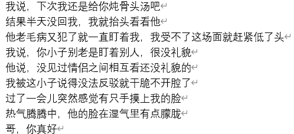
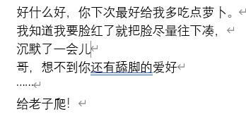
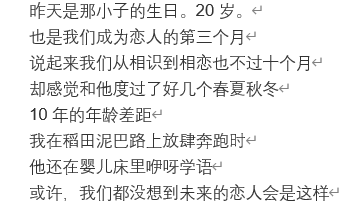
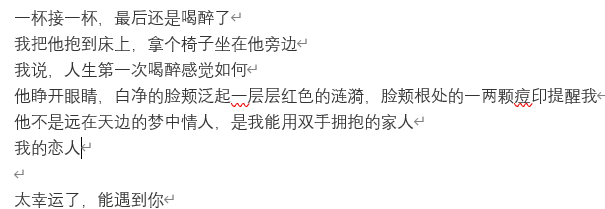

自从大学以后再也没谈过恋爱\.\.\.\.\.\.因为上次被伤得很重所以\.\.\.\.\.今年1月满30了，本来对这些东西都不是很奢望。  
去年7月搬到某城市郊区，打开了许久没打开的软件准备看看直播（听说成都帅哥多），然后发现有个没头像的25岁的人离我只有0m，应该是楼上或者楼下，然后就和他谈了起来，谈了很多才知道他资料是假的，只是个19岁刚刚复读完上大学的青年\.\.\.\.\.\.

            1楼 | 区卷麦石 | 2020-03-18 22:54

然后我本来不想和他谈的，结果他说他从来没有接触过我们这种人，让我和他谈谈分享一下

            5楼 | 区卷麦石 | 2020-03-18 22:56

然后我加了他的微信，就和他多谈了一会儿。  
他说他高中交过一个女朋友，然后发现完全没有任何兴趣，然后上网搜了搜，发现这种情况叫txl  
然后我准备以前辈的身份和他谈谈，结果他直接问我有没有男朋友，和男人谈恋爱的感觉是怎么样的

            7楼 | 区卷麦石 | 2020-03-18 22:59

不知道为啥我就鬼使神差地和他说了，说着说着他就说想和见一面

            8楼 | 区卷麦石 | 2020-03-18 23:00

哎，罪恶啊，我居然对一个青年起了歹心，就答应了周末晚上和他见面  
结果之后一直到周目我都被罪恶感折磨，但是想多了，还是被欲望征服了

            9楼 | 区卷麦石 | 2020-03-18 23:04

我们见面的时候在星期六晚上，约定地点就在小区的人工水池旁边，本来我还叼着烟的，胡子也没刮。但是一看见他我就心狂跳，我记得很清楚他确实看起来就是那种18，19的小弟弟，但是那样子直接让我想起了大学的那个人，说来都是惭愧，一个30的怪大叔居然有了小年轻谈恋爱的感觉

            11楼 | 区卷麦石 | 2020-03-18 23:07

然后我有点矜持地走过去，那小青年看见我了还给我打招呼而且还喊得很大声 x哥，你好啊（x是我得姓，不过隐私原因我就不透露了哈）然后就有点像小姑娘一样 有点就是那种 奇怪的 遇到喜欢的人的时候故意装矜持的感觉，就很冷漠走了过去。现在想想估计就是我那样子，给他留下我是高冷的人的印象

            12楼 | 区卷麦石 | 2020-03-18 23:12

跟他谈了很多，他全程都像小孩子一样特别好奇，什么都问  
然后就和他加了微信，然后聊了大概1小时，他就回去了  
原本我很无奈的，估计没后文了，毕竟哪个小年轻会喜欢怪大叔呢（主要是胡子没刮，气死了）

            13楼 | 区卷麦石 | 2020-03-18 23:15

之后一整个夏天没见面了，直到国庆的时候我单位放了几天假，就回自家屋子里想宅个几天  
然后在家里看纪录片（好像讲的是各种猫？），突然手机震了一下就看到他给我发信息了  
说实话，有点小激动的

            14楼 | 区卷麦石 | 2020-03-18 23:20

收到了上次的教训我这次特地打扮得稍微年轻了一点，还把胡子剃了，鬼知道我们两晚上一见面，他先是盯着我看了一会儿（差点被他看脸红—\-丢死人了），然后来了句：“你还是不刮胡子帅一点”

            15楼 | 区卷麦石 | 2020-03-18 23:22

那个，本人先把故事说完，你们再给我提意见把\.\.\.\.

            16楼 | 区卷麦石 | 2020-03-18 23:25

刚刚洗了个澡，回来接着说  
我听到他说我不挂胡子帅一些感觉有点好笑，txl的审美真的不一样啊，平常我不挂胡子同事都说我像个痞子  
然后他就和我聊，说他大学同班同学有个好娘的，而且公开说自己是那个，还主动和一个男的表白，结果被拒绝了。我问他他暴露自己身份没  
他说没，从初中就知道txl了，而且自己当初还觉得很恶心

            23楼 | 区卷麦石 | 2020-03-19 00:14

所以他知道自己是txl后，知道这个是社会的灰色人群，所以一直藏得很好。  
原本我还以为他很天真呢  
然后就和我讲大学里，他那个很娘的同学特别s，是个男的他都要上去撩一下，大家都知道他所以也大多数时候就笑笑。但是他自己觉得自己心里怪怪的，就是那种说不上讨厌，但是看见那个很娘的人去勾搭其他男的就很心烦  
我感觉自己凉了，先不说属性冲了（我是攻），这小子多半喜欢上人家了

            25楼 | 区卷麦石 | 2020-03-19 00:22

我这个人情商比较低，就直接问他是不是喜欢上人家了（现在想想估计是嫉妒心作祟）  
他没说话  
他越不说话我就越心烦  
然后过了半天他说他要走了  
我心里有点起火，这就走了，但也没说什么，然后没想到之后又没了联系

            27楼 | 区卷麦石 | 2020-03-19 00:29

然后就是11月份了，天气有点转凉，他大概是回来拿冬天衣服的，所以从学校回来了，正好我下班回家看见他提着一个大布袋，一个行李箱，看起来很吃力的样子。  
我就上去问他要我帮他不，他说一声好，我就帮他提了那个大布袋  
乘机瞄了一眼，全是夏天的衣服，这小子品味和我一样土  
结果提上了上去才发现他住在我家下面，猜对了  
要进去的时候他就给我说要我晚上去老地方见面

            30楼 | 区卷麦石 | 2020-03-19 00:48

我一听那个激动啊，  
结果一下去他就告诉我，他就告诉他谈恋爱了  
我问是那个娘的人吗，他说不是，是另外一个  
这个人他给我看了一眼照片，我有点酸溜溜的，就没仔细看  
大概是个长得白白净净的小年轻吧，戴个眼睛，脑袋圆圆的

            31楼 | 区卷麦石 | 2020-03-19 00:52

有点困了，我明天再接着讲吧，反正这几天也没啥事

            34楼 | 区卷麦石 | 2020-03-19 01:02

我年轻的时候大概也会喜欢这种类型\.\.\.\.\.\.  
我问他们是咋在一起的  
结果这小子说是社团认识的，原本没啥交集，结果一起办赛事准备的时候熟悉了，没认识多久，那白白净净的小年轻就这小子表白了现在的年轻人真的是，进展神速  
然后我问他你就这样和他轻易在一起了，你真的喜欢人家吗？  
他说我不知道（真是个渣男胚子）  
赶紧把他训了一顿，内容我自己的忘了，大概是让他别这么轻易地确定关系，不然会伤害到别人

            35楼 | 区卷麦石 | 2020-03-19 12:15

也不知道他是怎么想的，他沉默了一会儿后说 其实他自己也没啥感觉，然后问我我大学谈恋爱的时候是这样的吗？  
肯定不是啊！我大学的时候，谈恋爱感觉就跟搞地道战一样，两个互相看对眼的人，捏捏扭扭暧昧了一两年，终于我忍不住表了白终于才知道对方对我也有意思，然后又是捏捏扭扭谈了两年恋爱，连牵手接吻都要找个人少的厕所

            36楼 | 区卷麦石 | 2020-03-19 12:21

所以我就拿出长辈的样子狠狠训了他一顿（其实说话还是很温柔的，只是内容很严肃）  
他看起来就是心情不太好，就不咋说话。  
我看着他有点自闭的样子就有点慌，赶紧给他说自己说重了  
然后他就说了一句让我至今都很难忘的一句话  
谢谢你啊，从来没有人对我这么好过，x哥  
隐藏在我内心心中的少男之魂燃起来了

            37楼 | 区卷麦石 | 2020-03-19 12:25

也不知道那时咋了，就是你们懂的，特别特别想亲他，但是想到他还有男朋友，算了算了，一把年纪了就不掺和这些小年轻的事情了

            38楼 | 区卷麦石 | 2020-03-19 12:27

其实现在想想这小子还很会刺激我的内心的，说的话刚好扎在我心上  
后来也是他回大学读书了，然后我也接着上班。  
后来再见面就是元旦了

            40楼 | 区卷麦石 | 2020-03-19 12:30

元旦那天，我估摸着这小子多半放假了，就在阳台上抽烟，结果一直到晚上都不发信息给我  
有了男朋友就是不一样啊  
结果在阳台上抽着抽着，楼下阳台突然给我来了一句  
x哥，别抽烟了，我还以为你家起火灾了

            42楼 | 区卷麦石 | 2020-03-19 12:33

也不知道我在慌什么，烟没叼住就从12楼上掉了下去，幸好下面没人  
我就假装冷静地对他说 你回来了啊  
我往楼下望去，就看见他用一种奇异的姿态把头伸出阳台，大概就像是反身把身体朝着我一样（原谅我词穷）  
我说 你这样小心掉下去  
他说 在我掉下去之前 你能来老地方找我吗  
我肯定答应啊 但是还是强装冷漠 好吧

            43楼 | 区卷麦石 | 2020-03-19 12:39

到了老地方他张口就是一句 我分手了（太快了，恐怕一个月都不到吧）  
我有点惊讶 我就问他 为啥啊  
他就说 x哥你说的对，我一点也不喜欢他，我想通了，所以我不会祸害别人。  
我又问 那对方的反应呢  
他又说 对方骂了自己一顿，然后就拉黑了  
我\.\.\.\.\.\.  
那你们以后一个社团见面不尴尬啊  
他说 没事   
然后两个人又陷入了沉默

            46楼 | 区卷麦石 | 2020-03-19 13:04

我这里把名字重新打一遍吧，不然写起来太麻烦  
我姓许，他叫我许哥  
他名字有三个字，三个字里面有一个男性少见的“春”字，就直接称他为春吧

            47楼 | 区卷麦石 | 2020-03-19 13:07

然后我就问他 那你以后想干嘛  
他突然转过头来，一直盯着我（这小子不知道哪里来的习惯，这么喜欢盯人）  
本来我都习惯了的，但是他这次靠得我好近，都能闻到他身上的洗衣粉的味道（好像是薰衣草）  
然后，然后我就  
就羞得直接低头不敢看他了  
才发现这小子眼睛生得好看啊

            48楼 | 区卷麦石 | 2020-03-19 13:10

他就给我说他饿了，要不要陪他去吃饭  
我就带他去吃小区门口得烧烤摊（原本想让他吃点健康的东西的，结果他不干）  
大概就是吃饭的时候我才知道他的家庭背景  
他爸妈从他六岁就离婚了，因为他妈给他爸戴了绿帽，一直更着他爸，可惜他爸自从离婚以后，也没几天在家里，有时候会带些奇奇怪怪的阿姨（懂的都懂）回家，自己的性格从小就很孤僻内向，别人都觉得是他高冷

            50楼 | 区卷麦石 | 2020-03-19 13:15

我也是单亲家庭，不过是我压根就没见过我爹，我出生以前我爹就没了一直都和我妈在农村长大，一直到城里读大学才性意识觉醒

            51楼 | 区卷麦石 | 2020-03-19 13:18

我倒是吃过饭了，倒是看他在那里狼吞虎咽的，嘴角还有葱花，虽然别人眼里看起来有点邋遢，但是我看起来就巨可爱  
然后我就问他你喝酒吗？  
他说随便，以前没喝过  
我说那我们就不喝了  
他说跟你喝就不一样了  
我一听大喜  
然后直男地说 我说不行就不行

            53楼 | 区卷麦石 | 2020-03-19 16:13

我还是情商太低了，但是还是不怎么想让他喝酒。  
我从小就有一种不知道是占有欲还是保护欲吧，我不希望我喜欢的人受伤或是接触不良的习惯，但是往往我自己就有\.\.\.\.\.\.  
我大学好朋友说我找不到女朋友就是保护欲太强了\.\.\.\.\.\.\.可能他是委婉地说我不给恋人个人空间吧，我一直都在反省自己

            54楼 | 区卷麦石 | 2020-03-19 16:18

他听了我说不行后，也没说啥，吃了我100多大洋真能吃，要是以后能在一起，该咋养活啊  
我问他想回去了不  
他说不想，回去也是他一个人，他爸很少回来，一般都是在外面不知道和哪个野女人住，回来了两父子也基本不沟通，除了一点，就是要生活费  
我就说要不去走走？  
他答应了  
然后就并肩走  
我和他有一句没一句地扯家常，顺便偷偷用眼睛偷看他，侧脸越看越清秀（大概是情人眼里出西施？）  
突然想起大学的时候和室友扯的那些，看到一个漂亮的女生，连儿子的名字都想好了

            60楼 | 区卷麦石 | 2020-03-19 18:45

这南方的鬼天气，前几天还热得不行，现在就冷得要命  
我就一直在那里发抖（太丢人了），原本想搞得浪漫点的。  
结果和他搭话都不太认真，结果他回头就看见我在打颤  
他就问我冷吗，我说不冷  
他说才怪  
然后我们就刚好停在小区附近的河边  
没啥人，找了个公园里常见的座椅坐着

            61楼 | 区卷麦石 | 2020-03-19 18:48

在座椅上坐了一会儿，我真的很想装得很成熟的，奈何我这个人天生怕冷不怕热，就在那里不停的抖。  
然后他估计也发现我冷了，就一直盯着我（真是个坏习惯）  
当时周围没啥人，我们这边在河边也挺黑，真的有一瞬间回到大学和前任约会的感觉，也是这样在黑暗里享受甜蜜

            62楼 | 区卷麦石 | 2020-03-19 18:54

我还在那儿想着这鬼天气咋这么奇葩  
下一秒就感觉有温热的东西包住我握紧的双拳，抬头就看见他把手伸过来来了  
我这1m77的大汉哪里经得起这种诱惑  
就当时气血上涌，一个没忍住，直接把他抱进怀里了（写的我自己都脸红了）

            63楼 | 区卷麦石 | 2020-03-19 18:58

咋吞了我这么多楼

            68楼 | 区卷麦石 | 2020-03-19 19:12

算了，说下之前被吞的楼  
大概就是吃完了后他不想回去，因为他爹在外面鬼混，然后我们就去公园散步了

            70楼 | 区卷麦石 | 2020-03-19 19:18

我平时就算不小心受了多重的伤，或者是在单位上生活上精神上有多么大的打击，我都会坚强  
至少装得坚强  
但是不知道我到底中了什么邪，在这孩子面前我真的  
不知不觉就想把身上全部的脆弱给他看  
也不知道我是憋了太久的情绪，还是真的真的太需要一个人陪我了  
我记得我抱得很紧很紧  
然后他说有点痛了，我才反应过来把他放开

            74楼 | 区卷麦石 | 2020-03-19 20:02

我抬头就看见他满脸通红，这才反应过来我  
 越界 了  
那时候真的甜蜜过后满是尴尬  
我不知道咋面对他，两个人就定在那里了  
我好像说我喜欢他，但就是开不了口\.\.\.\.\.我潜意识里还是觉得他是个孩子  
突然感觉自己好像一个qj犯  
他也没说话，我也不知道过了多久，他才开口回去吧  
我说好  
两个人回去的时候都没说话，直到他从电梯走出去我才反应过来  
他转过头来看看我，不过这次没有盯着看，就是那种瞄一眼然后马上转身就走了  
我一进我的屋子，我就想给自己一巴掌

            75楼 | 区卷麦石 | 2020-03-19 20:10

我真的好讨厌这种感觉，这种无力的感觉，明明喜欢的人就在眼前  
自己却表现得像个s b，还没有能力把他留在身边  
自己可能没有获得幸福的能力吧\.\.\.\.\.\.  
我那天晚上失眠了，我好想看见他给我发信息，什么都好  
没有  
一直到天亮都没有  
我太困了，直接就睡过去了  
下午我起来的时候也没有  
第二天也没有  
他走的那天也没有  
那几天真的感觉被拉回了大四毕业时和前任分手后如同在地狱的日子

            76楼 | 区卷麦石 | 2020-03-19 20:15

记得前任离开我的时候说的  
txl是这个社会的灰色面，不会消失，也不能正大光明。被人看作异类的感觉，被看作怪物的眼神，让他很绝望。他决定回老家结婚，所以就走了。  
我没有拦住他，老实说我也产生了一样的想法，但是最后还是没有做到  
我没办法欺骗一个女孩子，想到我要和不爱的人生活在一起我就觉得绝望

            78楼 | 区卷麦石 | 2020-03-19 20:23

我以为我和他已经不会有什么交集了，没想到1月份末的时候，我在家里炒菜的时候就接到他的电话了（之前把电话给他了，我把他电话删了，没想到他还存着我的\.\.\.\.\.\.）

            79楼 | 区卷麦石 | 2020-03-19 20:27

1月份末还没过除夕夜，疫情还没有夸张到封小区的程度（非湖北地区）  
打电话的时候电话里半天没声音，我还以为是信号有问题。  
我喊喂喊了半天，没听到他的声音  
我正打算挂了的时候，听见他的声音  
明明之前就已经想好不要和他接着接触了  
结果一听见他的声音就心软了  
他叫我去老地方等他  
因为接近过年，小区的人更少了  
结果我打开门，他就在门口。  
两个人就站在门口也不说话，他盯着我，我也盯着他。  
有好多话想对他说，但是刚到嘴上马上又死死咽了下去

            80楼 | 区卷麦石 | 2020-03-19 23:15

沉默了一会儿，我原本还想让他进屋的。  
他结果直接说想让我陪他去小区走走  
我答应了  
那天风有点大，但是我没感觉，我其实之前已经想过很久了。  
就算我能和他在一起又能怎么样了，这样年轻的人真的会知道一个大叔内心希望的是什么？他或许有青春年华  
但是我是耗不起的，无论是年龄还是心理，都不允许我再浪费感情了

            82楼 | 区卷麦石 | 2020-03-19 23:35

走到了熟悉的老位置，就在人工池旁边  
他突然转过头来  
好像是做出什么重大决定一样开了口

            84楼 | 区卷麦石 | 2020-03-19 23:37

他说  
那天以后，他原本想远离我，想逃避我，他不想和一个大他那么多岁的人搞这些有的没的。  
他说他做不到，他说他有一种奇怪的感觉，无论是对高中的女朋友还是大学里那两个小男孩都没有过的感觉  
他想到我会烦，可是还是会止不住地想我  
他说和他爸爸生活在一起的时候，从来没有渴望过被他爸爸疼爱过，甚至想过既然是他妈妈先犯的错，那么自己就像是一个野种一样，他爸爸不丢了他都应该感恩戴德了

            85楼 | 区卷麦石 | 2020-03-19 23:44

他开始扯其他的话，好像把多年来的苦水都不保留地倒出来来了。  
我感觉眼中原本有点混沌黑暗的他，逐渐清晰明了，我在等一句话  
只要那句话出现，我就可以主动，可以为他扛起一起

            86楼 | 区卷麦石 | 2020-03-19 23:46

终于来了  
他说  
我喜欢你

            88楼 | 区卷麦石 | 2020-03-19 23:47

已经不重要了，真的，人生以前所有的悲伤都好像是铺垫。  
明明城市已经禁止放烟花了，我耳边却轰隆作响

            89楼 | 区卷麦石 | 2020-03-19 23:49

不知道用用扯的还是拉的  
反正他已经在我怀里了  
然后我对他说  
跟哥好吧，哥会一辈子对你好的

            90楼 | 区卷麦石 | 2020-03-19 23:51

好啦，我知道这一段写的有点矫情了，但是毕竟是人生重大时刻

            91楼 | 区卷麦石 | 2020-03-19 23:51

关于表白说的这段话，其实我很想说说其他的  
比如我爱你 我对你一见钟情 我喜欢你这些话  
但是可是能出于本能吧星\.，我还是说了不怎么浪漫的话

            94楼 | 区卷麦石 | 2020-03-19 23:58

不过这个和我一直以来的爱情观也有关联  
我一直觉得爱情不是儿女情长，而是同舟共济  
所以我觉得 我对你好 就是最大的爱了

            96楼 | 区卷麦石 | 2020-03-20 00:00

那天晚上接下来我和他说了什么，我是怎么回家的，都没有特别深的印象。  
终于我有充足的理由可以接近他了，  
以恋人的身份。  
不过，在甜蜜的劲儿过后，之前想的问题再次冒了出来。  
我的确真情实意，他会是吗？  
我真的有那么好的福气，能跟一个这么年轻纯粹的人走在一起吗？  
我突然有点郁闷，本来打算摸出烟来抽的  
结果手机突然震了一下  
 晚安，哥。  
看到这句话，我无意识地叹了口气。  
我相信他

            106楼 | 区卷麦石 | 2020-03-20 09:29

没过几天就要过年了，我得回老家去看望我妈去，没法呆在他身边。  
这小子倒是城里人，不用回家。  
我回老家前一天让他上来吃饭，乘吃饭的时候我问他他过年怎么过  
他说就那样吧，反正之前一直都是一个人过的  
我突然心一紧 就问他 你爸爸不回来吗？  
他告诉我，他爸与其呆在他旁边，过年时更愿意呆在一个姓张的阿姨旁边，或许对他爸来说那阿姨才是家，自己反而像个累赘  
我心疼他，就问他愿不愿意和我一起回老家  
他说好  
我又问 到时候他爸回来怎么办  
他说 从他14岁以后他爸过年就没呆在家里过\.\.\.\.\.\.

            107楼 | 区卷麦石 | 2020-03-20 09:39

然后就开始整理回家的行李，我早就准备好了，就打算帮他搞一下。  
第一次进他家  
一进他家，我就觉得有点\.\.\.\.\.  
很脏乱，啤酒瓶 瓜子壳 脏外套 果皮\.\.\.\.\.\.\.  
我本身虽然也不是太爱干净，但是这么脏乱我有点接受不了  
但是一进他的房间，就感觉什么叫天壤之别了  
他的房间很干净，而且还弥漫着一股清新剂的香味。  
但是让我有点难过的是，这个房间一点个性都没有，你让谁来住我都觉得不会有差别。一点他的影子都没有，就只是干净。

            108楼 | 区卷麦石 | 2020-03-20 09:46

他看见我不动了，就问我  
哥，你怎么了，不开心吗，对不起啊，我家比较脏，我也不想打扫外面。  
傻孩子啊，哥是心疼你。哥巴不得你来和哥住，怎么能让你一个人受这种苦。  
不过我没说话，只是摸了摸他的头  
他突然笑了  
哥，你好傻  
我说 哥中意你才显得傻

            109楼 | 区卷麦石 | 2020-03-20 09:50

收拾衣服的时候倒是没有其他事情了，就是乘机多看一眼他穿的内衣内裤  
处于个人爱好

            111楼 | 区卷麦石 | 2020-03-20 09:52

带他回家我想了好多理由。  
最后还是决定说他父母出国了，所以看他可怜带他回来一起过年。  
我娘还算热情好客，所以倒是和他处得很愉快。  
除夕夜那天早上，我和我娘准备包饺子，这小子当然不会，不过说自己要学。  
捏了半天真是\.\.\.\.\.\.只能说捏得很有艺术天赋了  
这时候我娘拉肚子跑去上厕所，我就和他坐在院子里捏  
他问我 哥 面粉可以吃吗  
我说 可以 但是为啥要生吃面粉  
我话还没说完他就往我脸上一亲  
我这个人容易脸红，就感觉脸上一烫  
我问他 干嘛啊  
他说 你脸上有面粉 我帮你吃了

            114楼 | 区卷麦石 | 2020-03-20 10:00

大年三十晚上我们家一向都没有看春晚的习惯，个人感觉春晚的风格还是更适合北方人一点。  
我娘在那里炖鸡肉，我和他没啥事可以干。我就让他跟我去村上走走。  
他说好  
村子里很暗，灯光绝大部分都来自于路边的人家或者是在街上放烟火的小孩。  
我带他尽量往人少的地方走  
这不解风情的小子给我来了句  
哥，你是要qj我吗

            122楼 | 区卷麦石 | 2020-03-21 10:12

我说 就算哥再喜欢你也不会这么早把你给办了，哥会对你负责的。  
黑暗中，他靠近我，然后我就感觉他的手把我得手给裹住了  
我反手把他的手攥在手中  
我第一次牵他的手  
虽然天很冷，却能感觉到我和他手掌温度的传递。  
我俩都不说话，静静地享受这人生不多的甜蜜时刻  
看得出来他很是紧张，他的手掌是湿热的，明显出了汗，大概每个青年的恋爱都是被青春的幸福和紧张填满的吧。  
等我们绕了一圈，又回到了我家门口，光再次出现，我看见他脸色微红。  
他看着我，那份隐抑的笑意和激动藏在他的表情之中

            123楼 | 区卷麦石 | 2020-03-21 10:22

我摸了摸他的头  
高中语文老师告诉我，有时候不需要多少话语也不需要多少形容词  
最深刻的感情往往藏在动作之中。  
txl最擅长的爱就是抑制而激烈的爱，两个男人眼底藏着的炽热在黑暗里交融  
喜欢你，反而显得多余

            124楼 | 区卷麦石 | 2020-03-21 10:33

这天晚上，也是我们第一次一起睡觉。  
我娘一脸嫌弃地看着我  
你可不要在你床上翻来覆去的，从小就喜欢睡觉了以后乱动，不知道有多少次掉到地上去了。  
我有点无语，亲妈真是不给我一点面子  
她又问，你啥时候找个老婆回来啊，三十的人了。  
我说 遇到了自然会带回来的。  
她又说 也是，我也不逼你，你妈最希望的是你能和喜欢的婆娘过日子，喜欢一个姑娘就一定要全心全意对她好。  
我说 肯定的  
等我回到我的房间，就看见他坐在小板凳上望着我  
哥，你会结婚吗？  
我说  
不会，你不离开哥，哥一辈子守着你

            126楼 | 区卷麦石 | 2020-03-21 10:49

已经凌晨一点半了  
当然此处是没有相拥而眠的刺激场面的。  
第一是，他不习惯  
第二是，我不习惯  
不过确实是睡得比以前香的

            127楼 | 区卷麦石 | 2020-03-21 10:54

带他在村子里玩了一两天，便又开车带他回城里去。  
路上我问他喜欢听什么歌，一开始我猜的是欧美的或是日本的，虽然我也不知道为什么，就我遇到的同类，大多数都喜欢这些。  
他想了一会儿才说了是 那些花儿，又说朴树是他最喜欢的歌手  
我也挺喜欢朴树的歌的，不过比起他的平凡之路  
我还是觉得那些花儿更能触动人的心，我觉得这首歌更细腻也更真实。

            129楼 | 区卷麦石 | 2020-03-21 11:02

我以前一直在想，txl的爱情没有婚姻没有孩子，没有了约束，这样两人怎么才能走到最后。所以其实我一直对我们这样的人的爱情有一种悲观的态度。  
我见过太多都是先从肉体上萌芽的爱情，第一次见面就开始肌肤上的接触，过不了多久因为相互的厌倦而分开。  
txl的爱情好像只有夏天和冬天，灼热后就是寒冷，这么大的热胀冷缩，再坚固的爱情也会出现裂缝

            130楼 | 区卷麦石 | 2020-03-21 11:09

或许还差一个春天  
也是为什么我对他一开始的印象就很好  
他的名  
昭春

            131楼 | 区卷麦石 | 2020-03-21 11:12

回到城里后，没多久疫情便爆发了，我问他他爸回来了没  
他说他爸给了他生活费，让他自己解决。  
我真的有种想狠狠揍他爸一顿的冲动，再怎么样也是自己的亲儿子。真是够让人讨厌的。  
听说小区要限制出行了，我便开始打算让他住到我家里来，虽然人不多，但是两个男人的饭量还是很大的。  
我便带他去菜市场买菜，发现菜市场的人都差不多跑光后又跑到超市去看，虽然剩下的菜也不多了，但是还是够我和他的消耗的。加上从我娘那儿也拿了不少东西，基本上能吃几个星期。  
我问他有什么忌口的  
他说除了鱼他什么都吃  
我说那太好了，我也不爱吃鱼。  
其实对于这场疫情，我一开始也是不大看重的，武汉封城后我才意识到事情的严重性，不过家里也有常备的口罩，回老家时分了点口罩给我娘，剩下的也够我们用。  
他倒是一直不咋担心，青年都这样吧，大大咧咧又冒冒失失  
也是看到我年轻时候的影子。

            143楼 | 区卷麦石 | 2020-03-22 19:57

大概和他商量了一下，他家就在我家楼下，所以也不用拿多少衣物，他大概拿了几件冬天穿的衣服和一套睡衣，就是到我家去住了。  
我家有两个卧室，一个我住的，另一个修出来专门用作客房。  
我问他 你是想住客房还是和哥一起睡  
他笑笑说 哥，你不要问这种明知故问的问题好吧  
我拉拉他的手 这次不怕哥qj你了？  
他说 谁qj谁还不一定呢

            144楼 | 区卷麦石 | 2020-03-22 20:04

这小子不说别的，吃相真的难看，不知道的还以为我虐待他了

            147楼 | 区卷麦石 | 2020-03-22 20:15

吃完饭后，这小子屁咧屁咧跑去把碗洗了  
他说，哥以后你做饭，我洗碗  
我说，好，那你可要刷干净了  
我坐在沙发上，一边看看电视上的新闻一边看他在厨房忙活  
大概就是那个瞬间吧，我感觉到了平静日子里绵长的温馨  
人真是越老，越容易被小细节小场景所感动  
这或许就是生活吧

            150楼 | 区卷麦石 | 2020-03-22 20:23

等到一切都忙活完后，他静静从厨房走了出来，坐在我身边  
我很自然地用左手搂住他的腰  
他也不抵触，身子往我这边移了移  
他看看我，我看看他  
一切都很自然  
我往他的脸颊上亲亲一吻

            152楼 | 区卷麦石 | 2020-03-22 20:30

这是我第一次亲他，当然忍了很久，不过一切都是值得的。  
他脸颊泛起浅红  
两个人都很懂，不需要语言  
毕竟这种时刻  
享受就对了  
作为天生享乐派的我，唯一的人生指导思想就是  
活着，而且好好活着

            153楼 | 区卷麦石 | 2020-03-22 20:34

到睡觉的时候，这小子平时喜欢开黄腔跟我耍混的，结果真到要和我睡的时候倒是安分下来了，  
上次老家那次也是，我一爬上床他就一句话不说的，我还以为他被我挤到了呢。  
我说，咋了，你咋在还在害羞呢？不是要上你哥吗？  
他说，下次上，这次太累了  
我笑笑不说话  
我让他往里睡睡，然后关灯爬上了床  
想到他不喜欢和别人贴着睡，我就故意留了点空隙  
躺下了大概10分钟左右，我脑子还是在想和他亲热的那场景  
他突然转了一个身，面朝我  
我感觉到他反身过来了就说 咋了，我挤到你了？  
他说，哥，抱我吧  
我懂的，我往他那边靠靠，就把他搂着了  
他突然问我，哥，你到底喜欢我什么啊，明明你可以找到比我好的  
没有安全感的恋人才会向对方提出这样的问题  
我说，怎么了，想让哥和你说情话啊  
他说，才不是，我就想让你保证  
我说，保证什么  
他说，保证你绝对不会离开我  
我说，嗯，哥答应你

            159楼 | 区卷麦石 | 2020-03-22 21:57

我知道昭春他内心因为家庭的原因，大部分时间都是自己一个人走过来的，可能很少感受到被关心，加上他又把母亲出轨，破坏家庭的罪名都安在自己身上，所以一直都既渴望被爱也害怕被爱。  
我以前高中交过女朋友，也是我的初恋，也是因为安全感而分手的，记得她写个小纸条上面写了一大段话，我都没看完，现在唯一的印象就是那矫情的几句话  
我不知道你是不是爱我，我感觉你不爱我，我感觉你的心不在我这里  
虽然现在想起来非常幼稚，不过现在大多数爱情也是因为这个原因解体的。

            160楼 | 区卷麦石 | 2020-03-22 22:04

问问这小子的初恋，也是个姑娘  
倒是迷迷糊糊在一起，迷迷糊糊分开。  
这小子分手那天逃了一天的课，据他说因为装得一手好病所以没被请家长。

            161楼 | 区卷麦石 | 2020-03-22 22:07

话说这小子整天念叨的精灵宝可梦是什么，搜了搜居然是以前看的神奇宝贝

            162楼 | 区卷麦石 | 2020-03-22 22:10

2月到来，疫情依然严峻，单位上决定延期上班，我倒是无所谓，毕竟能多陪陪这小子我自己也很高兴。  
这天吃完饭后，昭春跑去睡午觉，我没有睡午觉的习惯，便坐在阳台上玩玩手机，突然想看看多年没有打开过的qq，正无聊地看着曾经自己空间的幼稚的记忆，突然看到一条前任去年的动态。  
“我结婚了，愿我们天长地久。“  
看见他穿着西装的样子，青春容颜已镶入岁月痕迹，俊朗再添成熟。  
那新娘也很美。  
我也不清楚他是真心爱她，还是利用女孩来遮掩他自认为污点的性向  
在我的潜意识里宁愿相信是前者。  
谈不上伤心，只是感叹。  
望望门掩着的卧室上躺着的青年  
还好有你

            177楼 | 区卷麦石 | 2020-03-23 18:18

我平时性格比较温水，少怒容易满足，遇到外人时也少言，朋友不多，但每个都值得信任，大多也知晓我这不算秘密的秘密。  
昭春性格则是一丝青竹染铜斑，虽然可以感受他少年的热情，但又能体会到他相比同龄人那份从容的成熟。  
流水青竹，相衬得宜。  
“般配啊“  
电话上告诉自己多年的兄弟，他第一句话就是这个。  
作为一条裤子穿到大的直男兄弟，从大学向他坦白后他倒是一副无所谓的样子，除了平时会用男人这个话题开几句黄腔以外，从来没有疏远我，除了感激之外我也再无他言。、  
“不过那小子会喜欢你这糟老头子，算是你孝敬兄弟我修来的福气。”  
那真是感谢你了。

            178楼 | 区卷麦石 | 2020-03-23 18:18

“不过你知道吧，你那人，结婚了。”  
“这么多年了，我早就知道你放下了。”

            179楼 | 区卷麦石 | 2020-03-23 18:19

放下，谈何容易。  
从我娘把我生下来开始，就像我灌输一生只有一人的观念。  
所以我30岁前的两段感情，倒是冲击到了我这扎在心窝的价值观。  
撕心裂肺谈不上，大概每次都是我被甩，这种伤倒是像静脉被割破了一样，在随后的几年不停地出血。  
前任前脚刚走的时候对我说，我结婚你要来  
我说，好  
等到他后脚跨进车站的大门  
我坐在车站门口的石凳上，抽了好几个小时的烟，然后拿出手机把他的联系方式删了个精光，qq没删，因为那时基本不用了。  
到现在没得肺癌，倒也真像前世修来的福气了。

            180楼 | 区卷麦石 | 2020-03-23 18:19

从我和昭春真正在一起的第一天起，我就在想  
我是不是把他当作替代品了呢？被母亲抛弃，被父亲冷遇，或许他心中的伤比马里亚纳海沟还深。若是他再知道我把当作前任的替代品，会不会雪上加霜。  
我那时有点触动，就走进卧室里看着他  
除了微微的呼吸声，整个房间宁静平和  
我再次打量了他，浓眉明眼挺鼻淡胡须  
几年前，我娘送我出行时突然下起了雨  
我说，我这次出去可能很久不会回来了  
她说，我知道，我怕你孤单  
我说，我一个大男人怕啥子孤单  
她说，幺儿，这世上没的人不怕孤单，我可比你晓得勒多  
我说，莫得事  
她说，会有人等你勒，这日子还长的勒  
那时我坐在烂车站公交车上，望着已经二十多年守寡的娘  
   
会有人等你的。

            181楼 | 区卷麦石 | 2020-03-23 18:19

写了好多沉重的东西……活跃下气氛我开点黄腔吧  
我个人的性癖就是对 腿毛很是感兴趣  
刚好这小子有点白的小腿上，长了一层刚好不多不少的腿毛  
真的性感，哈哈  
（别骂我猥琐）

            182楼 | 区卷麦石 | 2020-03-23 18:20

过了几天，日子实在是磨人，又没法去散步，我便潜心给他变着花样做菜  
西南地区的人喜辣，辣能驱湿气，缓解疼痛、健胃消食。  
尤其是2月中旬南方仍然寒冷，辣亦能驱寒  
看了看冰箱的存量，估摸着给这小子做顿川味火锅  
我问他，有多吃得辣  
他说，有多辣搞多辣  
我说，吃那么多辣椒你不怕得痔疮啊  
他说，痔疮什么的，你没听过十个男的九个疮吗  
我说，那我可不准你吃这么辣  
他说，没事，我得了那玩意我也不在意  
我说，哦，没说你，我担心我的幸福  
他说，有我你还不幸福吗？  
他突然反应过来，爆了句粗口  
卧槽

            198楼 | 区卷麦石 | 2020-03-24 19:38

肉价飞涨，跑去问了问肉价，已经超过四十了，幸好我娘心疼我，多给了我几斤刚宰的猪肉，不然怕是一边吃肉一边心里掉肉，这小子又是典型肉食动物，我就多放了点肉。除了猪牛鸡肉外，素菜也就也就洋芋，莲藕，金针菇，折耳根（鱼腥草）之类的。  
我还和他特地把餐桌给搬到了阳台边  
香油，香菜，碎姜，蚝油，鸡精，小米辣，盐还有大头菜  
浇上锅里热腾的辣油，点活佐料的本味  
这小子和我一样爱吃醋，就多放了点醋  
两个醋瓶子  
夹起一块毛肚，伴着香辣热油进碗与佐料相辅相成  
入口，香辣味沿着舌间延伸至口腔，满口辛香多滋味。  
活着真是太好了。

            199楼 | 区卷麦石 | 2020-03-24 19:39

我以为吃这么辣，这小子多半半夜要喊胃疼，结果晚上他倒是真的喊了不舒服，结果疼的不是胃而是小腿  
这种症状长身体的时候多发，通常是因为缺钙，小腿酸疼，不过我也不是啥医生，就用了用土方法。  
专门用锅煮了沸水，然后倒入盆中，撒上点盐。虽然不知道有没有用，但是心理作用肯定是有的，用手测了测温度，放点凉水，然后让他把赤脚丫子放进去。  
看着他一边忍着酸疼一边说水烫，我倒是挺无奈的，看得我有点心疼，就伸手进去帮他揉揉脚

            202楼 | 区卷麦石 | 2020-03-24 19:41

            208楼 | 区卷麦石 | 2020-03-24 19:51

            209楼 | 区卷麦石 | 2020-03-24 19:52

居然被这小子摆了一道，睡觉的时候我有小郁闷，就故意没理他。  
过了一会儿，我有点迷糊的时候，突然感觉腰上缠上一双手，我一下就激灵了  
感受到脖颈上的鼻息，我还是转了身过去，他的右腿缠上了我的左腿  
我看着他，他看着我  
我问，我能亲你吗  
他说，嗯  
于是，双唇相拥。  
不激情，不肉欲，也非蜻蜓点水，只是普通的一个吻  
我能感受到他嘴唇上一层淡淡的未长熟的绒毛，还有刚刚刷完牙，口里留存的柠檬香气。  
他笑笑，哥你的胡子好扎人哦  
我没说话，心情没有想象中激动兴奋，就是流水过蹊，柔情清风罢了。  
多浪漫  
夜里偷欢。

            210楼 | 区卷麦石 | 2020-03-24 19:52

额，最近复工潮，我单位上的工作有点小忙，更新可能会少一点，秉持大家厚爱了，我会把该写的想写的写完的

            211楼 | 区卷麦石 | 2020-03-24 20:02

又这么过了几天，青年突然变得愁眉苦脸起来  
看起来有点心事  
我问他，咋了  
他说，我亲妈好像找上门了  
我说，怎么了  
他说昨天有个陌生人加他微信，然后他同意了以后，对方直接表明了身份，说自己是他母亲，聊了一会儿把他的名字学校生日，父亲名字都说出来了，对方一直情绪有点激动，问他在疫情期健不健康，吃不吃得好，然后打了几千块钱给他，他没敢收，对方还要求视频。

            252楼 | 区卷麦石 | 2020-03-26 20:50

我听了也有点迷惑，就问他的打算  
他说，我从7岁以后就没见过我妈了，她长什么样子我都不清楚，但是还是很想见她，但是又很纠结  
我说，这种事情还是看你自己，你不想见就不见，想见哥陪你见  
他点点头，打算就这天晚上见一面  
然后整天就看见他特别紧张，一直心神不宁的样子，可以理解，毕竟十多年没见过的母亲，紧张是当然的。  
不过我倒是很好奇，为什么一个丢下老公儿子跑了的女人还会有脸面回来见儿子，难道是良心发现了？可能我对出轨的人都隐隐怀有鄙视的感情存在，我一直把他母亲脑补成一个典型的精明但不聪明的小女人形象

            253楼 | 区卷麦石 | 2020-03-26 20:50

但是真的在笔记本上视频见面的时候，真是让我大吃一惊。  
一个很文雅的女士，戴着眼镜，看起来气质非常好，头发面容都打理得很好，除了一些不多的皱纹以外完全看不到岁月蹉跎的痕迹  
我坐在青年右边，他看起来很是不自在，手脚一直都感觉无处安放  
我偷偷把手从视频死角伸过去握住了他的右手，他转过头来看看我，笑了一下，便深呼吸了一下，开始这段十年不见的母子对话

            254楼 | 区卷麦石 | 2020-03-26 20:54

对话一开始很尴尬，但是之后可能还是血浓于水吧，两人的对话逐渐自然起来。他母亲注意到了我就问我是谁，我说我是他邻居，他爸不在我看他一个人不方便就接他过来住，她倒是没多问，顺便接了句听起来真假参半的道谢。

            255楼 | 区卷麦石 | 2020-03-26 20:55

对话逐渐多了起来，从身体健康聊到疫情再聊到生活  
他母亲突然问了一句  
你爸爸对你还好吗

            256楼 | 区卷麦石 | 2020-03-26 20:59

我心一紧，果然他的脸色瞬间不好了，他母亲也意识到自己说错了话  
之后有点语无伦次了起来，一直到视频结束，他都没有再说一句话  
破碎的家庭，每一块玻璃，都是这么容易伤人。

            257楼 | 区卷麦石 | 2020-03-26 21:01

尴尬的对话随着他母亲一句无关痛痒的道歉和关心作为结尾  
我把电脑关机，他一直低着头，看起来很是受伤  
他突然抬头笑了笑，没事了，哥，我习惯了，早知道我就不见面了。  
我虽然没见过亲爹，但是我妈一直对我都很好，而且她很能干，一边供我读书一边努力挣钱，所以缺失父爱对我来说，并没什么大不了。  
只是这青年，或许是太不幸了点。  
今夜无云，也注定无眠

            258楼 | 区卷麦石 | 2020-03-26 21:02

我问他，想去看看月亮吗  
他说，好  
我给他戴了个口罩，也给自己了个  
两个人窜上了楼顶，我和他坐在一个台子上，没哪家在这时期晾了衣服，楼顶看起来很是空旷。他眼神有些飘渺地看着天上的月亮  
只有月亮，没有星星。

            259楼 | 区卷麦石 | 2020-03-26 21:03

我不说话，让宁静平息悲伤。  
他突然看过来，我没有避开目光  
我说，  
哥陪着你的，你放心吧  
他贴近我，头躺上我的肩，我伸手，搂住他的腰  
他说  
我知道，哥

            260楼 | 区卷麦石 | 2020-03-26 21:04

稀星月，无云夜  
   
雀未归，影相随  
   
思化枕，悲作衾  
   
同聚首，殊途归

            261楼 | 区卷麦石 | 2020-03-26 21:10

其实我昨天和他父亲见面了，谈了很久  
有点超乎我的预料  
考虑到叙述的连贯性，我会在之后详细说的

            262楼 | 区卷麦石 | 2020-03-26 21:20

2月下旬，单位复工  
本来听说他要上网课，我还特地把客房给腾了腾，结果他的父亲回来了，他便重新回到自己家中。  
原本被填满的家突然又好像变得空旷，心里有些空荡荡的感觉  
一开始上班，单位处理的事情实在是太多，不得不多加班，每天回来大概也就更晚了一些，两个人的面对面的交流开始减少，每天都是在微信互道晚安  
陪他的时间不多，我感觉有点愧疚，他倒是一直很懂事，没有埋怨我。  
有天晚上，我正打算睡觉，突然就被敲门  
我打开门，门外就是他。  
多日不见，我喜上眉梢，拉着他的手就是一顿亲热  
欣喜之余，我问他有什么事  
他说，我特地溜出来陪你睡觉的，感动吧  
我说，不怕你爸发现吗  
他说，没事他今天喝酒去了，估计第二天起来也要中午了  
我笑笑没说话，打算陪他聊聊天

            272楼 | 区卷麦石 | 2020-03-27 09:57

结果在床上聊着聊着我就一不小心睡着了  
等我醒来，就发现我自己在他怀里，我比他高，他还特地把身子往上移了点  
我还从来没被这么被动式抱过，不过感觉还是挺好的  
 他还没醒，我从枕头底下摸出手机一看还有点时间  
我便把头贴近他的胸，一边享受这不多的时刻，一边听到他胸腔里的跳动  
过了一会儿，他也醒了  
他说，哥，抱着你睡真舒服  
我说，下次让你抱，哥要去上班了  
他上午没课，我在刷牙刮胡子，他就在一旁看着我  
他说，哥，我决定每天都来找你睡觉了  
我说，行，只要你不嫌弃哥累到睡着就行  
他说，没事，只是想跟你呆在一起

            273楼 | 区卷麦石 | 2020-03-27 09:57

我穿好衣服，正在门口穿鞋，抬头望了一眼他  
突然有一种微妙的感觉  
大概就是媳妇送丈夫上班的感觉  
他看我穿好鞋了，就说  
你不来点电视上经常演的吗  
我说，我懂  
一个清晨的吻  
我出门时回头看他，他在门口看着我  
那一眼，有了家的感觉

            274楼 | 区卷麦石 | 2020-03-27 09:58

2月末，又是一天加班日，已经是晚上10点了  
和同事一一道别以后，我最后离开了单位，我从高中就养成了最后一个离开的习惯  
即使到现在，也喜欢这样  
因为单位离家不是很远，平时没有太多运动机会，所以这段距离一般都是走路回家  
原本有点疲劳，结果刚刚下楼就看见他蹲在门口  
因为距离路灯有点远，比较昏暗，我一开始还以为我看错了，走出去两步才猛回头  
他说，咋了，看见旧情人都不认了  
我说，你在这儿干啥  
他说，太想你了，就跑出来找你了  
我笑笑，哥也想你

            287楼 | 区卷麦石 | 2020-03-29 13:24

我前几天告诉他我单位在哪里，他刚好认得路我是没想到的  
于是两个人就一起走回家  
街头两边都种了小榕树，因为枝繁叶茂可能会影响到光照和用电安全原本打算年后修减一下的，结果没想到疫情爆发日子便往后拖了，不过因为这样，反而散步起来很有别样的情趣

            288楼 | 区卷麦石 | 2020-03-29 13:24

我从口袋拿出原本打算回家给他的东西  
钥匙  
为了不让他每天都花时间来发微信问我在不在家，我也不是每次都能回他微信，所以想着给他配一把  
他说，这是什么啊  
我说，钥匙啊，给你的  
他说，哥，你就这样把你家的钥匙给我了  
我说，不是我家的，是我们家的  
他笑笑没说话，把手伸过来用小指头勾我的小指头  
我特别怕痒，就直接把他的手牵住  
为了不让路人看见，两个人默契地靠近彼此，用夜色和衣服遮住了牵着的双手  
隐抑的热烈潜藏在彼此时隐时现的影子里

            289楼 | 区卷麦石 | 2020-03-29 13:25

突然想起没有他以前，我是这样，一个人走在这条凄清的夜路上  
自己是怎么忍受那磨人的孤独的呢  
人果然是越不寂寞越怕孤独  
打破宁静，我向他诉说了自己的感受  
他也表示也有同样的心情  
原本自己一个人的时候，他在家也能玩手机磨过晚上，结果现在一到晚上就心慌得不行，满脑子都是想看到我，不然今天也不会出来找我了

            290楼 | 区卷麦石 | 2020-03-29 13:25

聊着聊着，他就开始提到他高中的事情  
高四的时候，他没有什么朋友，每天晚上也是10点放学  
原本10点的时候，街头本应该很冷清，因为高中放学，街头再次热闹起来  
每天放学，他都拿着个mp3，戴着耳机，穿过嬉笑的人群，往冷清的家走去  
每天都是一个人上学，一个人吃饭，一个人学习，一个人回家

            291楼 | 区卷麦石 | 2020-03-29 13:26

嘴上说着不需要  
其实也是想要有人陪伴吧

            292楼 | 区卷麦石 | 2020-03-29 13:26

他说，哥，我知道我还很小，你怕我太年轻会不会不那么愿意一直和你在一起  
我没说话，他说的对，即使心里再喜欢他，年龄都是一道巨坎，我不是确认他是不是愿意把青春给一个不再年轻的人  
夜静得让人发慌  
我转过头去，他也转过来看我

            293楼 | 区卷麦石 | 2020-03-29 13:27

此刻，万籁俱寂  
他说，  
哥，我爱你

            294楼 | 区卷麦石 | 2020-03-29 13:28

不好意思啊各位，昨天陪那小子玩去了

            296楼 | 区卷麦石 | 2020-03-29 13:29

不过我以前也没想到原来蜡笔小新这么好看

            298楼 | 区卷麦石 | 2020-03-29 13:40

3月2日春小雨  
最后一天加班，老板说再也不加班了，他也要累死，终于可以每天早一点回家陪那小子了  
今天再次被同事打趣了和单位上一个小姑娘的绯闻，不知道只是去年聚餐后偶然送回家一次就能被传这么久的绯闻，我也是醉了。那姑娘估计之后也被其他人带偏，一看见我就脸红，以前直接喊我老大，现在感觉以前开放的氛围都没有了。  
今天一开门我还以为遭了小偷，我这么一个不太经常打理房子的人，房子居然变得这么干净，走到客厅就看见亲爱的躺在沙发上，睡得很沉，大概猜到他估计闲着没事把卫生做了，去把洗漱工作做完后，叫醒了他  
我问他洗脸刷牙没，他迷迷糊糊地回答说洗了，之后我就叫他去床上睡，他说好，然后半天没动，我只好把他抱到床上去，这小子还挺沉的。  
等他躺好后，我才到床上去，他睡沉了我却半天睡不着，只好在这个点跑来傻兮兮地写日记。  
最近我在想该以后怎么叫他，原本想叫他媳妇的，结果考虑到他好像也是攻，这么讲他好像不会乐意，毕竟以后在床上我也不一定是在上面的，算了，也许以后会冒出合适的称呼。  
这小子昨天说他爹居然问他晚上去哪里了，不过他压根没理，甚至连看都没看一眼，他爹也没再接着问了。不过就算他爹找上门我也正好骂一下他爹。  
希望以后日子会越来越好吧  
真想和你度过一生

            328楼 | 区卷麦石 | 2020-04-01 17:45

3月开头，这地方却又开始降温，天气变冷，有点担心他会不会受寒，问他缺不缺衣服  
他却说，不知道哪个人当初冷得发抖还要我来给他取暖  
我说，哥那是体质天生怕冷  
他说，没事，以后你冷你就到我怀里来就行了，我喜欢抱你  
我有点无语，不过还是考虑要不要给他添件衣服，不过最近附近开店的也少  
正考虑着这小子就贴过来了  
我说，你别亲哥的下巴胡子，哥怕痒  
他说，刮都刮了让我黏会儿你  
突然有一个念想闪到我脑子里，还没想清楚先脱口而出了  
我问他，你不会想要了吧  
他突然放开我，然后盯着我，脸突然以极快的速度变红，然后有点颤抖地说  
放屁！  
我后知后觉才意识到问了个处男不应该问的问题，不过我也想使坏，就说  
没事，年轻人嘛有那个需求很正常，你说一声，哥时刻等你洗好  
看着他脸越来越红，心里有点暗爽  
然后他就说他要上课了就一路跑回自己家去了，安静下来后我就坐在沙发上笑，然后点了根烟，就算我的第一次也没有这小子那么害羞，不过我还真暂时没有这个打算，还得再等段日子，现在还太早了。  
傻小子，你以为哥不想啊

            329楼 | 区卷麦石 | 2020-04-01 17:45

周末单位放一天假，所以周六下班后就回家打算给这小子做顿饭  
想着家里还有猪肉，就跑去超市买了点蒜苗，发了个微信让他上楼吃饭。  
脱了领带，穿好围裙  
在厨房劈里啪啦搞了一阵后，给他做了个三菜一汤  
尤其是回锅肉，我可是很有心得的  
正得意把菜放到桌上，看到他坐在旁边，一脸羞红地看着我  
我说，你咋了  
他说，哥，你穿围裙好可爱

            351楼 | 区卷麦石 | 2020-04-02 17:55

吃饭时，突然想开点酒荤，就拿了瓶酒出来，他看到说也要喝，我没反对，毕竟小饮还是怡情的。  
我和他吃饭时都不爱说话，不过这次有点不同，毕竟男人嘛，喝酒的时候就是交心的时候。  
于是和他开始东扯西扯，从他初中的时候吃一个女孩子的醋跟同班一个男同学打了一架结果没打过到我高中给初恋写情诗结果被损友同桌发现，跑到班上大声朗读，还好那时班上除了我和初恋还有同桌之外就没几个人。  
那个有点懵懂的时期，我们都一样啥都不懂，觉得喜欢就是占有就是把爱像山洪倾泻  
我们又聊  
从他高中生了一次大病他爸除了来办住院手续出院手续和交钱外都是他一个人躺在病房里，羡慕地看着隔壁永远有父母陪伴的小妹妹  
到我刚刚工作不久，住在公司宿舍，偶尔放假舍友都跑去上网约会，我一个人坐在陌生城市公园里的座椅上，看着远处不断晃动的人群  
不需要隐藏，我们都把心中名为孤独的伤口暴露给对方  
我们这样的人，这样又普通又不普通的人，每一个夜里独自舔舐伤口的时刻都是为了有勇气去相遇。

            352楼 | 区卷麦石 | 2020-04-02 17:55

吃完饭后就带他去散步，突然有一种老年生活的感觉  
一边看着河边延绵不绝的柳树，只一抹昏亮留存在脚下的路灯  
这景色  
一个人是孤独，一对人成温馨  
我牵着他的手，他牵着我的手  
突然大悟  
我要的不是永远爱你  
而是  
陪你一起  
   
变暖了，应该是春天来了

            353楼 | 区卷麦石 | 2020-04-02 17:56

这小子喜欢夜跑，就拉着我一起跑  
我们就围着小区外围跑  
他这一跑，可把我折腾坏了，虽然大学的时候经常跑步，但是这么多年了虽然身材保持得还不错，但是体力可就不如以前了  
他就一直跑在我前面，一会儿停下来看看我一会儿停下来偷偷笑我  
他说，哥，你能跑快点吗，你的腹肌白长的吗  
我说，你怎么知道我有腹肌  
他说，我和你抱着睡那么久了，当然知道  
我说，你小子再大声点，我们就可以原地出柜然后结婚了  
他说，好啊，我们去大草原上办结婚典礼吧  
我说，没钱  
在大草原上办结婚典礼，还挺不错的

            396楼 | 区卷麦石 | 2020-04-07 16:22

跑完了，我累的满头大汗，他倒是除了额头上出了点汗就是脸变红了点。  
我俩坐在小区里的长凳椅上，我在一旁喘气，他就在一边笑  
他过来拍拍我的背  
看来以后还是要多带你出来跑步  
我说，下次别跑那么快  
他往我脸上吧唧一下，说好  
我说，再让我歇会儿再上楼  
他说，没事，哥，老公疼你  
……\.  
你有病吧

            397楼 | 区卷麦石 | 2020-04-07 16:23

本来要上楼的，结果他说想买点饮料喝  
就走到超市旁边，我让他进去买我就在外面等着  
我在外面吹冷风就听见一对牵着手的母子的对话  
小孩说，妈我要喝水  
母亲，可以，但是不能喝可乐  
小孩，为啥子喃  
母亲，因为老子是你妈  
小孩，哼，我恨你  
母亲，没事，我爱你就行了  
对话还挺有趣的，我就在旁边偷偷乐  
过了一会儿，他跑出来，手里多了瓶橙汁  
刚刚出完汗，冷风也应时地吹过来，整个人突然特别畅快  
我就说，你只买一瓶是不想给你哥喝啊  
他说，我和你一起喝  
于是他就让我先喝，我也不客气，咕噜噜就喝下半瓶  
他拿过我递给他的饮料，也咕噜噜地把剩下的喝完  
然后那个瓶子以一道完美的抛物线进了垃圾桶  
我两偷偷走到阴影处，默契地牵上了手

            398楼 | 区卷麦石 | 2020-04-07 16:23

回到家里，他跑去洗澡，结果刚刚走到浴室门口，然后从里面探出头，  
哥，我们一起洗吧  
我说，  
爬

            399楼 | 区卷麦石 | 2020-04-07 16:23

买了两个银戒指，其中一个内环刻上他名里的 春 字  
另外一个刻的是我名里的一个字  
等他马上生日的时候把带春的那个送给他  
另外一个  
等这段感情他大学毕业后，如果还能相伴彼此  
我就用来向他求婚

            401楼 | 区卷麦石 | 2020-04-07 16:33

3月12日阴天  
突然晚上有点饿了，主要是今天没怎么吃饭，太忙了  
问了下这小子也想吃东西  
翻了下冰箱才拿出挂面  
下了碗面，结果这小子在旁边一直说要多点醋  
一不小心就加多了  
那个酸味，啧啧，真的是现在想起来牙齿都在发酸  
可是下了这么大碗面不吃太浪费了  
他说，哥，我们一起吃吧  
我说，好  
我拿了两双筷子，然后他吃了一口  
看着他表情慢慢扭曲，我笑出了声音  
他说，你也吃一口  
我说，我不吃  
他说，你不吃我就喂你吃  
我只好吃了一口，然后感觉我的面部在抽搐，然后他也在那里笑个不停  
然后剩下的时间，我们就一人吃一口，在两个人不停的面部变化下终于吃完了这面  
我可能相当长的一段时间都不想吃面了  
   
吃完饭这小子就跑去洗澡了  
这小子比我爱干净多了，每天早起洗漱完后没课就跑去扫地拖地  
然后把我两的衣服拿去洗，洗衣机难洗的就用手洗  
久而久之我身上的衣服也有一股薰衣草的淡香了  
每次回到家看着干净的屋子心情都特别好  
结果他说早知道就不帮我洗衣服了  
我说，为啥，你嫌弃你哥啊  
他说，不是啊，现在你衣服上还有被子里都没有你的味道了  
我说，那真是可惜了  
他说，没事，现在多了一种味道  
我说，啥味道  
他说，家的味道  
臭小子，就知道惹你哥脸红

            454楼 | 区卷麦石 | 2020-04-10 23:31

3月13日  
今天单位下班太晚，已经快半夜了  
特别忙，忙到人都有点麻木了  
大街上能听到有对小情侣在吵架，不过有点距离倒是听不太清楚，大概又是什么你根本不懂我之类的  
有点烦躁  
走到小区外，忘了带门卡，我又不太想让保安帮我开门，就在旁边等了一会儿，等到一个女人把门打开我才走进去，才发现我已经恍惚地站在门口几分钟了  
小区有点暗  
突然发现我家阳台的灯是亮着的，一抬头  
就看见那小子站在阳台上朝我挥手  
我拿出手机  
12：18  
突然眼睛有点湿润  
   
这么晚了你怎么还没睡  
哥，  
我在等你回家

            455楼 | 区卷麦石 | 2020-04-10 23:31

最后一次和他父亲解决问题  
结果如下，我带走他  
房子以及全部家具归他，4年内打40万直到大学毕业，大学毕业后再打5万给他  
换取的是，按他父亲说的话，最好以后永远不要见面，他父亲不会回来了  
经济法律问题我特意咨询了一下律师，大概都处理好了，我原本想他父亲大概不会打钱，不打钱我也养得起他，但是房子一定要是那小子的，确定了房产证是他的名字，不过他昨天给我说他的银行卡多了10万，是确实收到了钱  
不过法律上是不承认父子断绝关系的，我担心这男人会不会老了以后强迫昭春出钱养他  
特别忐忑，除了这些经济问题以外，我还特别担心他的情绪问题，虽然他一直都表现得很坚强，我会多花时间陪这小子的  
毕竟除了我妈他就是我唯一的家人了

            497楼 | 区卷麦石 | 2020-04-13 18:34

抱歉各位，最近要处理的事情太多了，更新会迟缓许多

            498楼 | 区卷麦石 | 2020-04-13 18:38

和他父亲的见面我会放到明天更新，我还得去一趟律师事务所和民政局

            500楼 | 区卷麦石 | 2020-04-13 18:43

第一次和他父亲有接触是在3月15日晚上，我收到到一个陌生人的好友微信申请  
同意了以后他直接表明了身份（后来我才知道他是通过我单位上一个同事知道我的微信的，同时知道我的名字住址工作单位）  
而且在我发问之前就说  
我知道你们两个的关系，我们找个时间出来谈谈  
他看起来很急，想把时间直接定在明天，我说下周我工作很忙至少要到下下周，他同意了  
第二天，那小子醒了以后我把这件事情告诉了他。  
他真的一点都不慌，他说迟早这一天都会来的，反而越早越好。吃完饭后我去上班，他表示他要回家和他父亲谈一谈，我原本想让他别去，但是仔细想了想还是让父子之间谈一下更好一些  
那天上班我整个人都有点心神不宁，这时那个同事才告诉我他的一个朋友（也就是那个父亲）要了我的电话号码和微信号，至于他到底是怎么知道我们两的接触的，我想这么频繁的同行也很难不为人所知，我觉得有点后怕的是，他是怎么知道我的名字和工作单位的。  
我只担心一点，担心我们两个的性取向被暴露，不管你愿不愿意承认，在中国，不喜欢我们这样的人始终占大多数，而且一旦这个东西被其他人所知道，会对家庭，工作，人际关系产生非常大的影响  
好在他父亲始终没有向外宣传我两的关系  
等我回到家里就看见他坐在沙发上，一脸冷静地看着我，他说他人生第一次和他爸爸吵架了，不过与其说是吵架，不如说是他单方面的情绪爆发，他父亲一直都非常冷漠地和他说话。  
这么多年积累的委屈愧疚和孤独，原本以为可以引起一次爆炸，反而掏心窝的话语最终还是贴在了冰层上，这冰层甚至比原本想象得还要厚  
那个时候我看着丧失了往日神采的他，内心比刀割还难受，我甚至不知道怎么去安慰他。  
晚上他告诉我，他要回家住一会儿，他打算自己冷静一下，我没说话。于是他就走回去了，而且这一走就走了10天，甚至连一个微信都不回我。  
说实话，我有点感觉我们这段关系结束了  
于是我在18号喝醉了以后在半夜开了一个帖子  
这大概也能说明为什么我现在和开头的文风有别了很多吧  
其实那之前看到吧友的祝福，我都感觉到窒息

            519楼 | 区卷麦石 | 2020-04-14 21:00

一直到25日晚上，也就是我和他再次见面，还有他的父亲  
这里大部分的茶馆都已经恢复营业了，所以见面时就在茶馆见面  
他和他爸不是一起来的而是他先来  
他来了看了我一眼，然后马上低下头坐到我的斜对面  
然后他爹来了，长得很像他，感觉就是略微年长一点的版本  
我原本把他想成那种非常蛮横的恶大叔，结果他的衣装和面容整理却让我感觉他像是某种上层人士  
同样出乎我意料的是，我以为他会说出“不要再靠近我儿子了“”你这恶心的txl“之类的话  
结果他拿了一根烟给我我没接，然后直接称呼我的大名  
他问我是不是真的喜欢他儿子  
我说是  
他居然笑了  
然后就提出了一个他所谓的解决措施  
他给他的儿子40万，再给我10万，然后说除了大学出了真正很大的事情必须要家长出面，否则就不会再回这里，他打算去城北某区  
我直接拒绝了  
之后气氛很僵，大家都不说话  
也不知道他抽了多少根烟，他就说你自己再想想吧，然后就走了，没带他儿子  
我和他就坐在茶馆里两个人一直都没说话  
我一直低着头，感觉突然有种很难过的感觉，有种无力又绝望的感觉  
结果突然他说了一句  
哥，你长白头发了  
我没忍住，感觉泪水就在眼睛里打转，上次哭已经是很久很久以前了，大概是高三的时候。这种酸楚感感觉好遥远又好深刻  
然后他拉拉我的手，我抬头，他示意我去厕所  
这个茶馆的厕所里面只有两个蹲位，而且刚刚有人在里面抽过烟，厕所有一股奇异的臭味  
我刚进去他就亲上来了，同行的还有他的舌头  
我没什么印象了，只感觉亲了好久好久，亲完发现他也哭了，之后什么都感觉有点模糊。

            520楼 | 区卷麦石 | 2020-04-14 21:01

之后和他重新谈了一下，他打算直接搬过来和我住了  
他说那钱我最好就要了，他那爸爸他已经不认了，比起他爸来说我更像亲人，两个人一起过最好多要点钱。  
我没敢反驳，说实话能和他在一起我已经是幸运至极了  
于是下次见面就是4月12日最终解决方案确定了，也就是我昨天更的内容

            521楼 | 区卷麦石 | 2020-04-14 21:02

昨天他爸的姐姐来了，给了他几千块，一直在骂他爸是个\*\*  
明天就是他的生日了，希望新的一岁他能平安幸福吧

            522楼 | 区卷麦石 | 2020-04-14 21:03

            569楼 | 区卷麦石 | 2020-04-16 17:55

生日我没买蛋糕，他说他不喜欢蛋糕的味道  
甜到油腻  
于是我就还是做了传统的火锅  
辛辣又熟悉  
再喝个过瘾吧，就当是生命的新开始  
把悲伤烂醉在过往里  
吃饭时我把戒指拿出来给他了  
他问我，哥，你应该也要戴一个戒指啊  
我说，我不傻，我还没你这小年轻陪我一辈子的底  
他说，咱们都这样相依为命了，你还不信我啊  
我笑笑说，那就做一个约定吧，四年后我就戴另一个  
他说，嗯

            570楼 | 区卷麦石 | 2020-04-16 17:56

            572楼 | 区卷麦石 | 2020-04-16 17:58

他伸手握住我的手，有点模糊地说  
哥，你帮我起来  
于是我把他扶起来，背贴着床背  
他把头埋进我的右胸，我左手握住他的左手，右手从他背后绕过去牵住他的右手，双肘收紧他抱在心口  
他说，有好多话想给你说  
我说，不需要了，哥都知道，让哥多抱会儿你  
他说，嗯

            573楼 | 区卷麦石 | 2020-04-16 17:58

世界安静下来，只剩下空气里的醉酒味，脸上红热的灼烧感  
还有彼此的心跳

            574楼 | 区卷麦石 | 2020-04-16 17:58

在山里面走失的孩子，穿过森林，穿过河流，穿过稻田  
看到彩虹，看到大雨，看到星空  
他穿过这些美景，走到一座破旧的草屋前  
里面有蜡烛摇曳的昏亮  
这是世界上唯一只属于他的东西  
他捧起蜡烛，唱起歌谣  
穿过彩虹当空的森林，大雨倾盆的河流，星空璀璨的稻田  
呼唤另一个走失的孩子  
等另一个孩子捧起自己的蜡烛  
来到自己的身边  
   
这是一个家，一个灯火长明的归乡

            575楼 | 区卷麦石 | 2020-04-16 17:59

这个贴之后可能很长一段时间都不会更新了  
考虑到隐私安全问题  
或许之后有什么大事情或者心血来潮了会回来告诉大家一下近期情况  
我也没想到自己醉酒写的贴子能有这么多人喜欢  
但愿在这么多朋友的见证下，能够和他长长久久吧  
祝福大家  
祝愿大家能找到自己的灯光  
总有灯火，为你长明

            576楼 | 区卷麦石 | 2020-04-16 18:02

